# OpenVLA: An Open-Source Vision-Language-Action Model

## 中英对照全文阅读（nature-reader）

| 项目 | 内容 |
| --- | --- |
| 标题 | OpenVLA: An Open-Source Vision-Language-Action Model |
| 作者 | Moo Jin Kim\*, Karl Pertsch\*, Siddharth Karamcheti\*, Ted Xiao, Ashwin Balakrishna, Suraj Nair, Rafael Rafailov, Ethan Foster, Grace Lam, Pannag Sanketi, Quan Vuong, Thomas Kollar, Benjamin Burchfiel, Russ Tedrake, Dorsa Sadigh, Sergey Levine, Percy Liang, Chelsea Finn（\* 共同一作） |
| 机构 | Stanford University; UC Berkeley; Toyota Research Institute; Google DeepMind; Physical Intelligence; MIT |
| 论文类型 | 方法 / 模型论文（generalist robot manipulation policy, VLA） |
| arXiv | 2406.09246v3 |
| 项目主页 | https://openvla.github.io |
| 源文件 | `2406.09246v3.pdf`（与本文件同目录） |
| 页数 | 37 页（正文 pp.1-11，参考文献 pp.11-20，附录 pp.21-37） |
| 抽取方式 | pypdf 文本层抽取（可选文本 PDF），图形部分按 PDF 坐标 300 DPI 裁切 |

**阅读方式**

每个内容块都有稳定锚点（`S###` 正文、`C###` 图注、`F###` 图、`T###` 表），并给出 `**Original:**` 原文与 `**中文:**` 译文。图表以卡片形式插在**首次实质性讨论**的位置，图注与图表放在一起；若图表在 PDF 版式中出现得更早/更晚，卡片中会用 `**Placed near:**` 标注实际插入位置（形如 `p.3 S012`）。若同一图表在后文再次被提及，会以链接形式回指，不重复插图。

**页面索引（按论文顺序）**

| 页码范围 | 内容 |
| --- | --- |
| p.1 | 标题、作者、Fig. 1、摘要 |
| p.2-3 | 摘要（续）、1 引言、2 相关工作 |
| p.4-6 | 3 The OpenVLA Model（3.1 预备知识、3.2 训练流程、3.3 训练数据、3.4 设计决策、3.5 训练与推理基础设施） |
| p.6-7 | 4 The OpenVLA Codebase |
| p.7-11 | 5 Experiments（5.1 多机器人平台直接评测、5.2 数据高效适配、5.3 参数高效微调、5.4 量化推理） |
| p.11 | 6 Discussion and Limitations、Acknowledgments |
| p.12-20 | References（参考文献表 [1]–[117]，见下文"参考文献"一节的压缩条目） |
| p.21 | Appendix A 数据混合明细（Table 3） |
| p.21-32 | Appendix B 评测任务与详细结果（B.1 BridgeData V2 WidowX、B.2 Google Robot、B.3 数据高效适配） |
| p.32-33 | Appendix C RT-2-X vs. OpenVLA（BridgeData V2 对比细节） |
| p.33-35 | Appendix D 消融实验（D.1 训练数据、D.2 双视觉编码器、D.3 微调 vs. 冻结视觉编码器、D.4 量化推理与推理速度解耦） |
| p.36-37 | Appendix E LIBERO 仿真实验（E.1 设置、E.2 结果，Table 12） |

---

## p.1 标题页 · Fig. 1 · 摘要

**Source:** p.1 S001

**Original:** OpenVLA: An Open-Source Vision-Language-Action Model. Moo Jin Kim\*, Karl Pertsch\*, Siddharth Karamcheti\*, Ted Xiao, Ashwin Balakrishna, Suraj Nair, Rafael Rafailov, Ethan Foster, Grace Lam, Pannag Sanketi, Quan Vuong, Thomas Kollar, Benjamin Burchfiel, Russ Tedrake, Dorsa Sadigh, Sergey Levine, Percy Liang, Chelsea Finn. https://openvla.github.io

**中文:** OpenVLA：一个开源的视觉-语言-动作模型。作者：Moo Jin Kim\*、Karl Pertsch\*、Siddharth Karamcheti\*、Ted Xiao、Ashwin Balakrishna、Suraj Nair、Rafael Rafailov、Ethan Foster、Grace Lam、Pannag Sanketi、Quan Vuong、Thomas Kollar、Benjamin Burchfiel、Russ Tedrake、Dorsa Sadigh、Sergey Levine、Percy Liang、Chelsea Finn（\* 表示同等贡献）。项目主页：https://openvla.github.io

**Source:** p.1 C001

**Original:** Figure 1: We present OpenVLA, a 7B-parameter open-source vision-language-action model (VLA), trained on 970k robot episodes from the Open X-Embodiment dataset [1]. OpenVLA sets a new state of the art for generalist robot manipulation policies. It supports controlling multiple robots out of the box and can be quickly adapted to new robot domains via parameter-efficient fine-tuning. The OpenVLA checkpoints and PyTorch training pipeline are fully open-source and models can be downloaded and fine-tuned from HuggingFace.

**中文:** 图 1：我们提出 OpenVLA，一个 7B 参数的开源视觉-语言-动作模型（VLA），在来自 Open X-Embodiment 数据集 [1] 的 97 万条机器人回合（episode）上训练。OpenVLA 为通用机器人操作策略树立了新的最优（state of the art）。它开箱即可控制多种机器人，并可通过参数高效微调快速适配新的机器人领域。OpenVLA 的模型检查点与 PyTorch 训练流程完全开源，模型可从 HuggingFace 下载与微调。

### Fig. 1. OpenVLA 总览：数据、模型与开箱多机器人控制

**Placed near:** p.1 S001
**Source:** p.1 C001

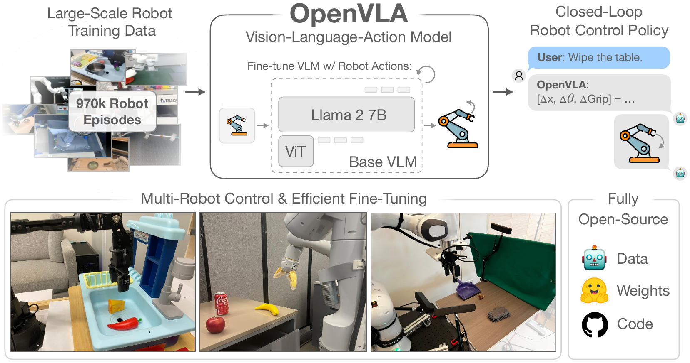

**Original caption:** Figure 1: We present OpenVLA, a 7B-parameter open-source vision-language-action model (VLA), trained on 970k robot episodes from the Open X-Embodiment dataset [1]. …

**中文图注:** 图 1：我们提出 OpenVLA——一个 7B 参数的开源 VLA，在 Open X-Embodiment 数据集 [1] 的 97 万条机器人回合上训练。它开箱即支持多机器人控制，并可通过参数高效微调快速适配新机器人领域；模型权重、数据与代码完全开源。

**Reading note:** 左半部分说明训练数据规模（970k 机器人回合）与基座 VLM 的构成（ViT 编码器 + Llama 2 7B）；右侧展示"语言指令 → 动作 token → 机器人执行"的闭环控制流程以及模型能力清单：多机器人控制、高效微调、完全开源（数据/权重/代码）。

**Source:** p.1 S002

**Original:** Abstract: Large policies pretrained on a combination of Internet-scale vision-language data and diverse robot demonstrations have the potential to change how we teach robots new skills: rather than training new behaviors from scratch, we can fine-tune such vision-language-action (VLA) models to obtain robust, generalizable policies for visuomotor control. Yet, widespread adoption of VLAs for robotics has been challenging as 1) existing VLAs are largely closed and inaccessible to the public, and 2) prior work fails to explore methods for efficiently fine-tuning VLAs for new tasks, a key component for adoption. Addressing these challenges, we introduce OpenVLA, a 7B-parameter open-source VLA trained on a diverse collection of 970k real-world robot demonstrations.

**中文:** 摘要：同时在大规模互联网视觉-语言数据和多样化机器人示教数据上预训练的大模型策略，有可能改变我们教机器人新技能的方式：不必从零训练新行为，而是微调这类视觉-语言-动作（VLA）模型，即可获得鲁棒且可泛化的视觉运动控制策略。然而，VLA 在机器人领域的广泛采用仍面临两个困难：1）现有 VLA 基本是闭源的，公众无法获取；2）已有工作没有探索面向新任务的高效微调方法，而这正是能否被采用的关键环节。针对这些挑战，我们提出 OpenVLA：一个 7B 参数的开源 VLA，在 97 万条真实世界机器人示教的多样化集合上训练。

**Source:** p.1 S003

**Original:** \*: denotes equal contribution. Correspondence to: moojink@stanford.edu, pertsch@berkeley.edu, skaramcheti@stanford.edu. 1 Stanford University, 2 UC Berkeley, 3 Toyota Research Institute, 4 Google Deepmind, 5 Physical Intelligence, 6 MIT, † Work done in part while at Google Deepmind.

**中文:** \*：表示同等贡献。通讯作者：moojink@stanford.edu、pertsch@berkeley.edu、skaramcheti@stanford.edu。1 斯坦福大学，2 加州大学伯克利分校，3 丰田研究院，4 Google DeepMind，5 Physical Intelligence，6 麻省理工学院；† 部分工作完成于 Google DeepMind 任职期间。

## p.2 摘要（续）· 1 引言

**Source:** p.2 S004

**Original:** OpenVLA builds on a Llama 2 language model combined with a visual encoder that fuses pretrained features from DINOv2 and SigLIP. As a product of the added data diversity and new model components, OpenVLA demonstrates strong results for generalist manipulation, outperforming closed models such as RT-2-X (55B) by 16.5% in absolute task success rate across 29 tasks and multiple robot embodiments, with 7x fewer parameters. We further show that we can effectively fine-tune OpenVLA for new settings, with especially strong generalization results in multi-task environments involving multiple objects and strong language grounding abilities, and outperform expressive from-scratch imitation learning methods such as Diffusion Policy by 20.4%. We also explore compute efficiency; as a separate contribution, we show that OpenVLA can be fine-tuned on consumer GPUs via modern low-rank adaptation methods and served efficiently via quantization without a hit to downstream success rate. Finally, we release model checkpoints, fine-tuning notebooks, and our PyTorch codebase with built-in support for training VLAs at scale on Open X-Embodiment datasets.

**中文:** OpenVLA 以 Llama 2 语言模型为骨干，并配有一个融合 DINOv2 与 SigLIP 预训练特征的视觉编码器。得益于数据的进一步多样化和新的模型组件，OpenVLA 在通用操作任务上表现强劲：在跨 29 个任务、多种机器人本体的评测中，其绝对任务成功率比闭源模型 RT-2-X（55B）高 16.5%，而参数量仅为其 1/7。我们进一步证明，OpenVLA 可被有效微调以适应新场景，尤其在涉及多个物体的多任务环境中泛化结果优异、语言 grounding 能力强，并在绝对成功率上超过 Diffusion Policy 这类表达力强的从零模仿学习方法 20.4%。我们还探讨了计算效率：作为一项独立贡献，我们展示 OpenVLA 可以通过现代低秩适配（LoRA）方法在消费级 GPU 上微调，并通过量化高效部署，且不损失下游成功率。最后，我们发布模型检查点、微调 notebook，以及内置支持在 Open X-Embodiment 数据集上大规模训练 VLA 的 PyTorch 代码库。

**Source:** p.2 S005

**Original:** 1 Introduction. A key weakness of learned policies for robotic manipulation is their inability to generalize beyond their training data: while existing policies trained for individual skills or language instructions have the capacity to extrapolate behaviors to new initial conditions such as object positions or lighting [2, 3], they lack robustness to scene distractors or novel objects [4, 5] and struggle to execute unseen task instructions [6, 7]. Yet beyond robotics, existing foundation models for vision and language such as CLIP [8], SigLIP [9], and Llama 2 [10] are capable of these types of generalization and more, stemming from the priors captured by their Internet-scale pretraining datasets. While reproducing this scale of pretraining for robotics is still an open challenge — even the largest robot manipulation datasets [1, 11] only have 100K to 1M examples – this imbalance suggests an opportunity: using existing foundation models for vision and language as a core building block for training robotic policies that can generalize to objects, scenes, and tasks beyond their training data.

**中文:** 1 引言。机器人操作学习策略的一个关键弱点是无法泛化到训练数据之外：已有的针对单一技能或语言指令训练的策略，虽能把行为外推到新的初始条件（如物体位置或光照）[2, 3]，但对场景干扰物或新物体鲁棒性不足 [4, 5]，也难以执行未见过的任务指令 [6, 7]。然而在机器人之外，CLIP [8]、SigLIP [9]、Llama 2 [10] 等视觉与语言基础模型却具备这类泛化能力甚至更强，其来源是互联网规模预训练数据所刻画的先验。尽管在机器人领域复现这种规模的预训练仍是开放难题——即便最大的机器人操作数据集 [1, 11] 也只有 10 万到 100 万条样本——这种失衡恰恰提示了一个机会：把已有的视觉与语言基础模型作为核心构件，用来训练能够泛化到训练数据之外的物体、场景和任务的机器人策略。

**Source:** p.2 S006

**Original:** Towards this goal, existing work has explored integrating pretrained language and vision-language models for robotic representation learning [12–14] and as a component in modular systems for task planning and execution [15, 16]. More recently, they have been used for directly learning vision-language-action models [VLAs; 1, 7, 17, 18] for control. VLAs provide a direct instantiation of using pretrained vision-and-language foundation models for robotics, directly fine-tuning visually-conditioned language models (VLMs) such as PaLI [19, 20] to generate robot control actions. By building off of strong foundation models trained on Internet-scale data, VLAs such as RT-2 [7] demonstrate impressive robustness results, as well as an ability to generalize to novel objects and tasks, setting a new standard for generalist robot policies. Yet, there are two key reasons preventing the widespread use of existing VLAs: 1) current models [1, 7, 17, 18] are closed, with limited visibility into model architecture, training procedures, and data mixture, and 2) existing works do not provide best practices for deploying and adapting VLAs to new robots, environments, and tasks — especially on commodity hardware (e.g., consumer-grade GPUs). We argue that to develop a rich foundation for future research and development, robotics needs open-source, generalist VLAs that support effective fine-tuning and adaptation, akin to the existing ecosystem around open-source language models [21–24].

**中文:** 为实现这一目标，已有工作探索了将预训练语言模型和视觉-语言模型用于机器人表征学习 [12–14]，以及作为模块化系统中任务规划与执行的组件 [15, 16]。更近期，它们被用于直接学习视觉-语言-动作模型（VLA）[1, 7, 17, 18] 以完成控制。VLA 是把预训练视觉-语言基础模型直接用于机器人的一种实现方式：直接微调 PaLI [19, 20] 这类视觉条件语言模型（VLM）来生成机器人控制动作。通过建立在互联网规模数据训练的强基础模型之上，RT-2 [7] 等 VLA 展现出令人印象深刻的鲁棒性，以及泛化到新物体和新任务的能力，为通用机器人策略设立了新标准。然而，有两个关键原因阻碍了现有 VLA 的广泛使用：1）当前模型 [1, 7, 17, 18] 是闭源的，外界难以了解其模型架构、训练流程和数据混合方式；2）已有工作没有给出把 VLA 部署并适配到新机器人、新环境和新任务的最佳实践——尤其是在普通硬件（如消费级 GPU）上。我们认为，为了给未来研究与发展建立丰厚的基础，机器人领域需要开源、通用、且支持高效微调与适配的 VLA，就像围绕开源语言模型 [21–24] 已经形成的生态那样。

**Source:** p.2 S007

**Original:** To this end, we introduce OpenVLA, a 7B-parameter open-source VLA that establishes a new state of the art for generalist robot manipulation policies.¹ OpenVLA consists of a pretrained visually-conditioned language model backbone that captures visual features at multiple granularities, fine-tuned on a large, diverse dataset of 970k robot manipulation trajectories from the Open-X Embodiment [1] dataset — a dataset that spans a wide range of robot embodiments, tasks, and scenes. As a product of increased data diversity and new model components, OpenVLA outperforms the 55B-parameter RT-2-X model [1, 7], the prior state-of-the-art VLA, by 16.5% absolute success rate across 29 evaluation tasks on the WidowX and Google Robot embodiments. We additionally investigate efficient fine-tuning strategies for VLAs, a new contribution not explored in prior work, across 7 diverse manipulation tasks spanning behaviors from object pick-and-place to cleaning a table. We find that fine-tuned OpenVLA policies clearly outperform fine-tuned pretrained policies such as Octo [5]. Compared to from-scratch imitation learning with diffusion policies [3], fine-tuned OpenVLA shows substantial improvement on tasks involving grounding language to behavior in multi-task settings with multiple objects.

**中文:** 为此，我们提出 OpenVLA：一个 7B 参数的开源 VLA，为通用机器人操作策略建立了新的最优结果。¹ OpenVLA 由一个可捕捉多粒度视觉特征的预训练视觉条件语言模型骨干构成，并在来自 Open-X Embodiment [1] 数据集、涵盖多种机器人本体、任务与场景的 97 万条机器人操作轨迹上微调。得益于更高的数据多样性与新的模型组件，OpenVLA 在 WidowX 与 Google Robot 本体上的 29 个评测任务中，以 16.5% 的绝对成功率优势超过了此前最优的 VLA 模型 RT-2-X（55B 参数）[1, 7]。我们另外研究了 VLA 的高效微调策略——这是此前工作未探索的新贡献——覆盖从物体抓放到清理桌面等 7 个多样化操作任务。结果显示，微调后的 OpenVLA 策略明显优于 Octo [5] 这类微调的预训练策略；与用扩散策略 [3] 从零做模仿学习相比，微调后的 OpenVLA 在"多任务、多物体场景中把语言 grounding 到行为"的任务上有显著提升。

**Source:** p.2 S008

**Original:** ¹ OpenVLA uses multiple pretrained model components: SigLIP [9] and DinoV2 [25] vision encoders and a Llama 2 [10] language model backbone. For all three models, weights are open, but not their training data or code. We release training data, code and model weights for reproducing OpenVLA on top of these components.

**中文:** ¹ OpenVLA 使用了多个预训练模型组件：SigLIP [9] 与 DinoV2 [25] 视觉编码器，以及 Llama 2 [10] 语言模型骨干。这三者的权重是公开的，但其训练数据与代码并不公开。我们在这些组件之上发布用于复现 OpenVLA 的训练数据、代码与模型权重。

## p.3 引言（续）· 2 相关工作

**Source:** p.3 S009

**Original:** multi-task settings with multiple objects. Following these results, we are the first to demonstrate the effectiveness of compute-efficient fine-tuning methods leveraging low-rank adaptation [LoRA; 26] and model quantization [27] to facilitate adapting OpenVLA models on consumer-grade GPUs instead of large server nodes without compromising performance. As a final contribution, we open-source all models, deployment and fine-tuning notebooks, and the OpenVLA codebase for training VLAs at scale, with the hope that these resources enable future work exploring and adapting VLAs for robotics.

**中文:** （接上页）在多物体、多任务场景中把语言 grounding 到行为。基于这些结果，我们首次证明：利用低秩适配（LoRA [26]）与模型量化 [27] 这类计算高效的微调方法，可以在消费级 GPU 而非大型服务器节点上完成 OpenVLA 的适配，且不牺牲性能。作为最后一项贡献，我们开源了所有模型、部署与微调 notebook，以及用于大规模训练 VLA 的 OpenVLA 代码库，希望这些资源能够支撑未来对 VLA 的探索与适配工作。

**Source:** p.3 S010

**Original:** 2 Related Work. Visually-Conditioned Language Models. Visually-conditioned language models (VLMs), which are trained on Internet-scale data to generate natural language from input image(s) and language prompts, have been adopted for myriad applications from visual question answering [28–31] to object localization [32, 33]. One of the key advances fueling recent VLMs are model architectures that bridge features from pretrained vision encoders [8, 9, 25] with pretrained language models [10, 23, 34–36], directly building on advances in both computer vision and natural language modelling to create powerful multimodal models. While early work explored various architectures for cross-attending between vision and language features [37–41], new open-source VLMs [20, 42–44] have converged on a simpler "patch-as-token" approach, in which patch features from pretrained visual transformers are treated as tokens, and are then projected into the input space of a language model. This simplicity makes it easy to repurpose existing tools for training language models at scale for VLM training. We employ these tools in our work to scale VLA training, and specifically use VLMs from Karamcheti et al. [44] as our pretrained backbone, as they are trained from multi-resolution visual features, fusing low-level spatial information from DINOv2 [25] with higher-level semantics from SigLIP [9] to aid in visual generalization.

**中文:** 2 相关工作。视觉条件语言模型。视觉条件语言模型（VLM）在互联网规模数据上训练，能够根据输入图像与语言提示生成自然语言，已被用于视觉问答 [28–31]、物体定位 [32, 33] 等大量应用。推动近期 VLM 发展的关键进展之一，是把预训练视觉编码器 [8, 9, 25] 的特征与预训练语言模型 [10, 23, 34–36] 桥接起来的模型架构，直接建立计算机视觉与自然语言建模两方面的进展之上，从而构造出强大的多模态模型。早期工作探索了多种在视觉与语言特征间做交叉注意力的架构 [37–41]，而新的开源 VLM [20, 42–44] 已收敛到更简单的"patch-as-token"做法：把预训练视觉 Transformer 的 patch 特征当作 token，再投影到语言模型的输入空间。这种简洁性使得为大规模语言模型训练所开发的工具可以方便地复用于 VLM 训练。我们在工作中正是借助这些工具把 VLA 训练规模化，并具体采用 Karamcheti 等人 [44] 的 VLM 作为预训练骨干，因为该模型由多分辨率视觉特征训练而来，把 DINOv2 [25] 的低层空间信息与 SigLIP [9] 的更高层语义融合在一起，有助于视觉泛化。

**Source:** p.3 S011

**Original:** Generalist Robot Policies. A recent trend in robotics works towards training multi-task "generalist" robot policies [2, 6, 45–49] on large diverse robot datasets [1, 2, 6, 11, 45, 49–56], spanning many different robot embodiments [1, 5, 53, 57–66]. Notably, Octo [5] trains a generalist policy that can control multiple robots out-of-the-box and allows for flexible fine-tuning to new robot setups. A key difference between these approaches and OpenVLA is the model architecture. Prior works like Octo typically compose pretrained components such as language embeddings or visual encoders with additional model components initialized from scratch [2, 5, 6], learning to "stitch" them together during the course of policy training. Unlike these works, OpenVLA adopts a more end-to-end approach, directly fine-tuning VLMs to generate robot actions by treating them as tokens in the language model vocabulary. Our experimental evaluation shows that this simple yet scalable pipeline substantially boosts performance and generalization ability over prior generalist policies.

**中文:** 通用机器人策略。机器人领域近期的一个趋势是：在大型多样化机器人数据集 [1, 2, 6, 11, 45, 49–56] 上训练多任务"通用"机器人策略 [2, 6, 45–49]，覆盖众多不同的机器人本体 [1, 5, 53, 57–66]。其中值得注意的是 Octo [5]，它训练的通用策略开箱即可控制多种机器人，并支持灵活地微调到新的机器人配置。这些方法与 OpenVLA 的一个关键差异在于模型架构。Octo 等先前工作通常把预训练组件（如语言嵌入或视觉编码器）与若干从零初始化的模型组件组合起来 [2, 5, 6]，在策略训练过程中学习把它们"缝合"在一起。与这些工作不同，OpenVLA 采用更端到端的方式：直接把 VLM 微调为生成机器人动作，方法是把动作当作语言模型词表中的 token。我们的实验评估表明，这条简单却可扩展的路线在性能与泛化能力上明显优于先前的通用策略。

**Source:** p.3 S012

**Original:** Vision-Language-Action Models. A number of works have explored the use of VLMs for robotics, e.g., for visual state representations [12, 13], object detection [67], high-level planning [16], and for providing a feedback signal [68–71]. Others integrate VLMs directly into end-to-end visuomotor manipulation policies [14, 15], but incorporate significant structure into the policy architecture or require calibrated cameras, which limits their applicability. A number of recent works have explored similar recipes to ours and directly fine-tuned large pretrained VLMs for predicting robot actions [1, 7, 17, 18, 72–74]. Such models are often referred to as vision-language-action models (VLAs), since they fuse robot control actions directly into VLM backbones. This has three key benefits: (1) it performs alignment of pretrained vision and language components on a large, Internet-scale vision-language dataset, (2) the use of a generic architecture, not custom-made for robot control, allows us to leverage the scalable infrastructure underlying modern VLM training [75–77] and scale to training billion-parameter policies with minimal code modifications, and (3) it provides a direct pathway for robotics to benefit from the rapid improvements in VLMs. Existing works on VLAs either focus on training and evaluating in single robot or simulated setups [72–74, 78] and thus lack generality, or are closed and do not support efficient fine-tuning to new robot setups [1, 7, 17, 18]. Most closely related, RT-2-X [1] trains a 55B-parameter VLA policy on the Open X-Embodiment dataset and demonstrates state-of-the-art generalist manipulation policy performance. However, our work differs from RT-2-X in multiple important aspects: (1) by combining a strong open VLM backbone with a richer robot pretraining dataset, OpenVLA outperforms RT-2-X in our experiments while being an order of magnitude smaller; (2) we thoroughly investigate fine-tuning of OpenVLA models to new target setups, while RT-2-X does not investigate the fine-tuning setting; (3) we are the first to demonstrate the effectiveness of modern parameter-efficient fine-tuning and quantization approaches for VLAs; and (4) OpenVLA is the first generalist VLA that is open-source and thus supports future research on VLA training, data mixtures, objectives, and inference.

**中文:** 视觉-语言-动作模型。不少工作探索了把 VLM 用于机器人，例如用于视觉状态表示 [12, 13]、物体检测 [67]、高层规划 [16] 以及提供反馈信号 [68–71]。也有工作把 VLM 直接集成到端到端视觉运动操作策略中 [14, 15]，但其策略架构引入了大量结构化设计，或需要标定相机，限制了适用性。近期一批工作探索了与我们类似的配方，直接微调大型预训练 VLM 来预测机器人动作 [1, 7, 17, 18, 72–74]。这类模型通常被称为视觉-语言-动作模型（VLA），因为它们把机器人控制动作直接融入 VLM 骨干。这带来三个关键好处：(1) 它在互联网规模的视觉-语言大数据上完成了预训练视觉与语言组件的对齐；(2) 使用通用架构（而非为机器人控制定制的架构）使我们能够利用现代 VLM 训练背后的可扩展基础设施 [75–77]，以极少的代码改动扩展到十亿参数级策略的训练；(3) 它为机器人领域直接受益于 VLM 的快速进步提供了路径。已有的 VLA 工作要么只在单一机器人或仿真环境中训练与评测 [72–74, 78]，因而缺乏通用性；要么闭源、不支持对新机器人配置的高效微调 [1, 7, 17, 18]。最接近我们的是 RT-2-X [1]，它在 Open X-Embodiment 数据集上训练了 55B 参数的 VLA 策略，并展现了当时最优的通用操作策略性能。但我们的工作在多个重要方面与之不同：(1) 通过把强开源 VLM 骨干与更丰富的机器人预训练数据集结合，OpenVLA 在实验中超越了 RT-2-X，而参数量小一个数量级；(2) 我们系统研究了把 OpenVLA 微调到新目标配置的问题，而 RT-2-X 未研究微调场景；(3) 我们首次证明现代参数高效微调与量化方法对 VLA 有效；(4) OpenVLA 是首个开源的通用 VLA，因而能够支撑未来在 VLA 训练、数据混合、目标函数与推理方面的研究。

## p.4 3 The OpenVLA Model · 3.1 预备知识

**Source:** p.4 S013

**Original:** 3 The OpenVLA Model. We introduce the OpenVLA model, a 7B-parameter vision-language-action model (VLA) trained on 970k robot demonstrations from the Open X-Embodiment dataset [1]. There are many, largely unexplored, questions around best practices for developing VLA models, e.g., what are the best model backbones, datasets, and hyperparameters to use for training. Below, we detail our approach for developing OpenVLA and summarize our key learnings. Concretely, we first provide a brief overview of modern VLMs, which form the backbone of OpenVLA (Section 3.1); then describe our basic training recipe and dataset (Section 3.2 and Section 3.3); discuss key design decisions (Section 3.4); and provide details of the used infrastructure for training and inference (Section 3.5).

**中文:** 3 OpenVLA 模型。我们提出 OpenVLA 模型：一个 7B 参数的视觉-语言-动作模型（VLA），在 Open X-Embodiment 数据集 [1] 的 97 万条机器人示教上训练。关于如何开发 VLA 模型，仍有许多基本未被探索的问题，例如应该选用什么模型骨干、数据集与超参数。下面我们详述开发 OpenVLA 的方法并总结关键经验。具体而言，我们首先简要回顾构成 OpenVLA 骨干的现代 VLM（3.1 节）；然后描述基本训练配方与数据集（3.2 节与 3.3 节）；讨论关键设计决策（3.4 节）；并给出训练与推理所用基础设施的细节（3.5 节）。

**Source:** p.4 S014

**Original:** 3.1 Preliminaries: Vision-Language Models. The architecture of most recent VLMs [20, 42–44] consists of three main parts (see Fig. 2): (1) a visual encoder that maps image inputs to a number of "image patch embeddings", (2) a projector that takes the output embeddings of the visual encoder and maps them into the input space of a language model, and (3) a large language model (LLM) backbone. During VLM training, the model is trained end-to-end with a next text token prediction objective on paired or interleaved vision and language data curated from various Internet sources.

**中文:** 3.1 预备知识：视觉-语言模型。绝大多数近期 VLM [20, 42–44] 的架构由三个主要部分组成（见图 2）：(1) 视觉编码器，把图像输入映射为一组"图像 patch 嵌入"；(2) 投影器（projector），把视觉编码器的输出嵌入映射到语言模型的输入空间；(3) 大语言模型（LLM）骨干。在 VLM 训练中，模型以"预测下一个文本 token"为目标，在各种互联网来源整理的成对或交错排布的视觉-语言数据上端到端训练。

**Source:** p.4 C002

**Original:** Figure 2: OpenVLA model architecture. Given an image observation and a language instruction, the model predicts 7-dimensional robot control actions. The architecture consists of three key components: (1) a vision encoder that concatenates Dino V2 [25] and SigLIP [79] features, (2) a projector that maps visual features to the language embedding space, and (3) the LLM backbone, a Llama 2 7B-parameter large language model [10].

**中文:** 图 2：OpenVLA 模型架构。给定图像观测与语言指令，模型预测 7 维机器人控制动作。架构包含三个关键组件：(1) 视觉编码器，拼接 DinoV2 [25] 与 SigLIP [79] 的特征；(2) 投影器，把视觉特征映射到语言嵌入空间；(3) LLM 骨干，即 Llama 2 7B 参数大语言模型 [10]。

### Fig. 2. OpenVLA 模型架构：双视觉编码器 + 投影器 + Llama 2 骨干

**Placed near:** p.4 S014
**Source:** p.4 C002

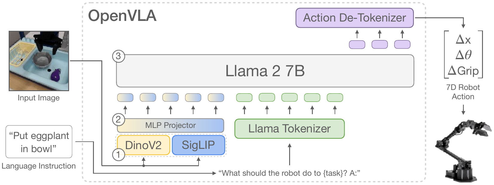

**Original caption:** Figure 2: OpenVLA model architecture. Given an image observation and a language instruction, the model predicts 7-dimensional robot control actions. The architecture consists of three key components: (1) a vision encoder that concatenates Dino V2 [25] and SigLIP [79] features, (2) a projector that maps visual features to the language embedding space, and (3) the LLM backbone, a Llama 2 7B-parameter large language model [10].

**中文图注:** 图 2：OpenVLA 模型架构。给定图像观测与语言指令，模型预测 7 维机器人控制动作。架构包含三个关键组件：(1) 视觉编码器，拼接 DinoV2 [25] 与 SigLIP [79] 特征；(2) 投影器（MLP Projector），把视觉特征映射到语言嵌入空间；(3) LLM 骨干，即 Llama 2 7B 大语言模型 [10]。图中流程为：输入图像 + 语言指令（"Put eggplant in bowl"）→ 视觉编码与投影 → 拼入提示模板（"What should the robot do to {task}? A:"）→ Llama 2 7B 自回归生成离散动作 token → Action De-Tokenizer 还原为 7 维机器人动作 [Δx, Δθ, ΔGrip]。

**Reading note:** 重点看三处：(1) 视觉端由 DinoV2 与 SigLIP 并联、特征按通道拼接；(2) 动作在 LLM 的输出词表里以 token 形式生成，再由 de-tokenizer 还原为连续控制量；(3) 输入提示采用固定模板，任务指令以自然语言填入 `{task}` 位置。

**Source:** p.4 S015

**Original:** In this work, we build on the Prismatic-7B VLM [44]. Prismatic follows the same standard architecture described above, with a 600M-parameter visual encoder, a small 2-layer MLP projector, and a 7B-parameter Llama 2 language model backbone [10]. Notably, Prismatic uses a two-part visual encoder, consisting of pretrained SigLIP [79] and DinoV2 [25] models. Input image patches are passed separately through both encoders and the resulting feature vectors are concatenated channel-wise. In contrast to the more commonly used vision encoders such as CLIP- [80] or SigLIP-only encoders, the addition of DinoV2 features has been shown to be helpful for improved spatial reasoning [44], which can be particularly helpful for robot control.

**中文:** 在本工作中，我们基于 Prismatic-7B VLM [44] 构建模型。Prismatic 采用上述标准架构：600M 参数视觉编码器、两层的小型 MLP 投影器，以及 7B 参数的 Llama 2 语言模型骨干 [10]。值得注意的是，Prismatic 使用双部分视觉编码器，由预训练的 SigLIP [79] 与 DinoV2 [25] 组成。输入图像 patch 分别经过两个编码器，得到的特征向量按通道拼接。相比更常用的 CLIP-only [80] 或 SigLIP-only 编码器，加入 DinoV2 特征已被证明有助于提升空间推理能力 [44]，这对机器人控制尤其有用。

**Source:** p.4 S016

**Original:** SigLIP, DinoV2, and Llama 2 do not release details about their training data, which likely consists of trillions of tokens of Internet-sourced image-text, image-only, and text-only data respectively. The Prismatic VLM is fine-tuned on top of these components using the LLaVA 1.5 data mixture [43], which contains a total of approximately 1M image-text and text-only data samples from open-source datasets [29, 42, 81–83].

**中文:** SigLIP、DinoV2 与 Llama 2 都未公开其训练数据细节；这些数据很可能分别是来自互联网的万亿级 token 的图像-文本、纯图像与纯文本数据。Prismatic VLM 在这些组件之上使用 LLaVA 1.5 数据混合 [43] 微调，该混合共包含约 100 万条来自开源数据集的图像-文本与纯文本样本 [29, 42, 81–83]。

## p.5 3.2 训练流程 · 3.3 训练数据 · 3.4 设计决策

**Source:** p.5 S017

**Original:** 3.2 OpenVLA Training Procedure. To train OpenVLA, we fine-tune a pretrained Prismatic-7B VLM backbone for robot action prediction (see Fig. 2). We formulate the action prediction problem as a "vision-language" task, where an input observation image and a natural language task instruction are mapped to a string of predicted robot actions [7]. To enable the VLM's language model backbone to predict robot actions, we represent the actions in the output space of the LLM by mapping continuous robot actions to discrete tokens used by the language model's tokenizer. Following Brohan et al. [7], we discretize each dimension of the robot actions separately into one of 256 bins. For each action dimension, we set the bin width to uniformly divide the interval between the 1st and 99th quantile of the actions in the training data. Using quantiles instead of the min-max bounds Brohan et al. [7] used allows us to ignore outlier actions in the data that could otherwise drastically expand the discretization interval and reduce the effective granularity of our action discretization.

**中文:** 3.2 OpenVLA 训练流程。为训练 OpenVLA，我们微调预训练的 Prismatic-7B VLM 骨干来做机器人动作预测（见图 2）。我们把动作预测问题表述为"视觉-语言"任务：把输入观测图像与自然语言任务指令映射为一串预测的机器人动作 [7]。为了让 VLM 的语言模型骨干能够预测机器人动作，我们把连续机器人动作映射为语言模型分词器（tokenizer）使用的离散 token，从而在 LLM 的输出空间中表示动作。沿用 Brohan 等人 [7] 的做法，我们把机器人动作的每一维分别离散化为 256 个 bin 之一。对每个动作维度，我们设定 bin 宽度，使其在训练数据该维动作的 1% 分位数到 99% 分位数之间均匀划分。使用分位数而非 Brohan 等人 [7] 所用的 min-max 边界，可以忽略数据中的离群动作——否则这些离群值会急剧扩大离散化区间，降低动作离散化的有效粒度。

**Source:** p.5 S018

**Original:** Using this discretization, we obtain N discrete integers ∈ [0 … 255] for an N-dimensional robot action. Unfortunately, the tokenizer used by OpenVLA's language backbone, the Llama tokenizer [10], only reserves 100 "special tokens" for tokens newly introduced during fine-tuning, which is too few for the 256 tokens of our action discretization. Instead, we again opt for simplicity and follow Brohan et al. [7]'s approach by simply overwriting the 256 least used tokens in the Llama tokenizer's vocabulary (which corresponds to the last 256 tokens) with our action tokens. Once the actions are processed into a sequence of tokens, OpenVLA is trained with a standard next-token prediction objective, evaluating the cross-entropy loss on the predicted action tokens only. We discuss key design decisions for implementing this training procedure in Section 3.4. Next, we describe the robot dataset we use for OpenVLA training.

**中文:** 通过这种离散化，一个 N 维机器人动作会得到 N 个取值范围在 [0 … 255] 的离散整数。遗憾的是，OpenVLA 语言骨干所使用的分词器（Llama tokenizer [10]）只为微调期间新引入的 token 预留了 100 个"特殊 token"，而我们的动作离散化需要 256 个，远远不够。我们同样选择最简单的方案，沿用 Brohan 等人 [7] 的做法：直接用动作 token 覆盖 Llama 词表中使用频率最低的 256 个 token（即词表最后 256 个）。动作被处理为 token 序列后，OpenVLA 以标准的下一 token 预测目标训练，且只在预测的动作 token 上计算交叉熵损失。我们将在 3.4 节讨论实现该训练流程的关键设计决策。接下来介绍用于 OpenVLA 训练的机器人数据集。

**Source:** p.5 S019

**Original:** 3.3 Training Data. The goal in constructing the OpenVLA training dataset is to capture a large diversity of robot embodiments, scenes, and tasks. This enables the final model to control various robots out of the box and admits efficient fine-tuning to new robot setups. We leverage the Open X-Embodiment dataset [1] (OpenX) as a base to curate our training dataset. The full OpenX dataset, at the time of writing, consists of more than 70 individual robot datasets, with more than 2M robot trajectories, that were pooled into a coherent and easy-to-use data format in a large community effort. To make training on this data practical, we apply multiple steps of data curation to the raw dataset.

**中文:** 3.3 训练数据。构建 OpenVLA 训练数据集的目标是覆盖尽可能多样的机器人本体、场景与任务，从而使最终模型能够开箱控制多种机器人，并支持高效地微调到新的机器人配置。我们以 Open X-Embodiment 数据集 [1]（OpenX）为基础来整理训练数据。截至写作时，完整的 OpenX 数据集包含 70 多个独立机器人数据集、超过 200 万条机器人轨迹，是在一次大规模社区协作中被汇总为统一且易用数据格式的。为了让在此数据上的训练切实可行，我们对原始数据集进行了多步数据整理。

**Source:** p.5 S020

**Original:** The goals of this curation are to ensure (1) a coherent input and output space across all training datasets, and (2) a balanced mix of embodiments, tasks, and scenes in the final training mixture.² To address (1), we follow [1, 5] and restrict our training dataset to contain only manipulation datasets with at least one 3rd person camera and use single-arm end-effector control. For (2), we leverage the data mixture weights of Octo [5] for all datasets that pass the first round of filtering. Octo heuristically down-weights or removes less diverse datasets and up-weights datasets with larger task and scene diversity; see Octo Model Team et al. [5] for details.

**中文:** 数据整理的目标是确保 (1) 所有训练数据集具有一致的输入与输出空间，(2) 最终训练混合在本体、任务与场景上达到均衡。² 针对 (1)，我们沿用 [1, 5]，把训练数据限制为至少含一个第三人称相机、且使用单臂末端执行器控制的机器人操作数据集。针对 (2)，对于通过第一轮筛选的所有数据集，我们采用 Octo [5] 的数据混合权重。Octo 会启发式地降低多样性较低数据集（或直接移除）的权重，并提高任务与场景多样性更高数据集的权重；细节见 Octo Model Team 等人 [5]。

**Source:** p.5 S021

**Original:** We also experimented with incorporating a few additional datasets into our training mixture that were added to the OpenX dataset since the release of Octo, including the DROID dataset [11], although at a conservative mixture weight of 10%. In practice, we found that the action token accuracy on DROID remained low throughout training, suggesting a larger mixture weight or model may be required to fit its diversity in the future. To not jeopardize the quality of the final model, we removed DROID from the data mixture for the final third of training. We provide a complete overview of the used datasets and mixture weights in Appendix A.

**中文:** 我们还尝试把 Octo 发布之后加入 OpenX 数据集的一些额外数据集纳入训练混合，包括 DROID 数据集 [11]，但仅使用保守的 10% 混合权重。实践中我们发现，DROID 上的动作 token 准确率在整个训练过程中始终偏低，说明未来若要拟合其多样性，可能需要更大的混合权重或更大的模型。为避免影响最终模型质量，我们在训练的最后三分之一阶段把 DROID 从数据混合中移除。所用数据集与混合权重的完整清单见附录 A。

**Source:** p.5 S022

**Original:** 3.4 OpenVLA Design Decisions. When developing the OpenVLA model, we explored various design decisions in smaller-scale experiments before starting the final model training run. Concretely, we trained and evaluated OpenVLA models on BridgeData V2 [6] for our initial experiments, instead of training on the full OpenX mixture, to increase iteration speed and reduce computational cost. We summarize key learnings from these explorations below.

**中文:** 3.4 OpenVLA 的设计决策。在开发 OpenVLA 时，我们在启动最终训练之前，先用小规模实验探索了多种设计选择。具体来说，初期实验在 BridgeData V2 [6] 上训练与评测 OpenVLA 模型，而不是在完整 OpenX 混合上训练，以提升迭代速度、降低计算开销。下面总结这些探索得到的关键经验。

**Source:** p.5 S023

**Original:** ² Octo [5] demonstrated training across datasets with heterogeneous sensory inputs. While very promising, we leave an investigation of VLA training across heterogeneous sensor modalities and action spaces to future work.

**中文:** ² Octo [5] 展示了在具有异构传感输入的数据集上跨数据集训练的能力。尽管这非常有前景，我们把跨异构传感器模态与动作空间的 VLA 训练研究留给未来工作。

## p.6 3.4 设计决策（续）· 3.5 基础设施 · 4 代码库

**Source:** p.6 S024

**Original:** VLM Backbone. Initially, we experimented with multiple VLM backbones. Apart from Prismatic [44], we tested fine-tuning IDEFICS-1 [84] and LLaVA [85] for robot action prediction. We found that LLaVA and IDEFICS-1 performed comparably on tasks with only one object in the scene, but LLaVA demonstrated stronger language grounding in tasks that involved multiple objects in the scene and required the policy to manipulate the correct object, i.e., the object specified in the language instruction. Concretely, LLaVA improved upon IDEFICS-1 by 35% in absolute success rate, averaged across five language grounding tasks in a BridgeData V2 sink environment. The fine-tuned Prismatic VLM policy achieved further improvements, outperforming the LLaVA policy by roughly 10% in absolute success rate across both simple single-object tasks and multi-object, language grounding tasks. We attribute this performance delta to improved spatial reasoning capabilities afforded by the fused SigLIP-DinoV2 backbones (see Section 3.1). In addition to the performance enhancements, Prismatic also provides a modular and easy-to-use codebase, so we ultimately chose it to be the backbone for the OpenVLA model.

**中文:** VLM 骨干。最初我们试验了多种 VLM 骨干。除 Prismatic [44] 外，我们还测试了微调 IDEFICS-1 [84] 与 LLaVA [85] 来做机器人动作预测。我们发现，在场景中只有一个物体的任务上，LLaVA 与 IDEFICS-1 表现相当；但在场景含多个物体、要求策略操作正确物体（即语言指令所指物体）的任务上，LLaVA 展现出更强的语言 grounding。具体而言，在 BridgeData V2 水槽环境的 5 个语言 grounding 任务上取平均，LLaVA 的绝对成功率比 IDEFICS-1 高 35%。微调后的 Prismatic VLM 策略进一步提升：在简单的单物体任务与多物体语言 grounding 任务上，其绝对成功率都比 LLaVA 策略高约 10%。我们把这一性能差异归因于融合的 SigLIP-DinoV2 骨干带来的空间推理能力提升（见 3.1 节）。除了性能提升，Prismatic 还提供了模块化且易用的代码库，因此我们最终选择它作为 OpenVLA 的骨干。

**Source:** p.6 S025

**Original:** Image Resolution. The resolution of input images has significant impact on the computational requirements of VLA training, since higher-resolution images result in more image patch tokens and thus longer context lengths that quadratically increase training compute. We compared VLAs with 224 × 224px and 384 × 384px inputs, but found no performance difference in our evaluations, while the latter takes 3x longer to train. We thus opt for a resolution of 224 × 224px for the final OpenVLA model. Note that on many VLM benchmarks, increased resolution does improve performance [44, 86, 87], but we did not see this trend (yet) for VLAs.

**中文:** 图像分辨率。输入图像分辨率会显著影响 VLA 训练的计算需求：更高分辨率会带来更多图像 patch token，从而拉长上下文长度，使训练计算量按平方增长。我们比较了输入为 224 × 224 像素与 384 × 384 像素的 VLA，在评测中没有发现性能差异，而后者的训练时间是前者的 3 倍。因此最终 OpenVLA 模型采用 224 × 224 像素的分辨率。需要说明的是，在许多 VLM 基准上提高分辨率确实能提升性能 [44, 86, 87]，但对 VLA 我们（目前）没有观察到这一趋势。

**Source:** p.6 S026

**Original:** Fine-Tuning Vision Encoder. Prior work on VLMs found that freezing vision encoders during VLM training typically leads to higher performance [44]. Intuitively, a frozen vision encoder may better preserve the robust features learned from its Internet-scale pretraining. However, we found fine-tuning the vision encoder during VLA training to be crucial for good VLA performance. We hypothesize that the pretrained vision backbone may not capture sufficient fine-grained spatial details about important parts of the scene to enable precise robotic control.

**中文:** 微调视觉编码器。先前 VLM 工作发现，在 VLM 训练中冻结视觉编码器通常会带来更高性能 [44]。直觉上，冻结的视觉编码器能更好地保留其在互联网规模预训练中学到的鲁棒特征。然而我们发现，在 VLA 训练中微调视觉编码器对取得良好性能至关重要。我们推测，预训练视觉骨干可能无法捕捉到场景关键部分足够细粒度的空间细节，而这些细节是精确机器人控制所必需的。

**Source:** p.6 S027

**Original:** Training Epochs. Typical LLM or VLM training runs complete at most one or two epochs through their training dataset. In contrast, we found it important for VLA training to iterate through the training dataset significantly more times, with real robot performance continually increasing until training action token accuracy surpasses 95%. Our final training run completes 27 epochs through its training dataset.

**中文:** 训练轮数（epoch）。典型的 LLM 或 VLM 训练通常只遍历训练集一到两轮。相比之下，我们发现 VLA 训练需要显著更多地遍历训练数据集，且真实机器人上的性能持续提升，直到训练集上的动作 token 准确率超过 95%。我们最终训练运行在其训练数据集上完成了 27 个 epoch。

**Source:** p.6 S028

**Original:** Learning Rate. We swept the learning rate across multiple orders of magnitude for VLA training, and achieved the best results using a fixed learning rate of 2e-5 (the same learning rate used during VLM pretraining [44]). We did not find learning rate warmup to provide benefits.

**中文:** 学习率。我们在多个数量级范围内对 VLA 训练的学习率做了扫描，最终使用固定学习率 2e-5 取得最佳结果（与 VLM 预训练所用学习率相同 [44]）。我们没有发现学习率 warmup 带来收益。

**Source:** p.6 S029

**Original:** 3.5 Infrastructure for Training and Inference. The final OpenVLA model is trained on a cluster of 64 A100 GPUs for 14 days, or a total of 21,500 A100-hours, using a batch size of 2048. During inference, OpenVLA requires 15GB of GPU memory when loaded in bfloat16 precision (i.e., without quantization) and runs at approximately 6Hz on one NVIDIA RTX 4090 GPU (without compilation, speculative decoding, or other inference speed-up tricks). We can further reduce the memory footprint of OpenVLA during inference via quantization, without compromising performance in real-world robotics tasks, as shown in Section 5.4. We report inference speed on various consumer- and server-grade GPUs in Fig. 6. For convenience, we implement a remote VLA inference server to allow real-time remote streaming of action predictions to the robot – removing the requirement of having access to a powerful local compute device to control the robot. We release this remote inference solution as part of our open-source code release (Section 4).

**中文:** 3.5 训练与推理基础设施。最终的 OpenVLA 模型在 64 张 A100 GPU 的集群上训练 14 天，合计 21,500 A100 小时，batch size 为 2048。推理时，OpenVLA 以 bfloat16 精度加载（即不做量化）需要 15GB GPU 显存，在单张 NVIDIA RTX 4090 上运行速度约为 6Hz（未使用编译、投机解码或其他推理加速技巧）。如 5.4 节所示，我们还可以通过量化进一步降低推理显存占用，且不损害真实机器人任务上的性能。我们在图 6 中报告了多种消费级与服务器级 GPU 上的推理速度。为方便使用，我们实现了一个远程 VLA 推理服务器，可将动作预测实时远程流式传输给机器人——这样控制机器人就不必依赖本地高性能计算设备。该远程推理方案作为开源代码的一部分发布（第 4 节）。

**Source:** p.6 S030

**Original:** 4 The OpenVLA Codebase. Along with our model, we release the OpenVLA codebase, a modular PyTorch codebase for training VLA models (see https://openvla.github.io). It scales from fine-tuning VLAs on individual GPUs to training billion-parameter VLAs on multi-node GPU clusters, and supports modern

**中文:** 4 OpenVLA 代码库。除模型之外，我们还发布 OpenVLA 代码库——一个用于训练 VLA 模型的模块化 PyTorch 代码库（见 https://openvla.github.io）。它既支持在单张 GPU 上微调 VLA，也支持在多节点 GPU 集群上训练十亿参数级 VLA，并支持现代

## p.7 4 代码库（续）· 5 实验 · 5.1 多机器人平台直接评测

**Source:** p.7 S031

**Original:** techniques for large transformer model training such as automatic mixed precision (AMP, PyTorch [75]), FlashAttention [76], and fully sharded data parallelism (FSDP, Zhao et al. [77]). Out of the box, the OpenVLA codebase has full support for training on the Open X dataset, integrates with HuggingFace's [21] AutoModel class, and supports LoRA fine-tuning [26] and quantized model inference [27, 88].

**中文:** （接上页）大 Transformer 模型的训练技术，如自动混合精度（AMP，PyTorch [75]）、FlashAttention [76] 和全分片数据并行（FSDP，Zhao 等人 [77]）。开箱即用，OpenVLA 代码库完整支持在 Open X 数据集上训练，与 HuggingFace [21] 的 AutoModel 类集成，并支持 LoRA 微调 [26] 与量化模型推理 [27, 88]。

**Source:** p.7 S032

**Original:** 5 Experiments. The goal of our experimental evaluations is to test OpenVLA's ability to serve as a powerful multi-robot control policy out of the box, as well as be a good initialization for fine-tuning to new robot tasks. Concretely, we aim to answer the following questions: 1. How does OpenVLA compare to prior generalist robot policies, when evaluating on multiple robots and various types of generalization? 2. Can OpenVLA be effectively fine-tuned on a new robot setup and task, and how does it compare to state-of-the-art data-efficient imitation learning approaches? 3. Can we use parameter-efficient fine-tuning and quantization to reduce the computational requirements for training and inference of OpenVLA models and make them more accessible? What are the performance-compute trade-offs?

**中文:** 5 实验。我们的评测目标是检验 OpenVLA 能否开箱即用地充当强大的多机器人控制策略，以及能否作为微调到新机器人任务的良好初始化。具体来说，我们试图回答以下问题：1. 在多种机器人与多种泛化类型上评测时，OpenVLA 与先前的通用机器人策略相比如何？2. OpenVLA 能否被有效微调到新的机器人配置与任务上，与最先进的数据高效模仿学习方法相比如何？3. 我们能否用参数高效微调与量化来降低 OpenVLA 训练和推理的计算需求、使其更易获得？性能与计算之间的权衡是什么？

**Source:** p.7 S033

**Original:** 5.1 Direct Evaluations on Multiple Robot Platforms. Robot Setups and Tasks. We evaluate OpenVLA's performance "out-of-the-box" on two robot embodiments: the WidowX robot from the BridgeData V2 evaluations [6] (see Fig. 1, left) and the mobile manipulation robot from the RT-1 and RT-2 evaluations [2, 7] ("Google robot"; see Fig. 1, middle). Both platforms have been extensively used in prior works for evaluating generalist robot policies [1, 2, 5, 7]. We define a comprehensive set of evaluation tasks in each environment that covers various axes of generalization, such as visual (unseen backgrounds, distractor objects, colors/appearances of objects); motion (unseen object positions/orientations); physical (unseen object sizes/shapes); and semantic (unseen target objects, instructions, and concepts from the Internet) generalization. We also assess language conditioning ability in scenes with multiple objects, testing whether the policy can manipulate the correct target object, as specified in the user's prompt. See bottom row of Fig. 3 and Fig. 4 for example task images in the BridgeData V2 and Google robot evaluations, respectively. Overall, we evaluated each method in 170 rollouts (17 tasks with 10 trials each) for BridgeData V2 experiments and 60 rollouts (12 tasks with 5 trials each) for Google robot experiments. A detailed breakdown of all tasks and how they differ from the training data is in Appendix B.

**中文:** 5.1 在多机器人平台上的直接评测。机器人配置与任务。我们评测 OpenVLA 在两种机器人本体上的"开箱即用"性能：BridgeData V2 评测中所用的 WidowX 机器人 [6]（见图 1 左）以及 RT-1、RT-2 评测中所用的移动操作机器人 [2, 7]（"Google robot"，见图 1 中）。这两个平台在此前的通用机器人策略评测中被广泛使用 [1, 2, 5, 7]。我们在每个环境中定义了一套全面的评测任务，覆盖多个泛化维度：视觉泛化（未见过的背景、干扰物、物体颜色/外观）、运动泛化（未见过的物体位置/朝向）、物理泛化（未见过的物体尺寸/形状）以及语义泛化（未见过的目标物体、指令与来自互联网的概念）。我们还在多物体场景中评估语言条件能力，测试策略能否操作提示中指定的正确目标物体。BridgeData V2 与 Google robot 评测的示例任务图像分别见图 3 最下面一行与图 4。总体上，BridgeData V2 实验中每个方法评测 170 次 rollout（17 个任务，每个 10 次试验），Google robot 实验中评测 60 次 rollout（12 个任务，每个 5 次试验）。所有任务及其与训练数据差异的详细分解见附录 B。

**Source:** p.7 C003

**Original:** Figure 3: BridgeData V2 WidowX robot evaluation tasks and results. We evaluate OpenVLA and prior state-of-the-art generalist robot policies on a comprehensive suite of tasks covering several axes of generalization, as well as tasks that specifically assess language conditioning ability. OpenVLA achieves highest overall performance and even outperforms closed-source model RT-2-X in all categories except for semantic generalization. Average success rates ± StdErr are computed across 170 total rollouts per approach. See Table 4 for detailed results.

**中文:** 图 3：BridgeData V2 WidowX 机器人评测任务与结果。我们在一套覆盖多个泛化维度的综合任务、以及专门评估语言条件能力的任务上，评测 OpenVLA 与此前最优的通用机器人策略。OpenVLA 取得最高的总体性能，除语义泛化外，在所有类别上甚至超过了闭源模型 RT-2-X。平均成功率 ± 标准误基于每种方法共 170 次 rollout 计算。详细结果见表 4。

### Fig. 3. BridgeData V2（WidowX）评测任务与成功率

**Placed near:** p.7 S033
**Source:** p.7 C003

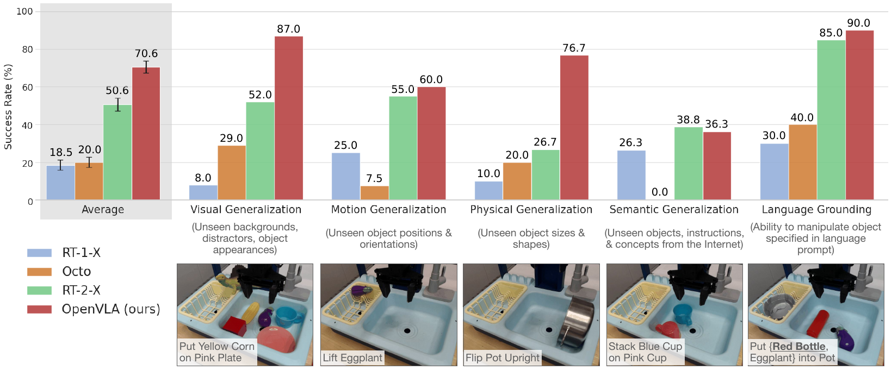

**Original caption:** Figure 3: BridgeData V2 WidowX robot evaluation tasks and results. We evaluate OpenVLA and prior state-of-the-art generalist robot policies on a comprehensive suite of tasks covering several axes of generalization, as well as tasks that specifically assess language conditioning ability. …

**中文图注:** 图 3：BridgeData V2 WidowX 机器人评测任务与结果。任务覆盖视觉泛化（未见过的背景、干扰物、物体外观）、运动泛化（未见过的物体位置与朝向）、物理泛化（未见过的尺寸与形状）、语义泛化（未见过的物体、指令与互联网概念）以及语言条件能力（能否操作语言提示指定的物体）。柱状图为各方法的平均成功率（± 标准误），OpenVLA 在除语义泛化外的所有类别上均超过 RT-2-X。

**Reading note:** 横轴按泛化类别分组，比较 RT-1-X、Octo、RT-2-X 与 OpenVLA。看两点：(1) 无互联网预训练的 RT-1-X/Octo 在多物体、含干扰物的任务上明显偏低；(2) OpenVLA 与 RT-2-X 在多数类别上接近或更好，而 OpenVLA 参数量只有 1/8 左右。

**Source:** p.8 S034

**Original:** Appendix B. All evaluations in this and the following sections are conducted as A/B evaluations, using the same tasks with the same sets of initial robot and object states, to ensure fair comparison.

**中文:** （接上页）附录 B。本节及后续各节的所有评测均以 A/B 对照方式开展：使用相同任务、相同的机器人初始状态与物体初始状态集合，以保证比较公平。

## p.8 5.1 实验（续）· 5.2 数据高效适配

**Source:** p.8 S035

**Original:** Comparisons. We compare OpenVLA's performance to three prior generalist manipulation policies: RT-1-X [1], RT-2-X [1], and Octo [5]. RT-1-X (35M parameters) and Octo (93M parameters) are transformer policies trained from scratch on subsets of the OpenX dataset; Octo is the state-of-the-art model among open-source manipulation policies. RT-2-X (55B parameters) is a state-of-the-art, closed-source VLA that leverages Internet-pretrained vision and language backbones.

**中文:** 对比方法。我们把 OpenVLA 的性能与三种先前的通用操作策略比较：RT-1-X [1]、RT-2-X [1] 与 Octo [5]。RT-1-X（35M 参数）与 Octo（93M 参数）是在 OpenX 数据集子集上从零训练的 Transformer 策略；Octo 是开源操作策略中性能最优的模型。RT-2-X（55B 参数）是一个最先进的闭源 VLA，利用互联网预训练的视觉与语言骨干。

**Source:** p.8 S036

**Original:** The results are summarized in Fig. 3 for BridgeData V2 evaluations and Fig. 4 for Google robot evaluations (per-task breakdown in Appendix, Table 4 and Table 6). We find that both RT-1-X and Octo struggle on the tested tasks, often failing to manipulate the correct object, especially when distractors are present, and in some cases causing the robot to wave its arm around aimlessly. Note that our evaluations test even larger degrees of generalization than the evaluations performed in those prior works to challenge the Internet-pretrained VLA models. Thus, lower performance of models without Internet pretraining is expected. RT-2-X clearly outperforms both RT-1-X and Octo, demonstrating the benefits of large, pretrained VLMs for robotics.

**中文:** 结果分别在 BridgeData V2 评测（图 3）与 Google robot 评测（图 4）中汇总（逐任务分解见附录表 4 与表 6）。我们发现 RT-1-X 与 Octo 在测试任务上都很吃力，常常无法操作正确的物体，在有干扰物时尤其明显，某些情况下还会让机器人漫无目的地挥动手臂。需要说明的是，我们的评测比这些先前工作所报告的评测具有更大程度的泛化要求，正是为了挑战互联网预训练的 VLA 模型；因此，没有互联网预训练的模型性能较低是预期之中的。RT-2-X 明显优于 RT-1-X 与 Octo，体现了大型预训练 VLM 对机器人领域的价值。

**Source:** p.8 C004

**Original:** Figure 4: Google robot evaluation results. We evaluate generalist robot policies on in-distribution and out-of-distribution (OOD) tasks on the mobile manipulator used in RT-1 and RT-2 evaluations [2, 7]. We find that OpenVLA and RT-2-X attain comparable performance and significantly outperform RT-1-X and Octo overall. Average success rates ± StdErr are computed across 60 total rollouts per approach. See Table 6 for detailed results.

**中文:** 图 4：Google robot 评测结果。我们在 RT-1 与 RT-2 评测所用的移动操作机器人上 [2, 7]，对通用机器人策略进行分布内（in-distribution）与分布外（OOD）任务评测。我们发现 OpenVLA 与 RT-2-X 性能相当，并在总体上显著优于 RT-1-X 与 Octo。平均成功率 ± 标准误基于每种方法共 60 次 rollout 计算。详细结果见表 6。

### Fig. 4. Google Robot（移动操作机器人）评测结果

**Placed near:** p.8 S036
**Source:** p.8 C004

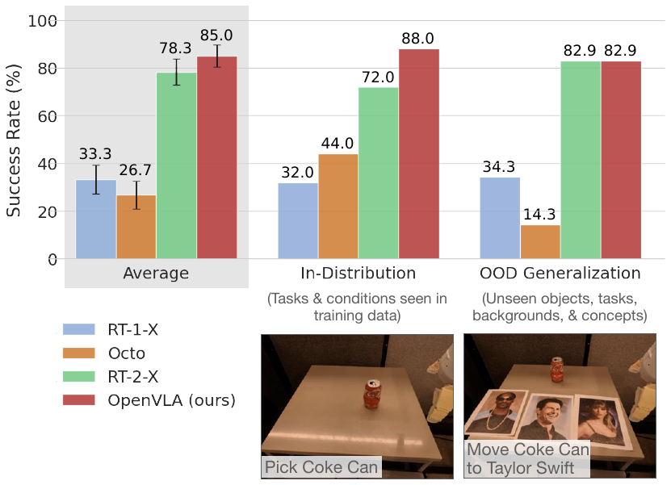

**Original caption:** Figure 4: Google robot evaluation results. We evaluate generalist robot policies on in-distribution and out-of-distribution (OOD) tasks on the mobile manipulator used in RT-1 and RT-2 evaluations [2, 7]. …

**中文图注:** 图 4：Google robot 评测结果。在 RT-1/RT-2 所用移动操作机器人上评测各通用策略的分布内与分布外（OOD）任务表现；图中同时给出示例任务（"Pick Coke Can" 与 "Move Coke Can to Taylor Swift"，后者属于语义泛化/OOD 条件）与各类别平均成功率。

**Reading note:** 与图 3 对照看：OpenVLA 与 RT-2-X 在分布内与 OOD 上总体相当，且都明显高于 RT-1-X 与 Octo；差异主要体现在需要互联网语义先验的任务（如把可乐罐移到 Taylor Swift 照片处）。

**Source:** p.8 S037

**Original:** Notably, OpenVLA performs comparably to RT-2-X on Google robot evaluations and significantly outperforms RT-2-X on BridgeData V2 evaluations despite being an order of magnitude smaller (7B vs. 55B parameters). Qualitatively, we find that both RT-2-X and OpenVLA exhibit markedly more robust behaviors than the other tested models, such as approaching the correct object when distractor objects are present, properly orienting the robot's end-effector to align with the orientation of the target object, and even recovering from mistakes such as insecurely grasping objects (see https://openvla.github.io for qualitative rollout examples). RT-2-X achieves higher performance in semantic generalization tasks, as shown in Fig. 3, which is expected given that it uses larger-scale Internet pretraining data and is co-fine-tuned with both robot action data and Internet pretraining data to better preserve the pretraining knowledge, rather than being fine-tuned solely on robot data, like OpenVLA. However, OpenVLA performs comparably or better in all other task categories in both BridgeData V2 and Google robot evaluations. The performance difference can be attributed to a combination of factors: we curated a much larger training dataset for OpenVLA with 970k trajectories (vs. 350k for RT-2-X); we performed more careful cleaning of the training dataset and, e.g., filtered out all-zero actions in the Bridge dataset (see Appendix C for a detailed discussion); and OpenVLA uses a fused vision encoder that combines pretrained semantic and spatial features. See Appendix D for ablation analyses of these components.

**中文:** 值得注意的是，OpenVLA 在 Google robot 评测上与 RT-2-X 表现相当，并在 BridgeData V2 评测上显著超过 RT-2-X，而参数量小一个数量级（7B 对 55B）。定性来看，RT-2-X 与 OpenVLA 都表现出明显比其他被测模型更鲁棒的行为：存在干扰物时仍能接近正确的物体、能正确调整机器人末端执行器的朝向使其与目标物体朝向对齐，甚至能从抓取不牢之类的错误中恢复（定性 rollout 示例见 https://openvla.github.io）。如图 3 所示，RT-2-X 在语义泛化任务上表现更好；这是可以预期的，因为它使用了更大规模的互联网预训练数据，并且与机器人动作数据和互联网预训练数据共同微调，以更好地保留预训练知识，而不是像 OpenVLA 那样只针对机器人数据做微调。不过，在 BridgeData V2 与 Google robot 评测的其他所有任务类别上，OpenVLA 表现相当或更好。这一性能差异可归因于几方面因素：我们为 OpenVLA 整理了规模大得多的训练数据集，包含 97 万条轨迹（RT-2-X 为 35 万条）；我们对训练数据做了更细致的清洗，例如过滤掉 Bridge 数据集中的全零动作（详细讨论见附录 C）；以及 OpenVLA 使用融合视觉编码器，结合了预训练的语义与空间特征。这些组件的消融分析见附录 D。

**Source:** p.8 S038

**Original:** 5.2 Data-Efficient Adaptation to New Robot Setups. While prior works mainly focused on directly evaluating VLAs "out-of-the-box" [1, 7, 16], effective fine-tuning of VLA models to new tasks and robot setups is largely unexplored, yet is key for their widespread adoption. In this section, we investigate OpenVLA's ability to be quickly adapted to a new real-world robot setup. (See Appendix E for fine-tuning experiments in simulation.)

**中文:** 5.2 面向新机器人配置的数据高效适配。此前工作主要关注"开箱即用"地直接评测 VLA [1, 7, 16]，而把 VLA 模型有效微调到新任务与新机器人配置上这一问题基本未被探索，但这对 VLA 的广泛采用至关重要。本节我们考察 OpenVLA 能否被快速适配到新的真实世界机器人配置。（仿真环境中的微调实验见附录 E。）

**Source:** p.8 S039

**Original:** Robot setups and tasks. We test a simple fine-tuning recipe for the OpenVLA model: full fine-tuning of all model parameters, using small datasets with 10–150 demonstrations of a target task (see Fig. 5; we explore parameter-efficient fine-tuning approaches in Section 5.3). We test OpenVLA in two setups: Franka-Tabletop, a stationary, table-mounted Franka Emika Panda 7-DoF robot arm; and Franka-DROID, the Franka robot arm setup from the recently released DROID dataset [11],

**中文:** 机器人配置与任务。我们为 OpenVLA 测试了一个简单的微调配方：对全部模型参数做全量微调，目标任务的示教数据量仅为 10–150 条（见图 5；参数高效微调方法在 5.3 节探讨）。我们在两种配置上测试 OpenVLA：Franka-Tabletop——固定在桌面安装的 Franka Emika Panda 7 自由度机械臂；以及 Franka-DROID——来自近期发布的 DROID 数据集 [11] 的 Franka 机械臂配置，

## p.9 5.2 数据高效适配（续）

**Source:** p.9 S040

**Original:** mounted on a movable standing desk. The setups use 5Hz and 15 Hz non-blocking controllers, respectively. We choose Franka robot arms as the target embodiment for our fine-tuning experiments since they are widely used in the robot learning community and thus a likely "target" of OpenVLA fine-tuning. We test on setups with different control frequencies to test OpenVLA's applicability to a range of use cases.

**中文:** （接上页）安装在可移动的站立式桌台上。这两种配置分别使用 5Hz 与 15Hz 的非阻塞控制器。我们选择 Franka 机械臂作为微调实验的目标本体，因为它们在机器人学习社区中被广泛使用，因而很可能是 OpenVLA 微调的典型"目标"。我们在控制频率不同的配置上测试，以考察 OpenVLA 对一系列使用场景的适用性。

**Source:** p.9 S041

**Original:** Comparisons. We compare to Diffusion Policy [3], a state-of-the-art data-efficient imitation learning approach, trained from scratch. We also compare to Diffusion Policy (matched), a version of Diffusion Policy that matches the input and output specifications of OpenVLA.³ Additionally, we evaluate Octo [5] fine-tuned on the target dataset, since it is currently the best generalist policy that supports fine-tuning (fine-tuning of RT-2-X is not supported through its inference API). We also fine-tune OpenVLA on the same target dataset, and the resulting policy is denoted by OpenVLA. Finally, as an ablation experiment, we compare to OpenVLA (scratch), where we directly fine-tune the underlying base Prismatic VLM on the target robot setup – rather than fine-tuning the OpenX-pretrained OpenVLA model – to assess the benefit of large-scale robot pretraining.

**中文:** 对比方法。我们与从零训练、最先进的数据高效模仿学习方法 Diffusion Policy [3] 比较；还与 Diffusion Policy（matched）比较，即把 Diffusion Policy 的输入与输出规格调整为与 OpenVLA 一致后的版本。³ 此外，我们评测在目标数据集上微调后的 Octo [5]，因为它是目前支持微调的最佳通用策略（RT-2-X 的推理 API 不支持微调）。我们也在同一目标数据集上微调 OpenVLA，所得策略记为 OpenVLA。最后，作为消融实验，我们与 OpenVLA（scratch）比较：直接在下游机器人配置上微调其底层的 Prismatic VLM，而不是微调经过 OpenX 预训练的 OpenVLA 模型，以评估大规模机器人预训练的收益。

**Source:** p.9 S042

**Original:** We present the results in Fig. 5 (per-task breakdown in Appendix, Table 7). We find that both versions of Diffusion Policy are competitive with or outperform the generalist policies Octo and OpenVLA on narrower single-instruction tasks like "Put Carrot in Bowl" and "Pour Corn into Pot", but the pretrained generalist policies perform better in more diverse fine-tuning tasks that involve multiple objects in the scene and require language conditioning. OpenX pretraining for Octo and OpenVLA enables the models to better adapt to these more diverse tasks where language grounding is important; we see evidence for this in the lower performance of OpenVLA (scratch).

**中文:** 结果见图 5（逐任务分解见附录表 7）。我们发现，在"Put Carrot in Bowl"、"Pour Corn into Pot"这类较窄的单指令任务上，两个版本的 Diffusion Policy 都与通用策略 Octo、OpenVLA 相当或更好；但在涉及场景中多个物体、需要语言条件的更多样化微调任务上，预训练的通用策略表现更好。对 Octo 与 OpenVLA 而言，OpenX 预训练使模型能更好地适应这些语言 grounding 更重要的多样化任务；OpenVLA（scratch）性能更低，正说明了这一点。

**Source:** p.9 C005

**Original:** Figure 5: Adapting to new robot setups. We evaluate the state-of-the-art Diffusion Policy trained from scratch on seven Franka Emika Panda tasks (10–150 demonstrations each), as well as generalist robot policies Octo and OpenVLA fine-tuned on the same data. Diffusion Policy exhibits strong performance on narrow single-instruction tasks, while Octo and OpenVLA perform better on diverse fine-tuning tasks involving multiple instructions and distractor objects. Overall, OpenVLA achieves highest aggregate performance across both setups, suggesting that it is an effective default for learning a policy on a downstream task. Average success rates ± StdErr are computed across 129 rollouts per approach (99 for Franka-Tabletop tasks and 30 for Franka-DROID tasks). See Table 7 for detailed results.

**中文:** 图 5：适配到新的机器人配置。我们在 7 个 Franka Emika Panda 任务（每个 10–150 条示教）上评测从零训练的最优 Diffusion Policy，以及在同一数据上微调的通用策略 Octo 与 OpenVLA。Diffusion Policy 在较窄的单指令任务上表现强，而 Octo 与 OpenVLA 在涉及多指令与干扰物的多样化微调任务上表现更好。总体而言，OpenVLA 在两种配置上取得最高的综合性能，说明它是下游任务学习策略的一个有效默认选择。平均成功率 ± 标准误基于每种方法 129 次 rollout 计算（Franka-Tabletop 任务 99 次、Franka-DROID 任务 30 次）。详细结果见表 7。

### Fig. 5. 面向新机器人配置的微调结果（Franka-Tabletop / Franka-DROID）

**Placed near:** p.9 S042
**Source:** p.9 C005

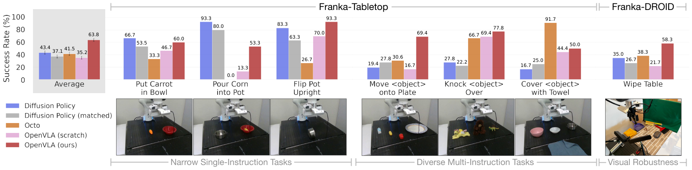

**Original caption:** Figure 5: Adapting to new robot setups. We evaluate the state-of-the-art Diffusion Policy trained from scratch on seven Franka Emika Panda tasks (10–150 demonstrations each), as well as generalist robot policies Octo and OpenVLA fine-tuned on the same data. …

**中文图注:** 图 5：适配到新机器人配置。在 7 个 Franka Emika Panda 任务（每个 10–150 条示教）上，比较从零训练的 Diffusion Policy 与在同一数据上微调的通用策略 Octo、OpenVLA。图中按"窄领域单指令任务 / 多样化多指令任务 / 视觉鲁棒性"分组给出各任务成功率。

**Reading note:** 注意分组之间的反差：单指令任务上 Diffusion Policy 常常领先；一旦任务涉及多物体与语言条件（Multi-Instruction、Visual Robustness），OpenVLA 与 Octo 反超。这说明"是否经过大规模机器人预训练"在语言 grounding 上体现得最明显。

**Source:** p.9 S043

**Original:** Overall, we find that OpenVLA achieves the highest average performance. Notably, most prior works achieve strong performance only in either narrow single-instruction or diverse multi-instruction tasks, resulting in widely varying success rates. OpenVLA is the only approach that achieves at least 50% success rate across all tested tasks, suggesting that it can be a strong default option for imitation learning tasks, particularly if they involve a diverse set of language instructions. For narrower but highly dexterous tasks, Diffusion Policy still shows smoother and more precise trajectories; incorporating action chunking and temporal smoothing, as implemented in Diffusion Policy, may help OpenVLA attain the same level of dexterity and may be a promising direction for future work (see Section 6 for a detailed discussion of current limitations).

**中文:** 总体来看，OpenVLA 取得最高的平均性能。值得注意的是，多数先前工作只在"较窄的单指令任务"或"多样化的多指令任务"之一种上表现强，导致成功率波动很大。OpenVLA 是唯一在所有被测任务上都达到至少 50% 成功率的方法，说明它可以作为模仿学习任务的一个有力默认选项，尤其当任务涉及多样化的语言指令时。对于较窄但灵巧度要求高的任务，Diffusion Policy 仍能给出更平滑、更精确的轨迹；引入 Diffusion Policy 中所用的动作分块（action chunking）与时间平滑，可能帮助 OpenVLA 达到同等灵巧度，这也是未来工作一个有前景的方向（当前局限性的详细讨论见第 6 节）。

**Source:** p.9 S044

**Original:** ³ The full Diffusion Policy uses a two-step observation history with both images and proprioceptive state, and performs receding horizon control by predicting a chunk of T future actions and executing the first X actions in open-loop fashion before predicting the next chunk (for 15Hz control, we set T = 16, X = 8 like in the DROID prior work [11]; for 5Hz control, we reduce the chunk sizes to T = 8, X = 3). It is also the only method in Section 5.2 that predicts absolute Cartesian coordinates to control the robot; all other methods use relative position control. Diffusion Policy (matched) uses a single image as input, has no proprioceptive information and no observation history, and predicts a single relative position control action without action chunking.

**中文:** ³ 完整的 Diffusion Policy 使用包含图像与本体重感受（proprioceptive state）的两步观测历史，并以滚动时域（receding horizon）方式控制：一次预测 T 个未来动作构成的块，先以开环方式执行前 X 个动作，再预测下一个块（15Hz 控制下取 T = 16、X = 8，与 DROID 先前工作 [11] 一致；5Hz 控制下减小为 T = 8、X = 3）。它也是 5.2 节中唯一预测绝对笛卡尔坐标来控制机器人的方法，其他方法都使用相对位置控制。Diffusion Policy（matched）使用单张图像作为输入，不使用本体感受信息、不使用观测历史，也不做动作分块，仅预测单个相对位置控制动作。

## p.10 5.3 参数高效微调 · 5.4 量化推理

**Source:** p.10 S045

**Original:** 5.3 Parameter-Efficient Fine-Tuning. The full fine-tuning runs of OpenVLA in the previous section used 8 A100 GPUs for 5-15 hours per task (depending on the dataset size) to achieve high performance. While this is substantially less compute than what is required for VLA pretraining, in this section we explore even more compute- and parameter-efficient fine-tuning approaches and investigate their effectiveness.

**中文:** 5.3 参数高效微调。上一节中 OpenVLA 的全量微调为达到高性能，每个任务使用 8 张 A100 GPU 训练 5–15 小时（取决于数据集规模）。虽然这已经远低于 VLA 预训练所需的算力，本节我们仍进一步探索更节省算力与参数的微调方法，并考察其有效性。

**Source:** p.10 C006

**Original:** Table 1: Parameter-efficient fine-tuning evaluation. LoRA fine-tuning achieves the best performance-compute trade-off, matching full fine-tuning performance while training only 1.4% of the model parameters. Mean success ± StdErr computed across 33 rollouts per approach on select Franka-Tabletop tasks (see Table 8 for details). ∗: Sharded across 2 GPUs with FSDP [77].

**中文:** 表 1：参数高效微调评测。LoRA 微调取得最佳的性能-计算权衡：在只训练模型 1.4% 参数的情况下达到与全量微调相当的性能。平均成功率 ± 标准误基于每种方法在部分 Franka-Tabletop 任务上的 33 次 rollout 计算（细节见表 8）。∗：使用 FSDP [77] 分片到 2 张 GPU。

**Source:** p.10 S046

**Original:** Concretely, we compare the following fine-tuning approaches: full fine-tuning updates all weights during fine-tuning, as described in Section 5.2; last layer only fine-tunes only the last layer of OpenVLA's transformer backbone and the token embedding matrix; frozen vision freezes the vision encoder but fine-tunes all other weights; sandwich fine-tuning unfreezes the vision encoder, token embedding matrix, and last layer; and LoRA uses the popular low-rank adaptation technique of Hu et al. [26] with multiple rank values r, applied to all linear layers of the model.

**中文:** 具体来说，我们比较以下微调方式：full fine-tuning（全量微调）在微调时更新所有权重，如 5.2 节所述；last layer only 只微调 OpenVLA Transformer 骨干的最后一层与 token 嵌入矩阵；frozen vision 冻结视觉编码器但微调其他所有权重；sandwich fine-tuning 解冻视觉编码器、token 嵌入矩阵与最后一层；LoRA 使用 Hu 等人 [26] 提出的流行低秩适配技术，以多个秩 r 应用于模型的所有线性层。

**Source:** p.10 S047

**Original:** We report fine-tuning success rates across multiple Franka-Tabletop tasks, as well as training parameter count and GPU memory requirements, in Table 1.⁴ We find that only fine-tuning the network's last layer or freezing the vision encoder leads to poor performance, suggesting that further adaptation of the visual features to the target scene is crucial. In contrast, "sandwich fine-tuning" achieves better performance since it fine-tunes the vision encoder, and it consumes less GPU memory since it does not fine-tune the full LLM backbone. Lastly, LoRA achieves the best trade-off between performance and training memory consumption, outperforming "sandwich fine-tuning" and matching full fine-tuning performance while fine-tuning only 1.4% of the parameters. We find that the LoRA rank has negligible effect on policy performance and thus recommend using a default rank of r = 32. With LoRA, we can fine-tune OpenVLA on a new task within 10-15 hours on a single A100 GPU – an 8x reduction in compute compared to full fine-tuning.

**中文:** 我们在表 1 中报告了多个 Franka-Tabletop 任务上的微调成功率，以及训练参数量与 GPU 显存需求。⁴ 我们发现，只微调网络最后一层或冻结视觉编码器都会导致性能很差，说明让视觉特征进一步适配目标场景至关重要。相比之下，"sandwich 微调"因为微调了视觉编码器而取得更好性能，又由于不微调整个 LLM 骨干而占用更少显存。最后，LoRA 在性能与训练显存之间取得最佳权衡：优于 sandwich 微调、追平全量微调性能，却只微调 1.4% 的参数。我们发现 LoRA 的秩对策略性能影响可忽略，因此推荐默认使用 r = 32。借助 LoRA，我们可以在单张 A100 GPU 上于 10–15 小时内把 OpenVLA 微调到一个新任务——相比全量微调减少 8 倍计算量。

### Table 1. 参数高效微调：策略、成功率、可训练参数与显存

**Placed near:** p.10 S047
**Source:** p.10 C006

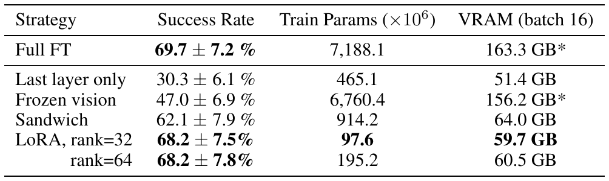

| Strategy（策略） | Success Rate（成功率） | Train Params (×10⁶) | VRAM (batch 16) |
| --- | --- | --- | --- |
| Full FT | 69.7 ± 7.2 % | 7,188.1 | 163.3 GB* |
| Last layer only | 30.3 ± 6.1 % | 465.1 | 51.4 GB |
| Frozen vision | 47.0 ± 6.9 % | 6,760.4 | 156.2 GB* |
| Sandwich | 62.1 ± 7.9 % | 914.2 | 64.0 GB |
| LoRA, rank=32 | 68.2 ± 7.5 % | 97.6 | 59.7 GB |
| LoRA, rank=64 | 68.2 ± 7.8 % | 195.2 | 60.5 GB |

**Original caption:** Table 1: Parameter-efficient fine-tuning evaluation. LoRA fine-tuning achieves the best performance-compute trade-off, matching full fine-tuning performance while training only 1.4% of the model parameters. Mean success ± StdErr computed across 33 rollouts per approach on select Franka-Tabletop tasks (see Table 8 for details). ∗: Sharded across 2 GPUs with FSDP [77].

**中文图注:** 表 1：参数高效微调评测。LoRA 取得最佳性能-计算权衡，在只训练 1.4% 参数的情况下追平全量微调。平均成功率 ± 标准误基于每种方法 33 次 rollout（部分 Franka-Tabletop 任务）。∗ 表示使用 FSDP 分片到 2 张 GPU。

**Reading note:** 关注三行对照：只调最后一层（30.3%）与冻结视觉编码器（47.0%）都显著偏低 → 视觉特征必须适配；sandwich（62.1%）以 1/8 可训练参数接近全量（69.7%）；LoRA r=32（68.2%）用 97.6M 参数（约 1.4%）追平全量。r=32 与 r=64 几乎无差异，说明秩不敏感。

**Source:** p.10 S048

**Original:** 5.4 Memory-Efficient Inference via Quantization. OpenVLA, a 7B-parameter model, consumes more memory at inference time than prior open-source generalist policies such as Octo, which has <100M parameters. We follow best-practices from LLM serving by saving and loading OpenVLA in bfloat16 precision for inference (our default approach), which cuts the memory footprint in half, allowing us to serve OpenVLA on GPUs with only 16GB of GPU memory. In this section, we test whether we can further reduce the required memory for policy inference and broaden accessibility of VLA policies, by using modern quantization techniques developed for serving LLMs [27, 88]. These approaches load the weights of the network at lower precision, thereby trading off reduced memory requirements for potentially reduced inference speed and accuracy.

**中文:** 5.4 通过量化实现显存高效的推理。OpenVLA 是一个 7B 参数模型，推理时比 Octo 等参数不足 1 亿的既有开源通用策略占用更多显存。我们遵循 LLM 部署的最佳实践，在推理时以 bfloat16 精度保存与加载 OpenVLA（我们的默认方式），这使显存占用减半，使 OpenVLA 可以在仅有 16GB 显存的 GPU 上部署。本节我们测试能否借助为 LLM 部署开发的现代量化技术 [27, 88]，进一步降低策略推理所需显存、扩大 VLA 策略的可及性。这类方法以更低精度加载网络权重，用可能降低的推理速度与精度来换取更低的显存需求。

**Source:** p.10 C007

**Original:** Figure 6: OpenVLA inference speed for various GPUs. Both bfloat16 and int4 quantization achieve high throughput, especially on GPUs with Ada Lovelace architecture (RTX 4090, H100). Further speed-ups are possible with modern LLM inference frameworks like TensorRT-LLM [89]. ♠: Model sharded across two GPUs to fit.

**中文:** 图 6：OpenVLA 在多种 GPU 上的推理速度。bfloat16 与 int4 量化都能达到较高吞吐，在 Ada Lovelace 架构 GPU（RTX 4090、H100）上尤为明显。使用 TensorRT-LLM [89] 等现代 LLM 推理框架还可以进一步加速。♠：为放入显存而将模型分片到两张 GPU。

### Fig. 6. 各 GPU 上的 OpenVLA 推理速度（bfloat16 vs. int4）

**Placed near:** p.11 S051（图注位于 p.10）
**Source:** p.10 C007

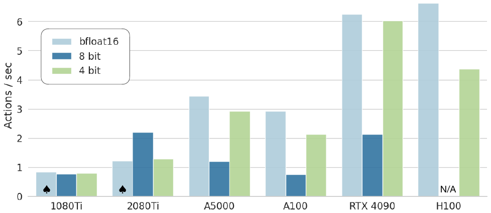

**Original caption:** Figure 6: OpenVLA inference speed for various GPUs. Both bfloat16 and int4 quantization achieve high throughput, especially on GPUs with Ada Lovelace architecture (RTX 4090, H100). Further speed-ups are possible with modern LLM inference frameworks like TensorRT-LLM [89]. ♠: Model sharded across two GPUs to fit.

**中文图注:** 图 6：OpenVLA 在多种 GPU 上的推理速度。bfloat16 与 int4 量化均能达到高吞吐，Ada Lovelace 架构（RTX 4090、H100）上尤为突出；使用 TensorRT-LLM [89] 等现代推理框架可进一步加速。图中带有 "N/A" 标记的配置表示该精度在该 GPU 上不可用/未测。

**Reading note:** 横轴是不同 GPU，纵轴是可达控制频率（Hz）。要点是：int4 量化在多数 GPU 上比 bfloat16 更快或相当，而 8-bit 量化反而更慢（见正文对量化开销的解释）。

**Source:** p.10 C008

**Original:** Table 2: Performance with quantized inference. 4-bit quantization matches the performance of bfloat16 inference (our default approach) while reducing the GPU memory footprint by more than half. Mean success ± StdErr computed across 8 representative BridgeData V2 tasks [6] and 80 rollouts per approach (see Table 5 for details).

**中文:** 表 2：量化推理下的性能。4-bit 量化达到与 bfloat16 推理（我们的默认方式）相同的性能，同时把显存占用降低一半以上。平均成功率 ± 标准误基于 8 个代表性 BridgeData V2 任务 [6]、每种方法 80 次 rollout 计算（细节见表 5）。

### Table 2. 量化推理的性能与显存占用

**Placed near:** p.11 S051（表注位于 p.10）
**Source:** p.10 C008

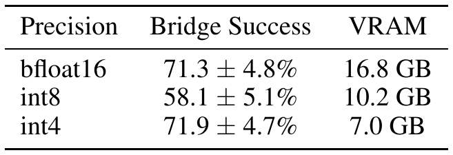

| Precision（精度） | Bridge Success（Bridge 成功率） | VRAM |
| --- | --- | --- |
| bfloat16 | 71.3 ± 4.8% | 16.8 GB |
| int8 | 58.1 ± 5.1% | 10.2 GB |
| int4 | 71.9 ± 4.7% | 7.0 GB |

**Original caption:** Table 2: Performance with quantized inference. 4-bit quantization matches the performance of bfloat16 inference (our default approach) while reducing the GPU memory footprint by more than half. Mean success ± StdErr computed across 8 representative BridgeData V2 tasks [6] and 80 rollouts per approach (see Table 5 for details).

**中文图注:** 表 2：量化推理下的性能与显存。4-bit 量化追平 bfloat16 默认推理的性能，并把显存占用降低一半以上；表内为 8 个代表性 BridgeData V2 任务、每种方法 80 次 rollout 的平均成功率 ± 标准误。

**Reading note:** 关键对照是 int4（71.9%，7.0GB）与 bfloat16（71.3%，16.8GB）：显存不到一半而成功率相当；int8（58.1%）反而下降，原因见正文（8-bit 量化降低推理速度，进而改变闭环控制动力学）。

**Source:** p.10 S049

**Original:** ⁴ In Section 5.3 and Section 5.4, we experiment with a version of the OpenVLA model that is pretrained with a smaller robot data mixture (the same OpenX dataset mixture as Octo) and has a slightly smaller architecture which only uses a SigLIP [79] vision backbone instead of the fused DinoSigLIP encoder. We find that this simpler architecture still achieves strong performance in both fine-tuning tasks and "out-of-the-box" tasks.

**中文:** ⁴ 在 5.3 节与 5.4 节中，我们实验所用的 OpenVLA 版本使用较小的机器人数据混合（与 Octo 相同的 OpenX 数据集混合）预训练，架构也略小——仅使用 SigLIP [79] 视觉骨干，而非融合的 DinoSigLIP 编码器。我们发现这一更简单的架构在微调任务与"开箱即用"任务上仍能取得强劲性能。

## p.11 5.4 量化推理（续）· 6 讨论与局限 · 致谢

**Source:** p.11 S050

**Original:** of GPU memory. In this section, we test whether we can further reduce the required memory for policy inference and broaden accessibility of VLA policies, by using modern quantization techniques developed for serving LLMs [27, 88]. These approaches load the weights of the network at lower precision, thereby trading off reduced memory requirements for potentially reduced inference speed and accuracy.

**中文:** （接上页）…16GB 显存。本节我们测试能否借助为 LLM 部署开发的现代量化技术 [27, 88]，进一步降低策略推理所需显存、扩大 VLA 策略的可及性。这类方法以更低精度加载网络权重，用可能降低的推理速度与精度换取更低的显存需求。

**Source:** p.11 S051

**Original:** Concretely, we investigate serving the OpenVLA model with 8-bit and 4-bit precision on 8 representative BridgeData V2 tasks. We report memory footprint and rollout performance in Table 2. We also report achievable control frequencies on various consumer- and server-grade GPUs in Fig. 6. We observe that 8-bit quantization slows down inference across most GPUs, due to the overhead of the added quantization operations. 4-bit inference achieves higher throughput, since reduced GPU memory transfer compensates for the quantization overhead.

**中文:** 具体来说，我们在 8 个代表性 BridgeData V2 任务上研究以 8-bit 与 4-bit 精度部署 OpenVLA 模型，显存占用与 rollout 性能见表 2，在多种消费级与服务器级 GPU 上可达的控制频率见图 6。我们观察到，由于额外量化操作带来的开销，8-bit 量化在多数 GPU 上使推理变慢；4-bit 推理则取得更高吞吐，因为 GPU 显存传输量的降低补偿了量化开销。

**Source:** p.11 S052

**Original:** As a result of the reduced inference speed, we observe a substantial performance decrease with 8-bit quantization: on the A5000 GPU we use for our evaluations, we can only run the model at 1.2Hz, which significantly changes the system dynamics compared to the training dataset for the 5Hz non-blocking controller used in the BridgeData V2 tasks.⁵ Notably, 4-bit quantization results in similar performance as bfloat16 half-precision inference despite requiring less than half the amount of GPU memory. 4-bit quantized models can run at 3Hz on the A5000, thus more closely matching the system dynamics during data collection.

**中文:** 由于推理速度下降，我们观察到 8-bit 量化带来明显的性能下降：在评测所用的 A5000 GPU 上，模型只能以 1.2Hz 运行，相比 BridgeData V2 任务所用 5Hz 非阻塞控制器所对应的训练数据动力学，系统动力学发生了显著变化。⁵ 值得注意的是，4-bit 量化在所需显存不到一半的情况下，取得了与 bfloat16 半精度推理相近的性能；4-bit 量化模型在 A5000 上可达 3Hz，从而更接近数据采集时的系统动力学。

**Source:** p.11 S053

**Original:** 6 Discussion and Limitations. In this work, we presented OpenVLA, a state-of-the-art, open-source vision-language-action model that obtains strong performance for cross-embodiment robot control out-of-the-box. We also demonstrated that OpenVLA can be easily adapted to new robot setups via parameter-efficient fine-tuning techniques.

**中文:** 6 讨论与局限。在本工作中，我们提出 OpenVLA：一个最先进的开源视觉-语言-动作模型，在跨本体机器人控制上开箱即用即取得强劲性能。我们还证明，借助参数高效微调技术，OpenVLA 能够被方便地适配到新的机器人配置。

**Source:** p.11 S054

**Original:** The current OpenVLA model has several limitations. First, it currently only supports single-image observations. In reality, real-world robot setups are heterogeneous, with a wide range of possible sensory inputs [5]. Expanding OpenVLA to support multiple image and proprioceptive inputs as well as observation history is an important avenue for future work. Exploring the use of VLMs pretrained on interleaved image and text data may facilitate such flexible-input VLA fine-tuning.

**中文:** 当前的 OpenVLA 模型存在若干局限。第一，它目前只支持单张图像观测。而在现实中，真实机器人配置是异构的，可能的传感输入范围很广 [5]。把 OpenVLA 扩展到支持多路图像、本体感受输入以及观测历史，是未来工作的重要方向。探索使用在交错图像-文本数据上预训练的 VLM，可能有助于实现这类灵活输入的 VLA 微调。

**Source:** p.11 S055

**Original:** Secondly, improving the inference throughput of OpenVLA is critical to enable VLA control for high-frequency control setups such as ALOHA [90], which runs at 50Hz. This will also enable testing VLAs on more dexterous, bi-manual manipulation tasks than what we investigated in this work. Exploring the use of action chunking or alternative inference-time optimization techniques such as speculative decoding [91] offer potential remedies.

**中文:** 第二，提升 OpenVLA 的推理吞吐对于把 VLA 控制用于 ALOHA [90] 这类高频控制配置（运行频率 50Hz）至关重要。这也会使 VLA 能够在比本工作所研究更灵巧的双臂操作任务上接受测试。探索动作分块，或投机解码 [91] 等推理时优化技术，可能提供可行的改进手段。

**Source:** p.11 S056

**Original:** Additionally, there is room for further performance improvements. While OpenVLA outperforms prior generalist policies, it does not yet offer very high reliability on the tested tasks, typically achieving <90% success rate.

**中文:** 此外，性能仍有进一步提升的空间。尽管 OpenVLA 优于先前的通用策略，但在被测任务上还谈不上很高的可靠性，成功率通常低于 90%。

**Source:** p.11 S057

**Original:** Finally, due to compute limitations, many VLA design questions remain underexplored: What effect does the size of the base VLM have on VLA performance? Does co-training on robot action prediction data and Internet-scale vision-language data substantially improve VLA performance? What visual features are best-suited for VLA models? We hope that the release of the OpenVLA model and codebase will enable the community to jointly investigate these questions.

**中文:** 最后，受算力限制，许多 VLA 设计问题仍未得到充分探索：基座 VLM 的规模对 VLA 性能有何影响？在机器人动作预测数据与互联网规模视觉-语言数据上联合训练，是否能显著提升 VLA 性能？什么视觉特征最适合 VLA 模型？我们希望 OpenVLA 模型与代码库的发布能让社区共同研究这些问题。

**Source:** p.11 S058

**Original:** Acknowledgments. We are grateful to the Toyota Research Institute for providing significant funding and compute resources required to carry out this research. We also thank the Stanford Center for Research on Foundation Models for providing additional compute resources and Google DeepMind for alpha access to the RT-2-X API for our evaluations. We acknowledge additional support from Volkswagen, Physical Intelligence, ONR grants N00014-22-1-2621 and N00014-22-1-2293, the National Science Foundation through IIS-2246811, and DARPA ANSR.

**中文:** 致谢。我们感谢丰田研究院（Toyota Research Institute）为本研究提供的大额经费与计算资源；感谢斯坦福基础模型研究中心（Stanford Center for Research on Foundation Models）提供额外计算资源；感谢 Google DeepMind 提供 RT-2-X API 的 alpha 访问权限用于评测。我们同时感谢 Volkswagen、Physical Intelligence、ONR 基金 N00014-22-1-2621 与 N00014-22-1-2293、美国国家科学基金会 IIS-2246811 项目以及 DARPA ANSR 的额外支持。

**Source:** p.11 S059

**Original:** ⁵ We attribute the performance loss to low inference speed, since both 8-bit and 4-bit quantization achieve comparable token accuracy to bfloat16 inference when evaluated offline on training data. See Appendix D.4 for supporting details.

**中文:** ⁵ 我们把性能损失归因于推理速度偏低：在训练数据上离线评测时，8-bit 与 4-bit 量化都能达到与 bfloat16 推理相当的动作 token 准确率。支持细节见附录 D.4。

## 参考文献（References, pp.12-20）

> **说明**：pp.12–20 是编号 [1]–[117] 的参考文献表。为便于查阅，下面给出**压缩条目**：作者列表超过 4 位时压缩为“前 3 位, et al.”，其余保留标题、出处与年份；**完整条目（含全部作者）见同目录 PDF 的 pp.12–20**。参考文献属引用元数据（作者、标题、出版信息），按惯例不作中译。
>
> 正文中出现的 [n] 引用编号与下表编号一一对应。

- [1] Open X-Embodiment Collaboration, A. Padalkar, A. Pooley, et al. Open X-Embodiment: Robotic learning datasets and RT-X models. https://arxiv.org/abs/2310.08864, 2023.
- [2] A. Brohan, N. Brown, J. Carbajal, et al. Rt-1: Robotics transformer for real-world control at scale. In arXiv preprint arXiv:2212.06817, 2022.
- [3] C. Chi, S. Feng, Y. Du, et al. Diffusion policy: Visuomotor policy learning via action diffusion. In Proceedings of Robotics: Science and Systems (RSS), 2023.
- [4] A. Xie, L. Lee, T. Xiao, and C. Finn. Decomposing the generalization gap in imitation learning for visual robotic manipulation. arXiv preprint arXiv:2307.03659, 2023.
- [5] Octo Model Team, D. Ghosh, H. Walke, et al. Octo: An open-source generalist robot policy. https://octo-models.github.io, 2023.
- [6] H. Walke, K. Black, A. Lee, et al. Bridgedata v2: A dataset for robot learning at scale, 2023.
- [7] A. Brohan, N. Brown, J. Carbajal, et al. Rt-2: Vision-language-action models transfer web knowledge to robotic control. In arXiv preprint arXiv:2307.15818, 2023.
- [8] A. Radford, J. W. Kim, C. Hallacy, et al. Learning transferable visual models from natural language supervision. In International Conference on Machine Learning (ICML), volume 139, pages 8748–8763, 2021.
- [9] X. Zhai, B. Mustafa, A. Kolesnikov, and L. Beyer. Sigmoid loss for language image pretraining. In International Conference on Computer Vision (ICCV), 2023.
- [10] H. Touvron, L. Martin, K. Stone, et al. Llama 2: Open foundation and fine-tuned chat models. arXiv preprint arXiv:2307.09288, 2023.
- [11] A. Khazatsky, K. Pertsch, S. Nair, et al. Droid: A large-scale in-the-wild robot manipulation dataset. 2024.
- [12] S. Nair, A. Rajeswaran, V. Kumar, et al. R3m: A universal visual representation for robot manipulation. In CoRL, 2022.
- [13] S. Karamcheti, S. Nair, A. S. Chen, et al. Languagedriven representation learning for robotics. ArXiv, abs/2302.12766, 2023. URL https: //api.semanticscholar.org/CorpusID:257205716.
- [14] M. Shridhar, L. Manuelli, and D. Fox. Cliport: What and where pathways for robotic manipulation. In Conference on robot learning, pages 894–906. PMLR, 2022.
- [15] A. Stone, T. Xiao, Y. Lu, et al. Open-world object manipulation using pre-trained vision-language models. arXiv preprint arXiv:2303.00905, 2023.
- [16] D. Driess, F. Xia, M. S. Sajjadi, et al. Palm-e: An embodied multimodal language model. arXiv preprint arXiv:2303.03378, 2023.
- [17] Covariant. Introducing RFM-1: Giving robots human-like reasoning capabilities. 2024. URL https://covariant.ai/insights/
- [18] Wayve. Lingo-2: Driving with natural language. 2024. URL https://wayve.ai/thinking/
- [19] X. Chen, X. Wang, S. Changpinyo, et al. Pali: A jointly-scaled multilingual language-image model. ArXiv, abs/2209.06794, 2022. URL https://api.semanticscholar.org/CorpusID:252222320.
- [20] X. Chen, X. Wang, L. Beyer, et al. PaLI-3 vision language models: Smaller, faster, stronger. arXiv preprint arXiv:2310.09199, 2023.
- [21] T. Wolf, L. Debut, V. Sanh, et al. Transformers: State-of-the-art natural language processing. In Proceedings of the 6th International Conference on Learning Representations, 2020. URL https://arxiv.org/abs/1910.03771.
- [22] H. Touvron, T. Lavril, G. Izacard, et al. Llama: Open and efficient foundation language models. arXiv preprint arXiv:2302.13971, 2023.
- [23] A. Q. Jiang, A. Sablayrolles, A. Mensch, et al. Mistral 7b. arXiv preprint arXiv:2310.06825, 2023.
- [24] G. Team, T. Mesnard, C. Hardin, et al. Gemma: Open models based on gemini research and technology. arXiv preprint arXiv:2403.08295, 2024.
- [25] M. Oquab, T. Darcet, T. Moutakanni, et al. Dinov2: Learning robust visual features without supervision. arXiv preprint arXiv:2304.07193, 2023.
- [26] E. J. Hu, Y. Shen, P. Wallis, et al. Lora: Low-rank adaptation of large language models. arXiv preprint arXiv:2106.09685, 2021.
- [27] T. Dettmers, A. Pagnoni, A. Holtzman, and L. Zettlemoyer. Qlora: Efficient finetuning of quantized llms. Advances in Neural Information Processing Systems, 36, 2024.
- [28] Y. Goyal, T. Khot, D. Summers-Stay, et al. Making the V in VQA matter: Elevating the role of image understanding in visual question answering. In Computer Vision and Pattern Recognition (CVPR), 2017.
- [29] D. A. Hudson and C. D. Manning. GQA: A new dataset for real-world visual reasoning and compositional question answering. In Computer Vision and Pattern Recognition (CVPR), 2019.
- [30] A. Singh, V. Natarajan, M. Shah, et al. Towards VQA models that can read. In Computer Vision and Pattern Recognition (CVPR), 2019.
- [31] J. P. Bigham, C. Jayant, H. Ji, et al. VizWiz: nearly real-time answers to visual questions. In User Interface Software and Technology (UIST), pages 333–342, 2010.
- [32] S. Kazemzadeh, V. Ordonez, M. Matten, and T. Berg. ReferItGame: Referring to objects in photographs of natural scenes. In Empirical Methods in Natural Language Processing (EMNLP), pages 787–798, 2014.
- [33] L. Yu, P. Poirson, S. Yang, et al. Modeling context in referring expressions. In European Conference on Computer Vision (ECCV), 2016.
- [34] T. Mesnard, C. Hardin, R. Dadashi, et al. Gemma: Open models based on gemini research and technology. arXiv preprint arXiv:2403.08295, 2024.
- [35] Y. Li, S. Bubeck, R. Eldan, et al. Textbooks are all you need ii: phi-1.5 technical report. arXiv preprint arXiv:2309.05463, 2023.
- [36] J. Bai, S. Bai, Y. Chu, et al. Qwen technical report. arXiv preprint arXiv:2309.16609, 2023.
- [37] J. Li, D. Li, C. Xiong, and S. C. H. Hoi. BLIP: Bootstrapping language-image pre-training for unified vision-language understanding and generation. In International Conference on Machine Learning (ICML), 2022.
- [38] J. Li, D. Li, S. Savarese, and S. C. H. Hoi. BLIP-2: Bootstrapping language-image pre-training with frozen image encoders and large language models. In International Conference on Machine Learning (ICML), 2023.
- [39] W. Dai, J. Li, D. Li, et al. InstructBLIP: Towards general-purpose vision-language models with instruction tuning. arXiv preprint arXiv:2305.06500, 2023.
- [40] H. H. Tan and M. Bansal. LXMERT: Learning cross-modality encoder representations from transformers. In Empirical Methods in Natural Language Processing (EMNLP), 2019.
- [41] H. Laurençon, L. Saulnier, L. Tronchon, et al. OBELICS: An open web-scale filtered dataset of interleaved image-text documents. In Neural Information Processing Systems Track on Datasets and Benchmarks (NeurIPS Datasets and Benchmarks), 2023.
- [42] H. Liu, C. Li, Q. Wu, and Y. J. Lee. Visual instruction tuning. In Advances in Neural Information Processing Systems (NeurIPS), 2023.
- [43] H. Liu, C. Li, Y. Li, and Y. J. Lee. Improved baselines with visual instruction tuning. arXiv preprint arXiv:2310.03744, 2023.
- [44] S. Karamcheti, S. Nair, A. Balakrishna, et al. Prismatic vlms: Investigating the design space of visually-conditioned language models. arXiv preprint arXiv:2402.07865, 2024.
- [45] D. Kalashnikov, A. Irpan, P. Pastor, et al. QT-Opt: Scalable deep reinforcement learning for vision-based robotic manipulation. arXiv preprint arXiv:1806.10293, 2018.
- [46] D. Kalashnkov, J. Varley, Y. Chebotar, et al. Mt-opt: Continuous multi-task robotic reinforcement learning at scale. arXiv, 2021.
- [47] F. Ebert, Y. Yang, K. Schmeckpeper, et al. Bridge data: Boosting generalization of robotic skills with cross-domain datasets. arXiv preprint arXiv:2109.13396, 2021.
- [48] K. Ehsani, T. Gupta, R. Hendrix, et al. Imitating shortest paths in simulation enables effective navigation and manipulation in the real world. arXiv preprint arXiv:2312.02976, 2023.
- [49] H. Bharadhwaj, J. Vakil, M. Sharma, et al. Roboagent: Generalization and efficiency in robot manipulation via semantic augmentations and action chunking. arXiv preprint arXiv:2309.01918, 2023.
- [50] L. Pinto and A. Gupta. Supersizing self-supervision: Learning to grasp from 50k tries and 700 robot hours. In 2016 IEEE international conference on robotics and automation (ICRA), pages 3406–3413. IEEE, 2016.
- [51] A. Mandlekar, Y. Zhu, A. Garg, et al. Roboturk: A crowdsourcing platform for robotic skill learning through imitation. In Conference on Robot Learning, pages 879–893. PMLR, 2018.
- [52] A. Gupta, A. Murali, D. P. Gandhi, and L. Pinto. Robot learning in homes: Improving generalization and reducing dataset bias. Advances in neural information processing systems, 31, 2018.
- [53] S. Dasari, F. Ebert, S. Tian, et al. Robonet: Large-scale multi-robot learning. CoRL, 2019.
- [54] S. Cabi, S. G. Colmenarejo, A. Novikov, et al. Scaling data-driven robotics with reward sketching and batch reinforcement learning. RSS, 2019.
- [55] E. Jang, A. Irpan, M. Khansari, et al. Bc-z: Zero-shot task generalization with robotic imitation learning. In Conference on Robot Learning, pages 991–1002. PMLR, 2022.
- [56] H.-S. Fang, H. Fang, Z. Tang, et al. Rh20t: A comprehensive robotic dataset for learning diverse skills in one-shot. Towards Generalist Robots: Learning Paradigms for Scalable Skill Acquisition@ CoRL2023, 3:5, 2023.
- [57] C. Devin, A. Gupta, T. Darrell, et al. Learning modular neural network policies for multi-task and multi-robot transfer. In Proceedings of IEEE International Conference on Robotics and Automation, 2017.
- [58] E. S. Hu, K. Huang, O. Rybkin, and D. Jayaraman. Know thyself: Transferable visual control policies through robot-awareness. In International Conference on Learning Representations, 2022.
- [59] J. H. Yang, D. Sadigh, and C. Finn. Polybot: Training one policy across robots while embracing variability. In 7th Annual Conference on Robot Learning, 2023. URL https: //openreview.net/forum?id=HEIRj51lcS.
- [60] S. Reed, K. Zolna, E. Parisotto, et al. A generalist agent. Transactions on Machine Learning Research, 2022. ISSN 2835-8856.
- [61] G. Salhotra, I.-C. A. Liu, and G. Sukhatme. Bridging action space mismatch in learning from demonstrations. arXiv preprint arXiv:2304.03833, 2023.
- [62] I. Radosavovic, B. Shi, L. Fu, et al. Robot learning with sensorimotor pre-training. In Conference on Robot Learning, 2023.
- [63] D. Shah, A. Sridhar, A. Bhorkar, et al. Gnm: A general navigation model to drive any robot. In 2023 IEEE International Conference on Robotics and Automation (ICRA), pages 7226–7233. IEEE, 2023.
- [64] K. Bousmalis, G. Vezzani, D. Rao, et al. Robocat: A self-improving foundation agent for robotic manipulation. arXiv preprint arXiv:2306.11706, 2023.
- [65] D. Shah, A. Sridhar, N. Dashora, et al. ViNT: A foundation model for visual navigation. In 7th Annual Conference on Robot Learning, 2023. URL https://arxiv.org/abs/2306.14846.
- [66] J. Yang, C. Glossop, A. Bhorkar, et al. Pushing the limits of cross-embodiment learning for manipulation and navigation. arXiv preprint arXiv:2402.19432, 2024.
- [67] S. Y. Gadre, M. Wortsman, G. Ilharco, et al. Cows on pasture: Baselines and benchmarks for language-driven zero-shot object navigation. In Proceedings of the IEEE/CVF Conference on Computer Vision and Pattern Recognition, pages 23171–23181, 2023.
- [68] Y. Du, K. Konyushkova, M. Denil, et al. Vision-language models as success detectors. arXiv preprint arXiv:2303.07280, 2023.
- [69] Y. J. Ma, V. Kumar, A. Zhang, et al. Liv: Language-image representations and rewards for robotic control. In International Conference on Machine Learning, pages 23301–23320. PMLR, 2023.
- [70] X. Zhang, Y. Ding, S. Amiri, et al. Grounding classical task planners via vision-language models. arXiv preprint arXiv:2304.08587, 2023.
- [71] S. Sontakke, J. Zhang, S. Arnold, et al. Roboclip: One demonstration is enough to learn robot policies. Advances in Neural Information Processing Systems, 36, 2024.
- [72] J. Huang, S. Yong, X. Ma, et al. An embodied generalist agent in 3d world. In Proceedings of the International Conference on Machine Learning (ICML), 2024.
- [73] X. Li, M. Liu, H. Zhang, et al. Vision-language foundation models as effective robot imitators. arXiv preprint arXiv:2311.01378, 2023.
- [74] H. Zhen, X. Qiu, P. Chen, et al. 3d-vla: 3d visionlanguage-action generative world model. arXiv preprint arXiv:2403.09631, 2024.
- [75] PyTorch. Automatic mixed precision. URL https://pytorch.org/docs/stable/amp.html
- [76] T. Dao. Flashattention-2: Faster attention with better parallelism and work partitioning. arXiv preprint arXiv:2307.08691, 2023.
- [77] Y. Zhao, A. Gu, R. Varma, et al. Pytorch fsdp: experiences on scaling fully sharded data parallel. arXiv preprint arXiv:2304.11277, 2023.
- [78] N. Dorka, C. Huang, T. Welschehold, and W. Burgard. What matters in employing vision language models for tokenizing actions in robot control? In First Workshop on Vision-Language Models for Navigation and Manipulation at ICRA 2024.
- [79] X. Zhai, B. Mustafa, A. Kolesnikov, and L. Beyer. Sigmoid loss for language image pretraining. In Proceedings of the IEEE/CVF International Conference on Computer Vision, pages 11975–11986, 2023.
- [80] A. Radford, J. W. Kim, C. Hallacy, et al. Learning transferable visual models from natural language supervision. In International conference on machine learning, pages 8748–8763. PMLR, 2021.
- [81] P. Sharma, N. Ding, S. Goodman, and R. Soricut. Conceptual captions: A cleaned, hypernymed, image alt-text dataset for automatic image captioning. In Proceedings of the 56th Annual Meeting of the Association for Computational Linguistics (Volume 1: Long Papers), pages 2556–2565, 2018.
- [82] C. Schuhmann, R. Vencu, R. Beaumont, et al. Laion-400m: Open dataset of clip-filtered 400 million image-text pairs. arXiv preprint arXiv:2111.02114, 2021.
- [83] O. Sidorov, R. Hu, M. Rohrbach, and A. Singh. Textcaps: a dataset for image captioning with reading comprehension. In Computer Vision–ECCV 2020: 16th European Conference, Glasgow, UK, August 23–28, 2020, Proceedings, Part II 16, pages 742–758. Springer, 2020.
- [84] H. Face. Introducing idefics: An open reproduction of state-of-the-art visual langage model. Hugging Face Blog, 2024.
- [85] H. Liu, C. Li, Q. Wu, and Y. J. Lee. Visual instruction tuning. Advances in neural information processing systems, 36, 2024.
- [86] B. McKinzie, Z. Gan, J.-P. Fauconnier, et al. Mm1: Methods, analysis & insights from multimodal llm pre-training. arXiv preprint arXiv:2403.09611, 2024.
- [87] J. Lin, H. Yin, W. Ping, et al. Vila: On pre-training for visual language models. arXiv preprint arXiv:2312.07533, 2023.
- [88] T. Dettmers, M. Lewis, Y. Belkada, and L. Zettlemoyer. Gpt3. int8 (): 8-bit matrix multiplication for transformers at scale. Advances in Neural Information Processing Systems, 35: 30318–30332, 2022.
- [89] NVIDIA. TensorRT-LLM. URL https://github.com/NVIDIA/TensorRT-LLM
- [90] T. Z. Zhao, V. Kumar, S. Levine, and C. Finn. Learning fine-grained bimanual manipulation with low-cost hardware. arXiv preprint arXiv:2304.13705, 2023.
- [91] Y. Leviathan, M. Kalman, and Y. Matias. Fast inference from transformers via speculative decoding. In International Conference on Machine Learning, pages 19274–19286. PMLR, 2023.
- [92] A. Brohan, N. Brown, J. Carbajal, et al. Rt-1: Robotics transformer for real-world control at scale. arXiv preprint arXiv:2212.06817, 2022.
- [93] E. Rosete-Beas, O. Mees, G. Kalweit, et al. Latent plans for task agnostic offline reinforcement learning. In Proceedings of the 6th Conference on Robot Learning (CoRL), 2022.
- [94] O. Mees, J. Borja-Diaz, and W. Burgard. Grounding language with visual affordances over unstructured data. In Proceedings of the IEEE International Conference on Robotics and Automation (ICRA), London, UK, 2023.
- [95] S. Dass, J. Yapeter, J. Zhang, et al. CLVR jaco play dataset, 2023. URL https://github.com/clvrai/clvr_jaco_play_dataset.
- [96] J. Luo, C. Xu, X. Geng, et al. Multi-stage cable routing through hierarchical imitation learning. arXiv preprint arXiv:2307.08927, 2023.
- [97] A. Mandlekar, Y. Zhu, A. Garg, et al. RoboTurk: A crowdsourcing platform for robotic skill learning through imitation. CoRR, abs/1811.02790, 2018. URL http://arxiv.org/abs/ 1811.02790.
- [98] Y. Zhu, A. Joshi, P. Stone, and Y. Zhu. Viola: Imitation learning for vision-based manipulation with object proposal priors, 2023.
- [99] L. Y. Chen, S. Adebola, and K. Goldberg. Berkeley UR5 demonstration dataset. https: //sites.google.com/view/berkeley-ur5/home.
- [100] G. Zhou, V. Dean, M. K. Srirama, et al. Train offline, test online: A real robot learning benchmark, 2023.
- [101] C. Lynch, A. Wahid, J. Tompson, et al. Interactive language: Talking to robots in real time. IEEE Robotics and Automation Letters, 2023.
- [102] S. Belkhale, Y. Cui, and D. Sadigh. Hydra: Hybrid robot actions for imitation learning. arxiv, 2023.
- [103] Y. Zhu, P. Stone, and Y. Zhu. Bottom-up skill discovery from unsegmented demonstrations for long-horizon robot manipulation. IEEE Robotics and Automation Letters, 7(2):4126–4133, 2022.
- [104] Z. J. Cui, Y. Wang, N. M. M. Shafiullah, and L. Pinto. From play to policy: Conditional behavior generation from uncurated robot data. arXiv preprint arXiv:2210.10047, 2022.
- [105] M. Heo, Y. Lee, D. Lee, and J. J. Lim. Furniturebench: Reproducible real-world benchmark for long-horizon complex manipulation. In Robotics: Science and Systems, 2023.
- [106] G. Yan, K. Wu, and X. Wang. ucsd kitchens Dataset. August 2023.
- [107] S. Nasiriany, T. Gao, A. Mandlekar, and Y. Zhu. Learning and retrieval from prior data for skill-based imitation learning. In Conference on Robot Learning (CoRL), 2022.
- [108] H. Liu, S. Nasiriany, L. Zhang, et al. Robot learning on the job: Human-inthe-loop autonomy and learning during deployment. In Robotics: Science and Systems (RSS), 2023.
- [109] G. Quere, A. Hagengruber, M. Iskandar, et al. Shared Control Templates for Assistive Robotics. In 2020 IEEE International Conference on Robotics and Automation (ICRA), page 7, Paris, France, 2020.
- [110] S. Saxena, M. Sharma, and O. Kroemer. Multi-resolution sensing for real-time control with vision-language models. In 7th Annual Conference on Robot Learning, 2023. URL https://openreview.net/forum?id=WuBv9-IGDUA.
- [111] R. Shah, R. Martín-Martín, and Y. Zhu. MUTEX: Learning unified policies from multimodal task specifications. In 7th Annual Conference on Robot Learning, 2023. URL https: //openreview.net/forum?id=PwqiqaaEzJ.
- [112] X. Zhu, R. Tian, C. Xu, et al. Fanuc manipulation: A dataset for learning-based manipulation with fanuc mate 200id robot. 2023.
- [113] R. Mendonca, S. Bahl, and D. Pathak. Structured world models from human videos. CoRL, 2023.
- [114] J. Luo, C. Xu, F. Liu, et al. Fmb: a functional manipulation benchmark for generalizable robotic learning. arXiv preprint arXiv:2401.08553, 2024.
- [115] N. M. M. Shafiullah, A. Rai, H. Etukuru, et al. On bringing robots home, 2023.
- [116] B. Liu, Y. Zhu, C. Gao, et al. Libero: Benchmarking knowledge transfer for lifelong robot learning. Advances in Neural Information Processing Systems, 36, 2024.
- [117] V. Sanh, L. Debut, J. Chaumond, and T. Wolf. Distilbert, a distilled version of bert: smaller, faster, cheaper and lighter. arXiv preprint arXiv:1910.01108, 2019.

## p.21 附录 A 数据混合明细 · 附录 B 评测任务与详细结果

**Source:** p.21 S060

**Original:** A Data Mixture Details. We list our used data mixture in Table 3. The mixture mostly follows [5], with a few additional datasets.

**中文:** 附录 A 数据混合明细。我们在表 3 中列出所用的数据混合。该混合主要沿用 [5]，并额外加入少数数据集。

**Source:** p.21 C009

**Original:** Table 3: OpenVLA training data mixture using datasets from the Open X-Embodiment dataset [1], following [5] with a few additions.

**中文:** 表 3：OpenVLA 训练数据混合，使用 Open X-Embodiment 数据集 [1] 中的各数据集，沿用 [5] 并做了少量增补。

### Table 3. OpenVLA 训练数据混合（各数据集占比）

**Placed near:** p.21 S060
**Source:** p.21 C009

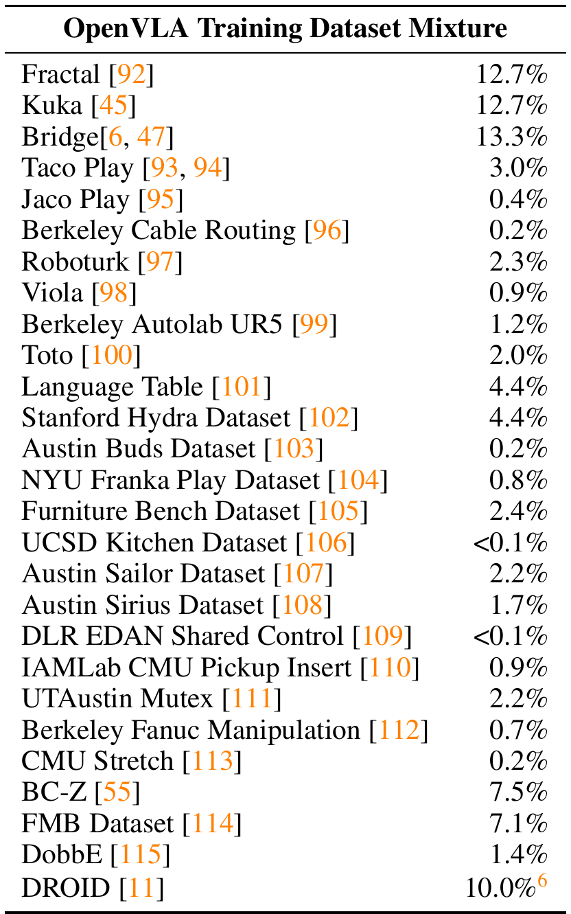

| Dataset（数据集） | 占比 | Dataset（数据集） | 占比 |
| --- | --- | --- | --- |
| Fractal [92] | 12.7% | UCSD Kitchen Dataset [106] | <0.1% |
| Kuka [45] | 12.7% | Austin Sailor Dataset [107] | 2.2% |
| Bridge [6, 47] | 13.3% | Austin Sirius Dataset [108] | 1.7% |
| Taco Play [93, 94] | 3.0% | DLR EDAN Shared Control [109] | <0.1% |
| Jaco Play [95] | 0.4% | IAMLab CMU Pickup Insert [110] | 0.9% |
| Berkeley Cable Routing [96] | 0.2% | UTAustin Mutex [111] | 2.2% |
| Roboturk [97] | 2.3% | Berkeley Fanuc Manipulation [112] | 0.7% |
| Viola [98] | 0.9% | CMU Stretch [113] | 0.2% |
| Berkeley Autolab UR5 [99] | 1.2% | BC-Z [55] | 7.5% |
| Toto [100] | 2.0% | FMB Dataset [114] | 7.1% |
| Language Table [101] | 4.4% | DobbE [115] | 1.4% |
| Stanford Hydra Dataset [102] | 4.4% | DROID [11] | 10.0% |
| Austin Buds Dataset [103] | 0.2% | NYU Franka Play Dataset [104] | 0.8% |
| Furniture Bench Dataset [105] | 2.4% | | |

**Original caption:** Table 3: OpenVLA training data mixture using datasets from the Open X-Embodiment dataset [1], following [5] with a few additions.

**中文图注:** 表 3：OpenVLA 训练数据混合。主要沿用 Octo [5] 的混合权重，并加入 DROID 等新数据集；占比较高的有 Bridge（13.3%）、Fractal 与 Kuka（各 12.7%）、DROID（10.0%）、BC-Z（7.5%）、FMB（7.1%）。

**Reading note:** 逐项与 Octo 的混合对比可以看出 OpenVLA 的数据配方差异；DROID 虽占 10%，但在训练最后三分之一阶段被移除（见 3.3 节与页脚注 6）。

**Source:** p.21 S061

**Original:** B Evaluation Tasks and Detailed Results. In this section, we provide more details on the BridgeData V2 WidowX and Google robot evaluations discussed in Section 5.1, as well as the Franka-Tabletop and Franka-DROID fine-tuning evaluations discussed in Section 5.2.

**中文:** 附录 B 评测任务与详细结果。本节给出 5.1 节所讨论的 BridgeData V2 WidowX 与 Google robot 评测、以及 5.2 节所讨论的 Franka-Tabletop 与 Franka-DROID 微调评测的更多细节。

**Source:** p.21 S062

**Original:** B.1 BridgeData V2 WidowX Evaluation Details. Here we focus specifically on BridgeData V2 evaluations discussed in Section 5.1.

**中文:** B.1 BridgeData V2 WidowX 评测细节。这里专门讨论 5.1 节涉及的 BridgeData V2 评测。

**Source:** p.21 S063

**Original:** B.1.1 BridgeData V2 Evaluation Tasks. As described in Section 5.1, we evaluate each generalist robot manipulation policy on 17 tasks with 10 trials each. In this section, we provide details on the task categories and individual tasks.

**中文:** B.1.1 BridgeData V2 评测任务。如 5.1 节所述，我们在 17 个任务上评测每个通用机器人操作策略，每个任务做 10 次试验。本节给出任务类别与各个任务的细节。

**Source:** p.21 S064

**Original:** In total, we evaluate on 5 visual generalization tasks, 2 motion generalization tasks, 3 physical generalization tasks, 4 semantic generalization tasks, and 3 language grounding tasks. Note that all tasks we evaluate on introduce some form of distribution shift since we are unable to procure the exact objects used in the original dataset (other distribution shifts naturally arise as we reproduce a real-world test environment originally constructed at a different location; see Appendix B.1.2 for a detailed discussion on such distribution shifts). All 17 tasks are depicted in Fig. 7. Each rollout is marked as a failure (0) or success (1).

**中文:** 总体而言，我们评测 5 个视觉泛化任务、2 个运动泛化任务、3 个物理泛化任务、4 个语义泛化任务与 3 个语言 grounding 任务。需要注意，所有被评测任务都引入了某种形式的分布偏移，因为我们无法采购到原始数据集中使用的完全相同的物体（另一些分布偏移则自然产生：我们复现的真实测试环境原本是在另一地点搭建的；关于这类分布偏移的详细讨论见附录 B.1.2）。全部 17 个任务见图 7。每次 rollout 记为失败（0）或成功（1）。

**Source:** p.21 S065

**Original:** ⁶ We remove DROID for the last third of training due to slow learning progress (see Section 3.3) and redistribute its mixture weights across all other datasets.

**中文:** ⁶ 由于学习进展缓慢，我们在训练的最后三分之一阶段将 DROID 移除（见 3.3 节），并把它的混合权重重新分配到其他所有数据集上。

**Source:** p.22 C010

**Original:** Figure 7: BridgeData V2 WidowX robot evaluation tasks. We evaluate every generalist robot policy on 4 types out-of-distribution (OOD) generalization tasks: visual, motion, physical, and semantic (as defined in Section 5.1). Every pair of images shows the start state and an example end state after the robot completes the task. We also rigorously assess language grounding in the 3 tasks shown in the bottom 3 rows, by changing the prompt while fixing the initial state and testing whether the policy can approach the correct target object.

**中文:** 图 7：BridgeData V2 WidowX 机器人评测任务。我们在 4 类分布外（OOD）泛化任务上评测每个通用机器人策略：视觉、运动、物理与语义（定义见 5.1 节）。每一对图像展示起始状态与机器人完成任务后的示例结束状态。我们还在最下面 3 行所示的 3 个任务中严格评估语言 grounding：固定初始状态、改变提示，考察策略能否接近正确的目标物体。

### Fig. 7. BridgeData V2（WidowX）17 个评测任务一览

**Placed near:** p.21 S064
**Source:** p.22 C010

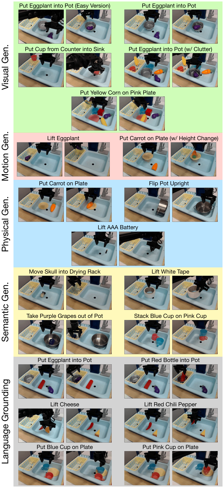

**Original caption:** Figure 7: BridgeData V2 WidowX robot evaluation tasks. We evaluate every generalist robot policy on 4 types out-of-distribution (OOD) generalization tasks: visual, motion, physical, and semantic (as defined in Section 5.1). …

**中文图注:** 图 7：BridgeData V2 WidowX 机器人评测任务。每行左侧标注任务类别（Visual Gen. / Motion Gen. / Physical Gen. / Semantic Gen. / Language Grounding），每对图像分别为起始状态与示例结束状态；最后 3 行为语言 grounding 任务（固定初始状态、只改变语言提示）。

**Reading note:** 把这 17 个任务与图 3 的成功率柱状图对照阅读：同一类别的任务难度差异很大（例如 "Lift Eggplant"、"Lift AAA Battery" 这类看似简单的任务反而很难），"Easy Version" 的差异在于机器人末端是否一开始就位于目标物体正上方。

## p.23 附录 B.1.1 评测任务细节（任务 1–7）

**Source:** p.23 S066

**Original:** marked as a failure (0) or success (1). In some more difficult tasks, we record partial successes (0.5); we describe the conditions for partial credit in the task descriptions below.

**中文:** （接上页）每次 rollout 记为失败（0）或成功（1）。在部分更困难的任务中，我们记录部分成功（0.5）；部分得分的条件在各任务描述中给出。

**Source:** p.23 S067

**Original:** Below we describe each of the 17 tasks, in the order shown in Fig. 7:

**中文:** 下面按图 7 中的顺序描述这 17 个任务：

**Source:** p.23 S068

**Original:** 1. Put Eggplant into Pot (Easy Version): The robot's goal is to pick up the eggplant and drop it into the pot. This is a visual generalization task because we use a handcrafted paper pot that has a different appearance than the pot used in the original BridgeData V2 training dataset (since we are unable to procure the original pot). Unlike all 16 other tasks, for this particular task we initialize the robot's end-effector directly above the eggplant before rolling out the policy; hence, we call this the "Easy Version" of the "Put Eggplant into Pot" task.

**中文:** 1. Put Eggplant into Pot（Easy Version，简单版）：机器人目标是抓起茄子并放入锅中。这属于视觉泛化任务，因为我们使用的是手工纸锅，其外观与原始 BridgeData V2 训练数据集中的锅不同（我们无法采购到原来的锅）。与另外 16 个任务不同，在这个任务中我们在 rollout 之前把机器人末端执行器直接初始化在茄子正上方；因此我们称之为"Put Eggplant into Pot"任务的"简单版"。

**Source:** p.23 S069

**Original:** 2. Put Eggplant into Pot: This is the same task as described above, except that the robot's end-effector is not initialized directly above the eggplant. Instead, we initialize it in a position that is fixed across all rollouts, which means that the robot must horizontally reach for the eggplant first before manipulating it. (Note: The same applies to all other tasks described below.) This is a visual generalization task for the same reason as above.

**中文:** 2. Put Eggplant into Pot：与上述任务相同，只是机器人末端执行器不再初始化在茄子正上方，而是固定在所有 rollout 都相同的某个位置；这意味着机器人必须先水平伸展去够到茄子，再进行操作。（注：下述所有其他任务都是如此。）归为视觉泛化任务的原因同上。

**Source:** p.23 S070

**Original:** 3. Put Cup from Counter into Sink: The robot's goal is to pick up the pink cup from either the kitchen countertop or drying rack and place it into the sink on the right. This is a visual generalization task because we use a pink cup rather than a blue cup (a blue cup is used in the original BridgeData V2 dataset, but we find that none of the methods we evaluate is able to manipulate it reliably – most likely because the color of the cup blends in with the color of the sink).

**中文:** 3. Put Cup from Counter into Sink：机器人目标是从厨房台面或沥水架上抓起粉色杯子，并把它放进右侧的水槽。这属于视觉泛化任务，因为我们使用粉色杯子而非蓝色杯子（原始 BridgeData V2 数据集使用蓝色杯子，但我们发现所评测的方法都无法可靠地操作它——很可能是因为杯子的颜色与水槽颜色接近）。

**Source:** p.23 S071

**Original:** 4. Put Eggplant into Pot (w/ Clutter): This is the same task as the "Put Eggplant into Pot" task, except that it is more difficult due to the presence of several distractor objects. It is a visual generalization task for the same reason discussed in the normal "Put Eggplant into Pot" task, and even more so given unseen distractors in the scene. Partial credit (0.5 out of 1) is rewarded when the robot moves towards the correct target object.

**中文:** 4. Put Eggplant into Pot（w/ Clutter，含杂物）：与"Put Eggplant into Pot"任务相同，但因为存在若干干扰物体而更难。归为视觉泛化任务的原因与常规版本相同，且场景中存在未见过的干扰物使其视觉泛化要求更高。当机器人朝正确目标物体移动时给部分分（0.5 / 1）。

**Source:** p.23 S072

**Original:** 5. Put Yellow Corn on Pink Plate: The robot's goal is to pick up the yellow corn and place it on the pink plate. This is a visual generalization task due to the presence of unseen distractor objects in the scene, such as a green dinosaur on the countertop in the back section of the sink. Partial credit (0.5 out of 1) is rewarded when the robot moves towards the correct target object.

**中文:** 5. Put Yellow Corn on Pink Plate：机器人目标是拿起黄色玉米并放到粉色盘子上。由于场景中存在未见过的干扰物（例如水槽后部台面上的绿色恐龙玩具），这属于视觉泛化任务。当机器人朝正确目标物体移动时给部分分（0.5 / 1）。

**Source:** p.23 S073

**Original:** 6. Lift Eggplant: The robot's goal is to grasp and lift the eggplant into the air. This is a motion generalization task because the eggplant is initialized in unseen positions and/or orientations, and the robot is forced to move beyond its training distribution of positions and/or orientations and often perform long-range reaching in order to complete the task. (Note: Long-range reaching is not demonstrated in this environment in the original BridgeData V2 demonstrations; see Appendix B.1.2 for details.) We find that this task, though seemingly simple, is deceptively challenging for many policies. Partial credit (0.5 out of 1) is rewarded when the robot makes contact with the eggplant.

**中文:** 6. Lift Eggplant：机器人目标是抓住并抬起茄子。这属于运动泛化任务，因为茄子的初始位置和/或朝向是未见过的，机器人必须超出其训练分布去移动，且往往需要长距离伸展才能完成任务。（注：在原始 BridgeData V2 示教中，该环境没有展示过长距离伸展；细节见附录 B.1.2。）我们发现，这个任务看似简单，但对许多策略而言难度具有迷惑性。当机器人接触到茄子时给部分分（0.5 / 1）。

**Source:** p.23 S074

**Original:** 7. Put Carrot on Plate (w/ Height Change): The robot's goal is to pick up the carrot and place it on the yellow plate. This is a motion generalization task because the plate is elevated from its usual position at the bottom of the sink, and the robot must adjust its trajectory to correctly place the carrot on the elevated platform (without knocking down the plate in the process). Partial credit (0.5 out of 1) is rewarded when the robot grasps the carrot and touches the plate with it.

**中文:** 7. Put Carrot on Plate（w/ Height Change，高度变化）：机器人目标是拿起胡萝卜并放到黄色盘子上。这属于运动泛化任务，因为盘子从水槽底部通常位置被抬高，机器人必须调整轨迹才能把胡萝卜正确放到抬高的平台上（且过程中不能把盘子碰倒）。当机器人抓住胡萝卜并用它碰到盘子时给部分分（0.5 / 1）。

## p.24 附录 B.1.1 评测任务细节（任务 8–17）· B.1.2

**Source:** p.24 S075

**Original:** 8. Put Carrot on Plate: This is the same task as above, except that the plate is at its normal position (at the bottom of the sink or drying rack). We consider this a physical generalization task because the carrot has a different size and shape than the one used in the original BridgeData V2 dataset, which is shorter and narrower. (Note that the previous version of this task listed above would also technically be a physical generalization task since it involves the same carrot, but we list it under the "motion generalization" category since that is the focus there.)

**中文:** 8. Put Carrot on Plate：与上一任务相同，只是盘子位于通常位置（水槽底部或沥水架上）。我们把它视为物理泛化任务，因为这里胡萝卜的尺寸与形状与原始 BridgeData V2 数据集所用不同——原始数据中的胡萝卜更短更细。（注：上面列出的该任务前一版本严格来说也属于物理泛化，因为用的是同一根胡萝卜，但我们在那里把它归入"运动泛化"，因为那是该任务的考察重点。）

**Source:** p.24 S076

**Original:** 9. Flip Pot Upright: The robot's goal is to manipulate the pot such that it is oriented upright in the sink at the end of the episode. This is a physical generalization task because this pot has a different size and shape than the one used in the original BridgeData V2 training demonstrations (the pot we use is wider and shorter).

**中文:** 9. Flip Pot Upright：机器人目标是通过操作把锅在回合结束时以直立姿态放置在水槽中。这属于物理泛化任务，因为该锅的尺寸与形状与原始 BridgeData V2 训练示教中的锅不同（我们使用的锅更宽更矮）。

**Source:** p.24 S077

**Original:** 10. Lift AAA Battery: The robot's goal is simply to grasp the AAA battery and lift it up into the air. This is considered a physical generalization task because the battery is much smaller and thinner than target objects seen in the BridgeData V2 training demonstrations in this environment; see Appendix B.1.2 for details. (Note that this target object does not exist in the original BridgeData V2 demonstrations in this environment, so this is also an instance of "semantic generalization", but we classify it solely as "physical generalization" since that is the main focus here).

**中文:** 10. Lift AAA Battery：机器人目标只是抓住 AAA 电池并把它抬起。我们把它视为物理泛化任务，因为该电池比该环境 BridgeData V2 训练示教中出现过的目标物体小得多、细得多；细节见附录 B.1.2。（注：该目标物体并未出现在此环境的原始 BridgeData V2 示教中，因此它同时也属于"语义泛化"，但由于本任务的主要考察点是物理泛化，我们只将其归为"物理泛化"。）

**Source:** p.24 S078

**Original:** 11. Move Skull into Drying Rack: The robot's goal is to grasp the skull windup toy and drop it into the yellow drying rack in the left part of the sink. This is a semantic generalization task since the skull is an unseen target object (does not appear in the BridgeData V2 training demonstrations).

**中文:** 11. Move Skull into Drying Rack：机器人目标是抓住骷髅发条玩具，并把它丢进水槽左侧的黄色沥水架中。这属于语义泛化任务，因为骷髅是未见过的目标物体（未出现在 BridgeData V2 训练示教中）。

**Source:** p.24 S079

**Original:** 12. Lift White Tape: The robot's goal is to grasp and lift the white roll of tape into the air. This is a semantic generalization task since the white tape roll is an unseen target object (does not appear in the BridgeData V2 training demonstrations). (Note that this task may also be considered as "physical generalization" because of its shape being different than the objects seen in the training demonstrations in this environment; most policies struggle to grasp objects with this ring structure, and they often move the robot's end-effector directly into the center region.)

**中文:** 12. Lift White Tape：机器人目标是抓住并抬起白色胶带卷。这属于语义泛化任务，因为白色胶带卷是未见过的目标物体（未出现在 BridgeData V2 训练示教中）。（注：由于它的形状与该环境训练示教中见过的物体不同，该任务也可视为"物理泛化"；多数策略都难以抓取这种环形结构的物体，常常直接把末端执行器移动到中心区域。）

**Source:** p.24 S080

**Original:** 13. Take Purple Grapes out of Pot: The robot's goal is to grasp the purple grapes lying inside the steel pot and remove it from the pot (by lifting it out and/or dropping it anywhere outside the pot). This is a semantic generalization task because it is an unseen language instruction; the robot has never seen this task in the original BridgeData V2 training dataset.

**中文:** 13. Take Purple Grapes out of Pot：机器人目标是抓住钢锅里的紫色葡萄并把它取出锅外（抬起和/或丢到锅外任意位置）。这属于语义泛化任务，因为它是一条未见过的语言指令；机器人在原始 BridgeData V2 训练数据集中从未见过该任务。

**Source:** p.24 S081

**Original:** 14. Stack Blue Cup on Pink Cup: The robot's goal is to grasp the blue cup and place it securely on top of the pink cup. This is a semantic generalization task because it is an unseen language instruction; the robot has never seen this task in this environment in the original BridgeData V2 training dataset. Partial credit (0.5 out of 1) is rewarded when the robot grasps the blue cup and touches the pink cup with the blue cup.

**中文:** 14. Stack Blue Cup on Pink Cup：机器人目标是抓住蓝色杯子并稳稳地放到粉色杯子之上。这属于语义泛化任务，因为它是一条未见过的语言指令；机器人在原始 BridgeData V2 训练数据集的该环境中从未见过该任务。当机器人抓住蓝色杯子并用它碰到粉色杯子时给部分分（0.5 / 1）。

**Source:** p.24 S082

**Original:** 15. Put {Eggplant, Red Bottle} into Pot: This is a language grounding task. The robot's goal is to put the specified target object into the pot. Both the eggplant and red bottle are present in the scene. We conduct paired evaluations: for the same initial state, we prompt the policy to target the eggplant in one episode, and then the red bottle in the next episode. We test each method 5 times with the eggplant and 5 times with the red bottle, using the same set of 5 initial states for both target objects. Partial credit (0.5 out of 1) is rewarded when the robot moves towards the correct target object.

**中文:** 15. Put {Eggplant, Red Bottle} into Pot：这是一个语言 grounding 任务。机器人目标是把握把中指定的目标物体放入锅中。场景中同时存在茄子与红色瓶子。我们做配对评测：对同一初始状态，在一个回合中提示策略操作茄子，在下一个回合中提示操作红色瓶子。每种方法用茄子测 5 次、用红色瓶子测 5 次，两个目标物体使用同一组 5 个初始状态。当机器人朝正确目标物体移动时给部分分（0.5 / 1）。

**Source:** p.24 S083

**Original:** 16. Lift {Cheese, Red Chili Pepper}: This is a language grounding task. The robot's goal is to grasp and lift the specified target object. We conduct paired evaluations as described in the task above. Partial credit (0.5 out of 1) is rewarded when the robot moves towards the correct target object. 17. Put {Blue Cup, Pink Cup} on Plate: This is a language grounding task. The robot's goal is to grasp the specified target object and place it onto the plate. We conduct paired evaluations as described in other language grounding tasks. Partial credit (0.5 out of 1) is rewarded when the robot moves towards the correct target object.

**中文:** 16. Lift {Cheese, Red Chili Pepper}：这是一个语言 grounding 任务。机器人目标是抓住并抬起把握把指定的目标物体。配对评测方式同上。当机器人朝正确目标物体移动时给部分分（0.5 / 1）。17. Put {Blue Cup, Pink Cup} on Plate：这是一个语言 grounding 任务。机器人目标是抓住把握把指定的目标物体并把它放到盘子上。配对评测方式与其他语言 grounding 任务相同。当机器人朝正确目标物体移动时给部分分（0.5 / 1）。

**Source:** p.24 S084

**Original:** B.1.2 Comparing Evaluation Tasks to Original BridgeData V2 Training Data. We conduct our evaluations in a sink environment used in the original BridgeData V2 dataset [6]. We reproduce the environment to match the original environment in the BridgeData V2 dataset with rough approximations for the robot's location relative to the sink, as well as the camera's placement

**中文:** B.1.2 评测任务与原始 BridgeData V2 训练数据的对比。我们的评测在原始 BridgeData V2 数据集 [6] 所用的水槽环境中进行。我们复现该环境以匹配 BridgeData V2 中的原始环境，其中机器人相对水槽的位置以及相机摆位都只是粗略近似，

## p.25 附录 B.1.2（续）· Fig. 8

**Source:** p.25 S085

**Original:** relative to the scene. Given the lack of precise measurements of these positions in the original dataset, we are unable to reproduce the exact environment setup, and natural distribution shifts arise due to slightly different robot, sink, and camera placements. In addition, since we evaluate robot policies in a different location than where the training demonstrations were collected from, other natural distribution shifts arise. For example, the lighting conditions and background (e.g., visible areas behind the sink) are inevitably different than what was seen in the training dataset. Furthermore, we are unable to procure the exact set of objects used in the original BridgeData V2 dataset, so there are distribution shifts between the objects used at train time and those used at test time.

**中文:** （接上页）…都只是粗略近似。由于原始数据集中这些位置缺少精确测量值，我们无法复现完全相同的环境配置，机器人、水槽与相机摆位的细微差别会自然带来分布偏移。此外，由于我们评测机器人策略的地点与采集训练示教的地点不同，也会产生其他自然分布偏移。例如，光照条件与背景（如水槽后方可见的区域）必然与训练数据集所见不同。再者，我们无法采购到原始 BridgeData V2 数据集中使用的完全相同的物体集合，因此训练时与测试时所用物体之间也存在分布偏移。

**Source:** p.25 S086

**Original:** Despite all these challenges, we find that certain generalist policies, such as OpenVLA and RT-2-X, can still generalize and perform various tasks fairly reliably "out-of-the-box". Other generalist policies, such as RT-1-X and Octo, can also complete some tasks, though they struggle when tested with more difficult generalization tasks in our BridgeData V2 evaluation suite.

**中文:** 尽管存在上述种种挑战，我们发现某些通用策略（如 OpenVLA 与 RT-2-X）仍能"开箱即用"地泛化并相当可靠地完成多种任务。其他通用策略（如 RT-1-X 与 Octo）也能完成部分任务，但在我们的 BridgeData V2 评测套件中面对更困难的泛化任务时表现吃力。

**Source:** p.25 S087

**Original:** The original BridgeData V2 dataset includes demonstrations of the following seven tasks in this specific sink environment: "Flip Pot Upright", "Put Carrot on Plate", "Put Cup from Counter (or Drying Rack) into Sink", "Put Eggplant into Pot", "Put Knife on Cutting Board", "Put Spoon in Pot", and "Turn Lever Vertical to Front". See Fig. 8 for samples images of all these tasks from the original dataset. Note that all training demonstrations collected in this environment are initialized such that the robot's end-effector is positioned directly above the target object in the beginning of the episode. (However, this is not the case across all environments in the BridgeData V2 dataset; in some other environments, the robot is initialized farther away from the target object, so it must horizontally reach for the object first before manipulating it.)

**中文:** 原始 BridgeData V2 数据集在这个特定的水槽环境中包含以下 7 个任务的示教："Flip Pot Upright"、"Put Carrot on Plate"、"Put Cup from Counter (or Drying Rack) into Sink"、"Put Eggplant into Pot"、"Put Knife on Cutting Board"、"Put Spoon in Pot" 以及 "Turn Lever Vertical to Front"。这些任务在原始数据集中的示例图像见图 8。请注意，在该环境中采集的所有训练示教，其回合开始时机器人末端执行器都被初始化在目标物体的正上方。（然而 BridgeData V2 数据集并非所有环境都是如此；在其他一些环境中，机器人被初始化在离目标物体更远的位置，因此必须先水平伸展去够到物体再操作。）

**Source:** p.25 C011

**Original:** Figure 8: Original BridgeData V2 sink environment tasks. Images from sample demonstrations in the sink environment from the original BridgeData V2 dataset reveal that all demonstrations in this environment were initialized such that the robot's end-effector was positioned immediately above the target object. Note that these initial states are different from the initial states we use in our BridgeData V2 evaluation tasks shown in Fig. 7. In our evaluations, we always initialize the robot's end-effector to a fixed location above the sink, rather than positioning it directly above the target object (except for one task: "Put Eggplant into Pot (Easy Version)").

**中文:** 图 8：原始 BridgeData V2 水槽环境任务。来自原始 BridgeData V2 数据集水槽环境的示例示教图像显示：该环境中的所有示教都把机器人末端执行器初始化在目标物体的正上方。注意这些初始状态与图 7 中我们的 BridgeData V2 评测任务所用初始状态不同。在我们的评测中，除一个任务（"Put Eggplant into Pot (Easy Version)"）外，我们始终把机器人末端执行器初始化在水槽上方的一个固定位置，而不是直接位于目标物体正上方。

### Fig. 8. 原始 BridgeData V2 水槽环境任务的初始状态

**Placed near:** p.25 S087
**Source:** p.25 C011

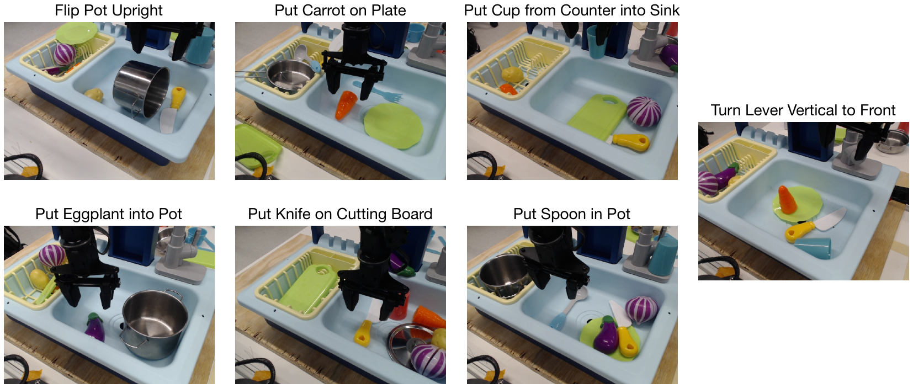

**Original caption:** Figure 8: Original BridgeData V2 sink environment tasks. Images from sample demonstrations in the sink environment from the original BridgeData V2 dataset reveal that all demonstrations in this environment were initialized such that the robot's end-effector was positioned immediately above the target object. …

**中文图注:** 图 8：原始 BridgeData V2 水槽环境任务。7 个任务（Flip Pot Upright、Put Carrot on Plate、Put Cup from Counter into Sink、Put Eggplant into Pot、Put Knife on Cutting Board、Put Spoon in Pot、Turn Lever Vertical to Front）的示例示教显示：训练时末端执行器一开始就位于目标物体正上方；而我们的评测任务（图 7）中，末端执行器被固定在水槽上方某处，机器人必须主动水平伸展。

**Reading note:** 这张图解释了为什么本文报告的 RT-1-X / Octo 成功率低于它们原论文：初始条件被刻意改得更难（需要长距离伸展），并叠加了物体与环境的分布偏移。

**Source:** p.25 S088

**Original:** In our BridgeData V2 evaluation suite, only one task – "Put Eggplant into Pot (Easy Version") – is initialized with the robot's end-effector hovering directly over the target object; in all 16 other tasks, the end-effector is initialized at a fixed location above the sink such that the robot must horizontally reach towards the object. This initial condition, in combination with the distribution shifts we introduce in the various types of OOD generalization in our evaluation suite, challenges the generalist policies and requires a high degree of robustness in order to complete the tasks successfully. Hence, the success rates for policies like RT-1-X and Octo are lower than what is reported in prior works. However, we find that other policies such as RT-2-X and OpenVLA still achieve relatively strong performance despite all these distribution shifts and challenges.

**中文:** 在我们的 BridgeData V2 评测套件中，只有一个任务——"Put Eggplant into Pot (Easy Version)"——把机器人末端执行器初始化在目标物体正上方悬停；其余 16 个任务中，末端执行器都初始化在水槽上方的固定位置，机器人必须水平伸展去够到物体。这一初始条件，加上我们在评测套件中引入的各类 OOD 泛化分布偏移，对通用策略构成挑战，需要很高的鲁棒性才能成功完成任务。因此，RT-1-X、Octo 这类策略的成功率低于先前工作报告的数值。不过我们发现，尽管存在这些分布偏移与挑战，RT-2-X 与 OpenVLA 等策略仍取得相对强劲的性能。

## p.26 附录 B.1.3 详细结果 · B.2 Google Robot 评测

**Source:** p.26 S089

**Original:** B.1.3 Detailed BridgeData V2 Evaluation Results. See Table 4 for the full BridgeData V2 WidowX evaluation results. The number of successes for each method, out of 10 trials, is listed for each of 17 tasks. OpenVLA achieves strongest performance in the majority of the tasks and has the highest aggregate success rate among the generalist policies. RT-2-X also shows good performance, outperforming RT-1-X and Octo, though it does not perform as well as OpenVLA. RT-1-X and Octo generally experience difficulty in these generalization tasks.

**中文:** B.1.3 BridgeData V2 详细评测结果。完整的 BridgeData V2 WidowX 评测结果见表 4。表中列出每种方法在 17 个任务上、每个任务 10 次试验中的成功次数。OpenVLA 在大多数任务上表现最强，并在通用策略中拥有最高的总体成功率。RT-2-X 也表现良好，优于 RT-1-X 与 Octo，但不如 OpenVLA。RT-1-X 与 Octo 在这些泛化任务上普遍存在困难。

**Source:** p.26 C012

**Original:** Table 4: Detailed BridgeData V2 WidowX evaluation results. We report performance on the full evaluation suite of 17 tasks (discussed in Section 5.1), including visual/motion/physical/semantic generalization tasks and language grounding tasks. Note that partial success (score of 0.5) is possible for some tasks; see Appendix B.1.1 for details. We find that OpenVLA performs best in most tasks and achieves highest performance overall, followed by RT-2-X. On the other hand, RT-1-X and Octo struggle in the evaluations, only getting 0–2 successes in several tasks. See Fig. 7 for illustrations of all tasks.

**中文:** 表 4：BridgeData V2 WidowX 详细评测结果。我们报告完整 17 个任务评测套件（见 5.1 节）上的性能，包括视觉/运动/物理/语义泛化任务与语言 grounding 任务。注意部分任务允许部分成功（得分 0.5），细节见附录 B.1.1。我们发现 OpenVLA 在多数任务上最好、总体性能最高，其次是 RT-2-X；而 RT-1-X 与 Octo 在评测中表现挣扎，在若干任务上只取得 0–2 次成功。所有任务的图示见图 7。

### Table 4. BridgeData V2 WidowX 逐任务成功次数（17 任务 × 10 次试验）

**Placed near:** p.26 S089
**Source:** p.26 C012

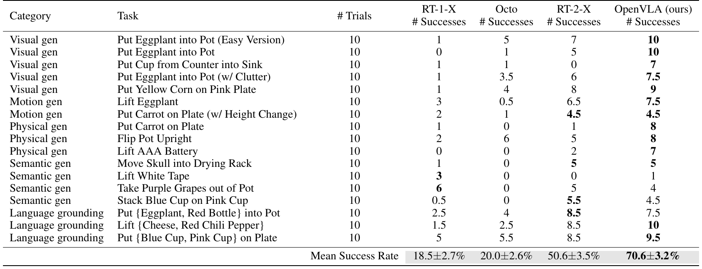

| Category | Task | # Trials | RT-1-X # Successes | Octo # Successes | RT-2-X # Successes | OpenVLA (ours) # Successes |
| --- | --- | --- | --- | --- | --- | --- |
| Visual gen | Put Eggplant into Pot (Easy Version) | 10 | 1 | 5 | 7 | 10 |
| Visual gen | Put Eggplant into Pot | 10 | 0 | 1 | 5 | 10 |
| Visual gen | Put Cup from Counter into Sink | 10 | 1 | 1 | 0 | 7 |
| Visual gen | Put Eggplant into Pot (w/ Clutter) | 10 | 1 | 3.5 | 6 | 7.5 |
| Visual gen | Put Yellow Corn on Pink Plate | 10 | 1 | 4 | 8 | 9 |
| Motion gen | Lift Eggplant | 10 | 3 | 0.5 | 6.5 | 7.5 |
| Motion gen | Put Carrot on Plate (w/ Height Change) | 10 | 2 | 1 | 4.5 | 4.5 |
| Physical gen | Put Carrot on Plate | 10 | 1 | 0 | 1 | 8 |
| Physical gen | Flip Pot Upright | 10 | 2 | 6 | 5 | 8 |
| Physical gen | Lift AAA Battery | 10 | 0 | 0 | 2 | 7 |
| Semantic gen | Move Skull into Drying Rack | 10 | 1 | 0 | 5 | 5 |
| Semantic gen | Lift White Tape | 10 | 3 | 0 | 0 | 1 |
| Semantic gen | Take Purple Grapes out of Pot | 10 | 6 | 0 | 5 | 4 |
| Semantic gen | Stack Blue Cup on Pink Cup | 10 | 0.5 | 0 | 5.5 | 4.5 |
| Language grounding | Put {Eggplant, Red Bottle} into Pot | 10 | 2.5 | 4 | 8.5 | 7.5 |
| Language grounding | Lift {Cheese, Red Chili Pepper} | 10 | 1.5 | 2.5 | 8.5 | 10 |
| Language grounding | Put {Blue Cup, Pink Cup} on Plate | 10 | 5 | 5.5 | 8.5 | 9.5 |
| **Mean Success Rate** | | | **18.5 ± 2.7%** | **20.0 ± 2.6%** | **50.6 ± 3.5%** | **70.6 ± 3.2%** |

**Original caption:** Table 4: Detailed BridgeData V2 WidowX evaluation results. We report performance on the full evaluation suite of 17 tasks (discussed in Section 5.1), including visual/motion/physical/semantic generalization tasks and language grounding tasks. …

**中文图注:** 表 4：BridgeData V2 WidowX 逐任务详细结果（成功次数 / 10 次试验）。OpenVLA 平均成功率 70.6 ± 3.2%，RT-2-X 50.6 ± 3.5%，Octo 20.0 ± 2.6%，RT-1-X 18.5 ± 2.7%。

**Reading note:** 注意两处分化：RT-2-X 在 "Lift White Tape"、"Take Purple Grapes out of Pot" 等语义泛化任务上领先，而 OpenVLA 在 "Put Carrot on Plate"、"Lift AAA Battery"、"Lift {Cheese, Red Chili Pepper}" 等物理/语言 grounding 任务上领先。

**Source:** p.26 S090

**Original:** Additionally, in Table 5, we provide the full evaluation results for the quantized inference experiments that were summarized in Table 2. For these evaluations, we test policies on 8 representative BridgeData V2 tasks spanning all task categories in the full evaluation suite.

**中文:** 另外，我们在表 5 中给出表 2 所汇总的量化推理实验的完整评测结果。这些评测在 8 个具有代表性的 BridgeData V2 任务上进行，覆盖完整评测套件中的所有任务类别。

**Source:** p.26 C013

**Original:** Table 5: Full quantized inference results. Here we present the detailed version of the results shown in Table 2.

**中文:** 表 5：量化推理完整结果。此处给出表 2 所示结果的详细版本。

### Table 5. 量化推理逐任务成功次数（bfloat16 / int8 / int4）

**Placed near:** p.26 S090
**Source:** p.26 C013

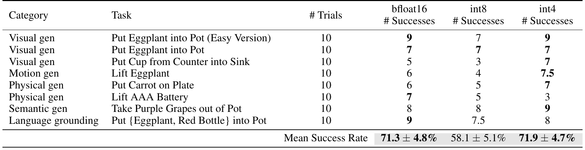

| Category | Task | # Trials | bfloat16 # Successes | int8 # Successes | int4 # Successes |
| --- | --- | --- | --- | --- | --- |
| Visual gen | Put Eggplant into Pot (Easy Version) | 10 | 9 | 7 | 9 |
| Visual gen | Put Eggplant into Pot | 10 | 7 | 7 | 7 |
| Visual gen | Put Cup from Counter into Sink | 10 | 5 | 3 | 7 |
| Motion gen | Lift Eggplant | 10 | 6 | 4 | 7.5 |
| Physical gen | Put Carrot on Plate | 10 | 6 | 5 | 7 |
| Physical gen | Lift AAA Battery | 10 | 7 | 5 | 3 |
| Semantic gen | Take Purple Grapes out of Pot | 10 | 8 | 8 | 9 |
| Language grounding | Put {Eggplant, Red Bottle} into Pot | 10 | 9 | 7.5 | 8 |
| **Mean Success Rate** | | | **71.3 ± 4.8%** | **58.1 ± 5.1%** | **71.9 ± 4.7%** |

**Original caption:** Table 5: Full quantized inference results. Here we present the detailed version of the results shown in Table 2.

**中文图注:** 表 5：量化推理完整结果（成功次数 / 10 次试验）。平均成功率：bfloat16 为 71.3 ± 4.8%，int8 为 58.1 ± 5.1%，int4 为 71.9 ± 4.7%。

**Reading note:** int8 的劣势并非"精度不够"，而是推理变慢导致闭环控制频率下降（见 5.4 节与附录 D.4 的 blocking control 实验）。逐任务看，int8 在 "Lift Eggplant"、"Put Cup from Counter into Sink" 等任务上损失最大。

**Source:** p.26 S091

**Original:** B.2 Google Robot Evaluation Details. In this section, we provide more details on the Google robot evaluations introduced in Section 5.1.

**中文:** B.2 Google Robot 评测细节。本节给出 5.1 节所介绍 Google robot 评测的更多细节。

**Source:** p.26 S092

**Original:** B.2.1 Google Robot Evaluation Tasks. On the Google robot, we evaluate each generalist robot policy on 12 tasks with 5 rollouts each, for a total of 60 rollouts. The first five tasks test on in-distribution conditions, and the last seven tasks test on more difficult out-of-distribution (OOD) conditions. All tasks are depicted in Fig. 9. Each rollout is marked as a failure (0) or success (1). We describe the 12 tasks below: 1. Pick Coke Can (in-distribution): The robot is positioned in front of a platform with a can of Coke on top of it. The robot's goal is to grasp and lift the Coke can.

**中文:** B.2.1 Google Robot 评测任务。在 Google robot 上，我们在 12 个任务上评测每个通用机器人策略，每个任务 5 次 rollout，共 60 次。前 5 个任务测试分布内条件，后 7 个任务测试更困难的分布外（OOD）条件。所有任务见图 9。每次 rollout 记为失败（0）或成功（1）。12 个任务描述如下：1. Pick Coke Can（分布内）：机器人位于一个平台上放着可乐罐的台面前方，目标是抓起并抬起可乐罐。

## p.27 附录 B.2.1 Google Robot 评测任务（任务 2–6）

**Source:** p.27 C014

**Original:** Figure 9: Google robot evaluation tasks. We evaluate every generalist robot policy on in-distribution tasks and out-of-distribution (OOD) generalization tasks. OOD tasks involve unseen backgrounds, target objects, instructions/object relations, and semantic concepts (e.g., photos from the Internet that do not appear in robot action data).

**中文:** 图 9：Google robot 评测任务。我们在分布内任务与分布外（OOD）泛化任务上评测每个通用机器人策略。OOD 任务涉及未见过的背景、目标物体、指令/物体关系以及语义概念（例如不出现在机器人动作数据中的互联网照片）。

### Fig. 9. Google Robot 12 个评测任务（5 个分布内 + 7 个 OOD）

**Placed near:** p.26 S092
**Source:** p.27 C014

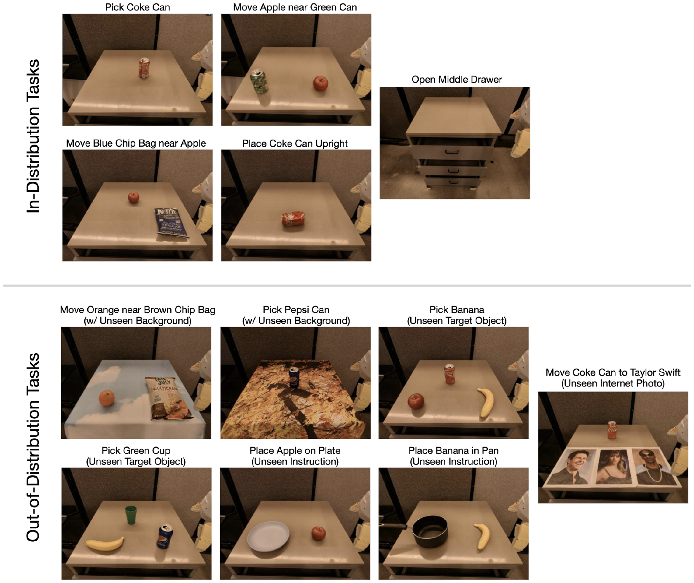

**Original caption:** Figure 9: Google robot evaluation tasks. We evaluate every generalist robot policy on in-distribution tasks and out-of-distribution (OOD) generalization tasks. OOD tasks involve unseen backgrounds, target objects, instructions/object relations, and semantic concepts (e.g., photos from the Internet that do not appear in robot action data).

**中文图注:** 图 9：Google robot 评测任务。任务涵盖分布内与 OOD 两类；OOD 的来源包括未见过的背景（如印有图案的桌布）、未见过的目标物体、未见过的指令/物体关系（例如把苹果"放到"盘子上，而训练中只有"移到盘子附近"），以及需要互联网语义概念的物体（如名人照片、百事/沛普西罐、香蕉、绿色杯子等）。

**Reading note:** 与本任务系列的文字描述（本页与下一页）逐条对照，可以看出每个任务的 OOD 维度是单一还是叠加的；这解释了表 6 中 "Move Coke Can near Taylor Swift" 这类任务对 RT-1-X / Octo 特别困难的原因。

**Source:** p.27 S093

**Original:** 2. Move Apple near Green Can (in-distribution): The robot is positioned in front of a platform with an apple and a green soda can on top of it. The robot's goal is to grasp the apple and move it next to the green can. 3. Move Blue Chip Bag near Apple (in-distribution): The robot is positioned in front of a platform with a blue bag of chips and an apple on top of it. The robot's goal is to grasp the blue bag of chips and move it close to the apple. 4. Place Coke Can Upright (in-distribution): The robot is positioned in front of a platform with a can of Coke on top of it, and the can is oriented horizontally on its side. The robot's goal is to grasp the Coke can and orient it to be in a vertical position. 5. Open Middle Drawer (in-distribution): The robot is positioned in front of a set of three drawers. The robot's goal is to grasp the middle drawer handle and pull the drawer open. 6. Move Orange near Brown Chip Bag (OOD): The robot is positioned in front of a platform with a brown bag of chips and an orange on top of it. A tablecloth with blue sky and white cloud patterns covers the platform underneath the objects. The robot's goal is to grasp the orange and bring it next to the bag of chips. This task is OOD because the orange is an unseen object relative to the training dataset, and the tablecloth is an unseen background.

**中文:** 2. Move Apple near Green Can（分布内）：机器人位于平台上放着苹果与绿色汽水罐的台面前方，目标是抓起苹果并把它移到绿色罐子旁。3. Move Blue Chip Bag near Apple（分布内）：机器人位于平台上放着蓝色薯片袋与苹果的台面前方，目标是抓起蓝色薯片袋并把它移到苹果附近。4. Place Coke Can Upright（分布内）：机器人位于平台上放着一罐可乐的台面前方，罐子横躺着；目标是抓起可乐罐并把它摆成竖直姿态。5. Open Middle Drawer（分布内）：机器人位于一组三个抽屉前方，目标是抓住中间抽屉的把手并把抽屉拉开。6. Move Orange near Brown Chip Bag（OOD）：机器人位于平台上放着棕色薯片袋与橙子的台面前方，物体下方的台面铺着印有蓝天白云图案的桌布；目标是抓起橙子并把它带到薯片袋旁。该任务属于 OOD，因为橙子相对训练数据集是未见过的物体，且桌布是未见过的背景。

**Source:** p.27 S094

**Original:** ⁷ See Appendix of Brohan et al. [7] for a detailed list of OOD conditions in Google robot evaluations.

**中文:** ⁷ Google robot 评测中 OOD 条件的详细清单见 Brohan 等人 [7] 的附录。

## p.28 附录 B.2.1（任务 7–12）· B.2.2 详细结果 · B.3

**Source:** p.28 S095

**Original:** 7. Pick Pepsi Can (OOD): The robot is positioned in front of a platform with a can of Pepsi on top of it. A tablecloth with bright yellow/brown patterns covers the platform underneath the can. The robot's goal is to grasp and lift the can. This task is OOD because the Pepsi can is an unseen object, and the tablecloth is an unseen background. 8. Pick Banana (OOD): The robot is positioned in front of a platform with an apple, a can of Coke, and a banana. The robot's goal is to grasp and lift the banana. This task is OOD because the banana is an unseen target object. 9. Pick Green Cup (OOD): The robot is positioned in front of a platform with a banana, a can of Pepsi, and a green cup. The robot's goal is to grasp and lift the green cup. This task is OOD because all objects in the scene are unseen in the training data. 10. Place Apple on Plate (OOD): The robot is positioned in front of a platform with a plate and an apple. The robot's goal is to grasp the apple and move it onto the plate. This task is OOD because it is a novel instruction describing an unseen object relation: training demonstrations only cover moving the apple near the plate, rather than placing it on top of the plate. 11. Place Banana in Pan (OOD): The robot is positioned in front of a platform with a pan and a banana. The robot's goal is to grasp the banana and move it into the pan. This task is OOD because the banana is an unseen target object, and it is a novel instruction describing an unseen object relation, as explained in the previous task. 12. Move Coke Can to Taylor Swift (OOD): The robot is positioned in front of a platform with a can of Coke and photos of three different celebrities, including Taylor Swift. The robot's goal is to grasp the can and move it to the photo of Taylor Swift. This task is OOD because the photos of the celebrities are unseen in the robot interaction data.

**中文:** 7. Pick Pepsi Can（OOD）：机器人位于平台上放着一罐百事可乐的台面前方，罐子下方台面铺着亮黄/棕色图案的桌布；目标是抓起并抬起罐子。该任务属于 OOD，因为百事罐是未见过的物体，桌布是未见过的背景。8. Pick Banana（OOD）：机器人位于平台上放着苹果、一罐可乐与一根香蕉的台面前方，目标是抓起并抬起香蕉。该任务属于 OOD，因为香蕉是未见过的目标物体。9. Pick Green Cup（OOD）：机器人位于平台上放着香蕉、一罐百事与一个绿色杯子的台面前方，目标是抓起并抬起绿色杯子。该任务属于 OOD，因为场景中所有物体在训练数据中都未出现过。10. Place Apple on Plate（OOD）：机器人位于放着盘子与苹果的台面前方，目标是抓起苹果并把它放到盘子上。该任务属于 OOD，因为这是一条描述未见物体关系的新指令：训练示教只涵盖把苹果移到盘子附近，而非放到盘子之上。11. Place Banana in Pan（OOD）：机器人位于放着一个锅与一根香蕉的台面前方，目标是抓起香蕉并把它放进锅里。该任务属于 OOD，因为香蕉是未见过的目标物体，并且如上一条所述，它是一条描述未见物体关系的新指令。12. Move Coke Can to Taylor Swift（OOD）：机器人位于放着一罐可乐与三张不同名人照片（其中包括 Taylor Swift）的台面前方，目标是抓起罐子并把它移到 Taylor Swift 的照片处。该任务属于 OOD，因为这些名人照片在机器人交互数据中未出现过。

**Source:** p.28 C015

**Original:** Table 6: Detailed Google robot evaluation results. We report full evaluation results for Google robot evaluations discussed in Section 5.1. Each generalist policy is evaluated with 60 rollouts across 12 tasks, covering both in-distribution and out-of-distribution (OOD) testing conditions. In the bottom row, we report mean success rate ± StdErr for each policy. OpenVLA and RT-2-X both significantly outperform RT-1-X and Octo overall (we bold the mean success rate for both due to overlapping error bars). See Fig. 9 for illustrations of all tasks.

**中文:** 表 6：Google robot 详细评测结果。我们报告 5.1 节所讨论 Google robot 评测的完整结果：每个通用策略在 12 个任务上共 60 次 rollout，覆盖分布内与分布外（OOD）测试条件。末行给出各策略的平均成功率 ± 标准误。OpenVLA 与 RT-2-X 总体上均显著优于 RT-1-X 与 Octo（由于误差棒重叠，我们在原表中对二者的平均成功率加粗）。所有任务的图示见图 9。

### Table 6. Google Robot 逐任务成功次数（12 任务 × 5 次 rollout）

**Placed near:** p.28 S096
**Source:** p.28 C015

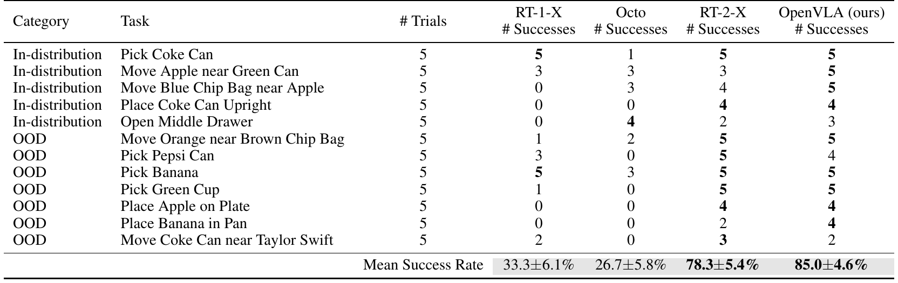

| Category | Task | # Trials | RT-1-X # Successes | Octo # Successes | RT-2-X # Successes | OpenVLA (ours) # Successes |
| --- | --- | --- | --- | --- | --- | --- |
| In-distribution | Pick Coke Can | 5 | 5 | 1 | 5 | 5 |
| In-distribution | Move Apple near Green Can | 5 | 3 | 3 | 3 | 5 |
| In-distribution | Move Blue Chip Bag near Apple | 5 | 0 | 3 | 4 | 5 |
| In-distribution | Place Coke Can Upright | 5 | 0 | 0 | 4 | 4 |
| In-distribution | Open Middle Drawer | 5 | 0 | 4 | 2 | 3 |
| OOD | Move Orange near Brown Chip Bag | 5 | 1 | 2 | 5 | 5 |
| OOD | Pick Pepsi Can | 5 | 3 | 0 | 5 | 4 |
| OOD | Pick Banana | 5 | 5 | 3 | 5 | 5 |
| OOD | Pick Green Cup | 5 | 1 | 0 | 5 | 5 |
| OOD | Place Apple on Plate | 5 | 0 | 0 | 4 | 4 |
| OOD | Place Banana in Pan | 5 | 0 | 0 | 2 | 4 |
| OOD | Move Coke Can near Taylor Swift | 5 | 2 | 0 | 3 | 2 |
| **Mean Success Rate** | | | **33.3 ± 6.1%** | **26.7 ± 5.8%** | **78.3 ± 5.4%** | **85.0 ± 4.6%** |

**Original caption:** Table 6: Detailed Google robot evaluation results. We report full evaluation results for Google robot evaluations discussed in Section 5.1. …

**中文图注:** 表 6：Google robot 逐任务详细结果（成功次数 / 5 次 rollout）。平均成功率：OpenVLA 85.0 ± 4.6%，RT-2-X 78.3 ± 5.4%，RT-1-X 33.3 ± 6.1%，Octo 26.7 ± 5.8%。RT-1-X 与 Octo 在多个任务上出现 0 次成功。

**Reading note:** 注意 RT-1-X 在分布内的 "Pick Coke Can"（5/5）与 "Pick Banana"（5/5）表现很好，但在 "Place Coke Can Upright"、"Open Middle Drawer" 等精细或需要语言条件的任务上为 0；Octo 则在 "Pick Pepsi Can"（0/5）等 OOD 任务上失败。OpenVLA 在 12 个任务中最差也有 2/5（Taylor Swift 语义任务）。

**Source:** p.28 S096

**Original:** Full results for the Google robot evaluations are shown in Table 6. Overall, we find that RT-1-X and Octo experience difficulty on the evaluation tasks; they are often unable to achieve a single success out of five trials in several tasks. On the other hand, RT-2-X and OpenVLA demonstrate strong performance, completing every task at least two times out of five trials; these two VLA policies perform comparably with each other on this particular evaluation suite.

**中文:** Google robot 评测的完整结果见表 6。总体而言，RT-1-X 与 Octo 在这些评测任务上存在困难，往往在若干任务上五次试验中一次都没成功。另一方面，RT-2-X 与 OpenVLA 表现强劲，每个任务在五次试验中至少成功两次；在这套评测上，这两个 VLA 策略表现相当。

**Source:** p.28 S097

**Original:** B.3 Data-Efficient Adaptation Experiment Details. In this section, we provide more details on the data-efficient adaptation experiments discussed in Section 5.2, where we investigate the effectiveness of fine-tuned OpenVLA policies on new robot setups such as Franka-Tabletop and Franka-DROID.

**中文:** B.3 数据高效适配实验细节。本节给出 5.2 节所讨论数据高效适配实验的更多细节。在该实验中，我们考察微调后的 OpenVLA 策略在 Franka-Tabletop 与 Franka-DROID 等新机器人配置上的有效性。

## p.29 附录 B.3.1 Franka 任务 · Fig. 10

**Source:** p.29 S098

**Original:** B.3.1 Franka-Tabletop and Franka-DROID Tasks. We collect 10–150 demonstrations of each of seven tasks. The first six tasks correspond to a robot setup which we denote as "Franka-Tabletop" (Franka Emika Panda robot mounted on top of a table), and the final task corresponds to a robot setup which we call "Franka-DROID".

**中文:** B.3.1 Franka-Tabletop 与 Franka-DROID 任务。我们为 7 个任务分别采集 10–150 条示教。前 6 个任务对应我们称为"Franka-Tabletop"的机器人配置（安装在桌面上的 Franka Emika Panda 机器人），最后一个任务对应我们称为"Franka-DROID"的配置。

**Source:** p.29 S099

**Original:** In the Franka-Tabletop setup, the first three of six tasks correspond to single-instruction tasks and are narrow, while the last three tasks correspond to multi-instruction tasks in which multiple objects are present in the scene and the robot must manipulate the correct one depending on the language instruction.

**中文:** 在 Franka-Tabletop 配置下，6 个任务中的前 3 个是"窄领域"的单指令任务，后 3 个是多指令任务：场景中存在多个物体，机器人必须依据语言指令操作正确的那一个。

**Source:** p.29 C016

**Original:** Figure 10: Franka-Tabletop fine-tuning tasks. Franka-Tabletop tasks used in the data-efficient adaptation experiments in Section 5.2 and described in detail in Fig. 10 are depicted above. The first three of six tasks, shown in the top three rows, only involve a single instruction, while the last three tasks in the bottom three rows involve multiple objects and instructions (the instructions specify the target object or target location). The first column shows sample initial states matching the training data distribution, while the second column shows out-of-distribution (OOD) initial states (e.g., unseen backgrounds, target objects, distractors, and object positions/orientations). Every policy in Section 5.2 is evaluated with 10–12 rollouts on in-distribution tasks and 5–6 rollouts on OOD tasks.

**中文:** 图 10：Franka-Tabletop 微调任务。上方展示 5.2 节数据高效适配实验所用的 Franka-Tabletop 任务。6 个任务中，前三行只涉及单一指令，后三行涉及多个物体与多条指令（指令指定目标物体或目标位置）。第一列给出符合训练数据分布的示例初始状态，第二列给出分布外（OOD）初始状态（例如未见过的背景、目标物体、干扰物以及物体位置/朝向）。5.2 节中每个策略在分布内任务上评测 10–12 次 rollout，在 OOD 任务上评测 5–6 次。

### Fig. 10. Franka-Tabletop 微调任务：6 个任务 × 分布内 / OOD 初始状态

**Placed near:** p.29 S099
**Source:** p.29 C016

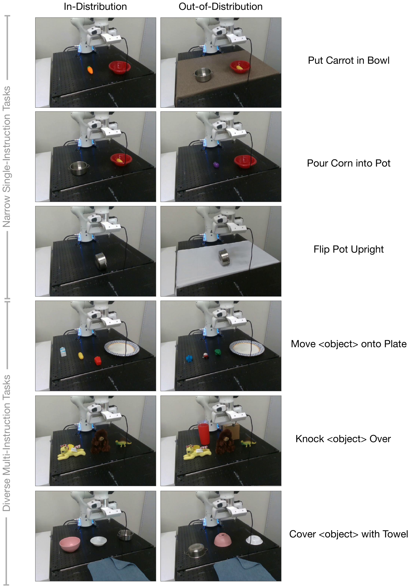

**Original caption:** Figure 10: Franka-Tabletop fine-tuning tasks. Franka-Tabletop tasks used in the data-efficient adaptation experiments in Section 5.2 … The first column shows sample initial states matching the training data distribution, while the second column shows out-of-distribution (OOD) initial states …

**中文图注:** 图 10：Franka-Tabletop 微调任务。上半部分为 3 个窄领域单指令任务（Put Carrot in Bowl、Pour Corn into Pot、Flip Pot Upright），下半部分为 3 个多样化多指令任务（Move \<object\> onto Plate、Knock \<object\> Over、Cover \<object\> with Towel）；每行左列为分布内初始状态、右列为 OOD 初始状态。

**Reading note:** 观察"训练数据分布 vs OOD"的差异设计：OOD 主要通过更换未见过的物体（如把胡萝卜换成茄子）、铺上未见的桌布、增加干扰物或改变物体初始朝向实现。这一列正是图 5 中 Diffusion Policy 与 OpenVLA 表现分化的地方。

## p.30 附录 B.3.1 Franka-Tabletop 任务细节（任务 1–6）

**Source:** p.30 S100

**Original:** Below we describe each of the six Franka-Tabletop tasks shown in Fig. 10: 1. Put Carrot in Bowl (single-instruction): The robot's goal is to grasp the carrot and place it into the bowl. We collect 50 demonstrations of this task for the training dataset, randomly placing the carrot and the bowl at different locations on the table in every episode. The carrot is always initialized on the left side of the bowl. During evaluation, each trial is recorded as a success (1) or failure (0); there is no partial credit. 2. Pour Corn into Pot (single-instruction): The robot's goal is to grasp the red bowl, move towards the steel pot, and pour the contents (a yellow corn) into the pot. We collect 50 demonstrations of this task for the training dataset, randomly placing the bowl and the pot at different locations on the table in every episode. The bowl is always initialized on the right side of the pot. During evaluation, each trial is recorded as a success (1) or failure (0); there is no partial credit. 3. Flip Pot Upright (single-instruction): The robot's goal is to grasp the steel pot (which is initially oriented vertically), rotate it to be in the upright position, and place it back onto the table. We collect only 10 demonstrations of this task for the training dataset, randomly placing the steel pot at various locations within a small section of the table. During evaluation, each trial is recorded as a success (1), failure (0), or partial success (0.5). Partial successes include grasping the pot but not orienting it upright, or knocking it over to the upright position but not carefully guiding it. The robot must release the pot at the end of the episode for full credit.

**中文:** 下面描述图 10 中的 6 个 Franka-Tabletop 任务：1. Put Carrot in Bowl（单指令）：机器人目标是抓住胡萝卜并放入碗中。我们为该任务采集 50 条示教作为训练数据，每个回合都把胡萝卜与碗随机放在桌面的不同位置；胡萝卜始终初始位于碗的左侧。评测时每次试验记为成功（1）或失败（0），没有部分分。2. Pour Corn into Pot（单指令）：机器人目标是抓住红色碗，移动到钢锅附近，并把碗里的东西（黄色玉米粒）倒进锅中。我们为该任务采集 50 条示教，每个回合都把碗与锅随机放在桌面不同位置；碗始终初始位于锅的右侧。评测时每次试验记为成功（1）或失败（0），没有部分分。3. Flip Pot Upright（单指令）：机器人目标是抓住钢锅（初始为竖立/侧立姿态），把它旋转成直立姿态并放回桌面。该任务我们只采集 10 条示教，把钢锅随机放在桌面某一小区域内的不同位置。评测时每次试验记为成功（1）、失败（0）或部分成功（0.5）。部分成功包括：抓住了锅但没有把它摆成直立，或把它碰倒成直立但没有小心引导；机器人必须在回合结束时松开锅才能拿到满分。

**Source:** p.30 S101

**Original:** 4. Move <object> onto Plate (multi-instruction): The robot's goal is to grasp one out of three objects (depending on the target specified in the language instruction) and place it on the plate on the right side of the table. We collect 150 demonstrations of this task for the training dataset, randomly placing different combinations of three objects on the table and selecting one as the target. The plate is always initialized on the right side of the table. During evaluation, each trial is recorded as a success (1), failure (0), or partial success (0.5). Partial success is recorded when the first object that the robot makes contact with is the correct target object (i.e., the object specified in the language instruction), but the robot does not complete the task. 5. Knock <object> Over (multi-instruction): The robot's goal is to approach one out of three objects (depending on the target specified in the language instruction) and push it until it falls over. We collect 70 demonstrations of this task for the training dataset, randomly placing different combinations of three objects on the table and selecting one as the target. During evaluation, each trial is recorded as a success (1), failure (0), or partial success (0.5). Partial success is recorded when the first object that the robot makes contact with is the correct target object (i.e., the object specified in the language instruction), but the robot does not complete the task. 6. Cover <object> with Towel (multi-instruction): The robot's goal is to grasp the blue towel and place it on one out of three objects (depending on the target specified in the language instruction). We collect 45 demonstrations of this task for the training dataset, randomly placing different combinations of three objects on the table. During evaluation, each trial is recorded as a success (1), failure (0), or partial success (0.5). Partial success is recorded when the first object that the robot touches with the towel is the correct target object (i.e., the object specified in the language instruction), but the robot does not complete the task (e.g., it drops the towel onto the table instead of on top of the target object). Full credit is given when any part of the towel is resting over the top surface of the target object, i.e., the object does not need to be fully covered.

**中文:** 4. Move \<object\> onto Plate（多指令）：机器人目标是抓住三个物体之一（取决于语言指令中指定的目标），并把它放到桌面右侧的盘子上。我们为该任务采集 150 条示教，随机把三个物体的不同组合放在桌面上并选定其中一个作为目标；盘子始终初始位于桌面右侧。评测时每次试验记为成功（1）、失败（0）或部分成功（0.5）。当机器人第一次接触到的物体就是正确目标物体（即语言指令指定的物体）但未完成任务时，记为部分成功。5. Knock \<object\> Over（多指令）：机器人目标是接近三个物体之一（取决于语言指令中指定的目标）并把它推倒。我们为该任务采集 70 条示教，随机把三个物体的不同组合放在桌面上并选定其中一个作为目标。评测时每次试验记为成功（1）、失败（0）或部分成功（0.5）；判定标准同上一任务。6. Cover \<object\> with Towel（多指令）：机器人目标是抓住蓝色毛巾并把它放到三个物体之一上（取决于语言指令中指定的目标）。我们为该任务采集 45 条示教，随机把三个物体的不同组合放在桌面上。评测时每次试验记为成功（1）、失败（0）或部分成功（0.5）。当机器人用毛巾第一次触碰到的是正确目标物体（即语言指令指定的物体）但未完成任务（例如把毛巾掉到了桌面上而不是目标物体上）时，记为部分成功。只要毛巾的任何部分覆盖在目标物体的上表面之上即给满分，即不需要把物体完全盖住。

**Source:** p.30 S102

**Original:** For every Franka-Tabletop task, we evaluate each method with 10–12 in-distribution trials and 5–6 OOD generalization trials. The in-distribution and OOD test conditions are depicted in Fig. 10 (second column). We describe the OOD test conditions for each of the six tasks below:

**中文:** 对每个 Franka-Tabletop 任务，我们用 10–12 次分布内试验与 5–6 次 OOD 泛化试验评测每种方法。分布内与 OOD 测试条件见图 10（第二列）。下面描述 6 个任务各自的 OOD 测试条件：

## p.31 附录 B.3.1（OOD 条件）· Fig. 11 · B.3.2

**Source:** p.31 S103

**Original:** 1. Put Carrot in Bowl (OOD): An eggplant (unseen object) replaces the carrot. 2. Pour Corn into Pot (OOD): An unseen brown tablecloth covers the tabletop. 3. Flip Pot Upright (OOD): An unseen white tablecloth covers the tabletop. 4. Move <object> onto Plate (OOD): A set of three unseen objects are placed on the table. 5. Knock <object> Over (OOD): Two unseen distractor objects (red plastic cup and brown box) are positioned behind the set of three seen objects. 6. Cover <object> with Towel (OOD): The three objects on the table are placed upside-down and at unseen positions.

**中文:** 1. Put Carrot in Bowl（OOD）：用茄子（未见过的物体）替换胡萝卜。2. Pour Corn into Pot（OOD）：桌面铺上未见过的棕色桌布。3. Flip Pot Upright（OOD）：桌面铺上未见过的白色桌布。4. Move \<object\> onto Plate（OOD）：桌上放置一组三个未见过的物体。5. Knock \<object\> Over（OOD）：在三个已见过的物体后面放置两个未见过的干扰物体（红色塑料杯与棕色盒子）。6. Cover \<object\> with Towel（OOD）：桌上的三个物体被倒置放置，且位于未见过的位置上。

**Source:** p.31 S104

**Original:** Finally, in the Franka-DROID environment, we experiment with one task and variants of it: Wipe Table (see Fig. 11). In this task, the robot's goal is to grab the brush and sweep all three small brown objects into the dustpan. We collect 70 demonstrations for this task for the training dataset, varying the positions of all the objects.

**中文:** 最后，在 Franka-DROID 环境中，我们实验了一个任务及其若干变体：Wipe Table（见图 11）。该任务中，机器人目标是抓起刷子，把三个小的棕色物体扫进簸箕。我们为该任务采集 70 条示教作为训练数据，并改变所有物体的位置。

**Source:** p.31 C017

**Original:** Figure 11: Franka-DROID fine-tuning task. The "Wipe Table" task shown here is the final task used in the data-efficient adaptation experiments in Section 5.2. The left image shows the initial conditions for an in-distribution trial. The right image shows an out-of-distribution trial in which unseen distractor objects are present on the table. To fully complete the task, the robot must grab the brush and sweep all three objects into the dustpan.

**中文:** 图 11：Franka-DROID 微调任务。这里展示的"Wipe Table"任务是 5.2 节数据高效适配实验中的最后一个任务。左图是分布内试验的初始条件，右图是分布外试验——桌上存在未见过的干扰物体。要完全完成任务，机器人必须抓起刷子并把三个物体都扫进簸箕。

### Fig. 11. Franka-DROID "Wipe Table" 任务（分布内 vs. OOD）

**Placed near:** p.31 S104
**Source:** p.31 C017

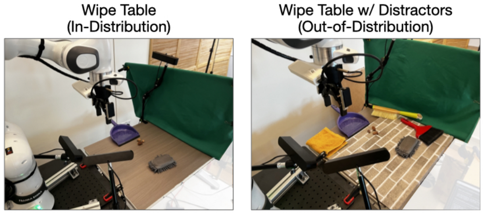

**Original caption:** Figure 11: Franka-DROID fine-tuning task. The "Wipe Table" task shown here is the final task used in the data-efficient adaptation experiments in Section 5.2. The left image shows the initial conditions for an in-distribution trial. The right image shows an out-of-distribution trial in which unseen distractor objects are present on the table. …

**中文图注:** 图 11：Franka-DROID 微调任务 "Wipe Table"。左图为分布内初始条件，右图为 OOD 条件（桌上加入未见过的干扰物）。任务要求机器人抓刷子把三个小物块扫进簸箕。

**Reading note:** 该任务的评分是"累计分数"而非二值成功率：每次试验满分 2 分，扫入 3 个得 2 分、扫入 1–2 个得 1 分、否则 0 分；18 次分布内 + 12 次 OOD，共 60 分。这解释了表 7 中该任务是按百分比报告的平均得分。

**Source:** p.31 S105

**Original:** At test time, we evaluate on in-distribution conditions matching the training data (Fig. 11, left), as well as out-of-distribution (OOD) conditions in which distractor objects are also present in the scene on the table (Fig. 11, right). Since there are various possible outcomes for each trial, we define a scoring rubric as follows: The maximum score for each trial is 2 points. The policy receives the full 2 points if the robot sweeps all three objects into the dustpan. It receives 1 point for successfully sweeping one or two objects into the dustpan. Otherwise, it receives 0 points. We evaluate each policy with 18 in-distribution trials and 12 OOD trials, so each policy receives an aggregate score out of 60 points.

**中文:** 测试时，我们在与训练数据一致的分布内条件（图 11 左）以及桌上存在干扰物体的 OOD 条件（图 11 右）下评测。由于每次试验可能的结果有多种，我们定义如下评分规则：每次试验最高 2 分。若机器人把三个物体都扫进簸箕得满分 2 分；成功扫入 1 或 2 个得 1 分；否则 0 分。每种策略评测 18 次分布内试验与 12 次 OOD 试验，因此每种策略的总分为 60 分制。

**Source:** p.31 S106

**Original:** B.3.2 Detailed Franka-Tabletop and Franka-DROID Evaluation Results. Full evaluation results for both Franka-Tabletop and Franka-DROID evaluations are shown in Table 7. We evaluate the methods discussed in Section 5.2. We find that Diffusion Policy demonstrates strong performance on the single-instruction Franka-Tabletop tasks (e.g., "Put Carrot in Bowl" and "Pour Corn in Pot"), outperforming other methods. However, OpenVLA and Octo achieve higher performance in the more diverse multi-instruction tasks ("Move <object> onto Plate", "Knock <object> Over", and "Cover <object> with Towel"). In the Franka-DROID environment, OpenVLA obtains best results. Overall, we find that OpenVLA achieves the highest average performance across both tasks.

**中文:** B.3.2 Franka-Tabletop 与 Franka-DROID 详细评测结果。两个评测的完整结果见表 7。我们评测 5.2 节讨论的各方法，发现 Diffusion Policy 在单指令的 Franka-Tabletop 任务（如 "Put Carrot in Bowl"、"Pour Corn in Pot"）上表现强劲，优于其他方法；但在更多样化的多指令任务（"Move \<object\> onto Plate"、"Knock \<object\> Over"、"Cover \<object\> with Towel"）上，OpenVLA 与 Octo 取得更高性能。在 Franka-DROID 环境中，OpenVLA 取得最佳结果。总体而言，OpenVLA 在这两类任务上的平均性能最高。

**Source:** p.31 S107

**Original:** Additionally, in Table 8, we show the detailed version of the parameter-efficient fine-tuning experiment results summarized in Table 1. In these experiments, we use a representative subset of two Franka-Tabletop tasks, with both in-distribution and OOD variants: one narrow single-instruction task ("Put Carrot in Bowl") and one diverse multi-instruction task ("Move <object> onto Plate"). We use the same number of training demonstrations used in Section 5.2 (50 and 150, respectively), which is delineated in Appendix B.3.1.

**中文:** 另外，我们在表 8 中给出表 1 所汇总的参数高效微调实验的详细版本。这些实验使用两个具有代表性的 Franka-Tabletop 任务（各含分布内与 OOD 变体）：一个窄领域单指令任务（"Put Carrot in Bowl"）与一个多样化多指令任务（"Move \<object\> onto Plate"）。示教数量与 5.2 节相同（分别为 50 与 150 条），详见附录 B.3.1。

## p.32 附录 B.3.2 详细表格 · 附录 C RT-2-X vs. OpenVLA

**Source:** p.32 C018

**Original:** Table 7: Detailed data-efficient adaptation experiment results. Here we present the full breakdown of results summarized in Fig. 5. We report the performance of Diffusion Policy trained from scratch on new robot tasks, as well as generalist policies fine-tuned on the same data. Each policy is tested against both in-distribution and out-of-distribution (OOD) generalization conditions (see Fig. 10 for Franka-Tabletop tasks and Fig. 11 for Franka-DROID tasks). We find that no single policy performs best on all tasks: Diffusion Policy achieves high success rates on single-instruction tasks, while OpenVLA and Octo performs well on diverse multi-instruction tasks. In terms of aggregate performance, however, OpenVLA obtains the highest average success rate across both environments.

**中文:** 表 7：数据高效适配实验详细结果。此处给出图 5 所汇总结果的完整分解。我们报告在新机器人任务上从零训练的 Diffusion Policy 的性能，以及在同一数据上微调的通用策略的性能。每个策略都在分布内与分布外（OOD）泛化条件下测试（Franka-Tabletop 任务见图 10，Franka-DROID 任务见图 11）。我们发现没有单一策略在所有任务上都最好：Diffusion Policy 在单指令任务上成功率高，而 OpenVLA 与 Octo 在多样化多指令任务上表现好；但就综合性能而言，OpenVLA 在这两个环境中的平均成功率最高。

### Table 7. 数据高效适配：Franka-Tabletop 与 Franka-DROID 逐任务成功率

**Placed near:** p.31 S106
**Source:** p.32 C018

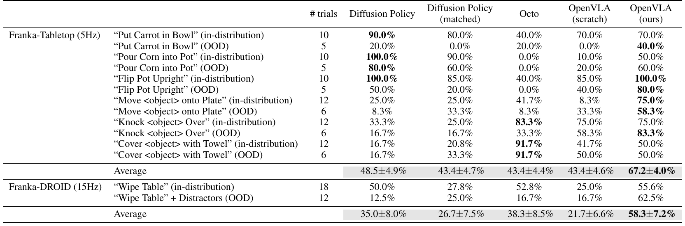

| Setup / Task | # trials | Diffusion Policy | Diffusion Policy (matched) | Octo | OpenVLA (scratch) | OpenVLA (ours) |
| --- | --- | --- | --- | --- | --- | --- |
| Franka-Tabletop (5Hz) · "Put Carrot in Bowl" (in-distribution) | 10 | 90.0% | 80.0% | 40.0% | 70.0% | 70.0% |
| "Put Carrot in Bowl" (OOD) | 5 | 20.0% | 0.0% | 20.0% | 0.0% | 40.0% |
| "Pour Corn into Pot" (in-distribution) | 10 | 100.0% | 90.0% | 0.0% | 10.0% | 50.0% |
| "Pour Corn into Pot" (OOD) | 5 | 80.0% | 60.0% | 0.0% | 20.0% | 60.0% |
| "Flip Pot Upright" (in-distribution) | 10 | 100.0% | 85.0% | 40.0% | 85.0% | 100.0% |
| "Flip Pot Upright" (OOD) | 5 | 50.0% | 20.0% | 0.0% | 40.0% | 80.0% |
| "Move \<object\> onto Plate" (in-distribution) | 12 | 25.0% | 25.0% | 41.7% | 8.3% | 75.0% |
| "Move \<object\> onto Plate" (OOD) | 6 | 8.3% | 33.3% | 8.3% | 33.3% | 58.3% |
| "Knock \<object\> Over" (in-distribution) | 12 | 33.3% | 25.0% | 83.3% | 75.0% | 75.0% |
| "Knock \<object\> Over" (OOD) | 6 | 16.7% | 16.7% | 33.3% | 58.3% | 83.3% |
| "Cover \<object\> with Towel" (in-distribution) | 12 | 16.7% | 20.8% | 91.7% | 41.7% | 50.0% |
| "Cover \<object\> with Towel" (OOD) | 6 | 16.7% | 33.3% | 91.7% | 50.0% | 50.0% |
| **Average（Franka-Tabletop）** | 99 | **48.5 ± 4.9%** | **43.4 ± 4.7%** | **43.4 ± 4.4%** | **43.4 ± 4.6%** | **67.2 ± 4.0%** |
| Franka-DROID (15Hz) · "Wipe Table" (in-distribution) | 18 | 50.0% | 27.8% | 52.8% | 25.0% | 55.6% |
| "Wipe Table" + Distractors (OOD) | 12 | 12.5% | 25.0% | 16.7% | 16.7% | 62.5% |
| **Average（Franka-DROID）** | 30 | **35.0 ± 8.0%** | **26.7 ± 7.5%** | **38.3 ± 8.5%** | **21.7 ± 6.6%** | **58.3 ± 7.2%** |

**Original caption:** Table 7: Detailed data-efficient adaptation experiment results. Here we present the full breakdown of results summarized in Fig. 5. …

**中文图注:** 表 7：数据高效适配实验的逐任务成功率。Franka-Tabletop 平均：OpenVLA（ours）67.2 ± 4.0%，Diffusion Policy 48.5 ± 4.9%，Diffusion Policy (matched) 与 Octo 及 OpenVLA (scratch) 均为 43.4%；Franka-DROID 平均：OpenVLA（ours）58.3 ± 7.2%，Octo 38.3 ± 8.5%。

**Reading note:** 注意 OpenVLA (scratch) 一行：它与 OpenVLA (ours) 同架构、同流程，唯一差别是没有 OpenX 预训练，但平均分从 67.2% 掉到 43.4%，这是论文中"大规模机器人预训练是语言 grounding 能力来源"的直接证据。

**Source:** p.32 C019

**Original:** Table 8: Detailed parameter-efficient fine-tuning experiment results. Here we present the detailed task performance results summarized in Table 1.

**中文:** 表 8：参数高效微调实验的详细结果。此处给出表 1 所汇总结果的逐任务版本。

### Table 8. 参数高效微调：逐任务成功率明细

**Placed near:** p.31 S107
**Source:** p.32 C019

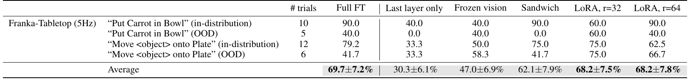

| Task | # trials | Full FT | Last layer only | Frozen vision | Sandwich | LoRA, r=32 | LoRA, r=64 |
| --- | --- | --- | --- | --- | --- | --- | --- |
| Franka-Tabletop (5Hz) · "Put Carrot in Bowl" (in-distribution) | 10 | 90.0 | 40.0 | 40.0 | 90.0 | 60.0 | 90.0 |
| "Put Carrot in Bowl" (OOD) | 5 | 40.0 | 0.0 | 40.0 | 0.0 | 60.0 | 40.0 |
| "Move \<object\> onto Plate" (in-distribution) | 12 | 79.2 | 33.3 | 50.0 | 75.0 | 75.0 | 62.5 |
| "Move \<object\> onto Plate" (OOD) | 6 | 41.7 | 33.3 | 58.3 | 41.7 | 75.0 | 66.7 |
| **Average** | 33 | **69.7 ± 7.2%** | **30.3 ± 6.1%** | **47.0 ± 6.9%** | **62.1 ± 7.9%** | **68.2 ± 7.5%** | **68.2 ± 7.8%** |

**Original caption:** Table 8: Detailed parameter-efficient fine-tuning experiment results. Here we present the detailed task performance results summarized in Table 1.

**中文图注:** 表 8：参数高效微调逐任务成功率明细（数值为百分数）。平均：Full FT 69.7 ± 7.2%，LoRA r=32 与 r=64 均为 68.2%，Sandwich 62.1 ± 7.9%，Frozen vision 47.0 ± 6.9%，Last layer only 30.3 ± 6.1%。

**Reading note:** 两个任务的 OOD 列尤其能说明问题：Last layer only 在 "Put Carrot in Bowl" OOD 上为 0.0，Sandwich 也为 0.0，而 LoRA r=32 为 60.0 —— 说明视觉特征的适配对分布外泛化尤为关键。

**Source:** p.32 S108

**Original:** C RT-2-X vs. OpenVLA in BridgeData V2 Evaluations. In this section, we provide additional details on RT-2-X vs. OpenVLA comparisons in BridgeData V2 evaluations discussed in Section 5.1. As discussed previously, OpenVLA is pretrained on a larger subset of OpenX data than RT-2-X and uses a fused SigLIP-DinoV2 vision backbone rather than a single visual encoder. However, in addition to these factors, we believe that OpenVLA's significant improvement upon RT-2-X specifically in BridgeData V2 evaluations (as shown in Fig. 3) also stems from more careful preprocessing of the Bridge dataset.

**中文:** 附录 C BridgeData V2 评测中的 RT-2-X 与 OpenVLA 对比。本节给出 5.1 节所讨论的、BridgeData V2 评测中 RT-2-X 与 OpenVLA 对比的更多细节。如前所述，OpenVLA 在比 RT-2-X 更大的 OpenX 数据子集上预训练，并使用融合的 SigLIP-DinoV2 视觉骨干而非单一视觉编码器。但除这些因素外，我们认为 OpenVLA 在 BridgeData V2 评测中（如图 3 所示）对 RT-2-X 的显著提升，还来自对 Bridge 数据集更细致的预处理。

**Source:** p.32 S109

**Original:** During the development of the OpenVLA model, we discovered that the original version of the BridgeData V2 dataset contained many transitions with all-zero (no-op) actions. For instance, in every demonstration, an all-zero action was recorded as the ground-truth action in the first timestep. Consequently, training a highly expressive VLA model on the original dataset without any data preprocessing led to a policy that frequently predicted all-zero actions and froze during evaluations. Therefore, we simply filtered out the first transition in every demonstration when training the OpenVLA model, and this was sufficient for mitigating the freezing behavior in most cases.

**中文:** 在开发 OpenVLA 模型的过程中，我们发现原始版本的 BridgeData V2 数据集中包含大量全零（no-op，无操作）动作的 transition。例如，每条示教的第一个时间步都把全零动作记录为真值动作。结果，在完全不做数据预处理的情况下用原始数据集训练一个表达能力很强的 VLA 模型，会得到一个在评测中频繁预测全零动作、从而"卡死"不动的策略。因此，我们在训练 OpenVLA 时直接过滤掉每条示教的第一个 transition，这已足以在多数情况下缓解"卡死"行为。

**Source:** p.32 S110

**Original:** However, the RT-2-X model was trained without such data preprocessing, so it often suffers the aforementioned freezing behavior if deployed out of the box without modifying the model querying procedure – which severely deteriorates rollout performance. Since this is a proprietary model that is infeasible for us to re-train (e.g., with our preprocessed version of the BridgeData V2 dataset), we mitigated this issue by simply querying the second-most-likely action from the model, since the first-most-likely action was often all zeros while the second-most-likely action was not. (Note that this is the same workaround that was applied by the developers of the RT-2-X model for BridgeData V2 evaluations reported in the Open X-Embodiment experiments [1].) This workaround led to much stronger RT-2-X performance on BridgeData V2 evaluations – though we believe that it is still suboptimal compared to re-training the model on the preprocessed version of the dataset.

**中文:** 然而，RT-2-X 模型训练时没有做这类数据预处理，因此如果在不修改模型查询流程的情况下"开箱"部署，它会频繁出现上述"卡死"行为，严重损害 rollout 表现。由于这是专有模型，我们无法重新训练它（例如用我们预处理后的 BridgeData V2 数据集），我们采取的缓解办法是：直接查询模型给出的"第二可能"动作，因为"最可能"的动作常常是全零，而第二可能的动作不是。（注：这与 RT-2-X 开发者在 Open X-Embodiment 实验 [1] 中报告 BridgeData V2 评测结果时所采用的变通做法相同。）该变通做法使 RT-2-X 在 BridgeData V2 评测中的表现好得多——不过我们认为，相比在预处理后的数据集上重新训练模型，这仍然是次优的。

**Source:** p.32-33 S111

**Original:** We also tried to dynamically query RT-2-X, i.e., by first sampling the first-most-likely action and then sampling the second-most-likely action if the first one was all zeros. However, we empirically found that dynamic querying led to worse performance than simply querying the second-most-likely action at all times. We hypothesize that this is due to a change in the robot's dynamics that arises from dynamic querying: pausing in the middle of a trajectory to re-query the model leads to slight interruptions in the robot's movement due to non-neglible latency in the querying pipeline, and this leads to subtle performance degradation. Therefore, we report the performance of RT-2-X when always querying the second-most-likely action, as done in the Open X-Embodiment project [1].

**中文:** 我们也尝试过动态查询 RT-2-X，即先取最可能动作，若其为全零再取第二可能动作。但实验发现动态查询的性能不如始终查询第二可能动作。我们推测原因在于动态查询改变了机器人的动力学：在轨迹中途停下来重新查询模型，会因查询链路的不可忽略延迟而使机器人运动出现轻微中断，从而导致性能的细微下降。因此，我们报告的 RT-2-X 性能均采用"始终查询第二可能动作"的方式，与 Open X-Embodiment 项目 [1] 的做法一致。

## p.33 附录 D 消融实验 · D.1 训练数据 · D.2 双视觉编码器

**Source:** p.33 S112

**Original:** D Additional Experiments and Ablations. In this section, we conduct several additional experiments to analyze the effects of individual components of the OpenVLA model architecture and training scheme, as well as provide quantitative evidence for claims made in earlier sections of this work. We aim to answer the following questions: 1. How important is OpenX training and how does it impact OpenVLA's performance (Appendix D.1)? 2. What effect does using a fused SigLIP-DinoV2 vision encoder have on OpenVLA's performance, compared to using a SigLIP-only vision encoder (Appendix D.2)? 3. Is it better to fine-tune or freeze the vision encoder in OpenVLA (Appendix D.3)? 4. How do the quantized inference results discussed in Section 5.3 change when policy performance is disentangled from model inference speed (Appendix D.4)?

**中文:** 附录 D 附加实验与消融。本节我们做若干附加实验，分析 OpenVLA 模型架构与训练方案的各个组件各自的作用，并为论文前面各节提出的论断提供定量证据。我们试图回答以下问题：1. OpenX 训练有多重要，它对 OpenVLA 的性能有何影响（附录 D.1）？2. 相比仅使用 SigLIP 的视觉编码器，使用融合的 SigLIP-DinoV2 视觉编码器对 OpenVLA 性能有何影响（附录 D.2）？3. 在 OpenVLA 中，微调视觉编码器与冻结视觉编码器哪个更好（附录 D.3）？4. 当把策略性能与模型推理速度解耦后，5.3 节讨论的量化推理结果会如何变化（附录 D.4）？

**Source:** p.33 S113

**Original:** We discuss the experimental setup and results addressing each of the above questions sequentially in the following sections.

**中文:** 下面各节依次讨论上述每个问题的实验设置与结果。

**Source:** p.33 S114

**Original:** D.1 OpenX Training Data Ablation Experiments. As discussed in Section 3.3, OpenVLA is trained on a large dataset of robot embodiments, scenes, and tasks from the Open X-Embodiment dataset [1] (OpenX). In this section, we ablate the OpenX mixture and train a VLA policy solely on one robot dataset, to assess the impact of OpenX training on policy performance. Note that we have already observed the negative effect of ablating OpenX training in the fine-tuning regime, as discussed in Section 5.2 (see OpenVLA (Scratch)), but we discuss additional experiments on another robot embodiment in this section to provide more supporting evidence.

**中文:** D.1 OpenX 训练数据消融实验。如 3.3 节所述，OpenVLA 在来自 Open X-Embodiment 数据集 [1]（OpenX）的大规模机器人本体、场景与任务数据上训练。本节我们消融 OpenX 混合，只在单一机器人数据集上训练一个 VLA 策略，以评估 OpenX 训练对策略性能的影响。需要说明的是，我们已在 5.2 节的微调场景中观察到去掉 OpenX 训练的负面效果（见 OpenVLA (Scratch)），本节我们讨论在另一种机器人本体上的附加实验，以提供更多支持性证据。

**Source:** p.33 S115

**Original:** Experimental setup and tasks. We compare the original OpenVLA model with OpenVLA-Bridge, which is produced by taking the same pretrained VLM as OpenVLA (Prismatic VLM [44]) and fine-tuning it solely on BridgeData V2 [6] rather than the entire OpenX training mixture discussed in Appendix A. We evaluate OpenVLA and OpenVLA-Bridge on a subset of 8 representative tasks from the BridgeData V2 WidowX robot evaluation suite discussed in Appendix B.1.1. The tasks are listed in Table 9.

**中文:** 实验设置与任务。我们把原始 OpenVLA 模型与 OpenVLA-Bridge 比较。后者使用与 OpenVLA 相同的预训练 VLM（Prismatic VLM [44]），但只在 BridgeData V2 [6] 上微调，而非使用附录 A 中的完整 OpenX 训练混合。我们在附录 B.1.1 所述 BridgeData V2 WidowX 评测套件中选取 8 个代表性任务作为子集，评测 OpenVLA 与 OpenVLA-Bridge。任务见表 9。

**Source:** p.33 S116

**Original:** Results. Results for the OpenX training mixture ablation are shown in Table 9. By comparing OpenVLA with OpenVLA-Bridge, we see that performance drops drastically (reduction of 30 percent in absolute success rate), which demonstrates the importance of OpenX pretraining on final policy performance. Although the language grounding performance is not impacted, we observe performance reduction across all generalization categories. This result suggests that the large diversity of scenes, objects, and tasks in the OpenX training mixture is essential for unlocking improved generalization capabilities in the OpenVLA model.

**中文:** 结果。OpenX 训练混合消融的结果见表 9。对比 OpenVLA 与 OpenVLA-Bridge 可见性能大幅下降（绝对成功率降低 30 个百分点），说明 OpenX 预训练对最终策略性能至关重要。虽然语言 grounding 性能未受影响，但我们在所有泛化类别上都观察到性能下降。这一结果表明，OpenX 训练混合中场景、物体与任务的高度多样性，是释放 OpenVLA 泛化能力的关键。

**Source:** p.33 S117

**Original:** D.2 Dual vs. Single Vision Encoder Experiments. The OpenVLA model architecture consists of a fused vision backbone that combines the SigLIP [9] and DinoV2 [25] encoders. In this section, we ablate the DinoV2 component to assess the importance of using a dual vision encoder.

**中文:** D.2 双视觉编码器 vs. 单视觉编码器实验。OpenVLA 的模型架构使用融合视觉骨干，结合 SigLIP [9] 与 DinoV2 [25] 两个编码器。本节我们消融 DinoV2 组件，以评估使用双视觉编码器的重要性。

**Source:** p.33-34 S118

**Original:** Experimental setup and tasks. We instantiate a model, OpenVLA-Bridge-SigLIP, which is a version of OpenVLA that is trained only on BridgeData V2 and consists of only the SigLIP encoder as the vision backbone. We compare this model with the OpenVLA-Bridge model discussed in the previous section (Appendix D.1), which shares the same model architecture as the original OpenVLA model and is only trained on Bridge robot data. Therefore, the only difference between OpenVLA-Bridge-SigLIP and OpenVLA-Bridge is that the former omits the DinoV2 encoder in the vision backbone. We evaluate these models on the same subset of 8 Bridge tasks described in the previous section.

**中文:** 实验设置与任务。我们构建一个模型 OpenVLA-Bridge-SigLIP：它是只在 BridgeData V2 上训练、且视觉骨干仅由 SigLIP 编码器构成的 OpenVLA 版本。我们把它与上一节（附录 D.1）讨论的 OpenVLA-Bridge 比较；后者与原始 OpenVLA 架构相同，也只在 Bridge 机器人数据上训练。因此，OpenVLA-Bridge-SigLIP 与 OpenVLA-Bridge 的唯一差别是前者在视觉骨干中省去了 DinoV2 编码器。我们使用上一节所述相同的 8 个 Bridge 任务子集评测这两个模型。

## p.34 附录 D.2 结果 · D.3 微调 vs. 冻结视觉编码器 · D.4

**Source:** p.34 S119

**Original:** Results. Results for the dual vision encoder ablation are shown in Table 9. The drop in performance from OpenVLA-Bridge to OpenVLA-Bridge-SigLIP implies that additionally including the DinoV2 encoder in the vision backbone improves policy performance. However, the 5 percent reduction in performance here is not as significant as the 30 percent drop in performance observed from ablating OpenX training. The low-level spatial features represented in DinoV2 appear to aid generalization in only some cases.

**中文:** 结果。双视觉编码器消融的结果见表 9。从 OpenVLA-Bridge 到 OpenVLA-Bridge-SigLIP 的性能下降表明，在视觉骨干中额外加入 DinoV2 编码器可以提升策略性能。不过这里约 5 个百分点的下降，与消融 OpenX 训练带来的 30 个百分点下降相比并不显著。DinoV2 所表达的低层空间特征似乎只在部分情形下有助于泛化。

**Source:** p.34 C020

**Original:** Table 9: BridgeData V2 WidowX ablation experiment results. We evaluate various methods on a subset of 8 representative tasks to assess the importance of different components of the OpenVLA model architecture and training scheme. OpenVLA-Bridge is a version of OpenVLA without OpenX training (it is trained only on BridgeData V2), and OpenVLA-Bridge-SigLIP additionally ablates the fused vision backbone by removing the DinoV2 encoder (its vision backbone only consists of the SigLIP encoder). We observe that both OpenX training and the fused vision encoder improve policy performance, though the former has a much greater effect than the latter.

**中文:** 表 9：BridgeData V2 WidowX 消融实验结果。我们在 8 个代表性任务的子集上评测多种方法，以评估 OpenVLA 架构与训练方案中不同组件的重要性。OpenVLA-Bridge 是没有 OpenX 训练（仅用 BridgeData V2 训练）的版本；OpenVLA-Bridge-SigLIP 进一步消融融合视觉骨干，去掉 DinoV2 编码器（视觉骨干只含 SigLIP 编码器）。我们观察到 OpenX 训练与融合视觉编码器都能提升策略性能，但前者影响远大于后者。

### Table 9. 消融实验：OpenX 训练 与 双视觉编码器

**Placed near:** p.33 S116
**Source:** p.34 C020

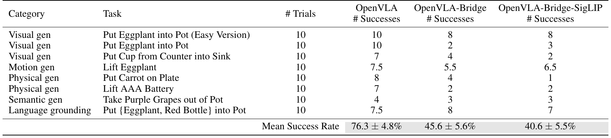

| Category | Task | # Trials | OpenVLA # Successes | OpenVLA-Bridge # Successes | OpenVLA-Bridge-SigLIP # Successes |
| --- | --- | --- | --- | --- | --- |
| Visual gen | Put Eggplant into Pot (Easy Version) | 10 | 10 | 8 | 8 |
| Visual gen | Put Eggplant into Pot | 10 | 10 | 2 | 3 |
| Visual gen | Put Cup from Counter into Sink | 10 | 7 | 4 | 2 |
| Motion gen | Lift Eggplant | 10 | 7.5 | 5.5 | 6.5 |
| Physical gen | Put Carrot on Plate | 10 | 8 | 4 | 1 |
| Physical gen | Lift AAA Battery | 10 | 7 | 2 | 2 |
| Semantic gen | Take Purple Grapes out of Pot | 10 | 4 | 3 | 3 |
| Language grounding | Put {Eggplant, Red Bottle} into Pot | 10 | 7.5 | 8 | 7 |
| **Mean Success Rate** | | | **76.3 ± 4.8%** | **45.6 ± 5.6%** | **40.6 ± 5.5%** |

**Original caption:** Table 9: BridgeData V2 WidowX ablation experiment results. We evaluate various methods on a subset of 8 representative tasks to assess the importance of different components of the OpenVLA model architecture and training scheme. …

**中文图注:** 表 9：消融实验结果（成功次数 / 10 次试验）。平均成功率：OpenVLA 76.3 ± 4.8%，OpenVLA-Bridge（无 OpenX 训练）45.6 ± 5.6%，OpenVLA-Bridge-SigLIP（再去除 DinoV2）40.6 ± 5.5%。

**Reading note:** 三列对照给出清晰的因果排序：去掉 OpenX 预训练损失约 30 个百分点，再去掉 DinoV2 只再损失约 5 个百分点 —— 数据多样性比视觉编码器融合更重要；此外语言 grounding 任务（最后一行）几乎不受两者影响。

**Source:** p.34 S120

**Original:** D.3 Fine-Tuned vs. Frozen Vision Encoder Experiments. As discussed in Section 3.4, prior work on VLMs observed higher performance from freezing the vision encoder than fine-tuning its parameters [44]. However, when training OpenVLA, we fine-tuned all 7B parameters in the model, including the SigLIP-DinoV2 vision backbone, as we discovered early on during development that fine-tuning the vision encoder led to higher-performing VLAs — a finding which held across various pretrained VLMs and model architectures. We discuss details of such findings below.

**中文:** D.3 微调 vs. 冻结视觉编码器实验。如 3.4 节所述，先前 VLM 工作观察到冻结视觉编码器比微调其参数性能更好 [44]。但在训练 OpenVLA 时，我们微调了模型全部 7B 参数，包括 SigLIP-DinoV2 视觉骨干；因为在开发早期我们就发现，微调视觉编码器能带来性能更高的 VLA——这一发现在多种预训练 VLM 与模型架构上都成立。下面讨论相关细节。

**Source:** p.34 S121

**Original:** Experimental setup and tasks. In this section, we report the performance of two VLA policies produced by fine-tuning two different pretrained models from the Prismatic VLMs [44] repository on BridgeData V2. The two pretrained models are named SigLIP ViT-SO 224px and LLaVa v1.5 7B (Reproduction); see Karamcheti et al. [44] for details on their architectures and training mixtures. We evaluate both policies on various Bridge tasks shown in Table 10. Note that the evaluation configurations here differ from previously discussed Bridge evaluations, so the results are not directly comparable to results in other similar experiments.

**中文:** 实验设置与任务。本节我们报告两个 VLA 策略的性能：它们分别由 Prismatic VLMs [44] 仓库中两个不同的预训练模型在 BridgeData V2 上微调而来。这两个预训练模型名为 SigLIP ViT-SO 224px 与 LLaVa v1.5 7B (Reproduction)；其架构与训练混合细节见 Karamcheti 等人 [44]。我们在表 10 所示的多个 Bridge 任务上评测这两个策略。注意此处的评测配置与前面讨论的 Bridge 评测不同，因此结果不能直接与其他类似实验的结果比较。

**Source:** p.34 S122

**Original:** Results. Results for the fine-tuned vs. frozen vision encoder experiments are shown in Table 10. We find that for both VLAs tested, fine-tuning the vision encoder leads to significantly higher success rates across various tasks. Qualitatively, in some cases, deploying the frozen vision encoder policies leads to unstable robot behaviors that are clearly suboptimal. Consequently, we decided early on during development to not conduct further experimentation with frozen vision encoders.

**中文:** 结果。微调与冻结视觉编码器的对比结果见表 10。我们发现，对被测的两个 VLA 而言，微调视觉编码器都能在多个任务上带来显著更高的成功率。定性来看，在某些情况下，使用冻结视觉编码器的策略会导致明显次优、且不稳定机器人行为。因此在开发早期我们就决定不再对冻结视觉编码器做进一步实验。

**Source:** p.35 C021

**Original:** Table 10: Fine-tuned vs. frozen vision encoder experiment results. We evaluate the performance of fine-tuning ("Fine-Tuned") vs. freezing the vision encoder ("Frozen Vision") in two VLA policies built on top of two different pretrained VLMs from the Prismatic VLMs [44] repository. BridgeData V2 WidowX tasks shown here are performed in the same sink environment used for other Bridge experiments in this work (however, the initial environment configurations here differ, as these evaluations were conducted at an earlier stage in the project). We find that fine-tuning the vision encoder is crucial to obtain good policy performance. Certain frozen vision encoder evaluations were discontinued due to very poor (near-zero) performance and unstable robot behaviors. Among the evaluations where both frozen vision and fine-tuned approaches are tested, fine-tuning the vision encoder leads to 80.0% average success versus 46.7% average success from leaving it frozen.

**中文:** 表 10：微调 vs. 冻结视觉编码器实验结果。我们在两个基于 Prismatic VLMs [44] 仓库中不同预训练 VLM 构建的 VLA 策略上，比较微调（"Fine-Tuned"）与冻结（"Frozen Vision"）视觉编码器的性能。表中 BridgeData V2 WidowX 任务在与本文其他 Bridge 实验相同的水槽环境中执行（但此处初始环境配置不同，因为这些评测是在项目更早阶段进行的）。我们发现微调视觉编码器对获得良好策略性能至关重要。部分冻结视觉编码器的评测因性能极差（接近零）且机器人行为不稳定而被中止。在同时测过冻结与微调两种方案的评测中，微调视觉编码器的平均成功率为 80.0%，而冻结仅为 46.7%。

### Table 10. 微调 vs. 冻结视觉编码器（两种预训练 VLM）

**Placed near:** p.34 S122
**Source:** p.35 C021

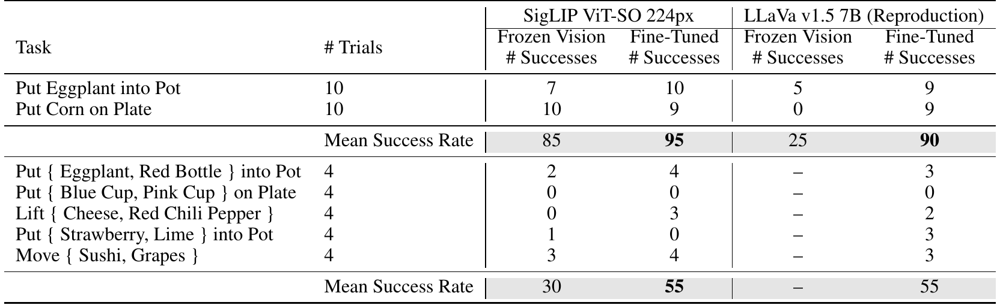

| Task | # Trials | SigLIP ViT-SO 224px · Frozen Vision | SigLIP ViT-SO 224px · Fine-Tuned | LLaVa v1.5 7B (Reproduction) · Frozen Vision | LLaVa v1.5 7B (Reproduction) · Fine-Tuned |
| --- | --- | --- | --- | --- | --- |
| Put Eggplant into Pot | 10 | 7 | 10 | 5 | 9 |
| Put Corn on Plate | 10 | 10 | 9 | 0 | 9 |
| **Mean Success Rate** | | **85** | **95** | **25** | **90** |
| Put {Eggplant, Red Bottle} into Pot | 4 | 2 | 4 | – | 3 |
| Put {Blue Cup, Pink Cup} on Plate | 4 | 0 | 0 | – | 0 |
| Lift {Cheese, Red Chili Pepper} | 4 | 0 | 3 | – | 2 |
| Put {Strawberry, Lime} into Pot | 4 | 1 | 0 | – | 3 |
| Move {Sushi, Grapes} | 4 | 3 | 4 | – | 3 |
| **Mean Success Rate** | | **30** | **55** | **–** | **55** |

**Original caption:** Table 10: Fine-tuned vs. frozen vision encoder experiment results. We evaluate the performance of fine-tuning ("Fine-Tuned") vs. freezing the vision encoder ("Frozen Vision") in two VLA policies built on top of two different pretrained VLMs from the Prismatic VLMs [44] repository. …

**中文图注:** 表 10：微调 vs. 冻结视觉编码器（成功次数与平均成功率，单位为 %）。上半部分为分布内任务，下半部分为语言 grounding 任务；"–" 表示该配置因性能过差或行为不稳定而未继续评测。

**Reading note:** 注意 LLaVa v1.5 7B (Reproduction) 一列中 "Frozen Vision" 在下半部分全为 "–"：这说明冻结视觉编码器在语言 grounding 任务上几乎无法工作，最终导致作者放弃该方案。

**Source:** p.34 S123

**Original:** D.4 Additional Quantized Inference Experiments: Disentangling Policy Performance and Model Inference Speed. In Section 5.3, we evaluated OpenVLA with different levels of precision at inference time: half precision (bfloat16), 8-bit quantization, and 4-bit quantization. 8-bit quantization led to lower BridgeData V2 performance relative to the other two approaches, and we hypothesized that the reduction in performance was caused by lower model inference speed from the operations used in 8-bit quantization. In this section, we conduct experiments to assess the veracity of this claim. Specifically, we evaluate OpenVLA again with the three different levels of precision listed above, but now with blocking control. In other words, each action is fully executed on the robot before the next one is predicted by the policy and executed by the controller. This scheme controls system

**中文:** D.4 附加量化推理实验：把策略性能与模型推理速度解耦。在 5.3 节中，我们评测了 OpenVLA 在推理时使用不同精度的表现：半精度（bfloat16）、8-bit 量化与 4-bit 量化。相对另外两种方案，8-bit 量化在 BridgeData V2 上性能较低；我们假设性能下降源于 8-bit 量化所用操作带来的模型推理速度降低。本节我们通过实验检验这一说法是否成立。具体而言，我们再次以上述三种精度评测 OpenVLA，但这次使用阻塞式控制（blocking control）。也就是说，每个动作都在机器人上完整执行完毕后，策略才预测下一个动作并由控制器执行。该方案控制系统

## p.35 附录 D.4（续）· Table 10 · Table 11

**Source:** p.35 S124

**Original:** dynamics across methods with varying amounts of latency and thus allows us to test the quality of a policy's action predictions, independent of its prediction speed. Effectively, the precision levels that have higher throughput – bfloat16 and 4-bit quantization – are forced to run slower to match the dynamics observed when deploying OpenVLA with 8-bit precision. Therefore, we expect OpenVLA's performance with 8-bit precision to match the performance of bfloat16 and 4-bit precision under blocking control.

**中文:** （接上页）…的动态，使各方法在不同延迟下具有一致的动力学，从而使我们能够独立于预测速度来检验策略动作预测的质量。实际上，吞吐更高的 bfloat16 与 4-bit 量化被强制放慢到与 8-bit 精度部署 OpenVLA 时观察到的动力学相匹配。因此我们预期：在阻塞式控制下，8-bit 精度的性能会与 bfloat16 和 4-bit 精度的性能相当。

**Source:** p.35 S125

**Original:** Experimental setup and tasks. We report the performance of OpenVLA with blocking control and quantized inference on the same subset of 8 BridgeData V2 tasks used in Appendix D.1 and Appendix D.2.

**中文:** 实验设置与任务。我们在与附录 D.1、D.2 相同的 8 个 BridgeData V2 任务子集上，报告 OpenVLA 在阻塞式控制与量化推理下的性能。

**Source:** p.35 S126

**Original:** Results. Quantized inference experiment results with blocking control are shown in Table 11. Unlike in Table 2, where 8-bit quantization led to the worst rollout performance due to low inference speed, here we observe that 8-bit quantization performs comparably to bfloat16 precision and 4-bit quantization given that we evaluate with blocking control to remove the influence of varying inference speeds on task performance. This confirms our hypothesis about the effect of inference speed on 8-bit quantization performance in previous experiments (when using non-blocking control). We also see no substantial performance degradation when using the lowest precision, 4-bit, as also observed in Section 5.3.

**中文:** 结果。使用阻塞式控制的量化推理实验结果见表 11。与表 2 不同——在那里 8-bit 量化因推理速度低而导致最差的 rollout 性能——这里我们观察到：在使用阻塞式控制、从而消除推理速度差异对任务性能的影响后，8-bit 量化与 bfloat16 精度、4-bit 量化表现相当。这证实了我们之前（使用非阻塞控制时）关于推理速度影响 8-bit 量化性能的假设。同时，使用最低精度 4-bit 时也未见明显性能退化，与 5.3 节的观察一致。

**Source:** p.35 C022

**Original:** Table 11: Quantized inference experiment results with blocking control. We report the success rate and standard error of OpenVLA on various BridgeData V2 WidowX tasks with bfloat16 precision (the default approach), 8-bit quantization (int8), and 4-bit quantization (int4) at inference time. All average success rates have overlapping error bars, which suggests that all methods perform comparably.

**中文:** 表 11：使用阻塞式控制的量化推理实验结果。我们报告 OpenVLA 在多种 BridgeData V2 WidowX 任务上、推理时分别采用 bfloat16 精度（默认方案）、8-bit 量化（int8）与 4-bit 量化（int4）的成功率与标准误。所有平均成功率的误差棒都相互重叠，说明各方法表现相当。

### Table 11. 阻塞式控制下的量化推理结果

**Placed near:** p.35 S126
**Source:** p.35 C022

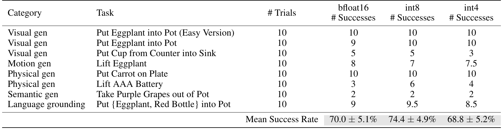

| Category | Task | # Trials | bfloat16 # Successes | int8 # Successes | int4 # Successes |
| --- | --- | --- | --- | --- | --- |
| Visual gen | Put Eggplant into Pot (Easy Version) | 10 | 10 | 10 | 10 |
| Visual gen | Put Eggplant into Pot | 10 | 9 | 10 | 10 |
| Visual gen | Put Cup from Counter into Sink | 10 | 5 | 5 | 3 |
| Motion gen | Lift Eggplant | 10 | 8 | 7 | 7.5 |
| Physical gen | Put Carrot on Plate | 10 | 10 | 10 | 10 |
| Physical gen | Lift AAA Battery | 10 | 3 | 6 | 4 |
| Semantic gen | Take Purple Grapes out of Pot | 10 | 2 | 2 | 2 |
| Language grounding | Put {Eggplant, Red Bottle} into Pot | 10 | 9 | 9.5 | 8.5 |
| **Mean Success Rate** | | | **70.0 ± 5.1%** | **74.4 ± 4.9%** | **68.8 ± 5.2%** |

**Original caption:** Table 11: Quantized inference experiment results with blocking control. We report the success rate and standard error of OpenVLA on various BridgeData V2 WidowX tasks with bfloat16 precision (the default approach), 8-bit quantization (int8), and 4-bit quantization (int4) at inference time. All average success rates have overlapping error bars, which suggests that all methods perform comparably.

**中文图注:** 表 11：阻塞式控制下的量化推理结果（成功次数 / 10 次试验）。平均成功率：int8 74.4 ± 4.9%、bfloat16 70.0 ± 5.1%、int4 68.8 ± 5.2%，三者误差棒重叠，说明性能相当。

**Reading note:** 与表 2（非阻塞控制）对比可见：int8 从 58.1% 升到 74.4%，而 bfloat16 从 71.3% 变为 70.0% —— 说明表 2 中 int8 的劣势来自推理变慢（闭环控制频率下降），而不是量化本身的预测质量。

## p.36 附录 E LIBERO 仿真实验 · E.1 实验设置

**Source:** p.36 S127

**Original:** E LIBERO Simulation Experiments. Our previous discussions in Section 5.2 and Section 5.3 focused on adapting OpenVLA to novel real-world robot setups and tasks. This section explores adapting OpenVLA to simulated robot setups and tasks, specifically utilizing the LIBERO benchmark [116]. Our experimentation in simulation offers two key advantages: 1. Demonstration of versatility: We show that OpenVLA, despite having been pretrained exclusively on real-world robot data, can effectively adapt to simulated domains, overcoming potential disparities between real-world and simulated environments and dynamics. 2. Enhanced accessibility and reproducibility: Integration of OpenVLA into a publicly available simulation platform makes our model more accessible to other researchers, especially those who may not have access to robotic hardware. Additionally, simulated experiments are more easily reproduced than their real-world counterparts.

**中文:** 附录 E LIBERO 仿真实验。前面 5.2 与 5.3 节的讨论聚焦于把 OpenVLA 适配到新的真实世界机器人配置与任务。本节探索把 OpenVLA 适配到仿真机器人配置与任务，具体使用 LIBERO 基准 [116]。在仿真中做实验有两个关键优势：1. 展示通用性：我们证明，尽管 OpenVLA 完全在真实世界机器人数据上预训练，它也能有效适配仿真领域，克服真实环境与仿真环境及动力学之间可能存在的差异。2. 提升可及性与可复现性：把 OpenVLA 集成到公开可用的仿真平台，能让更多研究者（尤其是无法获得机器人硬件的研究者）使用我们的模型；此外，仿真实验比真实世界实验更容易复现。

**Source:** p.36 S128

**Original:** We discuss the experimental setup in Appendix E.1 and the results in Appendix E.2. We release the materials required to reproduce the experiments along with the OpenVLA codebase.

**中文:** 实验设置见附录 E.1，结果见附录 E.2。我们随 OpenVLA 代码库一起发布了复现这些实验所需的材料。

**Source:** p.36 S129

**Original:** E.1 LIBERO Simulation Experimental Setup. Simulation setup and tasks. The LIBERO benchmark [116] consists of four task suites designed for studying lifelong learning in robotic manipulation, and the original paper therefore investigates both forward and backward transfer to a variety of tasks. In our experiments, we focus solely on supervised fine-tuning on the target task suite, measuring the performance of various policies trained via behavioral cloning on successful demonstrations of the tasks.

**中文:** E.1 LIBERO 仿真实验设置。仿真设置与任务。LIBERO 基准 [116] 由四个任务套件构成，用于研究机器人操作中的终身学习，其原始论文因此同时考察对多种任务的前向与后向迁移。在我们的实验中，我们只关注在目标任务套件上的监督微调，衡量各策略在任务成功示教上通过行为克隆训练后的性能。

**Source:** p.36 S130

**Original:** We perform experiments with the following four task suites, which each contain 10 tasks with 50 human-teleoperated demonstrations each: • LIBERO-Spatial consists of the same set of objects but different layouts, and tests the model's understanding of spatial relationships. • LIBERO-Object consists of the same scene layouts but different objects, and tests the model's understanding of object types. • LIBERO-Goal consists of the same objects and layouts but different task goals, and tests the model's knowledge of different task-oriented behaviors. • LIBERO-Long (also called LIBERO-10) consists of long-horizon tasks with diverse objects, layouts, and tasks.

**中文:** 我们使用以下四个任务套件做实验，每个套件包含 10 个任务、每个任务 50 条人工遥操作示教：• LIBERO-Spatial：物体集合相同但布局不同，考察模型对空间关系的理解。• LIBERO-Object：场景布局相同但物体不同，考察模型对物体类型的理解。• LIBERO-Goal：物体与布局相同但任务目标不同，考察模型对不同任务导向行为的知识。• LIBERO-Long（也称 LIBERO-10）：包含物体、布局与任务都多样化的长时程任务。

**Source:** p.36 S131

**Original:** We make the following modifications to each of the training datasets above: 1. To accommodate methods requiring higher-resolution images (such as 256 × 256px or 224 × 224px), we regenerate all demonstrations at an increased resolution of 256 × 256px. Originally, the dataset provided by the benchmark consists of 128 × 128px images. We find that simply upscaling these images to 256 × 256px results in poor image quality. Therefore, we choose to begin with higher-resolution images, which can be downscaled as necessary, ensuring higher image quality across various resolution requirements. These higher-resolution images were obtained by stepping through the simulation environments with the actions stored in the provided human-collected demonstrations and saving the images rendered by the simulator. 2. We filter out all "no-op" actions from the dataset, i.e., actions that have near-zero magnitude in the translation and rotation components and do not change the state of the robot's gripper. We find that this simple data cleaning step is crucial for highly expressive single-step policies such as OpenVLA, which otherwise learn to imitate these no-op actions and consequently freeze indefinitely at certain states during evaluation. 3. We rotate all third-person images at both train and test time by 180 degrees because we observe that the LIBERO environments return images that are upside down on our hardware.

**中文:** 我们对上述每个训练数据集做如下修改：1. 为适配需要更高分辨率图像的方法（如 256 × 256 像素或 224 × 224 像素），我们以更高的 256 × 256 像素分辨率重新生成所有示教。基准提供的原始数据集是 128 × 128 像素图像；我们发现把这些图像简单上采样到 256 × 256 会导致画质很差。因此我们选择从更高分辨率的图像出发，必要时再下采样，从而在各种分辨率需求下都保证更好的画质。这些高分辨率图像是通过在仿真环境中按照所提供的人工采集示教中存储的动作逐步推进，并保存仿真器渲染的图像得到的。2. 我们过滤掉数据集中所有"no-op"（无操作）动作，即在平移与旋转分量上幅度接近零、且不改变机器人夹爪状态的动作。我们发现这一简单的数据清洗步骤对于 OpenVLA 这类表达能力很强的单步策略至关重要——否则模型会学会模仿这些 no-op 动作，从而在评测中于某些状态无限"卡死"。3. 我们在训练与测试时都把第三人称图像旋转 180 度，因为我们观察到 LIBERO 环境在我们的硬件上返回的图像是上下颠倒的。

## p.37 附录 E.1（续）· E.2 LIBERO 实验结果

**Source:** p.37 S132

**Original:** 4. Since we train policies via imitation learning, which expects demonstrations to be successful, we replay all demonstrations in the corresponding simulation environments and filter out the demonstrations that fail to complete the task (as determined by the environments' success criteria). As a result, we remove 68 of 500 LIBERO-Spatial demonstrations, 46 of 500 LIBERO-Object demonstrations, 72 of 500 LIBERO-Goal demonstrations, and 121 of 500 LIBERO-Long demonstratinos. 5. For all methods in our comparisons, we only utilize the static third-person camera images; we do not use the wrist camera images that are additionally provided in the original datasets. This is for sake of having fair comparisons, as OpenVLA's visual inputs only consist of third-person camera images.

**中文:** 4. 由于我们以模仿学习方式训练策略，而模仿学习期望示教都是成功的，我们在对应的仿真环境中回放所有示教，并过滤掉未能完成任务（按环境的成功判据判定）的示教。结果，我们从 500 条 LIBERO-Spatial 示教中移除 68 条、从 500 条 LIBERO-Object 中移除 46 条、从 500 条 LIBERO-Goal 中移除 72 条、从 500 条 LIBERO-Long 中移除 121 条（原文此处拼写为 "demonstratinos"）。5. 对于参与比较的所有方法，我们只使用静态第三人称相机图像，不使用原始数据集中额外提供的手腕相机图像。这样做是为了公平比较，因为 OpenVLA 的视觉输入只包含第三人称相机图像。

**Source:** p.37 S133

**Original:** Comparisons. The methods that we compare include Diffusion Policy⁸ [3] trained from scratch, Octo [5] fine-tuned on the target dataset, and OpenVLA fine-tuned on the target dataset via LoRA (r = 32) as described in Section 5.3. Each policy is trained independently on each of the task suites above (rather than training a single policy on all four suites combined). All policies are trained with the same set of demonstrations, so all methods benefit from the data cleaning steps described above.

**中文:** 对比方法。参与比较的方法包括：从零训练的 Diffusion Policy⁸ [3]、在目标数据集上微调的 Octo [5]，以及按 5.3 节所述通过 LoRA（r = 32）在目标数据集上微调的 OpenVLA。每个策略都在上述每个任务套件上独立训练（而不是在四个套件合并的数据上训练单一策略）。所有策略使用相同的示教集合训练，因此都受益于上述数据清洗步骤。

**Source:** p.37 S134

**Original:** Evaluation details. To ensure lower variance in the experimental results, all methods are evaluated across 500 trials for each task suite, and the reported performance is the average success rate over three random seeds (resulting in 1500 total trials per statistic). Although we modify the training datasets, as described earlier, we do not change the test environments but rather use the same initial environment configurations provided by the original LIBERO benchmark.

**中文:** 评测细节。为降低实验结果方差，所有方法在每个任务套件上都评测 500 次试验，报告的性能为三个随机种子上的平均成功率（每个统计量共 1500 次试验）。虽然如前所述我们修改了训练数据集，但我们不改变测试环境，而是使用原始 LIBERO 基准提供的相同初始环境配置。

**Source:** p.37 S135

**Original:** E.2 LIBERO Simulation Experimental Results. We present the LIBERO experimental results in Table 12. Importantly, we observe that OpenVLA can be effectively adapted to tasks in the LIBERO simulation environments, as it obtains highest average success rate and rank among the tested methods. However, we find that the overall margin between OpenVLA and the other methods are tighter here than in the real-world fine-tuning experiments discussed in Section 5.2. We attribute this to the fact that OpenVLA was pretrained with purely real-world robot data and no simulation data, which suggests that fine-tuning the model on simulated robot tasks may not be as effective as fine-tuning it on real-world tasks due to the domain gap between simulated and real-world environments and dynamics. We see evidence for this notion in the results obtained by Octo – another policy pretrained on large amounts of real-world robot data – which also only achieves a small boost in overall performance relative to a simple, strong baseline such as Diffusion Policy trained from scratch. We expect increased gains in performance for the pretrained and fine-tuned methods if simulation data is added to the pretraining data mixture.

**中文:** E.2 LIBERO 仿真实验结果。LIBERO 实验结果见表 12。重要的是，我们观察到 OpenVLA 能有效适配 LIBERO 仿真环境中的任务：在被测方法中取得最高的平均成功率与平均排名。不过我们发现，OpenVLA 与其他方法的总体差距比 5.2 节真实世界微调实验更小。我们把这归因于 OpenVLA 完全在真实世界机器人数据上预训练、没有使用仿真数据，说明由于仿真与真实环境及其动力学之间存在领域差异，在仿真机器人任务上微调模型的效果可能不如在真实任务上微调。Octo 的结果为这一判断提供了佐证：它同样在大量真实世界机器人数据上预训练，相对 Diffusion Policy 这类简单但强的从零训练基线，其总体性能提升也很小。我们预期，如果在预训练数据混合中加入仿真数据，这些预训练并微调的方法会获得更大收益。

**Source:** p.37 C023

**Original:** Table 12: LIBERO simulation benchmark results. We report the success rate (SR) and standard error of each method for the four task suites in the LIBERO benchmark, averaged over three random seeds with 500 trials each. In addition, we show the ranking of each method within each task suite, where a rank of 1 indicates the strongest method in the suite and a rank of 3 indicates the weakest method. (The average ranking is important to note since it informs which method may be most suitable to use as a default for a variety of tasks; it is more informative than the average success rate, which is not normalized by individual task suite difficulty.) Overall, we find that fine-tuned OpenVLA achieves highest average success rate and rank, followed by fine-tuned Octo and then Diffusion Policy trained from scratch.

**中文:** 表 12：LIBERO 仿真基准结果。我们报告各方法在 LIBERO 四个任务套件上的成功率（SR）与标准误，均为三个随机种子、每个种子 500 次试验的平均值。此外，我们给出各方法在每个任务套件内的排名，排名 1 表示该套件中最强，排名 3 表示最弱。（平均排名值得关注，因为它能说明哪种方法最适合作为多种任务的默认选择；它比平均成功率更有信息量，因为后者没有按各任务套件的难度做归一化。）总体而言，微调后的 OpenVLA 取得最高的平均成功率与平均排名，其次是微调后的 Octo，然后是 Diffusion Policy（从零训练）。

### Table 12. LIBERO 仿真基准：四个任务套件的成功率与排名

**Placed near:** p.37 S135
**Source:** p.37 C023

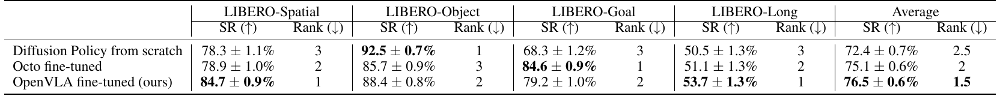

| Method | LIBERO-Spatial SR (↑) | Rank (↓) | LIBERO-Object SR (↑) | Rank (↓) | LIBERO-Goal SR (↑) | Rank (↓) | LIBERO-Long SR (↑) | Rank (↓) | Average SR (↑) | Rank (↓) |
| --- | --- | --- | --- | --- | --- | --- | --- | --- | --- | --- |
| Diffusion Policy from scratch | 78.3 ± 1.1% | 3 | 92.5 ± 0.7% | 1 | 68.3 ± 1.2% | 3 | 50.5 ± 1.3% | 3 | 72.4 ± 0.7% | 2.5 |
| Octo fine-tuned | 78.9 ± 1.0% | 2 | 85.7 ± 0.9% | 3 | 84.6 ± 0.9% | 1 | 51.1 ± 1.3% | 2 | 75.1 ± 0.6% | 2 |
| OpenVLA fine-tuned (ours) | 84.7 ± 0.9% | 1 | 88.4 ± 0.8% | 2 | 79.2 ± 1.0% | 2 | 53.7 ± 1.3% | 1 | 76.5 ± 0.6% | 1.5 |

**Original caption:** Table 12: LIBERO simulation benchmark results. We report the success rate (SR) and standard error of each method for the four task suites in the LIBERO benchmark, averaged over three random seeds with 500 trials each. …

**中文图注:** 表 12：LIBERO 仿真基准结果。SR 为成功率（越高越好，↑），Rank 为套件内排名（越低越好，↓）。OpenVLA 微调后平均成功率 76.5 ± 0.6%、平均排名 1.5；Octo 微调 75.1 ± 0.6%、排名 2；Diffusion Policy 从零训练 72.4 ± 0.7%、排名 2.5。

**Reading note:** 注意即使是"最弱"的套件（LIBERO-Long）OpenVLA 也取得最高 SR（53.7%），但差距很小：这提示在缺乏仿真预训练数据的情况下，VLA 相对强基线的优势会被领域差异削弱。

**Source:** p.37 S136

**Original:** ⁸ We use the implementation of Diffusion Policy that is described in the DROID dataset paper [11], which conditions action generation on DistilBERT [117] language embeddings of the task label.

**中文:** ⁸ 我们使用 DROID 数据集论文 [11] 中所描述的 Diffusion Policy 实现，它以任务标签的 DistilBERT [117] 语言嵌入作为动作生成的条件。

---

## 术语对照表（Terminology）

| 英文 | 中文 | 说明 / 首次出现 |
| --- | --- | --- |
| Vision-Language-Action model (VLA) | 视觉-语言-动作模型 | 把机器人动作作为 token 直接融入 VLM 骨干的策略模型；p.1 摘要 |
| Visually-conditioned language model (VLM) | 视觉条件语言模型 | 由视觉编码器 + 投影器 + LLM 骨干组成；p.4 S014 |
| action token / de-tokenizer | 动作 token / 反分词器 | 连续动作离散化为 256 个 bin 后再映射为 token；p.4 C002、p.5 S017-S018 |
| language grounding | 语言 grounding（语言落地） | 把语言指令对应到场景中正确物体的能力；p.3 S012、p.7 S033 |
| embodiment | （机器人）本体 | 机器人的硬件形态与运动学配置；p.2 S004 |
| end-effector | 末端执行器 | 机械臂末端执行机构（夹爪等）；p.7 S033 |
| rollout | rollout（试验回合） | 一次完整的策略执行与评测；p.7 S033 |
| demonstration / episode / trajectory | 示教 / 回合 / 轨迹 | 数据单位：一条人类遥操作或历史采集的完整操作过程；p.5 S019 |
| out-of-distribution (OOD) | 分布外 | 测试条件偏离训练分布；p.8 C004 |
| distribution shift | 分布偏移 | 训练与测试之间的环境/物体/光照等差异；p.21 S064 |
| parameter-efficient fine-tuning (PEFT) | 参数高效微调 | 只训练少量参数（如 LoRA、sandwich）；p.10 S045 |
| LoRA (low-rank adaptation) | 低秩适配 | 在全部线性层上加低秩矩阵的微调方法；p.3 S009、p.10 S046 |
| sandwich fine-tuning | 三明治微调 | 解冻视觉编码器、token 嵌入矩阵与最后一层；p.10 S046 |
| quantization (bfloat16 / int8 / int4) | 量化（半精度 / 8 位 / 4 位） | 以更低精度加载权重以降低显存；p.10 S048 |
| blocking control | 阻塞式控制 | 上一个动作执行完毕后才预测下一个动作；p.34 S123 |
| action chunking | 动作分块 | 一次预测并开环执行一段动作序列；p.9 S043 |
| non-blocking controller | 非阻塞控制器 | 固定频率持续下发动作、与预测异步；p.9 S040 |
| partial credit | 部分得分 | 任务只完成一部分时给 0.5 分；p.23 S068-S074 |
| FSDP / AMP / FlashAttention | 全分片数据并行 / 自动混合精度 / FlashAttention | 大模型训练基础设施；p.7 S031 |
| SigLIP / DINOv2 / Llama 2 | 同左（保留原名） | OpenVLA 的三个预训练组件；p.1 S001、p.4 S015 |
| Prismatic VLM | Prismatic VLM（保留原名） | OpenVLA 的预训练 VLM 骨干；p.4 S015 |
| BridgeData V2 / Open X-Embodiment (OpenX) / DROID / LIBERO | 同左（数据集名保留原文） | 训练与评测数据集；p.5 S019、p.31 S104、p.36 S129 |
| Octo / RT-1-X / RT-2-X / Diffusion Policy | 同左（方法名保留原文） | 对比基线；p.8 S035 |

## 阅读提示与批判性阅读笔记（Critical reading notes）

以下内容是在中英对照正文之外的补充解读，帮助判断论文结论的适用范围；所有判断均来自正文或附录的具体位置，便于回查。

**这篇论文做了什么（三点贡献）**

OpenVLA 的贡献可以概括为：(1) 一个 7B 参数、完全开源的通用 VLA，在 OpenX 的 97 万条轨迹上微调，并在 WidowX 与 Google robot 的 29 个任务上超过 55B 的闭源 RT-2-X（平均 +16.5 个百分点绝对成功率，p.2 S007）；(2) 系统研究 VLA 的**微调**方法（此前工作没有覆盖），给出全量微调、Last layer only、Frozen vision、Sandwich、LoRA 的对比（p.10 表 1）；(3) 首次说明参数高效微调与量化可把 VLA 放到消费级 GPU 上（p.10-11，p.3 S009）。

**读结果时需要留意的几个"技术前提"**

第一，**RT-2-X 的对比数字经过了特殊查询处理**。由于 RT-2-X 训练时未做数据清洗，其"最可能动作"经常是全零并导致机器人卡死，作者改为始终查询"第二可能动作"（p.32 S109-S111、表脚注见附录 C）。这意味着图 3/图 4/表 4/表 6 中的 RT-2-X 是一个**经过作者调优后的部署配置**，而不是其默认 API 行为；同时 OpenVLA 的优势部分来自"过滤掉 Bridge 数据中全零动作"这一数据清洗步骤，而非纯模型能力。

第二，**语义泛化上 RT-2-X 仍更强**，作者自己的解释是 RT-2-X 与互联网预训练数据联合微调（co-fine-tuning），而 OpenVLA 只微调机器人数据（p.8 S037）。因此"OpenVLA 全面超越 RT-2-X"并不成立：图 3 中语义泛化类别是例外。

第三，**第 5.3 与 5.4 节用的模型并非主模型**。脚注 4（p.10 S049）明确说明：微调与量化实验使用的是一个数据混合更小（与 Octo 相同）、且只带 SigLIP 视觉骨干的较小架构版本。因此表 1、表 2、图 6 的结论应理解为"对该较小版本 + 该配置"成立。

第四，**表 1 的统计强度有限**：成功率是在"部分 Franka-Tabletop 任务"上、每种方法 33 次 rollout 得到的（p.10 C006、表 8 显示仅两个任务各含分布内与 OOD 变体），误差棒 ±6-8 个百分点。LoRA 与全量微调"性能相当"的结论建立在这个样本量上。

第五，**int8 量化变差不是精度问题，而是速度问题**。非阻塞控制下 int8 的推理更慢（A5000 上仅 1.2Hz，而数据采集时为 5Hz），改变了闭环系统动力学，使成功率降到 58.1%；改用阻塞式控制后三种精度误差棒重叠（表 11：int8 74.4%、bfloat16 70.0%、int4 68.8%，p.35 S126、表 2 对照）。

第六，**评测的初始条件被刻意加难**。除 "Put Eggplant into Pot (Easy Version)" 外，所有 BridgeData V2 评测任务的末端执行器都固定在水槽上方某点，机器人必须主动水平伸展（p.25 S088）；这也解释了为什么 RT-1-X 与 Octo 的成功率低于它们原论文报告值（p.25 S086-S088）。

**作者自陈的局限（第 6 节，p.11）**

仅支持单张图像观测（不支持多相机、本体感受与历史）；推理吞吐约 6Hz（默认 bfloat16、RTX 4090 无加速），不足以支撑 ALOHA 这类 50Hz 的高频、双臂灵巧场景；被测任务成功率普遍低于 90%，可靠性仍不够；受算力限制，仍未回答"基座 VLM 规模的影响""与互联网数据联合训练是否显著提升""哪种视觉特征最适合 VLA"等问题（p.11 S054-S057）。

**复现与资源**

模型检查点、微调 notebook 与 PyTorch 代码库全部开源（含 OpenX 数据训练支持、HuggingFace AutoModel 集成、LoRA 微调与量化推理支持），项目主页 https://openvla.github.io（p.6 S029-S030、p.7 S031）。仿真实验（LIBERO）的适配材料也一并发布（p.36 S128）。

**本阅读包的构成**

- `paper.md`：本文件，全文段落级中英对照 + 11 张图、12 张表的独立裁切卡片（图注与中文图注、阅读提示）
- `2406.09246v3.pdf`：用户提供的原始论文 PDF 副本（与本文同目录）
- `assets/fig01.png` - `fig11.png`：11 张图的紧致裁切（300 DPI）
- `assets/table01.png` - `table12.png`：12 张表的紧致裁切（300 DPI，保留原始表格排版）
- `source_map.json`：全部内容块的稳定锚点（页码、类型、原文、译文）
- `translation_notes.md`：术语策略、抽取方式、不确定性说明与省略内容清单
