# RT-1: Robotics Transformer for Real-World Control at Scale｜中英文对照全文阅读稿

> **来源：** `raw/2212.06817v2.pdf`（arXiv:2212.06817v2 [cs.RO]，2023-08-11 修订版，31 页，Preprint）
> **论文类型：** 方法 / 算法论文（大规模机器人模仿学习 + 模型与数据规模化研究）
> **阅读稿模式：** 段落级中英对照；图表按"首次实质性提及处"就近插入，并附原图注与中文图注；每个实质性区块都有稳定锚点（`S###` 正文、`F###` 图、`T###` 表、`C###` 图注）。
> **项目主页：** robotics-transformer1.github.io

## 论文信息

| 项目     | 内容                                                                                                                                                                                                                                                                                                                                                                                                                                                                                                                                                                                                                                                                                                                                                                                            |
| -------- | ----------------------------------------------------------------------------------------------------------------------------------------------------------------------------------------------------------------------------------------------------------------------------------------------------------------------------------------------------------------------------------------------------------------------------------------------------------------------------------------------------------------------------------------------------------------------------------------------------------------------------------------------------------------------------------------------------------------------------------------------------------------------------------------------- |
| 英文题名 | RT-1: Robotics Transformer for Real-World Control at Scale                                                                                                                                                                                                                                                                                                                                                                                                                                                                                                                                                                                                                                                                                                                                      |
| 中文题名 | RT-1：面向大规模真实世界控制的机器人 Transformer                                                                                                                                                                                                                                                                                                                                                                                                                                                                                                                                                                                                                                                                                                                                                |
| 作者     | Anthony Brohan, Noah Brown, Justice Carbajal, Yevgen Chebotar, Joseph Dabis, Chelsea Finn, Keerthana Gopalakrishnan, Karol Hausman, Alex Herzog, Jasmine Hsu, Julian Ibarz, Brian Ichter, Alex Irpan, Tomas Jackson, Sally Jesmonth, Nikhil J Joshi, Ryan Julian, Dmitry Kalashnikov, Yuheng Kuang, Isabel Leal, Kuang-Huei Lee, Sergey Levine, Yao Lu, Utsav Malla, Deeksha Manjunath, Igor Mordatch, Ofir Nachum, Carolina Parada, Jodilyn Peralta, Emily Perez, Karl Pertsch, Jornell Quiambao, Kanishka Rao, Michael Ryoo, Grecia Salazar, Pannag Sanketi, Kevin Sayed, Jaspiar Singh, Sumedh Sontakke, Austin Stone, Clayton Tan, Huong Tran, Vincent Vanhoucke, Steve Vega, Quan Vuong, Fei Xia, Ted Xiao, Peng Xu, Sichun Xu, Tianhe Yu, Brianna Zitkovich（按姓氏字母序，贡献见附录 A） |
| 单位     | Robotics at Google；Everyday Robots；Google Research, Brain Team                                                                                                                                                                                                                                                                                                                                                                                                                                                                                                                                                                                                                                                                                                                                |
| 通讯作者 | keerthanapg, kanishkarao, karolhausman @google.com                                                                                                                                                                                                                                                                                                                                                                                                                                                                                                                                                                                                                                                                                                                                              |
| 关键数据 | 13 台机器人、17 个月、约 130k 条示范、700+ 条语言指令、3000+ 次真实世界评测                                                                                                                                                                                                                                                                                                                                                                                                                                                                                                                                                                                                                                                                                                                     |

## 阅读说明

这份阅读稿按论文原有章节顺序推进，正文每个段落给出**英文原文**与**中文译文**配对，段落之间不做合并或摘要化处理。公式、模型名、数值、引用标记（如 `(Reed et al., 2022)`）在译文中保持原样，便于回查。

图与表按论文中的**首次实质性提及处**插入（文末附"图表清单"给出全部图表的锚点索引）。每张图表都给出：原图注、中文图注、以及一条"阅读提示"（该图表里值得先看什么）。表格另外补一份 Markdown 转录，便于检索数值。

几条使用建议：

1. **先读 6.2 与 6.5。** 6.2 是全文的主结果（RT-1 vs Gato / BC-Z），6.5 给出全文最核心的结论——数据多样性比数据数量更重要。
2. **注意"同一份数据"这个前提。** 所有基线都被重新训练在同一份 RT-1 数据上（p.8 S052），因此比较的是**模型架构**，而不是数据集或任务集。作者自己指出，这个设置其实对基线有利。
3. **区分三类泛化。** 已见任务（seen）、未见任务（unseen，物体与技能都在训练集中、但组合是新的）、鲁棒性（干扰物 / 背景 / 新厨房）。它们对应的能力边界完全不同，不要混用成功率数字。
4. **附录不是重复内容。** 附录 C/D 里有模型卡、仿真吸收与跨机器人迁移的完整设置、SayCan 长时程实验细节、以及模型消融（Table 13）。正文结论的许多限定条件都写在附录里。

## 页面索引

| PDF 页 | 区块锚点                                                                                                                                   | 本节内容                                                                                                                                                                   |
| ------ | ------------------------------------------------------------------------------------------------------------------------------------------ | -------------------------------------------------------------------------------------------------------------------------------------------------------------------------- |
| p.1    | [S001](#S001)、[S002](#S002)、[S003](#S003)、[S004](#S004)                                                                                     | 摘要 / 引言                                                                                                                                                                |
| p.2    | [S005](#S005)、[S006](#S006)、[S007](#S007)、[F001](#F001)                                                                                     | 引言（本页含 Fig. 1）                                                                                                                                                      |
| p.3    | [S008](#S008)、[S009](#S009)、[S010](#S010)、[S011](#S011)                                                                                     | 相关工作 / 预备知识                                                                                                                                                        |
| p.4    | [S012](#S012)、[S013](#S013)、[S014](#S014)、[S015](#S015)、[S016](#S016)、[S017](#S017)                                                         | 预备知识 / 系统总览 / 评测环境、机器人平台与物体集合 / RT-1：机器人 Transformer                                                                                            |
| p.5    | [F002](#F002)、[S018](#S018)、[S019](#S019)、[S020](#S020)、[S021](#S021)、[S022](#S022)                                                         | 模型 / RT-1 架构图（图像与指令 token 化）（本页含 Fig. 2）                                                                                                                 |
| p.6    | [F003](#F003)、[S023](#S023)、[S024](#S024)、[S025](#S025)、[S026](#S026)                                                                       | RT-1 架构图（图像与指令 token 化）（本页含 Fig. 3）                                                                                                                        |
| p.7    | [S027](#S027)、[S028](#S028)、[S029](#S029)、[T001](#T001)、[S030](#S030)                                                                       | RT-1 架构图（图像与指令 token 化） / 数据 / RT-1 采集的技能列表（本页含 Table 1）                                                                                          |
| p.8    | [S031](#S031)、[S032](#S032)、[S033](#S033)、[S034](#S034)、[S035](#S035)、[S036](#S036)                                                         | 实验 / 实验设置                                                                                                                                                            |
| p.9    | [S037](#S037)、[F004](#F004)、[S038](#S038)、[S039](#S039)、[S040](#S040)                                                                       | 实验设置 / 鲁棒性与真实场景评测的配置 / RT-1 能否执行大量指令，并泛化到新任务、新物体与新环境？（本页含 Fig. 4）                                                           |
| p.10   | [S040](#S040)、[T002](#T002)、[S041](#S041)、[S042](#S042)、[S043](#S043)                                                                       | RT-1 能否执行大量指令，并泛化到新任务、新物体与新环境？ / RT-1 在多种指令下的评测轨迹示例 / 能否通过引入仿真数据或不同机器人的数据把模型推得更远？（本页含 Table 2）       |
| p.11   | [F005](#F005)、[T003](#T003)、[S043](#S043)、[S044](#S044)                                                                                     | 能否通过引入仿真数据或不同机器人的数据把模型推得更远？（本页含 Fig. 5、Table 3）                                                                                           |
| p.12   | [S044](#S044)、[T004](#T004)、[S045](#S045)、[S046](#S046)、[S047](#S047)、[S048](#S048)                                                         | 能否通过引入仿真数据或不同机器人的数据把模型推得更远？ / 引入仿真数据的实验结果 / 用一个模型跨两个机器人平台训练（对应表 5）（本页含 Table 4）                             |
| p.13   | [F006](#F006)、[S048](#S048)、[T005](#T005)、[S049](#S049)、[S050](#S050)                                                                       | 用一个模型跨两个机器人平台训练（对应表 5） / 不同方法在长时程机器人场景中的泛化表现如何？（本页含 Fig. 6、Table 5）                                                        |
| p.14   | [S050](#S050)、[T006](#T006)、[S051](#S051)、[S052](#S052)、[S053](#S053)、[T007](#T007)                                                         | 不同方法在长时程机器人场景中的泛化表现如何？ / Kitchen1 与 Kitchen2 中的 SayCan 风格长时程任务 / 泛化指标如何随数据量与数据多样性的变化而变化？（本页含 Table 6、Table 7） |
| p.15   | [S053](#S053)、[S054](#S054)、[S055](#S055)、[S056](#S056)、[S057](#S057)、[S058](#S058)、[R001](#R001)                                           | 泛化指标如何随数据量与数据多样性的变化而变化？ / 结论、局限与未来工作 / 致谢 / 参考文献（p.15–p.19）                                                                      |
| p.16   | [R001](#R001)                                                                                                                               | 参考文献（p.15–p.19）                                                                                                                                                     |
| p.17   | [R001](#R001)                                                                                                                               | 参考文献（p.15–p.19）                                                                                                                                                     |
| p.18   | [R001](#R001)                                                                                                                               | 参考文献（p.15–p.19）                                                                                                                                                     |
| p.19   | [R001](#R001)                                                                                                                               | 参考文献（p.15–p.19）                                                                                                                                                     |
| p.20   | [S059](#S059)、[S060](#S060)、[S070](#S070)、[S071](#S071)                                                                                     | 作者贡献 / 模型卡 / 模型推理 / 大规模数据采集                                                                                                                              |
| p.21   | [F007](#F007)、[S061](#S061)、[S062](#S062)、[S063](#S063)、[S064](#S064)、[S065](#S065)、[S066](#S066)、[S067](#S067)、[S068](#S068)、[S069](#S069) | RT-1 模型卡（本页含 Fig. 7）                                                                                                                                               |
| p.22   | [S072](#S072)、[S073](#S073)、[S074](#S074)、[S075](#S075)、[F008](#F008)                                                                       | 规模化条件下的模型选择（本页含 Fig. 8）                                                                                                                                    |
| p.23   | [S076](#S076)、[F009](#F009)、[S077](#S077)、[S078](#S078)、[S079](#S079)、[S080](#S080)、[S081](#S081)                                           | 数据采集流程 / 评测细节 / §6.2 中使用的未见指令清单 / "干扰物"评测：简单 / 中等 / 困难（本页含 Fig. 9）                                                                   |
| p.24   | [S081](#S081)、[F010](#F010)、[S082](#S082)、[F011](#F011)、[S083](#S083)                                                                       | "干扰物"评测：简单 / 中等 / 困难 / "背景"评测：从相同背景到全新厨房 / 异构数据（本页含 Fig. 10、Fig. 11）                                                                  |
| p.25   | [T008](#T008)                                                                                                                               | （本页含 Table 8）                                                                                                                                                         |
| p.26   | [F012](#F012)、[S084](#S084)、[S085](#S085)、[S086](#S086)                                                                                     | 异构数据（本页含 Fig. 12）                                                                                                                                                 |
| p.27   | [T009](#T009)、[S087](#S087)、[S088](#S088)、[S089](#S089)、[S090](#S090)、[S091](#S091)                                                         | 引入仿真数据的实验结果（与 Table 4 同表）（本页含 Table 9）                                                                                                                |
| p.28   | [S091](#S091)、[T010](#T010)、[S092](#S092)、[S093](#S093)、[S094](#S094)、[S095](#S095)                                                         | 引入仿真数据的实验结果（与 Table 4 同表） / 长时程评测细节 / §6.4 中评测的 SayCan 指令清单（本页含 Table 10）                                                             |
| p.29   | [S095](#S095)、[T011](#T011)、[S096](#S096)、[S097](#S097)、[S098](#S098)                                                                       | §6.4 中评测的 SayCan 指令清单 / Kitchen1 与 Kitchen2 中的 SayCan 长时程任务（与 Table 6 同表） / 模型消融（本页含 Table 11）                                              |
| p.30   | [T012](#T012)、[T013](#T013)、[S099](#S099)                                                                                                   | RT-1 的模型消融（本页含 Table 12、Table 13）                                                                                                                               |
| p.31   | [S100](#S100)、[S101](#S101)、[F013](#F013)                                                                                                   | 总结与分析（本页含 Fig. 13）                                                                                                                                               |

## 摘要与引言（p.1–p.2）

### A BSTRACT｜摘要

**Source:** p.1 S001

**Original:** By transferring knowledge from large, diverse, task-agnostic datasets, modern machine learning models can solve specific downstream tasks either zero-shot or with small task-specific datasets to a high level of performance. While this capability has been demonstrated in other fields such as computer vision, natural language processing or speech recognition, it remains to be shown in robotics, where the generalization capabilities of the models are particularly critical due to the difficulty of collecting real-world robotic data. We argue that one of the keys to the success of such general robotic models lies with open-ended task-agnostic training, combined with high-capacity architectures that can absorb all of the diverse, robotic data. In this paper, we present a model class, dubbed Robotics Transformer, that exhibits promising scalable model properties. We verify our conclusions in a study of different model classes and their ability to generalize as a function of the data size, model size, and data diversity based on a large-scale data collection on real robots performing real-world tasks. The project's website and videos can be found at robotics-transformer1.github.io

**中文:** <mark>通过从大规模、多样、任务无关的数据集中迁移知识，现代机器学习模型已经能够以零样本方式、或仅使用少量任务专属数据，就在特定下游任务上达到很高水平的性能。</mark>这一能力已在计算机视觉、自然语言处理或语音识别等领域得到验证，但在机器人领域仍有待证明——由于采集真实世界机器人数据十分困难，模型在机器人领域的泛化能力尤为关键。我们认为，这类通用机器人模型成功的关键之一，在于开放式、任务无关的训练，再配合能够吸收全部多样化机器人数据的高容量架构。本文提出一类模型，称为 Robotics Transformer（机器人 Transformer），它展现出颇具前景的可扩展模型特性。我们基于在真实机器人上执行真实任务的大规模数据采集，通过研究不同模型类别及其随数据规模、模型规模与数据多样性变化的泛化能力，验证了上述结论。项目网站与视频见 robotics-transformer1.github.io。

### 1 INTRODUCTION｜引言

**Source:** p.1 S002

**Original:** End-to-end robotic learning, with either imitation or reinforcement, typically involves collecting task-specific data in either single-task (Kalashnikov et al., 2018; Zhang et al., 2018) or multi-task (Kalashnikov et al., 2021b; Jang et al., 2021) settings that are narrowly tailored to the tasks that the robot should perform. This workflow mirrors the classic approach to supervised learning in other domains, such as computer vision and NLP, where task-specific datasets would be collected, labeled, and deployed to solve individual tasks, with little interplay between the tasks themselves.

**中文:** 端到端机器人学习，无论采用模仿学习还是强化学习，通常都要采集任务专属数据：或者在单任务设定（Kalashnikov et al., 2018; Zhang et al., 2018）下，或者在多任务设定（Kalashnikov et al., 2021b; Jang et al., 2021）下进行，而这些设定都是针对机器人应当执行的任务量身裁剪的。这一工作流沿袭了其他领域（如计算机视觉与 NLP）中经典的监督学习做法：采集任务专属数据集、加以标注、再部署去解决各自的任务，任务之间几乎没有相互影响。

**Source:** p.1 S003

**Original:** Recent years have seen a transformation in vision, NLP, and other domains, away from siloed, small-scale datasets and models and towards large, general models pre-trained on broad, large datasets. The keys to the success of such models lie with open-ended task-agnostic training, combined with high-capacity architectures that can absorb all of the knowledge present in large-scale datasets. If a model can "sponge up" experience to learn general patterns in language or perception, then it can bring them to bear on individual tasks more efficiently. While removing the need for large task-specific datasets is appealing generally in supervised learning, it is even more critical in robotics, where datasets might require engineering-heavy autonomous operation or expensive human demonstrations. We therefore ask: can we train a single, capable, large multi-task backbone model on data consisting of a wide variety of robotic tasks? And does such a model enjoy the benefits observed in other domains, exhibiting zero-shot generalization to new tasks, environments, and objects?

**中文:** 近年来，视觉、NLP 及其他领域发生了一次转变：从各自为政、小规模的数据集与模型，转向在广泛、大规模数据集上预训练的大型通用模型。这类模型成功的关键，在于开放式、任务无关的训练，以及能够吸收大规模数据集中全部知识的高容量架构。如果模型能够像海绵一样"吸收"经验，学到语言或感知中的通用模式，那么它就能更高效地把这些模式用于具体任务。摆脱对大规模任务专属数据集的依赖，在监督学习里普遍都有吸引力；而在机器人领域这一点更为关键——那里的数据集往往需要工程负担很重的自主运行，或昂贵的人类示教。因此我们提出：能否在由种类繁多的机器人任务构成的数据上，训练出单个能力强、规模大的多任务骨干模型？这样的模型能否享有在其他领域观察到的收益，展现出对新任务、新环境和新物体的零样本泛化？

**Source:** p.1 S004

**Original:** Building such models in robotics is not easy. Although recent years have seen several large multi-task robot policies proposed in the literature (Reed et al., 2022; Jang et al., 2021), such models often have limited breadth of real-world tasks, as with Gato (Reed et al., 2022), or focus on training tasks rather than generalization to new tasks, as with recent instruction following methods (Shridhar et al., 2021; 2022), or attain comparatively lower performance on new tasks (Jang et al., 2021).

**中文:** 在机器人领域构建这类模型并不容易。尽管近年来文献中提出了若干大规模多任务机器人策略（Reed et al., 2022; Jang et al., 2021），但这些模型往往在真实世界任务覆盖面上有限（如 Gato（Reed et al., 2022）），或者聚焦于训练任务而非泛化到新任务（如近期的指令跟随方法（Shridhar et al., 2021; 2022）），或者在新任务上表现相对较低（Jang et al., 2021）。

**Source:** p.2 S005

**Original:** The two main challenges lie in assembling the right dataset and designing the right model. While data collection and curation is often the "unsung hero" of many large-scale machine learning projects (Radford et al., 2021; Ramesh et al., 2021), this is especially true in robotics, where datasets are often robot-specific and gathered manually (Dasari et al., 2019; Ebert et al., 2021). As we will show in our evaluations, good generalization requires datasets that combine both scale and breadth, covering a variety of tasks and settings. At the same time, the tasks in the dataset should be sufficiently well-connected to enable generalization, such that the model can discover the patterns between structural similar tasks and perform new tasks that combine those patterns in novel ways. We utilize a dataset that we gathered over the course of 17 months with a fleet of 13 robots, containing ∼130k episodes and over 700 tasks, and we ablate various aspects of this dataset in our evaluation.

**中文:** 两个主要挑战分别在于：组装合适的数据集，以及设计合适的模型。数据采集与整理往往是许多大规模机器学习项目中"默默无闻的英雄"（Radford et al., 2021; Ramesh et al., 2021），在机器人领域尤其如此——那里的数据集通常与特定机器人绑定，并且靠人工采集（Dasari et al., 2019; Ebert et al., 2021）。正如我们将在评测中展示的，良好的泛化要求数据集同时具备规模与广度，覆盖多样的任务与场景。与此同时，数据集中的任务之间应当联系得足够紧密，从而支撑泛化：模型能够发现结构相似任务之间的模式，并以新颖的方式组合这些模式来完成新任务。我们使用的数据集历时 17 个月、由 13 台机器人组成的机队采集，包含约 130k 个回合和 700 多个任务；在评测中我们对该数据集的多个方面做了消融。

**Source:** p.2 S006

**Original:** The second challenge lies in the design of the model itself. Effective robotic multi-task learning requires a high capacity model, and Transformer (Vaswani et al., 2017) models excel in this regard, particularly when it is necessary to learn many tasks conditioned, as in our case, on language instructions. However, robotic controllers must also be efficient enough to run in real time, which presents a major challenge for Transformers in particular. We propose a novel architecture that we call RT-1 (Robotics Transformer 1), which by encoding high-dimensional inputs and outputs, including camera images, instructions and motor commands into compact token representations to be used by the Transformer, allows for efficient inference at runtime to make real-time control feasible.

**中文:** 第二个挑战在于模型本身的设计。有效的机器人多任务学习需要一个高容量模型，而 Transformer（Vaswani et al., 2017）在这方面表现突出，尤其当需要学习大量以语言指令为条件的任务时（正如本文的情形）。然而，机器人控制器还必须足够高效、能够实时运行，这对 Transformer 尤其构成重大挑战。<mark>我们提出一种新架构，称为 RT-1（Robotics Transformer 1）：它把高维的输入与输出（包括相机图像、指令和电机命令）编码成紧凑的 token 表示，交给 Transformer 处理，从而在运行时实现高效推理，使实时控制变得可行。</mark>

> 需要大容量模型 -> Transformer
> 控制器要实时执行 -> Transformer 的弱点
>
> 将输入输出（图像、文本等）编码成 "紧凑的 token"。
> 图片压缩，每个 token 小。
> 每帧只有很少的 token，序列长度小，Transformer 速度快。

**Source:** p.2 S007

**Original:** Our contribution is the RT-1 model and experiments with this model on a large and broad dataset of real-world robotic tasks. Our experiments not only demonstrate that RT-1 can exhibit significantly improved generalization and robustness compared to prior techniques, but also evaluate and ablate many design choices in both the model and in the composition of the training set. Our results show that RT-1 can perform over 700 training instructions at 97% success rate, and can generalize to new tasks, distractors, and backgrounds 25%, 36% and 18% better than the next best baseline, respectively. This level of performance allows us to execute very long-horizon tasks in the SayCan (Ahn et al., 2022) framework, with as many as 50 stages. We further show that RT-1 can incorporate data from simulation or even other robot types, retaining performance on the original tasks and improving generalization to new scenarios. A short overview of RT-1 capabilities is presented in Fig. 1b².

**中文:** 我们的贡献是 RT-1 模型，以及在一个大规模、广覆盖的真实世界机器人任务数据集上对该模型的实验。实验不仅表明 RT-1 相比此前技术能显著改善泛化性与鲁棒性，还评估并消融了模型设计与训练集构成中的许多设计选择。结果表明：RT-1 能以 97% 的成功率执行 700 多条训练指令，并且在泛化到新任务、新干扰物和新背景上，分别比次优基线好 25%、36% 和 18%。这一性能水平使我们能够在 SayCan（Ahn et al., 2022）框架中执行极长时程任务，最多可达 50 个阶段。我们进一步表明，RT-1 能够吸收来自仿真、甚至其他机器人类型的数据，在保持原有任务性能的同时改善对新场景的泛化。RT-1 能力的简要概览见 Fig. 1b²。

### Fig. 1｜RT-1 架构、数据集与评测总览

**Placed near:** p.2 S007（首次被引用于此段末句）
**Source:** p.2 C001

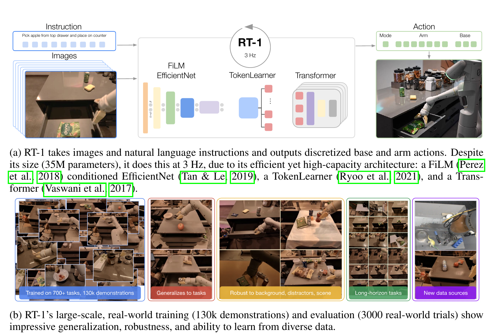

**Original caption:**

> (a) RT-1 takes images and natural language instructions and outputs discretized base and arm actions. Despite its size (35M parameters), it does this at 3 Hz, due to its efficient yet high-capacity architecture: a FiLM (Perez et al., 2018) conditioned EfficientNet (Tan & Le, 2019), a TokenLearner (Ryoo et al., 2021), and a Transformer (Vaswani et al., 2017).
>
> (b) RT-1's large-scale, real-world training (130k demonstrations) and evaluation (3000 real-world trials) show impressive generalization, robustness, and ability to learn from diverse data.
>
> Figure 1: A high-level overview of RT-1's architecture, dataset, and evaluation.

**中文图注:**

> (a) RT-1 以图像和自然语言指令为输入，输出离散化的底盘动作与机械臂动作。尽管规模达到 35M 参数，它仍能以 3 Hz 运行，这得益于其高效而高容量的架构：一个经 FiLM（Perez et al., 2018）条件化的 EfficientNet（Tan & Le, 2019）、一个 TokenLearner（Ryoo et al., 2021）和一个 Transformer（Vaswani et al., 2017）。
>
> (b) RT-1 的大规模真实世界训练（130k 条示范）与评测（3000 次真实世界试验）展现出可观的泛化性、鲁棒性，以及从多样化数据中学习的能力。
>
> 图 1：RT-1 架构、数据集与评测的高层总览。

**Reading note:** 图 1(a) 是从左到右的信息流：指令 → USE 语言嵌入 → FiLM 条件化 EfficientNet → TokenLearner → Transformer → 离散动作（含 Mode / Arm / Base 三组输出）。注意输入侧标注的 "Images" 是多帧历史（论文正文为 6 帧、3 Hz）；图 1(b) 是数据与评测规模的总结，用来解释后文"为什么能做到 3000 次真实试验"。

> 1. FiLM EfficientNet
>    指令先变成 USE 句向量，再经 FiLM 调制 ImageNet 预训练的 EfficientNet-B3。
>    不是「图像编码完再和文字拼」——语言在卷积里就告诉视觉「看抽屉、看苹果」。每帧得到 9×9×512 特征图，展平为 81 个视觉-语言 token 。
> 2. TokenLearner
>    81 个 token 对 Transformer 太贵（注意力是 $O ( n^2 )$ ）。TokenLearner 做软选择，压到 每帧 8 个 token 。
>    6 帧拼起来： 48 个 token 进 Transformer。这是 3 Hz 能跑起来的关键。
> 3. Transformer
>    decoder-only，8 层自注意力，约 19M 参数。把 48 个 token 映射成动作 token。

## 相关工作与预备知识（p.3–p.4）

### 2 RELATED WORK｜相关工作

**Source:** p.3 S008

**Original:** A number of recent works have proposed Transformer-based policies for robotic control. As in RT-1, several works use language commands processed with Transformers as a robust framework for specifying and generalizing to new tasks (Zhang & Chai, 2021; Pashevich et al., 2021; Silva et al., 2021; Jang et al., 2021; Ahn et al., 2022; Nair et al., 2022). Our work takes the application of Transformers a step further and treats the mapping of language and vision observations to robot actions as a sequence modelling problem, using a Transformer to learn this mapping. This idea is directly inspired by successes in game-playing (Chen et al., 2021; Lee et al., 2022a) as well as simulated robot navigation (Fang et al., 2019), locomotion (Janner et al., 2021; Gupta et al., 2022), and manipulation (Jiang et al., 2022) environments. We note that several of these works go beyond only text conditioning and use Transformers to also generalize across robot morphologies (e.g., Gupta et al. (2022)) and other modalities for task specifications (e.g., Jang et al. (2021); Jiang et al. (2022)). These extensions are promising future directions for RT-1.

**中文:** 近期有不少工作提出了基于 Transformer 的机器人控制策略。与 RT-1 一样，其中一些工作把用 Transformer 处理的语言命令，当作指定任务并泛化到新任务的稳健框架（Zhang & Chai, 2021; Pashevich et al., 2021; Silva et al., 2021; Jang et al., 2021; Ahn et al., 2022; Nair et al., 2022）。我们的工作把 Transformer 的应用推进一步：将"语言与视觉观测到机器人动作"的映射视为一个序列建模问题，用 Transformer 来学习这一映射。这一想法直接受到博弈游戏（Chen et al., 2021; Lee et al., 2022a），以及仿真环境中的机器人导航（Fang et al., 2019）、运动控制（Janner et al., 2021; Gupta et al., 2022）和操作（Jiang et al., 2022）等方面成功的启发。我们注意到，这些工作中有一部分不只做文本条件化，还用 Transformer 泛化到不同机器人形态（例如 Gupta et al. (2022)）以及用于任务指定的其他模态（例如 Jang et al. (2021); Jiang et al. (2022)）。这些扩展是 RT-1 有前景的未来方向。

**Source:** p.3 S009

**Original:** Beyond Transformer-based policies, the focus of our work is on generalizable and robust real-world robotic manipulation at scale. Existing works on real-world Transformer-based robotic manipulation focus on efficiently learning tasks from a set of demonstrations per task (Shridhar et al., 2022). Behavior Transformer (Shafiullah et al., 2022) and Gato (Reed et al., 2022) advocate for training a single model on large-scale robotic and non-robotic datasets. However, these works are limited in their real-world robotic tasks; e.g., Gato learns effectively a single task (colored block stacking) without evaluating generalization to new tasks or a variety of real-world settings. On the technical side, our work examines how Transformer-based policies can be built so as to combine high capacity and generalization with the computational efficiency necessary for real-time control.

**中文:** 除了基于 Transformer 的策略之外，我们工作的重点是大规模、可泛化且稳健的真实世界机器人操作。现有的真实世界 Transformer 操作工作，关注的是针对每个任务、从一组示范中高效地学习该任务（Shridhar et al., 2022）。Behavior Transformer（Shafiullah et al., 2022）与 Gato（Reed et al., 2022）主张在大规模机器人与非机器人数据集上训练单一模型。然而，这些工作在真实机器人任务上存在局限：例如 Gato 实际上只学习单个任务（彩色积木堆叠），并未评估对新任务的泛化，也未评估在多种真实世界场景下的表现。在技术层面，我们的工作考察的是：<mark>如何构建基于 Transformer 的策略，使其同时具备高容量、强泛化，以及实时控制所必需的计算效率。</mark>

**Source:** p.3 S010

**Original:** While the use of high-capacity Transformer models to learn robotic control policies is a fairly recent innovation, robotics has a long history of multi-task and language-conditioned learning, and RT-1 builds on these foundations. A significant body of work deals with learning policies and predictive models for robotic grasping (Saxena et al., 2006; Lenz et al., 2015; Pinto & Gupta, 2016; Gupta et al., 2018; Viereck et al., 2017), with the aim of generalizing to new objects. Prior works have sought to address robotic language understanding through pipelined approaches that combine language parsing, vision, and robotic control (MacMahon et al., 2006; Kollar et al., 2010; Tellex et al., 2011) and with end-to-end approaches (Mei et al., 2016; Stepputtis et al., 2020; Lynch & Sermanet, 2020; Ahn et al., 2022). Multi-task robotic learning has also been approached from the perspective of learning to reach goals (Chung et al., 2015; Raffin et al., 2019; Jurgenson et al., 2020; Huang et al., 2020), as well as learning policies that can perform tasks in a discrete set or some other parameterized form (Deisenroth et al., 2014; Devin et al., 2017; Fox et al., 2019; Kalashnikov et al., 2021a). A number of prior works in robotics have also focused on collecting datasets containing demonstrations or trials that illustrate a variety of different tasks (Sharma et al., 2018; Dasari et al., 2019; Yu et al., 2020; Singh et al., 2020; James et al., 2020). Our work adds further evidence in support of the power of multi-task, language-conditioned robotic learning, presenting experimental results at a larger scale and with a greater variety of behaviors, objects, and scenes and proposing new architectures and design choices that enable robotic learning at a significantly larger scale.

**中文:** 虽然用高容量 Transformer 模型学习机器人控制策略是相当晚近的创新，机器人领域却有着悠久的多任务学习与语言条件化学习的历史，RT-1 正是建立在这些基础之上。有大量工作研究面向机器人抓取（Saxena et al., 2006; Lenz et al., 2015; Pinto & Gupta, 2016; Gupta et al., 2018; Viereck et al., 2017）的策略与预测模型，目标是泛化到新物体。此前工作也试图通过"语言解析 + 视觉 + 机器人控制"的流水线方式（MacMahon et al., 2006; Kollar et al., 2010; Tellex et al., 2011），以及端到端方式（Mei et al., 2016; Stepputtis et al., 2020; Lynch & Sermanet, 2020; Ahn et al., 2022）来解决机器人语言理解问题。多任务机器人学习也曾从"学习抵达目标"的角度（Chung et al., 2015; Raffin et al., 2019; Jurgenson et al., 2020; Huang et al., 2020）被研究，也有工作学习能在离散集合或其他参数化形式中执行任务的策略（Deisenroth et al., 2014; Devin et al., 2017; Fox et al., 2019; Kalashnikov et al., 2021a）。此外，许多机器人领域的先前工作专注于采集包含示范或试验的数据集，用以体现多种不同任务（Sharma et al., 2018; Dasari et al., 2019; Yu et al., 2020; Singh et al., 2020; James et al., 2020）。我们的工作为"多任务、语言条件化机器人学习"的能力再添证据：给出规模更大、行为/物体/场景更多样的实验结果，并提出新的架构与设计选择，使机器人学习能够以显著更大的规模进行。

### 3 PRELIMINARIES｜预备知识

**Source:** p.3 S011

**Original:** Robot learning. We aim to learn robot policies to solve language-conditioned tasks from vision. Formally, we consider a sequential decision-making environment. At timestep $t = 0$, the policy $\pi$ is presented with a language instruction $i$ and an initial image observation $x_0$. The policy produces an action distribution $\pi(\cdot \mid i, x_0)$ from which an action $a_0$ is sampled and applied to the robot. This process continues, with the policy iteratively producing actions $a_t$ by sampling from a learned distribution $\pi(\cdot \mid i, \{x_j\}_{j=0}^{t})$ and applying those actions to the robot. The interaction ends when a termination condition is achieved. The full interaction $i, \{(x_j, a_j)\}_{j=0}^{T}$ from from the starting step $t = 0$ to terminating step $T$ is referred to as an episode. At the end of an episode, the agent will be given a binary reward $r \in \{0, 1\}$ indicating whether the robot performed the instruction $i$. The goal is to learn a policy $\pi$ that maximizes the average reward, in expectation over a distribution of instructions, starting states $x_0$, and transition dynamics.

**中文:** **机器人学习。** 我们的目标是学习机器人策略，从视觉出发解决语言条件化任务。形式上，我们考虑一个序贯决策环境。在时间步 $t = 0$，策略 $\pi$ 接收到一条语言指令 $i$ 和一个初始图像观测 $x_0$。策略给出动作分布 $\pi(\cdot \mid i, x_0)$，从中采样出动作 $a_0$ 并施加到机器人上。这一过程持续进行：策略通过从学习到的分布 $\pi(\cdot \mid i, \{x_j\}_{j=0}^{t})$ 中采样，迭代地产生动作 $a_t$ 并施加给机器人。当满足终止条件时，交互结束。从起始步 $t = 0$ 到终止步 $T$ 的完整交互 $i, \{(x_j, a_j)\}_{j=0}^{T}$ 称为一个回合（episode）。回合结束时，智能体会收到一个二值奖励 $r \in \{0, 1\}$，表示机器人是否完成了指令 $i$。目标是学到一个策略 $\pi$，在指令分布、起始状态 $x_0$ 和转移动力学上的期望意义下，最大化平均奖励。

> 注：原文此处有两处笔误（"from from the starting step"、$\{x_j\}^t_{j=0}$ 的排版），上文中已按数学含义保留原样并作形式化整理。

**Source:** p.4 S012

**Original:** Transformers. RT-1 uses a Transformer (Vaswani et al., 2017) to parameterize the policy $\pi$. Generally speaking, a Transformer is a sequence model mapping an input sequence $\{\xi_h\}_{h=0}^{H}$ to an output sequence $\{y_k\}_{k=0}^{K}$ using combinations of self-attention layers and fully-connected neural networks. While Transformers were originally designed for text sequences, where each input $\xi_j$ and output $y_k$ represents a text token, they have been extended to images (Parmar et al., 2018) as well as other modalities (Lee et al., 2022a; Reed et al., 2022). As detailed in the next section, we parameterize $\pi$ by first mapping inputs $i, \{x_j\}_{j=0}^{t}$ to a sequence $\{\xi_h\}_{h=0}^{H}$ and action outputs $a_t$ to a sequence $\{y_k\}_{k=0}^{K}$ before using a Transformer to learn the mapping $\{\xi_h\}_{h=0}^{H} \rightarrow \{y_k\}_{k=0}^{K}$.

**中文:** **Transformer。** RT-1 使用 Transformer（Vaswani et al., 2017）来参数化策略 $\pi$。一般而言，Transformer 是一个序列模型，它通过自注意力层与全连接神经网络的组合，把输入序列 $\{\xi_h\}_{h=0}^{H}$ 映射为输出序列 $\{y_k\}_{k=0}^{K}$。Transformer 最初是为文本序列设计的——每个输入 $\xi_j$ 和输出 $y_k$ 都代表一个文本 token——后来被扩展到了图像（Parmar et al., 2018）以及其他模态（Lee et al., 2022a; Reed et al., 2022）。如下一节所述，我们这样参数化 $\pi$：先把输入 $i, \{x_j\}_{j=0}^{t}$ 映射为序列 $\{\xi_h\}_{h=0}^{H}$、把动作输出 $a_t$ 映射为序列 $\{y_k\}_{k=0}^{K}$，再用 Transformer 学习映射 $\{\xi_h\}_{h=0}^{H} \rightarrow \{y_k\}_{k=0}^{K}$。

**Source:** p.4 S013

**Original:** Imitation learning. Imitation learning methods train the policy $\pi$ on a dataset $\mathcal{D}$ of demonstrations (Pomerleau, 1988; Zhang et al., 2018; Jang et al., 2021). Specifically, we assume access to a dataset $\mathcal{D} = \{(i^{(n)}, \{(x_t^{(n)}, a_t^{(n)})\}_{t=0}^{T^{(n)}})\}_{n=0}^{N}$ of episodes, all of which are successful (i.e., have a final reward of 1). We learn $\pi$ using behavioral cloning (Pomerleau, 1988), which optimizes $\pi$ by minimizing the negative log-likelihood of actions $a_t$ given the images and language instructions.

**中文:** **模仿学习。** 模仿学习方法在一个由示范构成的数据集 $\mathcal{D}$ 上训练策略 $\pi$（Pomerleau, 1988; Zhang et al., 2018; Jang et al., 2021）。具体来说，我们假设可以访问一个由回合构成的数据集 $\mathcal{D} = \{(i^{(n)}, \{(x_t^{(n)}, a_t^{(n)})\}_{t=0}^{T^{(n)}})\}_{n=0}^{N}$，其中所有回合都是成功的（即最终奖励为 1）。我们用行为克隆（behavioral cloning, Pomerleau, 1988）来学习 $\pi$：以图像和语言指令为条件，通过最小化动作 $a_t$ 的负对数似然来优化 $\pi$。

## 系统总览与 RT-1 模型（p.4–p.7）

### 4 SYSTEM OVERVIEW｜系统总览

**Source:** p.4 S014

**Original:** The goal of this work is to build and demonstrate a general robot learning system that can absorb large amounts of data and generalize effectively. We use mobile manipulators from Everyday Robots, which have a 7 degree-of-freedom arm, a two-fingered gripper, and a mobile base (see Fig. 2 (d)). To collect data and evaluate our method, we use three kitchen-based environments: two real office kitchens and a training environment modelled off these real kitchens. The training environment, shown in Fig. 2 (a), consists of partial counters and is constructed for large scale data collection. The two real environments, shown in Fig. 2 (b, c), have similar counter tops to the training environment, but vary in lighting, background, and full kitchen geometry (e.g., there may be a cabinet instead of a drawer or a sink may be visible). We evaluate the performance of our policies across these different environments, measuring the policy's performance and ability to generalize.

**中文:** 本工作的目标是构建并展示一个通用机器人学习系统，它能够吸收大量数据并有效泛化。我们使用 **Everyday Robots 的移动操作机器人，它有一条 7 自由度机械臂、一个两指夹爪和一个移动底盘**（见图 2(d)）。为了采集数据并评测我们的方法，我们使用**三个厨房场景：两个真实的办公室厨房，以及一个以这些真实厨房为原型搭建的训练环境**。训练环境如图 2(a) 所示，由部分台面组成，专为大规模数据采集而搭建。两个真实环境如图 2(b, c) 所示，台面与训练环境相似，但在光照、背景以及整个厨房的几何结构上有差异（例如可能用柜子代替抽屉，或者能看见水槽）。我们在这些不同环境中评测策略的表现，衡量其性能与泛化能力。

> 实验设置

### Fig. 2｜评测环境、机器人平台与物体集合

**Placed near:** p.4 S014（首次被引用于 Fig. 2 (d)）
**Source:** p.5 C002

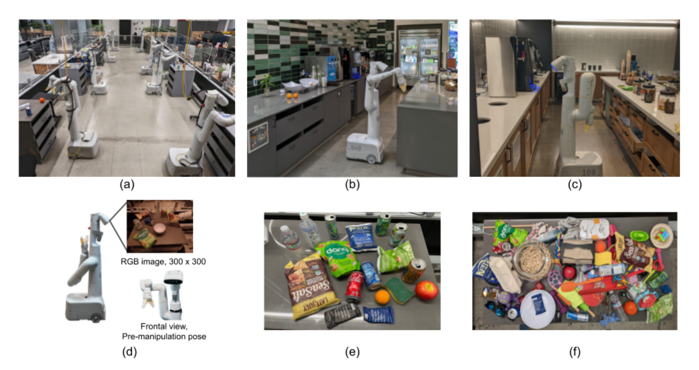

**Original caption:** Figure 2: (a) Robot classroom where we collect data at scale; (b) a real office kitchen, one of the two realistic environments used for evaluation (named Kitchen1 in the rest of the paper); (c) a different office kitchen used for evaluation (named Kitchen2 in the rest of the paper); (d) mobile manipulator used throughout the paper; (e) a set of objects used for most of the skills to expand skill diversity; (f) a more diverse set of objects used mostly to expand object diversity of the picking skill.

**中文图注:** 图 2：(a) 用于大规模数据采集的"机器人教室"；(b) 一间真实的办公室厨房，两个用于评测的真实场景之一（后文称为 Kitchen1）；(c) 另一间用于评测的办公室厨房（后文称为 Kitchen2）；(d) 全文使用的移动操作机器人；(e) 用于多数技能的一套物体，用以扩大技能多样性；(f) 一组更多样的物体，主要用于扩大"抓取"技能的物体多样性。

**Reading note:** **注意 (a) 与 (b)(c) 的关系：训练环境（机器人教室）是照着 Kitchen1 搭的，因此 Kitchen1→Kitchen2 的评测本质上是一次环境分布偏移**，这一点直接决定了 §6.4 中 SayCan 长时程实验在 Kitchen2 上的成功率差异。

**Source:** p.4 S015

**Original:** Our training data consists of human-provided demonstrations, and we annotate each episode with a textual description of the instruction that the robot just performed. The instructions usually contain a verb and one or more nouns describing the target objects. To group these instructions together, we split them into a number of skills (e.g., verbs such as "pick", "open" or "place upright") and objects (e.g., nouns such as "coke can", "apple", or "drawer"). We describe the details of our data collection strategy at scale in Sec. 5.2. Our largest dataset contains over 130k individual demonstrations constituting over 700 distinct task instructions using a large variety of objects (see Fig. 2 (f)). We describe the details of the data collected in Sec. 5.2.

**中文:** 我们的训练数据由人类提供的示范构成，每个回合都会用一句文字描述标注机器人刚刚执行的指令。这些指令通常包含一个动词和一到多个描述目标物体的名词。为了把这些指令归类，我们将其拆分为若干"技能"（skill，例如 "pick"、"open"、"place upright" 这类动词）和"物体"（object，例如 "coke can"、"apple"、"drawer" 这类名词）。我们将在 §5.2 详述大规模数据采集策略。我们最大的数据集包含 130k 条以上的个体示范，构成 700 多条不同的任务指令，覆盖大量不同物体（见图 2(f)）。数据采集的细节见 §5.2。

**Source:** p.4 S016

**Original:** One of the main contributions of our system is the network architecture, Robotics Transformer 1 (RT-1), an efficient model that can absorb large amounts of data, effectively generalize, and output actions at real-time rates for practical robotic control. RT-1 takes a short sequence of images and a natural language instruction as input and outputs an action for the robot at each time step. To this end, the architecture (shown in Figure 1a) leverages several elements: first the images and text are processed via an ImageNet pretrained convolutional network (Tan & Le, 2019) conditioned on a pretrained embedding of the instruction via FiLM (Perez et al., 2018), followed by a Token Learner (Ryoo et al., 2021) to compute a compact set of tokens, and finally a Transformer (Vaswani et al., 2017) to attend over these tokens and produce discretized action tokens. The actions consist of seven dimensions for the arm movement (x, y, z, roll, pitch, yaw, opening of the gripper), three dimensions for base movement (x, y, yaw) and a discrete dimension to switch between three modes: controlling the arm, the base, or terminating the episode. RT-1 performs closed-loop control and commands actions at 3 Hz until it either yields a "terminate" action or hits a pre-set time step limit.

**中文:** 我们系统的主要贡献之一是网络架构 Robotics Transformer 1（RT-1）：一个高效模型，能够吸收大量数据、有效泛化，并以实时频率输出动作，供实际机器人控制使用。RT-1 以一小段图像序列和一条自然语言指令为输入，在每个时间步为机器人输出一个动作。为此，该架构（见图 1a）利用了几个要素：首先，图像与文本经由一个 ImageNet 预训练的卷积网络（Tan & Le, 2019）处理，该网络通过 FiLM（Perez et al., 2018）以指令的预训练嵌入为条件；随后是一个 Token Learner（Ryoo et al., 2021），用于计算一组紧凑的 token；最后是一个 Transformer（Vaswani et al., 2017），在这些 token 上做注意力并产生离散化的动作 token。动作包括七个机械臂运动维度（x, y, z, roll, pitch, yaw、夹爪开合），三个底盘运动维度（x, y, yaw），以及一个用于在三种模式间切换的离散维度：控制机械臂、控制底盘、或终止回合。RT-1 执行闭环控制，以 3 Hz 下发动作，直到产生 "terminate" 动作或触及预设的时间步上限。

### 5 RT-1: ROBOTICS TRANSFORMER｜RT-1：机器人 Transformer

**Source:** p.4 S017

**Original:** In this section, we describe how we tokenize the images, text, and actions, and then discuss the RT-1 model architecture. We then describe how we attain the runtime speed required for real-time control. Lastly, we describe the data collection procedure and the skills and instructions in our dataset.

**中文:** 本节我们描述如何对图像、文本和动作进行 token 化，然后讨论 RT-1 的模型架构；接着说明我们如何达到实时控制所需的运行速度；最后描述数据采集流程，以及数据集中的技能与指令。

### 5.1 M ODEL｜模型

**Source:** p.5 S018

**Original:** Our model is built on a Transformer architecture (Vaswani et al., 2017) and takes a history of images and task description as input and directly outputs tokenized actions, as shown in Fig. 1a and in detail in Fig. 3. In the following we describe the components of the model, following the top-to-bottom order in Fig. 3. More detail on model selection at scale are provided in Appendix C.3.

**中文:** 我们的模型建立在 Transformer 架构（Vaswani et al., 2017）之上，以图像历史与任务描述为输入，直接输出 token 化的动作，如图 1a 所示，详细结构见图 3。下面我们按照图 3 从上到下的顺序描述模型的各个组件。关于规模化条件下模型选择的更多细节见附录 C.3。

### Fig. 3｜RT-1 架构图（图像与指令 token 化）

**Placed near:** p.5 S018（首次被引用于此段）
**Source:** p.6 C003

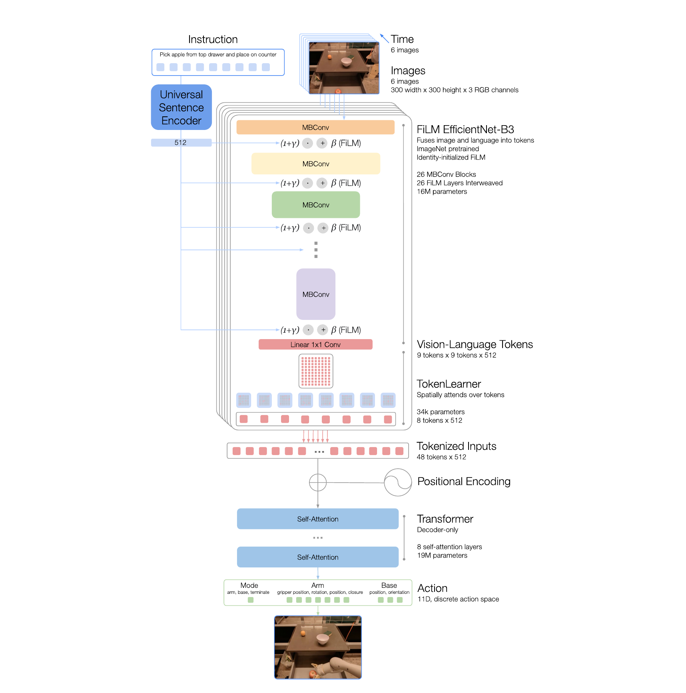

**Original caption:** Figure 3: The architecture diagram of RT-1. The instruction is transformed into a USE embedding and used to condition a pre-trained EfficientNet via FiLM layers. The resulting vision-language tokens are reduced by the TokenLearner and fed into a decoder-only Transformer, which outputs tokenized actions.

**中文图注:** 图 3：RT-1 的架构图。指令被转换为 USE 嵌入，并通过 FiLM 层对预训练 EfficientNet 进行条件化。得到的视觉-语言 token 经 TokenLearner 压缩后送入一个仅解码器（decoder-only）的 Transformer，由其输出 token 化的动作。

**Reading note:** 看这张图时抓住三个"压缩点"：300×300×6 帧图像 → 9×9×512 特征图 → 81 个视觉 token → TokenLearner 压缩到 8 个 token/帧 → 6 帧拼接成 48 个 token 输入 Transformer。整篇论文的"实时性"论证都建立在这条压缩链上。

**Source:** p.5 S019

**Original:** Instruction and image tokenization. The RT-1 architecture relies on a data-efficient and compact tokenization of images and language instruction. RT-1 tokenizes a history of 6 images by passing images through an ImageNet pretrained EfficientNet-B3 (Tan & Le, 2019) model, which takes 6 images of resolution 300 × 300 as input and outputs a spatial feature map of shape 9 × 9 × 512 from the final convolutional layer. Unlike Reed et al. (2022), we do not patchify the images into visual tokens prior to feeding them to our Transformer backbone. We instead flatten the output feature map from the EfficientNet into 81 visual tokens which are passed on to the later layers of the network.

**中文:** **指令与图像 token 化。** RT-1 的架构依赖于对图像和语言指令进行数据高效且紧凑的 token 化。RT-1 对一个长度为 6 的图像历史做 token 化：图像通过一个 ImageNet 预训练的 EfficientNet-B3（Tan & Le, 2019）模型，该模型以 6 张 300 × 300 分辨率的图像为输入，从最后一层卷积层输出形状为 9 × 9 × 512 的空间特征图。与 Reed et al. (2022) 不同，我们不在送入 Transformer 骨干之前把图像切分为视觉 patch。我们改为把 EfficientNet 的输出特征图展平为 81 个视觉 token，传给网络的后续层。

**Source:** p.5 S020

**Original:** To include the language instruction, we condition the image tokenizer on the natural language instruction in the form of a pretrained language embedding, allowing extraction of task-relevant image features early on and improving performance of RT-1. The instruction is first embedded via Universal Sentence Encoder (Cer et al., 2018). This embedding is then used as input to identity-initialized FiLM layers (Perez et al., 2018) added to the pretrained EfficientNet to condition the image encoder. Normally, inserting a FiLM layer into the interior of a pretrained network would disrupt the intermediate activations and negate the benefit of using pretrained weights. To overcome this, we initialize the weights of the dense layers ($f_c$ and $h_C$) which produce the FiLM affine transformation to zero, allowing the FiLM layer to initially act as an identity and preserve the function of the pretrained weights. We find that identity-initialized FiLM also produces better results when training with an EfficientNet initialized from scratch, without ImageNet pretraining, but it does not surpass the initialization described above. The architecture of the image tokenizer is presented in Fig. 3.

**中文:** 为了把语言指令纳入进来，我们以预训练语言嵌入的形式，让自然语言指令对图像 token 化器进行条件化，从而能够在早期就提取与任务相关的图像特征，改善 RT-1 的性能。指令首先通过 Universal Sentence Encoder（USE，Cer et al., 2018）嵌入。然后该嵌入作为输入，送入加到预训练 EfficientNet 上的"恒等初始化"FiLM 层（Perez et al., 2018），以条件化图像编码器。通常情况下，把 FiLM 层插入预训练网络的内部会破坏中间激活，抵消使用预训练权重的好处。为克服这一点，我们把产生 FiLM 仿射变换的稠密层（$f_c$ 与 $h_C$）权重初始化为零，使 FiLM 层初始时充当恒等变换，从而保持预训练权重的功能。我们发现，当 EfficientNet 从零开始训练（不做 ImageNet 预训练）时，恒等初始化的 FiLM 同样能带来更好的结果，但仍不及上述初始化方式。图像 token 化器的架构见图 3。

**Reading note: FiLM 公式**

在 RT-1 中，FiLM 层对每个卷积特征图 **f**（形状如 9×9×512）施加语言条件：

$$
\gamma = \mathbf{W}_\gamma \mathbf{c} + \mathbf{b}_\gamma
$$

$$
\beta = \mathbf{W}_\beta \mathbf{c} + \mathbf{b}_\beta
$$

$$
f' = \gamma \odot f + \beta
$$

其中：

- **f**：EfficientNet 卷积层输出的特征图（逐通道独立调制）
- **c**：USE 句向量（512 维语言嵌入）
- **γ**：scale（尺度）参数，形状 = 通道数
- **β**：bias（偏移）参数，形状 = 通道数
- **⊙**：逐元素（element-wise）乘法
- **Wγ, bγ, Wβ, bβ**：可学习的线性投影层

“在卷积的同时”融入句向量：

1. **FiLM 层插在 EfficientNet 内部**EfficientNet-B3 由 26 层 MBConv 块组成。FiLM 层被**插入多个 MBConv 块之间**，而不是只在最后才和文本融合。
2. **条件化过程**句向量 **c** 先通过 FiLM 层生成两个向量（γ 和 β），这两个向量**与当前特征图 f 同时作用**：

   - 尺度 γ 控制“显著性”：哪些特征该放大（比如“看抽屉”时放大抽屉区域）
   - 偏移 β 控制“偏移”：把特征往语言相关的方向移动

   因此，当 EfficientNet 还在做卷积特征提取时，语言信息就已经“实时”地调制了特征。
3. **初始化方式（恒等初始化）**为了不破坏 EfficientNet 预训练的权重，作者把 FiLM 层的权重初始化为：

   - **γ = 1**（尺度恒等）
   - **β = 0**（偏移恒等）

   这相当于 FiLM 层一开始是“恒等变换”（f' = f），不会干扰卷积过程。等真正训练时，γ 和 β 才开始学怎么根据句向量去调制特征。

为什么这样设计？

- **早期融合**：语言在卷积的每一层都提前介入，而不是后面再把图像特征和文本特征拼接。
- **参数少**：FiLM 只需要两个投影矩阵（γ 和 β），几乎不增加计算量，却能显著提升任务相关性（论文中这是提升 RT-1 泛化的关键之一）。

一句话总结：
FiLM 就是把句向量 **c** 投影成两个参数 **γ** 和 **β**，然后在 EfficientNet 每一层卷积特征图 **f** 上同时做 **γ ⊙ f + β**，实现“语言在卷积过程中实时调制特征”的效果。

**Source:** p.5 S021

**Original:** RT-1's image and instruction tokenization via FiLM EfficientNet-B3 is a total of 16M parameters, with 26 layers of MBConv blocks and FiLM layers, which output 81 vision-language tokens.

**中文:** RT-1 通过 FiLM EfficientNet-B3 实现的图像与指令 token 化，总计 16M 参数，包含 26 层 MBConv 模块与 FiLM 层，输出 81 个视觉-语言 token。

**Source:** p.5 S022

**Original:** TokenLearner. To further compress the number of tokens that RT-1 needs to attend over and thus speed up inference, RT-1 uses TokenLearner (Ryoo et al., 2021). TokenLearner is an element-wise attention module that learns to map a large number of tokens into a much smaller number of tokens. This allows us to soft-select image tokens based on their information, passing only the important token combinations to the subsequent Transformer layers. The inclusion of TokenLearner subsamples the 81 visual tokens that come out of the pre-trained FiLM-EfficientNet layers to just 8 final tokens that are then passed on to our Transformer layers.

**中文:** **TokenLearner。** 为进一步压缩 RT-1 需要做注意力的 token 数量、从而加速推理，RT-1 采用了 TokenLearner（Ryoo et al., 2021）。TokenLearner 是一个逐元素注意力模块，学习把大量 token 映射为少得多的 token。这使我们能够依据信息量对图像 token 做软选择，只把重要的 token 组合传给后续 Transformer 层。引入 TokenLearner 后，来自预训练 FiLM-EfficientNet 层的 81 个视觉 token 被降采样为仅 8 个最终 token，再送入我们的 Transformer 层。

**Source:** p.6 S023

**Original:** Transformer. These 8 tokens per-image are then concatenated with the other images in the history, forming 48 total tokens (with added position encoding) to be fed into the Transformer backbone of RT-1. The Transformer is a decoder-only sequence model with 8 self-attention layers and 19M total parameters that outputs action tokens.

**中文:** **Transformer。** 每张图像的这 8 个 token 随后与历史中的其他图像拼接，共形成 48 个 token（并加入位置编码），送入 RT-1 的 Transformer 骨干。该 Transformer 是一个仅解码器的序列模型，含 8 层自注意力、总计 19M 参数，输出动作 token。

**Source:** p.6 S024

**Original:** Action tokenization. To tokenize actions, each action dimension in RT-1 is discretized into 256 bins. As mentioned previously, the action dimensions we consider include seven variables for the arm movement (x, y, z, roll, pitch, yaw, opening of the gripper), three variables for base movement (x, y, yaw) and a discrete variable to switch between three modes: controlling arm, base or terminating the episode. For each variable, we map the target to one of the 256 bins, where the bins are uniformly distributed within the bounds of each variable.

**中文:** **动作 token 化。** 为对动作做 token 化，RT-1 把每个动作维度离散化为 256 个 bin。如前所述，我们考虑的动作维度包括七个机械臂变量（x, y, z, roll, pitch, yaw、夹爪开合），三个底盘运动变量（x, y, yaw），以及一个在三种模式间切换的离散变量：控制机械臂、控制底盘、或终止回合。对每个变量，我们把目标值映射到 256 个 bin 之一，这些 bin 在该变量的取值范围内均匀分布。

**Source:** p.6 S025

**Original:** Loss. We use a standard categorical cross-entropy entropy objective and causal masking that was utilized in prior Transformer-based controllers (Reed et al., 2022; Lee et al., 2022a).

**中文:** **损失。** 我们使用标准的类别式交叉熵目标与因果掩码（causal masking），这与此前基于 Transformer 的控制器一致（Reed et al., 2022; Lee et al., 2022a）。

**Source:** p.6 S026

**Original:** Inference speed. In contrast to many applications of large models, such as natural language or image generation, one of the unique requirements for a model that needs to run on real robots in real time is fast and consistent inference speed. Given the human speeds of executing the instructions considered in this work (which we measured to be in the 2 - 4 secs range), we want the model to be not significantly slower than that. Based on our experiments this requirement corresponds to at least 3Hz control frequency and the resulting inference time budget for the model, given other latencies in the system, to be less than 100ms.

**中文:** **推理速度。** 与大型模型的许多应用（例如自然语言或图像生成）不同，对于需要在真实机器人上实时运行的模型而言，一项独特要求是推理速度要快且稳定。考虑到本工作中这些指令的人类执行速度（我们测得在 2–4 秒区间），我们希望模型不要明显慢于这个水平。根据我们的实验，这一要求对应至少 3 Hz 的控制频率，因此，在考虑系统中其他延迟之后，模型可用的推理时间预算需小于 100 ms。

**Source:** p.7 S027

**Original:** This requirement limits the size of the model that we can use. We further explore the impact of model size on inference speed in the experiments. We employ two techniques to speed up inference: (i) reduce the number of tokens generated by a pre-trained EfficientNet model by using TokenLearner (Ryoo et al., 2021), (ii) compute these tokens only once and reuse them for the following windows that overlap for the future inferences. Both of these allow us to speed up the model inference by 2.4 and 1.7 times, respectively. Additional details on model inference are in Appendix C.1.

**中文:** 这一要求限制了我们可使用的模型规模。我们在实验中进一步考察了模型规模对推理速度的影响。我们采用两项技术来加速推理：(i) 通过 TokenLearner（Ryoo et al., 2021）减少预训练 EfficientNet 产生的 token 数量；(ii) 这些 token 只计算一次，并复用于后续与未来推理相重叠的窗口。这两项技术分别使模型推理加速 2.4 倍和 1.7 倍。关于模型推理的更多细节见附录 C.1。

**Reading note：**

1. TokenLearner：学一个“软选择器” ，它会自动给 81 个 token 打分，再加权求和成 8 个 token，只保留最重要的那些。

   如何评估“重要”：TokenLearner 学习一组 小数量的 key tokens，这些 key 就是模型自己“发现”的重要概念。待评价 token 与这些 key tokens 做相似度计算（点积等）。
2. Token 复用 + 重叠窗口：图像 token 不是每次都重新计算。

   用重叠的窗口：当前窗口的 token 可以直接复用给下一个窗口（因为窗口之间有重叠部分）。

   这样就不用每次都走一遍 EfficientNet + TokenLearner，节省了大量重复计算。

### 5.2 D ATA｜数据

**Source:** p.7 S028

**Original:** Our goal is to build a system that exhibits high performance, generalization to new tasks, and robustness to distractors and backgrounds. We therefore aim to collect a large, diverse dataset of robot trajectories that includes multiple tasks, objects and environments. Our primary dataset consists of ∼130k robot demonstrations, collected with a fleet of 13 robots over the course of 17 months. We conducted this large-scale data collection in a series of office kitchen segments, which we refer to as robot classrooms, shown in Fig. 2. More details on data collection are in Appendix C.2.

**中文:** 我们的目标是构建一个兼具高性能、对新任务的泛化能力，以及对干扰物与背景的鲁棒性的系统。因此我们致力于采集一个规模大、内容多样的机器人轨迹数据集，涵盖多种任务、物体与环境。我们的主数据集由约 130k 条机器人示范构成，由 13 台机器人组成的机队历时 17 个月采集。这次大规模数据采集是在一系列办公室厨房片段中进行的，我们称之为"机器人教室"（robot classroom），如图 2 所示。数据采集的更多细节见附录 C.2。

**Source:** p.7 S029

**Original:** Skills and instructions. While the definition of a task remains inconsistent in the literature, in this work we count the number of language instructions that the system can perform, where an instruction corresponds to a verb surrounded by one or multiple nouns, such as "place water bottle upright", "move the coke can to the green chip bag" or "open the drawer". RT-1 is able to perform over 700 language instructions in multiple realistic office kitchen environments that we evaluate and describe in detail in the experiments. In order to group the evaluations and draw conclusions on the performance of the system, we group the instructions by the verbs used in them, which we refer to as skills. A more detailed list of instructions is shown in Table 1, with examples and the number of instructions per skill.

**中文:** **技能与指令。** 尽管文献中对"任务"的定义尚不一致，在本工作中我们统计系统能够执行的语言指令数量，其中一条指令对应一个动词加上一到多个名词，例如 "place water bottle upright"（把水瓶竖直放置）、"move the coke can to the green chip bag"（把可乐罐移到绿色薯片袋旁）或 "open the drawer"（打开抽屉）。RT-1 能够在多个真实的办公室厨房环境中执行 700 多条语言指令，这些环境我们在实验部分做了评测与详细描述。为了对评测分组并据此就系统性能得出结论，我们按指令中使用的动词对指令分组，称这些动词为"技能"（skill）。更详细的指令列表见表 1，其中给出每类技能的示例与指令数量。

### Table 1｜RT-1 采集的技能列表

**Placed near:** p.7 S029（首次被引用于此段）
**Source:** p.7 C004

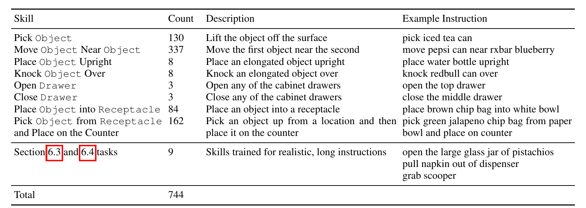

**Original caption:** Table 1: The list of skills collected for RT-1 together with their descriptions and example instructions.

**中文图注:** 表 1：为 RT-1 采集的技能列表，及其描述与示例指令。

| Skill                                                | Count         | Description                                                        | Example Instruction                                                                  |
| ---------------------------------------------------- | ------------- | ------------------------------------------------------------------ | ------------------------------------------------------------------------------------ |
| Pick Object                                          | 130           | Lift the object off the surface                                    | pick iced tea can                                                                    |
| Move Object Near Object                              | 337           | Move the first object near the second                              | move pepsi can near rxbar blueberry                                                  |
| Place Object Upright                                 | 8             | Place an elongated object upright                                  | place water bottle upright                                                           |
| Knock Object Over                                    | 8             | Knock an elongated object over                                     | knock redbull can over                                                               |
| Open Drawer                                          | 3             | Open any of the cabinet drawers                                    | open the top drawer                                                                  |
| Close Drawer                                         | 3             | Close any of the cabinet drawers                                   | close the middle drawer                                                              |
| Place Object into Receptacle                         | 84            | Place an object into a receptacle                                  | place brown chip bag into white bowl                                                 |
| Pick Object from Receptacle and Place on the Counter | 162           | Pick an object up from a location and then place it on the counter | pick green jalapeno chip bag from paper bowl and place on counter                    |
| Section 6.3 and 6.4 tasks                            | 9             | Skills trained for realistic, long instructions                    | open the large glass jar of pistachios / pull napkin out of dispenser / grab scooper |
| **Total**                                      | **744** |                                                                    |                                                                                      |

**Reading note:** 这张表是全文"700+ 指令"说法的量化依据（744 条）。注意两处不平衡：**Move Object Near Object（337）与 Pick Object（130）合计占了 467/744**，而开合抽屉各只有 3 条；同时"Place Object Upright / Knock Object Over"各仅 8 条。§6.5 关于"数据多样性 > 数据数量"的结论，正是在这种长尾分布上做"削减任务数 vs 削减数据量"的对照实验得出的。

**Source:** p.7 S030

**Original:** The current set of skills includes picking, placing, opening and closing drawers, getting items in and out drawers, placing elongated items up-right, knocking them over, pulling napkins and opening jars. The skills were chosen to demonstrate multiple behaviors with many objects (seen in Fig. 2(e)) to test aspects of RT-1 such as generalization to new instructions and ability to perform many tasks. We then greatly expanded the object diversity for the "pick" skill to make sure that the skills generalize to varied objects (see the expanded set of objects in Fig. 2(f)). The skills were further expanded while we conducted the ablations to include instructions added in the last row of Table 1, which were used for the experiments described in Sec. 6.4 and 6.3. These additional skills focused on realistic, long-horizon instructions in an office kitchen. The entire process of adding tasks and data is described in the Appendix C.4. Since we do not make any assumptions about particular skills when adding new instructions, the system is easily extendable, and we can continuously provide more diverse data to improve its capabilities.

**中文:** 当前的技能集合包括抓取、放置、开合抽屉、把物品放进/取出抽屉、把细长物品竖直放置、把它们推倒、抽纸巾和开罐子。选择这些技能，是为了用许多物体（见图 2(e)）展示多种行为，以检验 RT-1 的若干方面，例如对新指令的泛化能力、以及执行大量任务的能力。随后我们大幅扩展了 "pick" 技能的物体多样性，以确保技能能泛化到不同物体（扩展后的物体集合见图 2(f)）。在开展消融实验期间，技能集合进一步扩展，纳入了表 1 最后一行的指令，用于 §6.4 和 §6.3 所述的实验。这些新增技能聚焦于办公室厨房中真实、长时程的指令。添加任务与数据的完整过程见附录 C.4。由于我们在添加新指令时并不对特定技能做任何假设，系统易于扩展，我们可以持续提供更多样化的数据来提升其能力。

## 实验：主结果与泛化（p.8–p.11）

### 6 EXPERIMENTS｜实验

**Source:** p.8 S031

**Original:** Our experiments seek to answer the following questions: 1. Can an RT-1 learn to perform a large number of instructions, as well as to generalize in zero shot to new tasks, objects and environments? (Section 6.2) 2. Can we push the resulting model even further by incorporating heterogeneous data sources, such as simulated data or data from different robots? (Section 6.3) 3. How do various methods generalize to long-horizon robotic scenarios? (Section 6.4) 4. How do generalization metrics change with varying amounts of data quantity and data diversity? (Section 6.5) 5. What are the important and practical decisions in the design of the model and how do they affect performance and generalization? (Appendix Section D.4)

**中文:** 我们的实验试图回答以下问题：

1. RT-1 能否学会执行大量指令，并对新任务、新物体和新环境实现零样本泛化？（§6.2）
2. 能否通过引入异构数据源（例如仿真数据或其他机器人的数据）把所得模型推得更远？（§6.3）
3. 不同方法在长时程机器人场景中的泛化表现如何？（§6.4）
4. 泛化指标如何随数据量与数据多样性的变化而变化？（§6.5）
5. 模型设计中哪些重要且实际的决定会影响性能与泛化？（附录 D.4）

**Source:** p.8 S032

**Original:** Throughout this section we will compare to two baseline state of the art architectures, Gato (Reed et al., 2022) and BC-Z (Jang et al., 2021). Importantly both of these are trained on our data described in detail in Sec. 5.2 (which is an important part of our system) since the original models in these publications would not exhibit generalization properties required for our evaluation tasks. Gato is, similarly to RT-1, based on a Transformer architecture, but varies from RT-1 in multiple aspects. First, it computes image tokens without the notion of language and each image token embedding is computed separately for each image patch, as opposed to early language fusion and global image embedding in our model. Second, it does not use a pre-trained text embedding to encode the language string. It also does not include inference time considerations that are necessary for real robots as discussed in Sec. 5.1 such as TokenLearner and the removal of auto-regressive actions. In order to run Gato on real robots at a high enough frequency, we also limit the size of the model compared to the original publication, which was 1.2B parameters (resulting in on robot inference time of 1.9s), to be of similar size to RT-1 (37M parameters for Gato vs. 35M for RT-1). BC-Z is based on a ResNet architecture, and was used in SayCan (Ahn et al., 2022). BC-Z differs from RT-1 in that it is a feedforward model that does not use previous timesteps, and it uses continuous actions rather than discrete action tokens. In addition to the original BC-Z model size, we also compare our method to a larger version of BC-Z that has a similar number of parameters to RT-1 and refer to it as BC-Z XL. We study and analyze how each of these design decisions changes performance in Appendix Sections D.4 and D.5.

**中文:** 本节中我们将与两个基线（当前最先进架构）比较：Gato（Reed et al., 2022）与 BC-Z（Jang et al., 2021）。重要的一点是：这两个基线都训练在 §5.2 详述的**我们的数据**上（而数据是我们系统的重要组成部分），因为原论文中的模型不会表现出我们的评测任务所需的泛化能力。Gato 与 RT-1 一样基于 Transformer 架构，但在多个方面与 RT-1 不同。第一，它计算图像 token 时不考虑语言，且每个图像 token 嵌入是逐图像 patch 分别计算的；而我们的模型做的是早期语言融合与全局图像嵌入。第二，它不使用预训练文本嵌入来编码语言字符串。它也没有纳入 §5.1 讨论的、真实机器人所必需的推理时间考量，例如 TokenLearner 和去除自回归动作。为了在真实机器人上以足够高的频率运行 Gato，我们还把模型规模限制到与 RT-1 相近（Gato 37M 参数 vs. RT-1 35M），而原论文版本是 1.2B 参数（在机器人上的推理时间为 1.9 秒）。BC-Z 基于 ResNet 架构，曾在 SayCan（Ahn et al., 2022）中使用。BC-Z 与 RT-1 的不同之处在于：它是一个前馈模型，不使用之前的时间步；并且它使用连续动作，而非离散动作 token。除了原始规模的 BC-Z，我们还与一个参数量与 RT-1 相近的更大版本 BC-Z 比较，称之为 BC-Z XL。这些设计决策各自如何改变性能，我们在附录 D.4 与 D.5 中研究与分析。

**Source:** p.8 S033

**Original:** We evaluate the success rate in experiments to measure performance on training instructions, generalization to unseen instructions, robustness to backgrounds and distractors, and performance in long-horizon scenarios, as detailed below. Throughout this section, we evaluate our approach and baselines with over 3000 real-world trials, making one of the largest scale evaluation of a robot learning system to-date.

**中文:** 在实验中我们以成功率作为指标，衡量在训练指令上的性能、对未见指令的泛化、对背景与干扰物的鲁棒性，以及长时程场景下的表现，具体如下。本节中，我们用 3000 次以上的真实世界试验来评测我们的方法与各基线，这也是迄今规模最大的机器人学习系统评测之一。

### 6.1 E XPERIMENTAL S ETUP｜实验设置

**Source:** p.8 S034

**Original:** As mentioned in Section 4, we evaluate RT-1 with a set of mobile manipulators from Everyday Robots in three environments: two real office kitchens and a training environment modelled off these real kitchens. The training environment, shown in Fig. 2 (a), consists of partial counters while the two real environments, shown in Fig. 2 (b, c), have similar counter tops to the training environment, but vary in lighting, background, and full kitchen geometry (e.g., there may be a cabinet instead of a drawer or a sink may be visible). The policies are evaluated for performance on training tasks as well as generalization to new tasks, robustness to unseen environments, and performance when chained together for long-horizon tasks, as detailed below.

**中文:** 如第 4 节所述，我们用 Everyday Robots 的一组移动操作机器人，在三个环境中评测 RT-1：两个真实的办公室厨房，以及一个以这些真实厨房为原型搭建的训练环境。训练环境如图 2(a) 所示，仅由部分台面组成；两个真实环境如图 2(b, c) 所示，台面与训练环境相似，但在光照、背景和整个厨房的几何结构上有差异（例如可能用柜子代替抽屉，或者能看见水槽）。策略的评测涵盖：在训练任务上的性能、对新任务的泛化、对未见环境的鲁棒性，以及将技能串联用于长时程任务时的表现，具体如下。

**Source:** p.8 S035

**Original:** Seen task performance. To evaluate performance on seen instructions, we evaluate performance on instructions sampled from the training set. Note, however, that this evaluation still involves varying the placement of objects and other factors of the setup (e.g., time of day, robot position), requiring the skills to generalize to realistic variability in the environment. In all, we test over 200 tasks in this evaluation: 36 for picking objects, 35 for knocking objects, 35 for placing things upright, 48 for moving objects, 18 for opening and closing various drawers, and 36 for picking out of and placing objects into drawers.

**中文:** **已见任务性能。** 为评测在已见指令上的性能，我们在从训练集中采样的指令上做评测。但要注意，这一评测仍然会改变物体的摆放位置和其他设置因素（例如一天中的时段、机器人位置），因此要求技能对环境中的真实变化具备泛化能力。总体而言，这一评测测试了 200 多个任务：36 个抓取物体、35 个推倒物体、35 个竖直放置、48 个移动物体、18 个开合各种抽屉、以及 36 个从抽屉取出/放入物体。

**Source:** p.8 S036

**Original:** Unseen tasks generalization. To evaluate generalization to unseen tasks, we test 21 novel, unseen instructions. These instructions are distributed across skills and objects. This ensures that at least some instances of each object and skill were present in the training set but they will be combined in novel ways. For example, if "pick up the apple" is held out, then there are other training instructions that include the apple. The list of all unseen instructions can be found in the Appendix D.1.

**中文:** **未见任务泛化。** 为评测对新任务的泛化，我们测试 21 条全新的未见指令。这些指令分布在不同的技能与物体上。这样可以确保每个物体与每项技能至少有部分实例出现在训练集中，但它们会以新的方式组合。例如，如果 "pick up the apple"（拿起苹果）被留出，训练集中仍有其他包含苹果的指令。全部未见指令的清单见附录 D.1。

> 注：正文此处写 21 条未见指令，而 §6.2 的评测与附录 D.1 / 表 8 给出的留出指令为 53 条（"we exclude a total of 53 tasks"）。两处口径不一致，原文如此，阅读时以表 8 的 53 条清单为准。

**Source:** p.9 S037

**Original:** Robustness. To evaluate robustness, we perform 30 real-world tasks for distractor robustness and 22 tasks for background robustness. The background robustness was tested by evaluating in new kitchens (which have different lighting and background visuals) and with different counter surfaces (e.g., a patterned table cloth). Example configurations of the robustness evaluation scenarios are depicted in Fig. 4.

**中文:** **鲁棒性。** 为评测鲁棒性，我们针对干扰物鲁棒性执行了 30 个真实世界任务，针对背景鲁棒性执行了 22 个任务。背景鲁棒性通过在新厨房（光照与背景视觉不同）以及不同台面（例如带图案的桌布）中评测来测试。鲁棒性评测场景的示例配置见图 4。

### Fig. 4｜鲁棒性与真实场景评测的配置

**Placed near:** p.9 S037（首次被引用于此段）
**Source:** p.9 C005

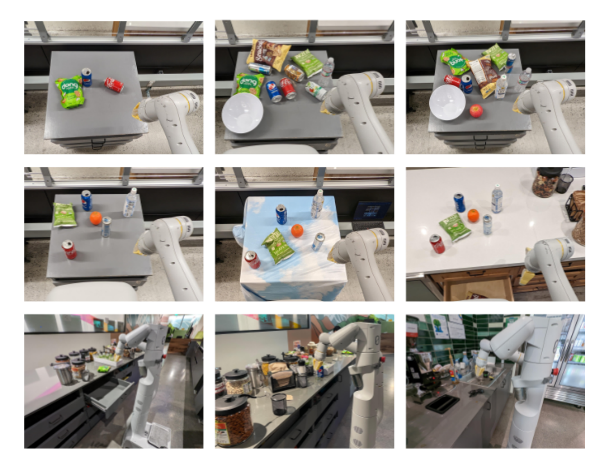

**Original caption:** Figure 4: Evaluation scenarios for distractors (first row), from left to right: easy (0-5 distractors), medium (9 distractors), hard (9 distractors and occluded object); background (second row), from left to right: original environment, patterned table cloth, new kitchen; and realistic scenarios in the real kitchen (third row), generalization levels from left to right: L1, L2 and L3.

**中文图注:** 图 4：评测场景。干扰物（第一行），从左到右：简单（0–5 个干扰物）、中等（9 个干扰物）、困难（9 个干扰物且目标物体被遮挡）；背景（第二行），从左到右：原始环境、带图案桌布、新厨房；以及真实厨房中的真实场景（第三行），泛化等级从左到右为 L1、L2、L3。

**Reading note:** 这三行分别对应三类分布偏移：干扰物数量（场景拥挤度）、外观/背景变化、以及多种偏移叠加。读 §6.2 的结果表时，把 Table 2 的 "Distractors / Backgrounds" 两列与 Table 3 的 L1/L2/L3 对照看，才能看出"单一维度偏移"与"多维度叠加偏移"的性能落差。

**Source:** p.9 S038

**Original:** Long-horizon scenarios. We also evaluate generalization to more realistic long-horizon scenarios, which each require executing a sequence of skills. The goal of this evaluation is to combine multiple generalization axes such as new tasks, objects, environments and test the overall generalization capabilities in realistic settings. These evaluations consist of 15 long-horizon instructions in two real kitchens, which require executing sequences of skills consisting of ∼ 10 distinct steps, with each step of roughly comparable scope as the training instructions. These steps are obtained automatically from higher level instructions, such as "how would you throw away all the items on the table?" by using the SayCan system (Ahn et al., 2022), as described in detail in Section 6.4 and Appendix D.3.

**中文:** **长时程场景。** 我们还评测对更真实的长时程场景的泛化，每个场景都需要执行一系列技能。这一评测的目标是把多个泛化维度（如新任务、新物体、新环境）叠加起来，检验在真实场景下的整体泛化能力。评测包含两个真实厨房中的 15 条长时程指令，需要执行约 10 个不同步骤组成的技能序列，每个步骤的范围与训练指令大致相当。这些步骤是由更高层的指令（例如 "how would you throw away all the items on the table?"，你会怎样把桌上所有东西都扔掉？）通过 SayCan 系统（Ahn et al., 2022）自动得到的，详见 §6.4 与附录 D.3。

### 6.2 C AN RT-1 LEARN TO PERFORM A LARGE NUMBER OF INSTRUCTIONS, AND TO GENERALIZE TO NEW TASKS, OBJECTS AND ENVIRONMENTS?｜RT-1 能否执行大量指令，并泛化到新任务、新物体与新环境？

**Source:** p.9 S039

**Original:** To answer our first question, we analyze the overall performance, generalization, and robustness capabilities of RT-1 compared to previously proposed models. Specifically, we compare to the model architectures used by Gato (Reed et al., 2022) and BC-Z (Jang et al., 2021), as well as a larger version of BC-Z, which we refer to as BC-Z XL. Note, however, that all models are trained on the same data as RT-1, and the evaluation only compares the model architectures, not the task sets, datasets, or overall robotic systems. The capabilities of RT-1 are determined to a large extent by the dataset and task set, which we believe improves significantly over prior works (e.g. BC-Z uses 100 tasks and the original Gato model trains a stacking task with various shapes), and thus this comparison should be viewed as rather favorable to the prior models, which also benefit from the large and diverse dataset and task set that we collected.

**中文:** 为回答第一个问题，我们分析 RT-1 相对于此前提出的模型在整体性能、泛化与鲁棒性方面的表现。具体来说，我们与 Gato（Reed et al., 2022）和 BC-Z（Jang et al., 2021）所用的模型架构比较，另加一个更大版本的 BC-Z，称为 BC-Z XL。但要注意，所有模型都训练在与 RT-1 相同的数据上，评测只比较**模型架构**，不比较任务集、数据集或整体机器人系统。RT-1 的能力在很大程度上由数据集与任务集决定，我们认为这两者相比此前工作有显著改进（例如 BC-Z 使用 100 个任务，原始 Gato 模型训练的是各种形状的堆叠任务），因此这一比较应当被视为对先前模型**相当有利**——它们同样受益于我们采集的大规模、多样化数据集与任务集。

**Source:** p.9–p.10 S040

**Original:** The results are shown in Table 2. Across each category, we find that RT-1 outperforms the prior models significantly. On seen tasks, RT-1 is able to perform 97% of the more than 200 instructions successfully, which is 25% more than BC-Z and 32% more than Gato. On unseen tasks, RT-1 shows it is capable of generalizing to novel instructions, performing 76% of the never-before-seen instructions, 24% more than the next best baseline. While such generalization to novel instructions is made possible due to natural language conditioning of the policy, as the policy is able to understand new combinations of previously seen concepts, all of the baselines are also conditioned on natural language and in principle enjoy the same benefits. We further ablate different components of RT-1 in the next section to better understand what aspects of our method contribute the most to this difference. On distractors and backgrounds, we find that RT-1 is quite robust, successfully executing 83% of the distractor robustness tasks and 59% of the background robustness tasks (36% and 18% higher than the next best alternative, respectively). Overall, we find that RT-1 has high general performance, while exhibiting impressive degrees of generalization and robustness. We show example trajectories of the RT-1 agent including instructions that cover different skills, environments and objects in Fig. 5. We also present additional trajectory examples for different generalization tests in the Appendix, which include backgrounds (Fig. 10), and distractors (Fig. 12).

**中文:** 结果见表 2。在每个类别上，我们都发现 RT-1 显著优于此前模型。在已见任务上，RT-1 能成功执行 200 多条指令中的 97%，比 BC-Z 高 25%、比 Gato 高 32%。在未见任务上，RT-1 展现出对新指令的泛化能力，能执行 76% 的此前从未见过的指令，比次优基线高 24%。这种对新指令的泛化之所以可能，是因为策略以自然语言为条件，能够理解此前见过的概念的新组合；不过所有基线同样以自然语言为条件，原则上也享有同样的好处。我们在下一节进一步消融 RT-1 的不同组件，以更好地理解方法的哪些方面对这一差距贡献最大。在干扰物与背景方面，我们发现 RT-1 相当稳健：成功执行了 83% 的干扰物鲁棒性任务、59% 的背景鲁棒性任务（分别比次优方案高 36% 与 18%）。总体而言，RT-1 具有很高的通用性能，同时展现出可观的泛化性与鲁棒性。我们在图 5 中展示 RT-1 智能体的示例轨迹，覆盖不同技能、环境和物体。附录中还给出了针对不同泛化测试的更多轨迹示例，包括背景（图 10）与干扰物（图 12）。

### Table 2｜RT-1 与基线的整体性能

**Placed near:** p.10 S040（首次被引用于此段）
**Source:** p.10 C006

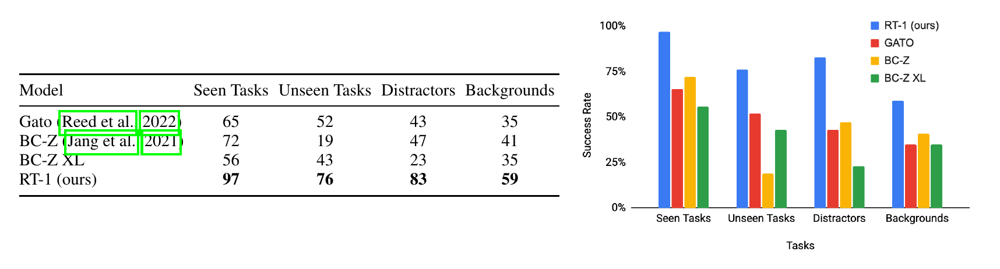

**Original caption:** Table 2: Overall performance of RT-1 and baselines across seen tasks, generalization to unseen tasks, and robustness to distractors and backgrounds.

**中文图注:** 表 2：RT-1 与各基线的整体性能，涵盖已见任务、对未见任务的泛化，以及对干扰物和背景的鲁棒性。

| Model                    | Seen Tasks   | Unseen Tasks | Distractors  | Backgrounds  |
| ------------------------ | ------------ | ------------ | ------------ | ------------ |
| Gato (Reed et al., 2022) | 65           | 52           | 43           | 35           |
| BC-Z (Jang et al., 2021) | 72           | 19           | 47           | 41           |
| BC-Z XL                  | 56           | 43           | 23           | 35           |
| **RT-1 (ours)**    | **97** | **76** | **83** | **59** |

**Reading note:** 这里是全文最重要的对比数字。注意三点：(1) 扩大 BC-Z 反而让"已见任务"下降（72→56）而未见任务上升（19→43），说明容量与泛化并非单调关系；(2) Gato 的未见任务（52）明显高于其已见任务（65）之外的其余基线，但在背景鲁棒性上最差（35）；(3) RT-1 的优势在"分布偏移越大"的两列（干扰物 83、背景 59）上最突出，这与 §6.5 的"数据多样性"结论相互印证。

### Fig. 5｜RT-1 在多种指令下的评测轨迹示例

**Placed near:** p.10 S040（首次被引用于此段）
**Source:** p.11 C007

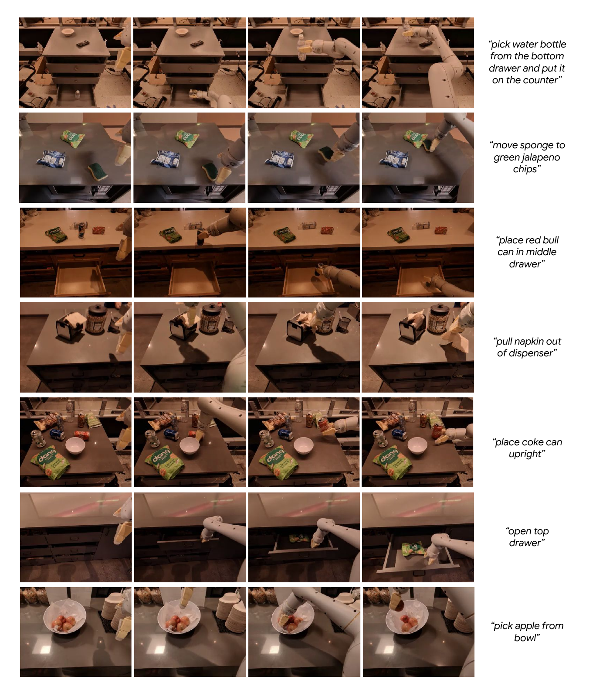

**Original caption:** Figure 5: Example evaluation trajectories for RT-1 across various instructions. （图中每行右侧文字为对应的自然语言指令： "pick water bottle from the bottom drawer and put it on the counter"；"move sponge to green jalapeno chips"；"place red bull can in middle drawer"；"pull napkin out of dispenser"；"place coke can upright"；"open top drawer"；"pick apple from bowl"。）

**中文图注:** 图 5：RT-1 在多种指令下的评测轨迹示例。右侧标注的指令（自上而下）为："从底层抽屉取出水瓶放到台面上"；"把海绵移到绿色墨西哥辣椒味薯片旁"；"把红牛罐放进中间抽屉"；"从纸巾盒中抽出纸巾"；"把可乐罐竖直放置"；"打开上层抽屉"；"从碗里取出苹果"。

**Reading note:** 这 7 行覆盖了抓取、放置、抽屉开合、抽取类等不同技能族的闭环过程。注意每行由 4 帧组成，可用来判断失败模式是"抓取失败"还是"放置/定位失败"，这正是后文讨论"技能成功率随长时程指数下降"的直观来源。

**Source:** p.10 S041

**Original:** Generalization to realistic instructions. Next, we test whether our method generalizes enough across all the different axes that we evaluated previously to be deployed in a real kitchen, which poses multiple distribution shifts all at once such as new tasks combinations, object distractors as well as a novel environment. To evaluate our algorithm in realistic scenarios in a real kitchen, we construct task sequences to accomplish a number of realistic goals. The robot restocks several snacks in drawers, tidies up knocked over condiment bottles and closes drawers left open by humans, prepares a snack with an orange and a napkin and fetches lost sunglasses and an octopus toy from several places in the kitchen. The detailed instructions used in these scenarios are listed in the Appendix D.1. The office kitchen involves a dramatic shift from the training environment and we categorize tasks across these scenarios with varying levels of generalization: L1 for generalization to the new counter-top layout and lighting conditions, L2 for additionally generalization to unseen distractor objects, L3 for additional generalization to drastically new task settings, new task objects or objects in unseen locations such as near a sink. The three levels that correspond to the three tasks of restocking, preparing a snack and fetching a lost object in the real kitchen are depicted in the last row of Fig. 4. Example trajectories for different levels are presented in the Appendix in Fig. 11.

**中文:** **对真实指令的泛化。** 接下来我们检验：我们的方法在各个此前评测过的维度上是否泛化得足够好，从而可以部署到真实厨房中——真实厨房会同时带来多种分布偏移，例如新任务组合、物体干扰物、以及一个全新环境。为在真实厨房的真实场景中评测算法，我们构造了若干任务序列来完成一些贴近现实的目标。机器人会把若干零食补货到抽屉里、把被碰倒的调料瓶摆正、关上人们忘记关的抽屉、用橙子和纸巾准备一份小食，并从厨房的多个位置取回丢失的墨镜和一个章鱼玩具。这些场景中使用的详细指令列于附录 D.1。办公室厨房相对训练环境构成显著偏移，我们按不同的泛化程度对这些场景中的任务分级：L1 表示泛化到新的台面布局与光照条件；L2 表示在此基础上进一步泛化到未见过的干扰物体；L3 表示进一步泛化到截然不同的任务设置、新的任务物体，或位于未见过位置（例如水槽附近）的物体。三个等级分别对应真实厨房中的补货、准备小食和取回失物这三类任务，见图 4 最后一行。不同等级的示例轨迹见附录图 11。

**Source:** p.10 S042

**Original:** We report the per-task success rate in these realistic scenarios along with the varying generalization levels in Table 3 and find RT-1 to be the most robust on all levels. Gato generalizes fairly well at the first level but it performs significantly drops for the more difficult generalization scenarios. BC-Z and its XL equivalent perform fairly well at L2 level and better than Gato at L3 but they are still not at the generalization level of RT-1.

**中文:** 我们在表 3 中报告这些真实场景下按任务的成功率，以及不同泛化等级下的结果，发现 RT-1 在所有等级上都是最稳健的。Gato 在第一级上泛化得还不错，但在更难的泛化场景中性能显著下降。BC-Z 及其 XL 版本在 L2 上表现尚可，在 L3 上优于 Gato，但仍未达到 RT-1 的泛化水平。

> 注：原文 "but it performs significantly drops" 为笔误，语义上应为 "its performance drops significantly"（性能显著下降）。

### Table 3｜真实厨房场景中的泛化等级对比

**Placed near:** p.10 S042（首次被引用于此段）
**Source:** p.11 C008

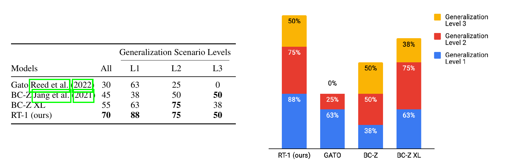

**Original caption:** Table 3: Realistic generalization scenarios: we compare model success rate in a realistic Google kitchen scenarios across three levels of generalization: L1 for generalization to the new counter-top layout and lighting conditions, L2 for additionally generalization to unseen distractor objects, L3 for additionally generalization to drastically new task settings, new task objects or in unseen locations like near a sink.

**中文图注:** 表 3：真实的泛化场景：我们在真实 Google 厨房场景中比较各模型成功率，覆盖三个泛化等级：L1 为泛化到新的台面布局与光照条件；L2 为进一步泛化到未见过的干扰物体；L3 为进一步泛化到截然不同的任务设置、新的任务物体，或位于水槽附近等未见过位置的物体。

| Models                  | All          | L1           | L2 | L3 |
| ----------------------- | ------------ | ------------ | -- | -- |
| Gato Reed et al. (2022) | 30           | 63           | 25 | 0  |
| BC-Z Jang et al. (2021) | 45           | 38           | 50 | 50 |
| BC-Z XL                 | 55           | 63           | 75 | 38 |
| **RT-1 (ours)**   | **70** | **88** | 75 | 50 |

**Reading note:** 把这张表与表 2 对照，可以看到"多维度叠加"的代价：RT-1 在单一维度偏移（背景）上为 59、在干扰物上为 83，但把偏移叠加到真实厨房后，L3 只有 50。同时注意 BC-Z XL 在 L2 上追平 RT-1（75）、在 L3 上反超 RT-1 之外的所有基线（38 vs RT-1 50），说明该表样本量很小（每格对应少数几个任务），单格数字的波动不宜过度解读。

### 6.3 C AN WE PUSH THE RESULTING MODEL FURTHER BY INCORPORATING HETEROGENEOUS DATA SOURCES SUCH AS SIMULATION OR DATA FROM DIFFERENT ROBOTS?｜能否通过引入仿真数据或不同机器人的数据把模型推得更远？

**Source:** p.10–p.11 S043

**Original:** Next, we explore the limits of RT-1 for utilizing highly heterogeneous data. We demonstrate how RT-1 can incorporate and learn from vastly different data sources and improve from such data without sacrificing its original-tasks performance across the varied tasks inherent in this data. To this end, we conduct two experiments: (1) RT-1 trained and tested on both real data and simulation data and (2) RT-1 trained across large datasets of different tasks, originally collected by different robots. More information on each is provided in Appendix D.2.

**中文:** 接下来，我们探索 RT-1 在利用高度异构数据方面的极限。我们展示 RT-1 如何纳入并学习来自差异极大的数据源，并在从这些数据中受益的同时，不牺牲其在数据所固有的各种任务上的原有性能。为此我们做了两个实验：(1) RT-1 同时在真实数据与仿真数据上训练和测试；(2) RT-1 在由不同机器人采集的、覆盖不同任务的大型数据集上训练。二者详情见附录 D.2。

**Source:** p.11–p.12 S044

**Original:** Absorbing simulation data. Table 4 shows the ability of RT-1, and baselines, to absorb both real and simulation data. To test this, we take all of the real demonstration data but we also provide additional simulation data that includes objects that the robot has never seen in the real world. Specifically, we specify different generalization scenarios: for seen skills with real objects the training data has real data of that instruction (i.e., performance on seen tasks), for seen skills with sim objects the training data has sim data of that instruction (e.g. "pick up a sim object", which was present in sim), and for unseen skills with sim objects the training data has sim data of that object but there are no examples of the instruction describing the skill with that object either in sim or in real (e.g., "move a sim object to apple", even though the robot has only practiced in picking that sim object and not moving it near other objects). All evaluations are done in the real world but to limit the number of instructions evaluated, we focus on pick and move-to skills.

**中文:** **吸收仿真数据。** 表 4 展示了 RT-1（及基线）吸收真实数据与仿真数据的能力。为测试这一点，我们使用全部真实示范数据，同时额外提供仿真数据——其中包含机器人在真实世界中从未见过的物体。具体来说，我们设定了几种泛化场景：对于"已见技能 + 真实物体"，训练数据中含有该指令的真实数据（即已见任务性能）；对于"已见技能 + 仿真物体"，训练数据中含有该指令的仿真数据（例如 "pick up a sim object"，该指令存在于仿真中）；对于"未见技能 + 仿真物体"，训练数据中含有该物体的仿真数据，但无论是在仿真还是真实数据中，都不存在把该技能与该物体组合起来的指令示例（例如 "move a sim object to apple"，尽管机器人只练习过抓取该仿真物体，而未练习过把它移动到其他物体旁）。所有评测都在真实世界中完成；为限制评测的指令数量，我们聚焦于抓取（pick）与移到近旁（move-to）两类技能。

### Table 4｜引入仿真数据的实验结果

**Placed near:** p.11 S044（首次被引用于此段）
**Source:** p.12 C009

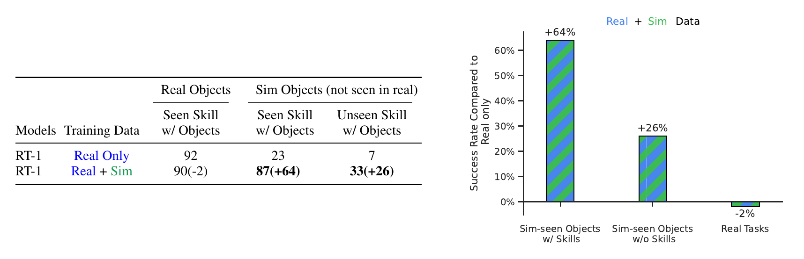

**Original caption:** Table 4: Experimental results for incorporating simulation data in RT-1. Adding simulation data does not impact the performance on real objects, while significantly improving real performance on objects that were only introduced in simulation (+64%). It also improves real-world generalization on simulated objects used with skills seen only in the real world (+26%), e.g. "move X to Y" where X only appeared in simulated "pick X" task.

**中文图注:** 表 4：RT-1 引入仿真数据的实验结果。加入仿真数据不影响在真实物体上的性能，同时显著提升在"仅在仿真中出现过的物体"上的真实世界性能（+64%）。它还能改善"用只在真实世界中见过的技能操作仿真物体"时的真实泛化（+26%），例如 "move X to Y"，其中 X 只出现在仿真的 "pick X" 任务中。

| Models | Training Data | Real Objects, Seen Skill w/ Objects | Sim Objects (not seen in real), Seen Skill w/ Objects | Sim Objects, Unseen Skill w/ Objects |
| ------ | ------------- | ----------------------------------- | ----------------------------------------------------- | ------------------------------------ |
| RT-1   | Real Only     | 92                                  | 23                                                    | 7                                    |
| RT-1   | Real + Sim    | 90(-2)                              | 87(+64)                                               | 33(+26)                              |

> 表 4 右侧附有一张柱状图（"Success Rate Compared to Real only"），标注了 +64%、+26%、-2% 三个相对变化量，与上表最后一行括号内的数值一一对应。

**Reading note:** 关键信息是三个 delta：真实物体 -2（基本无损）、仿真物体 +64、仿真物体+未见技能 +26。作者用最后一项论证"域迁移"：物体只在仿真里见过、且该技能与该物体的组合从未出现过，真实世界里仍能拿到 33%。

**Source:** p.12 S045

**Original:** We find in Table 4 that for RT-1, we do not lose performance adding simulation data compared to the Real Only dataset. We do however, see a significant increase in performance (from 23% to 87%) on objects and tasks seen only in simulation, to approximately the performance of the those in real, demonstrating an impressive degree of domain transfer. We also see a significant increase in performance on unseen instructions from 7% to 33%; impressive given the object in question has never been seen in real and the instruction never seen at all. Overall, we find that RT-1 is able to efficiently absorb new data, even from a very different domain.

**中文:** 从表 4 可以看到，对 RT-1 而言，相比仅在真实数据上训练，加入仿真数据并没有损失性能。而在仅在仿真中出现过的物体与任务上，我们观察到显著的性能提升（从 23% 到 87%），大致达到与真实物体相当的水平，体现出可观的域迁移程度。我们还看到在未见指令上的性能显著提升，从 7% 到 33%；考虑到该物体在真实世界中从未出现过、该指令也从未出现过，这一结果相当亮眼。总体而言，RT-1 能够高效吸收新数据，即使这些数据来自一个差异很大的领域。

**Source:** p.12 S046

**Original:** Absorbing data from different robots. To push the data absorption limits of RT-1, we conduct an additional set of experiments where we combine two data sources that originate from different robots: Kuka IIWA as well as the Everyday Robots mobile manipulators used in the experiments so far. The Kuka data contains all the successful examples collected in QT-Opt (Kalashnikov et al., 2018), which corresponds to 209k episodes, where the robot was indiscriminately grasping objects in a bin (see an example of a Kuka episode in Table. 5). To test whether RT-1 can effectively absorb these two very different datasets, which we refer to as the standard "Classroom eval", as well as the performance on the newly constructed tasks that reflect the bin-picking setup present in the Kuka data, which we refer to as the "Bin-picking eval" (see Fig. 6).

**中文:** **吸收来自不同机器人的数据。** 为进一步推进 RT-1 的数据吸收极限，我们做了另一组实验：把来自两种不同机器人的数据源混合起来——Kuka IIWA，以及前文实验中使用的 Everyday Robots 移动操作机器人。Kuka 数据包含 QT-Opt（Kalashnikov et al., 2018）中采集的全部成功样本，对应 209k 个回合；在那项工作中，机器人不加区分地抓取料箱中的物体（Kuka 回合示例见图 6 / 表 5）。我们评估 RT-1 能否有效吸收这两个差异极大的数据集：一是标准评测（我们称为 "Classroom eval"，即教室环境评测），二是针对反映 Kuka 数据中料箱抓取（bin-picking）设置的新构造任务的性能（我们称为 "Bin-picking eval"，见图 6）。

> 注：原文该句缺少主句谓语（"To test whether ... (see Fig. 6)." 是残句），中文已按语义补足"我们评估……"以保持可读，句子结构问题为原文所有。

### Fig. 6｜用一个模型跨两个机器人平台训练（对应表 5）

**Placed near:** p.12 S046（首次被引用于此段）
**Source:** p.13 C010

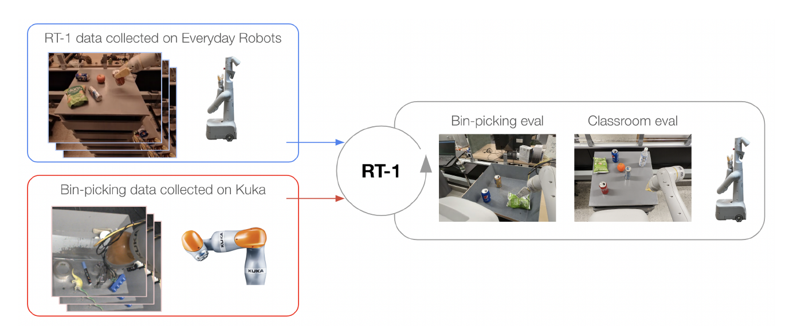

**Original caption:** Figure 6: In Table 5, RT-1 is trained with data from two robotics platforms and learns to generalize across them.

**中文图注:** 图 6：在表 5 中，RT-1 用来自两个机器人平台的数据训练，并学会在两者之间泛化。

**Reading note:** 图 6 展示的是同一个 RT-1 模型面对 Kuka 与 Everyday Robots（EDR）两种形态时的执行画面。结合表 5"仅在 Kuka 数据上训练 → EDR 上 0%"，可以直观理解跨形态迁移的难点：动作空间与外观都不同，必须混合数据才能让模型把 Kuka 的状态映射到 EDR 的正确动作。

**Source:** p.12 S047

**Original:** We would like to emphasize the difficulty of this setting by noting the major differences between the datasets. Not only are the robots that collected the data different in appearance and action space, but also the environment they were deployed in has different appearance and dynamics. In addition the QT-Opt data presents a completely different action distribution – it was collected by an RL agent as opposed to human demonstrations present in our dataset.

**中文:** 我们想通过指出这两个数据集之间的重大差异，来强调该设定之困难。不仅采集数据的机器人在外观与动作空间上不同，它们所部署的环境在外观与动力学上也不同。此外，QT-Opt 数据呈现的是完全不同的动作分布——它由一个强化学习智能体采集，而我们数据集中是人类的示范。

**Source:** p.12–p.13 S048

**Original:** The results are presented in Table 5. We observe that the model that mixes the RT-1 data and the Kuka data has only a minimal decrease in the original tasks' performance (i.e. Classroom eval), i.e. 2%. Even more importantly, in the Bin-picking eval, we observe that the model trained on multi-robot data performs at 39% compared to the 22% of the model that was trained only on the RT-1 data. This is a 17% performance difference (almost 2x). Additionally, RT-1 trained on Kuka bin-picking data and evaluated on the bin-picking tasks with the Everyday Robots (EDR) robot achieves 0% performance, confirming that it is difficult to transfer a behavior from another robot morphology. However, mixing the data from both robots allows RT-1 to infer the correct actions of the EDR robot even when faced with the states observed by Kuka robots. This is achieved without explicit demonstrations of bin-picking on EDR robot and by taking advantage of past experiences collected by Kuka robots. These results indicate that RT-1's absorption properties also include the ability to acquire new skills through observing other robots' experiences and present an exciting avenue of future work where we combine many more multi-robot datasets to enhance the robot capabilities.

**中文:** 结果见表 5。我们观察到，混合 RT-1 数据与 Kuka 数据的模型，在原有任务（即 Classroom eval）上的性能仅有极小下降，为 2%。更重要的是，在 Bin-picking eval 上，用多机器人数据训练的模型达到 39%，而仅在 RT-1 数据上训练的模型只有 22%。这是 17 个百分点的差距（接近 2 倍）。此外，仅在 Kuka 料箱抓取数据上训练、再在 Everyday Robots（EDR）机器人上评测料箱抓取任务时，RT-1 的性能为 0%，这证实了把行为从一个机器人形态迁移到另一个形态是困难的。然而，混合两个机器人的数据后，即使面对 Kuka 机器人所观测到的状态，RT-1 也能推断出 EDR 机器人的正确动作。这一点是在没有 EDR 机器人上料箱抓取的显式示范的条件下、通过利用 Kuka 机器人收集的过往经验实现的。这些结果表明，RT-1 的吸收能力还包括"通过观察其他机器人的经验来获得新技能"，并为未来工作指出了一条令人兴奋的方向：把更多多机器人数据集结合起来以增强机器人能力。

### Table 5｜混合两个机器人的数据

**Placed near:** p.13 S048（首次被引用于此段）
**Source:** p.13 C011

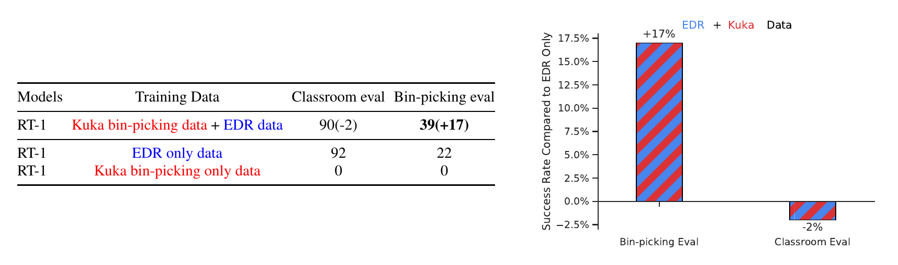

**Original caption:** Table 5: Experimental results for mixing data from two different robots. Incorporating Kuka bin-picking data from QT-Opt (Kalashnikov et al., 2018) in RT-1 minimally impacts the standard classroom evaluation performance and results in almost a 2x improvement in generalization to the Bin-picking evaluation (that is similar to the setup in the Kuka data) on the Everyday Robots manipulator. This demonstrates an effective transfer across two different robot morphologies.

**中文图注:** 表 5：混合两个不同机器人数据的实验结果。把 QT-Opt（Kalashnikov et al., 2018）的 Kuka 料箱抓取数据引入 RT-1，对标准教室评测性能的影响极小，并使 Everyday Robots 操作机器人在 Bin-picking 评测（与 Kuka 数据中的设置相似）上的泛化几乎提升到原来的 2 倍。这表明在两个不同机器人形态之间实现了有效迁移。

| Models | Training Data                    | Classroom eval | Bin-picking eval |
| ------ | -------------------------------- | -------------- | ---------------- |
| RT-1   | Kuka bin-picking data + EDR data | 90(-2)         | 39(+17)          |
| RT-1   | EDR only data                    | 92             | 22               |
| RT-1   | Kuka bin-picking only data       | 0              | 0                |

> 表 5 右侧附有柱状图（"Success Rate Compared to EDR Only"），标注 +17% 与 -2% 两个相对变化量。

**Reading note:** 三行构成一个干净的对照：only-EDR（92/22）、混合（90/39）、only-Kuka（0/0）。值得注意的是最后一行——不是"迁移效果差"，而是**完全无法迁移**；因此混合数据带来的 39% 更应理解为"模型学会了从 Kuka 状态推断 EDR 动作"，而不是简单的技能复用。

### 6.4 H OW DO VARIOUS METHODS GENERALIZE LONG-HORIZON ROBOTIC SCENARIOS?｜不同方法在长时程机器人场景中的泛化表现如何？

**Source:** p.13 S049

**Original:** In the next set of experiments we evaluate whether our method generalizes enough to be used in long-horizon realistic kitchen settings. To answer this question, we execute RT-1 and various baselines within the SayCan (Ahn et al., 2022) framework in two different real kitchens. Since SayCan combines many low-level instructions to perform high-level instructions, the number of possible high-level instructions increases combinatorially with skills, so the skill-breadth of RT-1 can be fully seen (for more details on the SayCan algorithm please refer to Ahn et al. (2022)). The success rate of long-horizon tasks also decreases exponentially with the length of the task, so high success rates in manipulation skills are particularly important. Furthermore, as mobile manipulation tasks require both navigation and manipulation, the policies ability to be robust to base position is crucial. More detail is provided in Appendix D.3.

**中文:** 下一组实验检验我们的方法是否泛化得足够好，从而可用于真实的长时程厨房场景。为回答这一问题，我们在两个不同的真实厨房中，把 RT-1 与各基线放在 SayCan（Ahn et al., 2022）框架里执行。由于 SayCan 会把多条低层指令组合起来完成高层指令，可能的高层指令数量随技能数量呈组合式增长，因此 RT-1 的技能广度能够被充分体现（关于 SayCan 算法的更多细节请参考 Ahn et al. (2022)）。此外，长时程任务的成功率会随任务长度指数下降，因此操作技能本身的高成功率尤为重要。同时，移动操作任务既需要导航也需要操作，策略对底盘位置的鲁棒性至关重要。更多细节见附录 D.3。

**Source:** p.13–p.14 S050

**Original:** Table 6 shows our results (on instructions in Appendix Table 12). Except for original SayCan, all methods get 87% as planning success rate, and RT-1 performs the best, with 67% execution success rate in Kitchen1. Kitchen2 constitutes a much more challenging generalization scene, since the Robot Classroom training scenes are modeled after Kitchen1 (see the pictures of the kitchens in Fig. 2). Due to this generalization difficulty, SayCan with Gato is not able to finish any long horizon task, and SayCan with BC-Z is able to achieve a success rate of 13%. The original SayCan paper did not evaluate performance in a new kitchen. Surprisingly, the manipulation performance does not see a visible drop from Kitchen1 to Kitchen2 for our method.

**中文:** 表 6 给出我们的结果（所用指令见附录表 12）。除原始 SayCan 之外，所有方法的规划成功率都是 87%，其中 RT-1 表现最好：在 Kitchen1 中执行成功率为 67%。Kitchen2 是更具挑战性的泛化场景，因为机器人教室的训练场景是照 Kitchen1 搭建的（见厨房照片，图 2）。由于这一泛化难度，SayCan + Gato 无法完成任何长时程任务，SayCan + BC-Z 的成功率为 13%。原始 SayCan 论文并未在新厨房中评测性能。令人意外的是，我们的方法从 Kitchen1 到 Kitchen2 在操作性能上并未出现可见的下降。

### Table 6｜Kitchen1 与 Kitchen2 中的 SayCan 风格长时程任务

**Placed near:** p.14 S050（首次被引用于此段）
**Source:** p.14 C012

**Original caption:** Table 6: SayCan style long horizon tasks in Kitchen1 and Kitchen2. (*Original SayCan eval uses a slightly different prompt so the planning success rate is lower.)

**中文图注:** 表 6：Kitchen1 与 Kitchen2 中 SayCan 风格的长时程任务。（*原始 SayCan 评测使用了略有不同的提示词，因此规划成功率较低。）

| 方法                                | Kitchen1 规划 | Kitchen1 执行 | Kitchen2 规划 | Kitchen2 执行 |
| ----------------------------------- | ------------- | ------------- | ------------- | ------------- |
| Original SayCan (Ahn et al., 2022)* | 73            | 47            | -             | -             |
| SayCan w/ Gato (Reed et al., 2022)  | 87            | 33            | 87            | 0             |
| SayCan w/ BC-Z (Jang et al., 2021)  | 87            | 53            | 87            | 13            |
| **SayCan w/ RT-1 (ours)**     | 87            | **67**  | 87            | **67**  |

**Reading note:** 重点关注两列"执行成功率"：规划成功率被统一到 87%，因此差异全部来自底层操作策略。RT-1 在 Kitchen2 上"不掉点"（67→67）是全文最有说服力的结论之一，因为它同时叠加了"新厨房 + 未见过抽屉"两种偏移；而 Gato 在同一格上是 0。

**Source:** p.14 S051

**Original:** In the supplementary video, we show that this enables us to operate unseen drawers in Kitchen2, and that we can use SayCan-RT1 to plan and execute ultra-long horizon tasks, with as many as 50 steps.

**中文:** 在补充视频中，我们展示了这使我们能够在 Kitchen2 中操作未见过的抽屉，并且可以用 SayCan-RT1 规划并执行超长时程任务，最多可达 50 个步骤。

### 6.5 H OW DO GENERALIZATION METRICS CHANGE WITH VARYING AMOUNTS OF DATA QUANTITY AND DATA DIVERSITY?｜泛化指标如何随数据量与数据多样性的变化而变化？

**Source:** p.14 S052

**Original:** While previous works have shown the scaling abilities of Transformer-based models (Lee et al., 2022a; Reed et al., 2022; Jiang et al., 2022) with the number of model parameters, in many robotics works the model size is often not the primary bottleneck, and the maximum size is limited by the latency requirement for running such models on real robots. Instead, in this study we focus on ablating the influence of dataset size and diversity, as they play an important role in the traditionally data-limited robot learning field. Since data collection is particularly expensive for real robots, it is important to quantify what kind of data our models need to achieve a certain performance and generalization. Thus, our last question focuses on the scaling properties of RT-1 with different data properties.

**中文:** 此前工作已经展示了基于 Transformer 的模型（Lee et al., 2022a; Reed et al., 2022; Jiang et al., 2022）在模型参数量上的扩展能力；但在许多机器人工作中，模型规模往往不是主要瓶颈，其上限受制于在真实机器人上运行这类模型所需的延迟要求。因此，本研究转而消融数据集规模与多样性的影响，因为它们在传统上受数据限制的机器人学习领域扮演着重要角色。由于真实机器人的数据采集尤其昂贵，量化"我们的模型需要什么样的数据才能达到某种性能与泛化水平"就非常重要。于是我们的最后一个问题聚焦于 RT-1 在不同数据属性下的扩展特性。

**Source:** p.14–p.15 S053

**Original:** In Table 7 we show the performance, generalization, and robustness of RT-1 as we decrease the dataset size (% data) and the dataset diversity (% tasks). To separate the axes of dataset size and diversity, we create smaller datasets with the same task diversity by removing data from the tasks with the largest data, capping the number of examples per task at 200 (resulting in 51% of the data), 100 (37% of the data), and 50 (22.5% of the data). To create a narrow dataset, we remove the tasks with the least data, thus keeping 97% of the overall data but only 75% of the tasks. As we decrease dataset size, we see a general trend of decreasing performance and a steeper trend of decreasing generalization. As we make the dataset more narrow, we see much steeper performance reductions, particularly in terms of generalization. In fact, removing 25% of the tasks while keeping 97% of the data achieves an equivalent generalization performance to reducing the dataset size by as much as 49%. Our key takeaway is thus that data diversity is more essential than data quantity.

**中文:** 在表 7 中，我们展示了在削减数据集规模（% data）与数据集多样性（% tasks）时，RT-1 的性能、泛化与鲁棒性变化。为把"数据规模"与"数据多样性"两个轴分开，我们通过从数据量最大的任务中删减数据来构造规模更小但任务多样性不变的数据集：把每个任务的样本数上限设为 200（得到 51% 的数据）、100（37% 的数据）、50（22.5% 的数据）。为构造"更窄"的数据集，我们删除数据量最少的任务，从而保留 97% 的总数据、但只保留 75% 的任务。随着数据集规模下降，我们观察到性能总体下降、泛化下降更陡的趋势。而当我们让数据集变得更窄时，性能下降要陡得多，尤其在泛化方面。事实上，在保留 97% 数据的前提下删除 25% 的任务，其泛化性能与把数据集规模削减多达 49% 的效果相当。因此我们的核心结论是：**数据多样性比数据数量更关键。**

### Table 7｜RT-1 的数据消融（数据量 vs. 数据多样性）

**Placed near:** p.15 S053（首次被引用于此段）
**Source:** p.14 C013

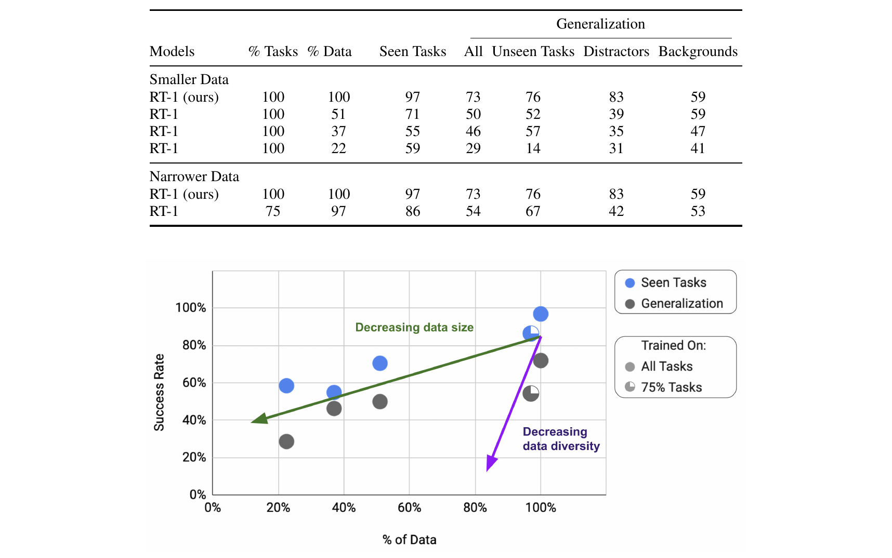

**Original caption:** Table 7: Various data ablations of RT-1 across seen tasks, generalization to unseen tasks, and robustness to distractors and backgrounds. Data diversity has a higher impact on the performance and generalization than data quantity.

**中文图注:** 表 7：RT-1 在已见任务、对未见任务的泛化，以及对干扰物与背景鲁棒性上的多种数据消融。数据多样性对性能与泛化的影响大于数据数量。

|                         | Models      | % Tasks | % Data | Seen Tasks | All | Unseen Tasks | Distractors | Backgrounds |
| ----------------------- | ----------- | ------- | ------ | ---------- | --- | ------------ | ----------- | ----------- |
| **Smaller Data**  | RT-1 (ours) | 100     | 100    | 97         | 73  | 76           | 83          | 59          |
|                         | RT-1        | 100     | 51     | 71         | 50  | 52           | 39          | 59          |
|                         | RT-1        | 100     | 37     | 55         | 46  | 57           | 35          | 47          |
|                         | RT-1        | 100     | 22     | 59         | 29  | 14           | 31          | 41          |
| **Narrower Data** | RT-1 (ours) | 100     | 100    | 97         | 73  | 76           | 83          | 59          |
|                         | RT-1        | 75      | 97     | 86         | 54  | 67           | 42          | 53          |

> 表 7 中 "All"、"Unseen Tasks" 两列在原表中同为 "Generalization" 大列下的子列（原表用横线把 `% Tasks / % Data` 与 `Seen Tasks` 分隔开）。上表按原表数值逐项转录；表中另附一张柱状图，展示各消融相对完整 RT-1 的泛化变化。

**Reading note:** 这是全文最有信息量的一张表，读法是对比两组"代价相当"的削减：
**Smaller Data**（数据量减半到 51%，任务数不变）：已见 97→71，未见 76→52；
**Narrower Data**（任务数减到 75%，数据保留 97%）：已见 97→86，未见 76→67，干扰物 83→42。
可见"删 25% 任务"对干扰物鲁棒性的打击（-41）远大于"删 49% 数据"（83→39，-44 出现在 %data=51 那一行，但同一行的任务数完整）。作者的落点是：在算力/时间有限时，扩任务广度优先于堆重复样本。

### 7 C ONCLUSIONS, L IMITATIONS AND F UTURE W ORK｜结论、局限与未来工作

**Source:** p.15 S054

**Original:** We presented Robotics Transformer 1, RT-1, a robot learning method that can effectively absorb large amounts of data and scales with data quantity and diversity. We trained RT-1 on a large dataset of demonstrations containing over 130k episodes collected over the course of 17 months with 13 robots. In our broad set of experiments, we demonstrated that our method that can perform over 700 instructions at 97% success rate and effectively generalize to new tasks, objects and environments better than previously published baselines. We also demonstrated that RT-1 can successfully absorb heterogeneous data from simulation and other robot morphologies without sacrificing original-tasks performance and while improving generalization to new scenarios. Lastly, we showed how this level of performance and generalization allowed us to execute very long-horizon tasks in the SayCan (Ahn et al., 2022) framework, with as many as 50 steps.

**中文:** 我们提出了 Robotics Transformer 1（RT-1）：一种能够有效吸收大量数据、并随数据数量与多样性扩展的机器人学习方法。我们在一个大规模示范数据集上训练 RT-1，该数据集包含 130k 个以上回合，由 13 台机器人历时 17 个月采集。在一系列广泛的实验中，我们证明该方法能以 97% 的成功率执行 700 多条指令，并且在泛化到新任务、新物体和新环境上优于此前发表的基线。我们还证明，RT-1 能够成功吸收来自仿真和其他机器人形态的异构数据，既不牺牲原有任务性能，又提升了对新场景的泛化。最后，我们展示了这样的性能与泛化水平如何使我们能够在 SayCan（Ahn et al., 2022）框架中执行极长时程任务，最多可达 50 个步骤。

**Source:** p.15 S055

**Original:** While RT-1 presents a promising step towards large-scale robot learning with an data-absorbent model, it comes with a number of limitations. First, it is an imitation learning method, which inherits the challenges of that class of approaches such as the fact that it may not be able to surpass the performance of the demonstrators. Second, the generalization to new instructions is limited to the combinations of previously seen concepts and RT-1 is not yet able to generalize to a completely new motion that has not been seen before. Lastly, our method is presented on a large but not very dexterous set of manipulation tasks. We plan to continue extending the set of instructions that RT-1 enables and generalizes to to address this challenge.

**中文:** 尽管 RT-1 朝着"用可吸收数据的模型进行大规模机器人学习"迈出了有前景的一步，它仍有若干局限。第一，它是一种模仿学习方法，因而继承了这类方法的固有挑战，例如可能无法超越示教者的水平。第二，对新指令的泛化局限于"已见概念的新组合"，RT-1 尚不能泛化到此前从未见过的全新运动。最后，我们的方法是在一组数量大但灵巧性不高的操作任务上展示的。我们计划持续扩展 RT-1 能够执行并泛化的指令集合，以应对这一挑战。

**Source:** p.15 S056

**Original:** As we explore future directions for this work, we hope to scale the number of robot skills faster by developing methods that allow non-experts to train the robot via directed data collection and model prompting. While the current version of RT-1 is fairly robust especially to distractor objects, its robustness to backgrounds and environments could be further improved by greatly increasing the environment diversity. We also hope to improve the reaction speeds and context retention of RT-1 through scalable attention and memory.

**中文:** 在探索本工作未来方向时，我们希望通过开发能让非专家借助定向数据采集与模型提示（prompting）来训练机器人的方法，更快地扩展机器人技能数量。当前版本的 RT-1 已相当稳健，尤其对干扰物体；而其针对背景与环境的鲁棒性，可通过大幅增加环境多样性进一步提升。我们还希望通过可扩展的注意力与记忆机制，改进 RT-1 的反应速度与上下文保持能力。

**Source:** p.15 S057

**Original:** To allow the research community to build on top of this work, we have open-sourced the code for RT-1⁴, which we hope will provide researchers with a valuable resource for future research for scaling up robot learning.

**中文:** 为便于研究社区在本工作基础上继续推进，我们已开源 RT-1 的代码⁴，希望它能成为研究者未来扩展机器人学习的有价值资源。

> 脚注 4：http://github.com/google-research/robotics_transformer

### ACKNOWLEDGMENTS｜致谢

**Source:** p.15 S058

**Original:** We would like to acknowledge Aleksandra Faust, Andy Christiansen, Chuyuan Fu, Daniel Kappler, David Rendleman, Eric Jang, Jessica Gomez, Jessica Lin, Jie Tan, Josh Weaver, Justin Boyd, Krzysztof Choromanski, Matthew Bennice, Mengyuan Yan, Mrinal Kalakrishnan, Nik Stewart, Paul Wohlhart, Peter Pastor, Pierre Sermanet, Wenlong Lu, Zhen Yu Song, Zhuo Xu, and the greater teams at Robotics at Google and Everyday Robots for their feedback and contributions.

**中文:** 我们感谢 Aleksandra Faust、Andy Christiansen、Chuyuan Fu、Daniel Kappler、David Rendleman、Eric Jang、Jessica Gomez、Jessica Lin、Jie Tan、Josh Weaver、Justin Boyd、Krzysztof Choromanski、Matthew Bennice、Mengyuan Yan、Mrinal Kalakrishnan、Nik Stewart、Paul Wohlhart、Peter Pastor、Pierre Sermanet、Wenlong Lu、Zhen Yu Song、Zhuo Xu，以及 Robotics at Google 与 Everyday Robots 的更大团队给予的反馈与贡献。

### R EFERENCES｜参考文献（p.15–p.19）

**Source:** p.15–p.19 R001

> 参考文献为书目条目（作者、题名、出处、年份），不属于需要翻译的正文散文；按阅读稿惯例保留英文原文，编号由本阅读稿按原文顺序重新给出。原文中"et al."后的省略、期刊名斜体、页码与 arXiv 编号均按 PDF 提取结果保留，个别连字符/重音符号可能受字形映射影响（见 `translation_notes.md`）。

1. Michael Ahn, Anthony Brohan, Noah Brown, Yevgen Chebotar, Omar Cortes, Byron David, Chelsea Finn, Keerthana Gopalakrishnan, Karol Hausman, Alex Herzog, et al. Do as I can, not as I say: Grounding language in robotic affordances. arXiv preprint arXiv:2204.01691,  2022.
2. Daniel Cer, Yinfei Yang, Sheng-yi Kong, Nan Hua, Nicole Limtiaco, Rhomni St John, Noah Constant, Mario Guajardo-Cespedes, Steve Yuan, Chris Tar, et al. Universal sentence encoder. arXiv preprint arXiv:1803.11175,  2018.
3. Lili Chen, Kevin Lu, Aravind Rajeswaran, Kimin Lee, Aditya Grover, Misha Laskin, Pieter Abbeel, Aravind Srinivas, and Igor Mordatch. Decision transformer: Reinforcement learning via sequence modeling. Advances in neural information processing systems, 34:15084-15097,  2021.
4. Michael Jae-Yoon Chung, Abram L Friesen, Dieter Fox, Andrew N Meltzoff, and Rajesh PN Rao. A bayesian developmental approach to robotic goal-based imitation learning. PloS one, 10(11): e0141965,  2015.
5. Sudeep Dasari, Frederik Ebert, Stephen Tian, Suraj Nair, Bernadette Bucher, Karl Schmeckpeper, Siddharth Singh, Sergey Levine, and Chelsea Finn. Robonet: Large-scale multi-robot learning. In Conference on Robot Learning,  2019.
6. Marc Peter Deisenroth, Peter Englert, Jan Peters, and Dieter Fox. Multi-task policy search for robotics. In 2014 IEEE international conference on robotics and automation (ICRA), pp. 38763881. IEEE,  2014.
7. Coline Devin, Abhishek Gupta, Trevor Darrell, Pieter Abbeel, and Sergey Levine. Learning modular neural network policies for multi-task and multi-robot transfer. In 2017 IEEE international conference on robotics and automation (ICRA), pp. 2169-2176. IEEE,  2017.
8. Miroslav Dudik, John Langford, and Lihong Li. Doubly robust policy evaluation and learning. arXiv preprint arXiv:1103.4601,  2011.
9. Frederik Ebert, Yanlai Yang, Karl Schmeckpeper, Bernadette Bucher, Georgios Georgakis, Kostas Daniilidis, Chelsea Finn, and Sergey Levine. Bridge data: Boosting generalization of robotic skills with cross-domain datasets. arXiv preprint arXiv:2109.13396,  2021.
10. Kuan Fang, Alexander Toshev, Li Fei-Fei, and Silvio Savarese. Scene memory transformer for embodied agents in long-horizon tasks. In Proceedings of the IEEE/CVF Conference on Computer Vision and Pattern Recognition, pp. 538-547,  2019.
11. Roy Fox, Ron Berenstein, Ion Stoica, and Ken Goldberg. Multi-task hierarchical imitation learning for home automation. In 2019 IEEE 15th International Conference on Automation Science and Engineering (CASE), pp. 1-8. IEEE,  2019.
12. Abhinav Gupta, Adithyavairavan Murali, Dhiraj Prakashchand Gandhi, and Lerrel Pinto. Robot learning in homes: Improving generalization and reducing dataset bias. Advances in neural information processing systems, 31,  2018.
13. Agrim Gupta, Linxi Fan, Surya Ganguli, and Li Fei-Fei. Metamorph: Learning universal controllers with transformers. arXiv preprint arXiv:2203.11931,  2022.
14. Josiah P Hanna, Peter Stone, and Scott Niekum. Bootstrapping with models: Confidence intervals for off-policy evaluation. In Thirty-First AAAI Conference on Artificial Intelligence,  2017.
15. Daniel Ho, Kanishka Rao, Zhuo Xu, Eric Jang, Mohi Khansari, and Yunfei Bai. RetinaGAN: An object-aware approach to sim-to-real transfer,  2020.
16. URL https://arxiv.org/abs/ 2011.03148. De-An Huang, Yu-Wei Chao, Chris Paxton, Xinke Deng, Li Fei-Fei, Juan Carlos Niebles, Animesh Garg, and Dieter Fox. Motion reasoning for goal-based imitation learning. In 2020 IEEE International Conference on Robotics and Automation (ICRA), pp. 4878-4884. IEEE,  2020.
17. Alexander Irpan, Kanishka Rao, Konstantinos Bousmalis, Chris Harris, Julian Ibarz, and Sergey Levine. Off-policy evaluation via off-policy classification. Advances in Neural Information Processing Systems, 32,  2019.
18. Stephen James, Zicong Ma, David Rovick Arrojo, and Andrew J Davison. RLBench: The robot learning benchmark & learning environment. IEEE Robotics and Automation Letters, 5(2):30193026,  2020.
19. Eric Jang, Alex Irpan, Mohi Khansari, Daniel Kappler, Frederik Ebert, Corey Lynch, Sergey Levine, and Chelsea Finn. Bc-z: Zero-shot task generalization with robotic imitation learning. In Conference on Robot Learning, pp. 991-1002. PMLR,  2021.
20. Michael Janner, Qiyang Li, and Sergey Levine. Reinforcement learning as one big sequence modeling problem. In ICML 2021 Workshop on Unsupervised Reinforcement Learning,  2021.
21. Yunfan Jiang, Agrim Gupta, Zichen Zhang, Guanzhi Wang, Yongqiang Dou, Yanjun Chen, Li Fei-Fei, Anima Anandkumar, Yuke Zhu, and Linxi Fan. Vima: General robot manipulation with multimodal prompts. arXiv preprint arXiv:2210.03094,  2022.
22. Tom Jurgenson, Or Avner, Edward Groshev, and Aviv Tamar. Sub-goal trees a framework for goal-based reinforcement learning. In International Conference on Machine Learning, pp. 5020-5030. PMLR,  2020.
23. Dmitry Kalashnikov, Alex Irpan, Peter Pastor, Julian Ibarz, Alexander Herzog, Eric Jang, Deirdre Quillen, Ethan Holly, Mrinal Kalakrishnan, Vincent Vanhoucke, et al. Scalable deep reinforcement learning for vision-based robotic manipulation. In Conference on Robot Learning, pp. 651673. PMLR,  2018.
24. Dmitry Kalashnikov, Jacob Varley, Yevgen Chebotar, Benjamin Swanson, Rico Jonschkowski, Chelsea Finn, Sergey Levine, and Karol Hausman. Mt-opt: Continuous multi-task robotic reinforcement learning at scale. arXiv preprint arXiv:2104.08212, 2021a. Dmitry Kalashnikov, Jake Varley, Yevgen Chebotar, Ben Swanson, Rico Jonschkowski, Chelsea Finn, Sergey Levine, and Karol Hausman. MT-opt: Continuous multi-task robotic reinforcement learning at scale. arXiv, 2021b. Thomas Kollar, Stefanie Tellex, Deb Roy, and Nicholas Roy. Toward understanding natural language directions. In 2010 5th ACM/IEEE International Conference on Human-Robot Interaction (HRI), pp. 259-266. IEEE,  2010.
25. Kuang-Huei Lee, Ofir Nachum, Mengjiao Yang, Lisa Lee, Daniel Freeman, Winnie Xu, Sergio Guadarrama, Ian Fischer, Eric Jang, Henryk Michalewski, et al. Multi-game decision transformers. arXiv preprint arXiv:2205.15241, 2022a. Kuang-Huei Lee, Ted Xiao, Adrian Li, Paul Wohlhart, Ian Fischer, and Yao Lu. PI-QT-Opt: Predictive information improves multi-task robotic reinforcement learning at scale. arXiv preprint arXiv:2210.08217, 2022b. Ian Lenz, Honglak Lee, and Ashutosh Saxena. Deep learning for detecting robotic grasps. The International Journal of Robotics Research, 34(4-5):705-724,  2015.
26. Corey Lynch and Pierre Sermanet. Language conditioned imitation learning over unstructured data. arXiv preprint arXiv:2005.07648,  2020.
27. Matt MacMahon, Brian Stankiewicz, and Benjamin Kuipers. Walk the talk: Connecting language, knowledge, and action in route instructions. Def, 2(6):4,  2006.
28. Hongyuan Mei, Mohit Bansal, and Matthew R Walter. Listen, attend, and walk: Neural mapping of navigational instructions to action sequences. In Thirtieth AAAI Conference on Artificial Intelligence,  2016.
29. Suraj Nair, Eric Mitchell, Kevin Chen, Silvio Savarese, Chelsea Finn, et al. Learning language-conditioned robot behavior from offline data and crowd-sourced annotation. In Conference on Robot Learning, pp. 1303-1315. PMLR,  2022.
30. Niki Parmar, Ashish Vaswani, Jakob Uszkoreit, Lukasz Kaiser, Noam Shazeer, Alexander Ku, and Dustin Tran. Image transformer. In International conference on machine learning, pp. 40554064. PMLR,  2018.
31. Alexander Pashevich, Cordelia Schmid, and Chen Sun. Episodic transformer for vision-and-language navigation. In Proceedings of the IEEE/CVF International Conference on Computer Vision, pp. 15942-15952,  2021.
32. Ethan Perez, Florian Strub, Harm de Vries, Vincent Dumoulin, and Aaron Courville. Film: Visual reasoning with a general conditioning layer. Proceedings of the AAAI Conference on Artificial Intelligence, 32(1), Apr.  2018.
33. doi: 10.1609/aaai.v32i1.11671. URL https://ojs.aaai. org/index.php/AAAI/article/view/11671. Lerrel Pinto and Abhinav Gupta. Supersizing self-supervision: Learning to grasp from 50k tries and 700 robot hours. In 2016 IEEE international conference on robotics and automation (ICRA), pp. 3406-3413. IEEE,  2016.
34. Dean A Pomerleau. Alvinn: An autonomous land vehicle in a neural network. Advances in neural information processing systems, 1,  1988.
35. Alec Radford, Jong Wook Kim, Chris Hallacy, Aditya Ramesh, Gabriel Goh, Sandhini Agarwal, Girish Sastry, Amanda Askell, Pamela Mishkin, Jack Clark, et al. Learning transferable visual models from natural language supervision. In International Conference on Machine Learning, pp. 8748-8763. PMLR,  2021.
36. Antonin Raffin, Ashley Hill, Rene Traore, Timothee Lesort, Natalia Diaz-Rodriguez, and David Filliat. Decoupling feature extraction from policy learning: assessing benefits of state representation learning in goal based robotics. arXiv preprint arXiv:1901.08651,  2019.
37. Aditya Ramesh, Mikhail Pavlov, Gabriel Goh, Scott Gray, Chelsea Voss, Alec Radford, Mark Chen, and Ilya Sutskever. Zero-shot text-to-image generation. In International Conference on Machine Learning, pp. 8821-8831. PMLR,  2021.
38. Scott Reed, Konrad Zolna, Emilio Parisotto, Sergio Gomez Colmenarejo, Alexander Novikov, Gabriel Barth-Maron, Mai Gimenez, Yury Sulsky, Jackie Kay, Jost Tobias Springenberg, et al. A generalist agent. arXiv preprint arXiv:2205.06175,  2022.
39. Michael Ryoo, AJ Piergiovanni, Anurag Arnab, Mostafa Dehghani, and Anelia Angelova. Token-learner: Adaptive space-time tokenization for videos. Advances in Neural Information Processing Systems, 34:12786-12797,  2021.
40. Ashutosh Saxena, Justin Driemeyer, Justin Kearns, and Andrew Ng. Robotic grasping of novel objects. Advances in neural information processing systems, 19,  2006.
41. Nur Muhammad Mahi Shafiullah, Zichen Jeff Cui, Ariuntuya Altanzaya, and Lerrel Pinto. Behavior transformers: Cloning k modes with one stone. arXiv preprint arXiv:2206.11251,  2022.
42. Pratyusha Sharma, Lekha Mohan, Lerrel Pinto, and Abhinav Gupta. Multiple interactions made easy (mime): Large scale demonstrations data for imitation. In Conference on robot learning, pp. 906-915. PMLR,  2018.
43. Mohit Shridhar, Lucas Manuelli, and Dieter Fox. Cliport: What and where pathways for robotic manipulation. In Proceedings of the 5th Conference on Robot Learning (CoRL),  2021.
44. Mohit Shridhar, Lucas Manuelli, and Dieter Fox. Perceiver-actor: A multi-task transformer for robotic manipulation. arXiv preprint arXiv:2209.05451,  2022.
45. Andrew Silva, Nina Moorman, William Silva, Zulfiqar Zaidi, Nakul Gopalan, and Matthew Gombolay. Lancon-learn: Learning with language to enable generalization in multi-task manipulation. IEEE Robotics and Automation Letters, 7(2):1635-1642,  2021.
46. Avi Singh, Eric Jang, Alexander Irpan, Daniel Kappler, Murtaza Dalal, Sergey Levinev, Mohi Khansari, and Chelsea Finn. Scalable multi-task imitation learning with autonomous improvement. In 2020 IEEE International Conference on Robotics and Automation (ICRA), pp. 21672173. IEEE,  2020.
47. Simon Stepputtis, Joseph Campbell, Mariano Phielipp, Stefan Lee, Chitta Baral, and Heni Ben Amor. Language-conditioned imitation learning for robot manipulation tasks. Advances in Neural Information Processing Systems, 33:13139-13150,  2020.
48. Mingxing Tan and Quoc Le. EfficientNet: Rethinking model scaling for convolutional neural networks. In Kamalika Chaudhuri and Ruslan Salakhutdinov (eds.), Proceedings of the 36th International Conference on Machine Learning, volume 97 of Proceedings of Machine Learning Research, pp. 6105-6114. PMLR, 09-15 Jun  2019.
49. URL https://proceedings.mlr. press/v97/tan19a.html. Stefanie Tellex, Thomas Kollar, Steven Dickerson, Matthew Walter, Ashis Banerjee, Seth Teller, and Nicholas Roy. Understanding natural language commands for robotic navigation and mobile manipulation. In Proceedings of the AAAI Conference on Artificial Intelligence, volume 25, pp. 1507-1514,  2011.
50. Ashish Vaswani, Noam Shazeer, Niki Parmar, Jakob Uszkoreit, Llion Jones, Aidan N Gomez, Łukasz Kaiser, and Illia Polosukhin. Attention is all you need. Advances in neural information processing systems, 30,  2017.
51. Ulrich Viereck, Andreas Pas, Kate Saenko, and Robert Platt. Learning a visuomotor controller for real world robotic grasping using simulated depth images. In Conference on robot learning, pp. 291-300. PMLR,  2017.
52. Ted Xiao, Eric Jang, Dmitry Kalashnikov, Sergey Levine, Julian Ibarz, Karol Hausman, and Alexander Herzog. Thinking while moving: Deep reinforcement learning with concurrent control. arXiv preprint arXiv:2004.06089,  2020.
53. Tianhe Yu, Deirdre Quillen, Zhanpeng He, Ryan Julian, Karol Hausman, Chelsea Finn, and Sergey Levine. Meta-world: A benchmark and evaluation for multi-task and meta reinforcement learning. In Conference on robot learning, pp. 1094-1100. PMLR,  2020.
54. Tianhao Zhang, Zoe McCarthy, Owen Jow, Dennis Lee, Xi Chen, Ken Goldberg, and Pieter Abbeel. Deep imitation learning for complex manipulation tasks from virtual reality teleoperation. In 2018 IEEE International Conference on Robotics and Automation (ICRA), pp. 5628-5635. IEEE,  2018.
55. Yichi Zhang and Joyce Chai. Hierarchical task learning from language instructions with unified transformers and self-monitoring. arXiv preprint arXiv:2106.03427, 2021.

## 附录 A–B（p.20–p.21）

### A PPENDIX｜附录

### A A UTHOR C ONTRIBUTIONS｜作者贡献

**Source:** p.20 S059

**Original:** • Evaluations (ablations, designing procedures, implementations, and running ablations): Yevgen Chebotar, Keerthana Gopalakrishnan, Karol Hausman, Julian Ibarz, Brian Ichter, Alex Irpan, Isabel Leal, Kuang-Huei Lee, Yao Lu, Ofir Nachum, Kanishka Rao, Sumedh Sontakke, Austin Stone, Quan Vuong, Fei Xia, Ted Xiao, and Tianhe Yu.
• Network Architecture (tokenizer, training, inference): Yevgen Chebotar, Keerthana Gopalakrishnan, Julian Ibarz, Alex Irpan, Kuang-Huei Lee, Yao Lu, Karl Pertsch, Kanishka Rao, Michael Ryoo, Sumedh Sontakke, Austin Stone, and Quan Vuong.
• Developed Infrastructure (data, training, collect, simulation, evaluations, storage, and operations): Anthony Brohan, Keerthana Gopalakrishnan, Karol Hausman, Alex Herzog, Jasmine Hsu, Alex Irpan, Nikhil Joshi, Ryan Julian, Dmitry Kalashnikov, Yuheng Kuang, Isabel Leal, Yao Lu, Fei Xia, Ted Xiao, Peng Xu, Sichun Xu, and Tianhe Yu.
• Leadership (managed or advised on the project): Chelsea Finn, Karol Hausman, Julian Ibarz, Sally Jesmonth, Sergey Levine, Yao Lu, Igor Mordatch, Carolina Parada, Kanishka Rao, Pannag Sanketi, Vincent Vanhoucke.
• Paper (figures, vizualizations, writing): Keerthana Gopalakrishnan, Karol Hausman, Brian Ichter, Sergey Levine, Ofir Nachum, Karl Pertsch, Kanishka Rao, Austin Stone, Fei Xia, and Ted Xiao.
• Data collection and evaluations: Noah Brown, Justice Carbajal, Joseph Dabis, Tomas Jackson, Utsav Malla, Deeksha Manjunath, Jodily Peralta, Emily Perez, Jornell Quiambao, Grecia Salazar, Kevin Sayed, Jaspiar Singh, Clayton Tan, Huong Tran, Steve Vega, and Brianna Zitkovich.

**中文:**

- **评测**（消融实验、流程设计、实现与运行消融）：Yevgen Chebotar、Keerthana Gopalakrishnan、Karol Hausman、Julian Ibarz、Brian Ichter、Alex Irpan、Isabel Leal、Kuang-Huei Lee、Yao Lu、Ofir Nachum、Kanishka Rao、Sumedh Sontakke、Austin Stone、Quan Vuong、Fei Xia、Ted Xiao、Tianhe Yu。
- **网络架构**（token 化器、训练、推理）：Yevgen Chebotar、Keerthana Gopalakrishnan、Julian Ibarz、Alex Irpan、Kuang-Huei Lee、Yao Lu、Karl Pertsch、Kanishka Rao、Michael Ryoo、Sumedh Sontakke、Austin Stone、Quan Vuong。
- **基础设施开发**（数据、训练、采集、仿真、评测、存储与运维）：Anthony Brohan、Keerthana Gopalakrishnan、Karol Hausman、Alex Herzog、Jasmine Hsu、Alex Irpan、Nikhil Joshi、Ryan Julian、Dmitry Kalashnikov、Yuheng Kuang、Isabel Leal、Yao Lu、Fei Xia、Ted Xiao、Peng Xu、Sichun Xu、Tianhe Yu。
- **领导**（项目管理或指导）：Chelsea Finn、Karol Hausman、Julian Ibarz、Sally Jesmonth、Sergey Levine、Yao Lu、Igor Mordatch、Carolina Parada、Kanishka Rao、Pannag Sanketi、Vincent Vanhoucke。
- **论文**（图表、可视化、写作）：Keerthana Gopalakrishnan、Karol Hausman、Brian Ichter、Sergey Levine、Ofir Nachum、Karl Pertsch、Kanishka Rao、Austin Stone、Fei Xia、Ted Xiao。
- **数据采集与评测**：Noah Brown、Justice Carbajal、Joseph Dabis、Tomas Jackson、Utsav Malla、Deeksha Manjunath、Jodily Peralta、Emily Perez、Jornell Quiambao、Grecia Salazar、Kevin Sayed、Jaspiar Singh、Clayton Tan、Huong Tran、Steve Vega、Brianna Zitkovich。

### B M ODEL C ARD｜模型卡

**Source:** p.20 S060

**Original:** We present the Model Card for RT-1 in Fig. 7.

**中文:** 我们在图 7 中给出 RT-1 的模型卡。

### Fig. 7｜RT-1 模型卡

**Placed near:** p.20 S060（首次被引用于此段）
**Source:** p.21 C014

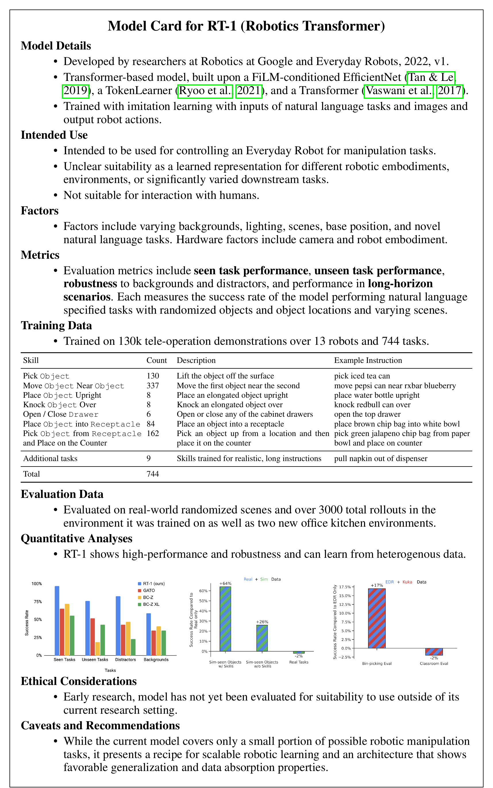

**Original caption:** Figure 7: Model Card for RT-1.

**中文图注:** 图 7：RT-1 的模型卡。

**Reading note:** 模型卡是原文对"适用范围"的正式声明，其中 **"Unclear suitability as a learned representation for different robotic embodiments, environments, or significantly varied downstream tasks"** 与 **"Not suitable for interaction with humans"** 两条，是引用 RT-1 时最容易被忽略的限制；§6.3 展示的跨机器人迁移能力与该声明之间存在张力，值得对照阅读。

**Source:** p.21 S061

**Original:** Model Details — • Developed by researchers at Robotics at Google and Everyday Robots, 2022, v1. • Transformer-based model, built upon a FiLM-conditioned EfficientNet (Tan & Le, 2019), a TokenLearner (Ryoo et al., 2021), and a Transformer (Vaswani et al., 2017). • Trained with imitation learning with inputs of natural language tasks and images and output robot actions.

**中文:** **模型详情** —— • 由 Robotics at Google 与 Everyday Robots 的研究人员开发，2022 年，v1。• 基于 Transformer 的模型，构建在一个经 FiLM 条件化的 EfficientNet（Tan & Le, 2019）、一个 TokenLearner（Ryoo et al., 2021）和一个 Transformer（Vaswani et al., 2017）之上。• 以模仿学习训练，输入为自然语言任务与图像，输出为机器人动作。

**Source:** p.21 S062

**Original:** Intended Use — • Intended to be used for controlling an Everyday Robot for manipulation tasks. • Unclear suitability as a learned representation for different robotic embodiments, environments, or significantly varied downstream tasks. • Not suitable for interaction with humans.

**中文:** **预期用途** —— • 预期用于控制 Everyday Robot 执行操作任务。• 作为面向不同机器人形态、不同环境或差异显著的下游任务的学习表示，其适用性尚不明确。• 不适合与人类交互。

**Source:** p.21 S063

**Original:** Factors — • Factors include varying backgrounds, lighting, scenes, base position, and novel natural language tasks. Hardware factors include camera and robot embodiment.

**中文:** **影响因素** —— • 因素包括不同的背景、光照、场景、底盘位置，以及全新的自然语言任务。硬件因素包括相机与机器人形态。

**Source:** p.21 S064

**Original:** Metrics — • Evaluation metrics include seen task performance, unseen task performance, robustness to backgrounds and distractors, and performance in long-horizon scenarios. Each measures the success rate of the model performing natural language specified tasks with randomized objects and object locations and varying scenes.

**中文:** **指标** —— • 评测指标包括已见任务性能、未见任务性能、对背景与干扰物的鲁棒性，以及长时程场景下的性能。每一项衡量的都是模型在物体与物体位置随机化、场景各异的条件下执行自然语言指定任务的成功率。

**Source:** p.21 S065

**Original:** Training Data — • Trained on 130k tele-operation demonstrations over 13 robots and 744 tasks. [随后为技能表：Skill / Count / Description / Example Instruction —— Pick Object 130; Move Object Near Object 337; Place Object Upright 8; Knock Object Over 8; Open / Close Drawer 6; Place Object into Receptacle 84; Pick Object from Receptacle and Place on the Counter 162; Additional tasks 9; Total 744]

**中文:** **训练数据** —— • 在 13 台机器人、744 个任务上的 130k 条遥操作示范上训练。[随后为技能表：技能 / 数量 / 描述 / 示例指令 —— 抓取物体 130；把物体移动到另一物体旁 337；竖直放置物体 8；推倒物体 8；开/关抽屉 6；把物体放入容器 84；从容器中取出物体并放到台面 162；附加任务 9；合计 744]

> 注：模型卡中的技能表与正文表 1 基本一致，两处差异为：(1) 模型卡把 "Open Drawer 3" 与 "Close Drawer 3" 合并为 "Open / Close Drawer 6"；(2) 模型卡的 "Additional tasks 9" 对应正文表 1 的 "Section 6.3 and 6.4 tasks 9"。合计均为 744。

**Source:** p.21 S066

**Original:** Evaluation Data — • Evaluated on real-world randomized scenes and over 3000 total rollouts in the environment it was trained on as well as two new office kitchen environments.

**中文:** **评测数据** —— • 在真实世界的随机化场景中、共 3000 多次 rollout 上评测，覆盖其训练环境以及两个新的办公室厨房环境。

**Source:** p.21 S067

**Original:** Quantitative Analyses — • RT-1 shows high-performance and robustness and can learn from heterogenous data.

**中文:** **定量分析** —— • RT-1 表现出高性能与鲁棒性，并且能够从异构数据中学习。

**Source:** p.21 S068

**Original:** Ethical Considerations — • Early research, model has not yet been evaluated for suitability to use outside of its current research setting.

**中文:** **伦理考量** —— • 属于早期研究，尚未评估该模型在其当前研究环境之外使用的适用性。

**Source:** p.21 S069

**Original:** Caveats and Recommendations — • While the current model covers only a small portion of possible robotic manipulation tasks, it presents a recipe for scalable robotic learning and an architecture that shows favorable generalization and data absorption properties.

**中文:** **注意事项与建议** —— • 尽管当前模型只覆盖了可能的机器人操作任务中的一小部分，它提供了一条可扩展机器人学习的方法路径，以及一个展现出良好泛化与数据吸收特性的架构。

## 附录 C：模型与数据（p.20–p.23）

### C M ODEL AND D ATA｜模型与数据

#### C.1 M ODEL INFERENCE｜模型推理

**Source:** p.20 S070

**Original:** In addition to the inference speed requirement, we need to ensure that our system outputs actions at a consistent frequency, avoiding jitter. To accomplish this, we introduce a fixed-time waiting mechanism that waits a certain amount of time (280ms, the max observed latency of all components) after the state, that was used to compute the next action, has been captured, but before applying the action, similarly to the procedure described by Xiao et al. (2020).

**中文:** 除了推理速度要求之外，我们还需要确保系统以稳定的频率输出动作，避免抖动。为此我们引入了一个固定时长等待机制：在用于计算下一个动作的状态被采集之后、动作被施加之前，等待一段固定时间（280 ms，即所有组件中观测到的最大延迟），这与 Xiao et al. (2020) 描述的过程类似。

#### C.2 D ATA COLLECTION AT SCALE｜大规模数据采集

**Source:** p.20 S071

**Original:** Each of the robots autonomously approaches its station at the beginning of the episode and communicates to the operator the instruction that they should demonstrate to the robot. To ensure a balanced dataset as well as randomization of the scene, we created a software module responsible for sampling the instructions to be demonstrated as well as the randomization of the background configuration. Each of the robots tells the demonstrator how to randomize the scene and which instruction to demonstrate. Demonstrations are collected with direct line-of-sight between operator and robot using 2 virtual reality remotes. We map remote controls onto our policy action space to preserve consistency of the transition-dynamics. 3D position and rotational displacements of the remote are mapped to 6d displacements of the robot tool. The x, y position of the joystick is mapped to a turning angle and driving distance of the mobile base. We compute and track trajectories to the target poses that we obtain from the joystick commands.

**中文:** 每个回合一开始时，各机器人会自主移动到自己的工作台，并把"操作员应当向它演示哪条指令"告知操作员。为确保数据集均衡以及场景随机化，我们实现了一个软件模块，负责采样待演示的指令以及背景配置的随机化。每台机器人会告诉示教者如何随机化场景、以及演示哪条指令。示范由操作员在能与机器人保持直接视线的条件下、使用两个虚拟现实手柄采集。我们把手柄的控制映射到策略的动作空间上，以保持转移动力学的一致性。手柄的 3D 位置与旋转位移被映射为机器人工具的 6 维位移；摇杆的 x、y 位置被映射为移动底盘的转向角与行驶距离。我们计算并跟踪到达由摇杆命令得到的目标位姿的轨迹。

#### C.3 M ODEL S ELECTION AT S CALE｜规模化条件下的模型选择

**Source:** p.22 S072

**Original:** As robot learning systems become more capable and the number of instructions they can handle increases, evaluation of these models becomes difficult (Kalashnikov et al., 2021a; Jang et al., 2021). This is an important consideration not only for evaluating different model classes and data distributions during the development process, but also for selecting the most performant model checkpoints for a particular training run. While there have been a number of proposed solutions to this problem (Dudík et al., 2011; Irpan et al., 2019; Hanna et al., 2017), mostly known in the offline reinforcement learning literature as "off-policy evaluation", it still remains an open research challenge to evaluate multi-task robot learning systems at scale.

**中文:** 随着机器人学习系统能力增强、可处理的指令数量增加，这类模型的评测变得困难（Kalashnikov et al., 2021a; Jang et al., 2021）。这不仅在开发过程中评估不同模型类别与数据分布时是一个重要考量，在选择某次训练中最优性能的模型检查点时同样重要。针对这一问题已有若干解决方案（Dudík et al., 2011; Irpan et al., 2019; Hanna et al., 2017），在离线强化学习文献中多被称为"离策略评估"（off-policy evaluation），但大规模评测多任务机器人学习系统仍是一个开放的研究挑战。

**Source:** p.22 S073

**Original:** In this work, we propose leveraging simulation for "real to sim" transfer as a scalable tool that provides an approximate estimate of model performance during training across many real tasks. We run policies trained from real data in a simulator to test the full rollout performance. Note that all of our training data comes from the real world (except the experiment in Section 6.3), and the simulator is used only for model selection. To accomplish this, we expand the simulation environment proposed by Lee et al. (2022b) to support 551 of the tasks described in Section 5.2. For each of these tasks, we define a set of scene setup randomizations, robot pose randomizations, and success detection criteria. To bridge the visual distribution shift between the real world and the simulation, we train a RetinaGAN (Ho et al., 2020) model that transforms simulated images into realistic looking images. Then, we deploy policies trained on real data directly into these simulation environments by applying RetinaGAN visual transformations at each timestep and measuring rollout simulated task success rates.

**中文:** 在本工作中，我们提出把仿真用于"真实到仿真"（real-to-sim）迁移，作为一项可扩展的工具，在训练期间为大量真实任务上的模型性能提供近似估计。我们把由真实数据训练得到的策略放进仿真器运行，以测试完整的 rollout 表现。注意：我们全部训练数据都来自真实世界（§6.3 的实验除外），仿真器仅用于模型选择。为此，我们扩展了 Lee et al. (2022b) 提出的仿真环境，使其支持 §5.2 所述 551 个任务。对其中每个任务，我们定义一组场景设置随机化、机器人位姿随机化以及成功判定标准。为弥合真实世界与仿真之间的视觉分布偏移，我们训练了一个 RetinaGAN（Ho et al., 2020）模型，把仿真图像转换为外观逼真的图像。随后，我们把在真实数据上训练的策略直接部署到这些仿真环境中——在每个时间步施加 RetinaGAN 视觉变换，并测量 rollout 的仿真任务成功率。

**Source:** p.22 S074

**Original:** While models trained only on real world data perform better in the real world than they do in simulation, we find that the simulation success rates of high-performing real world policies are higher than the simulation success rates of low-performing real world policies. In other words, the ordering of simulation policy success rates are informative for predicting the ordering of real world policy success rates. We note that in this real-to-sim evaluation setting, we have a less strict requirement for simulation accuracy compared to sim-to-real settings; as long as simulation success rates are directionally correlated with real success rates, we can accept a moderate or even high gap between real and simulation success rates.

**中文:** 尽管仅在真实世界数据上训练的模型在真实世界中的表现优于其在仿真中的表现，我们发现：真实世界性能高的策略，其仿真成功率也高于真实世界性能低的策略。换言之，仿真中策略成功率的大小顺序，对于预测真实世界策略成功率的大小顺序是有信息量的。我们指出，在这种"真实到仿真"的评测设定中，对仿真精度的要求不如"仿真到真实"（sim-to-real）设定严格：只要仿真成功率与真实成功率在方向上相关，我们就能接受真实与仿真成功率之间存在中等甚至较大的差距。

**Source:** p.22 S075

**Original:** We present example camera images from simulation as well as their RetinaGAN-based transformations in Fig. 8.

**中文:** 我们在图 8 中给出仿真相机图像的示例，以及它们经 RetinaGAN 变换后的结果。

### Fig. 8｜仿真图像与 RetinaGAN 变换示例

**Placed near:** p.22 S075（首次被引用于此段）
**Source:** p.22 C015

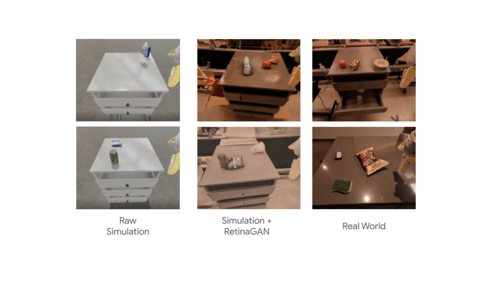

**Original caption:** Figure 8: Example camera images showcasing raw simulation, simulation with RetinaGAN applied, and the real world.

**中文图注:** 图 8：相机图像示例，分别展示原始仿真、应用 RetinaGAN 后的仿真，以及真实世界。

**Reading note:** 这是 C.3 中"真实到仿真"评测可行性的视觉前提：只有当变换后的仿真图像与真实图像的视觉分布足够接近，仿真成功率的大小顺序才可能对真实性能有预测力。注意作者强调的弱假设——只需要**顺序相关**，不需要绝对数值匹配。

#### C.4 D ATA COLLECTION PROCESS｜数据采集流程

**Source:** p.23 S076

**Original:** Figure 9 shows the growth of data, number of tasks, and the success rate of the policy over time. The number of tasks/instructions that our system is capable of grows over time as more data is collected. The same is true with the performance of seen tasks. One of the important aspects of the future work is develop techniques that allow us to grow the data as well as the robots performance and general capabilities at a faster rate.

**中文:** 图 9 展示了数据量、任务数量以及策略成功率随时间增长的情况。随着采集到更多数据，系统能处理的任务/指令数量随时间增长，已见任务的性能同样如此。未来工作的一个重要方面，是开发能让数据规模、机器人性能与通用能力以更快速度增长的技术。

### Fig. 9｜数据、任务数与已见指令性能随时间的增长

**Placed near:** p.23 S076（首次被引用于此段）
**Source:** p.23 C016

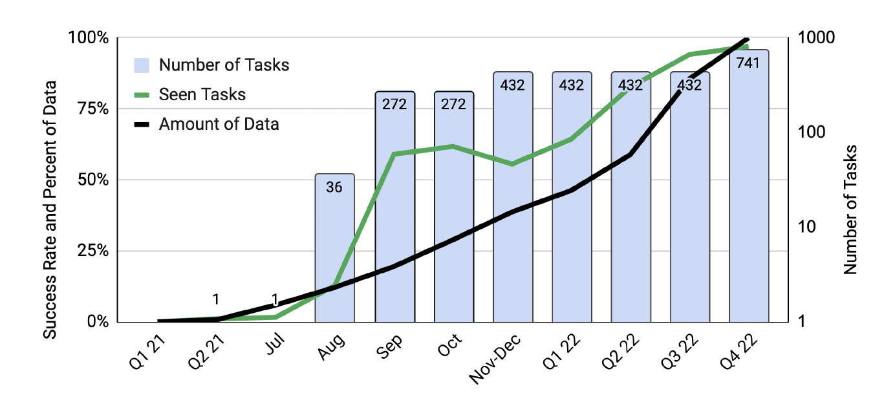

**Original caption:** Figure 9: The growth of data, number of tasks, and seen instruction performance over time.

**中文图注:** 图 9：数据量、任务数量与已见指令性能随时间的变化。

**Reading note:** 这张图是理解全文数据策略的关键：任务数与性能是随数据不断追加而**同步增长**的，因此 §6.5 的"数据多样性"结论应理解为"在持续追加数据的过程中，应优先扩任务广度"。

## 附录 D：实验（p.23–p.31）

### D E XPERIMENTS｜实验

#### D.1 E VALUATION D ETAILS｜评测细节

**Source:** p.23 S077

**Original:** In Section 6.2, we study the zero-shot generalization capabilities of RT-1 to difficult scenarios not present in the training dataset. To fairly evaluate different ablations of RT-1 as well as baseline policies, we design standardized evaluation procedures that cover a range of incremental difficulty levels.

**中文:** 在 §6.2 中，我们研究 RT-1 对训练数据集中不存在的困难场景的零样本泛化能力。为公平评测 RT-1 的不同消融版本以及基线策略，我们设计了覆盖一系列递进难度等级的标准化评测流程。

**Source:** p.23 S078

**Original:** Seen tasks. We evaluate on 744 tasks present in the training dataset. The breakdown between 12 skills is shown in Table 1. For all "Seen" evaluations, we use the same classroom setting used for data collection as described in Section 5.2. For each policy, we report a single representative metric that takes a skill-weighted average across individual skill evaluations.

**中文:** **已见任务。** 我们在训练数据集中存在的 744 个任务上评测，12 类技能之间的分布见表 1。对于所有"已见"评测，我们使用 §5.2 所述、与数据采集相同的教室环境。对每个策略，我们报告一个代表性指标，即各单项技能评测的技能加权平均。

**Source:** p.23 S079

**Original:** Unseen tasks. We evaluate policy performance on 53 tasks that are held out during training. While the unseen instructions' specific combinations of skills and objects are not seen during training, other combinations of the same skills and objects are present in the training set. We evaluate these unseen tasks in the same environment and the same randomization procedure as the Seen tasks. A full list of these unseen tasks is shown in Table 8.

**中文:** **未见任务。** 我们在训练期间被留出的 53 个任务上评测策略性能。虽然这些未见指令中"技能与物体"的具体组合在训练中未出现过，但同样的技能与物体以其他组合形式存在于训练集中。我们在与已见任务相同的环境和相同的随机化流程下评测这些未见任务。这些未见任务的完整清单见表 8。

> 注：本节明确给出留出任务为 **53 个**，与 §6.2 正文中"21 条未见指令"的表述不一致；表 8 的清单为 53 条，可据此判断 §6.2 的 21 条应为笔误或指某一子集。

### Table 8｜§6.2 中使用的未见指令清单

**Placed near:** p.23 S079（首次被引用于此段）
**Source:** p.25 C017

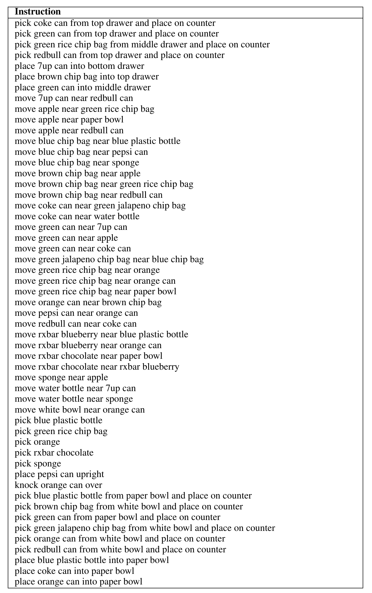

**Original caption:** Table 8: List of Unseen Instructions in Sec. 6.2. For the "Unseen Tasks" evaluation, we exclude a total of 53 tasks during training. While these exact instructions were not present in the training set, the objects and skills contained in these instructions were still present in the training set.

**中文图注:** 表 8：§6.2 中的未见指令清单。在"未见任务"评测中，我们在训练时共排除 53 个任务。这些确切指令虽未出现在训练集中，但指令所包含的物体与技能仍存在于训练集中。

**Transcription（53 条，按原表顺序）:**

1. pick coke can from top drawer and place on counter
2. pick green can from top drawer and place on counter
3. pick green rice chip bag from middle drawer and place on counter
4. pick redbull can from top drawer and place on counter
5. place 7up can into bottom drawer
6. place brown chip bag into top drawer
7. place green can into middle drawer
8. move 7up can near redbull can
9. move apple near green rice chip bag
10. move apple near paper bowl
11. move apple near redbull can
12. move blue chip bag near blue plastic bottle
13. move blue chip bag near pepsi can
14. move blue chip bag near sponge
15. move brown chip bag near apple
16. move brown chip bag near green rice chip bag
17. move brown chip bag near redbull can
18. move coke can near green jalapeno chip bag
19. move coke can near water bottle
20. move green can near 7up can
21. move green can near apple
22. move green can near coke can
23. move green jalapeno chip bag near blue chip bag
24. move green rice chip bag near orange
25. move green rice chip bag near orange can
26. move green rice chip bag near paper bowl
27. move orange can near brown chip bag
28. move pepsi can near orange can
29. move redbull can near coke can
30. move rxbar blueberry near blue plastic bottle
31. move rxbar blueberry near orange can
32. move rxbar chocolate near paper bowl
33. move rxbar chocolate near rxbar blueberry
34. move sponge near apple
35. move water bottle near 7up can
36. move water bottle near sponge
37. move white bowl near orange can
38. pick blue plastic bottle
39. pick green rice chip bag
40. pick orange
41. pick rxbar chocolate
42. pick sponge
43. place pepsi can upright
44. knock orange can over
45. pick blue plastic bottle from paper bowl and place on counter
46. pick brown chip bag from white bowl and place on counter
47. pick green can from paper bowl and place on counter
48. pick green jalapeno chip bag from white bowl and place on counter
49. pick orange can from white bowl and place on counter
50. pick redbull can from white bowl and place on counter
51. place blue plastic bottle into paper bowl
52. place coke can into paper bowl
53. place orange can into paper bowl

**Reading note:** 这份清单可以看成一张"组合泛化考卷"：53 条中 30 条是 "move X near Y" 形式，即检验模型能否把已见的抓取/移动技能与新的 物体对 组合起来；另有 6 条 "从容器取出并放到台面"、3 条 "放入容器" 检验容器类空间关系。若某类组合的系统性失败率偏高，通常指向"物体-空间关系绑定不足"而非"技能缺失"。

**Source:** p.23 S080

**Original:** Distractor robustness. We test three tasks ("pick coke can", "place coke can upright", "move coke can near green rice chip bag") with incrementally more distractor objects added to the scene. The easy setting includes 0, 2, or 5 distractor objects. The medium setting includes 9 distractor objects, but the coke can is never obscured. The hard setting includes 9 distractor objects, but the scene is more crowded and the coke can is partially occluded. Both the medium are hard setting are more difficult than scenarios in the training dataset, which contained between 0 and 4 distractors. Examples of these difficulty settings and policy evaluation rollouts are shown in Figure 12.

**中文:** **干扰物鲁棒性。** 我们测试三个任务（"pick coke can"、"place coke can upright"、"move coke can near green rice chip bag"），并在场景中逐步增加干扰物体。简单设置包含 0、2 或 5 个干扰物。中等设置包含 9 个干扰物，但可乐罐从不被遮挡。困难设置包含 9 个干扰物，且场景更拥挤、可乐罐被部分遮挡。中等到困难设置都比训练数据集中的场景更难——训练数据中只有 0 到 4 个干扰物。这些难度设置与策略评测 rollout 的示例见图 12。

> 注：原文 "Both the medium are hard setting are more difficult" 为笔误，应为 "Both the medium and hard setting are more difficult"。

### Fig. 12｜"干扰物"评测：简单 / 中等 / 困难

**Placed near:** p.23 S080（首次被引用于此段）
**Source:** p.26 C020

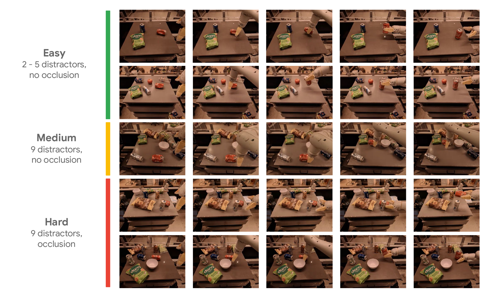

**Original caption:** Figure 12: "Distractors" evaluations focus on diversifying initial scene configurations well beyond the distributions contained in the training dataset, which contain between 2 and 4 distractor objects. In the most challenging scenarios, the scene is extremely cluttered and contains occlusions for the objects of interest. （图内标签：Easy — 2-5 distractors, no occlusion；Medium — 9 distractors, no occlusion；Hard — 9 distractors, occlusion）

**中文图注:** 图 12："干扰物"评测侧重于让初始场景配置的多样性远超训练数据集中的分布——训练数据中通常含 2 到 4 个干扰物体。在最困难的情形中，场景极为杂乱，且感兴趣物体会被遮挡。（图内标签：Easy —— 2–5 个干扰物、无遮挡；Medium —— 9 个干扰物、无遮挡；Hard —— 9 个干扰物、有遮挡）

**Reading note:** 三档逐步引入"拥挤度"与"遮挡"两个变量。表 2/表 13 中 RT-1 在干扰物列的 Easy/Medium 都拿到 100，只在 Hard 掉到 64，这说明其失败主要来自**目标被遮挡**，而不是场景中物体数量多本身。

**Source:** p.23–p.24 S081

**Original:** Background robustness. We test six tasks ("pick coke can", "move blue chip bag near orange", "knock redbull can over", "pick green jalapeno chip bag", "move sponge near brown chip bag","place redbull can upright") with incrementally more challenging backgrounds and counter textures. In the easy setting, we utilize the same background environments and counter textures as the training dataset. In the medium setting, we utilize the same background environment but add a patterned tablecloth to change the counter texture. In the hard setting, we utilize a brand new kitchen environment with a new countertop; this changes the counter texture, drawer material and color, and background visuals. Examples of these difficulty settings and policy evaluation rollouts are shown in Figure 10.

**中文:** **背景鲁棒性。** 我们测试六个任务（"pick coke can"、"move blue chip bag near orange"、"knock redbull can over"、"pick green jalapeno chip bag"、"move sponge near brown chip bag"、"place redbull can upright"），背景与台面纹理的挑战性逐步提高。在简单设置中，我们使用与训练数据集相同的背景环境和台面纹理。在中等设置中，我们使用相同的背景环境，但加上带图案的桌布以改变台面纹理。在困难设置中，我们使用一个全新的厨房环境与新的台面，这会改变台面纹理、抽屉材质与颜色，以及背景视觉。这些难度设置与策略评测 rollout 的示例见图 10。

### Fig. 10｜"背景"评测：从相同背景到全新厨房

**Placed near:** p.24 S081（首次被引用于此段）
**Source:** p.24 C018

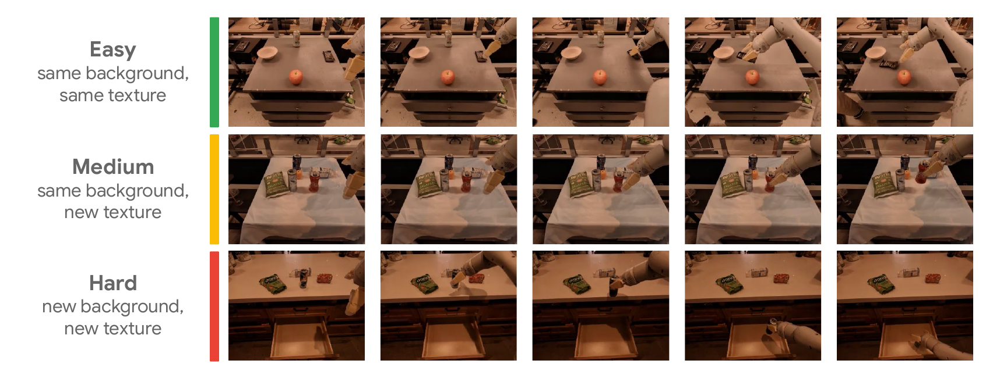

**Original caption:** Figure 10: "Backgrounds" evaluations focus on testing the performance of RT-1 on settings with different table textures and different backgrounds, such as those found in kitchens never trained on. These visual differences are quite pronounced, which in the most challenging case entails a new kitchen with different counter texture, different lighting conditions, different counter material, and a different background. （图内标签：Easy — same background, same texture；Medium — same background, new texture；Hard — new background, new texture）

**中文图注:** 图 10："背景"评测侧重于测试 RT-1 在具有不同台面纹理与不同背景（例如从未训练过的厨房）的设置下的性能。这些视觉差异相当显著：在最困难的情形中，新厨房的台面纹理、光照条件、台面材质与背景都不同。（图内标签：Easy —— 相同背景、相同纹理；Medium —— 相同背景、新纹理；Hard —— 新背景、新纹理）

**Reading note:** 三档的变量控制得很清楚：Easy 只改物体摆放，Medium 只改台面纹理，Hard 同时改站台材质/抽屉颜色/光照/背景。因此"Hard 掉点"可以归因于**多个视觉因素同时变化**，而不是单一纹理敏感。

**Source:** p.24 S082

**Original:** Realistic instructions. To study how RT-1 performs in more realistic scenarios, we propose an evaluation setting in a real office kitchen that is a dramatic shift from the original training classroom environment. We propose a variety of skills that combine aspects of the previous zero-shot evaluations, including adding new distractors, including new backgrounds, and new combinations of objects with skills. We refer to the easiest scenario as L1 generalization, which introduces a new countertop and lighting condition but keeps the skills and objects the same. Next, L2 generalization additionally adds novel distractor objects such as kitchen jar containers. Finally, L3 generalization adds new objects or new locations such as near a sink. While some of these distribution shifts are tested in Section 6.2, these realistic instructions aim to test multiple dimensions simultaneously. Examples of these instructions are presented in Fig. 11.

**中文:** **真实指令。** 为研究 RT-1 在更真实场景中的表现，我们提出一个在真实办公室厨房中的评测设置，它与原本的训练教室环境差异显著。我们设计了一组技能，把此前零样本评测的多个方面组合起来，包括加入新的干扰物、新的背景，以及物体与技能的新组合。我们把最简单的场景称为 L1 泛化：引入新的台面和光照条件，但技能与物体保持不变。其次，L2 泛化额外加入新的干扰物体，例如厨房用的罐子容器。最后，L3 泛化再加入新物体或新位置，例如水槽附近。虽然其中部分分布偏移已在 §6.2 中测试过，这些真实指令的目标是**同时**测试多个维度。这些指令的示例见图 11。

### Fig. 11｜"真实指令"评测：L1 / L2 / L3 递进式分布偏移

**Placed near:** p.24 S082（首次被引用于此段）
**Source:** p.24 C019

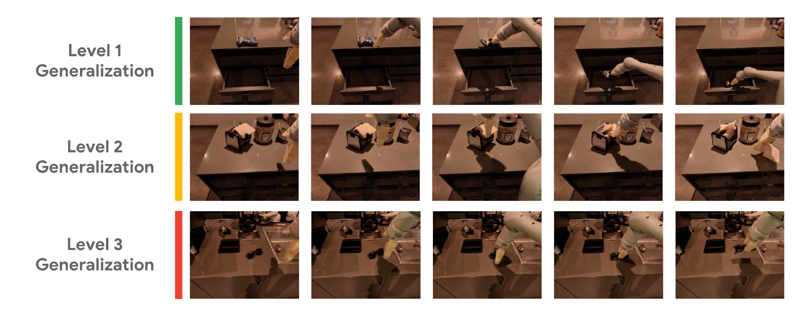

**Original caption:** Figure 11: "Realistic instructions" evaluations propose realistic scenarios multiple distribution shifts that incrementally increase in difficulty. L1 generalization introduces a new real office kitchen with new lighting conditions. L2 generalization additionally adds unseen distractor objects. Finally, L3 generalization includes new objects or objects in new locations, such as next to a sink.

**中文图注:** 图 11："真实指令"评测提出若干真实场景，其中叠加了多种难度递增的分布偏移。L1 泛化引入一个全新的真实办公室厨房与新的光照条件。L2 泛化在此基础上额外加入未见过的干扰物体。最后，L3 泛化进一步包含新物体，或位于新位置（例如水槽旁）的物体。

**Reading note:** 这张图与表 3 的四列一一对应，是理解"多维度叠加会把成功率打到什么程度"的最直观材料：L1 只换环境（RT-1 88），L2 换环境 + 加干扰物（75），L3 再加新物体/新位置（50）。

#### D.2 H ETEROGENEOUS D ATA｜异构数据

**Source:** p.24 S083

**Original:** We also explore the limits of RT-1 for utilizing highly heterogeneous data. We demonstrate how RT-1 can incorporate and learn from vastly different data sources and improve from such data without sacrificing its original-tasks performance across the varied tasks inherent in this data. To this end, we conduct two experiments: (1) RT-1 trained and tested on both real data and simulation data and (2) RT-1 trained across large datasets of different tasks, originally collected by different robots.

**中文:** 我们还探索 RT-1 在利用高度异构数据方面的极限，展示 RT-1 如何纳入并学习来自差异极大的数据源，并在从这些数据中受益的同时，不牺牲其在这类数据固有的各种任务上的原有性能。为此我们做了两个实验：(1) RT-1 同时在真实数据与仿真数据上训练与测试；(2) RT-1 在由不同机器人采集的、覆盖不同任务的大型数据集上训练。

> 注：本段与正文 §6.3 开头（p.10–p.11 S043）内容基本重复，附录版本未包含"More information on each is provided in Appendix D.2."一句。

**Source:** p.26 S084

**Original:** Absorbing simulation data. Table 9 shows the ability of RT-1, and baselines, to absorb both real and simulation data. To test this, we take all of the real demonstration data but we also provide additional simulation data that includes objects that the robot has never seen in the real world. We add a set of sim objects and only show them on a subset of tasks, specifically the picking tasks, in simulation. To accomplish this, we run our real2sim method described in Sec. C.3 to bootstrap a simulation policy from the real world policy that is then trained with multi-task RL (Kalashnikov et al., 2021a) with additional objects in simulation. From this process, we extract 518k successful trajectories of picking new objects and mix them with the real data that was used in the previous experiments. The goal of this experiment is to demonstrate that by expanding the dataset of simulation trajectories, we can benefit RT-1's generalization capabilities without sacrificing the original training performance – a desired property of an absorbent model.

**中文:** **吸收仿真数据。** 表 9 展示了 RT-1（及基线）吸收真实数据与仿真数据的能力。为测试这一点，我们使用全部真实示范数据，同时额外提供仿真数据，其中包含机器人在真实世界中从未见过的物体。我们加入一组仿真物体，并只在仿真中的一部分任务（具体来说是抓取任务）上展示它们。为此，我们运行 §C.3 所述的 real2sim 方法，从真实世界策略引导（bootstrap）出一个仿真策略，再用多任务强化学习（Kalashnikov et al., 2021a）在含额外物体的仿真中训练它。通过这一过程，我们抽取出 518k 条抓取新物体的成功轨迹，并与前文实验所用的真实数据混合。该实验的目标是证明：通过扩展仿真轨迹数据集，我们可以在不牺牲原有训练性能的前提下提升 RT-1 的泛化能力——这正是"可吸收模型"所期望具备的性质。

**Source:** p.26 S085

**Original:** To evaluate the properties of this model, we specify different generalization scenarios: for seen skills with real objects the training data has real data of that instruction (i.e., performance on seen tasks), for seen skills with sim objects the training data has sim data of that instruction (e.g. "pick up a sim object", which was present in sim), and for unseen skills with sim objects the training data has sim data of that object but there are no examples of the instruction describing the skill with that object either in sim or in real (e.g., "move a sim object to apple", even though the robot has only practiced in picking that sim object and not moving it near other objects). All evaluations are done in the real world but to limit the number of instructions evaluated, we focus on pick and move-to skills.

**中文:** 为评估该模型的性质，我们设定了几种泛化场景：对于"已见技能 + 真实物体"，训练数据中含有该指令的真实数据（即已见任务性能）；对于"已见技能 + 仿真物体"，训练数据中含有该指令的仿真数据（例如 "pick up a sim object"，该指令存在于仿真中）；对于"未见技能 + 仿真物体"，训练数据中含有该物体的仿真数据，但无论仿真还是真实数据中都不存在把该技能与该物体组合起来的指令示例（例如 "move a sim object to apple"，尽管机器人只练习过抓取该仿真物体、并未练习过把它移动到其他物体旁）。所有评测都在真实世界中完成；为限制评测指令数量，我们聚焦于抓取（pick）与移到近旁（move-to）两类技能。

**Source:** p.26 S086

**Original:** We find in Table 9 that for RT-1, we do not lose performance adding simulation data compared to the Real Only dataset. We do however, see a significant increase in performance (from 23% to 87%) on objects and tasks seen only in simulation, to approximately the performance of the those in real, demonstrating an impressive degree of domain transfer. We also see a significant increase in performance on unseen instructions from 7% to 33%; impressive given the object in question has never been seen in real and the instruction never seen at all. Overall, we find that RT-1 is able to efficiently "sponge up" new data, even from a very different domain.

**中文:** 从表 9 可以看到，对 RT-1 而言，相比仅在真实数据上训练，加入仿真数据并没有损失性能。而在仅在仿真中出现过的物体与任务上，我们观察到显著的性能提升（从 23% 到 87%），大致达到与真实物体相当的水平，体现出可观的域迁移程度。我们还看到在未见指令上的性能显著提升，从 7% 到 33%；考虑到该物体在真实世界中从未出现过、该指令也完全未出现过，这一结果相当亮眼。总体而言，RT-1 能够高效地"吸收"新数据，即使这些数据来自一个差异很大的领域。

### Table 9｜引入仿真数据的实验结果（与 Table 4 同表）

**Placed near:** p.26 S084/S086（附录版本，正文首次引用见 p.11 S044）
**Source:** p.27 C021

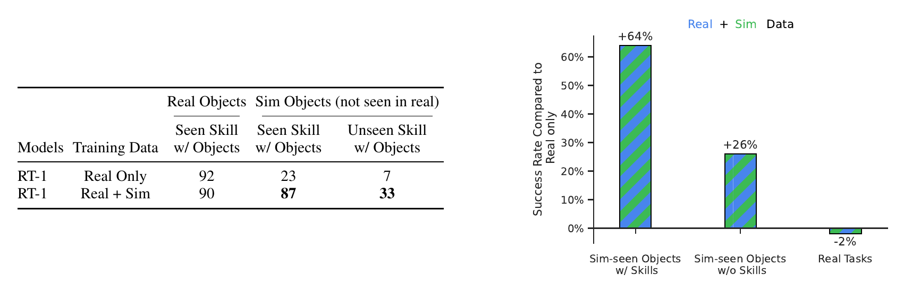

**Original caption:** Table 9: Experimental results for incorporating simulation data in RT-1. Adding simulation data does not impact the performance on real objects, while significantly improving real performance on objects that were only introduced in simulation.

**中文图注:** 表 9：RT-1 引入仿真数据的实验结果。加入仿真数据不影响在真实物体上的性能，同时显著提升在"仅在仿真中出现过的物体"上的真实世界性能。

> 本表与正文 **Table 4**（p.12）为同一张表、同样数值（92 / 90(-2)；23 / 87(+64)；7 / 33(+26)），差别仅在附录版图注更短。数值与解读请回看 [Table 4](#T004) 区块。

**Source:** p.27 S087

**Original:** Absorbing data from different robots. To push the data absorption limits of RT-1, we conduct an additional set of experiments where we combine two data sources that originate from different robots: Kuka IIWA as well as the Everyday Robots mobile manipulators used in the experiments so far. The Kuka data contains all the successful examples collected in QT-Opt (Kalashnikov et al., 2018), which corresponds to 209k episodes, where the robot was indiscriminately grasping objects in a bin (see an example of a Kuka episode in Table. 10). Our goal in this experiment is to analyze whether the performance on the RT-1 tasks drops when adding the additional data and, more importantly, whether we can observe any transfer from data collected by a different robot morphology.

**中文:** **吸收来自不同机器人的数据。** 为进一步推进 RT-1 的数据吸收极限，我们做了另一组实验：把来自两种不同机器人的数据源混合起来——Kuka IIWA，以及前文实验中使用的 Everyday Robots 移动操作机器人。Kuka 数据包含 QT-Opt（Kalashnikov et al., 2018）中采集的全部成功样本，对应 209k 个回合；在那项工作中，机器人不加区分地抓取料箱中的物体（Kuka 回合示例见表 10）。本实验的目标是分析：加入额外数据后 RT-1 任务上的性能是否下降；更重要的是，能否观察到来自不同机器人形态所采集数据的任何迁移。

**Source:** p.27 S088

**Original:** We would like to emphasize the difficulty of this setting by noting the major differences between the datasets. Not only are the robots that collected the data different in appearance and action space, but also the environment they were deployed in has different appearance and dynamics. In addition the QT-Opt data presents a completely different action distribution – it was collected by an RL agent as opposed to human demonstrations present in our dataset.

**中文:** 我们想通过指出两个数据集之间的重大差异，来强调该设定之困难。不仅采集数据的机器人在外观与动作空间上不同，它们所部署的环境在外观与动力学上也不同。此外，QT-Opt 数据呈现的是完全不同的动作分布——它由一个强化学习智能体采集，而我们数据集中是人类的示范。

**Source:** p.27 S089

**Original:** To mix the Kuka data together with the RT-1 data, we first transform the original Kuka 4-DOF action space into the same action space as RT-1, namely we set the roll and pitch to 0, while keeping the yaw values that were present in the original Kuka data. In addition, we transform the binary gripper-close command into a continuous gripper-closedness command that is present in the RT-1 data. We also need text instructions corresponding to the task performed and since the Kuka data does not contain the name of the object that was grasped, we relabel all the data to the "pick anything" instruction. With these modifications, we mix both datasets with the 2:1 (RT-1 data : Kuka data) ratio and train RT-1 to obtain the final model.

**中文:** 为把 Kuka 数据与 RT-1 数据混合起来，我们先把原始的 Kuka 4 自由度动作空间变换到与 RT-1 相同的动作空间：即把 roll 与 pitch 置为 0，同时保留原始 Kuka 数据中的 yaw 值。此外，我们把二值的"夹爪闭合"命令转换为 RT-1 数据中使用的连续"夹爪闭合程度"命令。我们还需要与所执行任务对应的文本指令；由于 Kuka 数据不含被抓取物体的名称，我们把全部数据重新标注为 "pick anything"（抓取任意物体）指令。经过这些修改后，我们以 2:1 的比例（RT-1 数据 : Kuka 数据）混合两个数据集，训练 RT-1 得到最终模型。

**Source:** p.27 S090

**Original:** To test whether RT-1 can effectively absorb these two very different datasets, we evaluate the performance on the original RT-1 tasks (in this case, we also focus on "pick" and "move to" skills), which we refer to as the standard "Classroom eval", as well as the performance on the newly constructed tasks that reflect the bin-picking setup present in the Kuka data, which we refer to as the "Bin-picking eval". For the Bin-picking eval to be close to the original dataset, we put in the same looking bin for the objects as well as modify the robot to be similar to the Kuka manipulators by adding extra wires and coloring the gripper gray. For all of the evaluations we use the Everyday Robots robot with the picking commands and evaluate it based on 72 grasping trials.

**中文:** 为测试 RT-1 能否有效吸收这两个差异极大的数据集，我们评测其在原有 RT-1 任务上的性能（在此我们也聚焦 "pick" 与 "move to" 技能），称之为标准的 "Classroom eval"；同时评测其在反映 Kuka 数据中料箱抓取设置的新构造任务上的性能，称之为 "Bin-picking eval"。为了让 Bin-picking eval 接近原始数据集，我们放入外观相同的料箱，并通过增加额外线缆、把夹爪涂成灰色来把机器人改装得更像 Kuka 机械臂。所有评测都使用 Everyday Robots 机器人以抓取指令进行，基于 72 次抓取试验来评估。

**Source:** p.27–p.28 S091

**Original:** The results are presented in Table 10. We observe that the model that mixes the RT-1 data and the Kuka data has only a minimal decrease in the original tasks' performance (i.e. Classroom eval), i.e. 2%. Even more importantly, in the Bin-picking eval, we observe that the model trained on multi-robot data performs at 39% compared to the 22% of the model that was trained only on the RT-1 data. This is a 17% performance difference (almost 2x). Additionally, RT-1 trained on Kuka bin-picking data and evaluated on the bin-picking tasks with the Everyday Robots (EDR) robot achieves 0% performance, confirming that it is difficult to transfer a behavior from another robot morphology. However, mixing the data from both robots allows RT-1 to infer the correct actions of the EDR robot even when faced with the states observed by Kuka robots. This is achieved without explicit demonstrations of bin-picking on EDR robot and by taking advantage of past experiences collected by Kuka robots. These results indicate that RT-1's absorption properties also include the ability to acquire new skills through observing other robots' experiences and present an exciting avenue of future work where we combine many more multi-robot datasets to enhance the robot capabilities.

**中文:** 结果见表 10。我们观察到，混合 RT-1 数据与 Kuka 数据的模型在原有任务（即 Classroom eval）上的性能仅有极小下降，为 2%。更重要的是，在 Bin-picking eval 上，用多机器人数据训练的模型达到 39%，而仅在 RT-1 数据上训练的模型只有 22%。这是 17 个百分点的差距（接近 2 倍）。此外，仅在 Kuka 料箱抓取数据上训练、再在 Everyday Robots（EDR）机器人上评测料箱抓取任务时，RT-1 的性能为 0%，这证实了把行为从一个机器人形态迁移到另一个形态是困难的。然而，混合两个机器人的数据后，即使面对 Kuka 机器人所观测到的状态，RT-1 也能推断出 EDR 机器人的正确动作。这一点是在没有 EDR 机器人上料箱抓取的显式示范的条件下、通过利用 Kuka 机器人收集的过往经验实现的。这些结果表明，RT-1 的吸收能力还包括"通过观察其他机器人的经验来获得新技能"，并为未来工作指出了一条令人兴奋的方向：把更多多机器人数据集结合起来以增强机器人能力。

### Table 10｜混合两个机器人的数据（与 Table 5 同表）

**Placed near:** p.28 S091（附录版本，正文首次引用见 p.13 S048）
**Source:** p.28 C022

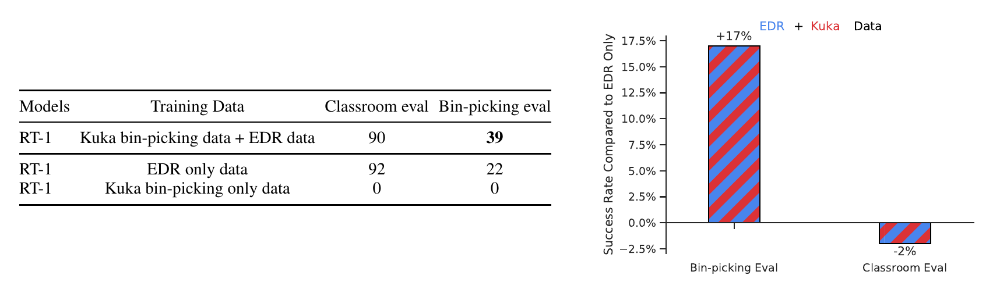

**Original caption:** Table 10: Experimental results for mixing data from two different robots. Incorporating Kuka bin-picking data from QT-Opt (Kalashnikov et al., 2018) in RT-1 minimally impacts the standard classroom evaluation performance and results in almost a 2x improvement in generalization to the Bin-picking evaluation (that is similar to the setup in the Kuka data) on the Everyday Robots manipulator. This demonstrates an effective transfer across two different robot morphologies.

**中文图注:** 表 10：混合两个不同机器人数据的实验结果。把 QT-Opt（Kalashnikov et al., 2018）的 Kuka 料箱抓取数据引入 RT-1，对标准教室评测性能的影响极小，并使 Everyday Robots 操作机器人在 Bin-picking 评测（与 Kuka 数据中的设置相似）上的泛化几乎提升到原来的 2 倍。这表明在两个不同机器人形态之间实现了有效迁移。

> 本表与正文 **Table 5**（p.13）为同一张表。差别在于附录版 Classroom eval 一列为 "90"（正文版为 "90(-2)"），Bin-picking eval 一列为 "39"（正文版为 "39(+17)"）——即附录版省略了括号内的相对变化量，数值本身一致。详见 [Table 5](#T005)。

#### D.3 L ONG-HORIZON E VALUATION D ETAILS｜长时程评测细节

**Source:** p.28 S092

**Original:** In addition to short-horizon individual skill evaluations shown in previous sections, we also evaluate how RT-1 performs in a long-horizon realistic kitchen setting that chains multiple manipulation and navigation skills to accomplish natural language instructions within the SayCan framework (Ahn et al., 2022). A list of long-horizon instructions used for these evaluations is listed in Table 12. The success rate of long-horizon tasks decreases exponentially with the length of the task, so high success rates in manipulation skills are particularly important. Furthermore, as mobile manipulation tasks require both navigation and manipulation, the policies ability to be robust to base position is crucial. Since SayCan combines many low-level instructions to perform high-level instructions, the number of possible high-level instructions increases combinatorially with instructions, so the skill-breadth of RT-1 can be fully seen.

**中文:** 除前几节展示的短时程单项技能评测之外，我们还评测 RT-1 在真实长时程厨房场景中的表现：在 SayCan 框架（Ahn et al., 2022）内，把多种操作与导航技能串联起来完成自然语言指令。这些评测所用的长时程指令清单见表 12。长时程任务的成功率随任务长度指数下降，因此操作技能的高成功率尤为重要。此外，移动操作任务既需要导航也需要操作，策略对底盘位置的鲁棒性至关重要。由于 SayCan 把许多低层指令组合起来完成高层指令，可能的高层指令数量随指令数量呈组合式增长，因此 RT-1 的技能广度能够被充分体现。

### Table 12｜§6.4 中评测的 SayCan 指令清单

**Placed near:** p.28 S092（首次被引用于此段）
**Source:** p.30 C023

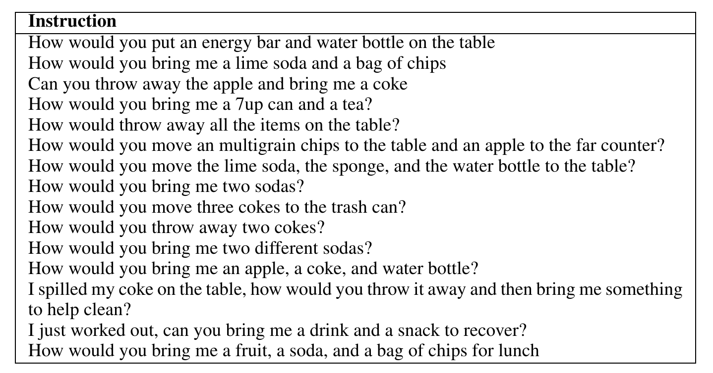

**Original caption:** Table 12: List of SayCan instructions evaluated in Sec. 6.4

**中文图注:** 表 12：§6.4 中评测的 SayCan 指令清单。

**Transcription（15 条，按原表顺序）:**

1. How would you put an energy bar and water bottle on the table
2. How would you bring me a lime soda and a bag of chips
3. Can you throw away the apple and bring me a coke
4. How would you bring me a 7up can and a tea?
5. How would throw away all the items on the table?
6. How would you move an multigrain chips to the table and an apple to the far counter?
7. How would you move the lime soda, the sponge, and the water bottle to the table?
8. How would you bring me two sodas?
9. How would you move three cokes to the trash can?
10. How would you throw away two cokes?
11. How would you bring me two different sodas?
12. How would you bring me an apple, a coke, and water bottle?
13. I spilled my coke on the table, how would you throw it away and then bring me something to help clean?
14. I just worked out, can you bring me a drink and a snack to recover?
15. How would you bring me a fruit, a soda, and a bag of chips for lunch

> 中文大意（仅辅助理解，便于对照）：1) 你会怎样把能量棒和水瓶放到桌上；2) 你会怎样给我拿一听青柠汽水和一袋薯片；3) 你能把苹果扔掉再给我拿一听可乐吗；4) 你会怎样给我拿一听 7up 和一杯茶；5) 你会怎样把桌上所有东西都扔掉；6) 你会怎样把一袋杂粮薯片移到桌上、把苹果移到远处台面；7) 你会怎样把青柠汽水、海绵和水瓶移到桌上；8) 你会怎样给我拿两听汽水；9) 你会怎样把三听可乐移到垃圾桶；10) 你会怎样扔掉两听可乐；11) 你会怎样给我拿两听不同的汽水；12) 你会怎样给我拿一个苹果、一听可乐和一个水瓶；13) 我把可乐洒在桌上了，你会怎样把它清理掉、再给我拿点东西来擦干净；14) 我刚运动完，你能给我拿点喝的和小食恢复一下吗；15) 你会怎样给我拿一份水果、一听汽水和一袋薯片当午餐。

**Reading note:** 这 15 条指令的措辞刻意贴近日常请求（含"我洒了可乐""我刚运动完"这类上下文），是 SayCan 通过语言模型做任务分解的输入。评测的关键在于分解出的 **subgoal 序列**能否被底层策略（RT-1 / Gato / BC-Z）逐条执行，因此同一条高层指令在不同底层策略下的"规划成功率"可以相同（都是 87%），但"执行成功率"差别很大。

**Source:** p.28 S093

**Original:** SayCan works by grounding language models in robotic affordances and it leverages few-shot prompting to break down a long horizon task expressed in natural language to a sequence of low level skills. An example of long horizon task would be "Bring me two different sodas", and one feasible plan would be "1. find a coke, 2. pick up the coke, 3. bring it to you, 4. put down the coke, 5. find a pepsi, 6. pick up the pepsi, 7. bring it to you, 8. put down the pepsi, 9. done." To obtain the affordance function we use value functions trained with MT-OPT (Kalashnikov et al., 2021a). For a detailed description of SayCan algorithm please refer to (Ahn et al., 2022).

**中文:** SayCan 的做法是把语言模型"锚定"在机器人的可供性（affordance）上，并利用少样本提示把一个用自然语言表述的长时程任务拆解为一系列低层技能。一个长时程任务的例子是 "Bring me two different sodas"（给我拿两听不同的汽水），一个可行的计划是："1. 找到一听可乐，2. 拿起可乐，3. 把它带给你，4. 放下可乐，5. 找到一听百事，6. 拿起百事，7. 把它带给你，8. 放下百事，9. 完成。" 为得到可供性函数，我们使用经 MT-OPT（Kalashnikov et al., 2021a）训练的价值函数。SayCan 算法的详细描述请参见 (Ahn et al., 2022)。

**Source:** p.28 S094

**Original:** Since the focus of this paper is acquisition of many generalizable skills, we focus our evaluation on one subset of tasks presented in Ahn et al. (2022). It is the long-horizon family of tasks, involving 15 instructions, each instruction requires an average of 9.6 steps to complete, and involves an average of 2.4 manipulation skills per instruction. A full list of the instructions can be found in Table 12. We compare against 3 baselines. 1) SayCan with BC-Z, which uses SayCan planning algorithm with BC-Z as manipulation policy, 2) SayCan with Gato, which uses SayCan planning algorithm with Gato as manipulation policy, 3) Originally reported SayCan results, which use SayCan planning algorithm with BC-Z, but since it uses a slightly different prompt, the planning success rate is lower. We reimplemented 3) in 1) for a fair comparison.

**中文:** 由于本文的重点是获得大量可泛化的技能，我们的评测聚焦于 Ahn et al. (2022) 中提出的一类任务子集，即长时程任务族：包含 15 条指令，每条指令平均需要 9.6 个步骤才能完成，每条指令平均涉及 2.4 项操作技能。指令的完整清单见表 12。我们与 3 个基线比较：1) SayCan + BC-Z，即用 SayCan 规划算法、以 BC-Z 作为操作策略；2) SayCan + Gato，即用 SayCan 规划算法、以 Gato 作为操作策略；3) 原始报告中给出的 SayCan 结果，它使用 SayCan 规划算法与 BC-Z，但由于使用了略有不同的提示词，规划成功率较低。为公平比较，我们已在 1) 中重新实现了 3)。

**Source:** p.28–p.29 S095

**Original:** As shown in Table 11, except for original SayCan, all methods get 87% as planning success rate, and RT-1 performs the best, with 67% execution success rate in Kitchen1. Kitchen2 constitutes a much more challenging generalization scene, since the Robot Classroom training scenes are modeled after Kitchen1 (see the pictures of the kitchens in Fig. 2). Due to this generalization difficulty, SayCan with Gato is not able to finish any long horizon task, and SayCan with BC-Z is able to achieve a success rate of 13%. The original SayCan paper did not evaluate performance in a new kitchen. Surprisingly, the manipulation performance does not see a visible drop from Kitchen1 to Kitchen2 for our method.

**中文:** 如表 11 所示，除原始 SayCan 之外，所有方法的规划成功率都是 87%，其中 RT-1 表现最好：在 Kitchen1 中执行成功率为 67%。Kitchen2 是更具挑战性的泛化场景，因为机器人教室的训练场景是照 Kitchen1 搭建的（见厨房照片，图 2）。由于这一泛化难度，SayCan + Gato 无法完成任何长时程任务，SayCan + BC-Z 的成功率为 13%。原始 SayCan 论文并未在新厨房中评测性能。令人意外的是，我们的方法从 Kitchen1 到 Kitchen2 在操作性能上并未出现可见的下降。

### Table 11｜Kitchen1 与 Kitchen2 中的 SayCan 长时程任务（与 Table 6 同表）

**Placed near:** p.29 S095（附录版本，正文首次引用见 p.14 S050）
**Source:** p.29 C024

**Original caption:** Table 11: SayCan style long horizon tasks in Kitchen1 and Kitchen2. (*Original SayCan eval uses a slightly different prompt so the planning success rate is lower.)

**中文图注:** 表 11：Kitchen1 与 Kitchen2 中 SayCan 风格的长时程任务。（*原始 SayCan 评测使用了略有不同的提示词，因此规划成功率较低。）

> 本表与正文 **Table 6**（p.14）为同一张表，数值完全一致。详见 [Table 6](#T006)。

**Source:** p.29 S096

**Original:** In the supplementary video, we show that this enables us to operate unseen drawers in Kitchen2, and that we can use SayCan-RT1 to plan and execute ultra-long horizon tasks, with as many as 50 steps.

**中文:** 在补充视频中，我们展示了这使我们能够在 Kitchen2 中操作未见过的抽屉，并且可以用 SayCan-RT1 规划并执行超长时程任务，最多可达 50 个步骤。

#### D.4 M ODEL A BLATIONS｜模型消融

**Source:** p.29 S097

**Original:** What are the important and practical decisions in the design of the model and how do they affect performance and generalization? To answer this question, we perform a set of ablations over different design decisions in RT-1. We aim to test a number of hypotheses that will help us disambiguate where the benefits of our method come from. Possible hypotheses about the source of improvement include: (i) the capacity and expressiveness of our model, which we verify by ablating the model size, trying other architectures (e.g., by removing the Transformer component); (ii) the particular action representation, which makes it easy to represent complex multi-modal action distributions, which we test by switching to continuous (normally distributed) actions, as well as by ablating the auto-regressive action representation; (iii) the ImageNet pre-trained initialization of the components, which we test by initializing the model's weights randomly; and (iv) access to the short history, which we test by excluding observation history. More concretely, we ablate our model by (1) decreasing the model size (from 35M to 21M parameters), (2) removing the Transformer architecture (using a pre-trained EfficientNet instead), (3) using a continuous instead of discrete action space (using an MSE loss and multivariate normal output), (4) auto-regressively conditioning on actions, (5) removing ImageNet pre-training of the FiLM EfficientNet, and (6) removing history (reducing the sequence of six images as input to a single image). For each ablation we compare on the axes of performance on seen tasks, performance on unseen tasks, as well as inference speed and robustness to distractors and backgrounds (with a more detailed description of each category in Section 6.1 and Appendix D.1).

**中文:** 模型设计中有哪些重要且实际的决定，它们又如何影响性能与泛化？为回答这一问题，我们对 RT-1 的不同设计决定做了一组消融。我们试图检验若干假设，以厘清我们方法的好处究竟来自哪里。关于改进来源的可能假设包括：(i) 模型的容量与表达能力——我们通过消融模型规模、尝试其他架构（例如去掉 Transformer 组件）来验证；(ii) 特定的动作表示方式，它使表示复杂的多模态动作分布变得容易——我们通过切换到连续（正态分布）动作、以及消融自回归动作表示来检验；(iii) 各组件的 ImageNet 预训练初始化——我们通过随机初始化模型权重来检验；(iv) 对短历史的访问——我们通过去掉观测历史来检验。更具体地说，我们通过以下方式消融模型：(1) 减小模型规模（从 35M 参数降到 21M）；(2) 去掉 Transformer 架构（改用预训练 EfficientNet）；(3) 用连续动作空间替代离散动作空间（使用 MSE 损失与多元正态输出）；(4) 自回归地以动作为条件；(5) 去掉 FiLM EfficientNet 的 ImageNet 预训练；(6) 去掉历史（把 6 张图像输入序列缩减为单张图像）。对每种消融，我们在已见任务性能、未见任务性能、推理速度，以及对干扰物与背景的鲁棒性这些维度上进行比较（各类别的更详细说明见 §6.1 与附录 D.1）。

**Source:** p.29 S098

**Original:** Table 13 shows the results of each ablation and the delta performance compared to the full RT-1. RT-1 achieves impressive performance on tasks and new environments, and particularly outperforms baselines on the most challenging robustness problems. We also find that each design decision is important, though at varying levels. We first evaluate a model that replaces the per-dimension discretized action representation in our model with a more standard continuous Gaussian distribution. We observe a significant decline in performance from this modification. The per-dimension discretization allows our model to represent complex multi-modal distributions, while the Gaussian distribution captures only a single mode. These results suggest that this standard and popular choice is highly suboptimal with the more complex and diverse demonstration data used by our system. ImageNet pre-training is particularly important for model generalization and robustness, decreasing the unseen task performance rate by 33%, as a result of the large and diverse visuals of the ImageNet dataset. Adding history has an impact primarily on generalization to distractors, while removing the Transformer component has a uniform but small negative impact across the seen tasks, unseen tasks and distractors. In order to keep the ImageNet pre-training while reducing the model size, we reduce the number of parameters only by 40% (from 31M to 25M). Resulting performance drops across training and generalization tasks but not as much as in other ablations. Finally, autoregressively conditioning on actions, as used in (Reed et al., 2022; Chen et al., 2021; Lee et al., 2022a), did not benefit performance and slowed inference by more than 2x.

**中文:** 表 13 给出每种消融的结果，以及相对于完整 RT-1 的性能变化量。RT-1 在任务与新环境上取得了令人印象深刻的性能，尤其在最具挑战性的鲁棒性问题上优于基线。我们还发现每个设计决定都重要，只是程度不同。我们首先评测一个把逐维离散动作表示替换为更标准的连续高斯分布的模型：我们观察到性能显著下降。逐维离散化使模型能够表示复杂的多模态分布，而高斯分布只能刻画单一模态。这些结果表明，在更复杂、更多样的示范数据下，这一标准且流行的选择是高度次优的。ImageNet 预训练对模型的泛化与鲁棒性尤其重要，它使未见任务性能下降 33%，这源于 ImageNet 数据集大而多样的视觉内容。加入历史的影响主要体现在对干扰物的泛化上；而去掉 Transformer 组件则在已见任务、未见任务和干扰物上都带来一致但较小的负面影响。为了在保留 ImageNet 预训练的同时减小模型规模，我们只把参数量减少 40%（从 31M 到 25M），由此在训练与泛化任务上都有性能下降，但没有其他消融那么严重。最后，像 (Reed et al., 2022; Chen et al., 2021; Lee et al., 2022a) 那样自回归地以动作为条件，并未带来性能收益，反而使推理慢了一倍以上。

### Table 13｜RT-1 的模型消融

**Placed near:** p.29 S098（首次被引用于此段）
**Source:** p.30 C025

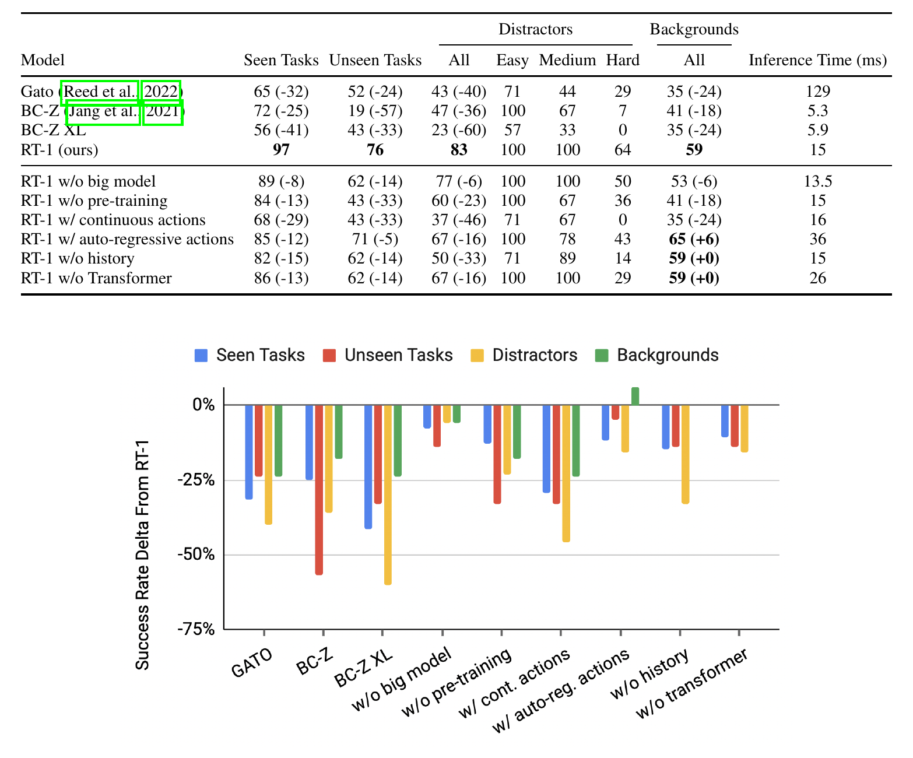

**Original caption:** Table 13: Various model ablations of RT-1 across seen tasks, generalization to unseen tasks, and robustness to distractors and backgrounds.

**中文图注:** 表 13：RT-1 的多种模型消融，涵盖已见任务、对未见任务的泛化，以及对干扰物与背景的鲁棒性。

| Model                           | Seen Tasks   | Unseen Tasks | Distractors (All) | Easy | Medium | Hard | Backgrounds (All) | Inference Time (ms) |
| ------------------------------- | ------------ | ------------ | ----------------- | ---- | ------ | ---- | ----------------- | ------------------- |
| Gato (Reed et al., 2022)        | 65 (-32)     | 52 (-24)     | 43 (-40)          | 71   | 44     | 29   | 35 (-24)          | 129                 |
| BC-Z (Jang et al., 2021)        | 72 (-25)     | 19 (-57)     | 47 (-36)          | 100  | 67     | 7    | 41 (-18)          | 5.3                 |
| BC-Z XL                         | 56 (-41)     | 43 (-33)     | 23 (-60)          | 57   | 33     | 0    | 35 (-24)          | 5.9                 |
| **RT-1 (ours)**           | **97** | **76** | **83**      | 100  | 100    | 64   | **59**      | 15                  |
| RT-1 w/o big model              | 89 (-8)      | 62 (-14)     | 77 (-6)           | 100  | 100    | 50   | 53 (-6)           | 13.5                |
| RT-1 w/o pre-training           | 84 (-13)     | 43 (-33)     | 60 (-23)          | 100  | 67     | 36   | 41 (-18)          | 15                  |
| RT-1 w/ continuous actions      | 68 (-29)     | 43 (-33)     | 37 (-46)          | 71   | 67     | 0    | 35 (-24)          | 16                  |
| RT-1 w/ auto-regressive actions | 85 (-12)     | 71 (-5)      | 67 (-16)          | 100  | 78     | 43   | 65 (+6)           | 36                  |
| RT-1 w/o history                | 82 (-15)     | 62 (-14)     | 50 (-33)          | 71   | 89     | 14   | 59 (+0)           | 15                  |
| RT-1 w/o Transformer            | 86 (-13)     | 62 (-14)     | 67 (-16)          | 100  | 100    | 29   | 59 (+0)           | 26                  |

> 原表中 "Distractors" 与 "Backgrounds" 为两个大列，Distractors 下含 Easy / Medium / Hard 三个子列，Backgrounds 下含 All 一个子列；"Inference Time (ms)" 为最后一列。括号内为该行相对 RT-1 的变化量（如 "-32" 表示低 32 个百分点），完整 RT-1 行不带括号。

**Reading note:** 四条最值得记的结论：

1. **连续动作（已见 -29、未见 -33、干扰物 -46）** 是伤害最大的一项，困难干扰物档位直接归零（0），与"逐维离散化能表达多模态动作分布、高斯只表达单模态"的解释一致。
2. **去掉预训练** 让未见任务掉 33 个百分点（76→43），说明泛化能力有相当一部分继承自 ImageNet 的视觉先验。
3. **去掉历史** 主要伤害干扰物鲁棒性（83→50，其中 Hard 档 64→14），即遮挡场景最依赖时序信息。
4. **自回归动作** 让推理从 15 ms 翻倍到 36 ms，而性能不升反降（83→67），因此最终版本弃用；相反，**去掉 Transformer** 只带来一致但较小的负面影响（已见 -13、未见 -14），代价是推理反而更慢（26 ms）。

**Source:** p.30 S099

**Original:** As described in Sec. 5.1, in order to run large Transformer models on real robots, we require a model that supports fast inference for real-time operation. Note that in order to achieve our target control rate of 3Hz (described in Sec. 5.1), we also need to consider other sources of latency in the pipeline, such as the camera latency and communication overhead. However, these factors will be constant for all the models, and therefore we focus our evaluation on just the network inference time. The last column of Table 13 shows the inference speed of all the models. RT-1 is almost an order of magnitude faster than Gato with a similar number of parameters, but it is also considerably slower than a ResNet-based BC-Z. In terms of the different ablations of our model, we observe that the biggest slow-down is caused by including auto-regressive actions (∼2x slow-down), and since this does not significantly influence the performance, the final version of RT-1 does not generate actions auto-regressively.

**中文:** 如 §5.1 所述，为了在真实机器人上运行大型 Transformer 模型，我们需要模型支持快速推理以实现实时运行。注意，要达到我们 3 Hz 的目标控制频率（见 §5.1），还必须考虑流水线中的其他延迟来源，例如相机延迟与通信开销。不过这些因素对所有模型都是恒定的，因此我们把评测聚焦在网络推理时间上。表 13 最后一列给出所有模型的推理速度。在参数量相近的情况下，RT-1 比 Gato 快将近一个数量级，但也明显慢于基于 ResNet 的 BC-Z。就我们模型的不同消融而言，最大的减速来自引入自回归动作（约 2 倍减速）；由于这并未显著影响性能，RT-1 的最终版本不采用自回归方式生成动作。

#### D.5 S UMMARY AND A NALYSIS｜总结与分析

**Source:** p.31 S100

**Original:** In this section, we summarize some of our findings and propose intuition for RT-1's high performance, generalization, and robustness. First, ImageNet pretraining (along with Universal Sentence Encoder language embedding) has a large impact particularly on unseen tasks. We observe that RT-1 inherits some of the knowledge that results from the generality and diversity of the datasets these models were trained on. Second, continuous actions have a large impact across all aspects of performance. This has been previously observed and may be due to the ability to represent more complex action distributions – the per-dimension discretization allows our model to represent complex multi-modal distributions, while the Gaussian distribution captures only a single mode. Third, given such expressive multitask models, data diversity has a larger impact than data size. Indeed, even datasets collected in simulated environments or from different robotic embodiments can be leveraged by RT-1, opening avenues for new regimes of data collection.

**中文:** 本节我们总结若干发现，并对 RT-1 的高性能、泛化与鲁棒性给出直觉解释。第一，ImageNet 预训练（连同 Universal Sentence Encoder 的语言嵌入）影响很大，尤其体现在未见任务上。我们观察到，RT-1 继承了这些模型所训练数据集的通用性与多样性所带来的一部分知识。第二，连续动作对性能的各个方面都有很大影响。这一点此前已被观察到，原因可能是它对更复杂动作分布的表达能力——逐维离散化让我们的模型能够表示复杂的多模态分布，而高斯分布只能刻画出单一模态。第三，在这种表达力强的多任务模型下，数据多样性的影响大于数据规模。事实上，即使在仿真环境中采集的数据、或来自不同机器人形态的数据，也能被 RT-1 利用，这为新的数据采集范式开辟了道路。

> 注：本条原文写作 "Second, continuous actions have a large impact across all aspects of performance."，但其后解释（离散化表达多模态、高斯只表达单模态）以及表 13 的数值都指向"**连续动作带来明显的负面影响**"。此处按原文照译，语义上应理解为"连续动作（这一替换）对性能各方面影响很大（且为负面）"。

**Source:** p.31 S101

**Original:** Finally, RT-1 fuses language into the image pipeline early via FiLM conditioning, compared to e.g., Gato's late fusion. This enables image tokens that focus only on relevant features for the instruction at hand, which may be the cause of poor distractor performance for Gato. Figure 13 visualizes the attention during rollouts of RT-1. We see that the attention is focused on relevant features and particularly on interaction between the gripper and the object of interest. The bottleneck of attention layers such as these results in a compact representation which effectively ignores distractors and varying backgrounds.

**中文:** 最后，与例如 Gato 的"晚期融合"相比，RT-1 通过 FiLM 条件化把语言**早期**融入图像处理流水线。这使得图像 token 只聚焦于当前指令的相关特征，这可能正是 Gato 在干扰物上表现较差的原因。图 13 可视化了 RT-1 rollout 过程中的注意力。我们看到注意力集中在相关特征上，尤其集中在夹爪与目标物体之间的交互上。这类注意力层形成的瓶颈产生了紧凑表示，从而有效地忽略干扰物与变化的背景。

### Fig. 13｜RT-1 策略的注意力可视化

**Placed near:** p.31 S101（首次被引用于此段）
**Source:** p.31 C026

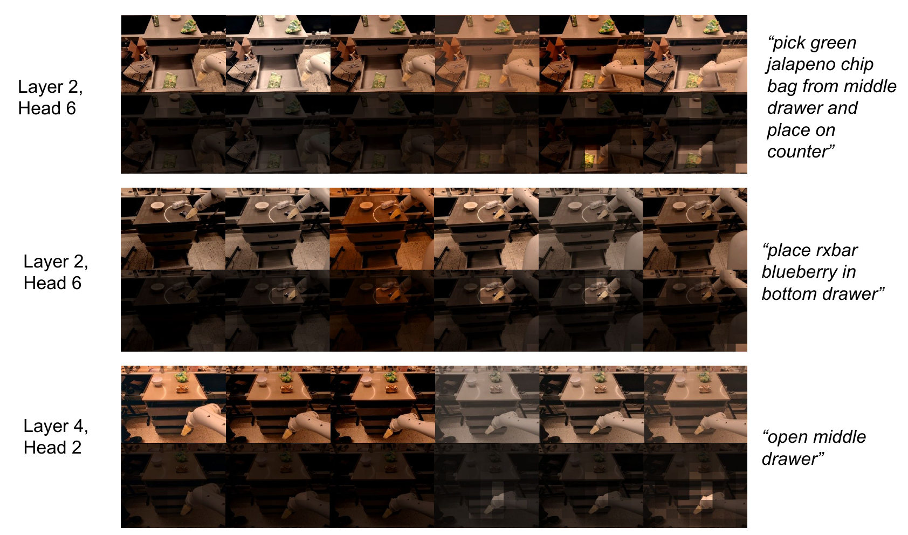

**Original caption:** Figure 13: In this figure we show the attention map of the RT-1 policy. Different layers and heads generally focus on different part of the image. Most commonly, they focus on the parts of the scene with the richest interaction affordances, such as graspable objets. For example, Layer 2 Head 6 focuses on the jalapeno chips and pepsi can in grasping tasks; and Layer 4 Head 2 focuses on the drawer in drawer opening tasks. （图中各行对应的指令与层/头：Layer 2, Head 6 — "pick green jalapeno chip bag from middle drawer and place on counter"；Layer 2, Head 6 — "place rxbar blueberry in bottom drawer"；Layer 4, Head 2 — "open middle drawer"）

**中文图注:** 图 13：本图展示 RT-1 策略的注意力图。不同层与不同的注意力头通常聚焦于图像的不同部位。最常见的情况是，它们聚焦于场景中交互可供性最丰富的部分，例如可抓取的物体。举例来说，Layer 2 Head 6 在抓取任务中聚焦于墨西哥辣椒味薯片与百事罐；Layer 4 Head 2 在开抽屉任务中聚焦于抽屉。（图中各行对应的指令与层/头：Layer 2, Head 6 —— "pick green jalapeno chip bag from middle drawer and place on counter"；Layer 2, Head 6 —— "place rxbar blueberry in bottom drawer"；Layer 4, Head 2 —— "open middle drawer"）

**Reading note:** 这张图是 §6.2/表 13 中"RT-1 在干扰物上明显强于 Gato"的机理解释：注意力热区落在"夹爪-目标物体"的交互区域，而非场景中数量占多数的干扰物。想验证这一解释，可与表 13 中 "RT-1 w/o history"（Hard 档 14）对照——去掉历史后，热区无法再覆盖交互过程的时序信息。

> 注：原文此处 "graspable objets" 为拼写错误，应为 "objects"。

## 术语表

| English                          | 中文                       | 备注（首次出现/说明）                 |
| -------------------------------- | -------------------------- | ------------------------------------- |
| Robotics Transformer (RT-1)      | 机器人 Transformer（RT-1） | 摘要；本文提出的模型类                |
| task-agnostic training           | 任务无关训练               | 摘要；与"开放式"共同构成核心主张      |
| open-ended                       | 开放式的                   | 摘要                                  |
| high-capacity architecture       | 高容量架构                 | 摘要                                  |
| generalist / general model       | 通用（机器人）模型         | 摘要                                  |
| visuomotor policy                | 视觉运动策略               | 相关工作语境                          |
| episode                          | 回合                       | §3                                   |
| demonstration                    | 示范                       | §3 / §5.2                           |
| behavioral cloning               | 行为克隆                   | §3                                   |
| tokenization / token             | token 化 / token           | §5.1（保留英文 token，不译为"词元"） |
| discretized action / action bins | 离散化动作 / 动作 bin      | §5.1；每维 256 个 bin                |
| FiLM conditioning                | FiLM 条件化                | §5.1；特征级线性调制                 |
| identity-initialized             | 恒等初始化                 | §5.1；把 FiLM 稠密层权重初始化为 0   |
| Universal Sentence Encoder (USE) | 通用句子编码器（USE）      | §5.1                                 |
| TokenLearner                     | TokenLearner               | §5.1（专有模块名，保留英文）         |
| decoder-only Transformer         | 仅解码器 Transformer       | §5.1                                 |
| spatial feature map              | 空间特征图                 | §5.1；9 × 9 × 512                  |
| causal masking                   | 因果掩码                   | §5.1                                 |
| categorical cross-entropy        | 类别式交叉熵               | §5.1                                 |
| closed-loop control              | 闭环控制                   | §4                                   |
| mobile manipulator               | 移动操作机器人             | §4                                   |
| base（robot）                    | 移动底盘                   | §4                                   |
| gripper                          | 夹爪                       | §4                                   |
| skill                            | 技能                       | §5.2；按动词分组                     |
| instruction                      | 指令                       | §5.2                                 |
| long-horizon task                | 长时程任务                 | §6.1                                 |
| seen / unseen task               | 已见 / 未见任务            | §6.1                                 |
| zero-shot generalization         | 零样本泛化                 | §1 / §6.1                           |
| distractor                       | 干扰物                     | §6.1                                 |
| occlusion                        | 遮挡                       | §6.1                                 |
| background robustness            | 背景鲁棒性                 | §6.1                                 |
| distribution shift               | 分布偏移                   | §6.2                                 |
| ablations                        | 消融（实验）               | §6 起                                |
| success rate                     | 成功率                     | 全文指标                              |
| generalization axes              | 泛化维度                   | §6.1                                 |
| data quantity / data diversity   | 数据数量 / 数据多样性      | §6.5                                 |
| heterogeneous data               | 异构数据                   | §6.3                                 |
| domain transfer                  | 域迁移                     | §6.3                                 |
| bin-picking                      | 料箱抓取                   | §6.3                                 |
| robot morphology                 | 机器人形态                 | §6.3                                 |
| RL agent                         | 强化学习智能体             | §6.3                                 |
| rollout                          | rollout（一次完整执行）    | §6 起；保留英文                      |
| affordance                       | 可供性                     | §6.4 / 附录 D.3                      |
| few-shot prompting               | 少样本提示                 | 附录 D.3                              |
| real-to-sim / sim-to-real        | 真实到仿真 / 仿真到真实    | 附录 C.3                              |
| off-policy evaluation            | 离策略评估                 | 附录 C.3                              |
| model checkpoint                 | 模型检查点（权重）         | 附录 C.3                              |
| tele-operation                   | 遥操作                     | 附录 C.2 / 模型卡                     |
| attention map / attention head   | 注意力图 / 注意力头        | 附录 D.5                              |
| jitter                           | 抖动                       | 附录 C.1                              |
| auto-regressive actions          | 自回归动作                 | 附录 D.4                              |
| multimodal action distribution   | 多模态动作分布             | 附录 D.4                              |

## 阅读提示（critical reading notes）

**1. 这份论文真正的主张是什么。** RT-1 的核心不是"某个新模块"，而是一个**系统级论证**：在机器人领域，把"任务无关的大规模数据 + 高容量但低延迟的架构 + 语言早期融合"三者组合起来，可以换来可测量的泛化与鲁棒性收益，而且这些收益在分布偏移越大时越明显（表 2 的干扰物/背景两列、表 3 的 L1→L3、表 6 的 Kitchen2）。作者也明确把数据集与任务集视为"我们系统的重要组成部分"（p.8 S032），因此**不要把这篇文章读成纯粹的架构论文**。

**2. 比较是"同数据、不同架构"。** 所有基线（Gato、BC-Z、BC-Z XL）都重训在同一份 RT-1 数据上（S032、S039）。作者自陈这一设置在"任务集/数据集"层面对基线有利，因此表 2 中的差距应理解为**架构与设计选择的差距**，而不是"我们的数据比别人多"。

**3. 三类指标的边界不要混用。** 已见任务（97%）反映的是"同一任务族内的真实变异"，未见任务（76%）反映的是"已见概念的新组合"，干扰物/背景/L1–L3 反映的是"视觉与场景分布偏移"。特别地，作者自己限定了泛化范围：**不能泛化到完全没见过的新运动**（S055），也就是说 76% 的未见任务成功率并不代表"理解任意新指令"。

**4. 全文最有价值的实验设计是 6.5。** 通过把"削数据量（任务数固定）"与"削任务数（数据量固定）"两个轴分开，作者给出了一个可直接指导工程决策的结论：**在预算有限时，任务/场景的广度优先于同一任务的重复样本数**。表 7 里"删 25% 任务"对干扰物鲁棒性的打击（83→42）尤其值得注意。

**5. 数据吸收能力的两个实证边界。** (a) 仿真数据可以让"只在仿真中见过的物体"在真实世界达到 87%（表 4/9），且不损失真实物体性能——但注意这是**视觉与物体层面**的迁移，任务仍是已见技能；(b) 跨机器人方面，只在 Kuka 数据上训练时 EDR 上的表现为 **0%**，只有混合数据才能达到 39%（表 5/10）——这说明"吸收"依赖混合训练，而非单方面的能力迁移。

**6. 值得留意的原文不一致与笔误**（阅读时不要被误导）：

- **未见任务数量**：§6.1 正文写 21 条（S036），而附录 D.1 与表 8 明确为 **53 条**（S079）。以表 8 清单为准。
- **§6.5 对连续动作的表述**：附录 D.5 称 "continuous actions have a large impact"（S100），但结合表 13 的数值与随后的解释，实际含义是"连续动作带来明显负面冲击"。
- **§5.1 与表 13 的模型规模口径**：正文提到 FiLM EfficientNet-B3 token 化器 16M + Transformer 19M（≈35M，S021/S023），而表 13 中"w/o big model"一支被描述为"从 31M 减到 25M"（S098）——两处统计口径不同（是否计入 TokenLearner 等其他部分），比较时需注意。
- 若干语法笔误（如 "from from the starting step"、"performs significantly drops"、"Both the medium are hard setting"、残句 "To test whether RT-1 can effectively absorb these two very different datasets, ... (see Fig. 6)."），已在对应区块加注。

**7. 复现与落地视角的三点提醒。** (a) 3 Hz / <100 ms 的实时预算决定了架构选择，`TokenLearner` 与"重叠窗口复用 token"分别贡献 2.4× 与 1.7× 加速（S027）；(b) 逐维离散化 + 交叉熵是**性能**选择（连续动作掉 29–46 个百分点），不是简化实现的选择；(c) 训练数据中的语言标注是按"动词 + 名词"模板化的 744 条指令，语言侧的多样性远小于数据侧的多样性，这也是"新指令泛化"的天花板来源之一。

## 图表清单（锚点索引）

| 编号             | 内容                                    | 源页 | 插入位置     |
| ---------------- | --------------------------------------- | ---- | ------------ |
| [Fig. 1](#F001)   | RT-1 架构、数据集与评测总览             | p.2  | S007 后      |
| [Fig. 2](#F002)   | 评测环境、机器人平台与物体集合          | p.5  | S014 后      |
| [Fig. 3](#F003)   | RT-1 架构图（图像与指令 token 化）      | p.6  | S018 后      |
| [Table 1](#T001)  | RT-1 采集的技能列表                     | p.7  | S029 后      |
| [Fig. 4](#F004)   | 鲁棒性与真实场景评测的配置              | p.9  | S037 后      |
| [Table 2](#T002)  | RT-1 与基线的整体性能                   | p.10 | S040 后      |
| [Fig. 5](#F005)   | RT-1 在多种指令下的评测轨迹示例         | p.11 | S040 后      |
| [Table 3](#T003)  | 真实厨房场景中的泛化等级对比            | p.11 | S042 后      |
| [Table 4](#T004)  | 引入仿真数据的实验结果                  | p.12 | S044 后      |
| [Fig. 6](#F006)   | 用一个模型跨两个机器人平台训练          | p.13 | S046 后      |
| [Table 5](#T005)  | 混合两个机器人的数据                    | p.13 | S048 后      |
| [Table 6](#T006)  | Kitchen1/Kitchen2 的 SayCan 长时程任务  | p.14 | S050 后      |
| [Table 7](#T007)  | RT-1 的数据消融                         | p.14 | S053 后      |
| [Fig. 7](#F007)   | RT-1 模型卡                             | p.21 | S060 后      |
| [Fig. 8](#F008)   | 仿真图像与 RetinaGAN 变换示例           | p.22 | S075 后      |
| [Fig. 9](#F009)   | 数据、任务数与性能随时间的增长          | p.23 | S076 后      |
| [Table 8](#T008)  | §6.2 中使用的未见指令清单（53 条）     | p.25 | S079 后      |
| [Fig. 10](#F010)  | "背景"评测：简单/中等/困难              | p.24 | S081 后      |
| [Fig. 11](#F011)  | "真实指令"评测：L1/L2/L3                | p.24 | S082 后      |
| [Fig. 12](#F012)  | "干扰物"评测：简单/中等/困难            | p.26 | S080 后      |
| [Table 9](#T009)  | 引入仿真数据的实验结果（同 Table 4）    | p.27 | S084/S086 后 |
| [Table 10](#T010) | 混合两个机器人的数据（同 Table 5）      | p.28 | S091 后      |
| [Table 11](#T011) | SayCan 长时程任务（同 Table 6）         | p.29 | S095 后      |
| [Table 12](#T012) | §6.4 中评测的 SayCan 指令清单（15 条） | p.30 | S092 后      |
| [Table 13](#T013) | RT-1 的模型消融                         | p.30 | S098 后      |
| [Fig. 13](#F013)  | RT-1 策略的注意力可视化                 | p.31 | S101 后      |
