# RT-2: Vision-Language-Action Models Transfer Web Knowledge to Robotic Control｜中英文对照全文阅读稿

> **来源：** `raw/2307.15818v1.pdf`（arXiv:2307.15818v1 [cs.RO]，2023-07-28，26 页，Preprint）
> **论文类型：** 方法／算法论文（视觉-语言-动作模型，端到端机器人控制）
> **阅读稿模式：** 段落级中英对照；图表按“首次实质性提及处”就近插入，并附原图注、中文图注与阅读提示；每个实质性区块都有稳定锚点（`S###` 正文、`F###` 图、`T###` 表）。
> **项目主页：** robotics-transformer2.github.io

## 论文信息

| 项目 | 内容 |
|---|---|
| 英文题名 | RT-2: Vision-Language-Action Models Transfer Web Knowledge to Robotic Control |
| 中文题名 | RT-2：视觉-语言-动作模型把网络知识迁移到机器人控制 |
| 作者 | Anthony Brohan, Noah Brown, Justice Carbajal, Yevgen Chebotar, Xi Chen, Krzysztof Choromanski, Tianli Ding, Danny Driess, Avinava Dubey, Chelsea Finn, Pete Florence, Chuyuan Fu, Montse Gonzalez Arenas, Keerthana Gopalakrishnan, Kehang Han, Karol Hausman, Alexander Herzog, Jasmine Hsu, Brian Ichter, Alex Irpan, Nikhil Joshi, Ryan Julian, Dmitry Kalashnikov, Yuheng Kuang, Isabel Leal, Lisa Lee, Tsang-Wei Edward Lee, Sergey Levine, Yao Lu, Henryk Michalewski, Igor Mordatch, Karl Pertsch, Kanishka Rao, Krista Reymann, Michael Ryoo, Grecia Salazar, Pannag Sanketi, Pierre Sermanet, Jaspiar Singh, Anikait Singh, Radu Soricut, Huong Tran, Vincent Vanhoucke, Quan Vuong, Ayzaan Wahid, Stefan Welker, Paul Wohlhart, Jialin Wu, Fei Xia, Ted Xiao, Peng Xu, Sichun Xu, Tianhe Yu, and Brianna Zitkovich（按姓氏字母序，贡献见附录 A） |
| 单位 | Google DeepMind |
| 通讯作者 | chebotar@google.com, tianheyu@google.com, karolhausman@google.com |
| 关键数据 | 6k 次真实机器人评测试验；最大 55B 参数模型；13 台机器人、17 个月采集的机器人示范数据 |

## 阅读说明

这份阅读稿按论文原有章节顺序推进，正文每个段落给出**英文原文**与**中文译文**配对，段落之间不做合并或摘要化处理。公式、模型名、数值与引用标记（如 `(Driess et al., 2023)`）在译文中保持原样，便于回查。

图与表按论文中的**首次实质性提及处**插入（文末“图表清单”给出全部图表的锚点索引）。每张图表都给出：原图注、中文图注、以及一条“阅读提示”；数值型表格另外附一份 Markdown 转录，便于检索。

几条使用建议：

1. **先读 4.1 与 4.2。** 4.1（本稿 S032–S036）给出“已见任务 + 三类泛化”的主结果；4.2（S037–S040）给出涌现能力的定义与定量评测。全文最重要的两个数字出现在表 4 与表 5。
2. **区分“泛化”与“涌现”。** 泛化指同一类能力在分布偏移下仍然工作（新物体／新背景／新环境）；涌现指能力本身来自网络知识而非机器人数据（例如把物体放到数字“3”附近）。作者在 S038 明确划定了边界：语义与视觉概念应当迁移，**物理运动不应当迁移**，这一点在 S048（局限）中被再次确认。
3. **不要混用成功率口径。** 表 4 的“已见任务”列与“未见”各列来自不同评测集（200+ 任务 vs 280+ 任务）；表 5 的涌现评测每条指令运行 5 次，与表 4 的运行次数不同。跨表比较只能看相对排序，不能直接相减。
4. **co-fine-tuning 是本文方法的核心。** 表 6 的三档训练方式（from scratch / fine-tuning / co-fine-tuning）才是支持“把网络数据与机器人数据一起微调”这一主张的证据；只读 4.1 的相对倍数会漏掉这个机制性结论。
5. **思维链实验是定性验证。** 4.4 节（S045–S046）中的思维链变体只用 PaLM-E 微调了“数百个梯度步”，作者给出的是定性观察（图 7、图 10），没有报告成功率数字，不要当作已量化的结论。
6. **原文笔误与排版现象（照录，不做静默修正）。** 例如 S036 的 “behaviors behaviors”、S040 的 “We' split”、S078 的 “quantiative evalution”、表 3 图注的 “evalutions”、表 2 图注的 “if shown in Figure 3”、表 1 图注中 “Ser-manet” 的断字，以及表 4 中 “RT-2-PaLM-E-12B 1” 的脚注上标（脚注正文在本稿 S091）。译文按原意处理，但保留这些现象的标注。
7. **模型规模口径。** “55B”指 PaLI-X 骨干规模；“5B”指 RT-2-PaLI-X-5B；RT-2-PaLM-E 固定为 12B。表 6 的消融只针对 PaLI-X 家族，因为 PaLM-E 的规模不可自由缩放（S042 说明了原因）。


## 页面索引

| PDF 页 | 区块锚点 | 本节内容 |
|---|---|---|
| p.1 | [S001](#S001)、[S002](#S002)、[S003](#S003) | 1. Introduction |
| p.2 | [S003](#S003)、[S004](#S004)、[F001](#F001) | 1. Introduction（本页含 Fig. 1） |
| p.3 | [S005](#S005)、[S006](#S006)、[S007](#S007)、[S008](#S008) | 1. Introduction / 2. Related Work |
| p.4 | [S008](#S008)、[S009](#S009)、[S010](#S010)、[S011](#S011)、[S012](#S012)、[S013](#S013) | 2. Related Work / 3. Vision-Language-Action Models / 3.1. Pre-Trained Vision-Language Models |
| p.5 | [S013](#S013)、[S014](#S014)、[S015](#S015)、[F002](#F002) | 3.1. Pre-Trained Vision-Language Models / 3.2. Robot-Action Fine-tuning（本页含 Fig. 2） |
| p.6 | [S015](#S015)、[S016](#S016)、[S017](#S017)、[S018](#S018)、[S019](#S019)、[S020](#S020)、[S021](#S021)、[S022](#S022)、[S023](#S023)、[S024](#S024) | 3.2. Robot-Action Fine-tuning / 3.3. Real-Time Inference / 4. Experiments |
| p.7 | [S025](#S025)、[S026](#S026)、[S027](#S027)、[S028](#S028)、[S029](#S029)、[S030](#S030)、[S031](#S031)、[S032](#S032)、[S033](#S033)、[F003](#F003) | 4. Experiments / 4.1. How does RT-2 perform on seen tasks and more importantly, generalize over new objects, backgrounds, and environments?（本页含 Fig. 3） |
| p.8 | [S034](#S034)、[S035](#S035)、[S036](#S036)、[S037](#S037)、[S038](#S038)、[F004](#F004) | 4.1. How does RT-2 perform on seen tasks and more importantly, generalize over new objects, backgrounds, and environments? / 4.2. Can we observe and measure any emergent capabilities of RT-2?（本页含 Fig. 4） |
| p.9 | [S038](#S038)、[S039](#S039)、[S040](#S040)、[F005](#F005)、[T001](#T001) | 4.2. Can we observe and measure any emergent capabilities of RT-2?（本页含 Fig. 5、Table 1） |
| p.10 | [S041](#S041)、[S042](#S042)、[S043](#S043)、[S044](#S044)、[S045](#S045)、[S046](#S046)、[F006](#F006) | 4.3. How does the generalization vary with parameter count and other design decisions? / 4.4. Can RT-2 exhibit signs of chain-of-thought reasoning similarly to vision-language models?（本页含 Fig. 6） |
| p.11 | [S047](#S047)、[S048](#S048)、[S049](#S049)、[S050](#S050)、[S051](#S051)、[F007](#F007) | 5. Limitations / 6. Conclusions（本页含 Fig. 7） |
| p.12 | [S051](#S051)、[S052](#S052)、[S053](#S053) | 6. Conclusions / Acknowledgments |
| p.13 | [R001](#R001) | 参考文献（p.13–p.18） |
| p.14 | [R001](#R001) | 参考文献 |
| p.15 | [R001](#R001) | 参考文献 |
| p.16 | [R001](#R001) | 参考文献 |
| p.17 | [R001](#R001) | 参考文献 |
| p.18 | [R001](#R001) | 参考文献 |
| p.19 | [S054](#S054)、[S055](#S055)、[S056](#S056)、[S057](#S057)、[S058](#S058)、[S059](#S059)、[S060](#S060)、[S061](#S061)、[S062](#S062)、[S063](#S063) | A. Contributions / B. Datasets |
| p.20 | [S063](#S063)、[S064](#S064)、[S065](#S065)、[S066](#S066)、[S067](#S067)、[S068](#S068)、[S069](#S069)、[S070](#S070)、[S071](#S071)、[S072](#S072) | B. Datasets / C. Baselines / D. VLMs for RT-2 |
| p.21 | [S072](#S072)、[S073](#S073)、[S074](#S074)、[S075](#S075)、[S076](#S076)、[S077](#S077)、[S078](#S078)、[S079](#S079)、[S080](#S080) | D. VLMs for RT-2 / E. Training Details / F. Evaluation Details / F.1. Evaluation Scenarios / F.2. Evaluation Instructions |
| p.22 | [F008](#F008)、[T003](#T003) | F.2. Evaluation Instructions（本页含 Fig. 8、Table 3） |
| p.23 | [S081](#S081)、[S082](#S082)、[S083](#S083)、[S084](#S084)、[S085](#S085)、[S086](#S086)、[S087](#S087)、[S088](#S088)、[S089](#S089)、[S090](#S090)、[F009](#F009)、[T004](#T004) | G. Example Failure Cases / H. Quantitative Experimental Results / H.1. Overall Performance, for Section 4.1（本页含 Fig. 9、Table 4） |
| p.24 | [S091](#S091)、[S092](#S092)、[S093](#S093)、[S094](#S094)、[S095](#S095)、[S096](#S096)、[S097](#S097)、[T005](#T005)、[T006](#T006) | H.1. Overall Performance, for Section 4.1 / H.2. Emergent Evaluation, for Section 4.2 / H.3. Size and Training Ablations, for Section 4.3 / I. Additional Chain-Of-Thought Reasoning Results（本页含 Table 5、Table 6） |
| p.25 | [F010](#F010) | I. Additional Chain-Of-Thought Reasoning Results（本页含 Fig. 10） |
| p.26 | [T002](#T002) | I. Additional Chain-Of-Thought Reasoning Results（本页含 Table 2） |

---

<a id="S001"></a>
**Source:** p.1 S001

**Original:** We study how vision-language models trained on Internet-scale data can be incorporated directly into end-to-end robotic control to boost generalization and enable emergent semantic reasoning. Our goal is to enable a single end-to-end trained model to both learn to map robot observations to actions and enjoy the benefits of large-scale pretraining on language and vision-language data from the web. To this end, we propose to co-fine-tune state-of-the-art vision-language models on both robotic trajectory data and Internet-scale vision-language tasks, such as visual question answering. In contrast to other approaches, we propose a simple, general recipe to achieve this goal: in order to fit both natural language responses and robotic actions into the same format, we express the actions as text tokens and incorporate them directly into the training set of the model in the same way as natural language tokens. We refer to such category of models as vision-language-action models (VLA) and instantiate an example of such a model, which we call RT-2. Our extensive evaluation (6k evaluation trials) shows that our approach leads to performant robotic policies and enables RT-2 to obtain a range of emergent capabilities from Internet-scale training. This includes significantly improved generalization to novel objects, the ability to interpret commands not present in the robot training data (such as placing an object onto a particular number or icon), and the ability to perform rudimentary reasoning in response to user commands (such as picking up the smallest or largest object, or the one closest to another object). We further show that incorporating chain of thought reasoning allows RT-2 to perform multi-stage semantic reasoning, for example figuring out which object to pick up for use as an improvised hammer (a rock), or which type of drink is best suited for someone who is tired (an energy drink).

**中文:** 我们研究如何把在互联网规模数据上训练的视觉-语言模型直接引入端到端机器人控制，以提升泛化能力并催生涌现式的语义推理。我们的目标是让单个端到端训练的模型既能学会把机器人观测映射为动作，又能受益于在来自网络的文本与视觉-语言数据上的大规模预训练。为此，我们提出在机器人轨迹数据与互联网规模的视觉-语言任务（例如视觉问答）上，对当前最先进的视觉-语言模型进行联合微调（co-fine-tune）。与其他方法不同，我们提出了一个简单而通用的配方来实现这一目标：<mark>为了让自然语言回答与机器人动作适配到同一种格式，我们把动作表示为文本 token，并	以与自然语言 token 完全相同的方式把它们直接纳入模型的训练集。我们把这一类模型称为视觉-语言-动作模型（VLA）</mark>，并实例化了其中一个例子，称之为 RT-2。我们的大规模评测（6k 次评测试验）表明，该方法能产生性能出色的机器人策略，并使 RT-2 从互联网规模训练中获得一系列涌现能力。这包括对新物体的泛化显著改善、能够解释机器人训练数据中不存在的指令（例如把物体放到某个特定数字或图标上），以及能够针对用户指令执行初步推理（例如拿起最小或最大的物体，或拿起离另一个物体最近的那个）。我们进一步表明，**引入思维链（chain of thought）推理使 RT-2 能够执行多阶段的语义推理**，例如推断该拿起哪个物体用作临时锤子（一块石头），或者哪种饮料最适合一位疲劳的人（一瓶能量饮料）。

<a id="S002"></a>

## 1. Introduction ｜ 1. 引言

<a id="S003"></a>
**Source:** p.1-p.2 S003

**Original:** High-capacity models pretrained on broad web-scale datasets provide an effective and powerful platform for a wide range of downstream tasks: large language models can enable not only fluent text generation (Anil et al., 2023; Brohan et al., 2022; OpenAI, 2023) but emergent problem-solving (Cobbe et al., 2021; Lewkowycz et al., 2022; Polu et al., 2022) and creative generation of prose (Brown et al., 2020; OpenAI, 2023) and code (Chen et al., 2021), while vision-language models enable open-vocabulary visual recognition (Kirillov et al., 2023; Minderer et al., 2022; Radford et al., 2021) and can even make complex inferences about object-agent interactions in images (Alayrac et al., 2022; Chen et al., 2023a,b; Driess et al., 2023; Hao et al., 2022; Huang et al., 2023; Wang et al., 2022). Such semantic reasoning, problem solving, and visual interpretation capabilities would be tremendously useful for generalist robots that must perform a variety of tasks in real-world environments. However, it is unclear how robots should acquire such capabilities. While a brute force approach might entail collecting millions of robotic interaction trials, the most capable language and vision-language models are trained on billions of tokens and images from the web (Alayrac et al., 2022; Chen et al., 2023a,b; Huang et al., 2023) - an amount unlikely to be matched with robot data in the near future. On the other hand, directly applying such models to robotic tasks is also difficult: such models reason about semantics, labels, and textual prompts, whereas robots require grounded low-level actions, such as Cartesian end-effector commands. While a number of recent works have sought to incorporate language models (LLMs) and vision-language models (VLMs) into robotics (Ahn et al., 2022; Driess et al., 2023; Vemprala et al., 2023), such methods generally address only the "higher level" aspects of robotic planning, essentially taking the role of a state machine that interprets commands and parses them into individual primitives (such as picking and placing objects), which are then executed by separate low-level controllers that themselves do not benefit from the rich semantic knowledge of Internet-scale models during training. Therefore, in this paper we ask: can large pretrained visionlanguage models be integrated directly into low-level robotic control to boost generalization and enable emergent semantic reasoning?

**中文:** 在广泛的网络规模数据集上预训练的高容量模型，为大量下游任务提供了有效而强大的平台：大语言模型不仅能实现流畅的文本生成（Anil et al., 2023; Brohan et al., 2022; OpenAI, 2023），还能实现涌现式的问题求解（Cobbe et al., 2021; Lewkowycz et al., 2022; Polu et al., 2022）以及散文（Brown et al., 2020; OpenAI, 2023）与代码（Chen et al., 2021）的创造性生成；而视觉-语言模型则能实现开放词表的视觉识别（Kirillov et al., 2023; Minderer et al., 2022; Radford et al., 2021），甚至能对图像中物体与智能体的交互做出复杂推断（Alayrac et al., 2022; Chen et al., 2023a,b; Driess et al., 2023; Hao et al., 2022; Huang et al., 2023; Wang et al., 2022）。这类语义推理、问题求解与视觉理解能力，对于必须在真实世界环境中执行多种任务的通用机器人而言将极其有用。然而，机器人应如何获得这些能力，目前并不清楚。虽然一种暴力做法可能需要采集数百万次机器人交互试验，但能力最强的语言模型与视觉-语言模型是在来自网络的数十亿 token 和图像上训练的（Alayrac et al., 2022; Chen et al., 2023a,b; Huang et al., 2023）——这一数据量在可预见的未来很难由机器人数据匹敌。另一方面，把这类模型直接应用于机器人任务也同样困难：这类模型推理的是语义、标签与文本提示，而机器人需要的是有物理落地的低层动作，例如笛卡尔末端执行器指令。尽管近期已有多项工作尝试把语言模型（LLM）与视觉-语言模型（VLM）引入机器人领域（Ahn et al., 2022; Driess et al., 2023; Vemprala et al., 2023），但这些方法通常只处理机器人规划中“更高层”的方面，实质上充当一个状态机，把指令解释并解析为一个个基本原语（例如抓取与放置物体），再由各自独立的低层控制器执行，而这些控制器本身在训练时并不能受益于互联网规模模型所蕴含的丰富语义知识。因此，本文提出一个问题：**能否把大规模预训练的视觉-语言模型直接整合进低层机器人控制，以提升泛化能力并催生涌现式语义推理？**

**Reading note：**

为了将大规模预训练的 视觉-语言模型 高效地整合进机器人控制，作者选择改造 VLM。

<a id="S004"></a>
**Source:** p.2 S004

**Original:** To this end, we explore an approach that is both simple and surprisingly effective: we directly train vision-language models designed for open-vocabulary visual question answering and visual dialogue to output low-level robot actions, along with solving other Internet-s	cale vision-language tasks. Although such models are typically trained to produce natural language tokens, we can train them on robotic trajectories by tokenizing the actions into text tokens and creating "multimodal sentences" (Driess et al., 2023) that "respond" to robotic instructions paired with camera observations by producing corresponding actions. In this way, vision-language models can be directly trained to act as instruction following robotic policies. This simple approach is in contrast with prior alternatives for incorporating VLMs into robot policies (Shridhar et al., 2022a) or designing new vision-language-action architectures from scratch (Reed et al., 2022): instead, pre-existing vision-language models, with already-amortized significant compute investment, are trained without any new parameters to output text-encoded actions. We refer to this category of models as vision-language-action (VLA) models. We instantiate VLA models by building on the protocol proposed for RT-1 (Brohan et al., 2022), using a similar dataset, but expanding the model to use a large vision-language backbone. Hence we refer to our model as RT-2 (Robotics Transformer 2). We provide an overview in Figure 1.

**中文:** 为此，我们探索了一种既简单又出乎意料地有效的方法：我们直接训练面向开放词表视觉问答与视觉对话的视觉-语言模型，让它们输出低层机器人动作，同时仍然求解其他互联网规模的视觉-语言任务。尽管这类模型通常被训练来生成自然语言 token，但我们可以通过把动作离散化为文本 token 来在机器人轨迹上训练它们，并构造“多模态句子”（Driess et al., 2023），使其通过与相机观测配对的机器人指令产生相应的动作来“回应”指令。这样一来，视觉-语言模型就可以被直接训练成遵循指令的机器人策略。这一简单方法与先前把 VLM 融入机器人策略的替代方案（Shridhar et al., 2022a），或从头设计新的视觉-语言-动作架构（Reed et al., 2022）形成对比：在这里，<mark>已有的视觉-语言模型（其庞大的算力投入已被摊销）在没有任何新增参数的情况下被训练来输出文本编码的动作。我们把这一类模型称为视觉-语言-动作（VLA）模型。</mark>我们基于为 RT-1（Brohan et al., 2022）提出的协议来实例化 VLA 模型，使用类似的数据集，但把模型扩展为使用大规模的视觉-语言主干网络。因此我们把我们的模型称为 RT-2（Robotics Transformer 2）。我们在图 1 给出了概览。

**Reading note:**

RT-1 同样把动作变成了离散 token——256 个 bin、8 个整数，这套表示本来就是 RT-1 的发明，RT-2 直接继承（S004、S015）。所以"动作即 token"根本不是两者的分界。真正的分界在于那些 token 属于谁：在 RT-1 里，动作词表是策略的**私有记号系统**，它存在的意义是让一个只吃机器人数据的 Transformer 能稳定预测；而在 RT-2 里，同一批动作被映射进 VLM **母语词表**里现成的词——PaLI-X 里 1000 以内的整数本来就有专属 token，PaLM-E 里则直接覆写 256 个最低频词（S017）。

|                   | RT-1                                | RT-2                       |
| ----------------- | ----------------------------------- | -------------------------- |
| 动作 token 的归属 | 策略私有的动作编码                  | VLM 词表中现成的词         |
| 训练对象          | 训练一个策略（35M）                 | 联合微调一个 VLM（5B–55B） |
| 语义知识来源      | 机器人数据 + 指令编码器             | 网络规模预训练             |
| 随什么变强        | 机器人数据的量与多样性              | VLM 骨干的规模             |
| 预训练知识的形态  | 分片：ImageNet（视觉）+ USE（语言） | 整体：一个多模态 VLM       |

<a id="F001"></a>

### Fig. 1. RT-2 概览：把动作表示为另一种语言

**Placed near:** p.2 S004
**Source:** p.2 F001

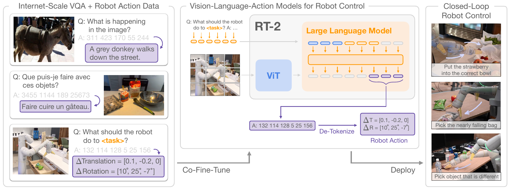

**Original caption:** Figure 1 | RT-2 overview: we represent robot actions as another language, which can be cast into text tokens and trained together with Internet-scale vision-language datasets. During inference, the text tokens are de-tokenized into robot actions, enabling closed loop control. This allows us to leverage the backbone and pretraining of vision-language models in learning robotic policies, transferring some of their generalization, semantic understanding, and reasoning to robotic control. We demonstrate examples of RT-2 execution on the project website: robotics-transformer2.github.io .

**中文图注:** 图 1 | RT-2 概览：我们把机器人动作表示为另一种语言，它可以被转换为文本 token，并与互联网规模的视觉-语言数据集一起训练。在推理时，文本 token 被反离散化（de-tokenize）为机器人动作，从而实现闭环控制。这使我们能够在学习机器人策略时利用视觉-语言模型的主干与预训练，把其部分泛化、语义理解与推理能力迁移到机器人控制中。我们在项目网站 robotics-transformer2.github.io 上演示 RT-2 的执行示例。

**阅读提示:** 先看左侧“Internet-Scale VQA + Robot Action Data”一栏：同一批训练数据里既有自然语言的 VQA 回答，也有以数字串表示的动作。再看右侧的闭环流程——模型输出的动作 token 经 De-Tokenize 变成 ΔTranslation / ΔRotation，驱动机器人后重新观测，形成闭环。这张图是理解“动作即语言”这一核心主张的入口。

<a id="S005"></a>
**Source:** p.3 S005

**Original:** We observe that robotic policies derived from such vision-language models exhibit a range of remarkable capabilities, combining the physical motions learned from the robot data with the ability to interpret images and text learned from web data into a single model. Besides the expected benefit of dramatically improving generalization to novel objects and semantically varied instructions, we observe a number of emergent capabilities. While the model's physical skills are still limited to the distribution of skills seen in the robot data, the model acquires the ability to deploy those skills in new ways by interpreting images and language commands using knowledge gleaned from the web. Some example highlights are shown in Figure 2. The model is able to re-purpose pick and place skills learned from robot data to place objects near semantically indicated locations, such as specific numbers or icons, despite those cues not being present in the robot data. The model can also interpret relations between objects to determine which object to pick and where to place it, despite no such relations being provided in the robot demonstrations. Furthermore, if we augment the command with chain of thought prompting, the model is able to make even more complex semantic inferences, such as figuring out which object to pick up for use as an improvised hammer (a rock), or which type of drink is best suited for someone who is tired (an energy drink). Our main contribution is RT-2, a family of models derived from fine-tuning large vision-language models trained on web-scale data to directly act as generalizable and semantically aware robotic policies. Our experiments investigate models with up to 55B parameters trained on Internet data and instruction-annotated robotic trajectories from previous work (Brohan et al., 2022). Over the course of 6k robotic evaluations, we show that RT-2 enable significant improvements to generalization over objects, scenes, and instructions, and exhibit a breadth of emergent capabilities inherited from web-scale vision-language pretraining.

**中文:** 我们观察到，由这类视觉-语言模型导出的机器人策略展现出一系列引人注目的能力，它把从机器人数据中学到的物理动作与从网络数据中学到的图像和文本理解能力结合在同一个模型中。除了可预期的、对新物体与语义多样指令的泛化能力大幅提升之外，我们还观察到若干涌现能力。虽然模型的物理技能仍限于机器人数据中出现的技能分布，但模型获得了以新方式运用这些技能的能力，它通过使用从网络获取的知识来解释图像与语言指令。图 2 展示了一些示例亮点。模型能够把从机器人数据中学到的抓取与放置技能改用于把物体放到语义上指定的位置附近，例如特定的数字或图标，尽管这些线索从未出现在机器人数据中。模型还能解释物体之间的关系，从而判断该抓取哪个物体以及把它放到哪里，尽管机器人示范中并未提供此类关系。此外，如果我们在指令中加入思维链提示，模型能够做出更复杂的语义推断，例如推断该拿起哪个物体用作临时锤子（一块石头），或者哪种饮料最适合一位疲劳的人（一瓶能量饮料）。我们的主要贡献是 RT-2，它是一族通过对在网络规模数据上训练的大规模视觉-语言模型进行微调而得到的模型，使其直接充当可泛化且具备语义感知能力的机器人策略。我们的实验研究了最多 55B 参数、在互联网数据与先前工作中带指令标注的机器人轨迹（Brohan et al., 2022）上训练的模型。在 6k 次机器人评测过程中，我们表明 RT-2 在对物体、场景与指令的泛化方面带来了显著改善，并展现出从网络规模视觉-语言预训练中继承的广泛涌现能力。

<a id="F002"></a>
### Fig. 2. 需要推理、符号理解与人物识别的真实世界场景

**Placed near:** p.3 S005
**Source:** p.5 F002

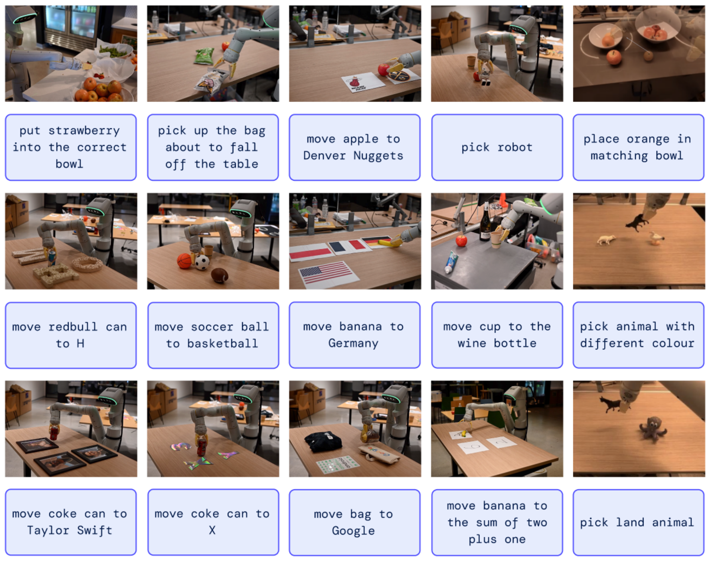

**Original caption:** Figure 2 | RT-2 is able to generalize to a variety of real-world situations that require reasoning, symbol understanding, and human recognition. We study these challenging scenarios in detail in Section 4.

**中文图注:** 图 2 | RT-2 能够泛化到多种需要推理、符号理解与人物识别的真实世界情境。我们在第 4 节详细研究这些具有挑战性的场景。

**阅读提示:** 这张图按三类能力分区展示：符号理解（把物体放到指定数字或图标附近）、人物识别（需要区分不同的人）、以及常识/语义推理（把草莓放进正确颜色或类别的碗）。请把这些场景与正文 4.2 节的定量结果对照阅读，图中展示的是定性示例，成功率数字在表 5。

<a id="S006"></a>

## 2. Related Work ｜ 2. 相关工作

<a id="S007"></a>
**Source:** p.3 S007

**Original:** Vision-language models. There are several categories of Vision-Language Models (VLMs) (Gan et al., 2022), with perhaps two most relevant: (1) representation-learning models, e.g. CLIP (Radford et al., 2021), which learn common embeddings for both modalities, and (2) visual language models of the form { vision , text } → { text } which learn to take vision and language as input and provide free-form text. Both categories have been used to provide pretraining for a wide variety of applied to downstream applications such as object classification (Radford et al., 2021), detection (Gu et al., 2021), and segmentation (Ghiasi et al., 2021). In this work, we focus on the latter category (Alayrac et al., 2022; Chen et al., 2023a,b; Driess et al., 2023; Hao et al., 2022; Li et al., 2023, 2019; Lu et al., 2019). These models are generally trained on many different tasks, such as image captioning, vision-question answering (VQA), and general language tasks on multiple datasets at the same time. While prior works study VLMs for a wide range of problems and settings including in robotics, our focus is on how the capabilities of VLMs can be extended to robotics closed-loop control by endowing them with the ability to predict robot actions, thus leveraging the knowledge already present in VLMs to enable new levels of generalization.

**中文:** 视觉-语言模型。视觉-语言模型（VLM）有若干类别（Gan et al., 2022），其中或许有两类最为相关：（1）表征学习模型，例如 CLIP（Radford et al., 2021），它们为两种模态学习共同的嵌入；（2）形如 { 视觉, 文本 } → { 文本 } 的视觉语言模型，它们学习以视觉和语言为输入并给出自由形式的文本。这两类模型都被用于为广泛的下游应用提供预训练，例如物体分类（Radford et al., 2021）、检测（Gu et al., 2021）与分割（Ghiasi et al., 2021）。在本工作中，我们关注后一类（Alayrac et al., 2022; Chen et al., 2023a,b; Driess et al., 2023; Hao et al., 2022; Li et al., 2023, 2019; Lu et al., 2019）。这类模型通常同时在多个数据集上训练许多不同的任务，例如图像描述、视觉问答（VQA）以及通用语言任务。尽管先前工作研究了 VLM 在包括机器人在内的广泛问题与设定中的应用，我们的关注点在于：如何通过赋予 VLM 预测机器人动作的能力，把 VLM 的能力扩展到机器人闭环控制上，从而利用 VLM 中已经存在的知识来实现新层次的泛化。

**Reading note:** 为什么选择 { 视觉, 文本 } → { 文本 } 的视觉语言模型，而非 CLIP 这类表征学习模型，或设计一个{视觉、文本、动作}统一的嵌入空间？

1. 为什么不是 CLIP：CLIP 类模型没有"输出词表"：表征学习的目标函数是"区分"——把匹配的图文拉近、不匹配的推远。凡是**对区分没帮助**的语义内容，都会被这个瓶颈挤掉。故动作无法被放入嵌入空间。
2. 增加动作空间会增加参数（动作编码器、动作解码器）
3. 要训练一个"视觉-语言-动作共享空间"，就得用动作数据去塑造它的几何结构——而机器人动作恰恰是最稀缺的模态：网络侧有 10B 量级的图文对（S062），机器人侧只有 13 台机器人 17 个月的示范。**让丰富模态去迁就匮乏模态**，等于把瓶颈焊死在自己最缺的东西上。RT-2 的方向是反过来的：让动作迁就语言。

**Reading note：**RT-2 的做法

图像：映射进文字的嵌入空间：图像变成连续的 token 嵌入，和文本 token 嵌入一起被同一个 Transformer 处理。

动作：它是被"生成"的，不是被"编码"的：把离散动作 bin 直接关联到**词表里已有的 token**，只在输出位置

```text
输入侧：  图像 ─ ViT ─ 投影层 ─┐
                              ├─→ Transformer 联合处理 ─→ 共享输出词表 ─→ 文本回答
          文本指令 ─ 分词 ────┘                                    └────→ 动作 token 串 ─→ 反离散化 ─→ ΔT / ΔR
```

<a id="S008"></a>
**Source:** p.3-p.4 S008

**Original:** Generalization in robot learning. Developing robotic controllers that can broadly succeed in a variety of scenarios is a long-standing goal in robotics research (Kaelbling, 2020; Smith and Coles, 1973). A promising approach for enabling generalization in robotic manipulation is by learning from large and diverse datasets (Dasari et al., 2019; Levine et al., 2018; Pinto and Gupta, 2016). By doing so, prior methods have demonstrated how robots can generalize to novel object instances (Finn and Levine, 2017; Levine et al., 2018; Mahler et al., 2017; Pinto and Gupta, 2016; Young et al., 2021), to tasks involving novel combinations of objects and skills (Dasari and Gupta, 2021; Finn et al., 2017; James et al., 2018; Jang et al., 2021; Yu et al., 2018), to new goals or language instructions (Jang et al., 2021; Jiang et al., 2022; Liu et al., 2022; Mees et al., 2022; Nair et al., 2022a; Pong et al., 2019), to tasks with novel semantic object categories (Shridhar et al., 2021; Stone et al., 2023), and to unseen environments (Cui et al., 2022; Du et al., 2023a; Hansen et al., 2020). Unlike most of these prior works, we aim to develop and study a single model that can generalize to unseen conditions along all of these axes. A key ingredient of our approach is to leverage pre-trained models that have been exposed to data that is much broader than the data seen by the robot.

**中文:** 机器人学习中的泛化。开发能在多种场景中广泛取得成功的机器人控制器，是机器人研究中一个长期目标（Kaelbling, 2020; Smith and Coles, 1973）。在机器人操作中实现泛化的一个有前景的途径，是从大规模且多样的数据集中学习（Dasari et al., 2019; Levine et al., 2018; Pinto and Gupta, 2016）。通过这种方式，先前的方法已经展示了机器人如何泛化到新的物体实例（Finn and Levine, 2017; Levine et al., 2018; Mahler et al., 2017; Pinto and Gupta, 2016; Young et al., 2021）、涉及物体与技能新组合的任务（Dasari and Gupta, 2021; Finn et al., 2017; James et al., 2018; Jang et al., 2021; Yu et al., 2018）、新的目标或语言指令（Jang et al., 2021; Jiang et al., 2022; Liu et al., 2022; Mees et al., 2022; Nair et al., 2022a; Pong et al., 2019）、具有新语义物体类别的任务（Shridhar et al., 2021; Stone et al., 2023），以及未曾见过的环境（Cui et al., 2022; Du et al., 2023a; Hansen et al., 2020）。与这些先前工作大多不同，我们的目标是开发并研究单一模型，使其能够沿着上述所有维度泛化到未见过的条件。我们方法的一个关键要素，是<mark>利用那些已经接触过远比机器人所见数据更为广泛的数据的预训练模型</mark>。

<a id="S009"></a>
**Source:** p.4 S009

**Original:** Pre-training for robotic manipulation. Pre-training has a long history in robotic learning. Most works focus on pre-trained visual representations that can be used to initialize the encoder of the robot's camera observations, either via supervised ImageNet classification (Shah and Kumar, 2021), data augmentation (Kostrikov et al., 2020; Laskin et al., 2020a,b; Pari et al., 2021) or objectives that are tailored towards robotic control (Karamcheti et al., 2023; Ma et al., 2022; Majumdar et al., 2023b; Nair et al., 2022b; Xiao et al., 2022b). Other works have incorporated pre-trained language models, often either as an instruction encoder (Brohan et al., 2022; Hill et al., 2020; Jang et al., 2021; Jiang et al., 2022; Lynch and Sermanet, 2020; Nair et al., 2022a; Shridhar et al., 2022b) or for high-level planning (Ahn et al., 2022; Driess et al., 2023; Huang et al., 2022; Mu et al., 2023; Singh et al., 2023; Wu et al., 2023). Rather than using pre-training vision models or pre-trained language models, we specifically consider the use of pre-trained vision-language models (VLMs), which provide rich, grounded knowledge about the world. Prior works have studied the use of VLMs for robotics (Driess et al., 2023; Du et al., 2023b; Gadre et al., 2022; Karamcheti et al., 2023; Shah et al., 2023; Shridhar et al., 2021; Stone et al., 2023), and form part of the inspiration for this work. These prior approaches use VLMs for visual state representations (Karamcheti et al., 2023), for identifying objects (Gadre et al., 2022; Stone et al., 2023), for high-level planning (Driess et al., 2023), or for providing supervision or success detection (Du et al., 2023b; Ma et al., 2023; Sumers et al., 2023; Xiao et al., 2022a; Zhang et al., 2023). While CLIPort (Shridhar et al., 2021) and MOO (Stone et al., 2023) integrate pre-trained VLMs into end-to-end visuomotor manipulation policies, both incorporate significant structure into the policy that limits their applicability. Notably, our work does not rely on a restricted 2D action space and does not require a calibrated camera. Moreover, a critical distinction is that, unlike these works, we leverage VLMs that generate language, and the unified output space of our formulation enables model weights to be entirely shared across language and action tasks, without introducing action-only model layer components.

**中文:** 机器人操作中的预训练。预训练在机器人学习中有着悠久的历史。大多数工作关注可用于初始化机器人相机观测编码器的预训练视觉表征，其方式可以是监督式 ImageNet 分类（Shah and Kumar, 2021）、数据增强（Kostrikov et al., 2020; Laskin et al., 2020a,b; Pari et al., 2021），或是面向机器人控制定制的目标函数（Karamcheti et al., 2023; Ma et al., 2022; Majumdar et al., 2023b; Nair et al., 2022b; Xiao et al., 2022b）。其他工作则引入了预训练语言模型，通常要么作为指令编码器（Brohan et al., 2022; Hill et al., 2020; Jang et al., 2021; Jiang et al., 2022; Lynch and Sermanet, 2020; Nair et al., 2022a; Shridhar et al., 2022b），要么用于高层规划（Ahn et al., 2022; Driess et al., 2023; Huang et al., 2022; Mu et al., 2023; Singh et al., 2023; Wu et al., 2023）。我们并非使用预训练的视觉模型或预训练的语言模型，而是专门考虑使用预训练的视觉-语言模型（VLM），因为它们提供了关于世界的丰富且有物理落地的知识。先前工作已研究了 VLM 在机器人中的应用（Driess et al., 2023; Du et al., 2023b; Gadre et al., 2022; Karamcheti et al., 2023; Shah et al., 2023; Shridhar et al., 2021; Stone et al., 2023），它们也构成本工作的部分灵感来源。这些先前方法把 VLM 用于视觉状态表征（Karamcheti et al., 2023）、物体识别（Gadre et al., 2022; Stone et al., 2023）、高层规划（Driess et al., 2023），或提供监督信号与成功检测（Du et al., 2023b; Ma et al., 2023; Sumers et al., 2023; Xiao et al., 2022a; Zhang et al., 2023）。尽管 CLIPort（Shridhar et al., 2021）与 MOO（Stone et al., 2023）都把预训练 VLM 整合进端到端的视觉运动操作策略，但两者都在策略中引入了大量结构性约束，从而限制了其适用性。值得注意的是，我们的工作不依赖于受限的 2D 动作空间，也不要求相机经过标定。此外，一个关键区别在于，与这些工作不同，我们利用的是能够生成语言的 VLM，而我们公式中统一的输出空间使得模型权重能够在语言任务与动作任务之间完全共享，而无需引入任何仅用于动作的模型层组件。

<a id="S010"></a>

## 3. Vision-Language-Action Models ｜ 3. 视觉-语言-动作模型

<a id="S011"></a>
**Source:** p.4 S011

**Original:** In this section, we present our model family and the design choices for enabling training VLMs to directly perform closed-loop robot control. First, we describe the general architecture of our models and how they can be derived from models that are commonly used for vision-language tasks. Then, we introduce the recipe and challenges of fine-tuning large VLMs that are pre-trained on web-scale data to directly output robot actions, becoming VLA models. Finally, we describe how to make these models practical for robot tasks, addressing challenges with model size and inference speed to enable real-time control.

**中文:** 在本节中，我们介绍我们的模型族，以及使 VLM 能够被训练来直接执行闭环机器人控制的设计选择。首先，我们描述模型的总体架构，以及它们如何能从常用于视觉-语言任务的模型导出。随后，我们介绍在将网络规模数据上预训练的大规模 VLM 微调为直接输出机器人动作、从而成为 VLA 模型时的配方与挑战。最后，我们描述如何使这些模型在机器人任务中变得实用，解决模型规模与推理速度方面的挑战，以实现实时控制。

<a id="S012"></a>

## 3.1. Pre-Trained Vision-Language Models ｜ 3.1. 预训练视觉-语言模型

<a id="S013"></a>
**Source:** p.4-p.5 S013

**Original:** The vision-language models (Chen et al., 2023a; Driess et al., 2023) that we build on in this work take as input one or more images and produce a sequence of tokens, which conventionally represents natural language text. Such models can perform a wide range of visual interpretation and reasoning tasks, from inferring the composition of an image to answering questions about individual objects and their relations to other objects (Alayrac et al., 2022; Chen et al., 2023a; Driess et al., 2023; Huang et al., 2023). Representing the knowledge necessary to perform such a wide range of tasks requires large models and web-scale datasets. In this work, we adapt two previously proposed VLMs to act as VLA models: PaLI-X (Chen et al., 2023a) and PaLM-E (Driess et al., 2023). We will refer to vision-language-action versions of these models as RT-2-PaLI-X and RT-2-PaLM-E. We leverage instantiations of these models that range in size from billions to tens of billions of parameters. We provide a detailed description of the architecture of these two models in Appendix D.

**中文:** 本工作所基于的视觉-语言模型（Chen et al., 2023a; Driess et al., 2023）以一个或多个图像为输入，并产生一个 token 序列，该序列按惯例表示自然语言文本。这类模型能够执行广泛的视觉理解与推理任务，从推断图像的构成，到回答关于单个物体及其与其他物体关系的问题（Alayrac et al., 2022; Chen et al., 2023a; Driess et al., 2023; Huang et al., 2023）。要表示执行如此广泛任务所需的知识，需要大规模模型与网络规模的数据集。在本工作中，我们把两个先前提出的 VLM 改造为 VLA 模型：PaLI-X（Chen et al., 2023a）与 PaLM-E（Driess et al., 2023）。我们将把这些模型的视觉-语言-动作版本称为 RT-2-PaLI-X 与 RT-2-PaLM-E。我们使用的这些模型实例的规模从数十亿到数百亿参数不等。我们在附录 D 中给出这两个模型架构的详细描述。

<a id="S014"></a>

## 3.2. Robot-Action Fine-tuning ｜ 3.2. 机器人动作微调

<a id="S015"></a>
**Source:** p.5-p.6 S015

**Original:** To enable vision-language models to control a robot, they must be trained to output actions. We take a direct approach to this problem, representing actions as tokens in the model's output, which are treated in the same way as language tokens. We base our action encoding on the discretization proposed by Brohan et al. (2022) for the RT-1 model. The action space consists of 6-DoF positional and rotational displacement of the robot end-effector, as well as the level of extension of the robot gripper and a special discrete command for terminating the episode, which should be triggered by the policy to signal successful completion. The continuous dimensions (all dimensions except for the discrete termination command) are discretized into 256 bins uniformly. Thus, the robot action can be represented using ordinals of the discrete bins as 8 integer numbers. In order to use these discretized actions to finetune a vision-language into a vision-language- action model, we need to associate tokens from the model's existing tokenization with the discrete action bins. This requires reserving 256 tokens to serve as action tokens. Which tokens to choose depends on the particular tokenization used by each VLM, which we discuss later in this section. In order to define a target for VLM fine-tuning we convert the action vector into a single string by simply concatenating action tokens for each dimension with a space character:

**中文:** 要让视觉-语言模型控制机器人，就必须训练它们输出动作。我们对这一问题采取直接的思路：把动作表示为模型输出中的 token，并以与语言 token 完全相同的方式对待它们。我们的动作编码建立在 Brohan et al. (2022) 为 RT-1 模型提出的离散化方法之上。**动作空间由机器人末端执行器的 6 自由度位置与旋转位移、机器人夹爪的伸展程度，以及一个用于终止回合的特殊离散命令组成**，后者应由策略触发以表示成功完成。连续维度（除离散终止命令之外的所有维度）被均匀地离散化为 256 个 bin。因此，机器人动作可以用这些离散 bin 的序号表示为 8 个整数。为了使用这些离散化动作把视觉-语言模型微调成视觉-语言-动作模型，我们需要把模型现有分词表中的 token 与这些离散动作 bin 关联起来。这需要预留 256 个 token 作为动作 token。具体选择哪些 token 取决于每个 VLM 所使用的分词方案，我们将在本节后面讨论。为了给 VLM 微调定义目标，我们把动作向量转换为单个字符串，方法是用空格字符把每个维度的动作 token 直接拼接起来：

<a id="S016"></a>
**Source:** p.6 S016

**Original:** "terminate Δpos_x Δpos_y Δpos_z Δrot_x Δrot_y Δrot_z gripper_extension"

**中文:** “terminate Δpos_x Δpos_y Δpos_z Δrot_x Δrot_y Δrot_z gripper_extension”

> 说明：PDF 中下标字符被拆成独立文本块，此处按行内公式重建。

<a id="S017"></a>
**Source:** p.6 S017

**Original:** A possible instantiation of such a target could be: "1 128 91 241 5 101 127". The two VLMs that we finetune in our experiments, PaLI-X (Chen et al., 2023a) and PaLM-E (Driess et al., 2023), use different tokenizations. For PaLI-X, integers up to 1000 each have a unique token, so we simply associate the action bins to the token representing the corresponding integer. For the PaLM-E model, which does not provide this convenient representation of numbers, we simply overwrite the 256 least frequently used tokens to represent the action vocabulary. It is worth noting that training VLMs to override existing tokens with action tokens is a form of symbol tuning (Wei et al., 2023), which has been shown to work well for VLMs in prior work.

**中文:** 这样目标的一个可能实例是：“1 128 91 241 5 101 127”。我们在实验中微调的两个 VLM，即 PaLI-X（Chen et al., 2023a）与 PaLM-E（Driess et al., 2023），使用不同的分词方案。对 PaLI-X 而言，1000 以内的每个整数都有唯一的 token，因此我们直接把动作 bin 关联到表示相应整数的 token 上。对 PaLM-E 模型而言，它并不提供这种便利的数字表示，我们直接把使用频率最低的 256 个 token 覆写为动作词表。值得注意的是，训练 VLM 用动作 token 覆写已有 token 是符号调优（symbol tuning，Wei et al., 2023）的一种形式，先前工作已表明它对 VLM 效果良好。

<a id="S018"></a>
**Source:** p.6 S018

**Original:** Taking the action representation described above, we convert our robot data to be suitable for VLM model fine-tuning, where our inputs include robot camera image and textual task description (using standard VQA format "Q: what action should the robot take to [task instruction]? A:"), and our output is formatted as a string of numbers/least frequently used tokens representing a robot action.

**中文:** 基于上述动作表示，我们把机器人数据转换为适合 VLM 模型微调的形式：我们的输入包括机器人相机图像与文本任务描述（使用标准 VQA 格式“Q: what action should the robot take to [task instruction]? A:”），而我们的输出被格式化为表示某个机器人动作的数字字符串／使用频率最低的 token 串。

<a id="S019"></a>
**Source:** p.6 S019

**Original:** Co-Fine-Tuning. As we will show in our experiments, a key technical detail of the training recipe that improves robot performance is co-fine-tuning robotics data with the original web data instead of naïve finetuning on robot data only. We notice that co-fine-tuning leads to more generalizable policies since the policies are exposed to both abstract visual concepts from web scale data and low level robot actions during fine-tuning, instead of just robot actions. During co-fine-tuning we balance the ratios of robot and web data in each training batch by increasing the sampling weight on the robot dataset.

**中文:** 联合微调（Co-Fine-Tuning）。正如我们将在实验中展示的，训练配方中一个能提升机器人性能的关键技术细节，是**把机器人数据与原始网络数据一起联合微调**，而不是仅用机器人数据进行朴素的微调。我们注意到，联合微调会带来更可泛化的策略，因为策略在微调期间同时接触来自网络规模数据的抽象视觉概念和低层机器人动作，而不只是机器人动作。在联合微调过程中，我们通过提高机器人数据集上的采样权重来平衡每个训练批次中机器人数据与网络数据的比例。

<a id="S020"></a>
**Source:** p.6 S020

**Original:** Output Constraint. One important distinction between RT-2 and standard VLMs is that RT-2 is required to output valid action tokens for execution on the real robot. Thus, to ensure that RT-2 outputs valid action tokens during decoding, we constrain its output vocabulary via only sampling valid action tokens when the model is prompted with a robot-action task, whereas the model is still allowed to output the full range of natural language tokens on standard vision-language tasks.

**中文:** 输出约束（Output Constraint）。RT-2 与标准 VLM 的一个重要区别是，RT-2 必须输出能在真实机器人上执行的有效动作 token。因此，为确保 RT-2 在解码时输出有效的动作 token，我们对其输出词表施加约束：当模型被提示执行机器人动作任务时，只采样有效的动作 token；而在标准视觉-语言任务上，模型仍被允许输出完整的自然语言 token 范围。

<a id="S021"></a>

## 3.3. Real-Time Inference ｜ 3.3. 实时推理

<a id="S022"></a>
**Source:** p.6 S022

**Original:** The size of modern VLMs can reach tens or hundreds of billions of parameters (Chen et al., 2023a; Driess et al., 2023). The largest model trained in this work uses 55B parameters. It is infeasible to directly run such models on the standard desktop-style machines or on-robot GPUs commonly used for real-time robot control. To the best of our knowledge, our model is the largest ever, by over an order of magnitude, used for direct closed-loop robotic control, and therefore requires a new set of solutions to enable efficient real-time inference. We develop a protocol that allows us to run RT-2 models on robots by deploying them in a multi-TPU cloud service and querying this service over the network. With this solution, we can achieve a suitable frequency of control and also serve multiple robots using the same cloud service. The largest model we evaluated, the 55B parameter RT-2-PaLI-X-55B model, can run at a frequency of 1-3 Hz. The smaller version of that model, consisting of 5B parameters, can run at a frequency of around 5 Hz.

**中文:** 现代 VLM 的规模可以达到数百亿甚至数千亿参数（Chen et al., 2023a; Driess et al., 2023）。本工作中训练的最大模型使用了 55B 参数。要在常用于实时机器人控制的标准桌面式机器或机器人本地 GPU 上直接运行这类模型是不可行的。据我们所知，我们的模型是迄今用于直接闭环机器人控制的最大模型，比以往大出一个数量级以上，因此需要一整套新的解决方案来实现高效的实时推理。我们开发了一套协议，**把 RT-2 模型部署在多 TPU 云服务中并通过网络查询该服务，从而在机器人上运行这些模型**。借助该方案，我们能够达到合适的控制频率，并且可以用同一个云服务同时服务多台机器人。我们评测的最大模型——55B 参数的 RT-2-PaLI-X-55B——可以 1-3 Hz 的频率运行。该模型的较小版本（5B 参数）则可以约 5 Hz 的频率运行。

<a id="S023"></a>

## 4. Experiments ｜ 4. 实验

<a id="S024"></a>
**Source:** p.6 S024

**Original:** Our experiments focus on real-world generalization and emergent capabilities of RT-2 and aim to answer the following questions:

**中文:** 我们的实验聚焦于 RT-2 在真实世界中的泛化能力与涌现能力，旨在回答以下问题：

<a id="S025"></a>
**Source:** p.7 S025

**Original:** How does RT-2 perform on seen tasks and more importantly, generalize over new objects, backgrounds, and environments?

**中文:** RT-2 在已见任务上表现如何？更重要的是，它对新的物体、背景与环境泛化得如何？

<a id="S026"></a>
**Source:** p.7 S026

**Original:** Can we observe and measure any emergent capabilities of RT-2?

**中文:** 我们能否观察到并度量 RT-2 的任何涌现能力？

<a id="S027"></a>
**Source:** p.7 S027

**Original:** How does the generalization vary with parameter count and other design decisions?

**中文:** 泛化能力如何随参数数量与其他设计决策而变化？

<a id="S028"></a>
**Source:** p.7 S028

**Original:** Can RT-2 exhibit signs of chain-of-thought reasoning similarly to vision-language models?

**中文:** RT-2 能否像视觉-语言模型那样表现出思维链推理的迹象？

<a id="S029"></a>
**Source:** p.7 S029

**Original:** We evaluate our approach and several baselines with about 6,000 evaluation trajectories in a variety of conditions, which we describe in the following sections. Unless specified otherwise, we use a 7DoF mobile manipulator with the action space described in Sec. 3.2. We also demonstrate examples of RT-2 execution on the project website: robotics-transformer2.github.io . We train two specific instantiations of RT-2 that leverage pre-trained VLMs: (1) RT-2-PaLI-X is built from 5B and 55B PaLI-X (Chen et al., 2023a), and (2) RT-2-PaLM-E is built from 12B PaLM-E (Driess et al., 2023).

**中文:** 我们在多种条件下用约 6,000 条评测轨迹评测了我们的方法与若干基线，具体设定将在后续各节介绍。除非另有说明，我们使用具有 7 自由度的移动操作机器人，其动作空间见第 3.2 节。我们还在项目网站 robotics-transformer2.github.io 上展示了 RT-2 执行的示例。我们训练了两个利用预训练 VLM 的具体 RT-2 实例：（1）RT-2-PaLI-X 基于 5B 与 55B 的 PaLI-X（Chen et al., 2023a）构建；（2）RT-2-PaLM-E 基于 12B 的 PaLM-E（Driess et al., 2023）构建。

<a id="S030"></a>
**Source:** p.7 S030

**Original:** For training, we leverage the original web scale data from Chen et al. (2023a) and Driess et al. (2023), which consists of visual question answering, captioning, and unstructured interwoven image and text examples. We combine it with the robot demonstration data from Brohan et al. (2022), which was collected with 13 robots over 17 months in an office kitchen environment. Each robot demonstration trajectory is annotated with a natural language instruction that describes the task performed, consisting of a verb describing the skill (e.g., "pick", "open", "place into") and one or more nouns describing the objects manipulated (e.g., "7up can", "drawer", "napkin") (see Appendix B for more details on the used datasets). For all RT-2 training runs we adopt the hyperparameters from the original PaLI-X (Chen et al., 2023a) and PaLM-E (Driess et al., 2023) papers, including learning rate schedules and regularizations. More training details can be found in Appendix E.

**中文:** 在训练方面，我们利用 Chen et al. (2023a) 与 Driess et al. (2023) 的原始网络规模数据，其中包含视觉问答、图像描述以及非结构化的图文交错样例。我们把它与来自 Brohan et al. (2022) 的机器人示范数据结合，后者由 13 台机器人在办公室厨房环境中历时 17 个月采集。每一条机器人示范轨迹都标注了描述所执行任务的自然语言指令，指令由一个描述技能的动词（例如“pick”“open”“place into”）和一个或多个描述被操作物体的名词（例如“7up can”“drawer”“napkin”）组成（所用数据集的更多细节见附录 B）。对所有 RT-2 训练运行，我们都采用原始 PaLI-X（Chen et al., 2023a）与 PaLM-E（Driess et al., 2023）论文中的超参数，包括学习率调度与正则化。更多训练细节见附录 E。

<a id="S031"></a>
**Source:** p.7 S031

**Original:** Baselines. We compare our method to multiple state-of-the-art baselines that challenge different aspects of our method. All of the baselines use the exact same robotic data. To compare against a state-of-the-art policy, we use RT-1 (Brohan et al., 2022), a 35M parameter transformer-based model. To compare against state-of-the-art pretrained representations, we use VC-1 (Majumdar et al., 2023a) and R3M (Nair et al., 2022b), with policies implemented by training an RT-1 backbone to take their representations as input. To compare against other architectures for using VLMs, we use MOO (Stone et al., 2023), which uses a VLM to create an additional image channel for a semantic map, which is then fed into an RT-1 backbone. More information is provided in Appendix C.

**中文:** 基线。我们把我们的方法与多个当前最先进的基线进行比较，这些基线针对我们方法的不同方面提出挑战。所有基线都使用完全相同的机器人数据。为了与当前最先进的策略比较，我们使用 RT-1（Brohan et al., 2022），一个 35M 参数的基于 Transformer 的模型。为了与当前最先进的预训练表征比较，我们使用 VC-1（Majumdar et al., 2023a）与 R3M（Nair et al., 2022b），其策略通过训练一个 RT-1 主干网络以其表征为输入来实现。为了与使用 VLM 的其他架构比较，我们使用 MOO（Stone et al., 2023），它借助 VLM 生成一个额外的语义地图图像通道，再送入 RT-1 主干网络。更多信息见附录 C。

<a id="S032"></a>

## 4.1. How does RT-2 perform on seen tasks and more importantly, generalize over new objects, backgrounds, and environments? ｜ 4.1. RT-2 在已见任务上表现如何？更重要的是，它对新的物体、背景与环境泛化得如何？

<a id="S033"></a>
**Source:** p.7 S033

**Original:** To evaluate in-distribution performance as well as generalization capabilities, we compare the RT-2-PaLI-X and RT-2-PaLM-E models to the four baselines listed in the previous sections. For the seen tasks category, we use the same suite of seen instructions as in RT-1 (Brohan et al., 2022), which include over 200 tasks in this evaluation: 36 for picking objects, 35 for knocking objects, 35 for placing things upright, 48 for moving objects, 18 for opening and closing various drawers, and 36 for picking out of and placing objects into drawers. Note, however, that these "in-distribution" evaluations still vary the placement of objects and factors such as time of day and robot position, requiring the skills to generalize to realistic variability in the environment.

**中文:** 为了评测分布内性能以及泛化能力，我们把 RT-2-PaLI-X 与 RT-2-PaLM-E 模型与前几节列出的四个基线进行比较。在已见任务类别中，我们使用与 RT-1（Brohan et al., 2022）相同的已见指令集，本次评测包含 200 多个任务：36 个抓取物体任务、35 个击倒物体任务、35 个把物体竖直放置任务、48 个移动物体任务、18 个开合各种抽屉任务，以及 36 个从抽屉中取出与放入物体任务。不过要注意，这些“分布内”评测仍然改变了物体的摆放位置，以及一天中的时间、机器人位置等因素，因此技能仍需泛化到环境中贴近现实的变异性。

<a id="S034"></a>
**Source:** p.8 S034

**Original:** Figure 3 shows example generalization evaluations, which are split into unseen categories ( objects , backgrounds and environments ), and are additionally split into easy and hard cases. For unseen objects, hard cases include harder-to-grasp and more unique objects (such as toys). For unseen backgrounds, hard cases include more varied backgrounds and novel objects. Lastly, for unseen environments, hard cases correspond to a more visually distinct office desk environment with monitors and accessories, while the easier environment is a kitchen sink. These evaluations consists of over 280 tasks that focus primarily on pick and placing skills in many diverse scenarios. The list of instructions for unseen categories is specified in Appendix F.2.

**中文:** 图 3 展示了泛化评测的示例，这些评测被划分为未见类别（物体、背景与环境），并进一步划分为简单与困难两类。对于未见物体，困难案例包含更难抓取、更独特的物体（例如玩具）。对于未见背景，困难案例包含更多变的背景以及新物体。最后，对于未见环境，困难案例对应一个视觉上差异更大的办公桌环境，带有显示器与各种配件，而较简单的环境则是厨房水槽。这些评测包含 280 多个任务，主要聚焦于多种多样场景下的抓取与放置技能。未见类别的指令清单见附录 F.2。

<a id="F003"></a>
### Fig. 3. 三类泛化评测场景（未见物体／背景／环境）

**Placed near:** p.8 S034
**Source:** p.7 F003

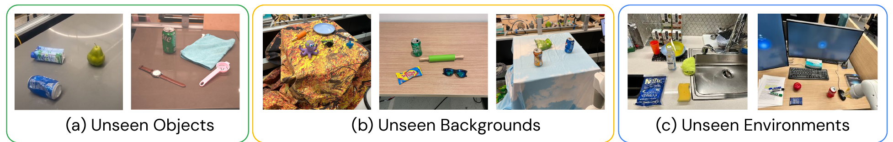

**Original caption:** Figure 3 | Example generalization scenarios used for evaluation in Figures 4 and 6b and Tables 4 and 6.

**中文图注:** 图 3 | 用于图 4、图 6b 以及表 4、表 6 中评测的泛化场景示例。

**阅读提示:** 三个面板对应三类分布偏移：(a) 未见的物体、(b) 未见的背景、(c) 未见的教室环境。每一类都区分 easy 与 hard 两种难度，hard 版本在同轴上偏移更大。看这张图时要记住：评测的是**同轴更大的偏移**，而不是全新的能力维度。

<a id="S035"></a>
**Source:** p.8 S035

**Original:** The evaluation results are shown in Figure 4 and Appendix Table 4. The performance on seen tasks is similar between the RT-2 models and RT-1, with other baselines attaining a lower success rate. The difference between the RT-2 models and the baseline is most pronounced in the various generalization experiments, suggesting that the strength of vision-language-action models lies in transferring more generalizable visual and semantic concepts from their Internet-scale pretraining data. Here, on average, both instantiations of RT-2 perform similarly, resulting in ∼ 2x improvement over the next two baselines, RT-1 and MOO, and ∼ 6x better than the other baselines. The PaLM-E version of RT-2 seems to perform better than the RT-2-PaLI-X in harder versions of generalization scenarios while under-performing on easier ones, resulting in a similar average performance.

**中文:** 评测结果见图 4 与附录表 4。在已见任务上，RT-2 模型与 RT-1 的表现相近，其他基线的成功率更低。RT-2 模型与基线之间的差距在各种泛化实验中最为明显，这说明视觉-语言-动作模型的优势在于能从其互联网规模的预训练数据中迁移更可泛化的视觉与语义概念。在这里，平均而言两个 RT-2 实例表现相近，相对于次优的两个基线 RT-1 与 MOO 取得约 2 倍的提升，相对其他基线则约好 6 倍。RT-2 的 PaLM-E 版本在更困难的泛化场景中似乎比 RT-2-PaLI-X 表现更好，而在较简单的场景中表现较差，因此平均表现相近。

<a id="F004"></a>
### Fig. 4. 总体性能：已见任务与三类泛化

**Placed near:** p.8 S035
**Source:** p.8 F004

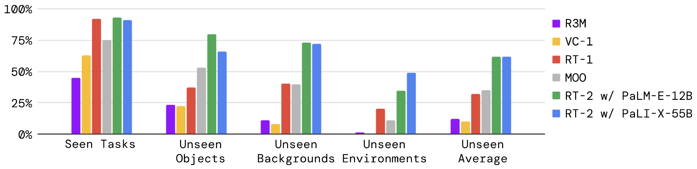

**Original caption:** Figure 4 | Overall performance of two instantiations of RT-2 and baselines across seen training tasks as well as unseen evaluations measuring generalization to novel objects, novel backgrounds, and novel environments. Appendix Table 4 details the full results.

**中文图注:** 图 4 | 两个 RT-2 实例与基线在已见训练任务上、以及在衡量对新颖物体、新颖背景与新颖环境泛化的未见评测上的总体性能。附录表 4 给出完整结果。

**阅读提示:** 柱状图的六组依次为已见任务、未见物体（easy/hard）、未见背景（easy/hard）、未见环境（easy/hard）。RT-2 的六个子列为 easy/hard 配对，基线只评测一个版本。关键对比是：已见任务上各方法接近，差距主要在泛化列。

<a id="S036"></a>
**Source:** p.8 S036

**Original:** Open Source Language Table Benchmark. To provide an additional point of comparison using open-source baselines and environments, we leverage the open-source Language-Table simulation environment from Lynch et al. (2022). We co-fine-tune a smaller PaLI 3B model on several prediction tasks, including in-domain VQA tasks, for the Language-Table dataset, and evaluate the resulting policy in simulation. For the action prediction task, we discretize and encode actions as text in the format " X Y ", where X and Y range between {-10, -9, . . . , +9, +10}, and represent delta 2D cartesian setpoints of the end effector. Due to its reduced size, the resulting model can run inference at a similar rate (5 Hz) as the other baselines. The results of this experiment are presented in Table 1. We observe a significant performance boost when using our model compared to the baselines, indicating that the VLM-based pre-training together with the expressiveness of the large PaLI model can be beneficial in other scenarios, in this case, simulation with a different robot. We also show qualitative real-world out-of-distribution behaviors behaviors in Figure 5, demonstrating novel pushing tasks and targeting objects not before seen in this environment. More details about the Language Table experiments can be found in Appendix B and D.

**中文:** 开源 Language Table 基准。为了利用开源基线与开源环境提供另一个比较点，我们使用 Lynch et al. (2022) 的开源 Language-Table 仿真环境。我们针对 Language-Table 数据集，在若干预测任务（包括域内 VQA 任务）上联合微调一个较小的 PaLI 3B 模型，并在仿真中评测所得的策略。对于动作预测任务，我们把动作离散化并编码为 “X Y” 格式的文本，其中 X 与 Y 的取值范围为 {-10, -9, . . . , +9, +10}，表示末端执行器的 2D 笛卡尔增量设定点。由于模型规模较小，所得模型可以以与其他基线相近的速率（5 Hz）进行推理。该实验的结果见表 1。我们观察到，与基线相比使用我们的模型带来了显著性能提升，这表明基于 VLM 的预训练加上大规模 PaLI 模型的表达能力在别的场景中同样有益，在这里即是在不同机器人上的仿真。我们还在图 5 中展示了真实世界的定性分布外行为，展示了新的推挤任务以及针对该环境中此前未见物体的操作。有关 Language Table 实验的更多细节见附录 B 与 D。

<a id="T001"></a>
### Table 1. Language-Table 仿真任务上的性能

**Placed near:** p.8 S036
**Source:** p.9 T001

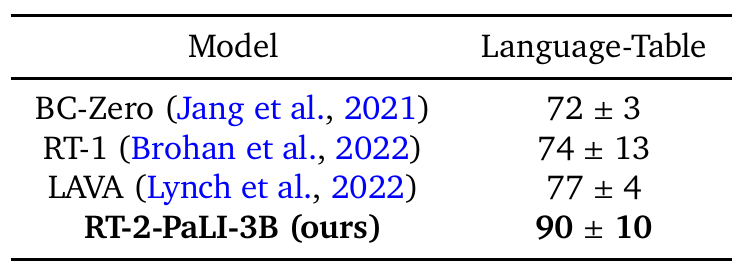

**Original caption:** Table 1 | Performance on the simulated Language-Table tasks (Lynch and Sermanet, 2020).

**中文图注:** 表 1 | 在仿真的 Language-Table 任务上的性能（Lynch and Sermanet, 2020）。

**表格转录（本阅读稿整理）：** 原表为两列（Model / Language-Table）。数值为成功率（%，均值 ± 标准差）。

| Model | Language-Table |
|---|---|
| BC-Zero (Jang et al., 2021) | 72 ± 3 |
| RT-1 (Brohan et al., 2022) | 74 ± 13 |
| LAVA (Lynch et al., 2022) | 77 ± 4 |
| RT-2-PaLI-3B (ours) | 90 ± 10 |

**阅读提示:** 表格比较了 RT-2-PaLI-3B 与 BC-Zero、RT-1、LAVA 在 Language-Table 仿真任务上的成功率。注意这是**不同机器人平台的仿真环境**，且使用了更小的 PaLI-3B 骨干，说明该方法不依赖 55B 规模的模型才能奏效。

<a id="F005"></a>
### Fig. 5. Language-Table 中的分布外行为

**Placed near:** p.8 S036
**Source:** p.9 F005

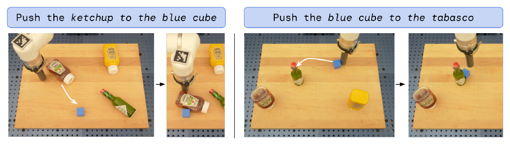

**Original caption:** Figure 5 | Real-world out-of-distribution behaviors in the Language Table environment. Identical RT-2-PaLI-3B model checkpoint is used as in Tab. 1.

**中文图注:** 图 5 | Language Table 环境中的真实世界分布外行为。使用与表 1 相同的 RT-2-PaLI-3B 模型检查点。

**阅读提示:** 这是 Language-Table 仿真中的分布外行为示例：模型要推动此前未见过的物体（笔、香蕉等）。与图 9 的失败案例对照看，可以理解“语言与物体识别能泛化、但接触动力学不能泛化”这一边界。

<a id="S037"></a>

## 4.2. Can we observe and measure any emergent capabilities of RT-2? ｜ 4.2. 我们能否观察到并度量 RT-2 的任何涌现能力？

<a id="S038"></a>
**Source:** p.8-p.9 S038

**Original:** In addition to evaluating the generalization capabilities of vision-language-action models, we also aim to evaluate the degree to which such models can enable new capabilities beyond those demonstrated in the robot data by transferring knowledge from the web. We refer to such capabilities as emergent , in the sense that they emerge by transferring Internet-scale pretraining. We do not expect such transfer to enable new robotic motions , but we do expect semantic and visual concepts, including relations and nouns, to transfer effectively, even in cases where those concepts were not seen in the robot data.

**中文:** 除了评测视觉-语言-动作模型的泛化能力之外，我们还希望<mark>评测这类模型能在多大程度上通过迁移来自网络的知识，实现超出机器人数据中所展示的新能力。我们把这类能力称为涌现（emergent）能力，意即它们是通过迁移互联网规模的预训练而涌现出来的</mark>。我们并不期望这种迁移能带来新的机器人运动能力，但我们确实期望语义与视觉概念（包括关系与名词）能被有效迁移，即使在机器人数据中从未见过这些概念的情况下也是如此。

<a id="S039"></a>
**Source:** p.9 S039

**Original:** Qualitative Evaluations. First, we experiment with our RT-2-PaLI-X model to determine various emergent capabilities transferred from vision-language concepts. We demonstrate some examples of such interactions in Figure 2. We find through our explorations that RT-2 inherits novel capabilities in terms of semantic understanding and basic reasoning in the context of the scene. For example accomplishing the task "put strawberry into the correct bowl" requires a nuanced understanding of not only what a strawberry and bowl are, but also reasoning in the context the scene to know the strawberry should go with the like fruits. For the task "pick up the bag about to fall off the table," RT-2 demonstrates physical understanding to disambiguate between two bags and recognize the precariously placed object. All the interactions tested in these scenarios have never been seen in the robot data, which points to the transfer of semantic knowledge from vision-language data.

**中文:** 定性评测。首先，我们用 RT-2-PaLI-X 模型进行实验，以确定从视觉-语言概念迁移而来的各种涌现能力。我们在图 2 中展示了此类交互的一些示例。通过探索我们发现，RT-2 在场景语境下继承了新的语义理解与基本推理能力。例如，完成“put strawberry into the correct bowl”这一任务，不仅需要对草莓和碗是什么有细致的理解，还需要结合场景语境进行推理，才能知道草莓应当与同类水果放在一起。对于“pick up the bag about to fall off the table”这一任务，RT-2 展现出物理层面的理解，能够区分两个袋子并识别出摆放得摇摇欲坠的那个物体。这些场景中测试的所有交互都从未出现在机器人数据中，这指向了来自视觉-语言数据的语义知识迁移。

**Reading note：** <mark>**泛化 vs 涌现**</mark>：

机器人数据里**有**这项技能（抓取、放置），只是物体、背景、词变了 → 泛化（知识来自机器人数据）

机器人数据里**根本没有**这个概念（数字、logo、人名、外语） → 涌现（知识来自互联网规模的视觉-语言预训练）

<a id="S040"></a>
**Source:** p.9 S040

**Original:** Quantitative Evaluations. To quantify these emergent capabilities, we take the top two baselines from the previous evaluations, RT-1 and VC-1, and compare them against our two models: RT-2-PaLI-X and RT-2-PaLM-E. To reduce the variance of these experiment, we evaluate all of the methods using the A/B testing framework (Fisher, 1936), where all four models are evaluated one after another in the exact same conditions. We' split the emergent capabilities of RT-2 into three categories covering axes of reasoning and semantic understanding (with examples of each shown in Appendix Figure 8). The first we term symbol understanding , which explicitly tests whether the RT-2 policy transfers semantic knowledge from vision-language pretraining that was not present in any of the robot data. Example instructions in this category are "move apple to 3" or "push coke can on top of heart". The second category we term reasoning , which demonstrates the ability to apply various aspects of reasoning of the underlying VLM to control tasks. These tasks require visual reasoning ("move the apple to cup with same color"), math ("move X near the sum of two plus one"), and multilingual understanding ("mueve la manzana al vaso verde"). We refer to the last category as human recognition tasks, which include tasks such as "move the coke can to the person with glasses", to demonstrate human-centric understanding and recognition. The full list of instructions used for this evaluation is specified in Appendix F.2. We present the results of this experiment in Figure 6a with all the numerical results in Appendix H.2. We observe that our VLA models significantly outperform the baselines across all categories, with our best RT-2-PaLI-X model achieving more than 3x average success rate over the next best baseline (RT-1). We also note that while the larger PaLI-X-based model results in better symbol understanding, reasoning and person recognition performance on average, the smaller PaLM-E-based model has an edge on tasks that involve math reasoning. We attribute this interesting result to the different pre-training mixture used in PaLM-E, which results in a model that is more capable at math calculation than the mostly visually pre-trained PaLI-X.

**中文:** 定量评测。为了量化这些涌现能力，我们取此前评测中的前两个基线 RT-1 与 VC-1，把它们与我们的两个模型 RT-2-PaLI-X 与 RT-2-PaLM-E 进行比较。为降低这些实验的方差，我们使用 A/B 测试框架（Fisher, 1936）评测所有方法，即四个模型在完全相同的条件下依次接受评测。我们把 RT-2 的涌现能力划分为三个类别，覆盖推理与语义理解的不同维度（每类的示例见附录图 8）。第一类我们称为符号理解（symbol understanding），它明确检验 RT-2 策略能否迁移那些在任何机器人数据中都未曾出现的视觉-语言预训练语义知识。该类别的示例指令有“move apple to 3”或“push coke can on top of heart”。第二类我们称为推理（reasoning），它展示了把底层 VLM 的各方面推理能力应用到控制任务上的能力。这类任务需要视觉推理（“move the apple to cup with same color”）、数学（“move X near the sum of two plus one”）以及多语言理解（“mueve la manzana al vaso verde”）。最后一类我们称为人物识别（human recognition）任务，包含诸如“move the coke can to the person with glasses”这样的任务，用以展示以人为中心的理解与识别能力。本次评测所使用的完整指令清单见附录 F.2。我们在图 6a 中给出该实验的结果，全部数值结果见附录 H.2。我们观察到，我们的 VLA 模型在所有类别上都显著优于基线，其中我们最好的 RT-2-PaLI-X 模型相对次优基线（RT-1）取得了超过 3 倍的平均成功率。我们还注意到，尽管较大的基于 PaLI-X 的模型在符号理解、推理与人物识别上平均表现更好，较小的基于 PaLM-E 的模型在涉及数学推理的任务上更有优势。我们把这个有趣的结果归因于 PaLM-E 使用了不同的预训练数据配比，使其在数学计算上比以视觉预训练为主的 PaLI-X 更强。

<a id="F006"></a>

### Fig. 6. 涌现技能与规模／训练消融的定量性能

**Placed near:** p.9 S040
**Source:** p.10 F006

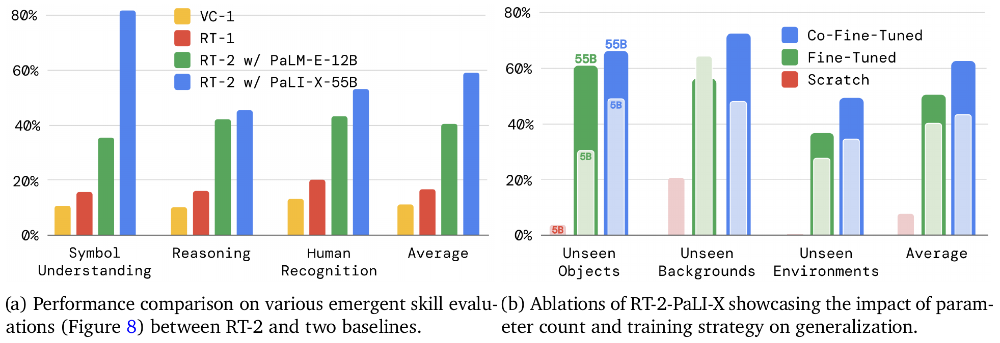

**Original caption:** Figure 6 | Quantitative performance of RT-2 across (6a) emergent skills and (6b) size and training ablations. Appendix Tables 5 and 6 detail the full numerical results.

**中文图注:** 图 6 | RT-2 在（6a）涌现技能与（6b）规模与训练消融上的定量性能。附录表 5 与表 6 给出完整数值结果。

**阅读提示:** 左图（6a）是涌现技能评测：按符号理解、推理、人物识别分组，比较 RT-2 与 RT-1、VC-1。右图（6b）是消融：横向比较 5B/55B 与 from scratch / fine-tuning / co-fine-tuning。注意 6b 中没有已见任务列，因为该组实验刻意只保留泛化列。

<a id="S041"></a>

## 4.3. How does the generalization vary with parameter count and other design decisions? ｜ 4.3. 泛化能力如何随参数数量与其他设计决策而变化？

<a id="S042"></a>
**Source:** p.10 S042

**Original:** For this comparison, we use RT-2-PaLI-X model because of its flexibility in terms of the model size (due to the nature of PaLM-E, RT-2-PaLM-E is restricted to only certain sizes of PaLM and ViT models). In particular, we compare two different model sizes, 5B and 55B, as well as three different training routines: training a model from scratch, without using any weights from the VLM pre-training; fine-tuning a pre-trained model using robot action data only; and co-fine-tuning (co-training with fine-tuning), the primary method used in this work where we use both the original VLM training data as well as robotic data for VLM fine-tuning. Since we are mostly interested in the generalization aspects of these models, we remove the seen tasks evaluation from this set of experiments.

**中文:** 在这项比较中，我们使用 RT-2-PaLI-X 模型，因为它在模型规模上更灵活（由于 PaLM-E 的性质，RT-2-PaLM-E 仅限于特定规模的 PaLM 与 ViT 组合）。具体而言，我们比较两种不同的模型规模，即 5B 与 55B，以及三种不同的训练流程：完全不使用 VLM 预训练权重、从头训练一个模型；仅使用机器人动作数据微调一个预训练模型；以及**联合微调**（微调与协同训练，co-training with fine-tuning），即本工作所采用的主要方法——**在 VLM 微调时同时使用原始 VLM 训练数据与机器人数据**。由于我们最关心这些模型的泛化方面，我们从这组实验中移除了已见任务评测。

<a id="S043"></a>
**Source:** p.10 S043

**Original:** The results of the ablations are presented in Figure 6b and Appendix Table 6. First, we observe that training a very large model from scratch results in a very poor performance even for the 5B model. Given this result, we decide to skip the evaluation of an even bigger 55B PaLI-X model when trained from scratch. Second, we notice that co-fine-tuning a model (regardless of its size) results in a better generalization performance than simply fine-tuning it with robotic data. We attribute this to the fact that keeping the original data around the fine-tuning part of training, allows the model to not forget its previous concepts learned during the VLM training. Lastly, somewhat unsurprisingly, we notice that the increased size of the model results in a better generalization performance.

**中文:** 消融实验的结果见图 6b 与附录表 6。首先，我们观察到从头训练一个非常大的模型会导致非常差的性能，即使是 5B 模型也是如此。鉴于这一结果，我们决定跳过对更大的 55B PaLI-X 模型从头训练时的评测。其次，我们注意到联合微调一个模型（无论其规模大小）比仅用机器人数据微调它带来更好的泛化性能。我们把这一点归因于：在训练的微调阶段保留原始数据，使模型不至于遗忘其在 VLM 训练期间学到的既有概念。最后，毫不意外地，我们注意到模型规模增大带来了更好的泛化性能。

<a id="S044"></a>

## 4.4. Can RT-2 exhibit signs of chain-of-thought reasoning similarly to vision-language models? ｜ 4.4. RT-2 能否像视觉-语言模型那样表现出思维链推理的迹象？

<a id="S045"></a>
**Source:** p.10 S045

**Original:** Inspired by the chain-of-thought prompting method in LLMs (Wei et al., 2022), we fine-tune a variant of RT-2 with PaLM-E for just a few hundred gradient steps to increase its capability of utilizing language and actions jointly with the hope that it will elicit a more sophisticated reasoning behavior. We augment the data to include an additional "Plan" step, which describes the purpose of the action that the robot is about to take in natural language first, which is then followed by the actual action tokens, e.g. "Instruction: I'm hungry. Plan: pick rxbar chocolate. Action: 1 128 124 136 121 158 111 255." This data augmentation scheme acts as a bridge between VQA datasets (visual reasoning) and manipulation datasets (generating actions).

**中文:** 受 LLM 中思维链提示方法（Wei et al., 2022）的启发，我们用 PaLM-E 对 RT-2 的一个变体仅微调了数百个梯度步，以提升其联合利用语言与动作的能力，并期望这能激发出更复杂的推理行为。我们对数据做了增广，加入一个额外的<mark>“Plan”步骤：先用自然语言描述机器人即将执行的动作的目的，随后再给出实际的动作 token，例如“Instruction: I'm hungry. Plan: pick rxbar chocolate. Action: 1 128 124 136 121 158 111 255.”</mark>。这种数据增广方案充当了 VQA 数据集（视觉推理）与操作数据集（生成动作）之间的桥梁。

<a id="S046"></a>
**Source:** p.10 S046

**Original:** We qualitatively observe that RT-2 with chain-of-thought reasoning is able to answer more sophisticated commands due to the fact that it is given a place to plan its actions in natural language first. This is a promising direction that provides some initial evidence that using LLMs or VLMs as planners (Ahn et al., 2022; Driess et al., 2023) can be combined with low-level policies in a single VLA model. Rollouts of RT-2 with chain-of-thought reasoning are shown in Figure 7 and in Appendix I.

**中文:** 我们在定性上观察到，带有思维链推理的 RT-2 能够回答更复杂的指令，原因是它被给予了先以自然语言规划其动作的空间。这是一个有前景的方向，它提供了初步证据，表明把 LLM 或 VLM 用作规划器（Ahn et al., 2022; Driess et al., 2023）可以与低层策略结合在同一个 VLA 模型中。带有思维链推理的 RT-2 执行过程展示在图 7 与附录 I 中。

<a id="F007"></a>
### Fig. 7. 思维链推理的执行示例

**Placed near:** p.10 S046
**Source:** p.11 F007

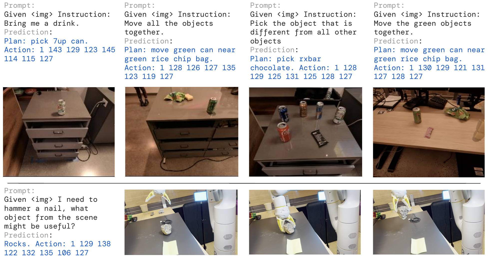

**Original caption:** Figure 7 | Rollouts of RT-2 with chain-of-thought reasoning, where RT-2 generates both a plan and an action.

**中文图注:** 图 7 | 带有思维链推理的 RT-2 执行过程，其中 RT-2 同时生成一个计划与一个动作。

**阅读提示:** 每一行是一个思维链样例：先给出 Prompt（含图像与指令），再给出 Plan（自然语言计划），最后给出 Action（动作 token 串）。四列分别是“把饮料拿来”“挑不同类的物体”“挑即将掉落的袋子”“按同样颜色移动物体”。看这张图时要注意 Plan 是模型自己生成的，而不是人工写死的。

<a id="S047"></a>

## 5. Limitations ｜ 5. 局限

<a id="S048"></a>
**Source:** p.11 S048

**Original:** Even though RT-2 exhibits promising generalization properties, there are multiple limitations of this approach. First, although we show that including web-scale pretraining via VLMs boosts generalization over semantic and visual concepts, the robot does not acquire any ability to perform new motions by virtue of including this additional experience. The model's physical skills are still limited to the distribution of skills seen in the robot data (see Appendix G), but it learns to deploy those skills in new ways. We believe this is a result of the dataset not being varied enough along the axes of skills. An exciting direction for future work is to study how new skills could be acquired through new data collection paradigms such as videos of humans.

**中文:** 尽管 RT-2 展现出了颇具前景的泛化特性，但该方法仍存在多项局限。首先，虽然我们表明通过 VLM 引入网络规模的预训练能够提升对语义与视觉概念的泛化，但机器人并不会因为获得了这些额外经验而具备执行新运动的能力。**模型的物理技能仍受限于机器人数据中出现的技能分布（见附录 G），但它学会了以新的方式运用这些技能。**我们认为这是**数据集在技能维度上多样性不足**所致。未来工作一个令人兴奋的方向，是<mark>研究如何通过新的数据采集范式（例如人类视频）来获得新技能</mark>。

<a id="S049"></a>
**Source:** p.11 S049

**Original:** Second, although we showed we could run large VLA models in real time, the computation cost of these models is high, and as these methods are applied to settings that demand high-frequency control, real-time inference may become a major bottleneck. An exciting direction for future research is to explore quantization and distillation techniques that might enable such models to run at higher rates or on lower-cost hardware. This is also connected to another current limitation in that there are only a small number of generally available VLM models that can be used to create RT-2. We hope that more open-sourced models will become available (e.g. https://llava-vl.github.io/ ) and the proprietary ones will open up their fine-tuning APIs, which is a sufficient requirement to build VLA models.

**中文:** 其次，尽管我们展示了可以实时运行大型 VLA 模型，但这类模型的计算成本很高，而当这些方法被应用于需要高频控制的场景时，**实时推理可能成为主要瓶颈**。未来研究一个令人兴奋的方向，是探索量化与蒸馏技术，使这类模型能够以更高的频率运行，或运行在成本更低的硬件上。这也与当前另一个局限相关：目前只有少数可普遍获取的 VLM 模型可用于构建 RT-2。我们希望会有更多开源模型出现（例如 https://llava-vl.github.io/ ），也希望专有模型开放其微调 API——这是构建 VLA 模型的充分必要条件。

<a id="S050"></a>

## 6. Conclusions ｜ 6. 结论

<a id="S051"></a>
**Source:** p.11-p.12 S051

**Original:** In this paper, we described how vision-language-action (VLA) models could be trained by combining vision-language model (VLM) pretraining with robotic data. We then presented two instantiations of VLAs based on PaLM-E and PaLI-X, which we call RT-2-PaLM-E and RT-2-PaLI-X. These models are cofine-tuned with robotic trajectory data to output robot actions, which are represented as text tokens. We showed that our approach results in very performant robotic policies and, more importantly, leads to a significantly better generalization performance and emergent capabilities inherited from web-scale vision-language pretraining. We believe that this simple and general approach shows a promise of robotics directly benefiting from better vision-language models, which puts the field of robot learning in a strategic position to further improve with advancements in other fields.

**中文:** 本文描述了如何通过把视觉-语言模型（VLM）预训练与机器人数据相结合来训练视觉-语言-动作（VLA）模型。随后我们提出了两个基于 PaLM-E 与 PaLI-X 的 VLA 实例，分别称为 RT-2-PaLM-E 与 RT-2-PaLI-X。这些模型用机器人轨迹数据联合微调，以输出被表示为文本 token 的机器人动作。我们表明，我们的方法带来了性能极佳的机器人策略，而且更重要的是，带来了显著更好的泛化性能，以及从网络规模视觉-语言预训练中继承的涌现能力。我们相信，这一简单而通用的方法展示了机器人技术直接从更好的视觉-语言模型中受益的前景，也把机器人学习领域置于一个可以从其他领域的进展中持续改进的战略位置。

<a id="S052"></a>

## Acknowledgments ｜ 致谢

<a id="S053"></a>
**Source:** p.12 S053

**Original:** We would like to acknowledge Fred Alcober, Jodi Lynn Andres, Carolina Parada, Joseph Dabis, Rochelle Dela Cruz, Jessica Gomez, Gavin Gonzalez, John Guilyard, Tomas Jackson, Jie Tan, Scott Lehrer, Dee M, Utsav Malla, Sarah Nguyen, Jane Park, Emily Perez, Elio Prado, Jornell Quiambao, Clayton Tan, Jodexty Therlonge, Eleanor Tomlinson, Wenxuan Zhou, and the greater Google DeepMind team for their feedback and contributions.

**中文:** 我们谨向 Fred Alcober、Jodi Lynn Andres、Carolina Parada、Joseph Dabis、Rochelle Dela Cruz、Jessica Gomez、Gavin Gonzalez、John Guilyard、Tomas Jackson、Jie Tan、Scott Lehrer、Dee M、Utsav Malla、Sarah Nguyen、Jane Park、Emily Perez、Elio Prado、Jornell Quiambao、Clayton Tan、Jodexty Therlonge、Eleanor Tomlinson、Wenxuan Zhou，以及整个 Google DeepMind 团队致谢，感谢他们的反馈与贡献。

<a id="S054"></a>

## A. Contributions ｜ A. 作者贡献

<a id="S055"></a>
**Source:** p.19 S055

**Original:** Training and Evaluations (designing and executing procedures for training models, evaluating models in simulation and the real world, running ablations for algorithm design choices) : Yevgen Chebotar, Krzysztof Choromanski, Tianli Ding, Danny Driess, Avinava Dubey, Pete Florence, Chuyuan Fu, Montse Gonzalez Arenas, Keerthana Gopalakrishnan, Kehang Han, Alexander Herzog, Brian Ichter, Alex Irpan, Isabel Leal, Lisa Lee, Yao Lu, Henryk Michalewski, Igor Mordatch, Karl Pertsch, Michael Ryoo, Anikait Singh, Quan Vuong, Ayzaan Wahid, Paul Wohlhart, Fei Xia, Ted Xiao, and Tianhe Yu.

**中文:** 训练与评测（设计并执行模型训练流程、在仿真与真实世界中评测模型、为算法设计运行消融实验）：Yevgen Chebotar, Krzysztof Choromanski, Tianli Ding, Danny Driess, Avinava Dubey, Pete Florence, Chuyuan Fu, Montse Gonzalez Arenas, Keerthana Gopalakrishnan, Kehang Han, Alexander Herzog, Brian Ichter, Alex Irpan, Isabel Leal, Lisa Lee, Yao Lu, Henryk Michalewski, Igor Mordatch, Karl Pertsch, Michael Ryoo, Anikait Singh, Quan Vuong, Ayzaan Wahid, Paul Wohlhart, Fei Xia, Ted Xiao, and Tianhe Yu.

<a id="S056"></a>
**Source:** p.19 S056

**Original:** Network Architecture (designing and implementing model network modules, working on tokenization of actions, enabling inference of the model networks during experiments) : Yevgen Chebotar, Xi Chen, Krzysztof Choromanski, Danny Driess, Pete Florence, Keerthana Gopalakrishnan, Kehang Han, Karol Hausman, Brian Ichter, Alex Irpan, Isabel Leal, Lisa Lee, Henryk Michalewski, Igor Mordatch, Kanishka Rao, Michael Ryoo, Anikait Singh, Quan Vuong, Ayzaan Wahid, Jialin Wu, Fei Xia, Ted Xiao, and Tianhe Yu.

**中文:** 网络架构（设计并实现模型网络模块、研究动作的分词、在实验中实现模型网络的推理）：Yevgen Chebotar, Xi Chen, Krzysztof Choromanski, Danny Driess, Pete Florence, Keerthana Gopalakrishnan, Kehang Han, Karol Hausman, Brian Ichter, Alex Irpan, Isabel Leal, Lisa Lee, Henryk Michalewski, Igor Mordatch, Kanishka Rao, Michael Ryoo, Anikait Singh, Quan Vuong, Ayzaan Wahid, Jialin Wu, Fei Xia, Ted Xiao, and Tianhe Yu.

<a id="S057"></a>
**Source:** p.19 S057

**Original:** Data Collection (collecting data on real robots, running real robot evaluations, executing operations required for running real robots) : Noah Brown, Justice Carbajal, Tianli Ding, Krista Reymann, Grecia Salazar, Pierre Sermanet, Jaspiar Singh, Huong Tran, Stefan Welker, and Sichun Xu.

**中文:** 数据采集（在真实机器人上采集数据、运行真实机器人评测、执行运行真实机器人所需的各种操作）：Noah Brown, Justice Carbajal, Tianli Ding, Krista Reymann, Grecia Salazar, Pierre Sermanet, Jaspiar Singh, Huong Tran, Stefan Welker, and Sichun Xu.

<a id="S058"></a>
**Source:** p.19 S058

**Original:** Leadership (leading the project efforts, managing the project staff, advising on project directions) : Yevgen Chebotar, Chelsea Finn, Karol Hausman, Brian Ichter, Sergey Levine, Yao Lu, Igor Mordatch, Kanishka Rao, Pannag Sanketi, Radu Soricut, Vincent Vanhoucke, and Tianhe Yu.

**中文:** 领导（领导项目工作、管理项目人员、就项目方向提供建议）：Yevgen Chebotar, Chelsea Finn, Karol Hausman, Brian Ichter, Sergey Levine, Yao Lu, Igor Mordatch, Kanishka Rao, Pannag Sanketi, Radu Soricut, Vincent Vanhoucke, and Tianhe Yu.

<a id="S059"></a>
**Source:** p.19 S059

**Original:** Paper (working on the paper manuscript, designing paper visualizations and figures) : Yevgen Chebotar, Danny Driess, Chelsea Finn, Pete Florence, Karol Hausman, Brian Ichter, Lisa Lee, Sergey Levine, Igor Mordatch, Karl Pertsch, Quan Vuong, Fei Xia, Ted Xiao, and Tianhe Yu.

**中文:** 论文（撰写论文稿件、设计论文可视化与插图）：Yevgen Chebotar, Danny Driess, Chelsea Finn, Pete Florence, Karol Hausman, Brian Ichter, Lisa Lee, Sergey Levine, Igor Mordatch, Karl Pertsch, Quan Vuong, Fei Xia, Ted Xiao, and Tianhe Yu.

<a id="S060"></a>
**Source:** p.19 S060

**Original:** Infrastructure (working on infrastructure and code base backbone needed for training models, running experiments, storing and accessing data) : Anthony Brohan, Yevgen Chebotar, Danny Driess, Kehang Han, Jasmine Hsu, Brian Ichter, Alex Irpan, Nikhil Joshi, Ryan Julian, Dmitry Kalashnikov, Yuheng Kuang, Isabel Leal, Lisa Lee, Tsang-Wei Edward Lee, Yao Lu, Igor Mordatch, Quan Vuong, Ayzaan Wahid, Fei Xia, Ted Xiao, Peng Xu, and Tianhe Yu.

**中文:** 基础设施（负责训练模型所需的基础设施与代码库主干、运行实验、存储与访问数据）：Anthony Brohan, Yevgen Chebotar, Danny Driess, Kehang Han, Jasmine Hsu, Brian Ichter, Alex Irpan, Nikhil Joshi, Ryan Julian, Dmitry Kalashnikov, Yuheng Kuang, Isabel Leal, Lisa Lee, Tsang-Wei Edward Lee, Yao Lu, Igor Mordatch, Quan Vuong, Ayzaan Wahid, Fei Xia, Ted Xiao, Peng Xu, and Tianhe Yu.

<a id="S061"></a>

## B. Datasets ｜ B. 数据集

<a id="S062"></a>
**Source:** p.19 S062

**Original:** The vision-language datasets are based on the dataset mixtures from Chen et al. (2023b) and Driess et al. (2023). The bulk of this data consists of the WebLI dataset, which is around 10B image-text pairs across 109 languages, filtered to the top 10% scoring cross-modal similarity examples to give 1B training examples. Many other captioning and vision question answering datasets are included as well, and more info on the dataset mixtures can be found in Chen et al. (2023b) for RT-2-PaLI-X, and Driess et al. (2023) for RT-2-PaLM-E. When co-fine-tuning RT-2-PaLI-X, we do not use the Episodic WebLI dataset described by Chen et al. (2023a).

**中文:** 视觉-语言数据集基于 Chen et al. (2023b) 与 Driess et al. (2023) 的数据配比。这些数据的主体是 WebLI 数据集，它包含约 10B 图文对、覆盖 109 种语言，经筛选保留跨模态相似度得分最高的前 10%，最终得到 1B 训练样例。此外还包含许多其他图像描述与视觉问答数据集；关于数据配比的更多信息可参见 Chen et al. (2023b)（对应 RT-2-PaLI-X）与 Driess et al. (2023)（对应 RT-2-PaLM-E）。在联合微调 RT-2-PaLI-X 时，我们不使用 Chen et al. (2023a) 所描述的 Episodic WebLI 数据集。

<a id="S063"></a>
**Source:** p.19-p.20 S063

**Original:** The robotics dataset is based on the dataset from Brohan et al. (2022). This consists of demonstration episodes collected with a mobile manipulation robot. Each demonstration is annotated with a natural language instruction from one of seven skills: "Pick Object ", "Move Object Near Object ", "Place Object Upright", "Knock Object Over", "Open Drawer ", "Close Drawer ", "Place Object into Receptacle ", and "Pick Object from Receptacle and place on the counter". Further details can be found in Brohan et al. (2022). RT-2-PaLI-X weights the robotics dataset such that it makes up about 50% of the training mixture for co-fine-tuning. RT-2-PaLM-E weights the robotics dataset to be about 66% of the training mixture.

**中文:** 机器人数据集基于 Brohan et al. (2022) 的数据集。它由使用移动操作机器人采集的示范回合组成。每条示范都标注了七种技能之一的自然语言指令：“Pick Object ”“Move Object Near Object ”“Place Object Upright”“Knock Object Over”“Open Drawer ”“Close Drawer ”“Place Object into Receptacle ”，以及“Pick Object from Receptacle and place on the counter”。更多细节见 Brohan et al. (2022)。RT-2-PaLI-X 对机器人数据集加权，使其在联合微调的训练配比中约占 50%。RT-2-PaLM-E 对机器人数据集加权，使其约占训练配比的 66%。

<a id="S064"></a>
**Source:** p.20 S064

**Original:** For the results on Language-Table in Table 1, our model is trained on the Language-Table datasets from Lynch et al. (2022). Our model is co-fine-tuned on several prediction tasks: (1) predict the action, given two consecutive image frames and a text instruction; (2) predict the instruction, given image frames; (3) predict the robot arm position, given image frames; (4) predict the number of timesteps between given image frames; and (5) predict whether the task was successful, given image frames and the instruction.

**中文:** 对于表 1 中的 Language-Table 结果，我们的模型在 Lynch et al. (2022) 的 Language-Table 数据集上训练。我们的模型在若干预测任务上进行了联合微调：（1）给定两帧连续图像和一条文本指令，预测动作；（2）给定图像帧，预测指令；（3）给定图像帧，预测机器人手臂位置；（4）预测给定图像帧之间的时间步数；（5）给定图像帧与指令，预测任务是否成功。

<a id="S065"></a>

## C. Baselines ｜ C. 基线

<a id="S066"></a>
**Source:** p.20 S066

**Original:** We compare our method to multiple state-of-the-art baselines that challenge different aspects of our method. All of the baselines use the exact same robotic data.

**中文:** 我们把我们的方法与多个当前最先进的基线进行比较，这些基线针对我们方法的不同方面提出挑战。所有基线都使用完全相同的机器人数据。

<a id="S067"></a>
**Source:** p.20 S067

**Original:** - RT-1: Robotics Transformer 1 Brohan et al. (2022) is a transformer-based model that achieved state-of-the-art performance on a similar suite of tasks when it was published. The model does not use VLM-based pre-training so it provides an important data point demonstrating whether VLM-based pre-training matters.

**中文:** - RT-1：Robotics Transformer 1（Brohan et al., 2022）是一个基于 Transformer 的模型，在其发表时在一套类似任务上取得了当前最先进的性能。该模型不使用基于 VLM 的预训练，因此它提供了一个重要的数据点，用以说明基于 VLM 的预训练是否重要。

<a id="S068"></a>
**Source:** p.20 S068

**Original:** - VC-1: VC-1 Majumdar et al. (2023a) is a visual foundation model that uses pre-trained visual representations specifically designed for robotics tasks. We use pre-trained representations from the VC-1 ViT-L model. Since VC-1 does not include language conditioning, we add this by separately embedding the language command via Universal Sentence Encoder Cer et al. (2018) to enable comparison to our method. In particular, we concatenate the resulting language embedding tokens to the image tokens produced by VC-1, and pass the concatenated token sequences through token learner Ryoo et al. (2021). The token sequences produced by token learner are then consumed by an RT-1 decoder-only transformer model to predict robot action tokens. We train the VC-1 baseline end-to-end and unfreeze the VC-1 weights during training, since this led to far better results than using frozen VC-1 weights.

**中文:** - VC-1：VC-1（Majumdar et al., 2023a）是一个视觉基础模型，使用了专为机器人任务设计的预训练视觉表征。我们使用 VC-1 ViT-L 模型的预训练表征。由于 VC-1 不包含语言条件，我们通过 Universal Sentence Encoder（Cer et al., 2018）单独嵌入语言指令来补充这一点，以便与我们的方法比较。具体而言，我们把得到的语言嵌入 token 与 VC-1 产生的图像 token 拼接，并把拼接后的 token 序列送入 token learner（Ryoo et al., 2021）。token learner 产生的 token 序列随后被一个 RT-1 仅解码器 Transformer 模型消费，以预测机器人动作 token。我们端到端训练 VC-1 基线，并在训练中解冻 VC-1 的权重，因为这样做比使用冻结的 VC-1 权重效果好得多。

<a id="S069"></a>
**Source:** p.20 S069

**Original:** - R3M: R3M Nair et al. (2022b) is a similar method to VC-1 in that R3M uses pre-trained visual-language representations to improve policy training. In this case the authors use Ego4D dataset Grauman et al. (2022) of human activities to learn the representation that is used by the policy. Both VC-1 and R3M test different state-of-the-art representation learning methods as an alternative to using a VLM. To obtain a language-conditioned policy from the R3M pretrained representation, we follow the same procedure as described above for VC-1, except we use the R3M ResNet50 model to obtain the image tokens, and unfreeze it during training.

**中文:** - R3M：R3M（Nair et al., 2022b）与 VC-1 方法类似，同样使用预训练的视觉-语言表征来改进策略训练。在这里，作者使用人类活动数据集 Ego4D（Grauman et al., 2022）来学习供策略使用的表征。VC-1 与 R3M 都在测试不同的当前最先进表征学习方法，作为使用 VLM 的替代方案。为了从 R3M 预训练表征得到语言条件策略，我们采用与上面对 VC-1 描述相同的流程，只是改用 R3M ResNet50 模型来获得图像 token，并在训练中解冻它。

<a id="S070"></a>
**Source:** p.20 S070

**Original:** - MOO: MOO Stone et al. (2023) is an object-centric approach, where a VLM is first used to specify the object of interest in a form of a single, colored pixel in the original image. This pixelmodified image is then trained with an end-to-end policy to accomplish a set of manipulation tasks. This baseline corresponds to a situation where a VLM is used as a separate module that enhances perception but its representations are not used for policy learning.

**中文:** - MOO：MOO（Stone et al., 2023）是一种以物体为中心的方法：先由 VLM 以原始图像中单个彩色像素的形式指定感兴趣的物体，再用端到端策略在这个被“像素修改”过的图像上训练，以完成一组操作任务。该基线对应的情况是：VLM 被用作一个独立的、增强感知的模块，但其表征并不用于策略学习。

<a id="S071"></a>

## D. VLMs for RT-2 ｜ D. RT-2 所用的 VLM

<a id="S072"></a>
**Source:** p.20-p.21 S072

**Original:** The PaLI-X model architecture consists of a ViT-22B Dehghani et al. (2023) to process images, which can accept sequences of 𝑛 images, leading to 𝑛 × 𝑘 tokens per image, where 𝑘 is the number of patches per image. The image tokens passing over a projection layer is then consumed by an encoder-decoder backbone of 32B parameters and 50 layers, similar to UL2 Tay et al. (2023), which jointly processes text and images as embeddings to generate output tokens in an auto-regressive manner. The text input usually consists of the type of task and any additional context (e.g., "Generate caption in ⟨ lang ⟩ " for captioning tasks or "Answer in ⟨ lang ⟩ : question" for VQA tasks).

**中文:** PaLI-X 的模型架构包含一个 ViT-22B（Dehghani et al., 2023）来处理图像，它可以接受 n 个图像的序列，每张图像产生 n × k 个 token，其中 k 是每张图像的 patch 数。图像 token 经过一个投影层后，被一个 32B 参数、50 层的编码器-解码器主干网络消费，该主干类似 UL2（Tay et al., 2023），它把文本与图像作为嵌入联合处理，以自回归方式生成输出 token。文本输入通常由任务类型与任何附加上下文组成（例如，图像描述任务使用“Generate caption in ⟨ lang ⟩ ”，VQA 任务使用“Answer in ⟨ lang ⟩ : question”）。

<a id="S073"></a>
**Source:** p.21 S073

**Original:** The PaLI-3B model trained on Language-Table (Table 1) uses a smaller ViT-G/14 (Zhai et al., 2022) (2B parameters) to process images, and UL2-3B (Tay et al., 2023) for the encoder-decoder network. The PaLM-E model is based on a decoder-only LLM that projects robot data such as images and text into the language token space and outputs text such as high-level plans. In the case of the used PaLM-E-12B, the visual model used to project images to the language embedding space is a ViT-4B Chen et al. (2023b). The concatenation of continuous variables to textual input allows PaLM-E to be fully multimodal, accepting a wide variety of inputs such as multiple sensor modalities, object-centric representations, scene representations and object entity referrals.

**中文:** 在 Language-Table（表 1）上训练的 PaLI-3B 模型使用更小的 ViT-G/14（Zhai et al., 2022）（2B 参数）来处理图像，并使用 UL2-3B（Tay et al., 2023）作为编码器-解码器网络。PaLM-E 模型基于一个仅解码器 LLM，它把图像与文本等机器人数据投影到语言 token 空间，并输出诸如高层计划之类的文本。在所使用的 PaLM-E-12B 中，用于把图像投影到语言嵌入空间的视觉模型是 ViT-4B（Chen et al., 2023b）。把连续变量与文本输入拼接，使 PaLM-E 成为完全多模态的模型，可以接受多种多样的输入，例如多种传感器模态、以物体为中心的表征、场景表征以及物体实体指代。

<a id="S074"></a>

## E. Training Details ｜ E. 训练细节

<a id="S075"></a>
**Source:** p.21 S075

**Original:** We perform co-fine-tuning on pre-trained models from the PaLI-X (Chen et al., 2023a) 5B & 55B model, PaLI (Chen et al., 2023b) 3B model and the PaLM-E (Driess et al., 2023) 12B model. For RT-2-PaLI-X-55B, we use learning rate 1e-3 and batch size 2048 and co-fine-tune the model for 80K gradient steps whereas for RT-2-PaLI-X-5B, we use the same learning rate and batch size and co-fine-tune the model for 270K gradient steps. For RT-2-PaLM-E-12B, we use learning rate 4e-4 and batch size 512 to co-fine-tune the model for 1M gradient steps. Both models are trained with the next token prediction objective, which corresponds to the behavior cloning loss in robot learning. For RT-2-PaLI-3B model used for Language-Table results in Table 1, we use learning rate 1e-3 and batch size 128 to co-fine-tune the model for 300K gradient steps.

**中文:** 我们对来自 PaLI-X（Chen et al., 2023a）5B 与 55B 模型、PaLI（Chen et al., 2023b）3B 模型以及 PaLM-E（Driess et al., 2023）12B 模型的预训练模型执行联合微调。对 RT-2-PaLI-X-55B，我们使用学习率 1e-3、批大小 2048，联合微调 80K 个梯度步；而对 RT-2-PaLI-X-5B，我们使用相同的学习率与批大小，联合微调 270K 个梯度步。对 RT-2-PaLM-E-12B，我们使用学习率 4e-4、批大小 512，联合微调 1M 个梯度步。两个模型都以下一 token 预测为目标进行训练，这对应于机器人学习中的行为克隆损失。对于表 1 中 Language-Table 结果所用的 RT-2-PaLI-3B 模型，我们使用学习率 1e-3、批大小 128，联合微调 300K 个梯度步。

<a id="S076"></a>

## F. Evaluation Details ｜ F. 评测细节

<a id="S077"></a>

### F.1. Evaluation Scenarios ｜ F.1. 评测场景

<a id="S078"></a>
**Source:** p.21 S078

**Original:** For studying the emergent capabilities of RT-2 in a quantitative manner, we study various challenging semantic evaluation scenarios that aim to measure capabilities such as reasoning, symbol understanding, and human recognition. A visual overview of a subset of these scenes is provided in Figure 8, and the full list of instructions used for quantiative evalution is shown in Table 3.

**中文:** 为了以定量方式研究 RT-2 的涌现能力，我们研究了多种具有挑战性的语义评测场景，旨在度量推理、符号理解与人物识别等能力。这些场景中的一个子集在图 8 中给出可视化概览，用于定量评测的完整指令清单见表 3。

<a id="F008"></a>
### Fig. 8. 涌现能力评测场景总览

**Placed near:** p.21 S078
**Source:** p.22 F008

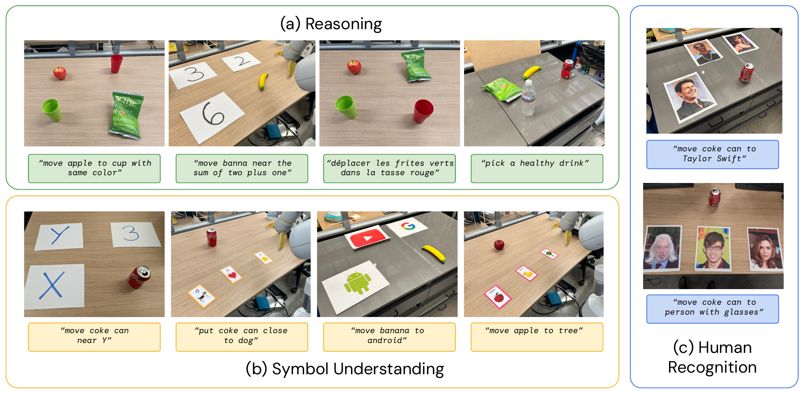

**Original caption:** Figure 8 | An overview of some of the evaluation scenarios used to study the emergent capabilities of RT-2. They focus on three broad categories, which are (a) reasoning, (b) symbol understanding, and (c) human recognition. The visualized instructions are a subset of the full instructions, which are listed in Appendix F.2.

**中文图注:** 图 8 | 用于研究 RT-2 涌现能力的一些评测场景概览。它们聚焦于三个大类，即（a）推理、（b）符号理解与（c）人物识别。图中可视化的指令是全部指令的一个子集，完整清单见附录 F.2。

**阅读提示:** 这是附录中的评测场景总览，按（a）推理、（b）符号理解、（c）人物识别三大类组织。每张小图下方标有对应的自然语言指令，可以直观看出这些指令如何在场景中“落地”。完整指令清单见表 3。

> 更早的指路位置：S040（p.9，正文以“Appendix Figure 8”先行指路）。

<a id="T003"></a>
### Table 3. 定量涌现评测所用的自然语言指令

**Placed near:** p.21 S078
**Source:** p.22 T003

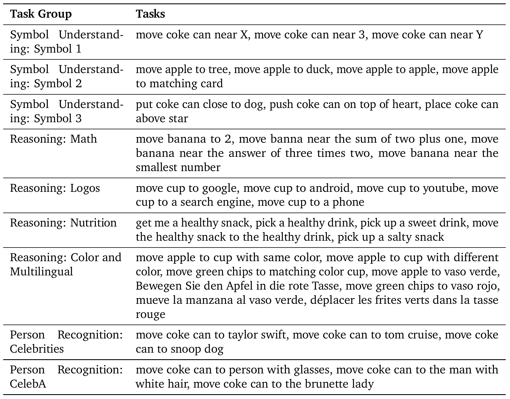

**Original caption:** Table 3 | Natural language instructions used for quantitative emergent evalutions.

**中文图注:** 表 3 | 用于定量涌现评测的自然语言指令。

**表格转录（本阅读稿整理）：** 原表为两列（Task Group / Tasks），共九行（含子组）。条目由 PDF 文本层整理；“banna”“coke can”等拼写按原表照录。

| Task Group | Tasks |
|---|---|
| Symbol Understanding: Symbol 1 | move coke can near X, move coke can near 3, move coke can near Y |
| Symbol Understanding: Symbol 2 | move apple to tree, move apple to duck, move apple to apple, move apple to matching card |
| Symbol Understanding: Symbol 3 | put coke can close to dog, push coke can on top of heart, place coke can above star |
| Reasoning: Math | move banana to 2, move banna near the sum of two plus one, move banana near the answer of three times two, move banana near the smallest number |
| Reasoning: Logos | move cup to google, move cup to android, move cup to youtube, move cup to a search engine, move cup to a phone |
| Reasoning: Nutrition | get me a healthy snack, pick a healthy drink, pick up a sweet drink, move the healthy snack to the healthy drink, pick up a salty snack |
| Reasoning: Color and Multilingual | move apple to cup with same color, move apple to cup with different color, move green chips to matching color cup, move apple to vaso verde, Bewegen Sie den Apfel in die rote Tasse, move green chips to vaso rojo, mueve la manzana al vaso verde, déplacer les frites verts dans la tasse rouge |
| Person Recognition: Celebrities | move coke can to taylor swift, move coke can to tom cruise, move coke can to snoop dog |
| Person Recognition: CelebA | move coke can to person with glasses, move coke can to the man with white hair, move coke can to the brunette lady |

**阅读提示:** 这是涌现评测的指令清单表。七个任务组分别对应本稿正文（S040）中描述的三类能力：符号理解（Symbol 1–3）、推理（Math / Logos / Nutrition / Color and Multilingual）、人物识别（Celebrities / CelebA）。

<a id="S079"></a>

### F.2. Evaluation Instructions ｜ F.2. 评测指令

<a id="S080"></a>
**Source:** p.21 S080

**Original:** Table 2 lists natural language instructions used in model evaluations for unseen objects, backgrounds, and environments. Each instruction was run between 1-5 times, depending on the number of total instructions in that evaluation set. Table 3 lists natural language instructions used to evaluate quantitative emergent evals. Each instruction was run 5 times.

**中文:** 表 2 列出了在针对未见物体、背景与环境的模型评测中使用的自然语言指令。每条指令运行 1-5 次，具体次数取决于该评测集中指令的总数。表 3 列出了用于评测定量涌现能力的自然语言指令。每条指令运行 5 次。

<a id="T002"></a>
### Table 2. 分布偏移评测所用的自然语言指令

**Placed near:** p.21 S080
**Source:** p.26 T002

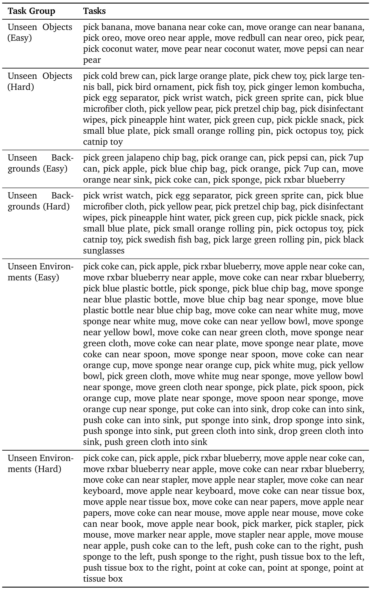

**Original caption:** Table 2 | Natural language instructions used for evaluations testing controlled distribution shifts along the dimension of novel objects, novel environments, and novel backgrounds. For each category, we introduce evaluation settings with smaller distribution shifts as well as larger distribution shifts. A visualization of these scenarios if shown in Figure 3.

**中文图注:** 表 2 | 用于评测在新颖物体、新颖环境与新颖背景维度上受控分布偏移的自然语言指令。对每个类别，我们引入了分布偏移较小的评测设定以及分布偏移较大的评测设定。这些场景的可视化见图 3。

**表格转录（本阅读稿整理）：** 原表为两列（Task Group / Tasks），共六组。条目由 PDF 文本层整理，原表中的连字符断字（如 “ten-nis”）已复原。

**Unseen Objects (Easy)**：pick banana, move banana near coke can, move orange can near banana, pick oreo, move oreo near apple, move redbull can near oreo, pick pear, pick coconut water, move pear near coconut water, move pepsi can near pear

**Unseen Objects (Hard)**：pick cold brew can, pick large orange plate, pick chew toy, pick large tennis ball, pick bird ornament, pick fish toy, pick ginger lemon kombucha, pick egg separator, pick wrist watch, pick green sprite can, pick blue microfiber cloth, pick yellow pear, pick pretzel chip bag, pick disinfectant wipes, pick pineapple hint water, pick green cup, pick pickle snack, pick small blue plate, pick small orange rolling pin, pick octopus toy, pick catnip toy

**Unseen Backgrounds (Easy)**：pick green jalapeno chip bag, pick orange can, pick pepsi can, pick 7up can, pick apple, pick blue chip bag, pick orange, pick 7up can, move orange near sink, pick coke can, pick sponge, pick rxbar blueberry

**Unseen Backgrounds (Hard)**：pick wrist watch, pick egg separator, pick green sprite can, pick blue microfiber cloth, pick yellow pear, pick pretzel chip bag, pick disinfectant wipes, pick pineapple hint water, pick green cup, pick pickle snack, pick small blue plate, pick small orange rolling pin, pick octopus toy, pick catnip toy, pick swedish fish bag, pick large green rolling pin, pick black sunglasses

**Unseen Environments (Easy)**：pick coke can, pick apple, pick rxbar blueberry, move apple near coke can, move rxbar blueberry near apple, move coke can near rxbar blueberry, pick blue plastic bottle, pick sponge, pick blue chip bag, move sponge near blue plastic bottle, move blue chip bag near sponge, move blue plastic bottle near blue chip bag, move coke can near white mug, move sponge near white mug, move coke can near yellow bowl, move sponge near yellow bowl, move coke can near green cloth, move sponge near green cloth, move coke can near plate, move sponge near plate, move coke can near spoon, move sponge near spoon, move coke can near orange cup, move sponge near orange cup, pick white mug, pick yellow bowl, pick green cloth, move white mug near sponge, move yellow bowl near sponge, move green cloth near sponge, pick plate, pick spoon, pick orange cup, move plate near sponge, move spoon near sponge, move orange cup near sponge, put coke can into sink, drop coke can into sink, push coke can into sink, put sponge into sink, drop sponge into sink, push sponge into sink, put green cloth into sink, drop green cloth into sink, push green cloth into sink

**Unseen Environments (Hard)**：pick coke can, pick apple, pick rxbar blueberry, move apple near coke can, move rxbar blueberry near apple, move coke can near rxbar blueberry, move coke can near stapler, move apple near stapler, move coke can near keyboard, move apple near keyboard, move coke can near tissue box, move apple near tissue box, move coke can near papers, move apple near papers, move coke can near mouse, move apple near mouse, move coke can near book, move apple near book, pick marker, pick stapler, pick mouse, move marker near apple, move stapler near apple, move mouse near apple, push coke can to the left, push coke can to the right, push sponge to the left, push sponge to the right, push tissue box to the left, push tissue box to the right, point at coke can, point at sponge, point at tissue box

**阅读提示:** 这是一张长指令清单表，按“未见物体/未见背景/未见环境”דeasy/hard”分为六组。读这张表时不必逐条记忆，重点是看每组指令的**偏移轴**：easy 组只换物体或场景，hard 组在同一轴上偏移更大。

> 更早的指路位置：S089（p.23，F.2 小节先声明表 2 的内容）。

<a id="S081"></a>

## G. Example Failure Cases ｜ G. 失败案例示例

<a id="S082"></a>
**Source:** p.23 S082

**Original:** In Fig. 9 we provide examples of a notable type of failure case in the Language Table setting, with the RT-2 model not generalizing to unseen object dynamics . In these cases, although the model is able to correctly attend to the language instruction and move to the first correct object, it is not able to control the challenging dynamics of these objects, which are significantly different than the small set of block objects that have been seen in this environment Lynch et al. (2022). Then pen simply rolls off the table (Fig. 9, left), while the banana's center-of-mass is far from where the robot makes contact (Fig. 9, right). We note that pushing dynamics are notoriously difficult to predict and control Yu et al. (2016). We hypothesize that greater generalization in robot-environment interaction dynamics may be possible by further scaling the datasets across diverse environments and objects - for example, in this case, datasets that include similar types of more diverse pushing dynamics Dasari et al. (2019).

**中文:** 在图 9 中，我们给出了 Language Table 设定下一类值得注意的失败案例：RT-2 模型未能泛化到未见的物体动力学。在这些案例中，尽管模型能够正确地关注语言指令并移动到第一个正确的物体，但它无法控制这些物体具有挑战性的动力学，而这些动力学与该环境中已见过的一小部分积木物体（Lynch et al., 2022）差异显著。于是笔会直接从桌上滚落（图 9 左），而香蕉的质心距离机器人施加接触的位置很远（图 9 右）。我们注意到，**推挤动力学是出了名地难以预测与控制**（Yu et al., 2016）。我们推测，若能进一步在多样化的环境与物体上扩展数据集，或许可以实现对机器人-环境交互动力学更好的泛化——例如在本例中，纳入包含更多样推挤动力学的同类数据集（Dasari et al., 2019）。

<a id="F009"></a>
### Fig. 9. 未见物体动力学上的失败案例

**Placed near:** p.23 S082
**Source:** p.23 F009

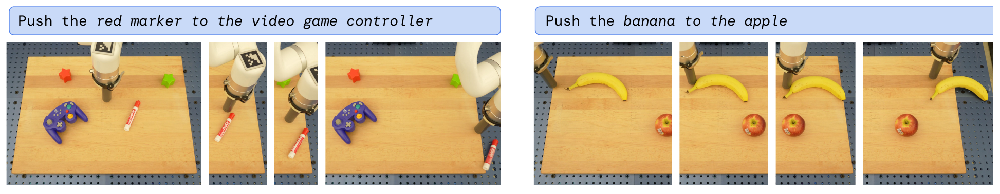

**Original caption:** Figure 9 | Qualitative example failure cases in the real-world failing to generalize to unseen object dynamics .

**中文图注:** 图 9 | 真实世界中未能泛化到未见物体动力学的定性失败案例。	

**阅读提示:** 左右两个面板分别对应两个失败案例：推红色马克笔时它直接滚落桌面；推香蕉时接触点远离其质心导致运动失控。图注强调失败原因是**未见的物体动力学**，而非指令理解错误——模型确实移动到了正确的物体。

<a id="S083"></a>
**Source:** p.23 S083

**Original:** In addition, despite RT-2's promising performance on real world manipulation tasks in qualitative and quantitative emergent evaluations, we still find numerous notable failure cases. For example, with the current training dataset composition and training method, RT-2 seemed to perform poorly at:

**中文:** 此外，尽管 RT-2 在定性及定量涌现评测中的真实世界操作任务上表现颇具前景，我们仍然发现了许多值得注意的失败案例。例如，在当前的训练数据构成与训练方法下，RT-2 在以下方面表现不佳：

<a id="S084"></a>
**Source:** p.23 S084

**Original:** - Grasping objects by specific parts, such as the handle

**中文:** - 按特定部位抓取物体，例如抓取手柄；

<a id="S085"></a>
**Source:** p.23 S085

**Original:** - Novel motions beyond what was seen in the robot data, such as wiping with a towel or tool use

**中文:** - 超出机器人数据中见过的动作范围的新运动，例如用毛巾擦拭或使用工具；

<a id="S086"></a>
**Source:** p.23 S086

**Original:** - Dexterous or precise motions, such as folding a towel

**中文:** - 灵巧或精细的动作，例如叠毛巾；

<a id="S087"></a>
**Source:** p.23 S087

**Original:** - Extended reasoning requiring multiple layers of indirection

**中文:** - 需要多层间接推理的延展性推理。

<a id="S088"></a>

## H. Quantitative Experimental Results ｜ H. 定量实验结果

<a id="S089"></a>

### H.1. Overall Performance, for Section 4.1 ｜ H.1. 整体性能（对应第 4.1 节）

<a id="S090"></a>
**Source:** p.23 S090

**Original:** Table 4 lists our quantitative overall evaluation results. We find that RT-2 performs as well or better than baselines on seen tasks and significantly outperforms baselines on generalization to unseen objects, backgrounds, and environments.

**中文:** 表 4 列出了我们的定量整体评测结果。我们发现，RT-2 在已见任务上的表现与基线相当或更好，而在对未见物体、背景与环境的泛化上显著优于基线。

<a id="T004"></a>
### Table 4. 总体评测结果（已见任务与三类泛化）

**Placed near:** p.23 S090
**Source:** p.23 T004

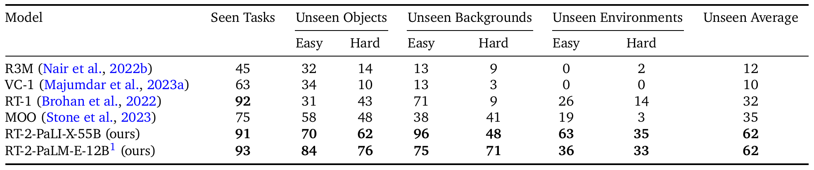

**Original caption:** Table 4 | Overall performance of two instantiations of RT-2 and baselines across seen training tasks as well as unseen evaluations measuring generalization to novel objects, novel backgrounds, and novel environments.

**中文图注:** 表 4 | 两个 RT-2 实例与基线在已见训练任务上、以及在衡量对新颖物体、新颖背景与新颖环境泛化的未见评测上的总体性能。

**表格转录（本阅读稿整理）：** 原表表头为两层：第一层为 Seen Tasks / Unseen Objects / Unseen Backgrounds / Unseen Environments / Unseen Average，第二层为各泛化列的 Easy / Hard。此处按原表的列层次转录。

| Model | Seen Tasks | Unseen Objects Easy | Unseen Objects Hard | Unseen Backgrounds Easy | Unseen Backgrounds Hard | Unseen Environments Easy | Unseen Environments Hard | Unseen Average |
|---|---|---|---|---|---|---|---|---|
| R3M (Nair et al., 2022b) | 45 | 32 | 14 | 13 | 9 | 0 | 2 | 12 |
| VC-1 (Majumdar et al., 2023a) | 63 | 34 | 10 | 13 | 3 | 0 | 0 | 10 |
| RT-1 (Brohan et al., 2022) | 92 | 31 | 43 | 71 | 9 | 26 | 14 | 32 |
| MOO (Stone et al., 2023) | 75 | 58 | 48 | 38 | 41 | 19 | 3 | 35 |
| RT-2-PaLI-X-55B (ours) | 91 | 70 | 62 | 96 | 48 | 63 | 35 | 62 |
| RT-2-PaLM-E-12B ¹ (ours) | 93 | 84 | 76 | 75 | 71 | 36 | 33 | 62 |

**阅读提示:** 这是正文 4.1 节的主结果表。列结构是：已见任务（1 列）、未见物体（easy/hard）、未见背景（easy/hard）、未见环境（easy/hard），最后一列是未见平均。RT-2-PaLI-X-55B 与 RT-2-PaLM-E-12B 的未见平均均为 62，但分布不同：PaLM-E 在 easy 上更高，PaLI-X 在 hard 上更高。

> 更早的指路位置：S035（p.8，正文以“Appendix Table 4”先行指路）。

<a id="S091"></a>
**Source:** p.24 S091

**Original:** 1 The original pre-training data mixture used in PaLM-E-12B (as described in Driess et al. (2023)) includes robot images for high-level VQA planning tasks that can be similar to images encountered in generalization scenarios. However, none of those training examples include low-level actions that are evaluated in this experiment.

**中文:** 1 PaLM-E-12B 所使用的原始预训练数据配比（如 Driess et al. (2023) 所述）包含用于高层 VQA 规划任务的机器人图像，这些图像可能与泛化场景中遇到的图像相似。然而，这些训练样例中没有任何一个包含本实验所评测的低层动作。

<a id="S092"></a>

### H.2. Emergent Evaluation, for Section 4.2 ｜ H.2. 涌现能力评测（对应第 4.2 节）

<a id="S093"></a>
**Source:** p.24 S093

**Original:** Table 5 lists all of our quantitative emergent evaluation results. We find that RT-2 performs 2x to 3x better than RT-1 on these new instructions, without any additional robotic demonstrations. This showcases how our method allows us to leverage capabilities from pretraining on web-scale vision-language datasets.

**中文:** 表 5 列出了我们全部的定量涌现评测结果。我们发现，在没有增加任何机器人示范的情况下，RT-2 在这些新指令上比 RT-1 好 2 到 3 倍。这展示了我们的方法如何使我们能够利用在网络规模视觉-语言数据集上预训练所获得的能力。

<a id="T005"></a>
### Table 5. 涌现评测的完整数值结果

**Placed near:** p.24 S093
**Source:** p.24 T005

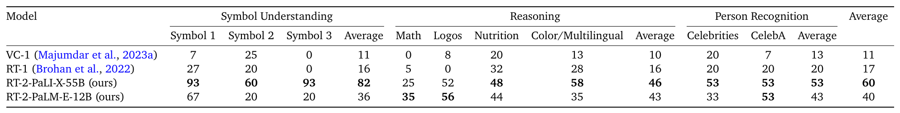

**Original caption:** Table 5 | Performance of RT-2 and baselines on quantitative emergent evaluations.

**中文图注:** 表 5 | RT-2 与基线在定量涌现评测上的性能。

**表格转录（本阅读稿整理）：** 原表表头为两层：Symbol Understanding（Symbol 1/2/3 + Average）、Reasoning（Math/Logos/Nutrition/Color & Multilingual + Average）、Person Recognition（Celebrities/CelebA + Average），最后一列为总 Average。

| Model | Sym.1 | Sym.2 | Sym.3 | Sym. Avg | Math | Logos | Nutrition | Color/Multiling. | Reas. Avg | Celebrities | CelebA | Person Avg | Average |
|---|---|---|---|---|---|---|---|---|---|---|---|---|---|
| VC-1 (Majumdar et al., 2023a) | 7 | 25 | 0 | 11 | 0 | 8 | 20 | 13 | 10 | 20 | 7 | 13 | 11 |
| RT-1 (Brohan et al., 2022) | 27 | 20 | 0 | 16 | 5 | 0 | 32 | 28 | 16 | 20 | 20 | 20 | 17 |
| RT-2-PaLI-X-55B (ours) | 93 | 60 | 93 | 82 | 25 | 52 | 48 | 58 | 46 | 53 | 53 | 53 | 60 |
| RT-2-PaLM-E-12B (ours) | 67 | 20 | 20 | 36 | 35 | 56 | 44 | 35 | 43 | 33 | 53 | 43 | 40 |

**阅读提示:** 这是涌现评测的完整数值表，对应图 6a。三大类（符号理解/推理/人物识别）各自又有子列与平均值。最后一列 Average 是全文最强的对比数字：RT-2-PaLI-X-55B 为 60，RT-1 为 17。

<a id="S094"></a>

### H.3. Size and Training Ablations, for Section 4.3 ｜ H.3. 规模与训练方式消融（对应第 4.3 节）

<a id="S095"></a>
**Source:** p.24 S095

**Original:** Table 6 details quantitative results for ablations across model size and training approach. Across each, we see that model size plays an important role in performance and that co-fine-tuning outperforms fine-tuning, which outperforms training from scratch.

**中文:** 表 6 给出了跨模型规模与训练方式的消融的定量结果。在每一项中我们都能看到，模型规模对性能有重要作用，并且联合微调优于微调，而微调优于从头训练。

<a id="T006"></a>
### Table 6. 规模与训练方式消融

**Placed near:** p.24 S095
**Source:** p.24 T006

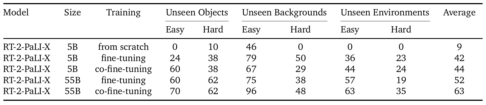

**Original caption:** Table 6 | Ablations of RT-2 showcasing the impact of parameter count and training strategy on generalization.

**中文图注:** 表 6 | RT-2 的消融实验，展示参数数量与训练策略对泛化的影响。

**表格转录（本阅读稿整理）：** 原表表头为 Model / Size / Training / Unseen Objects (Easy, Hard) / Unseen Backgrounds (Easy, Hard) / Unseen Environments (Easy, Hard) / Average。

| Model | Size | Training | Unseen Objects Easy | Unseen Objects Hard | Unseen Backgrounds Easy | Unseen Backgrounds Hard | Unseen Environments Easy | Unseen Environments Hard | Average |
|---|---|---|---|---|---|---|---|---|---|
| RT-2-PaLI-X | 5B | from scratch | 0 | 10 | 46 | 0 | 0 | 0 | 9 |
| RT-2-PaLI-X | 5B | fine-tuning | 24 | 38 | 79 | 50 | 36 | 23 | 42 |
| RT-2-PaLI-X | 5B | co-fine-tuning | 60 | 38 | 67 | 29 | 44 | 24 | 44 |
| RT-2-PaLI-X | 55B | fine-tuning | 60 | 62 | 75 | 38 | 57 | 19 | 52 |
| RT-2-PaLI-X | 55B | co-fine-tuning | 70 | 62 | 96 | 48 | 63 | 35 | 63 |

**阅读提示:** 这是规模与训练方式的消融表，对应图 6b。读法是纵向比较 from scratch / fine-tuning / co-fine-tuning 三种训练方式，横向比较 5B 与 55B。两个结论都在这张表里：co-fine-tuning > fine-tuning > from scratch；55B > 5B。

> 更早的指路位置：S043（p.10，正文以“Appendix Table 6”先行指路）。

<a id="S096"></a>

## I. Additional Chain-Of-Thought Reasoning Results ｜ I. 额外的思维链推理结果

<a id="S097"></a>
**Source:** p.24 S097

**Original:** We present additional examples of chain-of-thought reasoning rollouts accomplished with RT-2-PaLME, as described in Sec. 4.4, in Figure 10.

**中文:** 我们在图 10 中给出由 RT-2-PaLM-E 完成的更多思维链推理执行示例，如第 4.4 节所述。

<a id="F010"></a>
### Fig. 10. 更多思维链推理示例

**Placed near:** p.24 S097
**Source:** p.25 F010

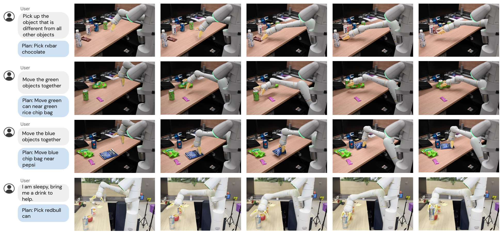

**Original caption:** Figure 10 | Additional examples of RT-2 with chain-of-thought reasoning

**中文图注:** 图 10 | 带有思维链推理的 RT-2 的更多示例。

**阅读提示:** 四行思维链样例依次是：挑选与众不同的物体、把绿色物体聚在一起、把蓝色物体聚在一起、以及“我困了，给我拿杯饮料”。注意最后一行是把用户的意图（困了）转译为具体物体（redbull can），这是单步策略做不到的语义跳跃。

---

<a id="R001"></a>

## 参考文献（p.13–p.18）

书目条目保留英文原文（标准做法：书目信息不译），序号为本阅读稿按原文顺序重排。

1. M. Ahn, A. Brohan, N. Brown, Y. Chebotar, O. Cortes, B. David, C. Finn, K. Gopalakrishnan, K. Hausman, A. Herzog, et al. Do as I can, not as I say: Grounding language in robotic affordances. arXiv preprint arXiv:2204.01691, 2022.

2. J.-B. Alayrac, J. Donahue, P. Luc, A. Miech, I. Barr, Y. Hasson, K. Lenc, A. Mensch, K. Millican, M. Reynolds, et al. Flamingo: a visual language model for few-shot learning. arXiv preprint arXiv:2204.14198, 2022.

3. R. Anil, A. M. Dai, O. Firat, M. Johnson, D. Lepikhin, A. Passos, S. Shakeri, E. Taropa, P. Bailey, Z. Chen, et al. Palm 2 technical report. arXiv preprint arXiv:2305.10403, 2023.

4. A. Brohan, N. Brown, J. Carbajal, Y. Chebotar, J. Dabis, C. Finn, K. Gopalakrishnan, K. Hausman, A. Herzog, J. Hsu, et al. Rt-1: Robotics transformer for real-world control at scale. arXiv preprint arXiv:2212.06817, 2022.

5. T. Brown, B. Mann, N. Ryder, M. Subbiah, J. D. Kaplan, P. Dhariwal, A. Neelakantan, P. Shyam, G. Sastry, A. Askell, et al. Language models are few-shot learners. Advances in neural information processing systems, 33:1877–1901, 2020.

6. D. Cer, Y. Yang, S. Kong, N. Hua, N. Limtiaco, R. S. John, N. Constant, M. Guajardo-Cespedes, S. Yuan, C. Tar, Y. Sung, B. Strope, and R. Kurzweil. Universal sentence encoder. CoRR, abs/1803.11175, 2018. URL http://arxiv.org/abs/1803.11175.

7. M. Chen, J. Tworek, H. Jun, Q. Yuan, H. P. d. O. Pinto, J. Kaplan, H. Edwards, Y. Burda, N. Joseph, G. Brockman, et al. Evaluating large language models trained on code. arXiv preprint arXiv:2107.03374, 2021.

8. X. Chen, J. Djolonga, P. Padlewski, B. Mustafa, S. Changpinyo, J. Wu, C. R. Ruiz, S. Goodman, X. Wang, Y. Tay, S. Shakeri, M. Dehghani, D. Salz, M. Lucic, M. Tschannen, A. Nagrani, H. Hu, M. Joshi, B. Pang, C. Montgomery, P. Pietrzyk, M. Ritter, A. Piergiovanni, M. Minderer, F. Pavetic, A. Waters, G. Li, I. Alabdulmohsin, L. Beyer, J. Amelot, K. Lee, A. P. Steiner, Y. Li, D. Keysers, A. Arnab, Y. Xu, K. Rong, A. Kolesnikov, M. Seyedhosseini, A. Angelova, X. Zhai, N. Houlsby, and R. Soricut. Pali-x: On scaling up a multilingual vision and language model, 2023a.

9. X. Chen, X. Wang, S. Changpinyo, A. Piergiovanni, P. Padlewski, D. Salz, S. Goodman, A. Grycner, B. Mustafa, L. Beyer, A. Kolesnikov, J. Puigcerver, N. Ding, K. Rong, H. Akbari, G. Mishra, L. Xue, A. Thapliyal, J. Bradbury, W. Kuo, M. Seyedhosseini, C. Jia, B. K. Ayan, C. Riquelme, A. Steiner, A. Angelova, X. Zhai, N. Houlsby, and R. Soricut. Pali: A jointly-scaled multilingual language-image model, 2023b.

10. K. Cobbe, V. Kosaraju, M. Bavarian, M. Chen, H. Jun, L. Kaiser, M. Plappert, J. Tworek, J. Hilton, R. Nakano, et al. Training verifiers to solve math word problems. arXiv preprint arXiv:2110.14168, 2021.

11. Z. J. Cui, Y. Wang, N. Muhammad, L. Pinto, et al. From play to policy: Conditional behavior generation from uncurated robot data. arXiv preprint arXiv:2210.10047, 2022.

12. S. Dasari and A. Gupta. Transformers for one-shot visual imitation. In Conference on Robot Learning, pages 2071–2084. PMLR, 2021.

13. S. Dasari, F. Ebert, S. Tian, S. Nair, B. Bucher, K. Schmeckpeper, S. Singh, S. Levine, and C. Finn. Robonet: Large-scale multi-robot learning. In Conference on Robot Learning, 2019.

14. M. Dehghani, J. Djolonga, B. Mustafa, P. Padlewski, J. Heek, J. Gilmer, A. Steiner, M. Caron, R. Geirhos, I. Alabdulmohsin, R. Jenatton, L. Beyer, M. Tschannen, A. Arnab, X. Wang, C. Riquelme, M. Minderer, J. Puigcerver, U. Evci, M. Kumar, S. van Steenkiste, G. F. Elsayed, A. Mahendran, F. Yu, A. Oliver, F. Huot, J. Bastings, M. P. Collier, A. Gritsenko, V. Birodkar, C. Vasconcelos, Y. Tay, T. Mensink, A. Kolesnikov, F. Pavetić, D. Tran, T. Kipf, M. Lučić, X. Zhai, D. Keysers, J. Harmsen, and N. Houlsby. Scaling vision transformers to 22 billion parameters, 2023. D. Driess, F. Xia, M. S. Sajjadi, C. Lynch, A. Chowdhery, B. Ichter, A. Wahid, J. Tompson, Q. Vuong, T. Yu, et al. Palm-e: An embodied multimodal language model. arXiv preprint arXiv:2303.03378, 2023. M. Du, S. Nair, D. Sadigh, and C. Finn. Behavior retrieval: Few-shot imitation learning by querying unlabeled datasets. arXiv preprint arXiv:2304.08742, 2023a. Y. Du, K. Konyushkova, M. Denil, A. Raju, J. Landon, F. Hill, N. de Freitas, and S. Cabi. Vision-language models as success detectors. arXiv preprint arXiv:2303.07280, 2023b. C. Finn and S. Levine. Deep visual foresight for planning robot motion. In 2017 IEEE International Conference on Robotics and Automation (ICRA), pages 2786–2793. IEEE, 2017. C. Finn, T. Yu, T. Zhang, P. Abbeel, and S. Levine. One-shot visual imitation learning via meta-learning. In Conference on robot learning, pages 357–368. PMLR, 2017. R. A. Fisher. Design of experiments. British Medical Journal, 1(3923):554, 1936. S. Y. Gadre, M. Wortsman, G. Ilharco, L. Schmidt, and S. Song. Clip on wheels: Zero-shot object navigation as object localization and exploration. arXiv preprint arXiv:2203.10421, 2022. Z. Gan, L. Li, C. Li, L. Wang, Z. Liu, J. Gao, et al. Vision-language pre-training: Basics, recent advances, and future trends. Foundations and Trends® in Computer Graphics and Vision, 14(3–4):163–352, 2022. G. Ghiasi, X. Gu, Y. Cui, and T.-Y. Lin. Open-vocabulary image segmentation. arXiv preprint arXiv:2112.12143, 2021. K. Grauman, A. Westbury, E. Byrne, Z. Chavis, A. Furnari, R. Girdhar, J. Hamburger, H. Jiang, M. Liu, X. Liu, M. Martin, T. Nagarajan, I. Radosavovic, S. K. Ramakrishnan, F. Ryan, J. Sharma, M. Wray, M. Xu, E. Z. Xu, C. Zhao, S. Bansal, D. Batra, V. Cartillier, S. Crane, T. Do, M. Doulaty, A. Erapalli, C. Feichtenhofer, A. Fragomeni, Q. Fu, A. Gebreselasie, C. Gonzalez, J. Hillis, X. Huang, Y. Huang, W. Jia, W. Khoo, J. Kolar, S. Kottur, A. Kumar, F. Landini, C. Li, Y. Li, Z. Li, K. Mangalam, R. Modhugu, J. Munro, T. Murrell, T. Nishiyasu, W. Price, P. R. Puentes, M. Ramazanova, L. Sari, K. Somasundaram, A. Southerland, Y. Sugano, R. Tao, M. Vo, Y. Wang, X. Wu, T. Yagi, Z. Zhao, Y. Zhu, P. Arbelaez, D. Crandall, D. Damen, G. M. Farinella, C. Fuegen, B. Ghanem, V. K. Ithapu, C. V. Jawahar, H. Joo, K. Kitani, H. Li, R. Newcombe, A. Oliva, H. S. Park, J. M. Rehg, Y. Sato, J. Shi, M. Z. Shou, A. Torralba, L. Torresani, M. Yan, and J. Malik. Ego4d: Around the world in 3,000 hours of egocentric video, 2022. X. Gu, T.-Y. Lin, W. Kuo, and Y. Cui. Open-vocabulary object detection via vision and language knowledge distillation. arXiv preprint arXiv:2104.13921, 2021. N. Hansen, R. Jangir, Y. Sun, G. Alenyà, P. Abbeel, A. A. Efros, L. Pinto, and X. Wang. Self-supervised policy adaptation during deployment. arXiv preprint arXiv:2007.04309, 2020. Y. Hao, H. Song, L. Dong, S. Huang, Z. Chi, W. Wang, S. Ma, and F. Wei. Language models are general-purpose interfaces. arXiv preprint arXiv:2206.06336, 2022.

15. F. Hill, S. Mokra, N. Wong, and T. Harley. Human instruction-following with deep reinforcement learning via transfer-learning from text. arXiv preprint arXiv:2005.09382, 2020.

16. S. Huang, L. Dong, W. Wang, Y. Hao, S. Singhal, S. Ma, T. Lv, L. Cui, O. K. Mohammed, Q. Liu, et al. Language is not all you need: Aligning perception with language models. arXiv preprint arXiv:2302.14045, 2023.

17. W. Huang, P. Abbeel, D. Pathak, and I. Mordatch. Language models as zero-shot planners: Extracting actionable knowledge for embodied agents. In International Conference on Machine Learning, pages 9118–9147. PMLR, 2022.

18. S. James, M. Bloesch, and A. J. Davison. Task-embedded control networks for few-shot imitation learning. In Conference on robot learning, pages 783–795. PMLR, 2018.

19. E. Jang, A. Irpan, M. Khansari, D. Kappler, F. Ebert, C. Lynch, S. Levine, and C. Finn. Bc-z: Zero- shot task generalization with robotic imitation learning. In Conference on Robot Learning, pages 991–1002. PMLR, 2021.

20. Y. Jiang, A. Gupta, Z. Zhang, G. Wang, Y. Dou, Y. Chen, L. Fei-Fei, A. Anandkumar, Y. Zhu, and L. Fan. Vima: General robot manipulation with multimodal prompts. arXiv preprint arXiv:2210.03094, 2022.

21. L. P. Kaelbling. The foundation of efficient robot learning. Science, 369(6506):915–916, 2020.

22. S. Karamcheti, S. Nair, A. S. Chen, T. Kollar, C. Finn, D. Sadigh, and P. Liang. Language-driven representation learning for robotics. arXiv preprint arXiv:2302.12766, 2023.

23. A. Kirillov, E. Mintun, N. Ravi, H. Mao, C. Rolland, L. Gustafson, T. Xiao, S. Whitehead, A. C. Berg, W.-Y. Lo, et al. Segment anything. arXiv preprint arXiv:2304.02643, 2023.

24. I. Kostrikov, D. Yarats, and R. Fergus. Image augmentation is all you need: Regularizing deep reinforcement learning from pixels. arXiv preprint arXiv:2004.13649, 2020.

25. M. Laskin, K. Lee, A. Stooke, L. Pinto, P. Abbeel, and A. Srinivas. Reinforcement learning with augmented data. Advances in neural information processing systems, 33:19884–19895, 2020a.

26. M. Laskin, A. Srinivas, and P. Abbeel. Curl: Contrastive unsupervised representations for reinforcement learning. In International Conference on Machine Learning, pages 5639–5650. PMLR, 2020b.

27. S. Levine, P. Pastor, A. Krizhevsky, J. Ibarz, and D. Quillen. Learning hand-eye coordination for robotic grasping with deep learning and large-scale data collection. The International journal of robotics research, 37(4-5):421–436, 2018.

28. A. Lewkowycz, A. Andreassen, D. Dohan, E. Dyer, H. Michalewski, V. Ramasesh, A. Slone, C. Anil, I. Schlag, T. Gutman-Solo, et al. Solving quantitative reasoning problems with language models. arXiv preprint arXiv:2206.14858, 2022.

29. J. Li, D. Li, S. Savarese, and S. Hoi. Blip-2: Bootstrapping language-image pre-training with frozen image encoders and large language models. arXiv preprint arXiv:2301.12597, 2023.

30. L. H. Li, M. Yatskar, D. Yin, C.-J. Hsieh, and K.-W. Chang. Visualbert: A simple and performant baseline for vision and language. arXiv preprint arXiv:1908.03557, 2019.

31. H. Liu, L. Lee, K. Lee, and P. Abbeel. Instruction-following agents with jointly pre-trained vision- language models. arXiv preprint arXiv:2210.13431, 2022.

32. J. Lu, D. Batra, D. Parikh, and S. Lee. Vilbert: Pretraining task-agnostic visiolinguistic representations for vision-and-language tasks. Advances in neural information processing systems, 32, 2019.

33. C. Lynch and P. Sermanet. Language conditioned imitation learning over unstructured data. arXiv preprint arXiv:2005.07648, 2020.

34. C. Lynch, A. Wahid, J. Tompson, T. Ding, J. Betker, R. Baruch, T. Armstrong, and P. Florence. Interactive language: Talking to robots in real time. arXiv preprint arXiv:2210.06407, 2022.

35. Y. J. Ma, S. Sodhani, D. Jayaraman, O. Bastani, V. Kumar, and A. Zhang. Vip: Towards universal visual reward and representation via value-implicit pre-training. arXiv preprint arXiv:2210.00030, 2022.

36. Y. J. Ma, W. Liang, V. Som, V. Kumar, A. Zhang, O. Bastani, and D. Jayaraman. Liv: Language-image representations and rewards for robotic control. arXiv preprint arXiv:2306.00958, 2023.

37. J. Mahler, J. Liang, S. Niyaz, M. Laskey, R. Doan, X. Liu, J. A. Ojea, and K. Goldberg. Dex-net 2.0: Deep learning to plan robust grasps with synthetic point clouds and analytic grasp metrics. arXiv preprint arXiv:1703.09312, 2017.

38. A. Majumdar, K. Yadav, S. Arnaud, Y. J. Ma, C. Chen, S. Silwal, A. Jain, V.-P. Berges, P. Abbeel, J. Malik, et al. Where are we in the search for an artificial visual cortex for embodied intelligence? arXiv preprint arXiv:2303.18240, 2023a.

39. A. Majumdar, K. Yadav, S. Arnaud, Y. J. Ma, C. Chen, S. Silwal, A. Jain, V.-P. Berges, P. Abbeel, J. Malik, et al. Where are we in the search for an artificial visual cortex for embodied intelligence? arXiv preprint arXiv:2303.18240, 2023b.

40. O. Mees, L. Hermann, and W. Burgard. What matters in language conditioned robotic imitation learning over unstructured data. IEEE Robotics and Automation Letters, 7(4):11205–11212, 2022.

41. M. Minderer, A. Gritsenko, A. Stone, M. Neumann, D. Weissenborn, A. Dosovitskiy, A. Mahendran, A. Arnab, M. Dehghani, Z. Shen, et al. Simple open-vocabulary object detection with vision transformers. arXiv preprint arXiv:2205.06230, 2022.

42. Y. Mu, Q. Zhang, M. Hu, W. Wang, M. Ding, J. Jin, B. Wang, J. Dai, Y. Qiao, and P. Luo. Embodiedgpt: Vision-language pre-training via embodied chain of thought. arXiv preprint arXiv:2305.15021, 2023.

43. S. Nair, E. Mitchell, K. Chen, S. Savarese, C. Finn, et al. Learning language-conditioned robot behavior from offline data and crowd-sourced annotation. In Conference on Robot Learning, pages 1303–1315. PMLR, 2022a.

44. S. Nair, A. Rajeswaran, V. Kumar, C. Finn, and A. Gupta. R3m: A universal visual representation for robot manipulation. arXiv preprint arXiv:2203.12601, 2022b.

45. OpenAI. Gpt-4 technical report, 2023.

46. J. Pari, N. M. Shafiullah, S. P. Arunachalam, and L. Pinto. The surprising effectiveness of representation learning for visual imitation. arXiv preprint arXiv:2112.01511, 2021.

47. L. Pinto and A. Gupta. Supersizing self-supervision: Learning to grasp from 50k tries and 700 robot hours. In 2016 IEEE international conference on robotics and automation (ICRA), pages 3406–3413. IEEE, 2016.

48. S. Polu, J. M. Han, K. Zheng, M. Baksys, I. Babuschkin, and I. Sutskever. Formal mathematics statement curriculum learning. arXiv preprint arXiv:2202.01344, 2022.

49. V. H. Pong, M. Dalal, S. Lin, A. Nair, S. Bahl, and S. Levine. Skew-fit: State-covering self-supervised reinforcement learning. arXiv preprint arXiv:1903.03698, 2019.

50. A. Radford, J. W. Kim, C. Hallacy, A. Ramesh, G. Goh, S. Agarwal, G. Sastry, A. Askell, P. Mishkin, J. Clark, et al. Learning transferable visual models from natural language supervision. In Interna- tional Conference on Machine Learning, pages 8748–8763. PMLR, 2021.

51. S. Reed, K. Zolna, E. Parisotto, S. G. Colmenarejo, A. Novikov, G. Barth-Maron, M. Gimenez, Y. Sulsky, J. Kay, J. T. Springenberg, et al. A generalist agent. arXiv preprint arXiv:2205.06175, 2022.

52. M. Ryoo, A. Piergiovanni, A. Arnab, M. Dehghani, and A. Angelova. Tokenlearner: Adaptive space-time tokenization for videos. Advances in Neural Information Processing Systems, 34:12786–12797, 2021.

53. D. Shah, B. Osiński, b. ichter, and S. Levine. Lm-nav: Robotic navigation with large pre-trained models of language, vision, and action. In K. Liu, D. Kulic, and J. Ichnowski, editors, Proceedings of The 6th Conference on Robot Learning, volume 205 of Proceedings of Machine Learning Research, pages 492– 504. PMLR, 14–18 Dec 2023. URL https://proceedings.mlr.press/v205/shah23b.html.

54. R. Shah and V. Kumar. Rrl: Resnet as representation for reinforcement learning. arXiv preprint arXiv:2107.03380, 2021.

55. M. Shridhar, L. Manuelli, and D. Fox. Cliport: What and where pathways for robotic manipulation. In Proceedings of the 5th Conference on Robot Learning (CoRL), 2021.

56. M. Shridhar, L. Manuelli, and D. Fox. Cliport: What and where pathways for robotic manipulation. In Conference on Robot Learning, pages 894–906. PMLR, 2022a.

57. M. Shridhar, L. Manuelli, and D. Fox. Perceiver-actor: A multi-task transformer for robotic manipula- tion. arXiv preprint arXiv:2209.05451, 2022b.

58. I. Singh, V. Blukis, A. Mousavian, A. Goyal, D. Xu, J. Tremblay, D. Fox, J. Thomason, and A. Garg. Progprompt: Generating situated robot task plans using large language models. In ICRA, 2023.

59. M. H. Smith and L. S. Coles. Design of a low cost, general purpose robot. In IJCAI, pages 324–336, 1973.

60. A. Stone, T. Xiao, Y. Lu, K. Gopalakrishnan, K.-H. Lee, Q. Vuong, P. Wohlhart, B. Zitkovich, F. Xia, C. Finn, et al. Open-world object manipulation using pre-trained vision-language models. arXiv preprint arXiv:2303.00905, 2023.

61. T. Sumers, K. Marino, A. Ahuja, R. Fergus, and I. Dasgupta. Distilling internet-scale vision-language models into embodied agents. arXiv preprint arXiv:2301.12507, 2023.

62. Y. Tay, M. Dehghani, V. Q. Tran, X. Garcia, J. Wei, X. Wang, H. W. Chung, S. Shakeri, D. Bahri, T. Schuster, H. S. Zheng, D. Zhou, N. Houlsby, and D. Metzler. Ul2: Unifying language learning paradigms, 2023.

63. S. Vemprala, R. Bonatti, A. Bucker, and A. Kapoor. Chatgpt for robotics: Design principles and model abilities. Microsoft Auton. Syst. Robot. Res, 2:20, 2023.

64. J. Wang, Z. Yang, X. Hu, L. Li, K. Lin, Z. Gan, Z. Liu, C. Liu, and L. Wang. Git: A generative image-to-text transformer for vision and language. arXiv preprint arXiv:2205.14100, 2022.

65. J. Wei, X. Wang, D. Schuurmans, M. Bosma, E. Chi, Q. Le, and D. Zhou. Chain of thought prompting elicits reasoning in large language models. arXiv preprint arXiv:2201.11903, 2022.

66. J. Wei, L. Hou, A. Lampinen, X. Chen, D. Huang, Y. Tay, X. Chen, Y. Lu, D. Zhou, T. Ma, and Q. V. Le. Symbol tuning improves in-context learning in language models, 2023.

67. J. Wu, R. Antonova, A. Kan, M. Lepert, A. Zeng, S. Song, J. Bohg, S. Rusinkiewicz, and T. Funkhouser. Tidybot: Personalized robot assistance with large language models. arXiv preprint arXiv:2305.05658, 2023.

68. T. Xiao, H. Chan, P. Sermanet, A. Wahid, A. Brohan, K. Hausman, S. Levine, and J. Tompson. Robotic skill acquisition via instruction augmentation with vision-language models. arXiv preprint arXiv:2211.11736, 2022a.

69. T. Xiao, I. Radosavovic, T. Darrell, and J. Malik. Masked visual pre-training for motor control. arXiv preprint arXiv:2203.06173, 2022b.

70. S. Young, D. Gandhi, S. Tulsiani, A. Gupta, P. Abbeel, and L. Pinto. Visual imitation made easy. In Conference on Robot Learning, pages 1992–2005. PMLR, 2021.

71. K.-T. Yu, M. Bauza, N. Fazeli, and A. Rodriguez. More than a million ways to be pushed. a high-fidelity experimental dataset of planar pushing. In 2016 IEEE/RSJ international conference on intelligent robots and systems (IROS), pages 30–37. IEEE, 2016.

72. T. Yu, C. Finn, A. Xie, S. Dasari, T. Zhang, P. Abbeel, and S. Levine. One-shot imitation from observing humans via domain-adaptive meta-learning. arXiv preprint arXiv:1802.01557, 2018.

73. X. Zhai, A. Kolesnikov, N. Houlsby, and L. Beyer. Scaling vision transformers. In Proceedings of the IEEE/CVF Conference on Computer Vision and Pattern Recognition, pages 12104–12113, 2022.

74. X. Zhang, Y. Ding, S. Amiri, H. Yang, A. Kaminski, C. Esselink, and S. Zhang. Grounding classical task planners via vision-language models. arXiv preprint arXiv:2304.08587, 2023.

## 术语表

| English | 中文 |
|---|---|
| vision-language-action model (VLA) | 视觉-语言-动作模型 |
| vision-language model (VLM) | 视觉-语言模型 |
| co-fine-tuning | 联合微调（机器人数据与原始网络数据一同微调） |
| fine-tuning | 微调（仅用机器人数据） |
| from scratch | 从头训练（不使用 VLM 预训练权重） |
| emergent capabilities | 涌现能力 |
| generalization | 泛化 |
| seen tasks | 已见任务（分布内评测） |
| unseen objects / backgrounds / environments | 未见物体／背景／环境 |
| easy / hard | 简单／困难（同一分布偏移轴上偏移量不同） |
| symbol understanding | 符号理解 |
| reasoning | 推理 |
| human recognition | 人物识别 |
| chain-of-thought reasoning | 思维链推理 |
| action token | 动作 token |
| discretized bins | 离散化 bin（分箱） |
| end-effector | 末端执行器 |
| closed-loop control | 闭环控制 |
| real-time inference | 实时推理 |
| multi-TPU cloud service | 多 TPU 云服务 |
| symbol tuning | 符号调优 |
| A/B testing framework | A/B 测试框架 |
| token learner | token learner（TokenLearner 模块） |
| multimodal sentences | 多模态句子 |
| behavior cloning loss | 行为克隆损失 |
| out-of-distribution (OOD) | 分布外 |
| Language-Table | Language-Table（开源仿真环境，保留原名） |
| PaLI-X / PaLI-3B / PaLM-E | PaLI-X／PaLI-3B／PaLM-E（模型名保留原文） |
| MOO / VC-1 / R3M / RT-1 | MOO／VC-1／R3M／RT-1（基线模型名保留原文） |

## 图表清单

| 图表 | 锚点 | 源页 | 放置位置 | 文件 |
|---|---|---|---|---|
| Figure 1 | [F001](#F001) | p.2 | S004 | `assets/fig1.png` |
| Figure 2 | [F002](#F002) | p.5 | S005 | `assets/fig2.png` |
| Figure 3 | [F003](#F003) | p.7 | S034 | `assets/fig3.png` |
| Figure 4 | [F004](#F004) | p.8 | S035 | `assets/fig4.png` |
| Figure 5 | [F005](#F005) | p.9 | S036 | `assets/fig5.png` |
| Table 1 | [T001](#T001) | p.9 | S036 | `assets/table1.png` |
| Figure 6 | [F006](#F006) | p.10 | S040 | `assets/fig6.png` |
| Figure 7 | [F007](#F007) | p.11 | S046 | `assets/fig7.png` |
| Figure 8 | [F008](#F008) | p.22 | S078 | `assets/fig8.png` |
| Table 2 | [T002](#T002) | p.26 | S080 | `assets/table2.png` |
| Table 3 | [T003](#T003) | p.22 | S078 | `assets/table3.png` |
| Figure 9 | [F009](#F009) | p.23 | S082 | `assets/fig9.png` |
| Table 4 | [T004](#T004) | p.23 | S090 | `assets/table4.png` |
| Table 5 | [T005](#T005) | p.24 | S093 | `assets/table5.png` |
| Table 6 | [T006](#T006) | p.24 | S095 | `assets/table6.png` |
| Figure 10 | [F010](#F010) | p.25 | S097 | `assets/fig10.png` |

## 不确定性与缺失说明

本阅读稿的原文区块由 PDF 文本层重建（Poppler `pdftotext -layout` 与 `pdfplumber` 交叉核对），段落边界由行距、字号与缩进共同判定，并在必要时按“首次实质性提及”做了跨页段落合并。详见 `translation_notes.md` 中的未确定性说明表。
