# π*0.6: a VLA That Learns From Experience

**中文题名：** π*0.6：一个从经验中学习的视觉-语言-动作模型

**作者（原文署名）：** Physical Intelligence — Ali Amin, Raichelle Aniceto, Ashwin Balakrishna, Kevin Black, Ken Conley, Grace Connors, James Darpinian, Karan Dhabalia, Jared DiCarlo, Danny Driess, Michael Equi, Adnan Esmail, Yunhao Fang, Chelsea Finn, Catherine Glossop, Thomas Godden, Ivan Goryachev, Lachy Groom, Hunter Hancock, Karol Hausman, Gashon Hussein, Brian Ichter, Szymon Jakubczak, Rowan Jen, Tim Jones, Ben Katz, Liyiming Ke, Chandra Kuchi, Marinda Lamb, Devin LeBlanc, Sergey Levine, Adrian Li-Bell, Yao Lu, Vishnu Mano, Mohith Mothukuri, Suraj Nair, Karl Pertsch, Allen Z. Ren, Charvi Sharma, Lucy Xiaoyang Shi, Laura Smith, Jost Tobias Springenberg, Kyle Stachowicz, Will Stoeckle, Alex Swerdlow, James Tanner, Marcel Torne, Quan Vuong, Anna Walling, Haohuan Wang, Blake Williams, Sukwon Yoo, Lili Yu, Ury Zhilinsky, Zhiyuan Zhou

项目主页：https://pi.website/blog/pistar06

## 元数据 / Metadata

| 项目 | 内容 |
| --- | --- |
| 标题 | π*0.6: a VLA That Learns From Experience |
| 中文题名 | π*0.6：一个从经验中学习的视觉-语言-动作模型 |
| 作者 | Physical Intelligence 团队（Ali Amin, Raichelle Aniceto 等 59 人，详见正文作者列表） |
| 来源 | arXiv:2511.14759v2（预印本，共 18 页；2025-11-19） |
| 项目主页 | https://pi.website/blog/pistar06 |
| 本地 PDF | `2511.14759v2.pdf`（与本文件同目录，已随阅读包复制） |
| 阅读包形式 | 全文级中英对照；插图/算法框/公式按原文裁切并就近放置 |
| 生成日期 | 2026-09-19 |

## 章节索引

| 章节 | 页码范围 | 锚点 |
| --- | --- | --- |
| 摘要（Abstract） | p.1 | [abstract](#abstract) |
| 一、引言（I. INTRODUCTION） | p.1-2 | [s1](#s1) |
| 二、相关工作（II. RELATED WORK） | p.2-3 | [s2](#s2) |
| 三、预备知识（III. PRELIMINARIES） | p.3-4 | [s3](#s3) |
| 四、RECAP：通过优势条件化策略从经验与纠正中学习（IV. RECAP） | p.3-5 | [s4](#s4) |
| 五、实现、模型与系统细节（V. IMPLEMENTATION, MODEL, AND SYSTEM DETAILS） | p.5-7 | [s5](#s5) |
| 六、实验评估（VI. EXPERIMENTAL EVALUATION） | p.7-11 | [s6](#s6) |
| 七、讨论与未来工作（VII. DISCUSSION AND FUTURE WORK） | p.11 | [s7](#s7) |
| 致谢（ACKNOWLEDGEMENTS） | p.11 | [ack](#ack) |
| 参考文献（REFERENCES） | p.11-16 | [refs](#refs) |
| 附录（APPENDIX A-F） | p.16-18 | [appendix](#appendix) |

**图表与公式索引**

| 编号 | 内容 | 所在页 | 锚点 |
| --- | --- | --- | --- |
| Fig. 1 | RECAP 总览：用奖励反馈与人工干预训练 VLA | p.1 | [F001](#F001) |
| Fig. 2 | RECAP 学到的部分任务 | p.2 | [F002](#F002) |
| Fig. 3 | π*0.6 VLA 与价值函数在 RECAP 训练中的交互 | p.4 | [F003](#F003) |
| Fig. 4 | 价值函数可视化 | p.5 | [F004](#F004) |
| Fig. 5 | 实验所用机器人平台 | p.7 | [F005](#F005) |
| Fig. 6 | 实验中使用的任务示意 | p.8 | [F006](#F006) |
| Fig. 7 | 吞吐量（throughput）对比 | p.9 | [F007](#F007) |
| Fig. 8 | 成功率（success rate）对比 | p.9 | [F008](#F008) |
| Fig. 9 | 多轮迭代中的吞吐量提升 | p.10 | [F009](#F009) |
| Fig. 10 | 多轮迭代中的成功率提升 | p.10 | [F010](#F010) |
| Fig. 11 | 不同策略提取方法对比 | p.10 | [F011](#F011) |
| Fig. 12 | 失败模式消除 | p.10 | [F012](#F012) |
| Fig. 13 | 五个任务上价值函数的补充可视化 | p.17 | [F013](#F013) |
| Algorithm 1 | RECAP 算法伪代码 | p.6 | [A001](#A001) |
| 公式组（未编号） | RL 预备知识：轨迹分布、回报、价值与优势 | p.3 | [E001](#E001) |
| Eq. (1) | 分布式价值函数的交叉熵训练目标 | p.4 | [E002](#E002) |
| Eq. (2) | 优势条件化策略的闭式形式 | p.5 | [E003](#E003) |
| Eq. (3) | 优势条件化的策略训练目标 | p.5 | [E004](#E004) |
| Eq. (4) | 整体动作似然的下界（离散 + 流匹配） | p.6 | [E005](#E005) |
| Eq. (5) | 稀疏奖励定义 | p.7 | [E006](#E006) |
| Eq. (6) | 整体对数似然的分解 | p.16 | [E007](#E007) |
| Eq. (7) | 单步扩散过程的高斯似然 | p.16 | [E008](#E008) |
| Eq. (8) | 扩散似然的证据下界（ELBO） | p.16 | [E009](#E009) |
| Eq. (9) | 合并后的整体下界（正文式 (4) 的推导） | p.16-17 | [E010](#E010) |
| Eq. (10) | PPO 使用的似然下界（不含改进指标） | p.17 | [E011](#E011) |
| Eq. (11) | SPO+CoV 形式的 PPO 损失 | p.17 | [E012](#E012) |
| Eq. (12)-(13) | CFG 的推理时策略与梯度形式 | p.17 | [E013](#E013) |
| 附录优势估计 | 后训练 n 步前瞻与预训练全局形式 | p.18 | [E014](#E014) |

## 摘要

> Abstract

**Source:** p.1 S001-S003

**Original:** Abstract—We study how vision-language-action (VLA) models can improve through real-world deployments via reinforcement learning (RL). We present a general-purpose method, RL with Experience and Corrections via Advantage-conditioned Policies (RECAP), that provides for RL training of VLAs via advantage conditioning. Our method incorporates heterogeneous data into the self-improvement process, including demonstrations, data from on-policy collection, and expert teleoperated interventions provided during autonomous execution. RECAP starts by pre-training a generalist VLA with offline RL, which we call π*0.6, that can then be specialized to attain high performance on downstream tasks through on-robot data collection. We show that the π*0.6 model trained with the full RECAP method can fold laundry in real homes, reliably assemble boxes, and make espresso drinks using a professional espresso machine. On some of the hardest tasks, RECAP more than doubles task throughput and roughly halves the task failure rate.

**中文:** 摘要——<mark>我们研究视觉-语言-动作（VLA）模型如何通过真实世界部署中的强化学习（RL）得到改进。</mark>**我们提出一种通用方法：通过优势条件化策略从经验与纠正中学习**（RL with Experience and Corrections via Advantage-conditioned Policies, RECAP），它通过**优势条件化**（advantage conditioning）来实现对 VLA 的 RL 训练。我们的方法**把异构数据纳入自我改进过程，包括示范数据、在线策略采集的数据，以及在自主执行过程中由专家遥操作提供的干预数据。**RECAP 首先用离线 RL 预训练一个通用 VLA，我们称之为 π0.6；随后可以通过在机器人上采集数据，把它专门化（specialize）到下游任务上以获得高性能。我们展示：用完整 RECAP 方法训练的 π0.6 模型能够在真实家庭中叠衣服、可靠地组装纸箱，并使用专业意式咖啡机制作咖啡。在一些最难的任务上，RECAP 使任务吞吐量提升一倍以上，并把任务失败率大约减半。

### F001. RECAP：用奖励反馈与人工干预训练 VLA

**Placed near:** p.1（论文首页总览图；正文首次引用见 p.2 S007）
**Source:** p.1 C001

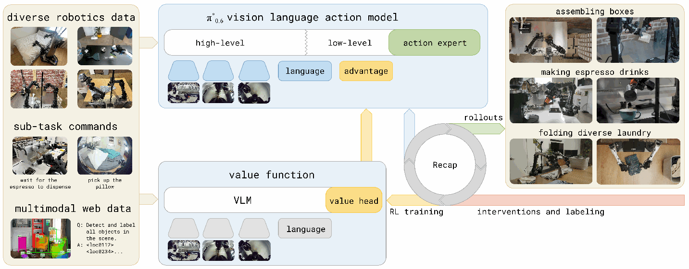

**Original caption:** Fig. 1: RECAP enables training VLAs with reward feedback and interventions. Our system starts with a pre-trained VLA that incorporates advantage conditioning, allowing the model to learn effectively from real-world experience. For each task, we deploy the model and collect both autonomous rollouts and online human corrections. We then fine-tune the value function on this online data, improving its estimates of how actions influence performance. Fine-tuning and conditioning the VLA on these updated advantage estimates in turn improves policy behavior.

**中文图注:** 图 1：RECAP 使 VLA 能够利用奖励反馈与人工干预进行训练。系统从一个已预训练、并内建优势条件化的 VLA 出发，使模型能够从真实世界的经验中有效学习。对每个任务，我们部署模型，同时采集自主 rollout 与在线人工纠正。随后我们在这批在线数据上微调价值函数，改进其对“动作如何影响表现”的估计；再用更新后的优势估计对 VLA 做微调与条件化，从而反过来改进策略行为。

**阅读提示:** 先看整条数据回路：部署→采集自主轨迹与人工纠正→训练价值函数→用优势指标重新条件化 VLA。图中左侧是任务与部署场景，右侧是训练闭环。

## 一、引言

> I. INTRODUCTION

**Source:** p.1 S004-S005

> **Original:** It's amazing what you can learn if you're not afraid to try. — Robert A. Heinlein, Have Space Suit–Will Travel
>
> **中文:** 如果你不怕尝试，你能学到的东西会令人惊叹。——罗伯特·A·海因莱因《有太空服，就去旅行》

**Source:** p.1 S006 - p.2 S013

**Original:** Practice makes perfect: while people are remarkably flexible in acquiring new skills, mastery invariably requires learning from repeated attempts. With general-purpose robotic foundation models, such as vision-language-action (VLA) models, we can flexibly specify tasks for generalist robots through prompts. But just like people, these models will need to practice a skill to achieve mastery. This means leveraging not only on demonstration data, but also autonomously collected experiential data that allows the policy to correct the mistakes that it actually makes in deployment, improve speed and robustness beyond the level of human teleoperation, and adapt to new deployment conditions. The foundations of learning through autonomous practice, as formalized with reinforcement learning (RL) [1], have been known for decades, but instantiating these principles in a general and scalable robotic learning system presents significant challenges: designing scalable and stable RL methods for large models, handling heterogeneous data from different policies, and setting up RL training with reward feedback in the real world, where reward signals might be ambiguous or stochastic. In this paper, we present RECAP, a method that enables VLA models to incorporate reward feedback in all stages of the training pipeline, from pre-training all the way to training on data from autonomous execution. RECAP aims to address this problem with a general-purpose recipe that combines demonstrations, autonomous experience, and expert interventions. Starting from the training recipe for a general-purpose VLA and training on diverse data from many different robotic platforms, RECAP first pre-trains the VLA with offline RL, followed by additional training on data collected through deployments. During these deployments, the robot receives (sparse) reward feedback based on the outcome of each trial, and potentially additional expert interventions that correct mistakes. The training process follows an offline RL [2, 3] recipe: we train a value function that evaluates progress toward successful task completion, and then use this value function to estimate the advantage of each action in the dataset. By conditioning the policy on an improvement indicator based on this advantage [4], we can obtain an improved policy. Figure 1 provides a high-level overview of RECAP. We can use RECAP to train policies for complex tasks, such as folding diverse laundry, assembling boxes, or making espresso drinks. We illustrate some of these tasks in Figure 2. The method starts by pre-training the π*0.6 model with offline RL on a diverse multi-task and multi-robot dataset. π*0.6 is an adaptation of the π0.6 model for RL, and π0.6 is an improvement on π0.5 [5], adding a larger backbone and more diverse conditioning [6]. π*0.6 adds the ability to condition on binarized advantage values, which makes it possible to incorporate a value function to improve the policy. After pre-training, we finetune the π*0.6 model to a downstream task with demonstrations, and then perform one or more iterations of on-robot data collection to improve the model with RL. Training π*0.6 with RECAP on autonomous experience more than doubles the throughput on some of the hardest tasks, and can decrease failure rates by 2 × or more. This enables π*0.6 to reach practically useful levels of robustness: we were able to run it to make espresso drinks for 13 hours straight, fold novel laundry items in a new home for over two hours without interruptions, and assemble boxes that are used for real packaging in a factory. While RECAP is based on individual algorithmic components that have been explored in prior works, the particular combination of these components is novel, and the results show, for the first time, that a general-purpose reinforcement learning recipe with human reward feedback and interventions can significantly improve both the robustness and throughput of VLA models with experience collected through deployment.

**中文:** 熟能生巧：人类在学习新技能方面极为灵活，但要精通一项技能，必然需要从反复尝试中学习。借助通用机器人基础模型，例如视觉-语言-动作（VLA）模型，我们可以通过提示（prompt）灵活地为通用机器人指定任务。但和人一样，这些模型也需要练习一项技能才能达到精通。这意味着**不仅要利用示范数据，还要利用自主采集的经验数据：让策略纠正在部署中实际犯下的错误，把速度和鲁棒性提升到超越人类遥操作的水平，并适应新的部署条件。**通过自主练习来学习这一原理，正如强化学习（RL）[1] 所形式化的那样，已经被认识了几十年，但要把这些原则落实为一个通用且可扩展的机器人学习系统，仍然存在重大挑战：如何为大型模型设计可扩展且稳定的 RL 方法、如何处理来自不同策略的异构数据、如何在真实世界中建立带奖励反馈的 RL 训练——现实中的奖励信号可能是模糊或随机的。在本文中，我们提出 RECAP，一种让 VLA 模型在训练流程的所有阶段都能纳入奖励反馈的方法，从预训练一直到利用自主执行数据进行的训练。RECAP 用一个通用配方来应对这一问题，把示范数据、自主经验和专家干预结合起来。从通用 VLA 的训练配方出发、并在来自许多不同机器人平台的多样数据上训练，RECAP 首先用离线 RL 预训练 VLA，随后再利用部署过程中收集的数据做额外训练。在这些部署中，机器人会收到（稀疏的）奖励反馈，反馈基于每次尝试的结果；此外还可能收到专家干预，用来纠正错误。训练过程遵循离线 RL [2, 3] 的配方：我们训练一个价值函数来评估任务完成进展，再用它估计数据集中每个动作的优势（advantage）。通过让策略以基于该优势的改进指标为条件 [4]，我们就能得到一个改进后的策略。图 1 给出了 RECAP 的高层概览。我们可以用 RECAP 训练复杂任务，例如叠各种衣物、组装纸箱、制作意式咖啡。我们在图 2 中展示了其中一些任务。该方法先从 π0.6 模型出发，在多样的多任务、多机器人数据集上用离线 RL 预训练：π0.6 是面向 RL 对 π0.6 的改造版本，而 π0.6 是 π0.5 [5] 的改进版，拥有更大的骨干网络和更多样的条件信息 [6]。π0.6 增加了以二值化优势值为条件的能力，从而可以引入价值函数来改进策略。预训练之后，π0.6 先用示范数据在下游任务上微调，然后执行一轮或多轮在机器人上采集数据的过程，用 RL 改进模型。在自主经验上用 RECAP 训练 π0.6，使一些最难任务的吞吐量提升一倍以上，并能让失败率下降约 2 倍或更多。这使 π0.6 达到了实际可用的鲁棒性水平：我们让它连续 13 小时制作意式咖啡，在一个新家里连续两个多小时不间断地折叠未见过的衣物，并组装用于工厂真实包装的纸箱。虽然 RECAP 的各个算法组件在此前工作中已被分别探索过，但它们的这一特定组合是新的，**结果首次表明：一个带人类奖励反馈与干预的通用强化学习配方，能够利用部署中收集的经验，显著提升 VLA 模型的鲁棒性和吞吐量。**

### F002. RECAP 学到的部分任务

**Placed near:** p.2 S007（正文首次引用：“我们在图 2 中展示了其中一些任务”）
**Source:** p.2 C002

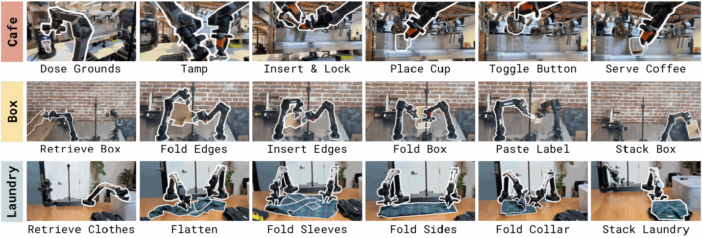

**Original caption:** Fig. 2: Some of the tasks learned by RECAP. π*0.6 trained with RECAP can make espresso drinks, assemble cardboard boxes, and fold diverse and realistic laundry with a high success rate. Each task involves realistic variability – flattened unfolded boxes stick together and bend, making espresso drinks requires pouring liquids, and folding laundry requires generalization to a wide range of clothing items.

**中文图注:** 图 2：RECAP 学到的部分任务。用 RECAP 训练的 π*0.6 能以高成功率制作意式咖啡、组装纸箱，并折叠多种真实衣物。每个任务都包含真实世界的变化性：压扁的未折叠纸箱会粘连并弯折；制作咖啡需要倾倒液体；折叠衣物需要泛化到各种各样的衣物类型。

**阅读提示:** 注意**三类任务分别代表可变形物体（纸箱、衣物）与流体（咖啡），这是该工作强调的“真实世界复杂性”。**

## 二、相关工作

> II. RELATED WORK

**Source:** p.2 S014 - p.3 S016

**Original:** Policies trained with imitation learning are known to suffer from compounding errors [7] and, at best, can only be as performant as the demonstration data. The goal of this work is to improve the reliability and speed of vision-language-action policies by going beyond imitation learning from offline demonstrations. Prior works have used online interventions to improve robotic manipulation policies [8–11]. We adopt a form of such interventions, called human-gated DAgger [10, 12]. In contrast to these works, our method uses both expert interventions and fully autonomous experience, resulting in an RL-based framework that integrates multiple data sources. There is a large body of work on using RL for autonomous improvement of robotic manipulation policies [13–21], including methods using diffusion-based policies [22–24], in multi-task settings [25, 26], and using pre-trained multi-task policies [27–29]. Unlike these works, we study how to scale real-world RL to large VLA policies for long-horizon, fine-grained manipulation tasks. Many recent works have studied how to improve a base VLA model through RL. Several works directly apply the proximal policy optimization (PPO) algorithm and variations thereof to VLA fine-tuning [30–34], yielding approaches that are difficult to extend to real-world RL in an efficient and scalable fashion. Another line of research has explored RL fine-tuning on top of pre-trained VLA models, where RL either trains a residual policy [35, 36], fine-tunes an action head network [37], selects or refines actions proposed by the VLA [38–40], or optimizes a policy acting in the noise space of a diffusion-based VLA [41]. Some of these works have also explored ways to distill the learned behavior back into the VLA for end-to-end iterative improvement [35, 36, 38, 42]. These prior works generally use discrete actions or simple Gaussian continuous action distributions. A critical distinction is that we train an entire VLA end-to-end using (iterated) offline RL, with an expressive flow matching VLA model. This is made possible by a simple and scalable advantage-conditioned policy extraction method, which removes much of the complexity of using policy gradient style objectives with large VLA models. In our comparisons, we show that this significantly outperforms a more traditional policy gradient based extraction scheme. More closely related to RECAP in terms of methodology, a number of prior works have integrated value functions and end-to-end RL training of VLAs on real robots [43– 46]. For example, Huang et al. [43] apply calibrated Q-learning to an offline demonstration dataset for grasping tasks, without an online improvement phase. Zhang et al. [44] use direct preference optimization (DPO) to optimize pick-and-place skills from human preferences, using online rollouts from a VLA. Finally, Zhai et al. [45], Ghasemipour et al. [46] use PPO and REINFORCE respectively with time-to-completion value functions to train VLAs for tasks like moving a bowl, unfolding a mat, and pushing objects on a table. In contrast to these prior works, we describe an iterated offline RL framework for VLAs with multiple advantages. First, our method supports high-capacity diffusion and flow-based VLAs, unlike the discrete-action models studied in prior works. Second, we avoid the need for on-policy PPO or REINFORCE by using an advantage conditioning strategy for policy extraction, which can utilize all prior (off-policy or offline) data. Lastly, our evaluation consists of complex, dexterous, and temporally extended tasks, where our method increases throughput by about 2 × while handling deformable objects, liquids, and multi-stage tasks.

**中文:** 已知用模仿学习训练的策略会受复合误差（compounding errors）[7] 的影响，而且其表现最好也只能与示范数据持平。本文的目标是通过超越离线示范的模仿学习，提高视觉-语言-动作策略的可靠性与速度。此前的工作已经用在线干预来改进机器人操作策略 [8–11]，我们采用其中一种被称为“人类把关的 DAgger”（human-gated DAgger）[10, 12] 的干预形式。与这些工作不同，**我们的方法同时使用专家干预和完全自主的经验，形成了一套整合多种数据源的 RL 框架**。关于用 RL 自主改进机器人操作策略，已有大量工作 [13–21]，包括使用扩散策略的方法 [22–24]、多任务设置下的方法 [25, 26]，以及使用预训练多任务策略的方法 [27–29]。与这些工作不同，我们研究如何把真实世界 RL 扩展到大型 VLA 策略，以完成长时程、细粒度的操作任务。近期许多工作研究了如何通过 RL 改进基座 VLA 模型。<mark>一些工作直接把近端策略优化（PPO）及其变体用于 VLA 微调 [30–34]，但这些方法难以高效、可扩展地推广到真实世界 RL。另一条研究路线是在预训练 VLA 模型之上做 RL 微调：RL 或训练一个残差策略 [35, 36]、微调动作头网络 [37]、选择或精炼 VLA 提出的动作 [38–40]，或在扩散式 VLA 的噪声空间中优化策略 [41]。其中一些工作也探索了把学到的行为蒸馏回 VLA，以实现端到端的迭代改进 [35, 36, 38, 42]。这些先前工作通常使用离散动作或简单的高斯连续动作分布。**一个关键区别是：我们用富有表现力的流匹配（flow matching）VLA 模型，以（迭代式）离线 RL 端到端地训练整个 VLA。这得益于一种简单且可扩展的优势条件化策略提取方法，它消除了在大型 VLA 模型上使用策略梯度类目标的诸多复杂性。**</mark>在我们的对比中，我们展示这一方法显著优于更传统的策略梯度提取方案。在方法论上，与 RECAP 更接近的是一些把价值函数与真实机器人上的 VLA 端到端 RL 训练结合起来的工作 [43–46]。例如，Huang 等 [43] 把校准过的 Q-learning 应用于离线示范数据集来学习抓取任务，但没有在线改进阶段；Zhang 等 [44] 使用直接偏好优化（DPO）结合 VLA 的在线 rollout，从人类偏好中优化抓放技能；Zhai 等 [45] 与 Ghasemipour 等 [46] 分别用 PPO 与 REINFORCE，配合“完成时间”（time-to-completion）价值函数，训练 VLA 完成移动碗、展开垫子、推动桌上物体等任务。**与这些工作相比，我们描述的是一套面向 VLA 的迭代式离线 RL 框架，并具有多重优势：第一，我们的方法支持高容量的扩散式与流匹配式 VLA，而此前研究的多是离散动作模型；第二，我们通过优势条件化策略提取，避免了在策略上使用 PPO 或 REINFORCE，从而能够利用所有以往（离策略或离线）数据；第三，我们的评估由复杂、灵巧且时间上延展的任务组成，在这些任务上我们的方法把吞吐量提升约 2 倍，同时还能处理可变形物体、液体和多阶段任务。**

**Source:** p.3 S017

**Original:** Prior works have explored the idea of conditioning the policy on rewards, values, and advantages [47–56], including methods that use classifier-free guidance [4]. We extend this approach to pre-train and fine-tune a large-scale generalist VLA policy [5], incorporating a variety of data sources (including demonstrations, interventions, and autonomous policy roll-outs) to learn real robotic manipulation tasks. Recent research has also studied how to effectively train multi-task, language-conditioned reward functions [57–63] and value functions [45, 64, 65]. Building on these works, we also train a language-conditioned distributional value function, which allows us to estimate state-action advantages for our advantage-conditioned VLA training framework.

**中文:** 此前的工作已经探索过让策略以奖励、价值或优势为条件的想法 [47–56]，其中包括使用无分类器引导（classifier-free guidance）的方法 [4]。我们把这一思路扩展到大规模通用 VLA 策略 [5] 的预训练与微调中，并整合了多种数据源（示范、干预、自主策略 rollout），用于学习真实机器人操作任务。近期研究还探讨了如何有效训练多任务、语言条件化的奖励函数 [57–63] 与价值函数 [45, 64, 65]。在这些工作的基础上，我们还训练了一个语言条件化的分布式价值函数，用它为优势条件化的 VLA 训练框架估计状态-动作优势。

## 三、预备知识

> III. PRELIMINARIES

**Source:** p.3 S018-S020

**Original:** Reinforcement learning. We consider the standard RL setting in which an agent, given by a policy π(a | o), selects actions a_t given an observation o_t ∈ O. We define a trajectory as τ = (o_0, a_0, · · ·, o_T) ∈ O × A · · · O. A distribution over trajectories ρ_π(τ) is induced by the policy π(a_t | o_t) and the stochastic dynamics p(o_{t+1} | o_t, a_t): ρ_π(τ) = p(o_0) ∏_{t=0}^{T−1} π(a_t | o_t) p(o_{t+1} | o_t, a_t). The reward function is given by r(o_t, a_t), and we abbreviate it to r_t to shorten notation, where r_T is the terminal reward. We can define the discounted cumulative reward, or return, as R(τ) = Σ_{t=0}^{T} r_t (we do not use a discount factor, though one could easily be added). The goal of RL is to maximize the cumulative reward (or return), learning a policy that maximizes J(π) = E_{τ∼ρ_π}[R(τ)] = E_{τ∼ρ_π}[Σ_{t=0}^{T} r_t]. The value function for a policy π is then defined as V^π(o_t) = E_τ[Σ_{t'=t}^{T} r_{t'}]. We can then calculate an advantage value for an action a_t as A^π(o_t, a_t) = E_{ρ_π(τ)}[Σ_{t'=t}^{t+N−1} r_{t'} + V^π(o_{t+N})] − V^π(o_t), corresponding to an n-step estimate.

**中文:** 强化学习。我们考虑标准的 RL 设定：一个由策略 π(a|o) 给出的智能体，在观测 o_t ∈ O 下选择动作 a_t。我们把轨迹定义为 τ = (o_0, a_0, · · ·, o_T) ∈ O × A · · · O。轨迹上的分布 ρ_π(τ) 由策略 π(a_t|o_t) 与随机动力学 p(o_{t+1}|o_t, a_t) 共同诱导：ρ_π(τ) = p(o_0) ∏_{t=0}^{T−1} π(a_t|o_t) p(o_{t+1}|o_t,a_t)。奖励函数记为 r(o_t,a_t)，为简洁我们缩写为 r_t，其中 r_T 是终止奖励。我们可以把折扣累计奖励（即回报）定义为 R(τ) = Σ_{t=0}^{T} r_t（我们没有使用折扣因子，不过很容易加入）。RL 的目标是最大化累计奖励（回报），即学习一个使 J(π) = E_{τ∼ρ_π}[R(τ)] = E_{τ∼ρ_π}[Σ_{t=0}^{T} r_t] 最大的策略。策略 π 的价值函数定义为 V^π(o_t) = E_τ[Σ_{t'=t}^{T} r_{t'}]。于是动作 a_t 的优势值可以写成 A^π(o_t,a_t) = E_{ρ_π(τ)}[Σ_{t'=t}^{t+N−1} r_{t'} + V^π(o_{t+N})] − V^π(o_t)，对应一个 n 步估计。

### 公式组：轨迹分布、回报、价值与优势（p.3 右栏，原文未编号）

**Source:** p.3（III. PRELIMINARIES，右栏）

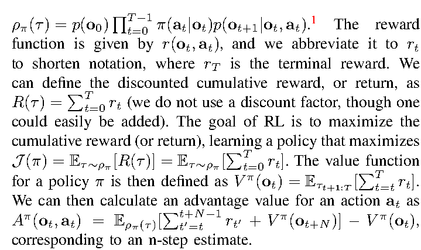

**中文说明:** 这一组公式定义了后文反复使用的四个量：轨迹分布 ρ_π(τ)、回报 R(τ)、价值 V^π(o_t) 与优势 A^π(o_t,a_t)。优势的含义是“在当前观测下，动作 a_t 比策略平均水平好多少”，RECAP 正是用它的二值化版本作为策略的条件输入。

**Source:** p.3 S021-S023

**Original:** Regularized reinforcement learning. Instead of maximizing J(π), it is common to use regularization in RL, optimizing for a policy that maximizes reward while remaining close to some reference policy π_ref [66–70]. This is important, for example, when we want to train for many gradient steps on the same data, in which case π_ref typically corresponds to the behavior policy that collected the training data. This can be formalized via the objective J(π, π_ref) = E_{τ∼ρ_πθ}[Σ_{t=0}^{T} γ^t r_t] − β E_{o∼ρ_πθ}[D(π(·|o) ∥ π_ref(·|o))], where D denotes some divergence metric. For the case where D is the KL divergence, we have the well-known result that π̂(a|o) ∝ π_ref(a|o) exp(A^{π_ref}(o, a)/β) is the solution to max_π J(π, π_ref), with Lagrange multiplier β [67–70].

**中文:** 正则化强化学习。与直接最大化 J(π) 不同，RL 中常见做法是加入正则化，即在最大化奖励的同时让策略保持接近某个参考策略 π_ref [66–70]。这一点很重要，例如当我们希望在同一批数据上训练很多梯度步时，此时 π_ref 通常就是采集这批训练数据的行为策略。这可以通过目标函数 J(π,π_ref) = E_{τ∼ρ_πθ}[Σ_{t=0}^{T} γ^t r_t] − β E_{o∼ρ_πθ}[D(π(·|o) ∥ π_ref(·|o))] 形式化，其中 D 表示某种散度度量。当 D 取 KL 散度时，有一个著名结论：π̂(a|o) ∝ π_ref(a|o) exp(A^{π_ref}(o,a)/β) 是 max_π J(π,π_ref) 的解，其中 β 为拉格朗日乘子 [67–70]。

**Source:** p.3 S024-S026

**Original:** Our advantage-conditioned policy extraction method is based on a closely related but less well-known result: if we define the policy π̂(a|o) ∝ π_ref(a|o) p(I | A^{π_ref}(o, a))^β, where p(I | A^{π_ref}(o, a)) = g(A^{π_ref}(o, a)) / ∫ g(A^{π_ref}(o, a')) da' is the probability of any action a improving over π_ref as measured by a monotonically increasing function g, then π̂ is guaranteed to improve over π_ref, i.e., J(π̂) ≥ J(π_ref) [4, 71]. We will use this property in deriving our policy extraction method in Section IV-B. Using this definition we can then obtain a parametric policy from the closed form definition of π̂ by solving the following minimization problem: min_θ E_{s∼ρ_π_ref}[KL(π̂, π_θ)].

**中文:** 我们的优势条件化策略提取方法基于一个密切相关但较少人知的结果：若定义策略 π̂(a|o) ∝ π_ref(a|o) p(I | A^{π_ref}(o,a))^β，其中 p(I | A^{π_ref}(o,a)) = g(A^{π_ref}(o,a)) / ∫ g(A^{π_ref}(o,a'))da' 表示“在单调递增函数 g 的度量下，任一动作 a 优于 π_ref”的概率，那么 π̂ 保证优于 π_ref，即 J(π̂) ≥ J(π_ref) [4, 71]。我们将利用这一性质在第 IV-B 节推导策略提取方法。借助该定义，我们可以通过求解如下最小化问题，从 π̂ 的闭式定义得到参数化策略：min_θ E_{s∼ρ_π_ref}[KL(π̂, π_θ)]。

## 四、RECAP：通过优势条件化策略从经验与纠正中学习

> IV. RL WITH EXPERIENCE AND CORRECTIONS VIA ADVANTAGE-CONDITIONED POLICIES (RECAP)

**Source:** p.3 S027 - p.4 S032

**Original:** Our method consists of the follow steps, which can be repeated one or more times to improve a base VLA model: 1) Data collection. We run the VLA on the task, labeling each episode with task outcome labels (which determine the reward), and optionally providing human interventions to provide examples of corrections for mistakes in the earlier iterations. 2) Value function training. We use all of the data collected so far to train a large, multi-task value function, which we refer to as V^{π_ref}, that can detect failures and judge the expected time to task completion. 3) Advantage conditioned training. To improve the VLA policy with this value function, we include an optimality indicator based on advantage values derived from this value function in the VLA prefix. This “advantage conditioned” recipe provides a simple and effective way to extract a more optimal policy from our value function with suboptimal data. Figure 1 illustrates the overall structure of the training process, while Figure 3 provides more detailed specifics of the value function and policy architectures. Our pre-training phase consists of performing steps (2) and (3) above on our entire pre-training dataset, which consists of tens of thousands of hours of demonstrations from numerous tasks and a variety of different robots. Then, we perform steps (1), (2), and (3) one or more times to further improve the VLA with autonomously collected data. We describe the value function training and policy training steps below, and then present our specific instantiation of this approach for training π*0.6 in Section V.

**中文:** 我们的方法由以下步骤组成，可以重复一轮或多轮来改进一个基座 VLA 模型：1) 数据采集。我们在任务上运行 VLA，为每个 episode 标注任务结果标签（由此确定奖励），并可选地提供人工干预，以便在较早的迭代中给出纠错示例。2) 价值函数训练。我们利用迄今为止收集的所有数据训练一个大型多任务价值函数，记为 V^{π_ref}，它能够检测失败并判断任务完成的预期时间。3) 优势条件化训练。为了用该价值函数改进 VLA 策略，我们在 VLA 的 prefix 中加入一个基于优势值的最优性指标。这种“优势条件化”配方提供了一种简单而有效的方式，可以从价值函数出发、在含次优数据的情况下提取出更优策略。图 1 展示了训练过程的整体结构，图 3 给出了价值函数与策略架构的更多细节。我们的预训练阶段是在全部预训练数据上执行上述步骤 (2) 与 (3)；这些数据由来自大量任务、各种不同机器人的数万小时示范组成。之后我们执行一次或多次步骤 (1)、(2)、(3)，用自主采集的数据进一步改进 VLA。下文先描述价值函数训练与策略训练步骤，然后在第 V 节给出我们用于训练 π*0.6 的具体实例。

> **脚注 1（p.3）：** *For simplicity, we assume the observation o_t constitutes a valid Markovian state. While not true in general, it is a common simplification in robotic RL.*
>
> **中文：** 为简单起见，我们假设观测 o_t 构成有效的马尔可夫状态。这在一般情况下并不成立，但它是机器人 RL 中常见的简化。

### A. 分布式价值函数训练

> A. Distributional value function training

**Source:** p.4 S033-S035

**Original:** To train a value function that can act as a reliable critic for any task in our pre-training or post-training stages, we represent V^{π_ref} with a multi-task distributional value function p_φ(V | o_t, ℓ) ∈ Δ_B [72], mapping the observations o_t and language command ℓ to a distribution over B discretized value bins. In our implementation, this value function uses the same architecture as the VLA policy, but with a smaller VLM backbone. Using R_t(τ) = Σ_{t'=t}^{T} r_{t'} to denote the empirical return of a trajectory τ from time step t until the end, we train p_φ(V | o_t, ℓ) by first discretizing the empirical return value R_t(τ) into B = 201 bins (using R_t^B to denote the discretized returns), and then minimizing the cross-entropy H over the trajectories in the current dataset D: min_φ E_{τ∈D} E_{o_t∈τ} H(R_t^B(τ), p_φ(V | o_t, ℓ)).   (1)

**中文:** 为了训练一个能在预训练与后训练阶段为任何任务充当可靠 critic 的价值函数，我们用多任务分布式价值函数 p_φ(V|o_t,ℓ) ∈ Δ_B [72] 来表示 V^{π_ref}，它把观测 o_t 与语言指令 ℓ 映射到 B 个离散价值桶（bin）上的分布。在我们的实现中，该价值函数与 VLA 策略使用相同架构，但骨干 VLM 更小。用 R_t(τ) = Σ_{t'=t}^{T} r_{t'} 表示轨迹 τ 从时刻 t 到结束的经验回报，我们先把经验回报 R_t(τ) 离散化为 B = 201 个桶（用 R_t^B 表示离散化后的回报），再在当前数据集 D 上最小化交叉熵 H 来训练 p_φ(V|o_t,ℓ)：min_φ E_{τ∈D} E_{o_t∈τ} H(R_t^B(τ), p_φ(V|o_t,ℓ))。（式 1）

### 式 (1)：分布式价值函数的交叉熵训练目标

**Source:** p.4（IV-A，左栏）

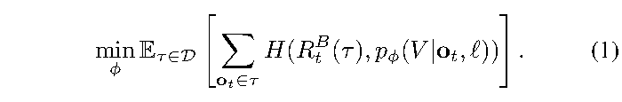

**公式（线性转写，仅供参考）:** min_φ E_{τ∈D} E_{o_t∈τ} H(R_t^B(τ), p_φ(V | o_t, ℓ))

**中文说明:** 把回报离散成 201 个桶，用交叉熵让价值函数预测“落在哪个桶”。这是蒙特卡洛（on-policy）估计：数据集 D 由谁采集，估计的就是谁的回报分布。

**Source:** p.4 S036

**Original:** This is a Monte Carlo estimator for the value function of the policy represented by the dataset D (i.e., the behavior policy π). We can extract a continuous value function (and thus an advantage) from the learned value distribution using V^{π_ref}(o_t, ℓ) = Σ_{b∈[0,B]} p_φ(V = b | o_t) v(b), where v(b) denotes the value corresponding to bin b. During the pre-training phase, the dataset D corresponds to the human demonstrations, and the value function captures the expected return for the task and metadata we condition on, while on subsequent iterations, it skews toward a weighted combination of the return of the demonstrations and the learned policy. While this on-policy estimator is less optimal than a more classic off-policy Q-function estimator, we found it to be simple and highly reliable, while still allowing for substantial improvement over imitation learning. Our method could be extended to accommodate off-policy estimators in future work.

**中文:** 这是对数据集 D 所代表的策略（即行为策略 π）的价值函数的蒙特卡洛估计。我们可以从学到的价值分布中提取连续价值函数（进而得到优势）：V^{π_ref}(o_t,ℓ) = Σ_{b∈[0,B]} p_φ(V = b|o_t) v(b)，其中 v(b) 表示第 b 个桶对应的价值。在预训练阶段，数据集 D 对应人类示范，价值函数刻画的是任务与我们条件化的元数据的期望回报；在后续迭代中，它会偏向示范回报与所学策略回报的加权组合。虽然这种 on-policy 估计不如经典的 off-policy Q 函数估计最优，但我们发现它简单且高度可靠，同时仍能带来相对模仿学习的大幅改进。我们的方法在未来工作中可以扩展到支持 off-policy 估计器。

### B. 通过优势条件化进行策略提取

> B. Policy extraction via advantage conditioning

**Source:** p.4 S037-S039

**Original:** Once we have the value function V^{π_ref}, we need a way to train an improved policy using this value function. This is called policy extraction. An effective policy extraction method in our setting needs to satisfy several criteria. First, it needs to effectively utilize diverse off-policy data, comprising the initial demonstrations, the expert interventions, and autonomous episodes from both the latest policy and older policies. This is closely related to the challenge faced by offline RL methods [2, 3]. Second, it needs to be scalable and easily to apply to large VLA models, including models that use flow matching or diffusion to generate actions. Third, it needs to effectively utilize both good (near-optimal) and bad (suboptimal) data, which is important if we want to improve the policy using autonomous experience. Among the existing methods for policy extraction, policy gradient methods (including regularized policy gradients and reparameterized gradients) are perhaps the most widely used [66, 74], but these methods are difficult to apply to flow matching models, which do not readily provide a tractable log-likelihood, making them hard to scale up to modern VLA architectures (see comparisons in Section VI). An alternative is to use weighted regression methods, such as AWR [68, 75, 76], which implicitly provide for regularization to the behavior policy and use a simple (importance-weighted) supervised learning objective. However, these methods discard or significantly downweight a significant portion of the data, effectively implementing a kind of filtered imitation technique. Instead, we use a variant of advantage conditioning [48], where the policy is trained on all of the data with supervised learning, but with an additional input indicating how optimal the action is based on the advantage. This is closely related to a variety of methods in the literature that propose to condition the policy on some function of the resulting trajectory [47, 50]. The specific formulation in our method is most closely related to CFGRL [4].

**中文:** 有了价值函数 V^{π_ref} 之后，我们需要一种用它训练出更好策略的方法，这被称为策略提取（policy extraction）。在我们的设定中，一个有效的策略提取方法需要满足几个标准。第一，它必须能有效利用多样的 off-policy 数据，包括初始示范、专家干预，以及来自最新策略和较早策略的自主 episode；这与离线 RL 方法所面对的挑战密切相关 [2, 3]。第二，它必须可扩展，易于应用到大型 VLA 模型，包括用流匹配或扩散生成动作的模型。第三，它必须能同时有效利用好（接近最优）与坏（次优）的数据，这对用自主经验改进策略很重要。在现有的策略提取方法中，策略梯度方法（包括正则化策略梯度与重参数化梯度）也许是最常用的 [66, 74]，但这些方法难以应用于流匹配模型——后者无法方便地给出可计算的 log-likelihood，因此很难扩展到现代 VLA 架构（对比见第 VI 节）。另一种选择是加权回归方法，例如 AWR [68, 75, 76]：它们隐式地提供了对行为策略的正则化，并使用简单的（重要性加权）监督学习目标。然而这类方法会丢弃或大幅降低相当一部分数据的权重，实际上实现的是某种“过滤式模仿”。我们转而使用优势条件化 [48] 的一个变体：策略在全部数据上用监督学习训练，但额外输入一个表示“动作有多优”的优势指标。这与文献中一系列“让策略以轨迹某个函数为条件”的方法密切相关 [47, 50]，我们的具体形式与 CFGRL [4] 最为接近。

**Source:** p.5 S040-S042

**Original:** Building on the formulation in Section III, we can apply Bayes rule to rewrite the probability of policy improvement as p(I | A^{π_ref}(o, a)) = π_ref(a | I, o) / π_ref(a | o). Applying this to our setting and including language conditioning, we can obtain an alternative closed form for the improved regularized policy described in Section III as π̂(a | o, ℓ) ∝ π_ref(a | o, ℓ) ( π_ref(a | I, o, ℓ) / π_ref(a | o, ℓ) )^β.   (2) For the special case β = 1, π̂(a | o, ℓ) = π_ref(a | I, o, ℓ). We can therefore represent π̂ without needing to explicitly represent the improvement probability p(I | A^{π_ref}(o, a)), if we train the policy so that it can represent both π_ref(a | o, ℓ) and π_ref(a | I, o, ℓ). This principle is similar to the approach in classifier-free guidance, where a diffusion model is trained to model the data both with and without a conditioning variable [4].

**中文:** 在第 III 节形式化的基础上，我们可以用贝叶斯法则把“策略改进”的概率改写为 p(I|A^{π_ref}(o,a)) = π_ref(a|I,o) / π_ref(a|o)。把它应用到我们的设定并加入语言条件化，第 III 节所述改进后的正则化策略就有了一个替代闭式解：π̂(a|o,ℓ) ∝ π_ref(a|o,ℓ) ( π_ref(a|I,o,ℓ) / π_ref(a|o,ℓ) )^β。（式 2）当 β = 1 时，π̂(a|o,ℓ) = π_ref(a|I,o,ℓ)。因此，只要我们训练策略使其同时能表示 π_ref(a|o,ℓ) 与 π_ref(a|I,o,ℓ)，就不必显式表示改进概率 p(I|A^{π_ref}(o,a))。这一原理类似于无分类器引导（CFG）中的做法：扩散模型被训练成在有条件变量和无条件变量下都能建模数据 [4]。

### 式 (2)：优势条件化策略的闭式形式

**Source:** p.5（IV-B，左栏）

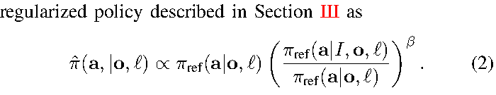

**公式（线性转写，仅供参考）:** π̂(a | o, ℓ) ∝ π_ref(a | o, ℓ) · [ π_ref(a | I, o, ℓ) / π_ref(a | o, ℓ) ]^β

**中文说明:** 直观理解：把“有条件（I）与无条件”两个策略的比值作为改进方向，β 控制锐化强度。β = 1 时退化为直接用 I 条件化的策略；β > 1 用于推理时进一步锐化（类似 CFG）。

**Source:** p.5 S043-S050

**Original:** We assume the improvement indicator I follows a delta distribution p(I | A^{π_ref}(o, a, ℓ)) = δ(A^{π_ref}(o, a, ℓ) > ϵ_ℓ), with a task dependent improvement threshold ϵ_ℓ. This threshold allows us to control the optimality indicator, and minimizes the need for finding an attenuation factor β to sharpen the improvement conditioned distribution after training.² The policy objective then corresponds to minimizing the following negative log-likelihood: min_θ E_D [ − log π_θ(a_t | o_t, ℓ) − α log π_θ(a_t | I_t, o_t, ℓ) ],   (3) where I_t = 1(A^{π_ref}(o_t, a_t, ℓ) > ϵ_ℓ). The advantage values A^{π_ref}(o_t, a_t, ℓ) are obtained from the value function in the previous section, and α is a trade-off hyperparameter. In practice, the dataset D consists of all of the data collected so far, including all demonstrations and autonomous task attempts, and the reference policy π_ref is therefore a mixture of human behavior and previously deployed policies. To include human corrections, we found it useful to force I_t = True (i.e., positive) for actions provided as human corrections during autonomous rollouts. This choice is reasonable if we assume that human experts always provide good corrective actions. As we will discuss in Section V, in practice our VLA model produces both discrete and continuous outputs, with the continuous distribution represented via flow matching. Therefore, the real training objective combines likelihoods for the discrete values with the flow matching objective for the continuous values. In practice, we pre-train one model to represent π_θ(a_t | I_t, o_t, ℓ) on our entire pre-training dataset, and then perform one or more iterations of our method with on-policy rollouts (and, optionally, expert corrective interventions) for each task.

**中文:** 我们假设改进指标 I 服从 delta 分布：p(I|A^{π_ref}(o,a,ℓ)) = δ(A^{π_ref}(o,a,ℓ) > ϵ_ℓ)，其中 ϵ_ℓ 是与任务相关的改进阈值。该阈值让我们可以控制最优性指标，并尽量减少事后为了锐化“改进条件化分布”而去寻找衰减因子 β 的需要。²此时策略目标对应于最小化如下负对数似然：min_θ E_D [ − log π_θ(a_t|o_t,ℓ) − α log π_θ(a_t|I_t,o_t,ℓ) ]。（式 3）其中 I_t = 1(A^{π_ref}(o_t,a_t,ℓ) > ϵ_ℓ)。优势值 A^{π_ref}(o_t,a_t,ℓ) 来自上一节的价值函数，α 是权衡超参数。在实践中，数据集 D 包含迄今收集的所有数据，包括全部示范与自主任务尝试，因此参考策略 π_ref 是人类行为与以往部署策略的混合。为纳入人工纠正，我们发现在自主 rollout 中把人工纠正提供的动作强制设为 I_t = True（即正）是有用的；若假设人类专家总是提供良好的纠正动作，这一选择是合理的。正如第 V 节将讨论的，我们的 VLA 模型实际上同时产生离散与连续输出，其中连续分布用流匹配表示。因此真实训练目标要把离散值的似然与连续值的流匹配目标结合起来。实践中我们预训练一个模型，在全部预训练数据上表示 π_θ(a_t|I_t,o_t,ℓ)，然后对每个任务执行一轮或多轮带 on-policy rollout（以及可选的专家纠正干预）的迭代。

### 式 (3)：优势条件化的策略训练目标

**Source:** p.5（IV-B，左栏）

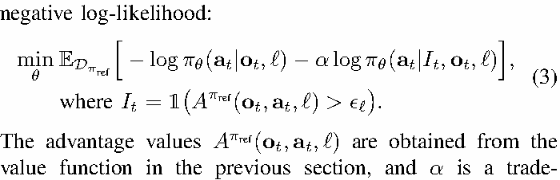

**公式（线性转写，仅供参考）:** min_θ E_D [ − log π_θ(a_t | o_t, ℓ) − α log π_θ(a_t | I_t, o_t, ℓ) ]

**中文说明:** 第一项是无条件的模仿项，第二项是“以改进指标为条件”的项；α 控制两者权重。注意 I_t 只依赖优势是否超过任务阈值 ϵ_ℓ，是二值输入，因此模型不必显式建模改进概率。

> **脚注 2（p.5）：** *Prior work [4] instead uniformly chose ϵ = 0 and tuned β at test time, as in classifier-free guidance (CFG). However, high CFG weights can drive the action distribution to the corners of its support (leading to aggressive behavior) and would not affect the autoregressive part of the model. We found it easier to obtain good results by instead using the threshold ϵ to trade off regularization and optimality.*
>
> **中文：** 此前工作 [4] 统一取 ϵ = 0，并在测试时调节 β，如同无分类器引导（CFG）。但较大的 CFG 权重会把动作分布推向其支撑集的角落（导致行为过于激进），而且不会影响模型的自回归部分。我们发现改用阈值 ϵ 来权衡正则化与最优性更容易取得好结果。

### C. 方法总结

> C. Method summary

**Source:** p.5 S051-S052

**Original:** We provide an overview of our full method in Algorithm 1. As summarized at the beginning of this section, the method can be fully defined through application of three subroutines: collecting data through autonomous rollouts (with optional corrective interventions from an expert), training a value function according to Equation 1, and training a policy according to Equation 3. The only thing that changes between different steps of the method is the data provided to each subroutine: the pre-training stage uses all prior demonstration data, and the training process for the specialists for each skill ℓ^(i) uses additional autonomous data. In practice, the specialists are fine-tuned from the pre-trained model, while the final generalist is trained from scratch. Additional details on the method are provided in Appendix F.

**中文:** 我们在算法 1 中给出完整方法的概览。如本节开头所总结，该方法完全由三个子程序定义：通过自主 rollout（并可选地由专家进行纠正干预）采集数据；按式 1 训练价值函数；按式 3 训练策略。方法在不同步骤之间的唯一差别，是提供给各子程序的数据：预训练阶段使用此前所有示范数据，而针对每项技能 ℓ^(i) 的专家（specialist）训练过程额外使用自主数据。实践中，专家模型是从预训练模型微调得到的，而最终的通用模型是从零训练的。方法的更多细节见附录 F。

### A001. 算法 1：RECAP（通过优势条件化策略从经验与纠正中学习）

**Placed near:** p.5 S052（“我们在算法 1 中给出完整方法的概览”）
**Source:** p.6（左栏，Algorithm 1）

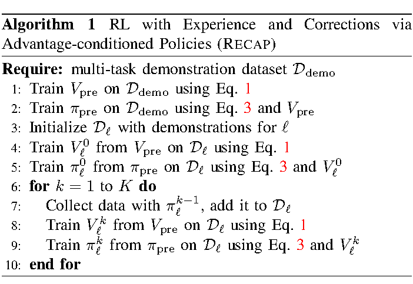

**Original caption:** Algorithm 1: RL with Experience and Corrections via Advantage-conditioned Policies (RECAP). Require: multi-task demonstration dataset D_demo. 1: Train V_pre on D_demo using Eq. 1; 2: Train π_0 on D_demo using Eq. 3 and V_pre; 3: Initialize D_ℓ with demonstrations for ℓ; 4: Train V_ℓ from V_pre on D_ℓ using Eq. 1; 5: Train π_0,ℓ from π_0 on D_ℓ using Eq. 3 and V_ℓ; 6: for k = 1 to K do; 7: Collect data with π_{k−1},ℓ, add it to D_ℓ; 8: Train V_{k,ℓ} from V_pre on D_ℓ using Eq. 1; 9: Train π_{k,ℓ} from π_pre on D_ℓ using Eq. 3 and V_ℓ; 10: end for

**中文图注:** 算法 1：通过优势条件化策略从经验与纠正中学习（RECAP）。要求：多任务示范数据集 D_demo。1：用式 1 在 D_demo 上训练 V_pre；2：用式 3 与 V_pre 在 D_demo 上训练 π_0；3：用任务 ℓ 的示范初始化 D_ℓ；4：用式 1 在 D_ℓ 上从 V_pre 训练 V_ℓ；5：用式 3 与 V_ℓ 在 D_ℓ 上从 π_0 训练 π_{0,ℓ}；6：for k = 1 to K do；7：用 π_{k−1,ℓ} 采集数据并加入 D_ℓ；8：用式 1 在 D_ℓ 上从 V_pre 训练 V_{k,ℓ}；9：用式 3 与 V_ℓ 在 D_ℓ 上从 π_pre 训练 π_{k,ℓ}；10：end for。

**阅读提示:** 伪代码的关键在于：预训练（步骤 1-2）→ 任务专门化（3-5）→ 迭代式自主数据采集与再训练（6-10）。

### F003. π*0.6 VLA 与价值函数在 RECAP 训练中的交互

**Placed near:** p.4 S031（“图 3 给出了价值函数与策略架构的更多细节”）
**Source:** p.4 C003

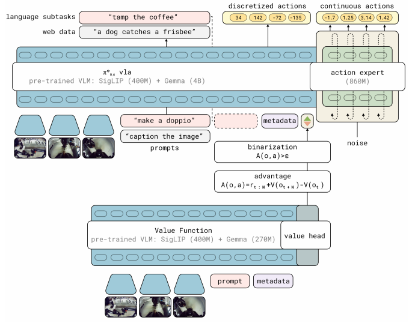

**Original caption:** Fig. 3: Interaction between the π*0.6 VLA and value function during RECAP training. The π*0.6 VLA uses a pre-trained VLM backbone. Training follows the KI recipe [73], with next-token prediction on many data sources in pre-training, and an flow-matching action-expert with stop gradient. The VLA is conditioned on a binarized advantage indicator, obtained from a separate value function initialized from a pre-trained but smaller VLM model.

**中文图注:** 图 3：RECAP 训练过程中 π*0.6 VLA 与价值函数之间的交互。π*0.6 VLA 使用预训练的 VLM 骨干。训练遵循 KI（Knowledge Insulation，知识隔离）配方 [73]：在预训练中对多种数据源做下一词元预测，并配有带停止梯度的流匹配动作专家（action expert）。VLA 以一个二值化优势指标为条件，该指标来自另一个独立的价值函数，后者由一个预训练的、较小的 VLM 模型初始化。

**阅读提示:** 看图时抓住两条通路：VLA（含动作专家）负责生成动作；价值函数把优势二值化后回灌到 VLA 的条件输入里。

## 五、实现、模型与系统细节

> V. IMPLEMENTATION, MODEL, AND SYSTEM DETAILS

**Source:** p.5 S053 - p.6 S057

**Original:** We instantiate RECAP with a VLA that we call π*0.6. π*0.6 is based on the π0.6 VLA, which is an evolution of the π0.5 VLA [5] with a few improvements that we detail in the accompanying model card [6]. π*0.6 additionally adds the ability to condition on the binarized advantage indicator I_t, making it suitable for RL training with RECAP. The model architecture is illustrated in Figure 3. We train a value function alongside the VLA, following the method described in Section IV-A. This value function is also initialized from a VLM. Training this value function and VLA with RECAP results in our final model, which we call π*0.6. In this section, we first elaborate on the design of our model and how it can be extended to use advantage values from the value function, then describe the reward function and value function, and then elaborate on the training and data collection process in our implementation.

**中文:** 我们用一种称为 π0.6 的 VLA 来实例化 RECAP。π0.6 基于 π0.6 VLA，而 π0.6 是 π0.5 VLA [5] 的演进版本，并在随附的模型卡（model card）[6] 中给出了若干改进。π0.6 另外增加了“以二值化优势指标 I_t 为条件”的能力，使其适合用 RECAP 做 RL 训练。模型架构见图 3。我们按照第 IV-A 节描述的方法，与 VLA 一同训练一个价值函数；该价值函数同样由 VLM 初始化。用 RECAP 训练该价值函数与 VLA，就得到我们的最终模型 π0.6。本节先说明模型设计以及如何扩展它以使用价值函数给出的优势值，然后描述奖励函数与价值函数，最后展开我们实现中的训练与数据采集过程。

### A. π0.6 模型

> A. The π0.6 model

**Source:** p.6 S058-S061

**Original:** The π0.6 model [6] is derived from the π0.5 model, which can flexibly represent chunked action distributions via flow matching and produce intermediate text for high-level policy reasoning. It uses the Knowledge Insulation (KI) training procedure [73], which trains the entire model end-to-end on continuous actions and discretized tokens (including actions discretized via FAST [77]), while using a stop gradient to prevent the flow-matching action expert from impacting the rest of the model. Pre-training uses both robot data and vision-language co-training data from the web. π0.6 improves on π0.5 in several ways: (i) The pre-training dataset is augmented with additional data from multiple robot platforms. (ii) The base VLM is Gemma 3 [78] 4B model. (iii) The size of the action expert is increased to 860M parameters. The model can be written as π1_θ(a_{t:t+H}, ℓ̂ | o_t, ℓ), where o_t = [X_1, ..., X_n, q_t] contains camera images X, the robot's configuration q, and ℓ = ℓ_t + s is the language input consisting of the overall task prompt ℓ_t (e.g., “make me an espresso”), as well as additional language inputs s providing metadata that further modulates how the task is performed. The model produces action chunks a_{t:t+H}, which consists of joint angles and gripper commands at 50 Hz, using a separate “action expert” — a dedicated set of weights (860M parameters) that are trained with flow matching specifically for action generation, but can attend to the activations in the rest of the model. The model also produces tokenized discrete outputs ℓ̂, which includes a textual representation of the next predicted sub-task (such as “pick up the coffee cup”) used for high-level decision-making. Since the actions are generated after ℓ̂, action generation is effectively conditioned on this predicted sub-task, providing high-level guidance. At inference time, the sub-task prediction runs at a lower frequency than action generation.

**中文:** π0.6 模型 [6] 派生自 π0.5 模型。π0.5 能用流匹配灵活地表示分块动作分布，并产生用于高层策略推理的中间文本。它采用知识隔离（Knowledge Insulation, KI）训练流程 [73]：在连续动作与离散化词元（包括用 FAST [77] 离散化的动作）上端到端训练整个模型，同时用停止梯度（stop gradient）防止流匹配动作专家影响模型其余部分。预训练同时使用机器人数据和来自网络的视觉-语言协同训练数据。**π0.6 在若干方面改进了 π0.5：(i) 预训练数据集增加了来自多个机器人平台的额外数据；(ii) 基础 VLM 换为 Gemma 3 [78] 4B 模型；(iii) 动作专家的规模增大到 860M 参数。**模型可以写成 π1_θ(a_{t:t+H}, ℓ̂ | o_t, ℓ)，其中 o_t = [X_1, ..., X_n, q_t] 包含相机图像 X、机器人构型 q；ℓ = ℓ_t + s 是语言输入，由整体任务提示 ℓ_t（例如“给我做一杯意式浓缩”）以及提供元信息的额外语言输入 s 组成，后者进一步调制任务的执行方式。模型以 50 Hz 产生动作块 a_{t:t+H}（含关节角度与夹爪指令），所用的“动作专家”是一组专用权重（860M 参数），专门用流匹配针对动作生成训练，但可以关注模型其余部分的激活。模型还产生词元化的离散输出 ℓ̂，其中包含对下一个预测子任务（如“拿起咖啡杯”）的文本表示，用于高层决策。由于动作是在 ℓ̂ 之后生成的，动作生成实际上以该预测子任务为条件，从而获得高层引导。推理时，子任务预测的频率低于动作生成频率。

**Source:** p.6 S062-S065

**Original:** During training, the model also predicts a tokenized representation of the action chunk a_{t:t+H}, using the FAST tokenizer [77], as part of the KI recipe [73]. We denote these discretized actions a^ℓ_{t:t+H}. The action expert does not receive these as input, such that discrete and continuous actions are predicted independently. This results in the final training log-likelihood log π_θ(a_{t:t+H}, a^ℓ_{t:t+H}, ℓ̂ | o_t, ℓ). Since we predict ℓ̂ first, we can factorize this log-likelihood according to: log π_θ(a_{t:t+H}, a^ℓ_{t:t+H}, ℓ̂ | o_t, ℓ) = log π_θ(ℓ̂ | o_t, ℓ) + log π_θ(a_{t:t+H} | o_t, ℓ, ℓ̂) + log π_θ(a^ℓ_{t:t+H} | o_t, ℓ, ℓ̂).

**中文:** 训练时，作为 KI 配方 [73] 的一部分，模型还会用 FAST 分词器 [77] 预测动作块 a{t:t+H} 的词元化表示；我们把这些离散化动作记为 a^ℓ{t:t+H}。动作专家不接收这些输入，因此离散动作与连续动作是独立预测的。这给出最终的训练对数似然 log πθ(a{t:t+H}, a^ℓ{t:t+H}, ℓ̂ | o_t, ℓ)。由于我们先预测 ℓ̂，可以按如下方式分解该对数似然：log πθ(a{t:t+H}, a^ℓ{t:t+H}, ℓ̂|o_t,ℓ) = log πθ(ℓ̂|o_t,ℓ) + log πθ(a{t:t+H}|o_t,ℓ,ℓ̂) + log πθ(a^ℓ_{t:t+H}|o_t,ℓ,ℓ̂)。

### B. 从 π0.6 到 π*0.6：优势条件化

> B. From π0.6 to π*0.6 with advantage conditioning

**Source:** p.6 S066-S070

**Original:** To incorporate information about the advantage into the policy, we expand the model inputs to contain an additional improvement indicator as an additional text input, inputting “Advantage: positive” when I_t = True, and “Advantage: negative” otherwise. The VLA model is otherwise the same as described in Section V-A. The advantage indicator appears in the training sequence after ℓ̂ but before the (discretized and continuous) actions, such that only the action log-likelihoods are affected. The continuous part of the log-likelihood cannot be evaluated exactly, and instead is trained via the flow matching loss [79]. It is possible to draw a close parallel between flow matching and diffusion (under some assumptions), and the latter in turn can be interpreted as a lower bound on the log-likelihood [80], so we can roughly motivate the sum of the log-likelihood of the discrete actions and the flow matching loss on the continuous actions as a lower bound on the overall action likelihood: log π²_θ(a_{t:t+H}, a^ℓ_{t:t+H} | I_t, o_t, ℓ, ℓ̂) ≥ E_{η,ω}[ log p_θ(a^ℓ_{t:t+H} | I_t, o_t, ℓ, ℓ̂) − α_η ‖ω − a_{t:t+H} − f_θ(a^{η,ω}_{t:t+H}, I_t, o_t, ℓ, ℓ̂)‖² ],   (4) with a^{η,ω}_{t:t+H} = η a_{t:t+H} + (1 − η) ω, ω ∼ N(0, I) denoting the noised action, where η ∈ [0, 1] is the flow matching time index and f_θ denotes the continuous outputs of the diffusion expert. α_η is a loss weighting term (which can optionally be noise dependent). Full details for the loss are provided in Appendix C. During training, we randomly omit the indicator I_t instead of tuning the loss multiplier α_η, to allow us to either directly sample from the policy with I_t = True (which corresponds to setting β = 1 in Equation (2)), or to use both a conditional and unconditional model to implement classifier-free guidance (CFG), which enables inference with β > 1. See Appendix E for details.

**中文:** 为了把优势信息纳入策略，我们扩展模型输入，增加一个改进指标作为额外的文本输入：当 I_t = True 时输入“Advantage: positive”，否则输入“Advantage: negative”。除此之外，VLA 模型与第 V-A 节所述相同。该优势指标出现在训练序列中 ℓ̂ 之后、（离散与连续）动作之前，因此只影响动作部分的对数似然。对数似然的连续部分无法精确计算，改用流匹配损失训练 [79]。流匹配与扩散（在一定假设下）有紧密的类比，而后者又可以解释为对数似然的下界 [80]，因此我们可以粗略地把“离散动作的对数似然 + 连续动作的流匹配损失”视为整体动作似然的下界：log π²_θ(a_{t:t+H}, a^ℓ_{t:t+H} | I_t, o_t, ℓ, ℓ̂) ≥ E_{η,ω}[ log p_θ(a^ℓ_{t:t+H}|I_t,o_t,ℓ,ℓ̂) − α_η ‖ω − a_{t:t+H} − f_θ(a^{η,ω}_{t:t+H}, I_t, o_t, ℓ, ℓ̂)‖² ]。（式 4）其中 a^{η,ω}_{t:t+H} = η a_{t:t+H} + (1 − η) ω，ω ∼ N(0,I) 表示加噪后的动作；η ∈ [0,1] 是流匹配时间索引，f_θ 表示扩散专家的连续输出；α_η 是损失权重项（可选地依赖噪声强度）。损失函数的完整细节见附录 C。训练时我们随机省略指标 I_t（而不是调损失乘子 α_η），这样既可以只在 I_t = True 时直接从策略采样（对应式 2 中 β = 1），也可以同时使用有条件与无条件模型实现无分类器引导（CFG），从而支持 β > 1 的推理。详见附录 E。

### 式 (4)：整体动作似然的下界（离散对数似然 + 流匹配损失）

**Source:** p.6（V-B，右栏）

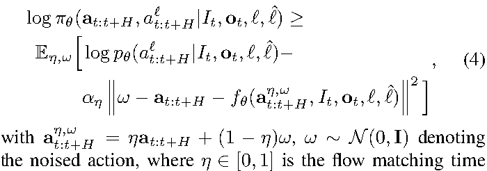

**公式（线性转写，仅供参考）:** log π²_θ(a_{t:t+H}, a^ℓ_{t:t+H} | I_t, o_t, ℓ, ℓ̂) ≥ E_{η,ω}[ log p_θ(a^ℓ_{t:t+H} | I_t, o_t, ℓ, ℓ̂) − α_η ‖ω − a_{t:t+H} − f_θ(a^{η,ω}_{t:t+H}, I_t, o_t, ℓ, ℓ̂)‖² ]

**中文说明:** 这是把流匹配训练损失解释为似然下界的关键式子：第一项是离散动作（含子任务文本）的交叉熵，第二项是连续动作的流匹配回归损失。

### C. 奖励定义与价值函数训练

> C. Reward definition and value function training

**Source:** p.6 S071 - p.7 S072

**Original:** Since our aim is to develop a general and broadly applicable method for training VLAs from experience, we use a general sparse reward definition that can be applied to essentially any task. For each episode, we obtain a label indicating whether that episode was successful. We derive the reward from this episode-level success label such that the value function corresponds to the (negative) number of steps until successful completion of the episode. This is equivalent to the following reward function, where T corresponds to the last step in the episode, and C_fail is a large constant that is chosen so as to ensure that failed episodes have low values:

**中文:** 由于我们的目标是提出一种通用且适用范围广的“从经验训练 VLA”的方法，我们采用一种通用的稀疏奖励定义，它几乎可以应用于任何任务。对每个 episode，我们得到一个表示该 episode 是否成功的标签；我们由这个 episode 级成功标签导出奖励，使价值函数对应“到成功完成所剩步数的负值”。这等价于如下奖励函数，**其中 T 表示 episode 的最后一步，C_fail 是一个很大的常数，用来确保失败的 episode 具有很低的价值：**

### 式 (5)：稀疏奖励定义

**Source:** p.7（V-C，左栏）

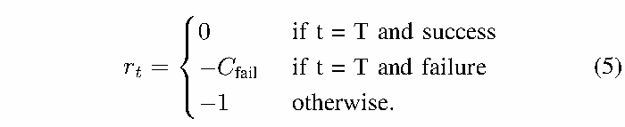

**公式（线性转写，仅供参考）:** r_t = 0 (t = T 且成功)；r_t = −C_fail (t = T 且失败)；r_t = −1 (其他情况)

**中文说明:** 成功时终局奖励为 0，失败时为 −C_fail，**其余每一步为 −1**。于是“最大化回报”等价于“尽快成功”，价值函数因此可以直接当作剩余步数的预测器。

【Note】

成功轨迹：$[-1, -1, -1, ... , 0]$

失败轨迹：$[-1, -1, -1, ... , -C_{fail}]$

-1 惩罚长轨迹

**Source:** p.7 S073-S076

**Original:** With this reward function, we train the value function to predict the (negative of the) number of remaining steps until success for successful episodes, and a large negative value for failed episodes. In practice, we normalize the values predicted to be between (−1, 0). Since we train on diverse tasks that have very different typical lengths, we normalize the values per task based on the maximum episode length of the task. The value function takes as input the same language inputs as the π*0.6 VLA, and uses the same architecture design, with a smaller 670M parameter VLM backbone that is also initialized from Gemma 3 (see Figure 3). To prevent overfitting, we also co-train the value function on a small mixture of multi-modal web data. Figure 4 shows visualizations of the value function on some examples of successful and failure episodes, with additional visualizations in Figure 13 in Appendix B.

**中文:** 有了这个奖励函数，我们训练价值函数去预测：成功 episode 中“到成功还剩多少步”的负值，以及失败 episode 的一个很大的负值。**实践中我们把预测值归一化到 (−1, 0) 之间**；**由于训练任务多样、典型时长差异很大，我们按任务的最大 episode 长度做逐任务归一化。**价值函数接收与 π*0.6 VLA 相同的语言输入，并采用相同的架构设计，但骨干 VLM 更小（670M 参数），同样由 Gemma 3 初始化（见图 3）。为防止过拟合，我们还在一小部分多模态网络数据上协同训练价值函数。图 4 展示了价值函数在若干成功与失败 episode 上的可视化，更多可视化见附录 B 的图 13。

### F004. 价值函数可视化

**Placed near:** p.7 S076（“图 4 展示了价值函数在若干成功与失败 episode 上的可视化”）
**Source:** p.5 C004

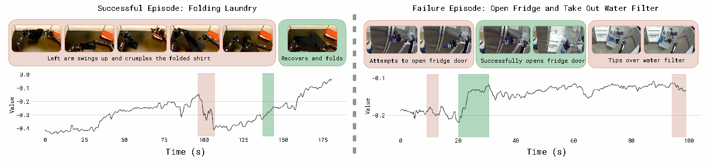

**Original caption:** Fig. 4: Visualization of the value functions. We train a multi-task value function to predict the number of steps to success, normalized by maximum task length to (−1, 0), where 0 corresponds to successful completion. We visualize the value function output on a folding task that finished successfully (left), and an unsuccessful example of a manipulation task from the pre-training dataset (right). The red parts highlight a drop in value, and green parts highlight increases; images on top show the corresponding frames of the episode. The visualization shows that the VF correctly identifies mistakes in the episode, as well as the speed of progress.

**中文图注:** 图 4：价值函数可视化。我们训练一个多任务价值函数，预测到成功的步数，并按任务最大长度归一化到 (−1, 0)，其中 0 对应成功完成。我们可视化了一个成功完成的折叠任务（左）与一个来自预训练数据集的失败操作任务（右）上的价值函数输出。红色部分表示价值下降，绿色部分表示价值上升；上方图像展示该 episode 的对应帧。可视化表明价值函数能正确识别 episode 中的错误以及进展速度。

**阅读提示:** 重点看红色“掉坑”的位置与之后是否恢复：这决定了优势指标 I 在训练中如何区分好动作与坏动作。

### D. 预训练、数据采集与从经验中学习

> D. Pre-training, data collection, and learning from experience

**Source:** p.7 S077-S080

**Original:** The data mixture used in the pre-training phase of our model largely follows the recipe used by π0.5 [5], with vision-language data from the web, prediction of subtasks ℓ̂, and prediction of low-level actions on a variety of tasks from many different robots. We note that, after pre-training, π*0.6 can perform many more tasks than the ones used in evaluation in Section VI. During pre-training, we first train the value function on the same dataset, predicting (the negative of) the number of steps to successful completion of each task. Then we estimate the per-task improvement threshold, ϵ_ℓ, used in determining the advantage-based improvement indicator I_t. We set ϵ_ℓ to the 30% percentile of values predicted by the value function for the task ℓ. We then run the value function on-the-fly during VLA training to estimate A^{π_ref}(o_t, a_t, ℓ) for each example, and then use it to compute I_t based on ϵ_ℓ. I_t is included as an input to π*0.6 as described in Section V-A. As we use a relatively small VLM backbone (670M) for the value function, on-the-fly inference of the value function incurs minimal additional cost during VLA training. After pre-training we start a policy improvement loop for the target task. We first finetune π*0.6 with demonstration data D_ℓ for the target task ℓ. We fix the indicator I_t to True in this stage, which we found to lead to slightly better results, such that this stage corresponds to supervised finetuning (SFT). This results in the initial policy π0_ℓ, which is then used to collect additional data that is added to D_ℓ.

**中文:** 我们模型预训练阶段所用的数据混合大体沿用 π0.5 [5] 的配方，包含来自网络的视觉-语言数据、子任务 ℓ̂ 的预测，以及来自许多不同机器人的多种任务上的低层动作预测。需要指出的是，预训练之后，π*0.6 能够完成的任务远多于第 VI 节评估中使用的任务。预训练时，我们首先在同一数据集上训练价值函数，预测每个任务“到成功完成所剩步数”的负值；然后估计逐任务的改进阈值 ϵ_ℓ，它用于确定基于优势的改进指标 I_t：我们取该任务价值函数预测值的第 30 百分位数作为 ϵ_ℓ。接着在 VLA 训练过程中在线运行价值函数，为每个样本估计 A^{π_ref}(o_t,a_t,ℓ)，再据此与 ϵ_ℓ 一起计算 I_t。如第 V-A 节所述，I_t 作为 π*0.6 的输入之一。由于价值函数使用的 VLM 骨干相对较小（670M），在线推理价值函数在 VLA 训练中带来的额外开销极小。预训练之后，我们针对目标任务启动策略改进循环：先用目标任务 ℓ 的示范数据 D_ℓ 微调 π*0.6，并在该阶段把指标 I_t 固定为 True（我们发现这样效果略好），因此这一阶段相当于监督微调（SFT）。由此得到初始策略 π0_ℓ，再用它采集额外数据并加入 D_ℓ。

**Source:** p.7 S081-S085

**Original:** While some of the episodes are collected fully autonomously, some are monitored by an expert teleoperator who can intervene to provide corrections. These corrections can show the policy how to avoid catastrophic failures or how to recover from mistakes. Note, however, that the corrections alone are unlikely to fix all issues: intervening during autonomous execution is a disruptive event, and even expert human operators cannot guarantee a consistent quality of interventions nor improve subtle aspects of the behavior, such as overall speed. Thus, the corrections serve more to fix large mistakes and overcome challenges with exploration, and do not by themselves provide for optimal supervision, in contrast to theory [7]. Recall from Section IV-B that we force I_t = True for all corrections, but otherwise the entire episode (both the autonomous parts and the corrections) are optionally added to the dataset D_ℓ regardless of whether or not a correction was provided. After data collection, we finetune the value function on all of the data collected for the task so far, and then use it to finetune the policy with updated indicators I_t, using the same procedure as in pre-training. Both the value function and policy are finetuned from the pre-trained checkpoint, rather than the policy and value function from the last iteration. We found this to be useful for avoiding drift over multiple iterations, though it may be possible to also obtain good results by consistently finetuning from the last model. We can repeat this process for several iterations as needed, though in practice we found that even one iteration often leads to significantly improved results.

**中文:** **这些 episode 中有一些是完全自主采集的，另一些则由专家遥操作员监控，必要时介入给出纠正。这些纠正可以告诉策略如何避免灾难性失败，或如何从错误中恢复。但要注意，仅靠纠正不太可能解决所有问题：在自主执行中介入本身是一个会打断流程的事件，而且即便是人类专家也无法保证干预质量始终一致，更难以改进行为中较细微的方面（例如整体速度）。**因此，纠正更多是用来修复重大错误、克服探索难题，其本身并不能提供最优监督——这与理论预期相反 [7]。回顾第 IV-B 节：我们对所有纠正都强制 I_t = True；除此之外，无论是否提供了纠正，整个 episode（包括自主部分与纠正部分）都可选择性地加入数据集 D_ℓ。数据采集之后，我们在该任务迄今收集的全部数据上微调价值函数，再用更新后的指标 I_t 微调策略，流程与预训练相同。价值函数与策略都从预训练 checkpoint 出发微调，而不是从上一次迭代的模型出发；我们发现这有助于避免多轮迭代中的漂移，不过持续从最新模型微调或许也能取得好结果。该过程可按需重复若干轮，但实践中我们发现即使只做一轮，往往也能带来显著的性能提升。

### F005. 实验所用机器人平台

**Placed near:** p.7 S081（机器人配置与观测的描述）
**Source:** p.7 C005

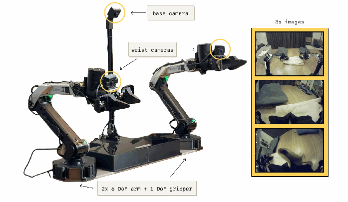

**Original caption:** Fig. 5: The robot setup used in our experiments. π*0.6 is trained on data from many different robots in pre-training. For the iterative improvement experiments, we use a static bimanual system with two 6 DoF arms with parallel jaw grippers. The arms are controlled at 50 Hz with joint positions. Observations consist of joint and gripper positions, as well as images from three cameras: a base camera mounted between the arms, and a wrist-mounted camera on each arm. The setup can be mounted flexibly, e.g. on a table.

**中文图注:** 图 5：我们实验中使用的机器人平台。π*0.6 在预训练时使用来自许多不同机器人的数据。在迭代改进实验中，我们使用一个固定的双臂系统，两条 6 自由度机械臂配平行夹爪，以 50 Hz 用关节位置控制。观测包括关节与夹爪位置，以及来自三个相机的图像：安装在两臂之间的基座相机，以及每条手臂上的腕部相机。该系统可以灵活安装，例如装在桌面上。

**阅读提示:** 注意观测只有三个相机 + 本体感觉，动作是 50 Hz 关节位置与夹爪指令——这对理解动作块（action chunk）的尺度很重要。

## 六、实验评估

> VI. EXPERIMENTAL EVALUATION

**Source:** p.7 S086-S088

**Original:** In our experimental evaluation, we use RECAP to train the π0.6 model on a set of realistic tasks: making espresso drinks, folding diverse laundry, and assembling boxes. Each task requires multiple steps, ranging from 5 to 15 minutes in duration, complex manipulation behaviors (constrained forceful manipulation, pouring liquids, manipulating cloth and cardboard, etc.), and fast execution to provide for high throughput. We illustrate the robotic platform used in our experiments in Figure 5. We give details on the tasks and baselines below, followed by quantitative experiments.

**中文:** 在实验评估中，我们用 RECAP 在一组真实任务上训练 π0.6 模型：制作意式咖啡、折叠各种衣物、组装纸箱。每个任务都需要多个步骤，时长在 5 到 15 分钟之间，涉及复杂的操作行为（受约束的力控操作、倾倒液体、操作布料与纸板等），并且需要快速执行以获得高吞吐量。实验所用的机器人平台见图 5。下面先说明任务与基线，然后给出定量实验。

### A. 评估任务

> A. Evaluation Tasks

**Source:** p.8 S089-S093

**Original:** Our quantitative evaluations and comparisons use three broad task categories each with individual task variants: laundry folding, coffee making, and box assembly. We summarize the tasks below, with illustrations in Figure 6: Laundry (t-shirts and shorts). This is the standard laundry folding task in the π0 paper [81]. This task entails retrieving either a T-shirt or shorts from a basket with variable initial conditions, flattening, folding. Success requires one clothing item to be folded and stacked in the top right corner of the table within 200 seconds. Laundry (diverse items). The diverse laundry task requires folding a much larger variety of items, considering 11 item types, including towels, button-up shirts, sweaters, jeans, T-shirts, shorts, polos, skirts, long sleeve shirts, socks, and underwear. To obtain a low-variance metric in our experiments, we measure performance on one of the most challenging items – the button-up shirt. However, the policy is trained on all items, and the accompanying videos show results for a variety of clothing. Success is defined as having the target item correctly folded and placed on a stack on the table within 500 seconds. Laundry (targeted failure removal). The final version of the laundry folding task considers a much more structured setup for use in our ablation experiments, in which the task involves folding a single orange T-shirt from a fixed flattened initial condition. We place the highest emphasis on success, with a strict success criteria that requires the shirt to be folded correctly with the collar always facing up within 200 seconds. We found this task to be useful for assessing whether RECAP can remove specific undesirable behaviors via RL (in this case, placing the collar facing down rather than up). Cafe (double shot espresso). We evaluate our policies on the challenging long-horizon task of making coffee with a commercial espresso machine. While our cafe policy can make many drinks (lattes, iced Americanos, espresso, etc), and even clean the espresso machine with a towel, for the purposes of our quantitative experiments we focus on the double espresso shot task. This entails picking up the portafilter, placing it on the grinder and grinding beans into it, tamping the ground coffee beans, locking the portafilter into the espresso machine, bringing over the cup, extracting the full shot of espresso, then serving. Success is measured as completing all steps within 200 seconds without critical mistakes (such as dropping the portafilter or spilling the coffee). Box assembly. We evaluate our policy on the problem of assembling packaging boxes in a real-world factory deployment scenario. Box assembly involves folding a cardboard box starting from a flattened cardboard sheet, attaching a label onto it and placing the box in the appropriate spot in a crate. For the purposes of the quantitative experiments, we focus on all portions of the task and count overall success as going from a flattened to an assembled and stacked box in under 600 seconds.

**中文:** 我们的定量评估与对比使用三大类任务、每类包含若干变体：折叠衣物、制作咖啡、组装纸箱。任务概述如下，示意图见图 6：衣物折叠（T 恤与短裤）。这是 π0 论文 [81] 中的标准叠衣任务：从篮子中取出 T 恤或短裤（初始条件多变），展平、折叠。成功定义为在 200 秒内把一件衣物叠好并放到桌面右上角的堆叠处。衣物折叠（多种物品）。多样化叠衣任务要求折叠种类多得多的物品，涵盖 11 类：毛巾、系扣衬衫、毛衣、牛仔裤、T 恤、短裤、Polo 衫、裙子、长袖衬衫、袜子与内衣。为获得低方差指标，我们在实验中对最具挑战的物品之一——系扣衬衫——测量性能；但策略是在所有物品上训练的，随附视频展示了各种衣物的结果。成功定义为在 500 秒内把目标物品正确叠好并放到桌上的堆叠处。衣物折叠（定向消除失败模式）。最后一个版本采用结构化程度更高的设置，用于消融实验：任务是在固定、平铺的初始状态下折叠一件橙色 T 恤。我们最重视成功率，使用严格成功标准：必须在 200 秒内把衬衫正确叠好，且衣领始终朝上。我们发现该任务很适合评估 RECAP 能否通过 RL 消除特定的不良行为（此例中是把衣领朝下而非朝上）。咖啡（双份意式浓缩）。我们在使用商用意式咖啡机的长时程任务上评估策略。虽然我们的咖啡策略能做很多饮品（拿铁、冰美式、意式浓缩等），甚至能用毛巾清洁咖啡机，但在定量实验中我们聚焦双份意式浓缩：拿起手柄（portafilter），放到磨豆机上并把咖啡豆磨入其中，压实咖啡粉，把手柄锁入咖啡机，取来杯子，萃取完整的浓缩咖啡，然后出杯。成功定义为在 200 秒内完成全部步骤且没有严重失误（例如手柄掉落或咖啡洒出）。纸箱组装。我们在真实工厂部署场景中评估策略的包装箱组装能力：从平铺纸板开始折成纸箱、贴标签，并把箱子放到板条箱中的合适位置。定量实验关注任务的全部环节，把“从平铺纸板到组装完成并堆叠入箱、耗时低于 600 秒”计为整体成功。

### F006. 实验中使用的任务示意

**Placed near:** p.8 S089（“任务概述如下，示意图见图 6”）
**Source:** p.8 C006

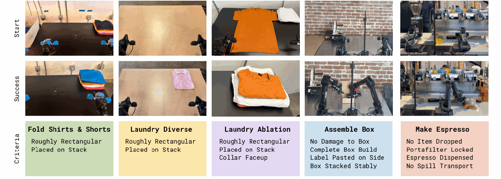

**Original caption:** Fig. 6: Illustrations of the tasks used in our experiments. Tasks include three different laundry variants, assembling boxes, and making coffee drinks with an espresso machine.

**中文图注:** 图 6：实验所用任务的示意图。任务包括三种不同的叠衣变体、组装纸箱，以及用意式咖啡机制作咖啡饮品。

**阅读提示:** 从左到右依次对应本节描述的任务族；注意每个任务族都标注了成功判定所需的时间预算。

### B. 对比与消融

> B. Comparisons and Ablations

**Source:** p.8 S094 - p.9 S098

**Original:** We compare RECAP to several baselines: Pre-trained π0.5 [5]. This baseline does not use RL and does not leverage RECAP. Pre-trained π0.6 [6]. It does not include the advantage indicator I_t, and is pre-trained with supervised learning. RL pre-trained π*0.6. It is pre-trained with RL alongside its value function, and includes an advantage indicator I_t as described in Section V-D. π*0.6 offline RL + SFT. This model is trained by finetuning the base π*0.6 pre-trained checkpoint with demonstration data for the target task. We refer to this finetuning as “SFT” because the advantage values are fixed to True for all demonstrations. We find that this combination of the offline RL pre-trained π*0.6 model with high-quality SFT outperforms standard SFT (without offline RL pre-training), and provides a good starting point for RL with on-robot data. π*0.6 (ours). This is the final model trained with RECAP on the target task, including both autonomous rollouts and expert corrections. By default we evaluate with β = 1. In some experiments we also consider inference with CFG, which corresponds to β > 1.

**中文:** 我们把 RECAP 与若干基线比较：预训练 π0.5 [5]：不使用 RL，也不使用 RECAP。预训练 π0.6 [6]：不包含优势指标 I_t，用监督学习预训练。RL 预训练 π\*0.6：与价值函数一同用 RL 预训练，并按第 V-D 节所述包含优势指标 I_t。**π\*0.6 离线 RL + SFT：用目标任务示范数据微调 π\*0.6 基座预训练 checkpoint 得到；我们把这步微调称为“SFT”，因为所有示范的优势值都被固定为 True。**我们发现，**“离线 RL 预训练的 π\*0.6 + 高质量 SFT”这一组合优于标准 SFT（没有离线 RL 预训练），并为在机器人数据上做 RL 提供了良好起点。**π\*0.6（本文方法）：用 RECAP 在目标任务上训练的最终模型，同时使用自主 rollout 与专家纠正。默认在 β = 1 下评估；部分实验中我们也考察使用 CFG（即 β > 1）的推理。

**Source:** p.9 S099-S100

**Original:** We also consider two alternative policy extraction methods in the literature as comparisons for our advantage-conditioned approach, both of which use the same on-robot data as RECAP but a different policy learning method: AWR. Starting from the same pre-trained model π0.6 (without advantage conditioning) we fine-tune using advantage weighted regression [68], based on advantages extracted from our value-function. PPO. We implement a variant of DPPO/FPO [23, 82] in which we calculate likelihoods based on the single step diffusion objective and use an alternative definition of the PPO constraint following SPO [83] (see Appendix D for details).

**中文:** 我们还引入文献中的两种替代策略提取方法，作为优势条件化方法的对照；它们使用与 RECAP 相同的机器人数据，但策略学习方式不同：AWR：从同一个预训练模型 π0.6（无优势条件化）出发，基于由我们的价值函数提取的优势，用优势加权回归 [68] 微调。PPO：我们实现了 DPPO/FPO [23, 82] 的一个变体，其中的似然基于单步扩散目标计算，并采用 SPO [83] 给出的另一种 PPO 约束定义（细节见附录 D）。

### C. 定量结果

> C. Quantitative results

**Source:** p.9 S101-S102

**Original:** We use two metrics in our evaluation: throughput and success rate. Throughput measures the number of successful task executions per hour, thus capturing both speed and success rate into one practically relevant quantity. Success rate measures the proportion of episodes that succeed, and is derived from human-provided annotations. Raters are asked to judge the episode with respect to multiple quality metrics, and we aggregate these quality indicators into a success label.

**中文:** 评估使用两个指标：吞吐量与成功率。吞吐量衡量每小时成功完成任务的次数，把速度与成功率合并为一个有实际意义的量。成功率表示成功的 episode 占比，由人工标注得到：标注者针对多个质量指标评判 episode，我们再把这些质量指标汇总成一个成功标签。

**Source:** p.9 S103-S107

**Original:** 1) How much does RECAP improve the policy?: To answer this question, we present the main quantitative results in Figures 7 and 8. Across all tasks, the final π*0.6 significantly improves over the base (supervised) π0.6 model, the RL pre-trained π*0.6 model, and the offline RL + SFT π*0.6 model. Throughput more than doubles on the diverse laundry folding and espresso tasks from including on-robot data (the improvement from offline RL + SFT to the final π*0.6 model), and the rate of failure reduces by about a factor of two. On the easier laundry task (t-shirts and shorts), the success rate is already close to the maximum after the SFT phase, but throughput still increases by a significant margin with the final model. On all of the tasks except diverse laundry, the success rate of the final π*0.6 model is in the 90%+ range. This makes it feasible to use in practical settings, such as making espresso drinks at the office or assembling boxes in a factory, as shown in the accompanying videos. For the box assembly task, Figure 8 (right) contains a breakdown of the task success over its four stages: picking up a box sheet, building the box, labeling the box, and placing it at an available spot in a crate. π*0.6 attains higher success rates for all of the stages compared to the other models. The majority of failures on these stages happen because the policy runs out of time. The accompanying videos present time lapses where each of the tasks is run for multiple hours.

**中文:** 1) RECAP 能把策略改进多少？为回答这个问题，我们在图 7 与图 8 中给出主要定量结果。在所有任务上，最终的 π*0.6 都显著优于基座（监督）π0.6 模型、RL 预训练的 π*0.6 模型，以及离线 RL + SFT 的 π*0.6 模型。在多样化叠衣与意式咖啡任务上，纳入机器人数据（即从离线 RL + SFT 到最终 π*0.6 的改进）使吞吐量提升一倍以上，失败率降低约一半。在较简单的叠衣任务（T 恤与短裤）上，SFT 阶段之后成功率已接近上限，但最终模型仍使吞吐量显著提升。除多样化叠衣外，最终 π*0.6 在所有任务上的成功率都达到 90% 以上，这使得它可以在办公室做意式咖啡、在工厂组装纸箱等实际场景中使用（见随附视频）。对于纸箱组装任务，图 8（右）按四个阶段分解了任务成功情况：拿起纸板、折成箱体、贴标签、放入板条箱的空位。π*0.6 在所有阶段的成功率都高于其他模型。这些阶段中的失败大多是因为策略超时。随附视频给出了每个任务连续运行数小时的延时影像。

### F007. 吞吐量对比（Fig. 7）

**Placed near:** p.9 S103（“我们在图 7 与图 8 中给出主要定量结果”）
**Source:** p.9 C007

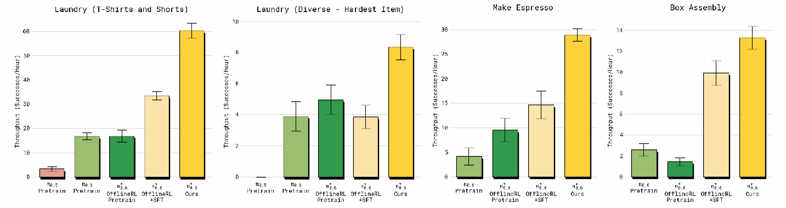

**Original caption:** Fig. 7: Throughput. We show the number of successfully completed tasks per hour for laundry (simple and diverse), espresso making, and box assembly. Error bars show standard error. This metric measures both success and speed. In all cases, RECAP applied to π*0.6 (Ours) leads to substantial improvements in throughput. RECAP has the highest impact on throughput for diverse laundry and espresso tasks, more than doubling successful completions per hour.

**中文图注:** 图 7：吞吐量。我们给出叠衣（简单与多样）、意式咖啡制作与纸箱组装每小时成功完成的任务数，误差棒为标准误。该指标同时衡量成功与速度。在所有情况下，把 RECAP 用于 π*0.6（Ours）都显著提升吞吐量；在多样化叠衣与意式咖啡任务上影响最大，每小时成功完成次数提升一倍以上。

**阅读提示:** 四组柱子从左到右是不同训练阶段的对照：注意“离线 RL + SFT”到“Ours”这一段才是 RECAP 在线迭代带来的增益。

### F008. 成功率对比（Fig. 8）

**Placed near:** p.9 S103
**Source:** p.9 C008

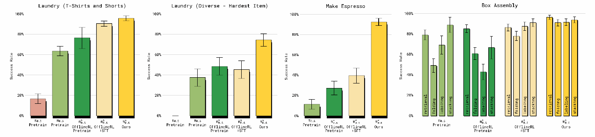

**Original caption:** Fig. 8: Success rates. We show the absolute success rates with standard error. Each stage of RECAP improves performance across the tasks, with the challenging diverse laundry and espresso tasks seeing the largest gains success rate, corresponding to more than 2 × reduction in failure rates. For the box assembly task we show the success rate for the different subtasks. RECAP leads to the most consistent (and highest) success across all subtasks.

**中文图注:** 图 8：成功率。我们给出绝对成功率与标准误。RECAP 的每个阶段都在各任务上带来提升，其中较难的多样化叠衣与意式咖啡任务成功率提升最大，对应失败率下降 2 倍以上。纸箱组装任务给出了各子任务的成功率；RECAP 在所有子任务上都取得最稳定（也最高）的成功率。

**阅读提示:** 右图是纸箱组装的四阶段分解，可用来判断瓶颈在“折箱”还是“贴标/放置”。

**Source:** p.10 S108

**Original:** 2) How much does RECAP improve π*0.6 over multiple iterations?: We next elucidate how training with RECAP improves policies through multiple iterations of data collection and training. We study the T-shirt and shorts folding task and the box assembly task. For the T-shirt folding task, only data collected with autonomous evaluation (without human corrections) is used to perform policy improvement over two iterations, in order to evaluate how well our method can improve the policy via RL alone. We collect 300 trajectories on four robots in each iteration. Box assembly uses both autonomous trials and trials with expert teleoperator interventions, with 600 autonomous trials and 360 trials with interventions in each iteration.

**中文:** 2) 多轮迭代能让 RECAP 把 π*0.6 改进多少？接下来我们阐明：经过多轮数据采集与训练，RECAP 如何改进策略。我们研究 T 恤与短裤折叠任务以及纸箱组装任务。对 T 恤折叠任务，只用自主评估采集的数据（不含人工纠正）进行两轮策略改进，以评估该方法仅靠 RL 能把策略改进到什么程度；每轮在四台机器人上采集 300 条轨迹。纸箱组装则同时使用自主尝试与专家遥操作干预的尝试，每轮包括 600 次自主尝试与 360 次带干预的尝试。

**Source:** p.10 S109-S115

**Original:** We plot the throughput over iterations in Figure 9, comparing two iterations of RECAP, denoted by i = 1, i = 2 respectively. The final iteration, labeled (Ours), corresponds to the overall best result for these tasks presented in the previous section. We also compare the initial data collection policy, which uses the offline RL pre-trained π*0.6 model with SFT finetuning. For both tasks, π*0.6 improves over the two iterations. In the laundry task we can see steady improvement yielding an overall 50% improvement in throughput. For the long-horizon box assembly task, more data is needed to yield a significant improvement, but after the second iteration we see a 2 × improvement in throughput. We also show the success rate over the iterations in Figure 10. For the laundry task, the first iteration already raises the success rate to over 90%, while the second iteration mainly improves throughput. For the box assembly task, we see clear improvements in the success rate over both iterations. While there are still some failures (especially when placing the box on the stack at the end), the final policy achieves a success rate of about 90% both for folding the box and labeling it in the allocated time limit of 600 seconds. 3) How does the advantage-conditioned policy extraction method in RECAP compare to other methods?: We compare our advantage conditioned policy extraction method from Section IV-B to other methods in the literature: AWR and PPO. We use the T-shirts and Shorts task for this comparison. To ensure a controlled comparison, we use the same data for these comparisons that was used to train our final model. This provides a slight advantage to the baselines, since they have access to better data that was collected while running RECAP. The results are shown in Figure 11. While both AWR and PPO can attain reasonable results, they both fall far short of our method, and struggle to improve over the offline RL + SFT π*0.6 model. For PPO, we had to use a small trust-region constraint (η = 0.01) to stabilize training in this off-policy setting, and while this makes training stable, the method does not achieve good performance.

**中文:** 图 9 给出了多轮迭代的吞吐量，对比两轮 RECAP（分别记为 i = 1、i = 2）。最后一轮标为 (Ours)，对应上一节给出的这些任务上的最佳整体结果。我们还对比了初始数据采集策略，即用离线 RL 预训练的 π*0.6 加 SFT 微调得到的策略。两个任务上，π*0.6 都随两轮迭代持续改进：叠衣任务稳步提升，吞吐量总体提高约 50%；对长时程的纸箱组装任务，需要更多数据才能带来显著改进，但在第二轮之后吞吐量提升了 2 倍。图 10 给出多轮迭代的成功率：叠衣任务第一轮就把成功率提高到 90% 以上，第二轮主要改进吞吐量；纸箱组装任务在两轮迭代中成功率都有明显提升。虽然仍有失败（尤其是最后把箱子放到堆叠处时），但最终策略在 600 秒时限内折箱与贴标的成功率都达到约 90%。3) RECAP 中的优势条件化策略提取方法与其他方法相比如何？我们把第 IV-B 节的优势条件化策略提取方法与文献中的 AWR、PPO 比较，使用 T 恤与短裤任务。为保证受控比较，这些对照方法使用与训练最终模型相同的数据——这实际上对基线略有利，因为它们能用上在运行 RECAP 时采集到的更好数据。结果见图 11。虽然 AWR 与 PPO 都能取得一定效果，但都远不及我们的方法，而且很难超过离线 RL + SFT 的 π*0.6 模型。对 PPO，我们不得不采用很小的信赖域约束（η = 0.01）来稳定这种 off-policy 设定下的训练；这虽然让训练稳定，但方法本身未能取得好性能。

### F009. 多轮迭代中的吞吐量提升（Fig. 9）

**Placed near:** p.10 S109（“图 9 给出了多轮迭代的吞吐量”）
**Source:** p.10 C009

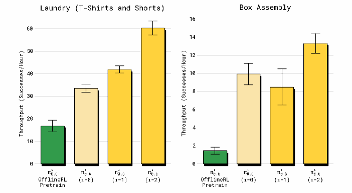

**Original caption:** Fig. 9: Improvement in throughput over multiple iterations. Both tasks improve significantly in throughput as we take more iterations of RECAP, with box assembling first dropping and then improving significantly.

**中文图注:** 图 9：多轮迭代中的吞吐量提升。随着 RECAP 迭代次数增加，两个任务的吞吐量都显著提高；纸箱组装先出现下降，随后显著提升。

**阅读提示:** 注意纸箱组装第一轮“先降后升”的现象：长时程任务需要更多数据才能让 RL 见效。

### F010. 多轮迭代中的成功率提升（Fig. 10）

**Placed near:** p.10 S114（“图 10 给出多轮迭代的成功率”）
**Source:** p.10 C010

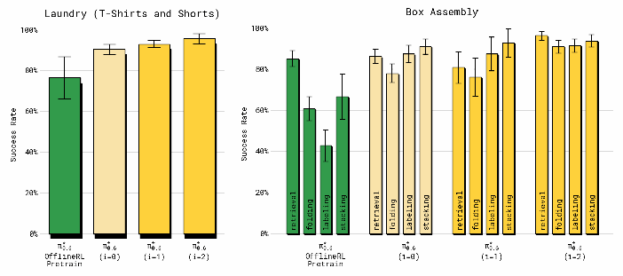

**Original caption:** Fig. 10: Improvement in success rate over multiple iterations. The laundry task quickly reaches the maximum success rate (but continues to improve in throughput as shown in Figure 9), while box assembly continues to improve.

**中文图注:** 图 10：多轮迭代中的成功率提升。叠衣任务很快达到成功率上限（但如图 9 所示，吞吐量仍在继续提升），而纸箱组装的成功率持续改进。

**阅读提示:** 把成功率与吞吐量对照看：成功率饱和后，RECAP 仍在通过提速来提升吞吐量。

### F011. 不同策略提取方法对比（Fig. 11）

**Placed near:** p.10 S115（“结果见图 11”）
**Source:** p.10 C011

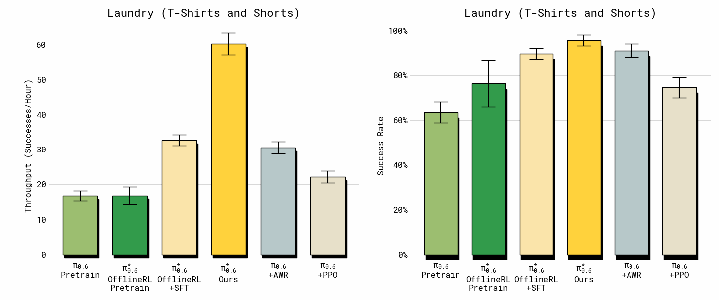

**Original caption:** Fig. 11: Comparison of different policy extraction methods. RECAP applied to π*0.6 achieves by far the highest throughput for the laundry task compared to AWR and PPO.

**中文图注:** 图 11：不同策略提取方法的对比。在叠衣任务上，应用于 π*0.6 的 RECAP 取得的吞吐量远高于 AWR 与 PPO。

**阅读提示:** AWR 成功率尚可但动作慢（吞吐量低）；PPO 即使加了信赖域约束也难以稳定提升。

**Source:** p.10 S116

**Original:** AWR can achieve a reasonable success rate, but leads to much slower policies with lower throughput.

**中文:** AWR 能取得尚可的成功率，但得到的策略慢得多，吞吐量更低。

**Source:** p.11 S117

**Original:** 4) Can RECAP significantly alter policy behavior with relatively little data and remove a failure mode?: While the preceding experiments have focused on holistic end-to-end evaluations of policy performance, we can also zoom in on a specific failure mode to examine whether RL training with RECAP can remove a specific mistake from the policy. To answer this question, we use a version of the laundry task with a strict success criterion, which requires the policy to fold a t-shirt with the collar centered and facing up. Each episode is initialized with a specific adversarial condition in which the shirt is placed flat on the table in such a way that the baseline offline RL + SFT policy often fails to fold it correctly. As shown in Figure 12, applying RECAP in this setting for two iterations (collecting 600 trajectories in each iteration) results in a policy that succeeds 97% of the time, and with high speed. Thus we conclude that RECAP can be effective at removing specific failure modes, even when learning entirely via RL without any intervention data or additional demonstrations.

**中文:** 4) RECAP 能否用相对较少的数据显著改变策略行为、并消除某个失败模式？此前的实验关注策略性能的整体端到端评估，我们也可以聚焦某个具体失败模式，考察用 RECAP 做 RL 训练能否消除策略的某个特定错误。为此，我们使用一个成功标准更严格的叠衣任务版本：要求策略把 T 恤叠好、衣领居中且朝上。每个 episode 都以一个特定的对抗性初始状态开始——衬衫平铺在桌上的方式会让基线（离线 RL + SFT）策略经常叠错。如图 12 所示，在该设置下用 RECAP 迭代两轮（每轮采集 600 条轨迹），得到的策略成功率达到 97%，而且速度很快。因此我们认为：即使在完全没有干预数据、也没有额外示范的情况下、仅通过 RL 学习，RECAP 也能有效消除特定的失败模式。

### F012. 失败模式消除（Fig. 12）

**Placed near:** p.11 S117（“如图 12 所示”）
**Source:** p.10 C012

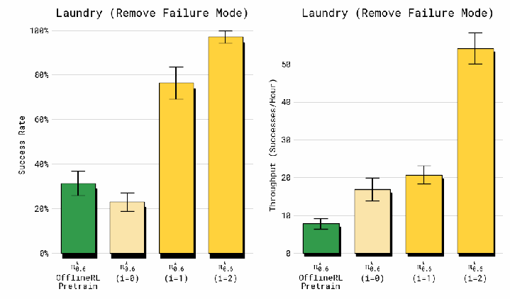

**Original caption:** Fig. 12: Failure mode removal. Here we apply RECAP on a variant of the laundry task with one item but a very strict success criteria. RECAP is particularly effective at removing failure modes that would be considered non successful under the strict criteria. Therefore, our method can also be used to alter a policy's behavior with relatively little data effectively.

**中文图注:** 图 12：失败模式消除。我们在叠衣任务的一个变体（单一物品但成功标准非常严格）上应用 RECAP。RECAP 特别擅长消除在严格标准下会被判为失败的失败模式。因此，我们的方法也能用相对较少的数据有效改变策略行为。

**阅读提示:** 这是“RL 无需人工干预也能纠错”的最直接证据：基线经常出错，两轮 RECAP 后成功率达 97%。

## 七、讨论与未来工作

> VII. DISCUSSION AND FUTURE WORK

**Source:** p.11 S118-S121

**Original:** Training policies that can achieve the same robustness, speed, and fluency on real-world tasks as people presents a major challenge in robotic learning. In this paper, we discussed how learning from experience, through a combination of DAgger-style coaching and RL, can begin to address this challenge. We describe RECAP, a method for training VLAs with autonomous trials, reward feedback, and human interventions, and present results for a model trained with RECAP, π*0.6, on a set of realistic tasks: making espresso drinks, folding diverse laundry, and assembling boxes. At the core of RECAP is an RL method that is well-suited for scalable training of VLA policies, using advantage conditioning for policy extraction with value functions. The data for this RL method is collected with a combination of autonomous rollouts and human interventions, correcting mistakes with interventions while finetuning the details of the behavior on autonomous data. Our experiments show that RECAP can improve both the success rate and throughput of the VLA, more than doubling the throughput on some of the harder tasks, and decreasing the number of failures by roughly 2 ×. There are several directions for improvement with RECAP. First, our system is not fully autonomous: it relies on human labeling and effort for reward feedback, interventions, and episode resets. A number of prior works have explored ways to automate these components [84, 85], and VLAs offer new ways to provide for more automated data collection, for example by using high-level policies [86] to reason through resetting the scene. Second, our system is relatively na¨ıve in how it approaches exploration: exploration is largely greedy, relying on stochasticity in the policy and human interventions to explore new solutions. This is reasonable when the initial imitation learning policy already takes reasonable actions, but there is plenty of room for improvement with more sophisticated exploration methods. Lastly, RECAP performs iterated “offline” updates (i.e., it collects a batch of data, retrains the model, and repeats), rather than running a fully online RL loop where the policy and value function are updated in real time as data is collected. We make this decision out of convenience, but extending our approach into a fully concurrent online RL framework is a promising direction for future work. More broadly, training VLAs with RL is perhaps the most direct path to get to performance levels that are adequate for real-world use cases. RL with VLAs presents a number of challenges, from the difficulty of large-scale RL training of high capacity models to sample complexity, autonomy, and delayed feedback. While existing RL frameworks designed for smaller-scale systems or “virtual” domains such as LLMs can provide a good starting point, more research will be needed to make RL a practical tool for VLA training. We hope that our work represents a meaningful step in this direction.

**中文:** **训练出能在真实任务上达到与人类相同的鲁棒性、速度和流畅度的策略，是机器人学习的一大挑战。本文讨论如何通过把 DAgger 式教练与 RL 结合起来、从经验中学习，来着手应对这一挑战。我们描述了 RECAP：一种用自主尝试、奖励反馈与人工干预训练 VLA 的方法**，并给出用 RECAP 训练的模型 π*0.6 在一组真实任务上的结果——制作意式咖啡、折叠各种衣物、组装纸箱。**RECAP 的核心是一个适合可扩展训练 VLA 策略的 RL 方法：用价值函数配合优势条件化来完成策略提取。该 RL 方法的数据由自主 rollout 与人工干预组合采集：用干预纠正错误，同时在自主数据上微调行为的细节。**实验表明，RECAP 能同时提升 VLA 的成功率与吞吐量：在一些较难任务上吞吐量提升一倍以上，失败次数约减少 2 倍。<mark>RECAP 还有若干改进方向。第一，我们的系统尚未完全自主：奖励反馈、干预以及 episode 重置仍依赖人工标注与投入。已有不少工作探索如何自动化这些环节 [84, 85]；VLA 也提供了新的可能，例如用高层策略 [86] 推理如何重置场景，从而实现更自动化的数据采集。第二，我们的系统在探索方面相对朴素：探索基本是贪心的，主要依赖策略的随机性与人工干预来发现新解。当初始模仿学习策略已经会采取合理动作时，这样做是合理的，但用更复杂的探索方法仍有很大改进空间。最后，RECAP 执行的是迭代式“离线”更新（采集一批数据、重新训练、重复），而不是在采集数据的同时实时更新策略与价值函数的完全在线 RL 循环。这样做是出于便利，但把方法扩展为完全并发的在线 RL 框架是很有前景的未来方向。更宏观地说，用 RL 训练 VLA 也许是达到“足以支撑真实用例”的性能水平最直接的路径。</mark>用 RL 训练 VLA 面临诸多挑战：从大容量模型的大规模 RL 训练难度，到样本复杂度、自主性与延迟反馈。虽然为小规模系统或 LLM 等“虚拟”领域设计的现有 RL 框架可以提供不错的起点，但要真正把 RL 变成训练 VLA 的实用工具，还需要更多研究。我们希望这项工作朝这个方向迈出了有意义的一步。

## 致谢

> ACKNOWLEDGEMENTS

**Source:** p.11 S122

**Original:** We thank our robot operators for data collection, evaluations, logistics, and video recording, and our technicians for robot maintenance and repair. See Appendix A for a full contributions statement.

**中文:** 我们感谢机器人操作员在数据采集、评估、后勤与视频录制方面的工作，也感谢技术人员的机器人维护与修理。完整的贡献声明见附录 A。

## 参考文献

> REFERENCES

*说明：参考文献按原文保留英文，未作翻译；条目编号与正文引用编号一致（[1]–[86]）。*

[1] Richard S Sutton and Andrew G Barto. Reinforcement learning: An introduction. MIT press, 2018. 1
[2] Sascha Lange, Thomas Gabel, and Martin A. Riedmiller. Batch reinforcement learning. In Marco A. Wiering and Martijn van Otterlo, editors, Reinforcement Learning, volume 12 of Adaptation, Learning, and Optimization, pages 45–73. Springer, 2012. doi: 10.1007/978-3-642-27645-3 \ 2. 2, 4
[3] Sergey Levine, Aviral Kumar, George Tucker, and Justin Fu. Offline reinforcement learning: Tutorial, review, and perspectives on open problems. arXiv preprint arXiv:2005.01643, 2020. 2, 4
[4] Kevin Frans, Seohong Park, Pieter Abbeel, and Sergey Levine. Diffusion guidance is a controllable policy improvement operator. arXiv preprint, arXiv:2505.23458, 2025. 2, 3, 4, 5, 17
[5] Kevin Black, Noah Brown, James Darpinian, Karan Dhabalia, Danny Driess, Adnan Esmail, Michael Robert Equi, Chelsea Finn, Niccolo Fusai, Manuel Y Galliker, et al. π0.5: a vision-language-action model with openworld generalization. In 9th Annual Conference on Robot Learning, 2025. 2, 3, 5, 7, 8
[6] Physical Intelligence Team. π0.6 model card. 2025. 2, 5, 6, 8
[7] Ste´phane Ross, Geoffrey Gordon, and Drew Bagnell. A reduction of imitation learning and structured prediction to no-regret online learning. In AISTATS, pages 627–635, 2011. 2, 7
[8] Michael Laskey, Jonathan Lee, Roy Fox, Anca Dragan, and Ken Goldberg. Shiv: Reducing supervisor burden in dagger using support vectors for efficient learning from demonstrations in high dimensional state spaces. In Proceedings of the 2016 IEEE International Conference on Robotics and Automation (ICRA), pages 462–469, 2016. doi: 10.1109/ICRA.2016.7487175. 2
[9] Michael Laskey, Jonathan Lee, Roy Fox, Anca D. Dragan, and Ken Goldberg. Dart: Noise injection for robust imitation learning. In Proceedings of the 34th International Conference on Machine Learning (ICML), volume 70 of Proceedings of Machine Learning Research, pages 1989–1998. PMLR, 2017.
[10] Eric Jang, Alex Irpan, Mohi Khansari, Daniel Kappler, Frederik Ebert, Corey Lynch, Sergey Levine, and Chelsea Finn. Bc-z: Zero-shot task generalization with robotic imitation learning. In Conference on Robot Learning, pages 991–1002. PMLR, 2022. 2
[11] Zheyuan Hu, Robyn Wu, Naveen Enock, Jasmine Li, Riya Kadakia, Zackory Erickson, and Aviral Kumar. Rac: Robot learning for long-horizon tasks by scaling recovery and correction. arXiv preprint, arXiv:2509.07953, 2025. 2
[12] Michael Kelly, Chelsea Sidrane, Katherine Driggs- Campbell, and Mykel J Kochenderfer. Hg-dagger: Interactive imitation learning with human experts. In ICRA, 2019. 2
[13] Sergey Levine, Chelsea Finn, Trevor Darrell, and Pieter Abbeel. End-to-end training of deep visuomotor policies. The Journal of Machine Learning Research, 17(1):1334– 1373, 2016. 2
[14] Dmitry Kalashnikov, Alex Irpan, Peter Pastor, Julian Ibarz, Alexander Herzog, Eric Jang, Deirdre Quillen, Ethan Holly, Mrinal Kalakrishnan, Vincent Vanhoucke, et al. QT-Opt: Scalable deep reinforcement learning for vision-based robotic manipulation. arXiv preprint arXiv:1806.10293, 2018.
[15] Ajay Mandlekar, Fabio Ramos, Byron Boots, Li Fei- Fei, Animesh Garg, and Dieter Fox. Iris: Implicit reinforcement without interaction at scale for learning control from offline robot manipulation data. ICRA, 2020.
[16] Archit Sharma, M. Ahmed Ahmed Rehaan Ahmad, and Chelsea Finn. Self-improving robots: End-to-end autonomous visuomotor reinforcement learning. In Proceedings of the 7th Conference on Robot Learning (CoRL), volume 229, pages 3292–3308. PMLR, 2023.
[17] Russell Mendonca, Shikhar Bahl, and Deepak Pathak. Alan: Autonomously exploring robotic agents in the real world. In Proceedings of the 2023 IEEE International Conference on Robotics and Automation (ICRA), pages 3044–3050, 2023. doi: 10.1109/ICRA48891.2023. 10013321.
[18] Russell Mendonca, Emmanuel Panov, Bernadette Bucher, Jiuguang Wang, and Deepak Pathak. Continuously improving mobile manipulation with autonomous real-world rl. In Proceedings of the 8th Conference on Robot Learning (CoRL), pages 5204–5219, 2024.
[19] Jianlan Luo, Zheyuan Hu, Charles Xu, You Liang Tan, Jacob Berg, Archit Sharma, Stefan Schaal, Chelsea Finn, Abhishek Gupta, and Sergey Levine. Serl: A software suite for sample-efficient robotic reinforcement learning, 2024.
[20] Lars Ankile, Zhenyu Jiang, Rocky Duan, Guanya Shi, Pieter Abbeel, and Anusha Nagabandi. Residual off-policy rl for finetuning behavior cloning policies. arXiv preprint arXiv:2509.19301, 2025.
[21] Thomas Lampe, Abbas Abdolmaleki, Sarah Bechtle, Sandy H. Huang, Jost Tobias Springenberg, Michael Bloesch, Oliver Groth, Roland Hafner, Tim Hertweck, Michael Neunert, Markus Wulfmeier, Jingwei Zhang, Francesco Nori, Nicolas Heess, and Martin Riedmiller. Mastering stacking of diverse shapes with large-scale iterative reinforcement learning on real robots. In 2024 IEEE International Conference on Robotics and Automation (ICRA), pages 7772–7779, 2024. doi: 10.1109/ ICRA57147.2024.10610297. 2
[22] Perry Dong, Suvir Mirchandani, Dorsa Sadigh, and Chelsea Finn. What matters for batch online reinforcement learning in robotics? arXiv preprint, arXiv:2505.08078, 2025. 2
[23] Allen Z. Ren, Justin Lidard, Lars Lien Ankile, Anthony Simeonov, Pulkit Agrawal, Anirudha Majumdar, Benjamin Burchfiel, Hongkai Dai, and Max Simchowitz. Diffusion Policy Policy Optimization. In Proceedings of the 2025 International Conference on Learning Representations (ICLR), 2025. 9, 17
[24] Kun Lei, Huanyu Li, Dongjie Yu, Zhenyu Wei, Lingxiao Guo, Zhennan Jiang, Ziyu Wang, Shiyu Liang, and Huazhe Xu. Rl-100: Performant robotic manipulation with real-world reinforcement learning. arXiv preprint, arXiv:2510.14830, 2025. 2
[25] Dmitry Kalashnkov, Jake Varley, Yevgen Chebotar, Ben Swanson, Rico Jonschkowski, Chelsea Finn, Sergey Levine, and Karol Hausman. Mt-opt: Continuous multi-task robotic reinforcement learning at scale. arXiv, 2021. 2
[26] Abhishek Gupta, Justin Yu, Tony Z. Zhao, Vikash Kumar, Aaron Rovinsky, Kelvin Xu, Thomas Devlin, and Sergey Levine. Reset-free reinforcement learning via multi-task learning: Learning dexterous manipulation behaviors without human intervention. In Proceedings of the 2021 IEEE International Conference on Robotics and Automation (ICRA), pages 6664–6671, 2021. 2
[27] Konstantinos Bousmalis, Giulia Vezzani, Dushyant Rao, Coline Devin, Alex X Lee, Maria Bauza, Todor Davchev, Yuxiang Zhou, Agrim Gupta, Akhil Raju, et al. Robocat: A self-improving foundation agent for robotic manipulation. arXiv preprint arXiv:2306.11706, 2023. 2
[28] Aviral Kumar, Anikait Singh, Frederik Ebert, Mitsuhiko Nakamoto, Yanlai Yang, Chelsea Finn, and Sergey Levine. Pre-training for robots: Offline reinforcement learning enables learning new tasks from a handful of trials. In Proceedings of Robotics: Science and Systems (RSS), 2023. doi: 10.15607/RSS.2023.XIX.019.
[29] Jingyun Yang, Max Sobol Mark, Brandon Vu, Archit Sharma, Jeannette Bohg, and Chelsea Finn. Robot fine-tuning made easy: Pre-training rewards and policies for autonomous real-world reinforcement learning. In Proceedings of the 2024 IEEE International Conference on Robotics and Automation (ICRA), 2024. doi: 10.1109/ICRA57147.2024.10610421. 2
[30] Shuhan Tan, Kairan Dou, Yue Zhao, and Philipp Kra¨henbu¨hl. Interactive post-training for vision-language-action models. arXiv preprint, arXiv:2505.17016, 2025. 2
[31] Guanxing Lu, Wenkai Guo, Chubin Zhang, Yuheng Zhou, Haonan Jiang, Zifeng Gao, Yansong Tang, and Ziwei Wang. Vla-rl: Towards masterful and general robotic manipulation with scalable reinforcement learning. arXiv preprint, arXiv:2505.18719, 2025.
[32] Jijia Liu, Feng Gao, Bingwen Wei, Xinlei Chen, Qingmin Liao, Yi Wu, Chao Yu, and Yu Wang. What can rl bring to vla generalization? an empirical study. arXiv preprint, arXiv:2505.19789, 2025.
[33] Kang Chen, Zhihao Liu, Tonghe Zhang, Zhen Guo, Si Xu, Hao Lin, Hongzhi Zang, Quanlu Zhang, Zhaofei Yu, Guoliang Fan, Tiejun Huang, Yu Wang, and Chao Yu. π: Online rl fine-tuning for flowrl based vision-language-action models. arXiv preprint, arXiv:2510.25889, 2025.
[34] Haozhan Li, Yuxin Zuo, Jiale Yu, Yuhao Zhang, Zhaohui Yang, Kaiyan Zhang, Xuekai Zhu, Yuchen Zhang, Tianxing Chen, Ganqu Cui, Dehui Wang, Dingxiang Luo, Yuchen Fan, Youbang Sun, Jia Zeng, Jiangmiao Pang, Shanghang Zhang, Yu Wang, Yao Mu, Bowen Zhou, and Ning Ding. Simplevla-rl: Scaling vla training via reinforcement learning. arXiv preprint, arXiv:2509.09674, 2025. 2
[35] Yanjiang Guo, Jianke Zhang, Xiaoyu Chen, Xiang Ji, Yen-Jen Wang, Yucheng Hu, and Jianyu Chen. Improving vision-language-action model with online reinforcement learning. arXiv preprint, arXiv:2501.16664, 2025. 2
[36] Wenli Xiao, Haotian Lin, Andy Peng, Haoru Xue, Tairan He, Yuqi Xie, Fengyuan Hu, Jimmy Wu, Zhengyi Luo, Linxi ”Jim” Fan, Guanya Shi, and Yuke Zhu. Self-improving vision-language-action models with data generation via residual rl, 2025. 2
[37] Yuhui Chen, Shuai Tian, Shugao Liu, Yingting Zhou, Haoran Li, and Dongbin Zhao. Conrft: A reinforced fine-tuning method for vla models via consistency policy. arXiv preprint arXiv:2502.05450, 2025. 2
[38] Max Sobol Mark, Tian Gao, Georgia Gabriela Sampaio, Mohan Kumar Srirama, Archit Sharma, Chelsea Finn, and Aviral Kumar. Policy-agnostic rl: Offline rl and online rl fine-tuning of any class and backbone. arXiv preprint, arXiv:2412.06685, 2024. 2
[39] Mitsuhiko Nakamoto, Oier Mees, Aviral Kumar, and Sergey Levine. Steering your generalists: Improving robotic foundation models via value guidance. In Conference on Robot Learning, pages 4996–5013. PMLR, 2025.
[40] Yang Zhang, Chenwei Wang, Ouyang Lu, Yuan Zhao, Yunfei Ge, Zhenglong Sun, Xiu Li, Chi Zhang, Chenjia Bai, and Xuelong Li. Align-then-steer: Adapting the vision-language action models through unified latent guidance. arXiv preprint arXiv:2509.02055, 2025. 2
[41] Andrew Wagenmaker, Mitsuhiko Nakamoto, Yunchu Zhang, Seohong Park, Waleed Yagoub, Anusha Nagabandi, Abhishek Gupta, and Sergey Levine. Steering your diffusion policy with latent space reinforcement learning. In Proceedings of the 9th Conference on Robot Learning (CoRL), 2025. 2
[42] Charles Xu, Qiyang Li, Jianlan Luo, and Sergey Levine. Rldg: Robotic generalist policy distillation via reinforcement learning. arXiv preprint arXiv:2412.09858, 2024. 2
[43] Dongchi Huang, Zhirui Fang, Tianle Zhang, Yihang Li, Lin Zhao, and Chunhe Xia. Co-rft: Efficient fine-tuning of vision-language-action models through chunked offline reinforcement learning. arXiv preprint, arXiv:2508.02219, 2025. 3
[44] Zijian Zhang, Kaiyuan Zheng, Zhaorun Chen, Joel Jang, Yi Li, Siwei Han, Chaoqi Wang, Mingyu Ding, Dieter Fox, and Huaxiu Yao. Grape: Generalizing robot policy via preference alignment. arXiv preprint, arXiv:2411.19309, 2024. 3
[45] Shaopeng Zhai, Qi Zhang, Tianyi Zhang, Fuxian Huang, Haoran Zhang, Ming Zhou, Shengzhe Zhang, Litao Liu, Sixu Lin, and Jiangmiao Pang. A vision-language-action-critic model for robotic real-world reinforcement learning. arXiv preprint, arXiv:2509.15937, 2025. 3
[46] Seyed Kamyar Ghasemipour, Ayzaan Wahid, Jonathan Tompson, Pannag Sanketi, and Igor Mordatch. Self-improving embodied foundation models. arXiv preprint, arXiv:2509.15155, 2025. 3
[47] J urgen ¨ Schmidhuber. Reinforcement learning upside down: Don’t predict rewards — just map them to actions. arXiv preprint, arXiv:1912.02875, 2019. 3, 4
[48] Aviral Kumar, Xue Bin Peng, and Sergey Levine. Reward-conditioned policies. CoRR, abs/1912.13465, 2019. 4
[49] Lili Chen, Kevin Lu, Aravind Rajeswaran, Kimin Lee, Aditya Grover, Michael Laskin, Pieter Abbeel, Aravind Srinivas, and Igor Mordatch. Decision transformer: Reinforcement learning via sequence modeling. In Advances in Neural Information Processing Systems (NeurIPS) 34, 2021.
[50] David Brandfonbrener, Alberto Bietti, Jacob Buckman, Romain Laroche, and Joan Bruna. When does return-conditioned supervised learning work for offline reinforcement learning? In Advances in Neural Information Processing Systems (NeurIPS) 35, 2022. 4
[51] Scott Emmons, Benjamin Eysenbach, Ilya Kostrikov, and Sergey Levine. Rvs: What is essential for offline rl via supervised learning? In Proceedings of the 10th International Conference on Learning Representations (ICLR), 2022.
[52] Hiroki Furuta, Yusuke Matsuo, and Shixiang Shane Gu. Generalized decision transformer for offline hindsight information matching. In Proceedings of the 10th International Conference on Learning Representations (ICLR), 2022.
[53] Taku Yamagata, Ahmed Khalil, and Rau´l Santos- Rodr´ıguez. Q-learning decision transformer: Leveraging dynamic programming for conditional sequence modelling in offline rl. In Proceedings of the 40th International Conference on Machine Learning (ICML), volume 202 of Proceedings of Machine Learning Research, pages 38989–39007. PMLR, 2023.
[54] Qinqing Zheng, Amy Zhang, and Aditya Grover. Online decision transformer. In Proceedings of the 39th International Conference on Machine Learning (ICML), volume 162 of Proceedings of Machine Learning Research, pages 27042–27059. PMLR, 2022.
[55] Jakub Grudzien Kuba, Pieter Abbeel, and Sergey Levine. Advantage-conditioned diffusion: Offline rl via generalization. 2023.
[56] Yueh-Hua Wu, Xiaolong Wang, and Masashi Hamaya. Elastic decision transformer. In Proceedings of the 37th Conference on Neural Information Processing Systems (NeurIPS), 2023. doi: 10.5555/3666122.3666936. 3
[57] Lin Shao, Toki Migimatsu, Qiang Zhang, Kaiyuan Yang, and Jeannette Bohg. Concept2robot: Learning manipulation concepts from instructions and human demonstrations. In Proceedings of Robotics: Science & Systems (RSS), 2020. doi: 10.15607/RSS.2020.XVI.082. 3
[58] Annie S. Chen, Suraj Nair, and Chelsea Finn. Learning generalizable robotic reward functions from “in-thewild” human videos. In Proceedings of Robotics: Science & Systems (RSS) 2021, 2021.
[59] Suraj Nair, Eric Mitchell, Kevin Chen, Brian Ichter, Silvio Savarese, and Chelsea Finn. Learning language-conditioned robot behavior from offline data and crowd-sourced annotation. In Proceedings of the 5th Conference on Robot Learning (CoRL), volume 164 of Proceedings of Machine Learning Research, pages 1303–1315. PMLR, 2022.
[60] Sumedh A. Sontakke, Jesse Zhang, S ebastien ´ M.R. Arnold, Karl Pertsch, Erdem Bıyık, Dorsa Sadigh, Chelsea Finn, and Laurent Itti. Roboclip: One demonstration is enough to learn robot policies. In Proceedings of the 37th Conference on Neural Information Processing Systems (NeurIPS), 2023.
[61] Wenhao Yu, Nimrod Gileadi, Chuyuan Fu, Sean Kirmani, Kuang-Huei Lee, Montse Gonzalez Arenas, Hao- Tien Lewis Chiang, Tom Erez, Leonard Hasenclever, Jan Humplik, Brian Ichter, Ted Xiao, Peng Xu, Andy Zeng, Tingnan Zhang, Nicolas Heess, Dorsa Sadigh, Jie Tan, Yuval Tassa, and Fei Xia. Language to rewards for robotic skill synthesis. In Proceedings of the 7th Conference on Robot Learning (CoRL), volume 229 of Proceedings of Machine Learning Research, pages 374– 404. PMLR, 2023.
[62] Jiahui Zhang, Yusen Luo, Abrar Anwar, Sumedh Anand Sontakke, Joseph J. Lim, Jesse Thomason, Erdem Bıyık, and Jesse Zhang. Rewind: Language-guided rewards teach robot policies without new demonstrations. In Proceedings of the 9th Conference on Robot Learning (CoRL), 2025.
[63] Minttu Alakuijala, Reginald McLean, Isaac Woungang, Nariman Farsad, Samuel Kaski, Pekka Marttinen, and Kai Yuan. Video-language critic: Transferable reward functions for language-conditioned robotics. Transactions on Machine Learning Research, 2025:1–22, 2025. 3
[64] Yecheng Jason Ma, William Liang, Vaidehi Som, Vikash Kumar, Amy Zhang, Osbert Bastani, and Dinesh Jayaraman. Liv: Language-image representations and rewards for robotic control. In Proceedings of the 40th International Conference on Machine Learning (ICML), 2023. 3
[65] Yecheng Jason Ma, Joey Hejna, Chuyuan Fu, Dhruv Shah, Jacky Liang, Zhuo Xu, Sean Kirmani, Peng Xu, Danny Driess, Ted Xiao, Osbert Bastani, Dinesh Jayaraman, Wenhao Yu, Tingnan Zhang, Dorsa Sadigh, and Fei Xia. Vision language models are in-context value learners. In Proceedings of the 13th International Conference on Learning Representations (ICLR), 2025. 3
[66] John Schulman, Filip Wolski, Prafulla Dhariwal, Alec Radford, and Oleg Klimov. Proximal policy optimization algorithms. arXiv preprint arXiv:1707.06347, 2017. 3, 4, 17
[67] Abbas Abdolmaleki, Jost Tobias Springenberg, Yuval Tassa, Remi Munos, Nicolas Heess, and Martin Riedmiller. Maximum a posteriori policy optimisation. In International Conference on Learning Representations, 2018. 3
[68] Xue Bin Peng, Aviral Kumar, Grace Zhang, and Sergey Levine. Advantage-weighted regression: Simple and scalable off-policy reinforcement learning. arXiv preprint arXiv:1910.00177, 2019. 4, 9
[69] Peter Dayan and Geoffrey E. Hinton. Using expectation-maximization for reinforcement learning. Neural Computation, 9(2):271–278, 1997. doi: 10.1162/neco.1997.9. 2.271.
[70] Jan Peters, Katharina Mu¨lling, and Yasemin Altu¨n. Relative entropy policy search. In Proceedings of the Twenty-Fourth AAAI Conference on Artificial Intelligence, AAAI’10, page 1607–1612. AAAI Press, 2010. 3
[71] Qing Wang, Jiechao Xiong, Lei Han, peng sun, Han Liu, and Tong Zhang. Exponentially weighted imitation learning for batched historical data. In S. Bengio, H. Wallach, H. Larochelle, K. Grauman, N. Cesa-Bianchi, and R. Garnett, editors, Advances in Neural Information Processing Systems, volume 31, 2018. 3
[72] Marc G Bellemare, Will Dabney, and Re´mi Munos. A distributional perspective on reinforcement learning. In International conference on machine learning, pages 449–458. PMLR, 2017. 4
[73] Danny Driess, Jost Tobias Springenberg, Brian Ichter, Lili Yu, Adrian Li-Bell, Karl Pertsch, Allen Z Ren, Homer Walke, Quan Vuong, Lucy Xiaoyang Shi, et al. Knowledge insulating vision-language-action models: Train fast, run fast, generalize better. In Proceedings of the 37th Conference on Neural Information Processing Systems (NeurIPS), 2025. 4, 6
[74] Tuomas Haarnoja, Aurick Zhou, Pieter Abbeel, and Sergey Levine. Soft actor-critic: Off-policy maximum entropy deep reinforcement learning with a stochastic actor. ICML, 2018. 4
[75] Ziyu Wang, Alexander Novikov, Konrad Zolna, Josh S Merel, Jost Tobias Springenberg, Scott E Reed, Bobak Shahriari, Noah Siegel, Caglar Gulcehre, Nicolas Heess, and Nando de Freitas. Critic regularized regression. In H. Larochelle, M. Ranzato, R. Hadsell, M.F. Balcan, and H. Lin, editors, Advances in Neural Information Processing Systems, volume 33, pages 7768–7778, 2020. 4
[76] Ilya Kostrikov, Ashvin Nair, and Sergey Levine. Offline reinforcement learning with implicit q-learning. In International Conference on Learning Representations, 2022. 4
[77] Karl Pertsch, Kyle Stachowicz, Brian Ichter, Danny Driess, Suraj Nair, Quan Vuong, Oier Mees, Chelsea Finn, and Sergey Levine. FAST: Efficient action tokenization for vision-language-action models. Robotics: Science and Systems, 2025. 6
[78] Gemma Team, Aishwarya Kamath, Johan Ferret, Shreya Pathak, Nino Vieillard, Ramona Merhej, Sarah Perrin, Tatiana Matejovicova, Alexandre Ram e, ´ Morgane Rivi ere, ` Louis Rouillard, Thomas Mesnard, Geoffrey Cideron, Jean bastien Grill, Sabela Ramos, Edouard Yvinec, Michelle Casbon, Etienne Pot, Ivo Penchev, Ga el ¨ Liu, Francesco Visin, Kathleen Kenealy, Lucas Beyer, Xiaohai Zhai, Anton Tsitsulin, Robert Busa- Fekete, Alex Feng, Noveen Sachdeva, Benjamin Coleman, Yi Gao, Basil Mustafa, Iain Barr, Emilio Parisotto, David Tian, Matan Eyal, Colin Cherry, Jan-Thorsten Peter, Danila Sinopalnikov, Surya Bhupatiraju, Rishabh Agarwal, Mehran Kazemi, Dan Malkin, Ravin Kumar, David Vilar, Idan Brusilovsky, Jiaming Luo, Andreas Steiner, Abe Friesen, Abhanshu Sharma, Abheesht Sharma, Adi Mayrav Gilady, Adrian Goedeckemeyer, Alaa Saade, Alex Feng, Alexander Kolesnikov, Alexei Bendebury, Alvin Abdagic, Amit Vadi, Andra´s Gyo¨rgy, Andre´ Susano Pinto, Anil Das, Ankur Bapna, Antoine Miech, Antoine Yang, Antonia Paterson, Ashish Shenoy, Ayan Chakrabarti, Bilal Piot, Bo Wu, Bobak Shahriari, Bryce Petrini, Charlie Chen, Charline Le Lan, Christopher A. Choquette-Choo, CJ Carey, Cormac Brick, Daniel Deutsch, Danielle Eisenbud, Dee Cattle, Derek Cheng, Dimitris Paparas, Divyashree Shivakumar Sreepathihalli, Doug Reid, Dustin Tran, Dustin Zelle, Eric Noland, Erwin Huizenga, Eugene Kharitonov, Frederick Liu, Gagik Amirkhanyan, Glenn Cameron, Hadi Hashemi, Hanna Klimczak-Plucin´ska, Harman Singh, Harsh Mehta, Harshal Tushar Lehri, Hussein Hazimeh, Ian Ballantyne, Idan Szpektor, Ivan Nardini, Jean Pouget- Abadie, Jetha Chan, Joe Stanton, John Wieting, Jonathan Lai, Jordi Orbay, Joseph Fernandez, Josh Newlan, Ju yeong Ji, Jyotinder Singh, Kat Black, Kathy Yu, Kevin Hui, Kiran Vodrahalli, Klaus Greff, Linhai Qiu, Marcella Valentine, Marina Coelho, Marvin Ritter, Matt Hoffman, Matthew Watson, Mayank Chaturvedi, Michael Moynihan, Min Ma, Nabila Babar, Natasha Noy, Nathan Byrd, Nick Roy, Nikola Momchev, Nilay Chauhan, Noveen Sachdeva, Oskar Bunyan, Pankil Botarda, Paul Caron, Paul Kishan Rubenstein, Phil Culliton, Philipp Schmid, Pier Giuseppe Sessa, Pingmei Xu, Piotr Stanczyk, Pouya Tafti, Rakesh Shivanna, Renjie Wu, Renke Pan, Reza Rokni, Rob Willoughby, Rohith Vallu, Ryan Mullins, Sammy Jerome, Sara Smoot, Sertan Girgin, Shariq Iqbal, Shashir Reddy, Shruti Sheth, Siim P oder, ˜ Sijal Bhatnagar, Sindhu Raghuram Panyam, Sivan Eiger, Susan Zhang, Tianqi Liu, Trevor Yacovone, Tyler Liechty, Uday Kalra, Utku Evci, Vedant Misra, Vincent Roseberry, Vlad Feinberg, Vlad Kolesnikov, Woohyun Han, Woosuk Kwon, Xi Chen, Yinlam Chow, Yuvein Zhu, Zichuan Wei, Zoltan Egyed, Victor Cotruta, Minh Giang, Phoebe Kirk, Anand Rao, Kat Black, Nabila Babar, Jessica Lo, Erica Moreira, Luiz Gustavo Martins, Omar Sanseviero, Lucas Gonzalez, Zach Gleicher, Tris Warkentin, Vahab Mirrokni, Evan Senter, Eli Collins, Joelle Barral, Zoubin Ghahramani, Raia Hadsell, Yossi Matias, D. Sculley, Slav Petrov, Noah Fiedel, Noam Shazeer, Oriol Vinyals, Jeff Dean, Demis Hassabis, Koray Kavukcuoglu, Clement Farabet, Elena Buchatskaya, Jean-Baptiste Alayrac, Rohan Anil, Dmitry, Lepikhin, Sebastian Borgeaud, Olivier Bachem, Armand Joulin, Alek Andreev, Cassidy Hardin, Robert Dadashi, and L eonard ´ Hussenot. Gemma 3 technical report, 2025. 6
[79] Yaron Lipman, Ricky TQ Chen, Heli Ben-Hamu, Maximilian Nickel, and Matt Le. Flow matching for generative modeling. arXiv preprint arXiv:2210.02747, 2022. 6, 16
[80] Diederik Kingma and Ruiqi Gao. Understanding diffusion objectives as the elbo with simple data augmentation. In A. Oh, T. Naumann, A. Globerson, K. Saenko, M. Hardt, and S. Levine, editors, Advances in Neural Information Processing Systems, volume 36, pages 65484– 65516, 2023. 6, 16
[81] Kevin Black, Noah Brown, Danny Driess, Adnan Esmail, Michael Equi, Chelsea Finn, Niccolo Fusai, Lachy Groom, Karol Hausman, Brian Ichter, Szymon Jakubczak, Tim Jones, Liyiming Ke, Sergey Levine, Adrian Li-Bell, Mohith Mothukuri, Suraj Nair, Karl Pertsch, Lucy Xiaoyang Shi, James Tanner, Quan Vuong, Anna Walling, Haohuan Wang, and Ury Zhilinsky. π0: A vision-language-action flow model for general robot control. arXiv preprint arXiv:2410.24164, 2024. 8
[82] David McAllister, Songwei Ge, Brent Yi, Chung Min Kim, Ethan Weber, Hongsuk Choi, Haiwen Feng, and Angjoo Kanazawa. Flow matching policy gradients, 2025. 9, 16, 17
[83] Zhengpeng Xie, Qiang Zhang, Fan Yang, Marco Hutter, and Renjing Xu. Simple policy optimization. In Forty-second International Conference on Machine Learning (ICML), 2025. 9, 17
[84] Henry Zhu, Justin Yu, Abhishek Gupta, Dhruv Shah, Kristian Hartikainen, Avi Singh, Vikash Kumar, and Sergey Levine. The ingredients of real-world robotic reinforcement learning. arXiv preprint arXiv:2004.12570, 2020. 11
[85] Archit Sharma, Kelvin Xu, Nikhil Sardana, Abhishek Gupta, Karol Hausman, Sergey Levine, and Chelsea Finn. Autonomous reinforcement learning: Formalism and benchmarking. arXiv preprint arXiv:2112.09605, 2021. 11
[86] Lucy Xiaoyang Shi, Brian Ichter, Michael Equi, Liyiming Ke, Karl Pertsch, Quan Vuong, James Tanner, Anna Walling, Haohuan Wang, Niccolo Fusai, et al. Hi robot: Open-ended instruction following with hierarchical vision-language-action models. arXiv preprint arXiv:2502.19417, 2025. 11

## 附录

> APPENDIX

### A. 贡献声明

> A. Contributions

**Source:** p.16（附录 A）

**Original:** Data collection and operations. Michael Equi, Chelsea Finn, Lachy Groom, Hunter Hancock, Karol Hausman, Rowan Jen, Liyiming Ke, Marinda Lamb, Vishnu Mano, Suraj Nair, Charvi Sharma, Laura Smith, Will Stoeckle, Anna Walling, Blake Williams. Annotation and supplemental data. Chelsea Finn, Catherine Glossop, Hunter Hancock, Brian Ichter, Rowan Jen, Liyiming Ke, Chandra Kuchi, Karl Pertsch, Laura Smith, Will Stoeckle, Quan Vuong, Anna Walling. Policy training and research. Ashwin Balakrishna, Kevin Black, Danny Driess, Michael Equi, Yunhao Fang, Chelsea Finn, Catherine Glossop, Karol Hausman, Gashon Hussein, Brian Ichter, Liyiming Ke, Sergey Levine, Yao Lu, Suraj Nair, Karl Pertsch, Allen Z. Ren, Lucy Shi, Laura Smith, Jost Tobias Springenberg, Kyle Stachowicz, Alex Swerdlow, Marcel Torne, Quan Vuong, Lili Yu, Zhiyuan Zhou. Policy infrastructure. Kevin Black, Karan Dhabalia, Danny Driess, Michael Equi, Liyiming Ke, Adrian Li-Bell, Suraj Nair, Allen Z. Ren, Laura Smith, Jost Tobias Springenberg, Kyle Stachowicz, Alex Swerdlow, Haohuan Wang, Ury Zhilinsky, Zhiyuan Zhou. Robot hardware. Ali Amin, Raichelle Aniceto, Grace Connors, Adnan Esmail, Thomas Godden, Ivan Goryachev, Tim Jones, Ben Katz, Devin LeBlanc, Mohith Mothukuri, Sukwon Yoo. Robot infrastructure. Ken Conley, James Darpinian, Jared DiCarlo, Karol Hausman, Szymon Jakubczak, James Tanner. Writing and illustration. Kevin Black, Danny Driess, Michael Equi, Chelsea Finn, Hunter Hancock, Karol Hausman, Brian Ichter, Liyiming Ke, Sergey Levine, Suraj Nair, Allen Z. Ren, Laura Smith, Jost Tobias Springenberg, Zhiyuan Zhou.

**中文:** 数据采集与运营：Michael Equi, Chelsea Finn, Lachy Groom, Hunter Hancock, Karol Hausman, Rowan Jen, Liyiming Ke, Marinda Lamb, Vishnu Mano, Suraj Nair, Charvi Sharma, Laura Smith, Will Stoeckle, Anna Walling, Blake Williams。标注与补充数据：Chelsea Finn, Catherine Glossop, Hunter Hancock, Brian Ichter, Rowan Jen, Liyiming Ke, Chandra Kuchi, Karl Pertsch, Laura Smith, Will Stoeckle, Quan Vuong, Anna Walling。策略训练与研究：Ashwin Balakrishna, Kevin Black, Danny Driess, Michael Equi, Yunhao Fang, Chelsea Finn, Catherine Glossop, Karol Hausman, Gashon Hussein, Brian Ichter, Liyiming Ke, Sergey Levine, Yao Lu, Suraj Nair, Karl Pertsch, Allen Z. Ren, Lucy Shi, Laura Smith, Jost Tobias Springenberg, Kyle Stachowicz, Alex Swerdlow, Marcel Torne, Quan Vuong, Lili Yu, Zhiyuan Zhou。策略基础设施：Kevin Black, Karan Dhabalia, Danny Driess, Michael Equi, Liyiming Ke, Adrian Li-Bell, Suraj Nair, Allen Z. Ren, Laura Smith, Jost Tobias Springenberg, Kyle Stachowicz, Alex Swerdlow, Haohuan Wang, Ury Zhilinsky, Zhiyuan Zhou。机器人硬件：Ali Amin, Raichelle Aniceto, Grace Connors, Adnan Esmail, Thomas Godden, Ivan Goryachev, Tim Jones, Ben Katz, Devin LeBlanc, Mohith Mothukuri, Sukwon Yoo。机器人基础设施：Ken Conley, James Darpinian, Jared DiCarlo, Karol Hausman, Szymon Jakubczak, James Tanner。写作与插图：Kevin Black, Danny Driess, Michael Equi, Chelsea Finn, Hunter Hancock, Karol Hausman, Brian Ichter, Liyiming Ke, Sergey Levine, Suraj Nair, Allen Z. Ren, Laura Smith, Jost Tobias Springenberg, Zhiyuan Zhou。

### B. 价值函数的补充可视化

> B. Additional Value Function Visualization

**Source:** p.16（附录 B）

**Original:** Figure 13 shows additional visualizations of our trained value function on five different tasks, including tasks on which we evaluate our policies (espresso making, box assembly) and also broader tasks (hang towel, attach hook). The parts with the most prominent changes are highlighted: red corresponds to where value function drops, green corresponds to where value function increases, and yellow corresponds to oscillating values. Images show the corresponding frames and description of the episode.

**中文:** 图 13 给出了训练好的价值函数在五个不同任务上的补充可视化，其中包括我们评估策略的任务（制作意式咖啡、组装纸箱），也包括更广泛的任务（挂毛巾、挂接挂钩）。变化最显著的部分被高亮：红色对应价值下降，绿色对应价值上升，黄色对应价值震荡。图像展示了对应的帧与 episode 描述。

### F013. 五个任务上价值函数的补充可视化（Fig. 13）

**Placed near:** p.16 附录 B（“图 13 给出了……补充可视化”）
**Source:** p.17 C013

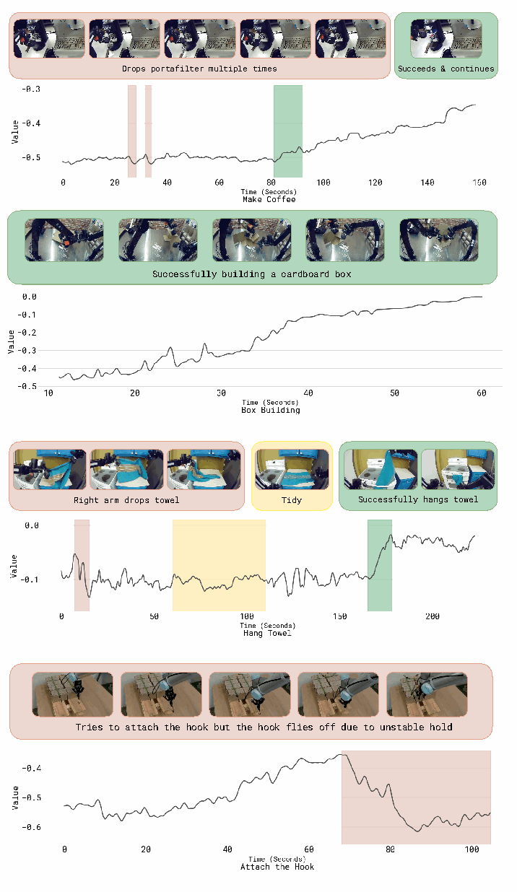

**Original caption:** Fig. 13: Additional visualization of value function on five different tasks. Red parts highlight places where value drops, green parts highlight places where value increases, and yellow parts highlight oscillating value regions. Images show the corresponding frames and descriptions of the episode.

**中文图注:** 图 13：价值函数在五个不同任务上的补充可视化。红色部分表示价值下降的位置，绿色表示价值上升的位置，黄色表示价值震荡的区域。图像展示对应的帧与 episode 描述。

**阅读提示:** 与图 4 相同读法：观察红色“掉坑”与恢复段，可判断价值函数是否捕捉到失败与恢复的时机。

### C. 计算策略改进所需的对数似然

> C. Computing the log-likelihood for policy improvement

**Source:** p.16（附录 C）

**Original:** To derive the log-likelihood from Equation (4) we can first observe that we can decompose the full model likelihood into autoregressive and diffusion terms π_θ(a_{t:t+H}, a^ℓ_{t:t+H}, ℓ̂ | I_t, o_t, ℓ) = π_θ(a_{t:t+H} | I_t, o_t, ℓ, ℓ̂) π_θ(a^ℓ_{t:t+H} | I_t, o_t, ℓ, ℓ̂) π_θ(ℓ̂_t | I_t, o_t, ℓ),   (6) where the first term is modeled with flow matching, the second term is the autoregressive likelihood of the discretized actions a^ℓ_{t:t+H}, and the third term corresponds to the autoregressive text likelihood. The autoregressive likelihoods can be estimated in the usual way, using the cross-entropy loss evaluated on ground truth tokens. For the continuous likelihood over a_{t:t+H}, a closed form likelihood is not available [79]. We can, however follow prior work [82], and consider the one-step diffusion process as a Gaussian distribution with likelihood

**中文:** 为了从式 (4) 推导对数似然，我们可以先把整个模型的似然分解为自回归项与扩散项：π_θ(a_{t:t+H}, a^ℓ_{t:t+H}, ℓ̂|I_t,o_t,ℓ) = π_θ(a_{t:t+H}|I_t,o_t,ℓ,ℓ̂) π_θ(a^ℓ_{t:t+H}|I_t,o_t,ℓ,ℓ̂) π_θ(ℓ̂_t|I_t,o_t,ℓ)。（式 6）其中第一项用流匹配建模，第二项是离散化动作 a^ℓ_{t:t+H} 的自回归似然，第三项对应自回归的文本似然。自回归似然可以按常规方式用真值词元上的交叉熵损失估计；而连续部分 a_{t:t+H} 没有闭式似然 [79]。不过我们可以沿用此前工作 [82]，把单步扩散过程视为一个高斯分布，其似然为

### 式 (6)：整体对数似然的分解

**Source:** p.16（附录 C）

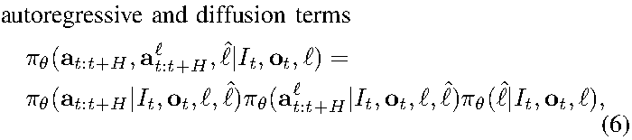

**公式（线性转写，仅供参考）:** π_θ(a_{t:t+H}, a^ℓ_{t:t+H}, ℓ̂ | I_t, o_t, ℓ) = π_θ(a_{t:t+H} | I_t, o_t, ℓ, ℓ̂) · π_θ(a^ℓ_{t:t+H} | I_t, o_t, ℓ, ℓ̂) · π_θ(ℓ̂ | I_t, o_t, ℓ)

**中文说明:** 三项分别是：连续动作（流匹配）、离散动作（自回归）、子任务文本（自回归）。

**Source:** p.16（附录 C）

**Original:** log π^{η,ω}_θ(a_{t:t+H} | a_{1:H}, I_t, o_t, ℓ, ℓ̂) = log N(ω − f_θ(a^{η,ω}_{1:H}, I_t, o_t, ℓ, ℓ̂), I),   (7) with a^{η,ω}_{t:t+H} = η a_{t:t+H} + (1 − η) ω and ω = N(0, I). From this we can form an evidence lower bound to the likelihood following [80, 82] (effectively marginalizing over η and ω) which yields

**中文:** log π^{η,ω}_θ(a_{t:t+H}|a_{1:H},I_t,o_t,ℓ,ℓ̂) = log N(ω − f_θ(a^{η,ω}_{1:H},I_t,o_t,ℓ,ℓ̂), I)，（式 7）其中 a^{η,ω}_{t:t+H} = η a_{t:t+H} + (1 − η)ω，ω = N(0,I)。由此可按 [80, 82] 的做法（实质上对 η 与 ω 做边缘化）构造似然的证据下界（ELBO），得到

### 式 (7)：单步扩散过程的高斯似然

**Source:** p.16（附录 C）

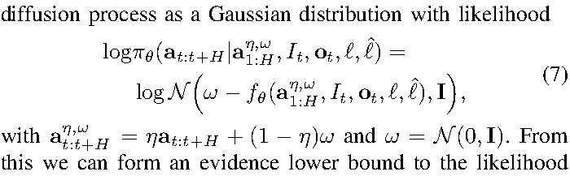

**公式（线性转写，仅供参考）:** log π^{η,ω}_θ(a_{t:t+H} | a_{1:H}, I_t, o_t, ℓ, ℓ̂) = log N(ω − f_θ(a^{η,ω}_{1:H}, I_t, o_t, ℓ, ℓ̂), I)

**中文说明:** 把流匹配的单步去噪误差写成高斯对数似然，后续即可用 ELBO 与流匹配损失建立联系。

**Source:** p.16（附录 C）

**Original:** log π²_θ(a_{t:t+H} | I_t, o_t, ℓ, ℓ̂) ≥ 1/2 E[ − w(η) ‖ω − a_{1:H} − f_θ(a^{η,ω}_{1:H}, I_t, o_t, ℓ, ℓ̂)‖² ] + c,   (8) where w(η) = e^{−η/2} is a noise dependent weighting term, and c is a constant independent of f_θ. For the derivation, see [80], which also derives the relationship between flow matching and diffusion in Appendix D.3 for this choice of weighting term. Finally putting the lower bound together with the autoregressive likelihood for the discretized action part of the model gives log π²_θ(a_{t:t+H}, a^ℓ_{t:t+H} | I_t, o_t, ℓ, ℓ̂) ≥ E_{η,ω}[ log p_θ(a^ℓ_{t:t+H} | I_t, o_t, ℓ, ℓ̂) − α_η ‖ω − a_{1:H} − f_θ(a^{η,ω}_{1:H}, I_t, o_t, ℓ, ℓ̂)‖² ],   (9) which is the bound given in the main part of the paper.

**中文:** log π²_θ(a_{t:t+H}|I_t,o_t,ℓ,ℓ̂) ≥ 1/2 E[ − w(η)‖ω − a_{1:H} − f_θ(a^{η,ω}_{1:H}, I_t, o_t, ℓ, ℓ̂)‖² ] + c，（式 8）其中 w(η) = e^{−η/2} 是依赖噪声强度的权重项，c 是与 f_θ 无关的常数。推导见 [80]；该文在附录 D.3 中针对这一权重选择推导了流匹配与扩散之间的关系。最后，把该下界与模型离散动作部分的自回归似然合并，得到 log π²_θ(a_{t:t+H}, a^ℓ_{t:t+H}|I_t,o_t,ℓ,ℓ̂) ≥ E_{η,ω}[ log p_θ(a^ℓ_{t:t+H}|I_t,o_t,ℓ,ℓ̂) − α_η‖ω − a_{1:H} − f_θ(a^{η,ω}_{1:H},I_t,o_t,ℓ,ℓ̂)‖² ]，（式 9）这正是正文中给出的下界。

### 式 (8)：扩散似然的证据下界（ELBO）

**Source:** p.16（附录 C）

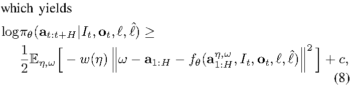

**公式（线性转写，仅供参考）:** log π²_θ(a_{t:t+H} | I_t, o_t, ℓ, ℓ̂) ≥ 1/2 E[ − w(η)‖ω − a_{1:H} − f_θ(a^{η,ω}_{1:H}, I_t, o_t, ℓ, ℓ̂)‖² ] + c

**中文说明:** w(η) = e^{−η/2} 为噪声相关权重；该式把流匹配回归损失解释为似然下界。

### 式 (9)：合并后的整体下界（跨页，p.16 底部）

**Source:** p.16（附录 C，延续到 p.17）

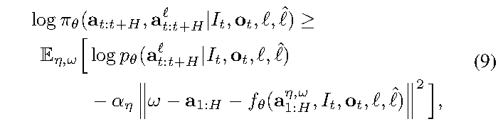

**公式（线性转写，仅供参考）:** log π²_θ(a_{t:t+H}, a^ℓ_{t:t+H} | I_t, o_t, ℓ, ℓ̂) ≥ E_{η,ω}[ log p_θ(a^ℓ_{t:t+H} | I_t, o_t, ℓ, ℓ̂) − α_η ‖ω − a_{1:H} − f_θ(a^{η,ω}_{1:H}, I_t, o_t, ℓ, ℓ̂)‖² ]

**中文说明:** 式 (9) 与正文式 (4) 结构一致，区别是这里来自附录的推导，并在附录 D 中会去掉改进指标 I。

### D. PPO 实现

> D. PPO implementation

**Source:** p.17（附录 D）

**Original:** We implement a variant of PPO [66] related to DPPO and FPO [23, 82] and use it as an additional baseline. To allow for training both the autoregressive part of the model as well as the diffusion based action expert in a compute effective manner we calculate likelihoods based on the single step diffusion objective alone. In particular, we use a likelihood bound analogous to Eq. (9) (previous section) but without the improvement indicator. Decomposing into autoregressive and flow-matching terms this can be written as log π²_θ(a_{t:t+H}, a^ℓ_{t:t+H} | o_t, ℓ, ℓ̂) ≥ E_{η,ω}[ log p_θ(a^ℓ_{t:t+H} | o_t, ℓ, ℓ̂) − α_η ‖ω − a_{1:H} − f_θ(a^{η,ω}_{1:H}, o_t, ℓ, ℓ̂)‖² ],   (10) which is analogous to the diffusion likelihood bound used in FPO [82]. And we combine it with a PPO style loss separated into diffusion and autoregressive terms. In preliminary experiments we found that for our setting it was difficult to enforce a trust region constraint on the action expert (which models actions with an unbounded diffusion head) when using the standard PPO clipping objective. Presumably, this is partially due to the “offline” nature of our algorithm setting, where we cannot afford to collect new data from real robots every few gradient steps. To stabilize training we found using an alternative definition of the PPO constraint following SPO [83] to be effective. The resulting loss is given as: L_SPO+CoV_LA(θ) = [ … ]   (11) where α is a trade-off parameter and ϵ, ϵ_flow are trust-region parameters.

**中文:** 我们实现了 PPO [66] 的一个变体（与 DPPO、FPO [23, 82] 相关），并把它作为额外基线。为了以计算高效的方式同时训练模型的自回归部分与基于扩散的动作专家，我们只用单步扩散目标来计算似然。具体来说，我们使用与上一节式 (9) 类似、但去掉改进指标的似然下界。将其分解为自回归项与流匹配项，可以写成 log π²_θ(a_{t:t+H}, a^ℓ_{t:t+H}|o_t,ℓ,ℓ̂) ≥ E_{η,ω}[ log p_θ(a^ℓ_{t:t+H}|o_t,ℓ,ℓ̂) − α_η‖ω − a_{1:H} − f_θ(a^{η,ω}_{1:H},o_t,ℓ,ℓ̂)‖² ]，（式 10）这与 FPO [82] 使用的扩散似然下界类似。我们再把它与按扩散项、自回归项分开的 PPO 风格损失结合。在初步实验中我们发现：在标准 PPO 裁剪目标下，很难对动作专家（用无界扩散头建模动作）施加信赖域约束。这或许部分源于我们算法设定的“离线”性质——我们无法每隔几个梯度步就从真实机器人上采集新数据。为稳定训练，我们发现采用 SPO [83] 给出的另一种 PPO 约束定义是有效的。由此得到的损失为：L_SPO+CoV_LA(θ) = [ … ]（式 11）其中 α 是权衡参数，ϵ 与 ϵ_flow 是信赖域参数。

### 式 (10)：PPO 使用的似然下界（不含改进指标）

**Source:** p.17（附录 D，跨页自 p.16 底部）

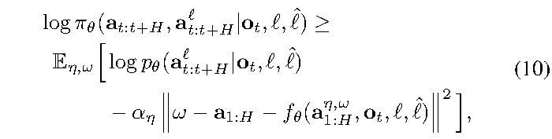

**公式（线性转写，仅供参考）:** log π²_θ(a_{t:t+H}, a^ℓ_{t:t+H} | o_t, ℓ, ℓ̂) ≥ E_{η,ω}[ log p_θ(a^ℓ_{t:t+H} | o_t, ℓ, ℓ̂) − α_η ‖ω − a_{1:H} − f_θ(a^{η,ω}_{1:H}, o_t, ℓ, ℓ̂)‖² ]

**中文说明:** 把式 (9) 中的 I_t 去掉即得；用于让 PPO 基线在同等的似然口径下训练。

### 式 (11)：SPO+CoV 形式的 PPO 损失

**Source:** p.17（附录 D）

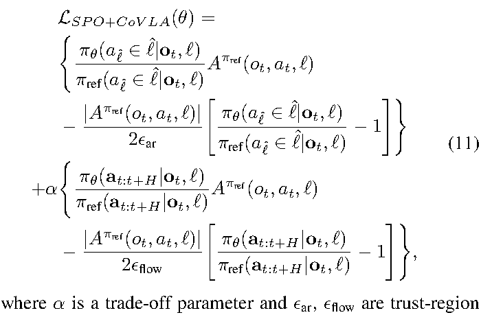

**中文说明:** 损失由两部分组成：自回归词元部分（含比率项与 |A| 相关的加权）与流部分（flow），分别受信赖域参数 ϵ 与 ϵ_flow 控制。作者指出标准 PPO 裁剪在无界扩散头上难以稳定，故改用 SPO 的约束形式。

### E. 使用 CFG 在推理时改进策略（β > 1）

> E. Using CFG for test-time policy improvement with β > 1

**Source:** p.17（附录 E）

**Original:** After training we can choose to further sharpen the policy used for evaluation by setting β > 1 in Eq. (2). As shown in prior work [4] we can recover this sharpened policy without additional training since it is implicitly defined by the learned policies π_θ(a_{t:t+H} | I_t, o_t, ℓ) and π_θ(a_{t:t+H} | o_t, ℓ). Specifically, after training we can form the approximation π̂(a_{t:t+H} | o_t, ℓ) ∝ π_ref(a_{t:t+H} | o_t, ℓ) ( π_ref(a_{t:t+H} | I_t, o_t, ℓ) / π_ref(a_{t:t+H} | o_t, ℓ) )^β.   (12) One can now realize that the diffusion model effectively learns the gradient of the likelihoods, i.e. it represents ∇_a log π_θ(a_{t:t+H} | I_t, o_t, ℓ) and ∇_a log π_θ(a_{t:t+H} | o_t, ℓ) respectively. From this, following Frans et al. [4], we can see that if we run flow-matching inference following the gradient ∇_a log π_θ(a_{t:t+H} | o_t, ℓ) + β ( ∇_a log π_θ(a_{t:t+H} | I_t, o_t, ℓ) − ∇_a log π_θ(a_{t:t+H} | o_t, ℓ) ),   (13) we are effectively sampling from the desired attenuated distribution. We note that, as mentioned in the main paper, the parameter β is loosely connected to the advantage threshold ϵ_ℓ that we introduce during training (in the sense that both sharpen the distribution, one at inference and one at training time). We find that sharpening the distribution after training with high settings for β can lead to pushing the action distribution towards the boundaries of its learned support (which can lead to overly aggressive motions) and thus primarily rely on ϵ_ℓ for obtaining a good conditioned policy directly after training and combine it with moderate settings (e.g. β ∈ [1.5, 2.5]) where useful.

**中文:** 训练完成后，我们可以通过在式 (2) 中设 β > 1 来进一步锐化用于评估的策略。如此前工作 [4] 所示，由于该锐化策略已由学到的 π_θ(a_{t:t+H}|I_t,o_t,ℓ) 与 π_θ(a_{t:t+H}|o_t,ℓ) 隐式定义，我们无需额外训练就能恢复它。具体地，训练之后可以构造如下近似：π̂(a_{t:t+H}|o_t,ℓ) ∝ π_ref(a_{t:t+H}|o_t,ℓ) ( π_ref(a_{t:t+H}|I_t,o_t,ℓ) / π_ref(a_{t:t+H}|o_t,ℓ) )^β。（式 12）可以看出，扩散模型实际上学到的是似然的梯度，即它分别表示 ∇_a log π_θ(a_{t:t+H}|I_t,o_t,ℓ) 与 ∇_a log π_θ(a_{t:t+H}|o_t,ℓ)。据此并遵循 Frans 等 [4]，如果我们在流匹配推理时沿如下梯度采样：∇_a log π_θ(a_{t:t+H}|o_t,ℓ) + β ( ∇_a log π_θ(a_{t:t+H}|I_t,o_t,ℓ) − ∇_a log π_θ(a_{t:t+H}|o_t,ℓ) )，（式 13）那么我们实际上就是从所期望的“衰减后分布”中采样。需要说明的是，正如正文所述，参数 β 与我们在训练中引入的优势阈值 ϵ_ℓ 只有松散联系（两者都在锐化分布，只是一个在推理时、一个在训练时）。我们发现，用较大的 β 在训练后锐化分布会把动作分布推向其学习支撑集的边界（可能导致动作过于激进），因此我们主要依靠 ϵ_ℓ 来直接获得训练后的良好条件化策略，只在有用时配合适中的设置（例如 β ∈ [1.5, 2.5]）。

### 式 (12) 与式 (13)：CFG 的推理时策略与梯度形式

**Source:** p.17（附录 E）

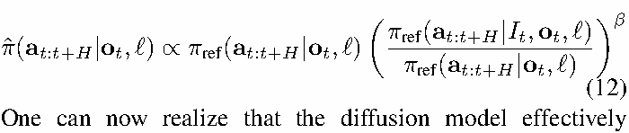

**公式（线性转写，仅供参考）:** 式 (12): π̂(a_{t:t+H} | o_t, ℓ) ∝ π_ref(a_{t:t+H} | o_t, ℓ) [ π_ref(a_{t:t+H} | I_t, o_t, ℓ) / π_ref(a_{t:t+H} | o_t, ℓ) ]^β；式 (13): ∇_a log π_θ(a_{t:t+H} | o_t, ℓ) + β(∇_a log π_θ(a_{t:t+H} | I_t, o_t, ℓ) − ∇_a log π_θ(a_{t:t+H} | o_t, ℓ))

**中文说明:** 式 (13) 说明 CFG 在流匹配推理中如何实现：把“有条件与无条件”的梯度差按 β 加权，加到无条件梯度上。

### F. 算法补充细节

> F. Additional algorithm details

**Source:** p.18（附录 F）

**Original:** We describe details for setting the task specific parameters used in Algorithm 1. Advantage Estimation: During post-training, we estimate the advantage function using A^π(o_t, a_t) = Σ_{t'=t}^{t+N−1} r_{t'} + V^π(o_{t+N}) − V^π(o_t), where o_{t+N} is an observation sampled from N steps ahead from the same trajectory. We use N = 50 lookahead to calculate this advantage. During pre-training, we calculate the advantage estimate as A^π(o_t, a_t) = Σ_{t'=0}^{T} r_{t'} − V^π(o_t), setting N = T for each episode, which is a higher variance estimate of the advantage. We use this advantage calculation since it allows us to calculate the advantage values on-the-fly during pre-training using a single inference call to the value function. We find empirically that this advantage estimate works well when the policy is trained on large amounts of data from diverse tasks during pre-training.

**中文:** 下面说明算法 1 中任务相关参数的设置细节。优势估计：在后训练阶段，我们用 A^π(o_t,a_t) = Σ_{t'=t}^{t+N−1} r_{t'} + V^π(o_{t+N}) − V^π(o_t) 估计优势函数，其中 o_{t+N} 是从同一轨迹向前采样 N 步后的观测；我们取 N = 50 的前瞻来计算该优势。在预训练阶段，我们用 A^π(o_t,a_t) = Σ_{t'=0}^{T} r_{t'} − V^π(o_t) 计算优势估计（即对每个 episode 取 N = T），这是一个方差更大的优势估计。我们采用这种优势计算方式，是因为它让我们能在预训练中只通过一次价值函数推理就在线算出优势值；经验上我们发现，当预训练阶段策略在来自多样任务的大量数据上训练时，这种优势估计效果很好。

### 附录中的优势估计（后训练 n 步前瞻与预训练全局形式）

**Source:** p.18（附录 F）

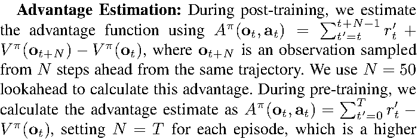

**公式（线性转写，仅供参考）:** 后训练：A^π(o_t, a_t) = Σ_{t'=t}^{t+N−1} r_{t'} + V^π(o_{t+N}) − V^π(o_t)（N = 50）；预训练：A^π(o_t, a_t) = Σ_{t'=0}^{T} r_{t'} − V^π(o_t)（N = T）

**中文说明:** 两种估计的差别在于前瞻长度 N：预训练用整条 episode（相当于回报减价值），后训练用 50 步前瞻。

**Source:** p.18（附录 F）

**Original:** Advantage conditioning dropout: During training, we randomly drop out the conditioning on the advantage indicator 30% of the time. We employ this dropout so that we can directly sample directly from either the conditional or unconditional policy during inference time and use CFG for test-time policy improvement (see Section E for details); and it effectively replaces the loss multiplier α. Advantage threshold: The per task advantage threshold ϵ_ℓ is set as follows. During pre-training we select the threshold for each task such that approximately 30% of the demonstration data has positive advantage (as calculated on a random sample of 10k datapoints). During fine-tuning we generally set the threshold such that approximately 40% of the evaluation rollouts in each iteration have positive advantage. For the T-shirt and shorts laundry folding task (in which training on high-quality demonstration data yields slow policies but with high success rate) we increase the threshold such that only approximately 10% of the data has positive advantage. Dataset composition: We use the dataset aggregation strategy described in Algorithm 1 for all tasks. However each of our task has distinct nature: the episode lengths vary, the performances of Iteration 0 model on each task are different, and one task (Assemble Box) is performed offsite in a deployment scenario. Therefore, we have different amount of demonstration data to begin with and collect different amounts of experience data for iterative improvement.

**中文:** 优势条件化的 dropout：训练时我们有 30% 的概率随机丢弃对优势指标的条件化。这样做的目的是让我们在推理时既能直接从有条件策略采样、也能从无条件策略采样，从而用 CFG 做测试时策略改进（详见附录 E）；它实际上替代了损失乘子 α。优势阈值：逐任务的优势阈值 ϵ_ℓ 设置如下。预训练时，我们为每个任务选择阈值，使大约 30% 的示范数据具有正优势（在 1 万个数据点的随机样本上计算）。微调时我们通常把阈值设为使每轮评估 rollout 中约 40% 具有正优势。对 T 恤与短裤叠衣任务（在高质量示范数据上训练会得到成功率很高但动作很慢的策略），我们把阈值调高，使只有约 10% 的数据具有正优势。数据集构成：所有任务都采用算法 1 描述的数据集聚合策略。但每个任务的性质不同：episode 长度不同，Iteration 0 模型在各任务上的表现不同，而且有一个任务（组装纸箱）是在场外的部署场景中执行的。因此，我们各任务起始的示范数据量不同，为迭代改进采集的经验数据量也不同。

**Source:** p.18（附录 F）

**Original:** For laundry (T-shirt and shorts), we use autonomous evaluation data only without expert corrections. As we push model performance to closely resemble the expert data collector in terms of speed, it becomes hard to provide corrections. For this task, we collect 300 episodes across 4 robot stations for reporting eval performance. For the diverse laundry folding task we collect 450 evaluation episodes and 287 correction episodes. For the failure mode removal ablation we collect both autonomous and policy correction data. In total we collect ∼1000 autonomous and 280 + 378 correction episodes spread over 3 robots. For box assembly we collect data in the deployment scenario directly, collecting 600 demonstrations and 360 correction episodes in each iteration, using 3 robots in total. For cafe we perform a single iteration and collect 429 correction episodes as well as 414 autonomous episodes.

**中文:** 对叠衣任务（T 恤与短裤），我们只使用自主评估数据，不使用专家纠正——当模型速度被推到接近专家数据采集员时，人工很难再提供有效纠正。该任务我们在 4 个机器人站点上采集 300 个 episode 用于报告评估性能。多样化叠衣任务我们采集 450 个评估 episode 与 287 个纠正 episode。失败模式消除的消融实验中我们同时采集自主数据与策略纠正数据，合计约 1000 个自主 episode 与 280 + 378 个纠正 episode，分布在 3 台机器人上。纸箱组装任务直接在部署场景采集数据：每轮采集 600 个示范与 360 个纠正 episode，共使用 3 台机器人。咖啡任务只做一轮迭代，采集 429 个纠正 episode 与 414 个自主 episode。
