# π0: A Vision-Language-Action Flow Model for General Robot Control

## π0：面向通用机器人控制的视觉-语言-动作流模型 · 中英对照全文阅读（nature-reader）

| 项目 | 内容 |
| --- | --- |
| 标题 | π0: A Vision-Language-Action Flow Model for General Robot Control |
| 中文题名 | π0：面向通用机器人控制的视觉-语言-动作流模型 |
| 作者 | Kevin Black, Noah Brown, Danny Driess, Adnan Esmail, Michael Equi, Chelsea Finn, Niccolo Fusai, Lachy Groom, Karol Hausman, Brian Ichter, Szymon Jakubczak, Tim Jones, Liyiming Ke, Sergey Levine, Adrian Li-Bell, Mohith Mothukuri, Suraj Nair, Karl Pertsch, Lucy Xiaoyang Shi, James Tanner, Quan Vuong, Anna Walling, Haohuan Wang, Ury Zhilinsky |
| 机构 | Physical Intelligence（美国加州旧金山，San Francisco, California, USA） |
| 论文类型 | 方法/模型论文：通用机器人策略（robot foundation model），VLM + flow matching 的 VLA |
| arXiv | 2410.24164v4 [cs.LG]，v4 版本日期 2026-01-08 |
| 项目主页 | https://physicalintelligence.company/blog/pi0 |
| 源文件 | `2410.24164v4.pdf`（与本文件同目录） |
| 页数 | 17 页：正文 pp.1-11、参考文献 pp.12-15、附录 A-E pp.15-17（IEEE 双栏会议版式） |
| 抽取方式 | 可选中文本 PDF；`pdfplumber` 词级坐标抽取并按栏重建段落（保留 π0 下标、公式符号），图/表按 PDF 坐标 300 DPI 紧致裁切 |

**阅读方式**

每个内容块都有稳定锚点（`S###` 正文/标题/公式、`C###` 图注与表注、`F###` 图卡片、`T###` 表卡片），并给出 `**Original:**` 原文与 `**中文:**` 译文。图表以卡片形式插在**首次实质性提及**的位置，卡片内保留英文图注、中文图注与阅读提示；若图注在 PDF 中位于其他页/栏，卡片用 `**Placed near:**` 标注插入位置（形如 `p.2 S021`）。正文中的公式、符号、数值与引用编号 `[n]` 一律保留原样，专有名词（π0、PaliGemma、OXE、OpenVLA、Octo、ACT、Diffusion Policy 等）保留英文。参考文献按惯例压缩为“前 3 位作者 + et al.”的条目，不作中译。

**页面与章节索引**

| 页码范围 | 内容 |
| --- | --- |
| p.1 | 标题、作者、Fig. 1 与图注、摘要、脚注 |
| p.2 | Fig. 2 与图注、I. Introduction（含海因莱因引文） |
| p.3 | I. Introduction 续、II. Related Work |
| p.4 | Fig. 3 与图注、III. Overview、IV. The π0 Model（含脚注 1） |
| p.5 | 条件流匹配损失与推理公式、非 VLM 基线、V. Data Collection and Training Recipe、Fig. 4 与图注 |
| p.6 | 预训练数据细节、语言与高层策略、机器人平台细节（Fig. 5）、VI. Experimental Evaluation |
| p.7 | Fig. 6 与图注、A. Evaluating the base model（五个开箱任务、基线与指标） |
| p.8 | Fig. 7/Fig. 8 与图注、B. Following language commands、C. Learning new dexterous tasks |
| p.9 | Fig. 9/Fig. 10 与图注、五个微调任务、与 ACT/Diffusion Policy 的对比设置 |
| p.10 | Fig. 11 与图注、D. Mastering complex multi-stage tasks（7 个复杂任务） |
| p.11 | Fig. 12/Fig. 13 与图注、VII. Discussion, Limitations, and Future Work |
| p.12 | 讨论续、Acknowledgements、References [1]-[11] |
| p.13-14 | References [12]-[46] |
| p.15 | References [47]-[60]、Appendix A（贡献分工）、Appendix B（模型架构细节） |
| p.16 | Fig. 14 与图注、Appendix B 续、Appendix C（非 VLM 基线）、Appendix D（推理）与 Table I、Appendix E 开头 |
| p.17 | Appendix E：各任务的评分细则 |

---

## p.1 标题页 · Fig. 1 · 摘要

**Source:** p.1 S001

**Original:** π0: A Vision-Language-Action Flow Model for General Robot Control

**中文:** π0：面向通用机器人控制的视觉-语言-动作流模型（π0: A Vision-Language-Action Flow Model for General Robot Control）

**Source:** p.1 S003

**Original:** Physical Intelligence

**中文:** Physical Intelligence（美国加州旧金山）

**Source:** p.1 S004

**Original:** Kevin Black, Noah Brown, Danny Driess, Adnan Esmail, Michael Equi, Chelsea Finn, Niccolo Fusai, Lachy Groom, Karol Hausman, Brian Ichter, Szymon Jakubczak, Tim Jones, Liyiming Ke, Sergey Levine, Adrian Li-Bell, Mohith Mothukuri, Suraj Nair, Karl Pertsch, Lucy Xiaoyang Shi, James Tanner, Quan Vuong, Anna Walling, Haohuan Wang, Ury Zhilinsky

**中文:** 作者：Kevin Black、Noah Brown、Danny Driess、Adnan Esmail、Michael Equi、Chelsea Finn、Niccolo Fusai、Lachy Groom、Karol Hausman、Brian Ichter、Szymon Jakubczak、Tim Jones、Liyiming Ke、Sergey Levine、Adrian Li-Bell、Mohith Mothukuri、Suraj Nair、Karl Pertsch、Lucy Xiaoyang Shi、James Tanner、Quan Vuong、Anna Walling、Haohuan Wang、Ury Zhilinsky

**Source:** p.1 S006

**Original:** https://physicalintelligence.company/blog/pi0

**中文:** 项目主页：https://physicalintelligence.company/blog/pi0

**Source:** p.1 C001

**Original:** Fig. 1: Our generalist robot policy uses a pre-trained vision-language model (VLM) backbone, as well as a diverse cross-embodiment dataset with a variety of dexterous manipulation tasks. The model is adapted to robot control by adding a separate action expert that produces continuous actions via flow matching, enabling precise and fluent manipulation skills. The model can then be used directly to perform tasks based on a prompt, or fine-tuned on high-quality data to enable complex multi-stage tasks, such as folding multiple articles of laundry or assembling a box.

**中文:** 图 1：我们的通用机器人策略使用一个预训练的视觉-语言模型（VLM）主干，以及包含多种灵巧操作任务的跨本体数据集。模型通过增加一个独立的 action expert（动作专家）来适配机器人控制，该专家用流匹配生成连续动作，从而实现精确而流畅的操作技能。随后，模型既可以直接依据提示执行任务，也可以在高 质量数据上微调，以完成诸如折叠多件衣物或组装纸箱等复杂的多阶段任务。

**Source:** p.1 S008

**Original:** Abstract—Robot learning holds tremendous promise to unlock the full potential of flexible, general, and dexterous robot systems, as well as to address some of the deepest questions in artificial intelligence. However, bringing robot learning to the level of generality required for effective real-world systems faces major obstacles in terms of data, generalization, and robustness. In this paper, we discuss how generalist robot policies (i.e., robot foundation models) can address these challenges, and how we can design effective generalist robot policies for complex and highly dexterous tasks. We propose a novel flow matching architecture built on top of a pre-trained vision-language model (VLM) to inherit Internet-scale semantic knowledge. We then discuss how this model can be trained on a large and diverse dataset from multiple dexterous robot platforms, including single-arm robots, dual-arm robots, and mobile manipulators. We evaluate our model in terms of its ability to perform tasks via direct prompting, follow language instructions from people and from a high-level VLM policy, and its ability to acquire new skills via fine-tuning. Our results cover a wide variety of tasks, such as laundry folding, table cleaning, and assembling boxes.

**中文:** 摘要——机器人学习有望释放灵活、通用、灵巧机器人系统的全部潜力，并回答人工智能中一些最深层的问题。然而，要让机器人学习达到有效真实世界系统所需的通用性水平，在数据、泛化与鲁棒性方面仍面临重大障碍。本文讨论通用机器人策略（即机器人基础模型）如何应对这些挑战，以及如何为复杂且高度灵巧的任务设计有效的通用机器人策略。<mark>我们提出一种新颖的流匹配架构，它建立在一个预训练的视觉-语言模型（VLM）之上，以继承互联网规模的语义知识。</mark>随后我们讨论如何在来自多种灵巧机器人平台（包括单臂机器人、双臂机器人与移动机械臂）的大规模、多样化数据集上训练该模型。**我们从三个方面评估模型：通过直接提示执行任务的能力、跟随人类与高层 VLM 策略给出的语言指令的能力，以及通过微调获得新技能的能力。**我们的结果覆盖了各种各样的任务，例如折叠衣物、清理餐桌与组装纸箱。

**Source:** p.1 S009

**Original:** Physical Intelligence, San Francisco, California, USA. Correspondance to: research@physicalintelligence.company

**中文:** Physical Intelligence，美国加州旧金山。通讯作者：research@physicalintelligence.company

---

## p.2 Fig. 2 · I. Introduction

**Source:** p.2 C002

**Original:** Fig. 2: π0 controls a mobile manipulator to fold laundry. Our model is pre-trained on diverse data from 7 distinct robot configurations and 68 tasks, and can then either be prompted directly or fine-tuned to complex downstream tasks, as in the case of this laundry folding policy, which fetches laundry from a dryer, packs it into a hamper, brings the hamper to a folding table, and then folds each article of clothing.

**中文:** 图 2：π0 控制一台移动机械臂机器人折叠衣物。我们的模型在来自 7 种不同机器人配置、68 个任务的多样化数据上预训练，之后既可以直接通过提示（prompt）使用，也可以微调到复杂的下游任务——图中这个洗衣折叠策略正是后者：它从烘干机中取出衣物，把衣物装进洗衣篮，再把洗衣篮搬到折叠台，然后逐件折叠衣物。

**Source:** p.2 S012

**Original:** I. INTRODUCTION

**中文:** I. 引言（INTRODUCTION）

**Source:** p.2 S013

**Original:** A human being should be able to change a diaper, plan an invasion, butcher a hog, conn a ship, design a building, write a sonnet, balance accounts, build a wall, set a bone, comfort the dying, take orders, give orders, cooperate, act alone, solve equations, analyze a new problem, pitch manure, program a computer, cook a tasty meal, fight efficiently, die gallantly. Specialization is for insects. —Robert A. Heinlein, Time Enough for Love

**中文:** 一个人应当能够给婴儿换尿布、策划入侵、宰杀生猪、驾驶船只、设计建筑、写十四行诗、平衡账目、砌墙、接骨、安慰临终者、接受命令、下达命令、与人合作、独自行动、解方程、分析新问题、清运粪肥、编写程序、做一顿美餐、高效作战、体面地死去。专精只属于昆虫。——罗伯特·A·海因莱因（Robert A. Heinlein），《Time Enough for Love》

**Source:** p.2 S018

**Original:** Artificial intelligence systems come in all shapes and sizes, from highly specialized systems that solve complex problems inaccessible to the human mind, such as predicting the conformation of a protein [21], to systems that can produce lifelike high-resolution images or videos based on textual prompts [40]. However, the axis along which human intelligence most outpaces machine intelligence is versatility: the ability to solve diverse tasks situated in varied physical environments, while responding intelligently to environmental constraints, language commands, and unexpected perturbations. Perhaps the most tangible progress toward this kind of versatility in AI can be seen in large language- and vision-language models [1, 48]: systems that are pre-trained on large and very diverse corpora of images and text from the web, and then fine-tuned (“aligned”) using more carefully curated datasets meant to induce the desired pattern of behavior and responsiveness. While such models have been shown to exhibit broad instruction-following and problem-solving abilities [53, 27], they are not truly situated in a physical world the way that people are, and their understanding of physical interaction is based entirely on abstract descriptions. If such methods are to make tangible progress toward AI systems that exhibit the kind of physically situated versatility that people possess, we will need to train them on physically situated data — that is, data from embodied robot agents.

**中文:** 人工智能系统形态各异：既有能够解决人类心智难以企及的复杂问题的高度专用系统，例如预测蛋白质构象 [21]；也有能够依据文本提示生成逼真高分辨率图像或视频的系统 [40]。然而，人类智能超越机器智能最明显的维度是通用性（versatility）：能够在多样化的物理环境中解决不同任务，同时对环境约束、语言指令和意外扰动做出智能反应。这种通用性在 AI 中最直观的进展或许体现在大型语言模型与视觉-语言模型 [1, 48] 上：这类系统先在来自网络的大规模、极其多样的图像与文本语料上预训练，再用更精心整理的数据集进行微调（“对齐”），以诱导出期望的行为模式与响应方式。已有研究表明这类模型具备广泛的指令跟随与问题求解能力 [53, 27]，但它们并不像人那样真正“置身于”物理世界之中，其对物理交互的理解完全建立在抽象描述之上。若要让这类方法朝着具备人类那种具身通用性的 AI 系统取得实质性进展，我们就必须用物理具身的数据——即来自具身机器人智能体的数据——来训练它们。

**Source:** p.2 S019

**Original:** Flexible and general-purpose models that can be tasked to perform a variety of robot behaviors have tremendous practical ramifications, but they may also offer solutions to some of the toughest challenges facing robot learning today, such as availability of data, generalization, and robustness. In natural language [1] and computer vision [39], general-purpose foundation models that are pre-trained on diverse multi-task data tend to outperform narrowly tailored and specialized solutions. For example, if the goal is to recognize birds in photographs, it is likely more expedient to pre-train on many different image-language associations and then fine-tune or prompt for the bird recognition task, than it is to train on only bird recognition data. Similarly, we may find that for effective specialized robot systems, it is more effective to first pre-train on highly diverse robot data, and then fine-tune or prompt for the desired task. This can resolve the data scarcity challenge, because many more sources of data are available to a generalist model — including data from other tasks, other robots, or even non-robot sources — and it may resolve robustness and generalization challenges, because the diverse data exhibits a greater coverage of observations and actions, providing a variety of scenes, corrections, and recovery behaviors that might not be present in more narrow specialized data. Thus, adopting a large-scale pre-training approach to robot learning has the potential to address many of the field’s challenges and make practical learning-enabled robots a reality, while at the same time furthering our understanding of the deepest problems in artificial intelligence.

**中文:** 能够被指派执行多种机器人行为的灵活、通用模型具有巨大的实际意义，同时它们也可能为当今机器人学习面临的一些最棘手挑战提供解决思路，例如数据的可得性、泛化能力与鲁棒性。在自然语言 [1] 与计算机视觉 [39] 领域，在多样化多任务数据上预训练的通用基础模型，往往优于针对特定问题裁剪的专用方案。

**Source:** p.2 S020

**Original:** However, developing such generalist robot policies — i.e., robot foundation models — involves a number of major challenges. First, any such research must be done at a very large scale, because the full benefits of large-scale pre-training are often not present at smaller scales [54]. Second, it requires developing the right model architectures that can effectively make use of diverse data sources, while at the same time being able to represent the intricate and subtle behaviors necessary to interact with complex physical scenes. Third, it requires the right training recipe. This is perhaps the most important ingredient, as much of the recent progress with large models in NLP and computer vision has relied heavily on delicate strategies for curating pre-training and post-training data [35].

**中文:** 然而，开发这类通用机器人策略（即机器人基础模型）涉及若干重大挑战。第一，此类研究必须在非常大的规模上进行，因为大规模预训练的完整收益在小规模下往往并不显现 [54]。第二，需要设计合适的模型架构，既能有效利用多样化数据源，又能表示与复杂物理场景交互所必需的精细而微妙的行为。第三，需要正确的训练配方。这或许是最重要的一环，因为 NLP 与计算机视觉领域近期大模型的许多进展，都高度依赖对预训练与后训练数据进行精心策划的策略 [35]。

**Source:** p.2 S021

**Original:** In this paper, we present a prototype model and learning framework, which we call π0, that illustrates how each of these three bottlenecks could be tackled. We illustrate our model and system in Figure 1. To incorporate diverse data sources, we begin by utilizing a pre-trained vision-language model (VLM) to import Internet-scale experience. By basing our model on a VLM, we inherit the general knowledge, semantic reasoning, and problem-solving abilities of language-and vision-language models. We then further train our model to incorporate robot actions, turning it into a vision-language-action (VLA) model [7]. In order to make it feasible to utilize a variety of diverse robot data sources, we employ cross-embodiment training [10], where data from many robot types is combined into the same model. These different robot types have different configuration spaces and action representations, including single and dual-arm systems, as well as mobile manipulators. Additionally, in order to make it possible to perform highly dexterous and intricate physical tasks, we use an action chunking architecture [57] with flow matching (a variant of diffusion) to represent complex continuous action distributions [28, 32]. This enables our model to control robots at frequencies of up to 50 Hz for dexterous tasks such as laundry folding (see Figure 1). To combine flow matching with VLMs, we use a novel action expert that augments the standard VLM with flow-based outputs.

**中文:** 本文提出一个原型模型与学习框架，我们称之为 π0，用以说明这三个瓶颈分别可以如何被解决。我们在图 1 中展示了模型与系统。为了融合多样化的数据源，我们首先利用一个预训练的视觉-语言模型（VLM）引入互联网规模的先验经验。以 VLM 为基础，我们得以继承语言模型与视觉-语言模型的通用知识、语义推理与问题求解能力。随后我们进一步训练模型纳入机器人动作，使其成为视觉-语言-动作（VLA）模型 [7]。为了能够利用多种不同的机器人数据源，我们采用<mark>跨本体（cross-embodiment）训练 [10]，即把来自多种机器人类型的数据合并进同一个模型</mark>。这些机器人类型具有不同的构型空间与动作表示，包括单臂与双臂系统，以及移动机械臂平台。此外，为了能够执行高度灵巧而精细的物理任务，我们采用<mark>动作分块（action chunking）架构</mark> [57]，并用<mark>流匹配（flow matching，扩散模型的一种变体）来表示复杂的连续动作分布</mark> [28, 32]。这使我们的模型能够以最高 50 Hz 的频率控制机器人完成诸如叠衣服这样的灵巧任务（见图 1）。为了把流匹配与 VLM 结合起来，我们设计了一个新颖的 action expert（动作专家），用基于流的输出扩展标准 VLM。

### Fig. 1. π0 总览：预训练 VLM 主干 + 动作专家（flow matching）+ 跨本体数据

**Placed near:** p.2 S021
**Source:** p.1 C001

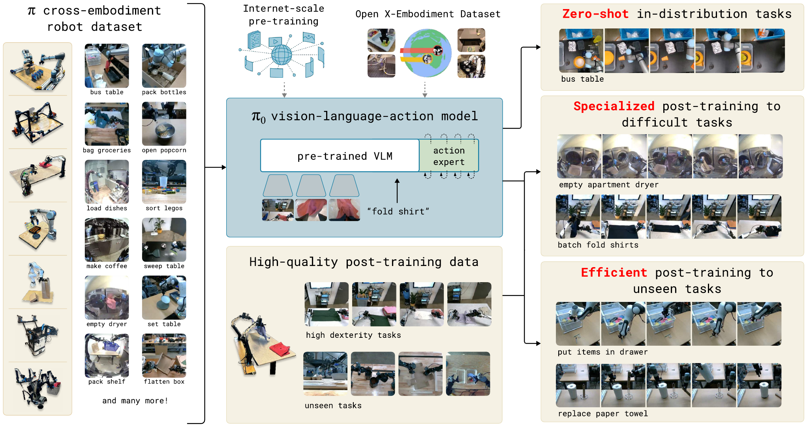

**Original caption:** Fig. 1: Our generalist robot policy uses a pre-trained vision-language model (VLM) backbone, as well as a diverse cross-embodiment dataset with a variety of dexterous manipulation tasks. The model is adapted to robot control by adding a separate action expert that produces continuous actions via flow matching, enabling precise and fluent manipulation skills. The model can then be used directly to perform tasks based on a prompt, or fine-tuned on high-quality data to enable complex multi-stage tasks, such as folding multiple articles of laundry or assembling a box.

**中文图注:** 图 1：我们的通用机器人策略使用一个预训练的视觉-语言模型（VLM）主干，以及包含多种灵巧操作任务的跨本体数据集。模型通过增加一个独立的 action expert（动作专家）来适配机器人控制，该专家用流匹配生成连续动作，从而实现精确而流畅的操作技能。随后，模型既可以直接依据提示执行任务，也可以在高 质量数据上微调，以完成诸如折叠多件衣物或组装纸箱等复杂的多阶段任务。

**Reading note:** 左侧是预训练数据来源（多样化的跨本体灵巧操作任务与开源数据），中间是由预训练 VLM 主干和较小的 action expert 组成的 π0 模型，动作通过 flow matching 以连续方式生成；右侧是两种使用方式：直接按提示执行任务，或在高质量数据上微调以完成叠多件衣物、组装纸箱等复杂多阶段任务。

---

## p.3 II. Related Work

**Source:** p.3 S022

**Original:** As with language models, the architecture of our model is only part of our method. In order to flexibly and robustly perform complex tasks, we need the right training recipe. Our recipe mirrors the pre-training/post-training separation commonly seen in exascale language- and image-language models [1, 48], where the model is first pre-trained on a very large and diverse corpus, and then fine-tuned on more narrow and more carefully curated data to induce the desired pattern of behavior — in our case, dexterity, efficiency, and robustness. Intuitively, training only on high-quality data does not teach the model how to recover from mistakes, since mistakes are rarely seen in such data. Training on only lower-quality pre-training data does not teach the model to act efficiently and robustly. Combining both provides the desired behavior: the model attempts insofar as possible to act in a manner similar to the high-quality data, but still has a repertoire of recoveries and corrections that it can deploy in the case of a mistake. The contributions of our work consist of a novel generalist robot policy architecture based on VLM pre-training and flow matching, and an empirical investigation of pre-training/post-training recipes for such robot foundation models. We evaluate our model out of the box with language commands, with fine-tuning to downstream tasks, and in combination with a high-level semantic policy that outputs intermediate language commands to perform complex and temporally extended tasks. While our model and system make use of a variety of ideas presented in recent work, the combination of ingredients is novel, and the empirical evaluation demonstrates a level of dexterity and generality that goes significantly beyond previously demonstrated robot foundation models. We evaluate our approach by pre-training on over 10,000 hours of robot data, and fine-tuning to a variety of dexterous tasks, including laundry folding (see Figure 2), clearing a table, putting dishes in a microwave, stacking eggs into a carton, assembling a box, and bagging groceries.

**中文:** 与语言模型一样，模型架构只是我们方法的一部分。为了灵活且鲁棒地完成复杂任务，我们还需要正确的训练配方。我们的配方沿用了超大规模语言模型与图像-语言模型 [1, 48] 中常见的“预训练/后训练”分离：先在规模非常大且高度多样的语料上预训练，再用更窄、更精心整理的数据进行微调，以诱导出期望的行为模式——在我们的场景中即灵巧性、效率与鲁棒性。直观地说，只在高质量数据上训练并不能教会模型如何从错误中恢复，因为这类数据中很少出现错误；而只在质量较低的预训练数据上训练，也无法教会模型高效、鲁棒地行动。两者结合才能得到期望的行为：**模型尽可能以接近高质量数据的方式行动，同时又保留一套可供调用的恢复与纠正行为，以便在出错时使用。**我们工作的贡献包括：一个基于 VLM 预训练与流匹配的新型通用机器人策略架构，以及对这类机器人基础模型预训练/后训练配方的实证研究。我们评估了模型在开箱（out of the box）状态下响应语言指令的能力、微调到下游任务后的表现，以及与输出中间语言指令的高层语义策略配合完成复杂、时间跨度较长任务的能力。虽然我们的模型与系统利用了近期工作中的诸多想法，但这些要素的组合是新的，且实证评估展示出的灵巧性与通用性水平显著超越了此前展示的机器人基础模型。我们的方法在超过 10,000 小时的机器人数据上进行预训练，并微调到多种灵巧任务，包括叠衣服（见图 2）、清理餐桌、把餐具放进微波炉、把鸡蛋叠放进蛋盒、组装纸箱以及装袋杂货。

### Fig. 2. π0 控制移动机械臂完成洗衣折叠长程任务

**Placed near:** p.3 S022
**Source:** p.2 C002

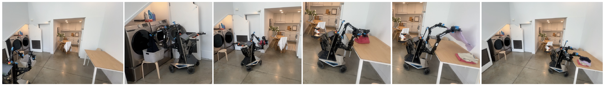

**Original caption:** Fig. 2: π0 controls a mobile manipulator to fold laundry. Our model is pre-trained on diverse data from 7 distinct robot configurations and 68 tasks, and can then either be prompted directly or fine-tuned to complex downstream tasks, as in the case of this laundry folding policy, which fetches laundry from a dryer, packs it into a hamper, brings the hamper to a folding table, and then folds each article of clothing.

**中文图注:** 图 2：π0 控制一台移动机械臂机器人折叠衣物。我们的模型在来自 7 种不同机器人配置、68 个任务的多样化数据上预训练，之后既可以直接通过提示（prompt）使用，也可以微调到复杂的下游任务——图中这个洗衣折叠策略正是后者：它从烘干机中取出衣物，把衣物装进洗衣篮，再把洗衣篮搬到折叠台，然后逐件折叠衣物。

**Reading note:** 横排图展示了移动 Fibocom 机器人执行完整洗衣流程的关键步骤：从烘干机取衣、装入洗衣篮、把篮子搬到折叠台、再逐件折叠。该策略是在预训练基础上微调得到的，说明多阶段、长时序任务可以端到端学习。

**Source:** p.3 S023

**Original:** II. RELATED WORK

**中文:** II. 相关工作（RELATED WORK）

**Source:** p.3 S024

**Original:** Our work builds on recently proposed methods in large-scale robot learning, as well as multimodal language models. Our work is most closely related to recently proposed vision-language action (VLA) models, which use pre-trained VLMs that are fine-tuned for robot control [7, 24, 55]. Such models employ autoregressive discretization to represent actions in a manner analogous to text tokens. In contrast, our model employs a novel design that fine-tunes a VLM to produce actions via flow matching [32, 28], a variant of diffusion [20, 46]. This allows us to handle high-frequency action chunks [57] (up to 50 Hz) and highly dexterous tasks, which we show pose a major challenge for prior autoregressive VLAs [7]. This resembles a number of recent works on diffusion models for action generation [9, 60]. In contrast to these works, our model uses a pre-trained VLM backbone [5]. Our contribution is also fundamentally integrative, focusing on a framework for robot foundation models, including not only the model architecture itself but also a pre-training recipe, pre-training and post-training phases, and a range of real-world experiments.

**中文:** 我们的工作建立在近期提出的大规模机器人学习方法以及多模态语言模型之上。与我们的工作最密切相关的是近期提出的视觉-语言-动作（VLA）模型，它们使用预训练的 VLM 并针对机器人控制进行微调 [7, 24, 55]。这类模型采用自回归离散化来表示动作，方式类似于文本 token。相比之下，<mark>我们的模型采用了一种新颖设计：微调 VLM，通过流匹配 [32, 28]（扩散模型 [20, 46] 的一种变体）产生动作。这使我们能够处理高频动作分块 [57]（最高 50 Hz）与高度灵巧的任务，而我们在文中表明，这些对此前的自回归 VLA [7] 构成了重大挑战。</mark>这与近期一系列用于动作生成的扩散模型工作相似 [9, 60]；与这些工作不同的是，我们的模型使用了预训练的 VLM 主干 [5]。我们的贡献在本质上也是“整合型”的：聚焦于机器人基础模型的框架，不仅包括模型架构本身，还包括预训练配方、预训练与后训练阶段，以及一系列真实世界实验。

**Source:** p.3 S025

**Original:** Outside of robot control, many models have been proposed that combine pre-trained language models with diffusion [40, 41, 14], including models that specifically hybridize diffusion and autoregressive large language models [19, 29, 59]. Such models are typically concerned with image generation, but our action generation model builds on a number of previously proposed concepts. Like Zhou et al. [59], we train our model via a diffusion-style (flow matching) loss applied on individual sequence elements, in lieu of the standard cross-entropy loss for decoder-only transformers. Like Liu et al. [29], we use a separate set of weights for the tokens corresponding to diffusion. Incorporating these concepts into a VLA model, we introduce what to our knowledge is the first flow matching VLA that produces high-frequency action chunks for dexterous control.

**中文:** 在机器人控制之外，许多工作提出了把预训练语言模型与扩散模型结合的模型 [40, 41, 14]，其中也包括专门把扩散模型与自回归大语言模型混合的模型 [19, 29, 59]。这类模型通常关注图像生成，但我们的动作生成模型借鉴了若干此前提出的概念。与 Zhou 等人 [59] 类似，**我们在单个序列元素上使用扩散式（流匹配）损失来训练模型，而不是对仅解码器（decoder-only）Transformer 使用标准的交叉熵损失**。与 Liu 等人 [29] 类似，**我们为对应扩散的 token 使用一组单独的权重**。把这些概念引入 VLA 模型，我们提出了据我们所知**首个产生高频动作分块、用于灵巧控制的流匹配 VLA。**

****
**Source:** p.3 S026

**Original:** Our work also builds on a rich history of prior works on large-scale robot learning. Early work in this area often utilized self-supervised or autonomous data collection [26, 22, 8], providing a tractable data source for simple tasks such as grasping [18, 37] or pushing [56], but without the complexity of more dexterous behaviors. More recently, a number of high-quality datasets have been collected for robot control that enable broad generalization [23, 10, 52, 33, 34, 43, 13, 6], but typically for simpler tasks that consist of object relocation and rudimentary furniture manipulation (e.g., drawer opening) [31, 15]. More dexterous tasks have been studied at a smaller scale, typically with 10s or 100s of training trajectories [57], equivalent to 10 or less hours. Since one of our aims is to study complex and dexterous behaviors, we utilize a much larger dataset, with about 10,000 hours of demonstrations, complemented by the open-source OXE dataset [10]. To our knowledge, this represents by far the largest robot learning experiment in terms of the amount of robot data. At this scale, we show that a more sophisticated pre-training/post-training recipe is highly effective — analogously to the recipes used for large language models, a pre-training phase endows our model with a broad base of knowledge, which is then refined in a post-training phase with higher-quality curated data to achieve the desired behavior.

**中文:** 我们的工作也建立在大规模机器人学习的大量既有研究之上。该领域早期工作常采用自监督或自主数据采集 [26, 22, 8]，为抓取 [18, 37] 或推动 [56] 等简单任务提供了可行的数据来源，但缺少更灵巧行为的复杂性。近期，人们为机器人控制收集了若干高质量数据集，使广泛泛化成为可能 [23, 10, 52, 33, 34, 43, 13, 6]，但这些数据通常只覆盖较简单的任务，例如物体搬运与基础家具操作（如开抽屉）[31, 15]。更灵巧的任务此前多在较小规模上被研究，通常只有几十或几百条训练轨迹 [57]，相当于 10 小时以内。由于我们的目标之一是研究复杂而灵巧的行为，我们使用了规模大得多的数据集，约 10,000 小时示教，并辅以开源的 OXE 数据集 [10]。据我们所知，就机器人数据量而言，这是迄今为止规模最大的机器人学习实验。在这一规模上，我们表明更复杂的预训练/后训练配方非常有效——类似于大语言模型所用的配方：预训练阶段为模型注入广博的知识基础，随后在后训练阶段用更高质量、更精挑细选的数据对其进行精炼，以达到期望的行为。

**Source:** p.3 S027

**Original:** The complexity of the tasks we illustrate goes significantly beyond prior work. While recent work has illustrated a number of more complex and dexterous behaviors, such as tying shoelaces [58] or cooking shrimp [17], we show that our framework can learn very long tasks, sometimes tens of minutes in length, for behaviors that combine both physical dexterity and combinatorial complexity. For example, our laundry folding task requires the robot to manipulate a variety of clothing items that can start in any configuration, and fold multiple items in sequence. Our table bussing task requires discerning the class of novel objects (trash or dishes). We show that a single cross-embodiment model can be used as the base model for these tasks. To our knowledge, our work demonstrates the longest dexterous tasks in the end-to-end robot learning literature.

**中文:** 我们展示的任务复杂度显著超越既有工作。尽管近期工作已经展示了若干更复杂、更灵巧的行为，例如系鞋带 [58] 或烹制虾 [17]，但我们表明该框架能够学习时长非常长的任务（有时长达数十分钟），这些行为同时结合了物理灵巧性与组合复杂性。例如，我们的叠衣服任务要求机器人操作各种衣物，而衣物的初始构型可以是任意的，并且需要连续折叠多件衣物。我们的餐桌清理任务需要辨别新物体的类别（垃圾还是餐具）。我们表明，单一的跨本体模型可以作为这些任务的基础模型。据我们所知，我们的工作展示了端到端机器人学习文献中最长的灵巧任务。

---

## p.4 Fig. 3 · III. Overview · IV. The π0 Model

**Source:** p.4 C003

**Original:** Fig. 3: Overview of our framework. We start with a pre-training mixture, which consists of both our own dexterous manipulation datasets and open-source data. We use this mixture to train our flow matching VLA model, which consists of a larger VLM backbone and a smaller action expert for processing robot states and actions. The VLM backbone weights are initialized from PaliGemma [5], providing representations learned from large-scale Internet pre-training. The resulting π0 model can be used to control multiple robot embodiments with differing action spaces to accomplish a wide variety of tasks.

**中文:** 图 3：我们的框架概览。**我们首先构建一个预训练混合数据，它同时包含我们自有的灵巧操作数据集与开源数据。我们用它训练流匹配 VLA 模型，该模型由一个较大的 VLM 主干与一个较小的 action expert 组成，后者用于处理机器人状态与动作。**VLM 主干的权重由 PaliGemma [5] 初始化，从而带来大规模互联网预训练学到的表示。**由此得到的 π0 模型可以控制具有不同动作空间的多种机器人本体，完成各种各样的任务。**

**Source:** p.4 S029

**Original:** III. OVERVIEW

**中文:** III. 概览（OVERVIEW）

**Source:** p.4 S030

**Original:** We provide an outline of our model and training procedure in Figure 3. In our training framework, we first assemble a pre-training mixture consisting of a weighted combination of our own dexterous manipulation datasets (Section V-C), collected on 7 different robot configurations for 68 different tasks, and the entire OXE dataset [10], which contains data from 22 robots. The pre-training phase (Section V-A) also uses diverse language labels, combining task names and segment annotations (fine-grained labels for sub-trajectories, typically about 2 seconds in length). The purpose of the pre-training phase is to train a base model that exhibits broad capabilities and generalization, but is not necessarily specialized for high performance on any one task. This base model can follow language commands and perform a variety of tasks at rudimentary proficiency. For complex and dexterous tasks, we then employ a post-training procedure (Section V-A), which uses high-quality curated data to adapt the model to specific downstream tasks. We study both efficient post-training with small to moderate amounts of data, and high-quality post-training with larger datasets for complex tasks such as laundry folding and mobile manipulation.

**中文:** 我们在图 3 中概述了模型与训练流程。在训练框架中，我们首先构建一个**预训练混合数据集，它由以下部分加权组合而成：我们自有的灵巧操作数据集（见第 V-C 节，采集自 7 种不同机器人配置、68 个不同任务），以及完整的 OXE 数据集 [10]（包含来自 22 种机器人的数据）**。预训练阶段（第 V-A 节）还使用了多样化的语言标注，把任务名称与片段标注（segment annotations，即对子轨迹的细粒度标注，通常约 2 秒长）结合起来。**预训练阶段的目的是训练一个具备广泛能力与泛化性的基础模型**，它未必针对某一任务达到高性能。该基础模型能够跟随语言指令，并以初级水平完成多种任务。对于复杂且灵巧的任务，我们随后采用后训练流程（第 V-A 节），使用高质量、经过整理的数据使模型适配特定下游任务。我们既研究了使用少量到中等数据的高效后训练，也研究了使用更大数据集、针对叠衣服与移动操作等复杂任务的高质量后训练。	

### Fig. 3. 框架总览：预训练混合 → flow matching VLA → 多本体控制

**Placed near:** p.4 S030
**Source:** p.4 C003

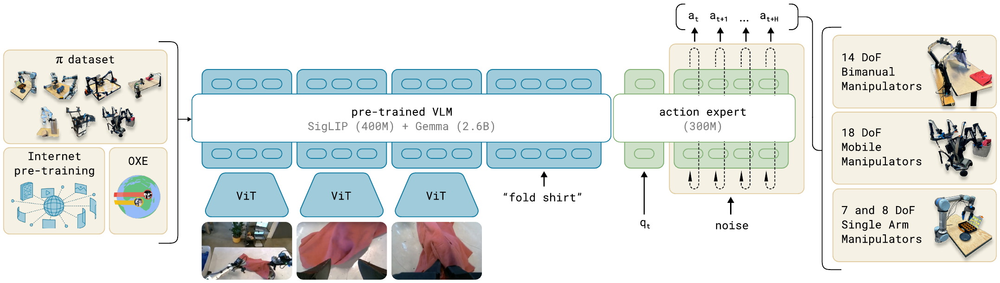

**Original caption:** Fig. 3: Overview of our framework. We start with a pre-training mixture, which consists of both our own dexterous manipulation datasets and open-source data. We use this mixture to train our flow matching VLA model, which consists of a larger VLM backbone and a smaller action expert for processing robot states and actions. The VLM backbone weights are initialized from PaliGemma [5], providing representations learned from large-scale Internet pre-training. The resulting π0 model can be used to control multiple robot embodiments with differing action spaces to accomplish a wide variety of tasks.

**中文图注:** 图 3：我们的框架概览。我们首先构建一个预训练混合数据，它同时包含我们自有的灵巧操作数据集与开源数据。我们用它训练流匹配 VLA 模型，该模型由一个较大的 VLM 主干与一个较小的 action expert 组成，后者用于处理机器人状态与动作。VLM 主干的权重由 PaliGemma [5] 初始化，从而带来大规模互联网预训练学到的表示。由此得到的 π0 模型可以控制具有不同动作空间的多种机器人本体，完成各种各样的任务。

**Reading note:** 图中给出完整训练与使用流程：先组装预训练混合数据（自有灵巧操作数据 + 开源 OXE 等），用它训练由 VLM 主干与 action expert 组成的 flow matching VLA，VLM 权重由 PaliGemma 初始化；得到的 π0 可控制多种具有不同动作空间的机器人本体。

**Source:** p.4 S031

**Original:** Our model, which we describe in Section IV, is based on the PaliGemma vision-language model [5], which we then further train with our data mixture. To turn the base PaliGemma VLM into π0, we add action outputs that use flow matching [32, 28] to generate continuous action distributions. We describe this design in detail in the following section. Note that we use PaliGemma for convenience and because of its comparatively small size (which is useful for real-time control), but our framework is compatible with any base pre-trained VLM.

**中文:** 我们的模型（详见第 IV 节）基于 PaliGemma 视觉-语言模型 [5]，并进一步用我们的数据混合进行训练。为了把基础 PaliGemma VLM 变成 π0，我们加入了使用流匹配 [32, 28] 生成连续动作分布的动作输出。我们将在下一节详细介绍这一设计。注意，我们使用 PaliGemma 是出于便利性及其相对较小的规模（这对实时控制很有用），但我们的框架与任何预训练基础 VLM 都兼容。

**Source:** p.4 S032

**Original:** IV. THE π0 MODEL

**中文:** IV. π0 模型（THE π0 MODEL）

**Source:** p.4 S033

**Original:** The π0 model, illustrated in Figure 3, consists primarily of a language model transformer backbone. Following the standard late fusion VLM recipe [3, 11, 30], image encoders embed the robot’s image observations into the same embedding space as language tokens. We further augment this backbone with robotics-specific inputs and outputs — namely, proprioceptive state and robot actions. π0 uses conditional flow matching [28, 32] to model the continuous distribution of actions. Flow matching provides our model with high precision and multimodal modeling capability, making it especially well suited to high-frequency dexterous tasks. Our architecture is inspired by Transfusion [59], which trains a single transformer using multiple objectives, with tokens1 corresponding to continuous outputs supervised via a flow matching loss and tokens corresponding to discrete outputs supervised via a cross-entropy loss. Building on Transfusion, we additionally found that using a separate set of weights for the robotics-specific (action and state) tokens led to an improvement in performance. This design is analogous to a mixture of experts [45, 25, 12, 16] with two mixture elements, where the first element is used for image and text inputs, and

**中文:** π0 模型如图 3 所示，主要由一个语言模型 Transformer 主干构成。遵循标准的晚期融合（late fusion）VLM 方案 [3, 11, 30]，图像编码器把机器人的图像观测嵌入到与语言 token 相同的嵌入空间中。我们进一步为这一主干加入机器人特有的输入与输出——即本体感受状态与机器人动作。π0 使用条件流匹配 [28, 32] 对动作的连续分布建模。**流匹配为模型提供了高精度与多模态建模能力，使其特别适合高频灵巧任务。**我们的架构受到 Transfusion [59] 的启发：后者用多个目标训练单个 Transformer，其中对应连续输出的 token（脚注 1）由流匹配损失监督，对应离散输出的 token 由交叉熵损失监督。在 Transfusion 基础上，我们还发现为机器人特有的（动作与状态）token 使用单独的一组权重可以提升性能。该设计类似于具有两个专家元素的混合专家（mixture of experts）[45, 25, 12, 16]：第一个专家用于图像与文本输入，第二个专家用于机器人特有的输入与输出。

**Source:** p.4 S034

**Original:** 1In this paper, we use the word “token” to refer to an input/output slot along the sequence dimension, whether the slot corresponds to a discrete variable (e.g., a language token) or a continuous variable (e.g., an image patch or a robot action).

**中文:** 脚注 1：在本文中，我们用“token”一词指代序列维度上的一个输入/输出槽位，无论该槽位对应的是离散变量（例如语言 token）还是连续变量（例如图像 patch 或机器人动作）。

---

## p.5 π0 的流匹配建模与训练数据总览（Fig. 4）

**Source:** p.5 S035

**Original:** the second is used for robotics-specific inputs and outputs. We refer to the second set of weights as the action expert.

**中文:** 我们把这第二组权重称为 action expert（动作专家）。

**Source:** p.5 S036

**Original:** Formally, we want to model the data distribution p(At |ot ), where At = [at , at+1 , ..., at+H−1 ] corresponds to an action chunk of future actions (we use H = 50 for our tasks), and ot is an observation. The observation consists of multiple RGB images, a language command, and the robot’s proprioceptive state, such that ot = [I1, ..., In, ℓt , qt ], where Ii is ith image t

**中文:** 形式化地，我们希望建模数据分布 $p(A_t|o_t)$，其中 $A_t = [a_t, a_{t+1}, ..., a_{t+H−1}]$ 对应未来动作构成的“动作块（action chunk）”（在我们的任务中 H = 50），$o_t$ 是一个观测。观测由多张 RGB 图像、一条语言指令以及机器人的本体感受状态组成，即 $o_t = [I^1_t, ..., I^n_t, ℓ_t, q_t]$，其中 $I^i_t$ 是第 i 张图像（每台机器人 2 或 3 张图像），$ℓ_t$ 是语言 token 序列，$q_t$ 是关节角向量。图像 $I^i_t$ 与状态 $q_t$ 先经由相应的编码器编码，再通过一个线性投影层投影到与语言 token 相同的嵌入空间中。

**Source:** p.5 S039

**Original:** For each action at′ in the action chunk At , we have a corresponding action token that we feed through the action expert. During training, we supervise these action tokens using a conditional flow matching loss [28, 32],

**中文:** 对于动作块 A_t 中的每个动作 a_t′，我们都有一个对应的 action token（动作 token），并将其输入 action expert。训练时，我们用条件流匹配损失 [28, 32] 监督这些动作 token：

**Source:** p.5 S040

**Original:** Lτ (θ) = Ep(A |o ),q(Aτ |A ) ||vθ (Aτt , ot ) − u(Aτt |At )||2, t t

**中文:** L_τ(θ) = E_{p(A_t|o_t), q(A^τ_t|A_t)} ‖ v_θ(A^τ_t, o_t) − u(A^τ_t|A_t) ‖²，

**Source:** p.5 S042

**Original:** where subscripts denote robot timesteps and superscripts denote flow matching timesteps, with τ ∈ [0, 1]. Recent work in high-resolution image [14] and video [38] synthesis has shown that flow matching can achieve strong empirical performance when combined with a simple linear-Gaussian (or optimal transport) probability path [28], given by q(A^τ_t|A_t) = N(τA_t, (1−τ)I). In practice, the network is trained by sampling random noise ϵ ~ N(0, I), computing the “noisy actions” A^τ_t = τA_t + (1−τ)ϵ, and then training the network outputs v_θ(A^τ_t, o_t) to match the denoising vector field u(A^τ_t|A_t) = A_t − ϵ. The action expert uses a full bidirectional attention mask, so that all action tokens attend to each other. During training, we sample the flow matching timestep τ from a beta distribution that emphasizes lower (noisier) timesteps. See Appendix B for more details.

**中文:** 其中下标表示机器人的时间步，上标表示流匹配时间步，τ ∈ [0, 1]。近期在高分辨率图像 [14] 与视频 [38] 合成领域的工作表明，当流匹配与简单的线性-高斯（或最优传输）概率路径 [28] 结合时能够取得很强的实证性能，该路径由 q(A^τ_t|A_t) = N(τA_t, (1−τ)I) 给出。实践中，网络的训练方式是：采样随机噪声 ϵ ~ N(0, I)，计算“带噪动作” A^τ_t = τA_t + (1−τ)ϵ，然后训练网络输出来匹配去噪向量场 u(A^τ_t|A_t) = A_t − ϵ。action expert 使用完全双向的注意力掩码，因此所有动作 token 之间可以相互注意。训练时，流匹配时间步 τ 从一个强调较小（噪声更大）时间步的 beta 分布中采样。更多细节见附录 B。

**Source:** p.5 S047

**Original:** At inference time, we generate actions by integrating the learned vector field from τ = 0 to τ = 1, starting with random noise A^0_t ~ N(0, I). We use the forward Euler integration rule:

**中文:** 在推理时，我们从 τ = 0 到 τ = 1 对学到的向量场进行积分来生成动作，初始值为随机噪声 A^0_t ~ N(0, I)。我们使用前向欧拉积分规则：

**Source:** p.5 S049

**Original:** Aτ+δ = Aτ + δvθ (Aτ , ot ),

**中文:** A^{τ+δ}_t = A^τ_t + δ v_θ(A^τ_t, o_t)，

**Source:** p.5 S050

**Original:** where δ is the integration step size. We use 10 integration steps (corresponding to δ = 0.1) in our experiments. Note that inference can be implemented efficiently by caching the attention keys and values for the prefix ot and only recomputing the suffix corresponding to the action tokens for each integration step. We provide more details regarding the inference procedure, including the inference time for each part of the model, in Appendix D.

**中文:** 其中 δ 是积分步长。在实验中我们使用 10 步积分（对应 δ = 0.1）。注意，推理可以高效实现：缓存前缀 o_t 的注意力键与值，而在每个积分步中只重新计算与动作 token 对应的后缀部分。关于推理流程（包括模型各部分的推理耗时）的更多细节见附录 D。

**Source:** p.5 S051

**Original:** While in principle our model can be initialized from scratch or fine-tuned from any VLM backbone, in practice we use PaliGemma [5] as our base model. PaliGemma is an open-source 3 billion parameter VLM that offers a convenient trade-off between size and performance. We add 300M parameters for the action expert (which is initialized from scratch) for a total of 3.3 billion parameters. We provide a full description of the model architecture in Appendix B.

**中文:** 虽然原则上我们的模型可以从零初始化，也可以从任意 VLM 主干微调，但**实践中我们使用 PaliGemma [5] 作为基础模型。PaliGemma 是一个开源、30 亿参数的 VLM，在规模与性能之间提供了便利的折中**。我们为 action expert 增加了 300M 参数（该部分从零初始化），总计 33 亿参数。模型架构的完整描述见附录 B。

**Source:** p.5 S052

**Original:** Non-VLM baseline model. In addition to our main VLA model, we also trained a similar baseline model that did not use a VLM initialization for ablation experiments. This model, which we refer to as π0-small, has 470M parameters, does not use VLM initialization, and has a number of small differences that we found to be helpful for training on our data without VLM initialization, which are summarized in Appendix C. This model is used in our comparisons to evaluate the benefits of incorporating VLM pertaining.

**中文:** 非 VLM 基线模型。除了主要的 VLA 模型之外，**为了消融实验，我们还训练了一个不使用 VLM 初始化的类似基线模型。该模型称为 π0-small，具有 470M 参数，不使用 VLM 初始化，并有若干在我们数据上不使用 VLM 初始化时有利于训练的小改动**，这些改动总结于附录 C。该模型用于对比，以评估引入 VLM 预训练带来的收益（原文此处写作 pertaining，应为 pre-training 之误）。

**Source:** p.5 S053

**Original:** V. DATA COLLECTION AND TRAINING RECIPE

**中文:** V. 数据采集与训练配方（DATA COLLECTION AND TRAINING RECIPE）

**Source:** p.5 S054

**Original:** Broadly capable robot foundation models require not only an expressive and powerful architecture, but also the right dataset and, more importantly, the right training recipe. In the same way that LLM training is typically divided into pre-training and post-training phases, we employ a multi-stage training procedure for our model. The goal of the pre-training phase is to expose the model to a diverse range of tasks so that it can acquire broadly applicable and general physical capabilities, while the goal of the post-training phase is to provide the model with the ability to skillfully and fluently execute the desired downstream task. Because of this, the requirements for the pre-training and post-training datasets are distinct: the pre-training dataset should cover as many tasks as possible, and within each of those tasks should cover a diversity of behaviors. The post-training dataset should instead cover behaviors that are conducive to effective task execution, which should exhibit a consistent and fluent strategy. Intuitively, the diverse (but lower quality) pre-training data allows the model to recover from mistakes and handle highly varied situations, which might not otherwise occur in the high-quality post-training data, while the post-training data teaches the model to perform the task well.

**中文:** 广泛通用的机器人基础模型不仅需要表达能力强、性能强大的架构，还需要合适的数据集，更重要的是正确的训练配方。正如大语言模型的训练通常分为预训练与后训练两个阶段，我们对模型也采用多阶段训练流程。预训练阶段的目标是让模型接触多样化的任务，从而获得广泛适用且通用的物理能力；后训练阶段的目标则是让模型具备熟练、流畅地执行目标下游任务的能力。因此，预训练与后训练数据集的要求是不同的：**预训练数据集应尽可能覆盖更多任务，并且在每个任务内部覆盖多样的行为；后训练数据集则应覆盖有利于有效执行任务的行为，这些行为应体现一致而流畅的策略。直观地说，多样化但质量较低的预训练数据使模型能够从错误中恢复并应对高度多变的情形，而这些情形在高质量后训练数据中通常不会出现；后训练数据则教会模型把任务做好。**

**Source:** p.5 S055

**Original:** A. Pre-training and post-training

**中文:** A. 预训练与后训练

**Source:** p.5 C004

**Original:** Fig. 4: Overview of our dataset: The pre-training mixture consists of a subset of OXE [10] and the π dataset. We use a subset of OXE, which we refer to as OXE Magic Soup [24]. The right figure illustrates the weight of the different datasets in the pre-training mixture. The left figure illustrates their relative sizes as measured by the number of steps.

**中文:** 图 4：数据集概览。预训练混合由 OXE [10] 的一个子集与 π 数据集构成。我们使用的 OXE 子集被称为 OXE Magic Soup [24]。右图给出不同数据集在预训练混合中的权重；左图给出它们以步数计量的相对规模。

**Source:** p.5 S056

**Original:** We provide an overview of our pre-training mixture in Figure 4. Since each training example corresponds to a timestep — i.e., a tuple (ot , At ), — we will quantify data in terms of timesteps in this discussion. 9.1% of the training mixture consists of open-source datasets, including OXE [10], Bridge v2 [52], and DROID [23]. The robots and tasks in these datasets typically have one or two cameras and use low-frequency control, between 2 and 10 Hz. However, these datasets cover a wide range of objects and environments. To learn dexterous and more complex tasks, we also use 903M timesteps of data from our own datasets, where 106M steps are from single-arm robots and 797M are from dual-arm robots. This data has 68 tasks, where each task is composed of complex behaviors — e.g., the “bussing” task involves putting a wide range of different dishes, cups, and utensils into a bussing bin, and a wide array of trash items into the garbage. Note that this definition of task is significantly different from prior work, which typically uses any combination of noun and verb (e.g., “pick up the cup” vs. “pick up the plate”) to constitute a distinct task. Therefore, the actual range of behaviors in our dataset is significantly broader than this number of “tasks” would imply. We discuss the specific robots and tasks in our dataset in more detail in Section V-C.

**中文:** 我们在图 4 中给出了预训练混合数据的概览。由于每个训练样本对应一个时间步——即一个元组 (o_t, A_t)——本节的讨论将以时间步为单位量化数据。训练混合中有 9.1% 来自开源数据集，包括 OXE [10]、Bridge v2 [52] 与 DROID [23]。这些数据集中的机器人与任务通常只有一到两个相机，并采用低频控制（2 至 10 Hz 之间），但它们覆盖了范围广泛的对象与环境。为了学习灵巧且更复杂的任务，我们还使用了来自自有数据集的 903M 时间步数据，其中 106M 步来自单臂机器人，797M 步来自双臂机器人。这些数据包含 68 个任务，每个任务都由复杂行为构成——例如“bussing（收拾餐桌）”任务需要把各种各样的餐盘、杯子和餐具放进回收箱，并把各种垃圾放进垃圾桶。注意，本文对“任务”的定义与既有工作显著不同：此前工作通常把任意名词与动词的组合（例如“拿起杯子”与“拿起盘子”）视为不同任务。因此，我们数据集中实际行为的范围远大于“任务数”所暗示的规模。我们将在第 V-C 节更详细地讨论数据集中的具体机器人与任务。

### Fig. 4. 预训练数据构成：OXE 子集与自有 π 数据集

**Placed near:** p.5 S056
**Source:** p.5 C004

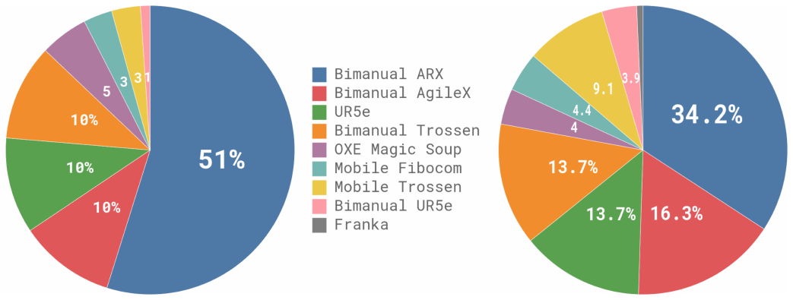

**Original caption:** Fig. 4: Overview of our dataset: The pre-training mixture consists of a subset of OXE [10] and the π dataset. We use a subset of OXE, which we refer to as OXE Magic Soup [24]. The right figure illustrates the weight of the different datasets in the pre-training mixture. The left figure illustrates their relative sizes as measured by the number of steps.

**中文图注:** 图 4：数据集概览。预训练混合由 OXE [10] 的一个子集与 π 数据集构成。我们使用的 OXE 子集被称为 OXE Magic Soup [24]。右图给出不同数据集在预训练混合中的权重；左图给出它们以步数计量的相对规模。

**Reading note:** 左图按时间步数量给出各数据集的相对规模，右图给出各数据集在预训练混合中的权重。可以看出自有灵巧操作数据（903M 时间步）远大于开源部分（9.1%），而 OXE 以“OXE Magic Soup”子集形式使用。

---

## p.6 预训练数据、机器人平台（Fig. 5）与实验设计

**Source:** p.6 S057

**Original:** Since the datasets are somewhat imbalanced in size (e.g., the more difficult laundry folding tasks are overrepresented), we weight each task-robot combination by n^0.43, where n is the number of samples for that combination, such that over-represented combinations are down-weighted. The configuration vector qt and action vectors at always have the dimensionality of the largest robot in the dataset (18 in our case, to accommodate two 6-DoF arms, 2 grippers, a mobile base, and a vertically actuated torso). For robots with lower-dimensional configuration and action spaces, we zero-pad the configuration and action vectors. For robots with fewer than three images, we also mask out the missing image slots.

**中文:** 由于各数据集的规模并不均衡（例如较难的叠衣服任务被过度代表），我们把每个“任务-机器人”组合按其样本数 n 的 n^0.43 进行加权，从而降低被过度代表的组合的权重。构型向量 q_t 与动作向量 a_t 始终采用数据集中最大机器人的维度（在我们的场景中为 18 维，以容纳两条 6 自由度手臂、两个夹爪、一个移动底盘与一个可竖直升降的躯干）。对于构型与动作空间维度更低的机器人，我们对构型与动作向量补零；对于图像少于三张的机器人，我们同样把缺失的图像槽位掩蔽（mask）掉。

**Source:** p.6 S058

**Original:** In the post-training phase, we fine-tune our model with a smaller task-specific dataset to specialize it to particular downstream applications. As mentioned previously, our definition of “task” is fairly broad — e.g., the “bussing” task requires manipulating a wide range of different objects. Different tasks require very different datasets, with the simplest of the tasks necessitating only 5 hours and the most complex tasks using 100 or more hours of data.

**中文:** 在后训练阶段，我们用较小的任务特定数据集微调模型，使其专精于特定的下游应用。如前所述，我们对“任务”的定义相当宽泛——例如“bussing（收拾餐桌）”任务需要操作范围广泛的不同物体。不同任务所需的数据集差别很大：最简单的任务只需要 5 小时数据，而最复杂的任务需要 100 小时或更多。

**Source:** p.6 S059

**Original:** B. Language and high-level policies

**中文:** B. 语言与高层策略

**Source:** p.6 S060

**Original:** More complex tasks that require semantic reasoning and high-level strategy, such as table bussing, can also benefit from a high-level policy that decomposes high-level tasks (such as “bus the table”) into more immediate subtasks (such as “pick up the napkin” or “throw the napkin into the trash”). Since our model is trained to process language inputs, we can use a high-level VLM to make these semantic inferences, a method that is analogous to LLM/VLM planning methods such as SayCan [2]. We use such a high-level policy to assist our model with high-level strategy for several of our experimental tasks, as we will discuss in Section VI.

**中文:** 需要语义推理与高层策略的更复杂任务（例如收拾餐桌）还可以受益于一个高层策略：它把高层任务（例如“把桌子收拾干净”）分解为更直接可执行的子任务（例如“拿起餐巾”或“把餐巾扔进垃圾桶”）。由于我们的模型被训练为处理语言输入，我们可以用一个高层 VLM 来完成这些语义推断，这一方法与 SayCan [2] 等 LLM/VLM 规划方法类似。我们在若干实验任务中使用这样的高层策略来辅助模型的高层决策，第 VI 节将对此讨论。

**Source:** p.6 S061

**Original:** C. Robot system details

**中文:** C. 机器人系统细节

**Source:** p.6 S062

**Original:** Our dexterous manipulation datasets include 7 different robot configurations and 68 tasks. We summarize these platforms in Figure 5, and discuss them below:

**中文:** 我们的灵巧操作数据集覆盖 7 种不同的机器人配置与 68 个任务。我们在图 5 中总结了这些平台，并在下文逐一讨论：

### Fig. 5. 实验使用的 7 种机器人平台

**Placed near:** p.6 S062
**Source:** p.6 C005

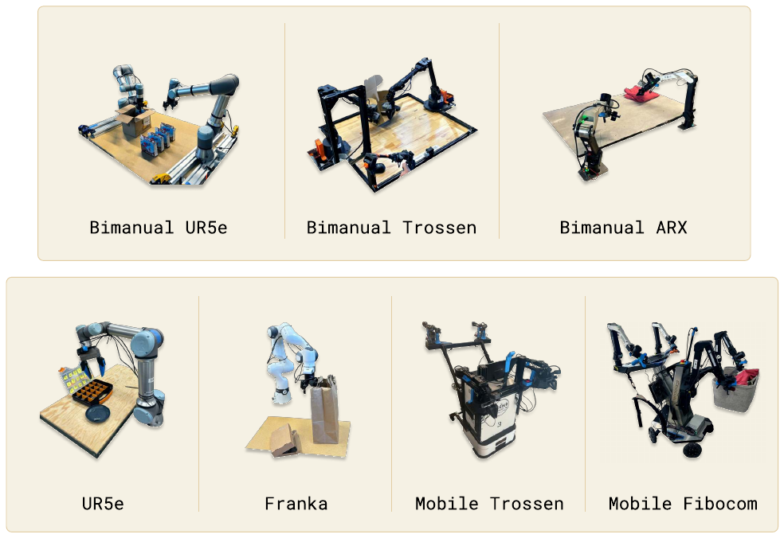

**Original caption:** Fig. 5: The robots used in our experiments. These include single and dual-arm manipulators with 6-DoF and 7-DoF arms, as well as holonomic and nonholonomic mobile manipulators. π0 is trained jointly on all of these platforms.

**中文图注:** 图 5：实验使用的机器人。包括 6 自由度和 7 自由度的单臂与双臂机械臂，以及全向与非全向移动机械臂。π0 在所有这些平台上联合训练。

**Reading note:** 图中给出 6/7 自由度单臂与双臂机械臂，以及全向/非全向移动机械臂的照片；π0 在这些平台上联合训练，配置与动作向量按最大本体（18 维，含双臂、双夹爪、移动底盘与升降躯干）补零对齐。

**Source:** p.6 C005

**Original:** Fig. 5: The robots used in our experiments. These include single and dual-arm manipulators with 6-DoF and 7-DoF arms, as well as holonomic and nonholonomic mobile manipulators. π0 is trained jointly on all of these platforms.

**中文:** 图 5：实验使用的机器人。包括 6 自由度和 7 自由度的单臂与双臂机械臂，以及全向与非全向移动机械臂。π0 在所有这些平台上联合训练。

**Source:** p.6 S063

**Original:** UR5e. An arm with a parallel jaw gripper, with a wrist-mounted and over-the-shoulder camera, for a total of two camera images and a 7-dimensional configuration and action space.

**中文:** UR5e。配有一把平行夹爪，并装有腕部相机与越肩视角相机，总计两路相机图像，以及 7 维的构型与动作空间。

**Source:** p.6 S064

**Original:** Bimanual UR5e. Two UR5e setups, for a total of three camera images and a 14-dimensional configuration and action space. Franka. The Franka setup has two cameras and an 8-dimensional configuration and action space.

**中文:** 双臂 UR5e。两套 UR5e 装置，总计三路相机图像与 14 维构型与动作空间。Franka。Franka 装置配有两个相机与 8 维构型与动作空间。

**Source:** p.6 S065

**Original:** Bimanual Trossen. This setup has two 6-DoF Trossen ViperX arms in a configuration based on the ALOHA setup [4, 57], with two wrist cameras and a base camera, and a 14-dimensional configuration and action space.

**中文:** 双臂 Trossen。该装置采用两条 6 自由度 Trossen ViperX 手臂，配置基于 ALOHA 方案 [4, 57]，配有两个腕部相机与一个基座相机，以及 14 维构型与动作空间。

**Source:** p.6 S066

**Original:** Bimanual ARX & bimanual AgileX. This setup uses two 6-DoF arms, and supports either ARX or AgileX arms, with three cameras (two wrist and one base) and a 14-dimensional configuration and action space. This class encompasses two distinct platforms, but we categorize them together because of their similar kinematic properties.

**中文:** 双臂 ARX 与双臂 AgileX。该装置使用两条 6 自由度手臂，可搭载 ARX 或 AgileX 手臂，配有三个相机（两个腕部相机与一个基座相机）与 14 维构型与动作空间。该类包含两种不同的平台，但因其运动学性质相似，我们把它们归为一类。

**Source:** p.6 S067

**Original:** Mobile Trossen & mobile ARX. This setup is based on the Mobile ALOHA [57] platform, with two 6-DoF arms on a mobile base, which are either ARX arms or Trossen ViperX arms. The nonholonomic base adds two action dimensions, for a 14-dimensional configuration and 16-dimensional action space. There are two wrist cameras and a base camera. This class encompasses two distinct platforms, but we categorize them together because of their similar kinematic properties. Mobile Fibocom. Two 6-DoF ARX arms on a holonomic base. The base adds three action dimensions (two for translation and one for orientation), for a 14-dimensional configuration and 17-dimensional action space.

**中文:** 移动 Trossen 与移动 ARX。该装置基于 Mobile ALOHA [57] 平台，在移动底盘上装有两条 6 自由度手臂，手臂为 ARX 或 Trossen ViperX。非完整约束（nonholonomic）底盘增加两个动作维度，因此其构型为 14 维、动作空间为 16 维。装置配有两个腕部相机与一个基座相机。该类同样包含两种不同平台，但运动学性质相似，故归为一类。移动 Fibocom。全向底盘上加装两条 6 自由度 ARX 手臂。底盘增加三个动作维度（两个平移、一个朝向），因此构型为 14 维、动作空间为 17 维。

**Source:** p.6 S068

**Original:** We summarize the proportion of our dataset from each robot in Figure 4.

**中文:** 我们在图 4 中总结了数据集中各机器人所占的比例。

**Source:** p.6 S069

**Original:** VI. EXPERIMENTAL EVALUATION

**中文:** VI. 实验评估（EXPERIMENTAL EVALUATION）

**Source:** p.6 S070

**Original:** Our experimental evaluation consists of out-of-box evaluation experiments that compare our base (pre-trained) model to alternative model designs with direct prompting, as well as detailed fine-tuning experiments that evaluate our model on challenging downstream tasks, comparing it to other methods that have been proposed for dexterous manipulation. We study the following research questions:

**中文:** 我们的实验评估由两部分构成：<mark>**一是开箱（out-of-box）评估实验，把基础（预训练）模型与其他直接提示的模型设计进行对比；二是细致的微调实验，在具有挑战性的下游任务上评估模型，并与为灵巧操作提出的其他方法进行比较。**</mark>我们研究以下几个研究问题：

---

## p.7 Fig. 6 · 开箱评测任务与基线

**Source:** p.7 C006

**Original:** Fig. 6: Out-of-box evaluation tasks: To evaluate our base model, we run it after pre-training on five tasks: shirt folding, bussing easy, bussing hard, grocery bagging, and toast out of toaster. The tasks require a combination of dexterous manipulation, multi-stage behaviors, and semantic recognition.

**中文:** 图 6：开箱评测任务。为了评估基础模型，我们在预训练后直接让它在五个任务上运行：叠衬衫、简单收拾餐桌、困难收拾餐桌、装袋杂货，以及从烤面包机取出吐司。这些任务同时要求灵巧操作、多阶段行为与语义识别的组合能力。

**Source:** p.7 S072

**Original:** How well does π0 perform after pre-training on a variety of tasks that are present in the pre-training data? We study this question by directly evaluating π0, with comparisons to other robot foundation models.

**中文:** 在预训练数据中存在的一批任务上，π0 的预训练后表现如何？我们通过在多个任务上直接评估 π0，并与其他机器人基础模型比较来研究该问题。

**Source:** p.7 S073

**Original:** How well does π0 follow language commands? These experiments compare π0 to π0-small, a smaller version of our model without VLM initialization, to evaluate its performance on following language commands. We evaluate with both human-provided commands and commands specified by a high-level VLM policy, as discussed in Section V-B.

**中文:** π0 跟随语言指令的能力如何？这些实验把 π0 与 π0-small（不使用 VLM 初始化的较小版本）进行比较，以评估其跟随语言指令的表现。我们同时评估人类给出的指令与高层 VLM 策略指定的指令，如第 V-B 节所述。

**Source:** p.7 S074

**Original:** How does π0 compare to methods that have been proposed specifically for addressing dexterous manipulation tasks? These experiments study downstream tasks for which we can either fine-tune our model from the pre-trained initialization, or train it from scratch on task-specific data, comparing to prior methods that were proposed for dexterous manipulation. We aim to evaluate both the benefits of our architecture and our pre-training procedure.

**中文:** π0 与那些专门针对灵巧操作任务提出的方法相比如何？这些实验研究下游任务：我们既可以从前预训练初始化出发微调模型，也可以在任务特定数据上从零训练，并与此前为灵巧操作提出的方法比较。我们旨在同时评估架构与预训练流程各自的收益。

**Source:** p.7 S075

**Original:** Can π0 be adapted to complex, multi-stage tasks? In our final set of experiments, we fine-tune π0 to a set of particularly complex tasks, including folding laundry and bussing a table. These tasks take between 5 and 20 minutes to complete. Some require guidance from a high-level policy.

**中文:** π0 能否适配复杂、多阶段的任务？在最后一组实验中，我们把 π0 微调到一组特别复杂的任务上，包括折叠衣物与收拾餐桌。这些任务需要 5 至 20 分钟才能完成，其中一些需要高层策略的引导。

**Source:** p.7 S076

**Original:** A. Evaluating the base model

**中文:** A. 评估基础模型

**Source:** p.7 S077

**Original:** In our first set of experiments, we evaluate the model after pre-training on our full mixture, without any post-training, to evaluate how well our base model can perform a variety of tasks. We compare to other robot foundation models in the literature: both VLAs and smaller models that are trained from scratch on the same pre-training mixture. We evaluate on the following tasks, visualized in Figure 6, with each task commanded to the same base model via a language command. Shirt folding: the robot must fold a t-shirt, which starts flattened.

**中文:** 在第一组实验中，我们在完整混合数据上预训练后、不做任何后训练，直接评估模型完成多种任务的能力。我们与文献中的其他机器人基础模型比较：既包括 VLA，也包括在同一预训练混合上从零训练的较小模型。我们在以下任务上评估（任务见图 6），每个任务都通过语言指令发送给同一个基础模型。叠衬衫：机器人必须折叠一件平放的 T 恤。

### Fig. 6. 开箱评测的 5 个任务

**Placed near:** p.7 S077
**Source:** p.7 C006

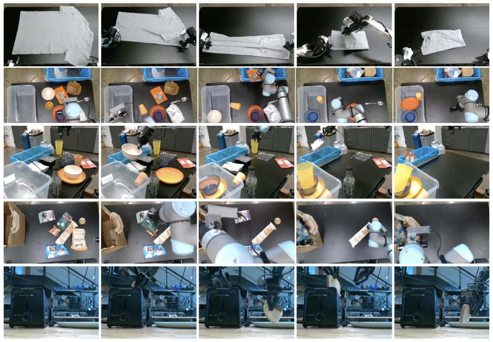

**Original caption:** Fig. 6: Out-of-box evaluation tasks: To evaluate our base model, we run it after pre-training on five tasks: shirt folding, bussing easy, bussing hard, grocery bagging, and toast out of toaster. The tasks require a combination of dexterous manipulation, multi-stage behaviors, and semantic recognition.

**中文图注:** 图 6：开箱评测任务。为了评估基础模型，我们在预训练后直接让它在五个任务上运行：叠衬衫、简单收拾餐桌、困难收拾餐桌、装袋杂货，以及从烤面包机取出吐司。这些任务同时要求灵巧操作、多阶段行为与语义识别的组合能力。

**Reading note:** 五个任务自左至右为：叠衬衫（Bi-ARX）、简单收拾餐桌（UR5e）、困难收拾餐桌（UR5e）、装袋杂货（UR5e）、从烤面包机取吐司（Bi-Trossen）；它们同时考察灵巧操作、多阶段行为与语义识别。

**Source:** p.7 S078

**Original:** Bussing easy: the robot must clean a table, putting trash in the trash bin and dishes into the dish bin. The score indicates the number of objects that were placed in the correct receptacle. Bussing hard: a harder version of the bussing task, with more objects and more challenging configurations, such as utensils intentionally placed on top of trash objects, objects obstructing each other, and some objects that are not in the pre-training dataset.

**中文:** 简单收拾餐桌：机器人必须清理桌子，把垃圾放进垃圾桶、把餐具放进餐具箱。得分表示被放入正确容器的物体数量。困难收拾餐桌：收拾餐桌任务的更难版本，物体更多且构型更具挑战，例如餐具被故意放在垃圾上方、物体互相遮挡，以及一些不在预训练数据集中的物体。

**Source:** p.7 S079

**Original:** Grocery bagging: the robot must bag all grocery items, such as potato chips, marshmallows, and cat food.

**中文:** 装袋杂货：机器人必须把所有杂货物品装袋，例如薯片、棉花糖与猫粮。

**Source:** p.7 S080

**Original:** Toast out of toaster: the robot removes toast from a toaster.

**中文:** 从烤面包机取出吐司：机器人把吐司从烤面包机中取出。

**Source:** p.7 S081

**Original:** Providing comparisons for these experiments is challenging because very few prior models can operate at this scale. We compare to OpenVLA [24], a 7B parameter VLA model that was originally trained on the OXE dataset [10]. We train OpenVLA on our full mixture. This is a very difficult mixture for OpenVLA, which does not support action chunking or high-frequency control. We also compare to Octo [50], a smaller 93M parameter model. While Octo is not a VLA, it does use a diffusion process to generate actions, providing a valuable point of comparison for our flow matching VLA. We also train Octo on the same mixture as our model. Due to time constraints, we were unable to train OpenVLA and Octo for the same number of epochs as our full model. We therefore also compare to a “compute parity” version of our model, which is trained for only 160k steps (as opposed to 700k steps for our main model), which is equal to or lower than the number of steps provided to the baselines (160k for OpenVLA, 320k for Octo). We also include a version of the OpenVLA model that we fine-tuned only on the UR5e data, without cross-embodiment training, in the hopes of providing an even stronger baseline on the UR5e tasks. Finally, we include a comparison to the π0-small model described in Section IV, which can be viewed as a scaled-down version of our model without VLM pre-training.

**中文:** 为这些实验提供对比并不容易，因为很少有此前模型能够在这一规模上运行。我们与 OpenVLA [24] 比较：这是一个 7B 参数的 VLA 模型，最初在 OXE 数据集上训练 [10]；我们在完整混合数据上训练 OpenVLA。对 OpenVLA 而言这是非常困难的混合数据，因为它不支持动作分块与高频控制。我们还与 Octo [50] 比较：这是一个更小的 93M 参数模型。Octo 虽然不是 VLA，但它确实使用扩散过程生成动作，为我们的流匹配 VLA 提供了有价值的参照。我们也在与自身模型相同的混合数据上训练 Octo。受时间限制，我们无法让 OpenVLA 与 Octo 训练与我们完整模型相同的轮数，因此我们还与模型的“算力对等（compute parity）”版本比较：该版本只训练 160k 步（我们的主模型为 700k 步），这一数量等于或低于提供给基线的步数（OpenVLA 为 160k，Octo 为 320k）。我们还纳入了一个仅在 UR5e 数据上微调、未做跨本体训练的 OpenVLA 版本，希望为 UR5e 任务提供更强的基线。最后，我们还与第 IV 节描述的 π0-small 模型比较，它可以被视为我们模型在去掉 VLM 预训练后的缩小版本。

**Source:** p.7 S082

**Original:** The evaluation metric uses a normalized score averaged over 10 episodes per task and method, where an episode receives a score of 1.0 for a full success, and a fractional score for partial success. For example, the score for bussing is the fraction of objects that are correctly placed in the proper receptacle. We describe the scoring rubrics in Appendix E. The results, shown in Figure 7, show that π0 attains by far the best results across the board on all the out-of-box tasks, with near perfect success rates on shirt folding and the easier bussing tasks, and large improvements over all baselines. The “parity” version of π0, which is trained for only 160k steps, still outperforms all the baselines, and even π0-small outperforms OpenVLA and Octo. OpenVLA struggles on these tasks because its autoregressive discretization architecture does not support action chunks. The UR5e-only OpenVLA model performs better, but is still far below the performance of π0. Octo does support action chunks, but has a comparatively limited representational capacity. This comparison illustrates the importance of combining large, expressive architectures with the ability to model complex distributions via flow matching or diffusion. Additionally, the comparison to π0-small illustrates the importance of incorporating VLM pre-training. Unfortunately, it is hard to make this last comparison fair: π0-small uses fewer parameters, but larger models are difficult to use without pre-training. Overall, these experiments show that π0 provides a powerful pre-trained model with the ability to effectively perform a variety of tasks with a variety of robots, with much better performance than prior models.

**中文:** 评估指标为每个任务与方法在 10 个回合（episode）上平均的归一化得分：完全成功记 1.0 分，部分成功则按比例给分。例如，收拾餐桌任务的得分是正确放入对应容器的物体比例。评分细则见附录 E。结果如图 7 所示：π0 在所有开箱任务上都取得了明显最好的结果，在叠衬衫与较简单的收拾餐桌任务上接近完美的成功率，并相对所有基线有大幅提升。仅训练 160k 步的“对等”版本 π0 仍优于全部基线，甚至 π0-small 也优于 OpenVLA 与 Octo。**OpenVLA 在这些任务上表现不佳，是因为其自回归离散化架构不支持动作分块。**仅在 UR5e 上训练的 OpenVLA 表现更好，但仍远低于 π0。 **Octo 确实支持动作分块，但其表示能力相对有限。这一对比说明，把大规模、高表达能力的架构与通过流匹配或扩散建模复杂分布的能力结合起来非常重要。**此外，与 π0-small 的对比说明引入 VLM 预训练的重要性。遗憾的是，这一比较很难做到完全公平：π0-small 的参数更少，而大型模型若没有预训练则难以使用。总体而言，这些实验表明 π0 提供了一个强大的预训练模型，能够有效完成多种任务并适用于多种机器人，性能远优于此前模型。

### Fig. 7. 开箱评测结果：π0 全面优于基线

**Placed near:** p.7 S082
**Source:** p.8 C007

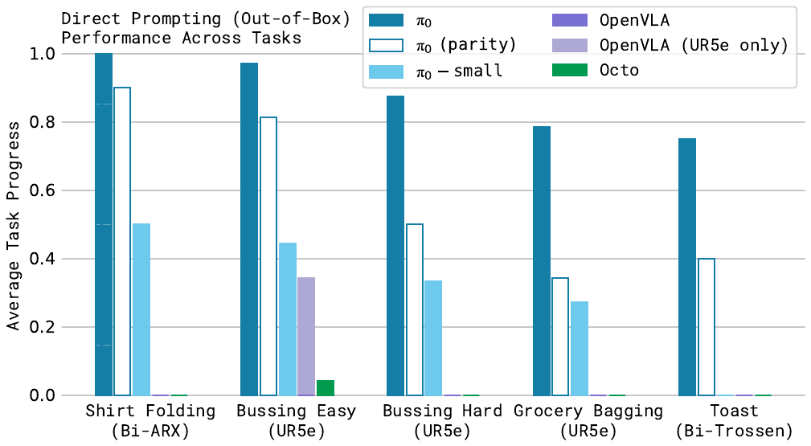

**Original caption:** Fig. 7: Out-of-box evaluation results: We evaluate π0 trained for the full 700k steps, a version trained for 160k steps that matches the number of updates for baseline models, π0-small, and three baselines: OpenVLA and Octo trained on all of our data, and OpenVLA trained only on the UR5e tasks (which we found to work better on UR5e tasks). Across all tasks and all comparisons, even the “parity” version of our model outperforms all baselines, and the full version of our model achieves the best results by a large margin.

**中文图注:** 图 7：开箱评测结果。我们评估训练满 700k 步的 π0、与基线更新次数相当的 160k 步版本、π0-small，以及三个基线：在我们全部数据上训练的 OpenVLA 与 Octo，以及仅在 UR5e 任务上训练的 OpenVLA（我们发现后者在 UR5e 任务上表现更好）。在所有任务与所有对比中，即使“算力对等”版本的模型也优于全部基线，而完整版本以较大幅度取得最好结果。

**Reading note:** 纵轴为平均任务进度（0–1）。对比对象包括完整训练 700k 步的 π0、只训练 160k 步的“算力对等”版本、π0-small，以及 OpenVLA、Octo 与仅在 UR5e 数据上微调的 OpenVLA。即使是对等版本也优于全部基线。

---

## p.8 Fig. 7 / Fig. 8 · 语言指令跟随与新任务学习

**Source:** p.8 C007

**Original:** Fig. 7: Out-of-box evaluation results: We evaluate π0 trained for the full 700k steps, a version trained for 160k steps that matches the number of updates for baseline models, π0-small, and three baselines: OpenVLA and Octo trained on all of our data, and OpenVLA trained only on the UR5e tasks (which we found to work better on UR5e tasks). Across all tasks and all comparisons, even the “parity” version of our model outperforms all baselines, and the full version of our model achieves the best results by a large margin.

**中文:** 图 7：开箱评测结果。我们评估训练满 700k 步的 π0、与基线更新次数相当的 160k 步版本、π0-small，以及三个基线：在我们全部数据上训练的 OpenVLA 与 Octo，以及仅在 UR5e 任务上训练的 OpenVLA（我们发现后者在 UR5e 任务上表现更好）。在所有任务与所有对比中，即使“算力对等”版本的模型也优于全部基线，而完整版本以较大幅度取得最好结果。

**Source:** p.8 S084

**Original:** B. Following language commands

**中文:** B. 跟随语言指令

**Source:** p.8 S085

**Original:** In the next set of experiments, we fine-tune the base π0 model to follow language commands in a set of evaluation domains. We compare this fine-tuned π0 model with the π0-small model described in Section IV, which we found to be the strongest baseline in the previous section. Recall that π0-small does not use a VLM initialization. This experiment therefore aims to measure how much VLM pre-training boosts our model’s ability to follow language instructions. Note that π0-small is also a significantly smaller model — unfortunately, it is difficult to remove this confounder, because VLM initialization serves both to make it practical to train a much larger model without overfitting, and to improve language instruction following. We nonetheless hope that this experiment sheds light on the language capabilities of π0. The language instructions for each task consist of objects to pick up and locations to place those objects, with language-labeled segments that are about 2 seconds in length. Each full

**中文:** 在下一组实验中，我们在一系列评估领域内微调基础 π0 模型以跟随语言指令，并把微调后的 π0 与第 IV 节描述的 π0-small 模型比较——后者是上一节中最强的基线。回顾一下，π0-small 不使用 VLM 初始化。因此本实验旨在衡量 VLM 预训练在多大程度上提升了模型跟随语言指令的能力。注意，π0-small 同时也是一个显著更小的模型——遗憾的是这一混淆因素很难消除，因为 VLM 初始化既使训练大得多的模型而不至于过拟合变得可行，也有助于提升语言指令跟随能力。尽管如此，我们希望这一实验能够揭示 π0 的语言能力。每个任务的语言指令由待抓取物体与放置位置构成，语言标注的片段约 2 秒长。每个完整

**Source:** p.8 C008

**Original:** Fig. 8: The tasks in our language evaluation. We evaluate our model on 3 different language-conditioned tasks, each of which requires following a sequence of intermediate language commands. The tasks involve bussing a table (top) to put dishes in a bin and garbage in a trash bin, setting a table (middle) by taking items out of a bin, and packing a shopping bag (bottom).

**中文:** 图 8：语言评测中的任务。我们在 3 个不同的语言条件任务上评估模型，每个任务都要求跟随一连串中间语言指令。这些任务包括收拾餐桌（上），把餐具放进箱中并把垃圾丢进垃圾桶；摆餐桌（中），从箱中取出物品进行摆放；以及装袋杂货（下）。

**Source:** p.8 S086

**Original:** task consists of numerous such segments. The tasks in this evaluation consist of: Bussing: the robot must clean a table, placing dishes and cutlery in a bin, and trash into a trash bin. Table setting: the robot must take out items from a bin to set a table, including a place mat, dishes, silverware, napkin, and cups, and adjust them according to language instructions. Grocery bagging: the robot must pack grocery items, such as bags of coffee beans, barley, marshmallow, seaweed, almonds, spaghetti, and cans into a bag.

**中文:** 任务由许多这样的片段组成。本评估中的任务包括：收拾餐桌：机器人必须清理桌子，把餐具与刀叉放进箱中，把垃圾放进垃圾桶。摆餐桌：机器人必须从箱中取出物品来布置餐桌，包括餐垫、餐盘、银器、餐巾与杯子，并根据语言指令进行调整。装袋杂货：机器人必须把杂货物品装袋，例如咖啡豆、大麦、棉花糖、海带、杏仁、意大利面以及罐头。

**Source:** p.8 S090

**Original:** In Figure 8, we show the language-conditioned tasks in our evaluation and present the evaluation results. We evaluate five different conditions. π0-flat (and π0-small-flat) corresponds to directly command the model with the task description (e.g., “bag the groceries”), without intermediate language commands. π0-human (and π0-small-human) provides intermediate step commands (e.g., which object to pick and where to place it) from an expert human user. These conditions evaluate each model’s ability to follow more detailed language commands: while these intermediate commands provide considerable information for how to perform the task, the model must be able to understand and follow those commands to benefit from them. Finally, π0-HL evaluates π0 with high-level commands provided by a high-level VLM, as discussed in Section V-B. This condition is also autonomous, without any human expert. The results in Figure 9, averaging over 10 trials per task, show that the language following accuracy of π0 is significantly better than that of π0-small. This suggests a significant improvement from the larger pre-trained VLM initialization. This capability translates to an improvement in performance with expert human guidance (π0-human) and with high-level model guidance (π0-HL). The results indicate that π0 ’s language following ability directly translates into better autonomous performance on complex tasks with high-level guidance.

**中文:** 在图 8 中，我们展示了评估中使用的语言条件任务并给出评估结果。我们评估五种条件。**π0-flat（以及 π0-small-flat）指直接用任务描述（例如“把杂货装袋”）命令模型，不提供中间语言指令。π0-human（以及 π0-small-human）提供来自人类专家的中间步骤指令（例如抓取哪个物体、放到哪里）。**这些条件评估模型跟随更详细语言指令的能力：虽然这些中间指令提供了大量关于如何完成任务的信息，但模型必须能够理解并跟随这些指令才能从中获益。最后，π0-HL 评估 π0 在高层 VLM 提供的高层指令下的表现，如第 V-B 节所述；该条件同样是自主的，不需要任何人类专家。图 9 的结果（每个任务平均 10 次试验）表明，π0 的语言跟随准确率显著优于 π0-small，说明更大规模的预训练 VLM 初始化带来了明显改进。这一能力也转化为在专家人类引导（π0-human）与高层模型引导（π0-HL）下性能的提升。结果表明 π0 的语言跟随能力直接转化为在复杂任务上更好的自主表现。

### Fig. 8. 语言指令跟随评测的 3 个任务

**Placed near:** p.8 S090
**Source:** p.8 C008

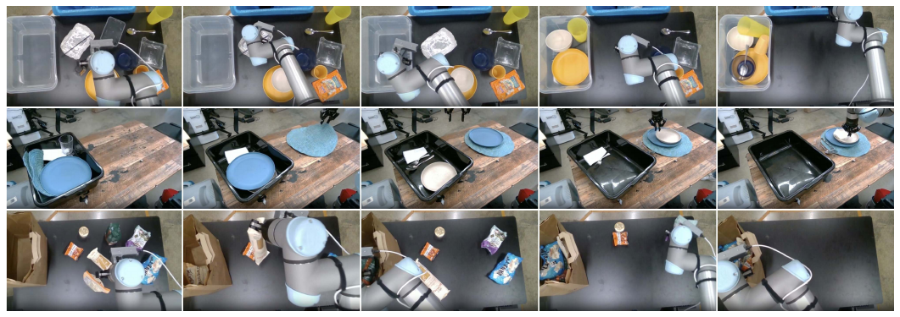

**Original caption:** Fig. 8: The tasks in our language evaluation. We evaluate our model on 3 different language-conditioned tasks, each of which requires following a sequence of intermediate language commands. The tasks involve bussing a table (top) to put dishes in a bin and garbage in a trash bin, setting a table (middle) by taking items out of a bin, and packing a shopping bag (bottom).

**中文图注:** 图 8：语言评测中的任务。我们在 3 个不同的语言条件任务上评估模型，每个任务都要求跟随一连串中间语言指令。这些任务包括收拾餐桌（上），把餐具放进箱中并把垃圾丢进垃圾桶；摆餐桌（中），从箱中取出物品进行摆放；以及装袋杂货（下）。

**Reading note:** 自上而下依次为：收拾餐桌（把餐具放进箱中、垃圾丢进垃圾桶）、摆餐桌（从箱中取出餐垫、餐具、餐巾与杯子并按指令摆放）、装袋杂货。每个任务都由一连串约 2 秒粒度的语言子指令构成。

### Fig. 9. 语言评测结果：扁平指令 vs 人类专家/高层 VLM 中间指令

**Placed near:** p.8 S090
**Source:** p.9 C009

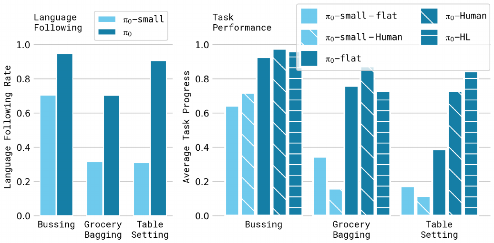

**Original caption:** Fig. 9: Language evaluation. We compare “flat” versions of our policies, −flat, which receive only the overall task command (e.g., “bag the groceries”) with a method that receives intermediate commands from a human expert, −human, or a high-level VLM policy, −HL. We also compare our model to a small non-VLM variant under the “expert” condition, π0 and π0-small, in terms of language following accuracy. The results show a significant improvement with π0 from intermediate language commands provided by a human expert and to a lesser degree by an autonomous high-level policy. Notably, due to π0-small’s limited language following ability, overall it does not gain with the addition of a high-level expert.

**中文图注:** 图 9：语言评测。我们把只接收整体任务指令（例如“把杂货装袋”）的“扁平（flat）”版本策略（记为 −flat）与接收人类专家中间指令（−human）或高层 VLM 策略中间指令（−HL）的方法进行比较。我们还在“专家”条件下比较 π0 与小型非 VLM 变体 π0-small 的语言跟随准确率。结果表明，π0 在人类专家提供的中间语言指令下提升显著，在自主高层策略下提升幅度较小。值得注意的是，由于 π0-small 的语言跟随能力有限，加入高层专家指令后它总体上并无收益。

**Reading note:** 比较 π0-flat / π0-human / π0-HL 以及 π0-small-human 的语言跟随准确率。结果表明 π0 显著优于 π0-small，人类中间指令带来的提升最大，高层 VLM 指令次之；而 π0-small 因语言跟随能力有限，加入高层指令后几乎没有收益。

**Source:** p.8 S091

**Original:** C. Learning new dexterous tasks

**中文:** C. 学习新的灵巧任务

**Source:** p.8 S092

**Original:** In the next set of experiments, we evaluate our model on new tasks that differ significantly from the pre-training data,

**中文:** 在下一组实验中，我们在与预训练数据显著不同的新任务上评估模型，这些任务需要全新的行为。

---

## p.9 Fig. 9 / Fig. 10 · 微调任务与对比方法

**Source:** p.9 C009

**Original:** Fig. 9: Language evaluation. We compare “flat” versions of our policies, −flat, which receive only the overall task command (e.g., “bag the groceries”) with a method that receives intermediate commands from a human expert, −human, or a high-level VLM policy, −HL. We also compare our model to a small non-VLM variant under the “expert” condition, π0 and π0-small, in terms of language following accuracy. The results show a significant improvement with π0 from intermediate language commands provided by a human expert and to a lesser degree by an autonomous high-level policy. Notably, due to π0-small’s limited language following ability, overall it does not gain with the addition of a high-level expert.

**中文:** 图 9：语言评测。我们把只接收整体任务指令（例如“把杂货装袋”）的“扁平（flat）”版本策略（记为 −flat）与接收人类专家中间指令（−human）或高层 VLM 策略中间指令（−HL）的方法进行比较。我们还在“专家”条件下比较 π0 与小型非 VLM 变体 π0-small 的语言跟随准确率。结果表明，π0 在人类专家提供的中间语言指令下提升显著，在自主高层策略下提升幅度较小。值得注意的是，由于 π0-small 的语言跟随能力有限，加入高层专家指令后它总体上并无收益。

**Source:** p.9 S093

**Original:** requiring entirely new behaviors. For these evaluations, we fine-tune the model using various amounts of data for each new task. While each task is new, we partition the tasks into “tiers” depending on how much they differ from tasks in the pre-training data. The tasks, shown in Figure 10, are:

**中文:** 在这些评估中，我们对每个新任务使用不同数量的数据微调模型。虽然每个任务都是新的，我们仍按它们与预训练数据的差异程度把任务划分为若干“层级（tier）”。这些任务见图 10，包括：

### Fig. 10. 微调评测任务（按与预训练数据的相似度分层）

**Placed near:** p.9 S093
**Source:** p.9 C010

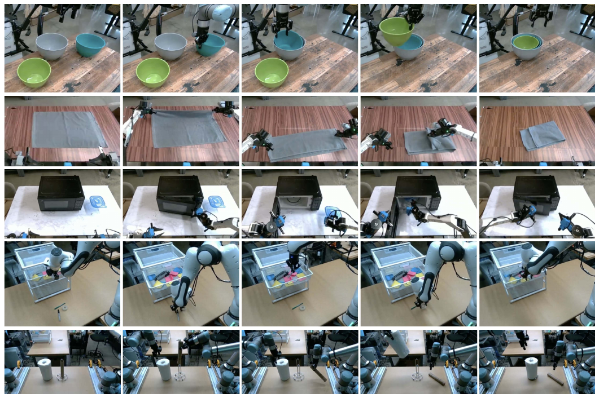

**Original caption:** Fig. 10: Fine-tuning evaluation tasks: We fine-tune our model to a variety of downstream tasks that are distinct from the tasks seen in pre-training. Our tasks represent a range of similarity from the pre-training tasks, with tasks that are most similar to pre-training (stack bowls and towel folding), a task that introduces an unseen new element (a microwave), and tasks that require new motions and new object types (Franka items in drawer and paper towel replacement).

**中文图注:** 图 10：微调评测任务。我们把模型微调到多种与预训练所见任务不同的下游任务上。这些任务与预训练任务的相似度构成一个范围：最接近预训练的任务（叠碗与叠毛巾）、引入未见新元素的任务（微波炉），以及需要新运动与新物体类型的任务（Franka 抽屉装物与更换纸巾卷）。

**Reading note:** 自上而下为：叠碗（UR5e）、叠毛巾（Bi-ARX）、微波炉放保鲜盒（Bi-ARX，引入预训练中没有的新元素“微波炉”）、更换纸巾卷（Bi-UR5e）、Franka 抽屉装物（Franka）。后两者需要新的运动模式与新的物体类别。

**Source:** p.9 S094

**Original:** UR5e stack bowls. This task requires stacking bowls, with four bowls of different sizes. Since this task requires grasping and moving dishes like the bussing task in the pre-training data, we place it in the “easy” tier. The training data contains a variety of bowls, and the evaluations use a mix of seen and unseen bowls.

**中文:** UR5e 叠碗。该任务要求把碗叠起来，共有四个尺寸不同的碗。由于该任务需要抓取与移动餐具（类似预训练数据中的收拾餐桌任务），我们把它划入“简单”层级。训练数据包含多种碗，评估时混合使用见过与未见过的碗。

**Source:** p.9 S095

**Original:** Towel folding. This task requires folding a towel. Since this is similar to shirt folding, which is present in pre-training, we place it in the “easy” tier.

**中文:** 叠毛巾。该任务要求折叠毛巾。由于它与预训练中已有的叠衬衫相似，我们把它划入“简单”层级。

**Source:** p.9 S096

**Original:** Tupperware in microwave. This task requires opening a microwave, putting a plastic container inside it, and closing it. The containers come in different shapes and colors, and the evaluations use a mix of seen and unseen containers. The container manipulation resembles pre-training data, but the microwave is not found in pre-training.

**中文:** 微波炉放保鲜盒。该任务要求打开微波炉、把塑料容器放进去并关上。容器有不同形状与颜色，评估时混合使用见过与未见过的容器。容器操作与预训练数据相似，但微波炉在预训练中并不存在。

**Source:** p.9 S097

**Original:** Paper towel replacement. This task requires removing an old cardboard paper towel tube from a holder and replacing it with a fresh paper towel roll. Because no such items are found in pre-training, we consider this “hard.”

**中文:** 更换纸巾卷。该任务要求从支架上取下旧的硬纸筒纸巾卷，并换上一卷新的纸巾。由于预训练中不存在这类物品，我们认为它属于“困难”层级。

**Source:** p.9 S098

**Original:** Franka items in drawer. This task requires opening a drawer, packing items into a drawer, and closing it. Because there is no similar task with the Franka robot in pre-training, we consider this “hard.”

**中文:** Franka 抽屉装物。该任务要求打开抽屉、把物品装进抽屉并关上。由于预训练中不存在 Franka 机器人的类似任务，我们认为它属于“困难”层级。

**Source:** p.9 S099

**Original:** We compare our model after fine-tuning both to OpenVLA [24] and Octo [50], which also employ a pre-training and fine-tuning recipe. Since our aim is to evaluate the specific

**中文:** 我们把微调后的模型与 OpenVLA [24] 和 Octo [50] 比较，后两者同样采用预训练加微调的配方。由于我们的目标是评估特定模型（而不是架构），我们对这些模型使用公开可用的预训练检查点（它们在 OXE [10] 上训练），然后针对每个任务进行微调。我们还与 ACT [57] 和 Diffusion Policy [9] 比较，这两者是专门为从小规模数据学习灵巧任务而设计的。ACT 与 Diffusion Policy 只在微调数据集上训练，这些数据集的规模与 ACT 和 Diffusion Policy 实验中使用的单个数据集相近 [9, 57]。我们评估 π0 的方式包括从预训练基础模型微调，以及从零训练。这一比较旨在评估 π0 架构与预训练流程各自的收益。我们假设带有 VLM 初始化的 π0 架构本身就已经为具体任务提供了更好的起点，而预训练流程应进一步改善其性能，尤其是在微调数据较少时。

**Source:** p.9 C010

**Original:** Fig. 10: Fine-tuning evaluation tasks: We fine-tune our model to a variety of downstream tasks that are distinct from the tasks seen in pre-training. Our tasks represent a range of similarity from the pre-training tasks, with tasks that are most similar to pre-training (stack bowls and towel folding), a task that introduces an unseen new element (a microwave), and tasks that require new motions and new object types (Franka items in drawer and paper towel replacement).

**中文:** 图 10：微调评测任务。我们把模型微调到多种与预训练所见任务不同的下游任务上。这些任务与预训练任务的相似度构成一个范围：最接近预训练的任务（叠碗与叠毛巾）、引入未见新元素的任务（微波炉），以及需要新运动与新物体类型的任务（Franka 抽屉装物与更换纸巾卷）。

**Source:** p.9 S100

**Original:** models (rather than the architectures), we use the publicly available pre-trained checkpoints for these models, which are trained on OXE [10], and then fine-tune them to each task. We also compare to ACT [57] and Diffusion Policy [9], which are designed specifically for learning dexterous tasks from smaller datasets. ACT and Diffusion Policy are trained only on the fine-tuning datasets, which are of similar size to the individual datasets used in the ACT and Diffusion Policy experiments [9, 57]. We evaluate π0 by fine-tuning from our pre-trained base model, as well as by training from scratch. This comparison is meant to evaluate the individual benefits of the π0 architecture and our pre-training procedure. We hypothesize that the π0 architecture with VLM initialization should already provide a stronger starting point for the individual tasks, while the pre-training procedure should further improve its performance, especially with smaller fine-tuning datasets.

**中文:** 模型（而不是架构），我们对这些模型使用公开可用的预训练检查点（它们在 OXE [10] 上训练），然后针对每个任务进行微调。我们还与 ACT [57] 和 Diffusion Policy [9] 比较，这两者是专门为从小规模数据学习灵巧任务而设计的。ACT 与 Diffusion Policy 只在微调数据集上训练，这些数据集的规模与 ACT 和 Diffusion Policy 实验中使用的单个数据集相近 [9, 57]。我们评估 π0 的方式包括从预训练基础模型微调，以及从零训练。这一比较旨在评估 π0 架构与预训练流程各自的收益。我们假设带有 VLM 初始化的 π0 架构本身就已经为具体任务提供了更好的起点，而预训练流程应进一步改善其性能，尤其是在微调数据较少时。

**Source:** p.9 S101

**Original:** Figure 11 shows the performance across all of the tasks for a variety of methods, averaging over 10 trials per task, with different amounts of fine-tuning data on each task. We include all of the baselines on the stack bowls and Tupperware in microwave tasks. Since OpenVLA and Octo attain significantly worse performance, we only run these for one of the dataset sizes, due to the time cost of evaluating so many models in the real world. The results show that π0 generally outperforms other methods. Interestingly, the strongest prior models are the ones that are trained entirely from scratch on the target tasks, suggesting that leveraging pre-training in these domains presents a major challenge for prior approaches. While the 5-hour policy for π0 on the Tupperware task performs similarly to the baselines, the 1-hour version is significantly better. As expected, pre-training leads to larger improvement for tasks

**中文:** 图 11 展示了多种方法在所有任务上的性能（每个任务平均 10 次试验，每个任务使用不同数量的微调数据）。我们在叠碗与微波炉放保鲜盒任务上纳入了全部基线。由于 OpenVLA 与 Octo 的性能明显更差，且真实世界评估大量模型的时间成本很高，我们只在一个数据集规模上运行了它们。结果表明 π0 总体优于其他方法。有趣的是，最强的此前模型恰恰是完全在目标任务上从零训练的模型，这说明在此前方法中利用预训练在这些领域仍是重大挑战。虽然 π0 在保鲜盒任务上使用 5 小时数据的策略与基线表现相近，但使用 1 小时数据的版本明显更好。正如预期，对与预训练数据更相似的任务，预训练带来的改进更大。

### Fig. 11. 不同微调数据量下的性能（六个子图）

**Placed near:** p.9 S101
**Source:** p.10 C011

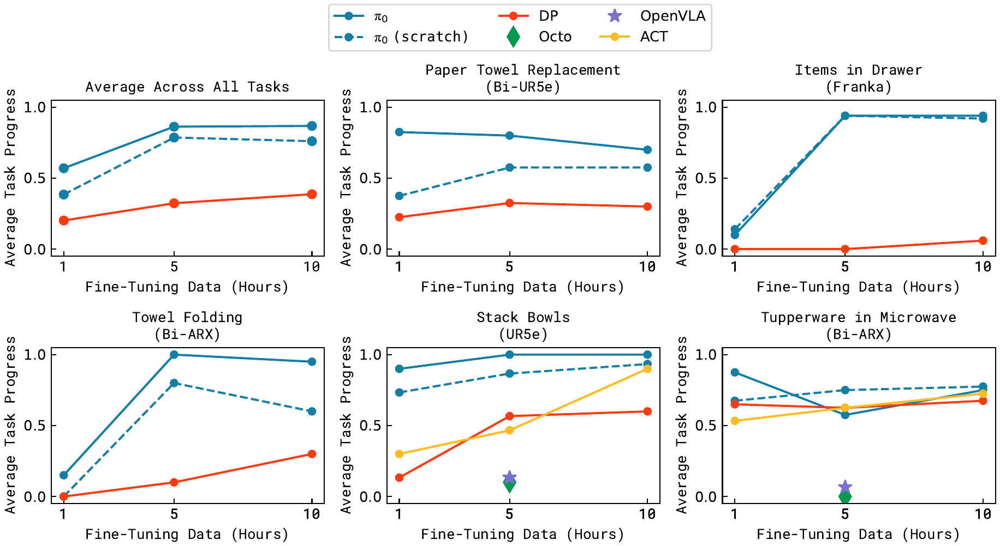

**Original caption:** Fig. 11: Fine-tuning with varying amounts of data. π0 can learn some easier tasks even with smaller amounts of data, and the pre-trained model often attains a larger improvement over the model trained from scratch.

**中文图注:** 图 11：使用不同数据量的微调结果。π0 在数据较少时也能学会一些较简单的任务，且预训练模型相对从零训练的模型往往获得更大的提升。

**Reading note:** 每个子图是一种任务，横轴为微调数据量（1/5/10 小时，对数刻度），纵轴为平均任务进度；曲线包含 π0（预训练后微调）、π0（从零训练）以及 DP、Octo、OpenVLA、ACT 等基线。总体趋势是 π0 在预训练初始化下显著更好，且数据越少优势越明显。

---

## p.10 Fig. 11 · 复杂多阶段任务

**Source:** p.10 C011

**Original:** Fig. 11: Fine-tuning with varying amounts of data. π0 can learn some easier tasks even with smaller amounts of data, and the pre-trained model often attains a larger improvement over the model trained from scratch.

**中文:** 图 11：使用不同数据量的微调结果。π0 在数据较少时也能学会一些较简单的任务，且预训练模型相对从零训练的模型往往获得更大的提升。

**Source:** p.10 S102

**Original:** that are more similar to the pre-training data, though the pre-trained model is frequently better than the non-pre-trained model, sometimes by as much as 2x.

**中文:** 不过预训练模型往往仍优于未预训练模型，有时提升可达 2 倍。

**Source:** p.10 S103

**Original:** D. Mastering complex multi-stage tasks

**中文:** D. 掌握复杂多阶段任务

**Source:** p.10 S104

**Original:** In our final set of experiments, we tackle a range of challenging multi-stage tasks via a combination of fine-tuning and language. For some of these tasks, data is present in pre-training, but fine-tuning is required to attain mastery. For some, no data is present in pre-training. The tasks in this evaluation, shown in Figure 12, are:

**中文:** 在最后一组实验中，我们通过微调与语言的结合来处理一系列具有挑战性的多阶段任务。对其中一些任务，预训练中已有数据，但需要微调才能达到精通；对另一些任务，预训练中完全没有数据。本评估中的任务见图 12，包括：

### Fig. 12. 复杂多阶段任务（a–f）

**Placed near:** p.10 S104
**Source:** p.11 C012

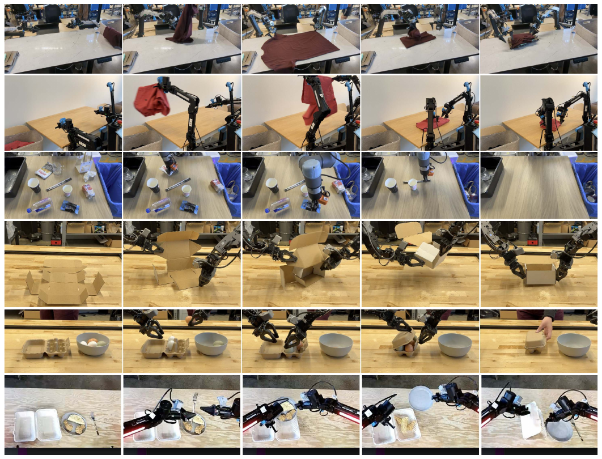

**Original caption:** Fig. 12: We evaluate a range of complex and temporally extended tasks. This includes: folding laundry from a bin with a stationary (a) or mobile (b) robot, bussing a real lunch table (c), assembling a box (d), packing eggs into a carton (e), and packing food into a to-go box (f). These tasks require combining dozens of individual behaviors, such as grasping, stacking, folding, and flattening, generalization to a huge variety of object configurations, and complex physical properties, such as deformable objects or flexible cardboard.

**中文图注:** 图 12：我们评估了一系列复杂且时间跨度较长的任务。包括：用固定机器人（a）或移动机器人（b）从洗衣篮中取衣折叠、收拾真实的餐桌（c）、组装纸箱（d）、把鸡蛋装入蛋盒（e）、以及把食物装入外卖盒（f）。这些任务需要组合抓取、堆叠、折叠与压平等数十种单项行为，泛化到大量不同的物体构型，并处理诸如可变形物体或易弯纸板等复杂物理特性。

**Reading note:** (a) 固定机器人从洗衣篮中取衣并折叠；(b) 移动机器人折叠衣物；(c) 收拾真实餐桌；(d) 组装纸箱；(e) 把鸡蛋装入蛋盒；(f) 把食物装入外卖盒。这些任务需要组合抓取、堆叠、折叠、压平等多种行为，并泛化到大量物体构型。

**Source:** p.10 S105

**Original:** Laundry folding: This task requires a static (non-mobile) bimanual system to fold articles of clothing. The clothing items start in a randomized crumpled state in a bin, and the goal is to take out the item, fold it, and place it on top of a stack of previously folded items. The randomized initial configuration of the crumpled laundry presents a major challenge, since the policy needs to generalize to any configuration. This task is present in pre-training.

**中文:** 折叠衣物：该任务要求一个固定的（非移动）双臂系统折叠衣物。衣物在洗衣篮中处于随机揉皱的初始状态，目标是取出衣物、折叠并放到此前已折好衣物的堆叠之上。揉皱衣物的随机初始构型是主要挑战，因为策略需要泛化到任意构型。该任务存在于预训练中。

**Source:** p.10 S106

**Original:** Mobile laundry: Here, the Fibocom mobile robot in Figure 5 has to fold laundry, facing many of the same challenges while controlling orientation and translation. This task is present in pre-training.

**中文:** 移动洗衣：这里图 5 中的 Fibocom 移动机器人必须折叠衣物，在控制朝向与平移的同时面对许多相同的挑战。该任务存在于预训练中。

**Source:** p.10 S107

**Original:** Dryer unloading: Here, the Fibocom mobile robot has to take laundry out of a dryer and place it into a hamper. This task is present in pre-training.

**中文:** 烘干机卸衣：这里 Fibocom 移动机器人必须把衣物从烘干机中取出并放进洗衣篮。该任务存在于预训练中。

**Source:** p.10 S108

**Original:** Table bussing: This task requires bussing a table with a diverse array of novel objects in a clutter scene, presenting a much greater challenge than the benchmark in our out-of-box evaluation: the policy must generalize to unseen objects of varying shapes and sizes, and perform complex dexterous motions, such as twisting the gripper to pick up large plates and carefully grasping thin, delicate items such as glasses. The robot must handle dense clutter and intelligently sequence various behaviors — for example, to clean off a plate with trash, it must first pick up the plate, then shake its contents into the garbage, and then place the plate in the bin. This task is not present in pre-training.

**中文:** 收拾餐桌：该任务要求在杂乱场景中收拾一张摆放着多种新物体的桌子，这比我们开箱评估中的基准测试困难得多：策略必须泛化到形状与尺寸各异、此前未见过的物体，并执行复杂的灵巧动作，例如旋转夹爪以端起大盘子、小心抓取玻璃杯等薄而脆弱的物品。机器人还必须处理密集杂乱并智能地安排行为顺序——例如要清理一个盛有垃圾的盘子，它必须先端起盘子，把盘中物品抖进垃圾桶，再把盘子放进回收箱。该任务不存在于预训练中。

**Source:** p.10 S109

**Original:** Box building: The robot has to assemble a cardboard box that starts in a flattened state. This task presents a number of major challenges: the box needs to bent in the right way, and the robot needs to hold down parts of the box while folding others, utilizing both arms and even the surface of the table to brace during folding motions. The robot might need to retry some folds, requiring a reactive and intelligent strategy. This task is not present in pre-training.

**中文:** 组装纸箱：机器人必须组装一个初始为压平状态的纸箱。该任务有若干重大挑战：纸箱需要以正确的方式折起，机器人需要在折叠某些部分的同时压住其他部分，需要同时使用双臂，甚至借助桌面作为支撑来完成折叠动作。机器人可能需要重试某些折叠步骤，因此需要反应式且智能的策略。该任务不存在于预训练中。

**Source:** p.10 S110

**Original:** To-go box: This task requires moving several food items from a plate into a to-go box, requiring packing the items into the box so that they do not stick out, and then closing the box with both arms. This task is not present in pre-training.

**中文:** 外卖盒打包：该任务要求把若干食物从盘子移入外卖盒，需要把食物整齐装进盒中使其不外露，然后用双臂把盒子合上。该任务不存在于预训练中。

**Source:** p.10 S111

**Original:** Packing eggs: The robot needs to take six eggs out of a bowl and pack them into an egg carton, and then close the carton. The eggs need to be grasped in a manner appropriate to their pose inside the bowl, and then placed into open slots in the carton. This presents challenges due to the egg shape, slipperiness, and the need for careful placement. Closing the box requires the use of both arms. This task is not present in pre-training.

**中文:** 装鸡蛋：机器人需要从碗中取出六枚鸡蛋并把它们装进蛋盒，然后合上蛋盒。鸡蛋的抓取方式必须与它们在碗中的姿态相适应，然后被放入蛋盒中的空槽。由于鸡蛋的形状、易滑动性以及需要小心放置，这一任务很有挑战。合上盒子需要同时使用双臂。该任务不存在于预训练中。

**Source:** p.10 S112

**Original:** The results, showing average scores per task over 10 trials,

**中文:** 以 10 次试验为单位给出的各任务平均得分结果见图 13。

---

## p.11 Fig. 12 / Fig. 13 · 讨论、局限与未来工作

**Source:** p.11 C012

**Original:** Fig. 12: We evaluate a range of complex and temporally extended tasks. This includes: folding laundry from a bin with a stationary (a) or mobile (b) robot, bussing a real lunch table (c), assembling a box (d), packing eggs into a carton (e), and packing food into a to-go box (f). These tasks require combining dozens of individual behaviors, such as grasping, stacking, folding, and flattening, generalization to a huge variety of object configurations, and complex physical properties, such as deformable objects or flexible cardboard.

**中文:** 图 12：我们评估了一系列复杂且时间跨度较长的任务。包括：用固定机器人（a）或移动机器人（b）从洗衣篮中取衣折叠、收拾真实的餐桌（c）、组装纸箱（d）、把鸡蛋装入蛋盒（e）、以及把食物装入外卖盒（f）。这些任务需要组合抓取、堆叠、折叠与压平等数十种单项行为，泛化到大量不同的物体构型，并处理诸如可变形物体或易弯纸板等复杂物理特性。

**Source:** p.11 S113

**Original:** are presented in Figure 13. The scoring rubrics are in Appendix E. A score of 1.0 represents a perfect execution, while partial scores correspond to partially completed tasks (e.g., 0.5 indicates that half the objects were bussed correctly). These tasks are very difficult, and we were not able to solve them with other methods. We therefore use these tasks to compare to ablations of our approach, evaluating π0 after pre-training and fine-tuning, out of the box after pre-training only (“out-of-box”), and training on the fine-tuning data without any pre-training (“scratch”). The results show that π0 can solve many of these tasks, with our full pre-training and fine-tuning recipe performing best across the board. Note that many of these more difficult tasks show a very large improvement from using the pre-trained model, indicating that pre-training is especially useful with harder tasks. The absolute performance of π0 varies across the tasks, likely due to differences in task difficulty and the degree to which the tasks are represented in pre-training. We recommend that readers watch the task videos on the accompanying website for a more complete impression of these tasks and their complexity. We believe that this level of autonomous performance on such challenging tasks represents a new state of the art in dexterous robot manipulation with learned policies.

**中文:** 评分细则见附录 E。得分 1.0 表示完美执行，部分得分对应部分完成的任务（例如 0.5 表示一半物体被正确收拾）。这些任务非常困难，我们无法用其他方法完成，因此我们用这些任务来与自身方法的消融版本比较：评估经过预训练与微调的 π0、仅预训练后的开箱（“out-of-box”）版本，以及不做任何预训练、只在微调数据上训练（“scratch”）的版本。结果表明 π0 能够完成其中许多任务，而完整的“预训练 + 微调”配方在各任务上总体表现最好。注意，许多更难的任务在使用预训练模型后提升非常显著，说明预训练对更难的任务尤其有用。π0 的绝对性能在不同任务间存在差异，可能源于任务难度以及与预训练覆盖程度的差别。我们建议读者观看随附网站上的任务视频，以更完整地了解这些任务及其复杂性。我们认为，在此类高难度任务上达到的这种自主性能水平，代表了使用学习型策略进行灵巧机器人操作的新技术水平（state of the art）。

### Fig. 13. 复杂任务的后训练（post-training）结果

**Placed near:** p.11 S113
**Source:** p.11 C013

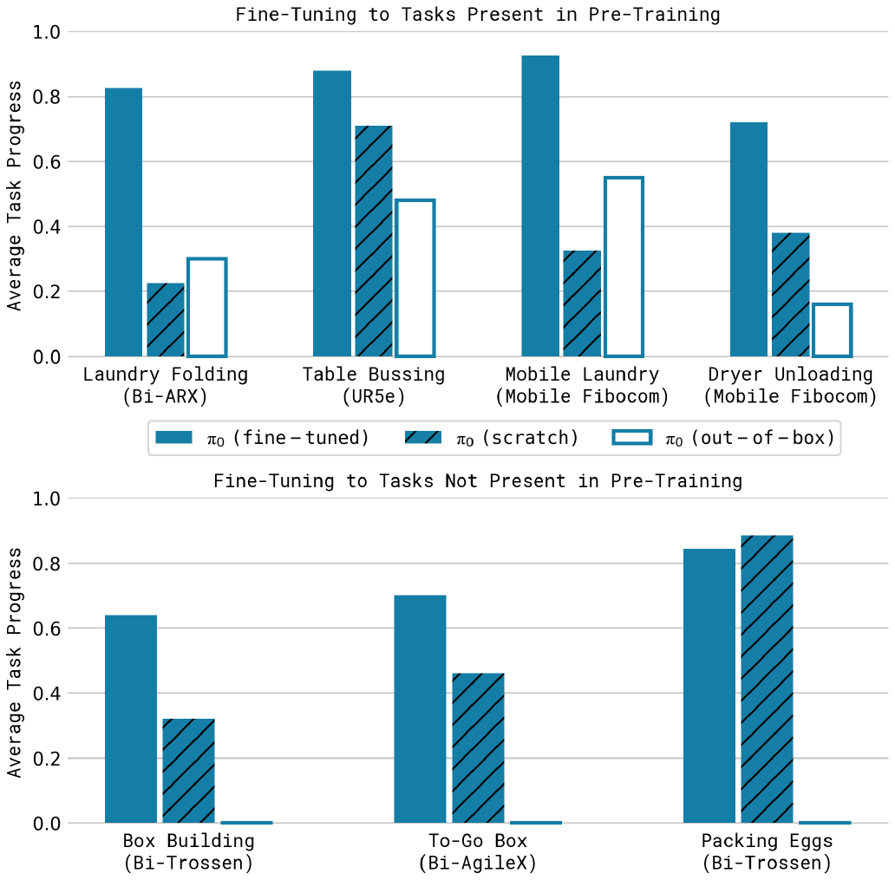

**Original caption:** Fig. 13: Post-training results on complex tasks in terms of average scores over 10 trials. The full pre-trained π0 model attains more than 50% of the maximum score across all of the tasks, and typically outperforms the ablations, with especially significant improvements on the hardest tasks.

**中文图注:** 图 13：复杂任务的后训练结果，以 10 次试验的平均得分表示。完整的预训练 π0 模型在所有任务上都取得了超过最高分 50% 的成绩，且通常优于各消融版本，在最难的任务上提升尤其显著。

**Reading note:** 柱状图按任务给出 10 次试验的平均得分，对比完整“预训练 + 微调”的 π0、仅预训练的开箱版本与从零训练（scratch）版本。完整配方在各任务上普遍最好，且在最难的任务上相对提升最大。

**Source:** p.11 S114

**Original:** VII. DISCUSSION, LIMITATIONS, AND FUTURE WORK

**中文:** VII. 讨论、局限性与未来工作（DISCUSSION, LIMITATIONS, AND FUTURE WORK）

**Source:** p.11 S115

**Original:** We presented a framework for training a robot foundation model, which we refer to as π0, that consists of pre-training on highly diverse data, followed by either out-of-box evaluation or fine-tuning to complex downstream tasks.

**中文:** 我们提出了一个训练机器人基础模型的框架，称之为 π0，其做法是先在高 度多样化的数据上预训练，然后进行开箱评估或微调到复杂的下游任务。

**Source:** p.11 C013

**Original:** Fig. 13: Post-training results on complex tasks in terms of average scores over 10 trials. The full pre-trained π0 model attains more than 50% of the maximum score across all of the tasks, and typically outperforms the ablations, with especially significant improvements on the hardest tasks.

**中文:** 图 13：复杂任务的后训练结果，以 10 次试验的平均得分表示。完整的预训练 π0 模型在所有任务上都取得了超过最高分 50% 的成绩，且通常优于各消融版本，在最难的任务上提升尤其显著。

**Source:** p.11 S116

**Original:** Our empirical evaluation studies tasks that combine dexterity, generalization, and temporally extended multi-stage behaviors. Our model incorporates Internet-scale vision-language model (VLM) pre-training with flow matching for representing complex high-frequency action chunks. Our pre-training mixture consists of 10,000 hours of dexterous manipulation data from 7 different robot configurations and 68 tasks, in addition to large amounts of previously collected robot manipulation data from OXE [10], DROID [23], and Bridge [52]. To our knowledge, this represents the largest pre-training mixture ever used for a robot manipulation model. Our fine-tuning experiments include over 20 tasks, where we show that our model outperforms a variety of baselines, including prior VLA models [24] and models designed specifically for dexterous manipulation [57, 9]. We also examine how our post-training recipe can enable highly complex tasks, such as folding multiple articles of clothing from arbitrary initial configurations or assembling boxes.

**中文:** 我们的实证评估研究了同时结合灵巧性、泛化性与时间跨度较长的多阶段行为的任务。我们的模型把互联网规模的视觉-语言模型（VLM）预训练与用于表示复杂高频动作块的流匹配结合起来。我们的预训练混合包含来自 7 种不同机器人配置与 68 个任务的 10,000 小时灵巧操作数据，此外还有此前采集的 OXE [10]、DROID [23] 与 Bridge [52] 中的大量机器人操作数据。据我们所知，这是机器人操作模型迄今使用过的最大规模预训练混合。我们的微调实验覆盖 20 多个任务，结果表明模型优于多种基线，包括此前的 VLA 模型 [24] 以及专为灵巧操作设计的模型 [57, 9]。我们还考察了后训练配方如何支持高度复杂的任务，例如从任意初始构型折叠多件衣物或组装纸箱。

**Source:** p.11 S117

**Original:** Our framework broadly resembles the training procedures employed for large language models, which typically consist of pre-training a base model on very large datasets scraped from the web, followed by a post-training procedure that aims to “align” the model to enable it to follow instructions and perform user commands. It is generally recognized that most of the “knowledge” in such models is acquired in the pre-training phase, while the post-training phase serves to tell the model how it should leverage that knowledge to fulfill user commands. Our experiments imply that an analogous phenomenon might take place with robot foundation models, where pre-trained models have some zero-shot capabilities, but complex tasks like laundry following require fine-tuning with high-quality data. Training on only this high-quality data results in a brittle model that does not reliably recover from mistakes, while running the pre-trained model in zero shot does not always exhibit the fluent strategies demonstrated in the post-training data.

**中文:** 我们的框架与大型语言模型的训练流程总体相似：通常先在从网络抓取的超大规模数据集上预训练基础模型，然后通过后训练流程“对齐”模型，使其能够跟随指令并执行用户命令。人们普遍认为，这类模型的大部分“知识”是在预训练阶段获得的，而后训练阶段的作用是告诉模型应当如何利用这些知识来完成用户命令。我们的实验表明，机器人基础模型中可能存在类似的现象：预训练模型具备一定的零样本能力，但叠衣服这类复杂任务仍需用高质量数据微调。只用高质量数据训练会得到脆弱的模型，无法可靠地从错误中恢复；而让预训练模型零样本运行，又不总能表现出后训练数据中那种流畅的策略。

---

## p.12 讨论续 · 致谢 · 参考文献（[1]-[11]）

**Source:** p.12 S118

**Original:** We hope that our results will serve as a stepping stone toward general and broadly applicable robot foundation models. Our experiments suggest that such models may soon be a reality, but there are a number of limitations and ample room for future work. First, our experiments do not yet provide a comprehensive understanding of how the pre-training datasets should be composed: we combined all data available to us, but understanding what type of data is more helpful to add and how it should be weighted remains an open problem. Not all tasks in our evaluation work reliably, and it remains unclear how to predict how much and what kind of data is needed to attain near-perfect performance. Finally, it remains to be seen how much positive transfer there is in combining highly diverse data, particularly from different tasks and different robots: although our results suggest that universal pre-trained robot foundation models might become a reality, it is left for future work to understand whether this universality extends to much more distinct domains, such as autonomous driving, navigation, and legged locomotion.

**中文:** 我们希望这些结果能够成为通向通用、广泛适用的机器人基础模型的一块垫脚石。我们的实验表明，这类模型可能很快就会成为现实，但仍存在若干局限，也留有很大的未来研究空间。第一，我们的实验尚未给出关于预训练数据集应如何构成的全面认识：我们把所有可得数据组合在一起，但理解哪些类型的数据更有帮助、应当如何加权仍是开放问题。我们评估中的任务并非全都能稳定完成，也仍不清楚如何预测需要多少、何种数据才能达到接近完美的性能。最后，把高度多样化的数据（尤其是来自不同任务与不同机器人的数据）组合起来究竟能带来多少正向迁移，仍有待观察：尽管我们的结果表明通用预训练机器人基础模型可能成为现实，但这种通用性是否能够扩展到差异更大的领域（例如自动驾驶、导航与足式运动），仍留待未来工作研究。

**Source:** p.12 S119

**Original:** ACKNOWLEDGEMENTS

**中文:** 致谢（ACKNOWLEDGEMENTS）

**Source:** p.12 S120

**Original:** We thank Laura Smith and Dibya Ghosh for feedback on the paper and assistance with figures and videos, Philip Clark, Kelly Sims, and Saunaz Moradi for feedback on writing, and Evan Pokrandt, Joakim Keussen, Dan Philibin, Eitan Penner, Adam Lisagor, and Greg Miller for help with illustrations, design, and videos. We also thank Lili Yu for helpful technical discussion. We are tremendously grateful to all of the robot operators for tirelessly collecting robot manipulation data. For a full contribution statement, see Appendix A.

**中文:** 我们感谢 Laura Smith 与 Dibya Ghosh 对论文的反馈以及在图和视频方面的帮助，感谢 Philip Clark、Kelly Sims 与 Saunaz Moradi 对写作的反馈，并感谢 Evan Pokrandt、Joakim Keussen、Dan Philibin、Eitan Penner、Adam Lisagor 与 Greg Miller 在插图、设计与视频方面的帮助。我们也感谢 Lili Yu 在技术讨论中的帮助。我们极其感谢所有机器人操作员不辞辛劳地采集机器人操作数据。完整的贡献声明见附录 A。

**Source:** p.12 S121

**Original:** REFERENCES

**中文:** 参考文献（REFERENCES）

---

## p.13 参考文献（[12]-[33]）

---

## p.14 参考文献（[34]-[46]）

---

## p.15 参考文献（[47]-[60]） · 附录 A · 附录 B

**Source:** p.15 S242

**Original:** APPENDIX

**中文:** 附录（APPENDIX）

**Source:** p.15 S243

**Original:** A. Contributions

**中文:** A. 贡献

**Source:** p.15 S244

**Original:** The authors contributed to the following areas (listed alphabetically):

**中文:** 作者们按以下领域作出贡献（按字母顺序排列）：

**Source:** p.15 S245

**Original:** Data and operations: Noah Brown, Michael Equi, Chelsea Finn, Niccolo Fusai, Lachy Groom, Liyiming Ke, Suraj Nair, Lucy Shi, and Anna Walling.

**中文:** 数据与运营：Noah Brown、Michael Equi、Chelsea Finn、Niccolo Fusai、Lachy Groom、Liyiming Ke、Suraj Nair、Lucy Shi 与 Anna Walling。

**Source:** p.15 S246

**Original:** Evaluation experiments: Kevin Black, Michael Equi, Chelsea Finn, Brian Ichter, Liyiming Ke, Adrian Li-Bell, Suraj Nair, Karl Pertsch, and Lucy Shi.

**中文:** 评估实验：Kevin Black、Michael Equi、Chelsea Finn、Brian Ichter、Liyiming Ke、Adrian Li-Bell、Suraj Nair、Karl Pertsch 与 Lucy Shi。

**Source:** p.15 S247

**Original:** Model design: Kevin Black, Brian Ichter, Sergey Levine, Karl Pertsch, Lucy Shi, and Quan Vuong.

**中文:** 模型设计：Kevin Black、Brian Ichter、Sergey Levine、Karl Pertsch、Lucy Shi 与 Quan Vuong。

**Source:** p.15 S248

**Original:** Post-training: Michael Equi, Chelsea Finn, Liyiming Ke, Adrian Li-Bell, Suraj Nair, and Lucy Shi.

**中文:** 后训练：Michael Equi、Chelsea Finn、Liyiming Ke、Adrian Li-Bell、Suraj Nair 与 Lucy Shi。

**Source:** p.15 S249

**Original:** Pre-training: Kevin Black, Danny Driess, Brian Ichter, Sergey Levine, Karl Pertsch, Lucy Shi, and Quan Vuong.

**中文:** 预训练：Kevin Black、Danny Driess、Brian Ichter、Sergey Levine、Karl Pertsch、Lucy Shi 与 Quan Vuong。

**Source:** p.15 S250

**Original:** Robot hardware: Noah Brown, Adnan Esmail, Chelsea Finn, Tim Jones, and Mohith Mothukuri.

**中文:** 机器人硬件：Noah Brown、Adnan Esmail、Chelsea Finn、Tim Jones 与 Mohith Mothukuri。

**Source:** p.15 S251

**Original:** Robot software: Karol Hausman, Szymon Jakubczak, Sergey Levine, James Tanner, and Haohuan Wang.

**中文:** 机器人软件：Karol Hausman、Szymon Jakubczak、Sergey Levine、James Tanner 与 Haohuan Wang。

**Source:** p.15 S252

**Original:** Training infrastructure: Kevin Black, Michael Equi, Sergey Levine, Adrian Li-Bell, Suraj Nair, Quan Vuong, Haohuan Wang, and Ury Zhilinsky.

**中文:** 训练基础设施：Kevin Black、Michael Equi、Sergey Levine、Adrian Li-Bell、Suraj Nair、Quan Vuong、Haohuan Wang 与 Ury Zhilinsky。

**Source:** p.15 S253

**Original:** Writing and illustration: Kevin Black, Chelsea Finn, Lachy Groom, Karol Hausman, Brian Ichter, Sergey Levine, and Quan Vuong.

**中文:** 写作与插图：Kevin Black、Chelsea Finn、Lachy Groom、Karol Hausman、Brian Ichter、Sergey Levine 与 Quan Vuong。

**Source:** p.15 S254

**Original:** B. Model Architecture Details

**中文:** B. 模型架构细节

**Source:** p.15 S255

**Original:** In this section, we provide a full description of the model architecture. We follow the PaliGemma VLM [5] design, with the following differences: (1) additional input and output projections for the robotics-specific tokens, including the state vector qt and action vectors At = [at , ..., at+H−1 ], (2) an additional MLP for incorporating the flow matching timestep information τ, and (3) a second, smaller set of weights for the action expert.

**中文:** 本节给出模型架构的完整描述。我们遵循 PaliGemma VLM [5] 的设计，但有如下差异：(1) 为机器人特有的 token 增加了额外的输入与输出投影，包括状态向量 q_t 与动作向量 A_t = [a_t, ..., a_{t+H−1}]；(2) 增加了一个 MLP 以引入流匹配时间步信息 τ；(3) 为 action expert 增加第二组更小的权重。

**Source:** p.15 S256

**Original:** Additional inputs and outputs. The standard PaliGemma architecture takes in a sequence of images [I^1_t, ..., I^n_t] followed by a language prompt ℓ_t. We add an input q_t for the robot’s proprioceptive state, which is mapped to the transformer embedding dimension using a linear projection. The final set of input tokens correspond to the noisy action chunk A^τ_t = [a^τ_t, ..., a^τ_{t+H−1}], with the number of tokens equal to the action horizon (H = 50 for our tasks). We only use the transformer outputs corresponding to the H noisy actions, which are decoded into v_θ(A^τ_t, o_t) using a linear projection.

**中文:** 额外的输入与输出。标准 PaliGemma 架构接收一个图像序列 [I^1_t, ..., I^n_t]，随后是语言提示 ℓ_t。我们增加了机器人本体感受状态输入 q_t，它通过线性投影映射到 Transformer 的嵌入维度。最后一组输入 token 对应带噪动作块 A^τ_t = [a^τ_t, ..., a^τ_{t+H−1}]，其 token 数量等于动作时域长度（我们的任务中 H = 50）。我们只使用与这 H 个带噪动作对应的 Transformer 输出，并通过线性投影解码为 v_θ(A^τ_t, o_t)。

**Source:** p.15 S261

**Original:** Incorporating the flow matching timestep. The noisy action chunk A^τ_t is mapped to the transformer’s embedding dimension using an MLP that also incorporates the flow matching timestep τ. For each noisy action a^τ_{t′}, the expression for the corresponding embedding that is fed into the transformer is W_3 · swish(W_2 · concat(W_1 · a^τ_{t′}, φ(τ))), where φ : R → R^w is a sinusoidal positional encoding function [51], W_1 ∈ R^{w×d}, W_2 ∈ R^{w×2w}, W_3 ∈ R^{w×w}, d is the action dimension, and w is the embedding dimension (or width) of the action expert.

**中文:** 引入流匹配时间步。带噪动作块 A^τ_t 通过一个同时引入流匹配时间步 τ 的 MLP 映射到 Transformer 的嵌入维度。对于每个带噪动作 a^τ_{t′}，输入 Transformer 的对应嵌入表达式为 W_3 · swish(W_2 · concat(W_1 · a^τ_{t′}, φ(τ)))，其中 φ : R → R^w 是正弦位置编码函数 [51]，W_1 ∈ R^{w×d}、W_2 ∈ R^{w×2w}、W_3 ∈ R^{w×w}，d 是动作维度，w 是 action expert 的嵌入维度（即宽度）。

**Source:** p.15 S267

**Original:** Attention mask. π0 uses a blockwise causal attention mask with 3 blocks: [I^1_t, ..., I^n_t, ℓ_t], [q_t], and [a^τ_t, ..., a^τ_{t+H−1}]. Within each block, there is full bidirectional attention, whereas the tokens in each block cannot attend to the tokens in future blocks. The first block includes the input modalities from PaliGemma’s VLM pre-training, which are prevented from attending to future blocks (which include new inputs) to minimize distribution shift from said pre-training. The robot state q_t is its own block because it does not change with each flow matching integration step; preventing it from attending to the final block allows its corresponding keys and values to be cached during sampling. The final block corresponds to the noisy actions A^τ_t, which can attend to the full input sequence.

**中文:** 注意力掩码。π0 使用含 3 个块的块状因果注意力掩码：[I^1_t, ..., I^n_t, ℓ_t]、[q_t] 与 [a^τ_t, ..., a^τ_{t+H−1}]。每个块内部是全双向注意力，而各块中的 token 不能注意未来块中的 token。第一个块包含来自 PaliGemma VLM 预训练的输入模态，它们被禁止注意未来的块（即包含新输入的块），以尽量减少相对该预训练分布的偏移。机器人状态 q_t 自成一个块，因为它不随流匹配的每个积分步变化；禁止它注意最后一个块，可以使其对应的键与值在采样期间被缓存。最后一个块对应带噪动作 A^τ_t，它可以注意完整的输入序列。

**Source:** p.15 S271

**Original:** Action expert. π0 is implemented as a single transformer with two sets of weights (also known as experts [45]), where each token is routed to one of the experts; the weights interact only through the transformer’s self-attention layers. The images and language prompt, [I^1_t, ..., I^n_t, ℓ_t], are routed to the larger VLM backbone, which we initialize from PaliGemma. The inputs not seen during VLM pre-training, [q_t, A^τ_t], are routed to the action expert. PaliGemma is based on the Gemma 2B [49] language model, which uses multi-query attention [44] and a configuration of {width=2048, depth=18, mlp dim=16,384, num heads=18, num kv heads=1, head dim=256}. Since the experts interact only in the self-attention layers, width and mlp dim do not necessarily need to match between experts. To speed up inference (which requires multiple forward passes of the action expert), we downsize the action expert to {width=1024, mlp dim=4096}, resulting in a parameter count of ∼300M.

Sampling the flow matching timestep. The original flow matching papers [28, 32] sample the flow matching timestep from a uniform distribution: τ ∼ U(0, 1). Esser et al. [14] instead propose sampling from a logit-normal distribution that emphasizes the middle timesteps; the authors posit that at high timesteps (low noise levels), the model needs only to learn the identity function, and at low timesteps (high noise levels), the model needs only to learn the mean of the data distribution. However, we hypothesize that the task of action prediction is subtly different from high-resolution image synthesis — while it may be relatively easy to predict the mean image conditioned on a text label, predicting the mean action conditioned on a robot observation (i.e., learning E[A_t|o_t]) is a much harder problem; this is because the observation o_t is very informative in that it should constrain the distribution of possible actions much more than a text label constrains the distribution of possible images. As a result, we designed a timestep sampling distribution that emphasizes low timesteps (high noise levels); additionally, timesteps above a given threshold s are not sampled at all, since they are not needed so long as the integration step δ is greater than 1−s. The distribution is given by p(τ) = Beta((s−τ)/s; 1.5, 1) and is visualized in Figure 14.

**中文:** action expert。π0 被实现为一个带有两组权重（也称为专家 [45]）的单一 Transformer，每个 token 被路由到其中一个专家；两组权重仅通过 Transformer 的自注意力层交互。图像与语言提示 [I^1_t, ..., I^n_t, ℓ_t] 被路由到更大的 VLM 主干（我们由 PaliGemma 初始化）。VLM 预训练中未出现过的输入 [q_t, A^τ_t] 被路由到 action expert。PaliGemma 基于 Gemma 2B [49] 语言模型，使用多查询注意力（multi-query attention）[44]，其配置为 {width=2048, depth=18, mlp dim=16,384, num heads=18, num kv heads=1, head dim=256}。由于专家之间只在自注意力层交互，width 与 mlp dim 不必在两个专家之间保持一致。为加速推理（action expert 需要多次前向），我们把 action expert 缩小为 {width=1024, mlp dim=4096}，参数量约为 300M。

流匹配时间步的采样。原始的流匹配论文 [28, 32] 从均匀分布采样时间步：τ ∼ U(0, 1)。Esser 等人 [14] 则提出从强调中间时间步的 logit-normal 分布采样；作者认为在高时间步（低噪声水平）时模型只需学习恒等函数，而在低时间步（高噪声水平）时模型只需学习数据分布的均值。然而我们假设，动作预测任务与高分辨率图像合成存在微妙差别——虽然基于文本标签预测图像均值相对容易，但基于机器人观测预测动作均值（即学习 E[A_t|o_t]）要困难得多；这是因为观测 o_t 信息量很大，它对可行动作分布的约束远强于文本标签对可能图像分布的约束。因此，我们设计了一个强调低时间步（高噪声水平）的时间步采样分布；此外，高于给定阈值 s 的时间步完全不被采样，因为只要积分步长 δ 大于 1−s，这些时间步并不需要。该分布由 p(τ) = Beta((s−τ)/s; 1.5, 1) 给出，并在图 14 中可视化。

### Fig. 14. flow matching 的时间步采样分布

**Placed near:** p.15 S271
**Source:** p.16 C014

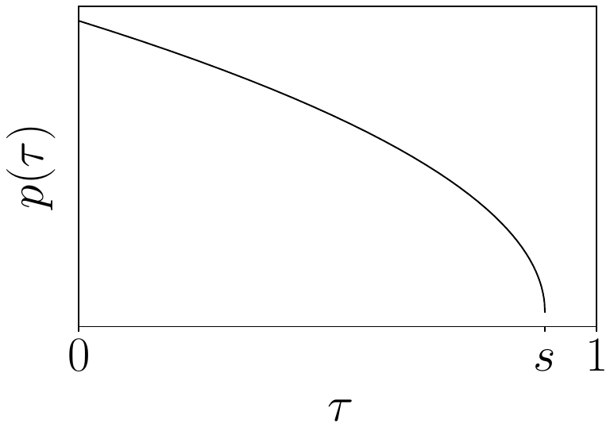

**Original caption:** Fig. 14: Flow matching timestep sampling distribution. We sample τ from a shifted beta distribution that emphasizes lower timesteps (corresponding to noisier actions), and does not sample timesteps at all above a cutoff value s. We use s = 0.999 in our experiments.

**中文图注:** 图 14：流匹配时间步采样分布。我们从强调较小时间步（对应噪声更大的动作）的平移 beta 分布中采样 τ，并且在超过截止值 s 之后完全不采样时间步。实验中我们使用 s = 0.999。

**Reading note:** 横轴为流匹配时间步 τ，纵轴为概率密度。π0 使用平移后的 beta 分布 p(τ) = Beta((s−τ)/s; 1.5, 1)，强调较小（噪声更大）的时间步，并在 s = 0.999 以上完全不再采样；这与图像生成中强调中间时间步的做法不同。

---

## p.16 Fig. 14 · 附录 B 续 · 附录 C · 附录 D（Table I）

**Source:** p.16 C014

**Original:** Fig. 14: Flow matching timestep sampling distribution. We sample τ from a shifted beta distribution that emphasizes lower timesteps (corresponding to noisier actions), and does not sample timesteps at all above a cutoff value s. We use s = 0.999 in our experiments.

**中文:** 图 14：流匹配时间步采样分布。我们从强调较小时间步（对应噪声更大的动作）的平移 beta 分布中采样 τ，并且在超过截止值 s 之后完全不采样时间步。实验中我们使用 s = 0.999。

**Source:** p.16 S273

**Original:** use s = 0.999 in our experiments, which allows for δ > 1/1000, or up to 1,000 integration steps.

**中文:** 在实验中我们使用 s = 0.999，这允许 δ > 1/1000，即最多可使用 1,000 个积分步。

**Source:** p.16 S274

**Original:** C. Non-VLM Baseline Architecture

**中文:** C. 非 VLM 基线架构

**Source:** p.16 S275

**Original:** Our baseline architecture π0-small is not based on a VLM backbone. Hence, we use it to evaluate the benefits of VLM-pre-training. We design it to be sufficiently expressive to fit our large dataset while still providing good performance when trained from scratch. This model has about 470M parameters, and differs from our main model in the following ways: (1) We use DistilBERT [42] to encode the language tokens of the language command ℓt , since this model does not use a language model backbone; (2) The action expert cross-attends to the outputs of the observation encoder, akin to a traditional encoder-decoder transformer [51], rather than our main model which is more like a decoder-only mixture of experts [45]; (3) The images are encoded with a smaller pre-trained ViT encoder (specifically, the R26-S-32 ResNet-ViT hybrid from Steiner et al. [47]); (4) The ViT image encoders do not share weights; (5) The transformer backbone that encodes the observations (which comes after the ViT image encoders) is not pre-trained on Internet data; (6) The action expert uses the DiT architecture [36] rather than the Gemma architecture, and hence incorporates the flow-matching timestep τ using AdaLN-Zero layers. Besides this, the models are broadly similar: both use pre-trained ViT image encoders, both use separate weights for the observation encoder and the action expert, both take in the same observation format, and both perform 10 steps of flow matching to predict the action chunk.

**中文:** 我们的基线架构 π0-small 不基于 VLM 主干，因此我们用它来评估 VLM 预训练的收益。我们把它设计得足够有表达力以拟合我们的大规模数据集，同时在从零训练时仍能提供良好性能。该模型约有 470M 参数，与主模型相比有以下差异：(1) 由于该模型不使用语言模型主干，我们用 DistilBERT [42] 编码语言指令 ℓ_t 的 token；(2) action expert 通过交叉注意力关注观测编码器的输出，类似传统的编码器-解码器 Transformer [51]，而主模型更接近仅解码器的混合专家 [45]；(3) 图像使用更小的预训练 ViT 编码器（具体是 Steiner 等人 [47] 的 R26-S-32 ResNet-ViT 混合模型）；(4) ViT 图像编码器不共享权重；(5) 编码观测的 Transformer 主干（位于 ViT 图像编码器之后）未在互联网数据上预训练；(6) action expert 使用 DiT 架构 [36] 而非 Gemma 架构，因此通过 AdaLN-Zero 层引入流匹配时间步 τ。除此之外，两个模型大体相似：都使用预训练的 ViT 图像编码器，都为观测编码器与 action expert 使用单独的权重，都接收相同格式的观测，并都执行 10 步流匹配来预测动作块。

**Source:** p.16 S276

**Original:** D. Inference

**中文:** D. 推理

**Source:** p.16 S277

**Original:** Recall that our model takes an observation o_t = [I^1_t, ..., I^n_t, ℓ_t, q_t] and the noisy actions A^τ_t and outputs the vector field that needs to be integrated to obtain the next flow matching step, v^τ_t. Each time we predict a new action chunk A_t, we must encode each of the images I^1_t, ..., I^n_t, run a forward pass on the tokens corresponding to o_t, and then run 10 steps of flow matching, where each step requires running a forward pass on the tokens corresponding to A^τ_t (the keys and values corresponding to o_t are cached).

**中文:** 回顾一下，我们的模型接收观测 o_t = [I^1_t, ..., I^n_t, ℓ_t, q_t] 与带噪动作 A^τ_t，并输出为得到下一个流匹配步所需积分的向量场 v^τ_t。每次预测新的动作块 A_t 时，我们必须编码每张图像 I^1_t, ..., I^n_t，对与 o_t 对应的 token 运行一次前向，然后运行 10 步流匹配，其中每一步都需要对与 A^τ_t 对应的 token 运行一次前向（与 o_t 对应的键和值已被缓存）。

**Source:** p.16 S282

**Original:** Table I summarizes the computation time for this operation with 3 camera images. The operations were timed on an NVIDIA GeForce RTX 4090 consumer-grade GPU. For the mobile robot, inference was done off-board over a Wi-Fi connection, adding a small amount of network latency. Further optimizations, quantization, and other improvements might further reduce inference times.

**中文:** 表 I 总结了在 3 路相机图像下该操作的计算耗时。这些操作在 NVIDIA GeForce RTX 4090 消费级 GPU 上计时。对移动机器人，推理通过 Wi-Fi 在机器人之外（off-board）完成，会增加少量网络延迟。进一步的优化、量化与其他改进可能进一步降低推理耗时。 由于模型一次生成完整的 H 步动作块，我们在需要再次推理之前最多可以执行 H 个动作。不过我们也可以比这更频繁地推理，并用各种聚合策略把不同推理调用的动作组合起来。我们早期尝试过时间集成（temporal ensembling）[57]，发现它会损害策略性能，因此我们选择不做动作聚合，而是以开环方式执行动作块。对于 20 Hz 的 UR5e 与 Franka 机器人，我们每 0.8 秒推理一次（执行 16 个动作后）；对于其他所有 50 Hz 的机器人，我们每 0.5 秒推理一次（执行 25 个动作后）。

### Table I. 单次动作块推理耗时（NVIDIA GeForce RTX 4090）

**Placed near:** p.16 S282
**Source:** p.16 C015

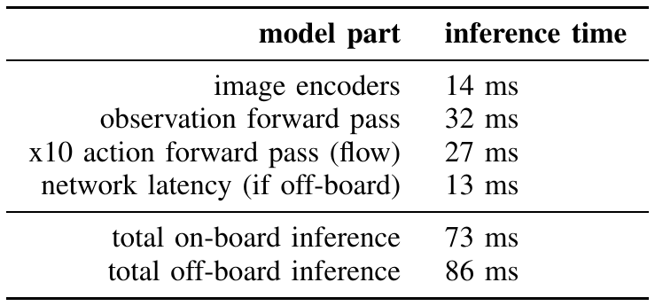

**Original caption:** TABLE I: Inference time of our model on an NVIDIA GeForce RTX 4090 GPU.

**中文图注:** 表 I：我们的模型在 NVIDIA GeForce RTX 4090 GPU 上的推理耗时。

**Reading note:** 表中给出图像编码、观测前向、10 步 flow 动作前向、网络延迟以及板端/离板推理总耗时；离板推理通过 Wi-Fi 与移动机器人通信，额外增加约 13 ms 延迟。

| model part | inference time |
| --- | --- |
| image encoders | 14 ms |
| observation forward pass | 32 ms |
| x10 action forward pass (flow) | 27 ms |
| network latency (if off-board) | 13 ms |
| total on-board inference | 73 ms |
| total off-board inference | 86 ms |

**Source:** p.16 C015

**Original:** TABLE I: Inference time of our model on an NVIDIA GeForce RTX 4090 GPU.

**中文:** 表 I：我们的模型在 NVIDIA GeForce RTX 4090 GPU 上的推理耗时。

**Source:** p.16 S284

**Original:** E. Evaluation Details

**中文:** E. 评估细节

**Source:** p.16 S285

**Original:** For each task, we design a score rubric that measures progress on the task, and use this for our quantitative results.

**中文:** 对每个任务，我们都设计了衡量任务进度的评分细则，并将其用于定量结果。

---

## p.17 附录 E：评分细则

**Source:** p.17 S286

**Original:** We describe this rubric for each task below:

**中文:** 下面我们逐一说明各任务的评分细则：

**Source:** p.17 S287

**Original:** A. Evaluating the base model

**中文:** A. 基础模型评估

**Source:** p.17 S288

**Original:** Shirt folding: Shirt folding is recorded as either success or failure. We begin each shirt folding eval by laying the shirt flat on the table. Success is defined as having folded in the sleeves and performed one half-fold along the length of the shirt. Our eval includes 4 small t-shirts and 1 medium t-shirt. We run 2 evals for each item for a maximum of 15000 steps or approximately 5 minutes each.

**中文:** 叠衬衫：叠衬衫的结果记录为成功或失败。每次叠衬衫评估开始时，我们把衬衫平铺在桌上。成功定义为折好袖子，并沿衬衫长度方向完成一次对折。评估包含 4 件小号 T 恤与 1 件中号 T 恤；每件衣物评估 2 次，每次最多 15,000 步或约 5 分钟。

**Source:** p.17 S289

**Original:** Bussing easy: This task is scored out of 7, where there are 7 different objects on the table, and 1 point is given for each correctly sorted object.

**中文:** 简单收拾餐桌：该任务满分为 7 分，桌上有 7 个不同物体，每正确分类一个物体得 1 分。

**Source:** p.17 S290

**Original:** Bussing hard: This task is scored out of 12, where there are 12 different objects on the table, and 1 point is given for each correctly sorted object. This version of the task includes particularly challenging settings, like a chopstick on top of a piece of trash.

**中文:** 困难收拾餐桌：该任务满分为 12 分，桌上有 12 个不同物体，每正确分类一个物体得 1 分。该版本包含特别具有挑战性的设置，例如把筷子放在垃圾上方。

**Source:** p.17 S291

**Original:** Grocery bagging: This task is scored out of 7. For each 7 grocery items, a point is given for putting it in the bag.

**中文:** 装袋杂货：该任务满分为 7 分，对 7 件杂货物品，每放入袋中一件得 1 分。

**Source:** p.17 S292

**Original:** Toast out of toaster: This task is scored out of 4. For each piece of toast, 1 point is given for picking it from the toaster and another for putting it on the plate.

**中文:** 从烤面包机取出吐司：该任务满分为 4 分。对每片吐司，从烤面包机中取出得 1 分，放到盘子上再得 1 分。

**Source:** p.17 S293

**Original:** B. Language instruction following. The policy is scored on successfully repositioning each object and whether it follows instructions.

**中文:** B. 语言指令跟随。策略的评分依据是成功移动到位的物体数量以及是否遵循指令。

**Source:** p.17 S295

**Original:** Bussing: The robot has to follow the command to pick up the correct object and place each of them into the correct receptacle. The robot receives 12 objects in total and around 30 instructions in one episode.

**中文:** 收拾餐桌：机器人必须遵循指令抓起正确的物体并把它们放入正确的容器。一个回合中机器人需要处理共 12 个物体与约 30 条指令。

**Source:** p.17 S296

**Original:** Table setting: The robot arranges all dishes, utensils, and napkins and makes adjustments according to language specification. The robot receives 7 objects in total and around 20 instructions in one episode.

**中文:** 摆餐桌：机器人摆放所有餐盘、餐具与餐巾，并根据语言说明进行调整。一个回合中机器人需要处理共 7 个物体与约 20 条指令。

**Source:** p.17 S297

**Original:** Grocery bagging: The robot picks up the correct item (among bag of coffee beans, bag of barley, bag of marshmallow, cat food, spaghetti, bag of seaweed, bag of almonds), and bags them into a paper bag. The robot receives 7 objects in total and around 14 instructions in one episode.

**中文:** 装袋杂货：机器人需要抓起正确的物品（在咖啡豆、大麦、棉花糖、猫粮、意大利面、海带、杏仁等袋装物品中选择），并把它们装进纸袋。一个回合中机器人需要处理共 7 个物体与约 14 条指令。

**Source:** p.17 S298

**Original:** C. Learning new dexterous tasks

**中文:** C. 学习新的灵巧任务

**Source:** p.17 S299

**Original:** Stack bowls: This task is scored out of 3. One point for each of two bowls stacked in larger bowls, and one for the neatness of the final product.

**中文:** 叠碗：该任务满分为 3 分。把两个碗叠进更大的碗中各得 1 分，最终成品的整齐程度得 1 分。

**Source:** p.17 S300

**Original:** Towel folding: This task is scored out of 3. One point for the first half-fold of the towel, one point for the second half-fold of the towel, and one point for neatness of the final product. Tupperware in microwave: This task is scored out of 4. One point for opening the microwave, one point for picking up the Tupperware, one point for putting the Tupperware in the microwave, and one point for closing the microwave.

**中文:** 叠毛巾：该任务满分为 3 分。毛巾第一次对折得 1 分，第二次对折得 1 分，最终成品的整齐程度得 1 分。微波炉放保鲜盒：该任务满分为 4 分。打开微波炉得 1 分，拿起保鲜盒得 1 分，把保鲜盒放进微波炉得 1 分，关上微波炉得 1 分。

**Source:** p.17 S301

**Original:** Paper towel replacement: This task is scored out of 4. One point is given for grasping the old roll, and another point is given for removing it. Then, one point is given for grasping the new paper towel roll, and the final point is given for placing it on the dispenser.

**中文:** 更换纸巾卷：该任务满分为 4 分。抓取旧纸卷得 1 分，取下它再得 1 分；随后抓取新纸卷得 1 分，最后把它放到支架上得 1 分。

**Source:** p.17 S302

**Original:** Items in drawer: This task is scored out of 5. One point for opening the drawer, one point for each of 3 items picked and placed into the drawer, and one point for closing the drawer.

**中文:** 抽屉装物：该任务满分为 5 分。打开抽屉得 1 分，3 件物品各自被拿起并放入抽屉各得 1 分，关上抽屉得 1 分。

**Source:** p.17 S303

**Original:** D. Mastering complex multi-stage tasks

**中文:** D. 掌握复杂多阶段任务

**Source:** p.17 S304

**Original:** Laundry folding: This task is scored out of 4. Our evaluation includes five items, three shirts of size M, L, and XL and two shorts of size 28 and 36. We perform two trials for each item, and the items left to be evaluated start randomly crumpled in a laundry bin (while previously evaluated items start in a folded stack). One point is given for picking an item out of the bin and putting it on the table. Another point is given for flattening the shirt or shorts. A third point is granted for folding the shirt or shorts. A final point is given for either placing the item in the corner of the table (if it is the first item evaluated), or stacking it onto an existing stack of folded clothes. We run each eval for a maximum of 15000 steps or approximately 5 minutes.

**中文:** 折叠衣物：该任务满分为 4 分。我们的评估包含五件物品：M、L、XL 三个尺码的衬衫各一件，以及 28、36 两个尺码的短裤各一条。每件物品做两次试验，尚未评估的物品开始时随机揉皱放在洗衣篮中（已评估过的物品则以折叠状态摞放）。从篮中取出一件物品并放到桌上得 1 分；把衬衫或短裤摊平得 1 分；把它折叠得 1 分；最后把它放到桌角（如果它是第一件被评估的物品）或摞到已有的折叠衣物堆上得 1 分。每次评估最多运行 15,000 步或约 5 分钟。

**Source:** p.17 S305

**Original:** Mobile laundry: This evaluation follows the same protocol as laundry folding. The three shirts are sized M, M, and XL, and the shorts are sized 32 and 31 W.

**中文:** 移动洗衣：该评估沿用与折叠衣物相同的协议。三件衬衫的尺码为 M、M 与 XL，短裤的尺码为 32 与 31 W。

**Source:** p.17 S306

**Original:** Table bussing: This task is scored out of 12, where there are 12 different objects on the table, and 1 point is given for each correctly sorted object. This version of the task includes particularly challenging settings, like a chopstick on top of a piece of trash.

**中文:** 收拾餐桌：该任务满分为 12 分，桌上有 12 个不同物体，每正确分类一个物体得 1 分。该版本包含特别具有挑战性的设置，例如把筷子放在垃圾上方。

**Source:** p.17 S307

**Original:** Box building: This task is scored out of 5. One point is given for successfully picking up the box to begin the task. One point is given for folding the box in half, so the flaps can be closed. One point is given for closing the right flap. One point is given for closing the left flap. The final point is given for neatly centering the final product.

**中文:** 组装纸箱：该任务满分为 5 分。成功拿起纸箱以开始任务得 1 分；把纸箱对折使折翼可以合上得 1 分；合上右侧折翼得 1 分；合上左侧折翼得 1 分；最后把成品整齐地对中摆放得 1 分。

**Source:** p.17 S308

**Original:** Packing eggs: This task is scored out of 7. One point for each egg placed in the correct slot in the carton, and one point for closing the lid.

**中文:** 装鸡蛋：该任务满分为 7 分。每把一枚鸡蛋放入蛋盒中正确的槽位得 1 分，合上盖子再得 1 分。

**Source:** p.17 S309

**Original:** Packing food: This task is scored out of 5. One point for picking up the plate of food, one point for each of 3 food items placed in the to-go box, and one point for closing the to-go box.

**中文:** 打包食物：该任务满分为 5 分。端起装食物的盘子得 1 分，把 3 件食物放入外卖盒各得 1 分，合上外卖盒得 1 分。

**Source:** p.17 S310

**Original:** Dryer unloading: This task involves having the robot approach a dyer with a laundry basket and unload the clothes into the basket. We score this eval out of five, where one point is given for properly approaching the dryer. Another for placing the laundry basket on the stool. A third for opening the dryer. A fourth for putting all the clothes in the basket and a fifth point for closing the dryer. We eval with 3 shirts and 2 shorts that start in a random configuration inside the dryer.

**中文:** 烘干机卸衣：该任务要求机器人带着洗衣篮靠近烘干机，并把衣物卸到篮子里。该评估满分为 5 分：正确靠近烘干机得 1 分；把洗衣篮放到凳子上得 1 分；打开烘干机得 1 分；把所有衣物放进篮子得 1 分；关上烘干机得 1 分。评估使用 3 件衬衫与 2 条短裤，它们在烘干机内的初始构型是随机的。

---

## 参考文献（压缩条目，pp.12-15）

> 说明：参考文献属引用元数据，按本仓库既有约定压缩为“前 3 位作者 + et al.”，不逐条中译；完整作者列表与页码见同目录 PDF 的 pp.12-15。

[1] Josh Achiam, Steven Adler, Sandhini Agarwal, et al. Gpt-4 technical report. arXiv preprint arXiv:2303.08774, 2023.

[2] Michael Ahn, Anthony Brohan, Noah Brown, et al. Do as i can, not as i say: Grounding language in robotic affordances. arXiv preprint arXiv:2204.01691, 2022.

[3] Jean-Baptiste Alayrac, Jeff Donahue, Pauline Luc, et al. Flamingo: a visual language model for few-shot learning. Advances in neural information processing systems, 35: 23716–23736, 2022.

[4] Jorge Aldaco, Travis Armstrong, Robert Baruch, et al. Aloha 2: An enhanced low-cost hardware for bimanual teleoperation. arXiv preprint arXiv:2405.02292, 2024.

[5] Lucas Beyer, Andreas Steiner, Andr ´e Susano Pinto, et al. Paligemma: A versatile 3b vlm for transfer. arXiv preprint arXiv:2407.07726, 2024.

[6] Homanga Bharadhwaj, Jay Vakil, Mohit Sharma, et al. RoboAgent: Generalization and efficiency in robot manipulation via semantic augmentations and action chunking. In2024 IEEE International Conference on Robotics and Automation (ICRA), pages 4788–4795. IEEE, 2024.

[7] Anthony Brohan, Noah Brown, Justice Carbajal, et al. Rt-2: Vision-language-action models transfer web knowledge to robotic control. arXiv preprint arXiv:2307.15818, 2023.

[8] Serkan Cabi, Sergio G ´omez Colmenarejo, Alexander Novikov, et al. Scaling data-driven robotics with reward sketching and batch reinforcement learning. arXiv preprint arXiv:1909.12200, 2019.

[9] Cheng Chi, Zhenjia Xu, Siyuan Feng, et al. Diffusion policy: Visuomotor policy learning via action diffusion. The International Journal of Robotics Research, page 02783649241273668, 2023.

[10] OX-Embodiment Collaboration, A Padalkar, A Pooley, et al. Open X-Embodiment: Robotic learning datasets and RT-X models. arXiv preprint arXiv:2310.08864, 1(2), 2023.

[11] Danny Driess, Fei Xia, Mehdi SM Sajjadi, et al. Palm- e: An embodied multimodal language model. arXiv preprint arXiv:2303.03378, 2023.

[12] Nan Du, Yanping Huang, Andrew M Dai, et al. Glam: Efficient scaling of language models with mixture-of-experts. In International Conference on Machine Learning, pages 5547–5569. PMLR, 2022.

[13] Frederik Ebert, Yanlai Yang, Karl Schmeckpeper, et al. Bridge data: Boosting generalization of robotic skills with cross-domain datasets. arXiv preprint arXiv:2109.13396, 2021.

[14] Patrick Esser, Sumith Kulal, Andreas Blattmann, et al. Scaling rectified flow transformers for high-resolution image synthesis. InForty-first International Conference on Machine Learning, 2024.

[15] Haritheja Etukuru, Norihito Naka, Zijin Hu, et al. Robot utility models: General policies for zero-shot deployment in new environments. arXiv preprint arXiv:2409.05865, 2024.

[16] William Fedus, Barret Zoph, and Noam Shazeer. Switch transformers: Scaling to trillion parameter models with simple and efficient sparsity. Journal of Machine Learning Research, 23(120):1–39, 2022.

[17] Zipeng Fu, Tony Z. Zhao, and Chelsea Finn. Mobile aloha: Learning bimanual mobile manipulation with low-cost whole-body teleoperation. InConference on Robot Learning (CoRL), 2024.

[18] Abhinav Gupta, Adithyavairavan Murali, Dhiraj Prakashchand Gandhi, and Lerrel Pinto. Robot learning in homes: Improving generalization and reducing dataset bias. Advances in neural information processing systems, 31, 2018.

[19] Wanggui He, Siming Fu, Mushui Liu, et al. Mars: Mixture of auto-regressive models for fine-grained text-to-image synthesis. arXiv preprint arXiv:2407.07614, 2024.

[20] Jonathan Ho, Ajay Jain, and Pieter Abbeel. Denoising diffusion probabilistic models. Advances in neural information processing systems, 33:6840–6851, 2020.

[21] John Jumper, Richard Evans, Alexander Pritzel, et al. Highly accurate protein structure prediction with alphafold. Nature, 596(7873):583–589, 2021.

[22] Dmitry Kalashnikov, Alex Irpan, Peter Pastor, et al. Scalable deep reinforcement learning for vision-based robotic manipulation. InConference on robot learning, pages 651–673. PMLR, 2018.

[23] Alexander Khazatsky, Karl Pertsch, Suraj Nair, et al. DROID: A large-scale in-the-wild robot manipulation dataset. arXiv preprint arXiv:2403.12945, 2024.

[24] Moo Jin Kim, Karl Pertsch, Siddharth Karamcheti, et al. Openvla: An open-source vision-language-action model. arXiv preprint arXiv:2406.09246, 2024.

[25] Dmitry Lepikhin, HyoukJoong Lee, Yuanzhong Xu, et al. Gshard: Scaling giant models with conditional computation and automatic sharding. arXiv preprint arXiv:2006.16668, 2020.

[26] Sergey Levine, Peter Pastor, Alex Krizhevsky, et al. Learning hand-eye coor-dination for robotic grasping with deep learning and large-scale data collection. The International journal of robotics research, 37(4-5):421–436, 2018.

[27] Yujia Li, David Choi, Junyoung Chung, et al. Mankowitz, Esme Sutherland Robson, Push-meet Kohli, Nando de Freitas, Koray Kavukcuoglu, and Oriol Vinyals. Competition-level code generation with alphacode. Science, 378(6624):1092–1097, 2022.

[28] Yaron Lipman, Ricky TQ Chen, Heli Ben-Hamu, et al. Flow matching for generative modeling. arXiv preprint arXiv:2210.02747, 2022.

[29] Bingchen Liu, Ehsan Akhgari, Alexander Visheratin, et al. Playground v3: Improving text-to-image alignment with deep-fusion large language models. arXiv preprint arXiv:2409.10695, 2024.

[30] Haotian Liu, Chunyuan Li, Qingyang Wu, and Yong Jae Lee. Visual instruction tuning. Advances in neural information processing systems, 36, 2024.

[31] Peiqi Liu, Yaswanth Orru, Jay Vakil, et al. Ok-robot: What really matters in integrating open-knowledge models for robotics. arXiv preprint arXiv:2401.12202, 2024.

[32] Qiang Liu. Rectified flow: A marginal preserving approach to optimal transport. arXiv preprint arXiv:2209.14577, 2022.

[33] Ajay Mandlekar, Yuke Zhu, Animesh Garg, et al. RoboTurk: A crowdsourcing platform for robotic skill learning through imitation. InConference on Robot Learning, pages 879– 893. PMLR, 2018.

[34] Ajay Mandlekar, Soroush Nasiriany, Bowen Wen, et al. MimicGen: A data generation system for scalable robot learning using human demonstrations. arXiv preprint arXiv:2310.17596, 2023.

[35] Long Ouyang, Jeffrey Wu, Xu Jiang, et al. Training language models to follow instructions with human feedback. Advances in neural information processing systems, 35:27730–27744, 2022.

[36] William Peebles and Saining Xie. Scalable diffusion models with transformers. InProceedings of the IEEE/CVF International Conference on Computer Vision, pages 4195–4205, 2023.

[37] Lerrel Pinto and Abhinav Gupta. Supersizing selfsupervision: Learning to grasp from 50k tries and 700 robot hours. In2016 IEEE international conference on robotics and automation (ICRA), pages 3406–3413. IEEE, 2016.

[38] Adam Polyak, Amit Zohar, Andrew Brown, et al. Movie gen: A cast of media foundation models. arXiv preprint arXiv:2410.13720, 2024.

[39] Alec Radford, Jong Wook Kim, Chris Hallacy, et al. Learning transferable visual models from natural language supervision. InInternational conference on machine learning, pages 8748–8763. PMLR, 2021.

[40] Robin Rombach, Andreas Blattmann, Dominik Lorenz, et al. High-resolution image synthesis with latent diffusion models. InProceedings of the IEEE/CVF conference on computer vision and pattern recognition, pages 10684–10695, 2022.

[41] Chitwan Saharia, William Chan, Saurabh Saxena, et al. Photorealistic text-to-image diffusion models with deep language understanding. Advances in neural information processing systems, 35:36479–36494, 2022.

[42] V Sanh. Distilbert, a distilled version of bert: Smaller, faster, cheaper and lighter. arXiv preprint arXiv:1910.01108, 2019.

[43] Nur Muhammad Mahi Shafiullah, Anant Rai, Haritheja Etukuru, et al. On bringing robots home. arXiv preprint arXiv:2311.16098, 2023.

[44] Noam Shazeer. Fast transformer decoding: One write-head is all you need. arXiv preprint arXiv:1911.02150, 2019.

[45] Noam Shazeer, Azalia Mirhoseini, Krzysztof Maziarz, et al. Outrageously large neural networks: The sparsely-gated mixture-of-experts layer. arXiv preprint arXiv:1701.06538, 2017.

[46] Jascha Sohl-Dickstein, Eric Weiss, Niru Maheswaranathan, and Surya Ganguli. Deep unsupervised learning using nonequilibrium thermodynamics. InInternational conference on machine learning, pages 2256–2265. PMLR, 2015.

[47] Andreas Steiner, Alexander Kolesnikov, Xiaohua Zhai, et al. How to train your vit? data, augmentation, and regularization in vision transformers. arXiv preprint arXiv:2106.10270, 2021.

[48] Gemini Team, Rohan Anil, Sebastian Borgeaud, et al. Gemini: a family of highly capable multimodal models. arXiv preprint arXiv:2312.11805, 2023.

[49] Gemma Team, Thomas Mesnard, Cassidy Hardin, et al. Gemma: Open models based on gemini research and technology. arXiv preprint arXiv:2403.08295, 2024.

[50] Octo Model Team, Dibya Ghosh, Homer Walke, et al. Octo: An open-source generalist robot policy. arXiv preprint arXiv:2405.12213, 2024.

[51] Ashish Vaswani, Noam Shazeer, Niki Parmar, et al. Attention is all you need. In Advances in Neural Information Processing Systems, volume 30, 2017.

[52] Homer Rich Walke, Kevin Black, Tony Z Zhao, et al. BridgeData v2: A dataset for robot learning at scale. InConference on Robot Learning, pages 1723– 1736. PMLR, 2023.

[53] Jason Wei, Maarten Bosma, Vincent Y Zhao, et al. Finetuned language models are zero-shot learners. arXiv preprint arXiv:2109.01652, 2021.

[54] Jason Wei, Yi Tay, Rishi Bommasani, et al. Emer-gent abilities of large language models. arXiv preprint arXiv:2206.07682, 2022.

[55] Junjie Wen, Yichen Zhu, Jinming Li, et al. Tinyvla: Towards fast, data-efficient vision-language-action models for robotic manipulation. arXiv preprint arXiv:2409.12514, 2024.

[56] Kuan-Ting Yu, Maria Bauza, Nima Fazeli, and Alberto Rodriguez. More than a million ways to be pushed. a high-fidelity experimental dataset of planar pushing. In 2016 IEEE/RSJ international conference on intelligent robots and systems (IROS), pages 30–37. IEEE, 2016.

[57] Tony Z Zhao, Vikash Kumar, Sergey Levine, and Chelsea Finn. Learning fine-grained bimanual manipulation with low-cost hardware. arXiv preprint arXiv:2304.13705, 2023.

[58] Tony Z Zhao, Jonathan Tompson, Danny Driess, et al. Aloha unleashed: A simple recipe for robot dexterity. arXiv preprint arXiv:2410.13126, 2024.

[59] Chunting Zhou, Lili Yu, Arun Babu, et al. Transfusion: Predict the next token and diffuse images with one multi-modal model. arXiv preprint arXiv:2408.11039, 2024.

[60] Minjie Zhu, Yichen Zhu, Jinming Li, et al. Scaling diffusion policy in transformer to 1 billion parameters for robotic manipulation. arXiv preprint arXiv:2409.14411, 2024.

---

## 术语对照表（高频术语）

| English | 中文 | 说明 |
| --- | --- | --- |
| generalist robot policy / robot foundation model | 通用机器人策略 / 机器人基础模型 | 可被指派执行多种任务的大规模机器人策略 |
| vision-language-action (VLA) model | 视觉-语言-动作模型 | 以 VLM 为基础并输出机器人动作的模型 |
| flow matching | 流匹配 | 扩散模型的一类变体；π0 用它生成连续动作，采用线性-高斯概率路径 |
| action expert | 动作专家 | π0 中处理机器人状态与动作的第二组权重，与 VLM 主干通过自注意力交互 |
| action chunk / action chunking | 动作块 / 动作分块 | 一次预测未来 H 步动作（π0 中 H = 50），替代逐步自回归解码 |
| cross-embodiment training | 跨本体训练 | 把多种机器人构型的数据混合训练同一模型，动作/构型按最大本体补零对齐 |
| pre-training / post-training | 预训练 / 后训练 | 先在大规模多样数据上预训练，再用高质量任务数据微调 |
| bussing | 收拾餐桌 | 论文中的任务名：把餐具放入回收箱、垃圾丢入垃圾桶 |
| out-of-box evaluation | 开箱评测 | 预训练后不做任何后训练直接评估 |
| compute parity | 算力对等 | 把 π0 训练步数降到与基线相当（160k 步）后比较 |
| temporal ensembling | 时间集成 | 把多次推理的动作做时序聚合；π0 实验发现它会降低性能，故改为开环执行动作块 |
| PaliGemma / Gemma 2B | （保留原名） | π0 的 VLM 主干与语言模型底座（3B 参数，其中 action expert 约 300M） |
| OXE / Bridge v2 / DROID | （保留原名） | 开源机器人操作数据集 |
| ACT / Diffusion Policy / Octo / OpenVLA | （保留原名） | 对比基线：灵巧操作模仿学习方法与通用策略模型 |

## 阅读提示（critical reading notes）

- **规模是本文最强的主张**：预训练混合包含约 10,000 小时机器人数据（自有 903M 时间步 + OXE/Bridge v2/DROID 等开源数据），作者称这是机器人操作模型迄今最大的预训练混合。阅读时应把“数据规模”与“方法创新”分开看：架构上的新意主要是把 flow matching 的 action expert 接到预训练 VLM 上。
- **基线公平性是关键争议点**：OpenVLA 为 7B 参数、不支持动作分块与高频控制，且只训练了 160k 步（π0 为 700k 步）；Octo 仅 93M 参数。作者也指出 π0-small 的对比存在“参数更少 / 无 VLM 初始化”的混淆。因此 Figure 7 与 Figure 11 的结论应理解为“在该实验条件下优于所选基线”，而非普遍优越性证明。
- **评测的统计强度**：多数结果为每个任务 10 次试验的平均分，部分任务只有 1 个数据规模上运行了全部基线（因真实机器人评测成本高）。微小的分数差异不宜过度解读。
- **任务选择与预训练覆盖**：复杂任务（叠衣服、移动洗衣、烘干机卸衣）在预训练中存在，而收拾餐桌、组装纸箱、外卖盒打包、装鸡蛋不在预训练中；作者据此论证预训练 + 微调对困难任务收益更大（Figure 13）。
- **推理效率**：Table I 给出 3 路相机输入下总推理 73 ms（板端）/86 ms（离板）；执行时以开环方式执行动作块（20 Hz 机器人每 0.8 s 推理一次，50 Hz 机器人每 0.5 s 一次），这对高层控制频率与反应性有直接限制。
- **原文本身的问题**：p.5 正文把 “pre-training” 误写为 “pertaining”；Fig. 4 图注与正文中的 “π dataset” 未带下标（可能指 π0 数据集，抽取证据见 translation_notes.md）。正文以 IEEE 双栏排版，`paper.md` 按栏重排，顺序与 PDF 视觉版式不完全一致，但每个块都保留页码锚点。
