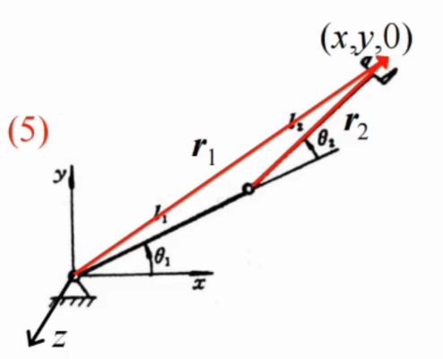

# 雅可比矩阵（Jacobian）

## 基本思想

雅可比矩阵用于描述各关节速度对末端执行器速度的影响。

对每个关节，分别计算其对末端的：

- 线速度贡献
- 角速度贡献

再将各关节的贡献按列排列，即可得到雅可比矩阵。

末端速度关系为：

$$
\begin{bmatrix}
V \\
\omega
\end{bmatrix}
= J(q)\dot{q}
$$

其中：

- $V$：末端线速度
- $\omega$：末端角速度
- $\dot{q}$：各关节速度
- $J(q)$：雅可比矩阵

---

## 单个关节的速度贡献

对第 $i$ 个关节，分别计算其对末端执行器线速度和角速度的贡献。设：

- $z_i$：第 $i$ 个关节轴线方向的单位向量
- $r_i$：从第 $i$ 个关节指向末端执行器的位矢
- $\dot{q}_i$：第 $i$ 个关节的运动速度

### 1. 移动关节（滑动关节）

移动关节沿关节轴线方向移动：

#### 角速度贡献

$$
\omega_i=0
$$

#### 线速度贡献

$$
V_i=\dot{q}_i z_i
$$

因此，单个移动关节满足：

$$
\begin{bmatrix}
V_i\\
\omega_i
\end{bmatrix}
=J_i\dot{q}_i
\quad\Longrightarrow\quad
J_i=\begin{bmatrix}z_i\\0\end{bmatrix}
$$

### 2. 旋转关节（绕轴转动）

旋转关节绕关节轴线转动：

#### 角速度贡献

$$
\omega_i=\dot{q}_i z_i
$$

#### 线速度贡献

$$
V_i=\dot{q}_i\left(z_i\times r_i\right)
$$

因此，单个旋转关节满足：

$$
\begin{bmatrix}
V_i\\
\omega_i
\end{bmatrix}
=J_i\dot{q}_i
\quad\Longrightarrow\quad
J_i=\begin{bmatrix}z_i\times r_i\\z_i\end{bmatrix}
$$

---

## 雅可比矩阵的组成

将每个关节对应的列向量 $J_i$ 按关节顺序排列，得到完整的雅可比矩阵：

$$
J(q)=\begin{bmatrix}J_1 & J_2 & \cdots & J_n\end{bmatrix}
=
\begin{bmatrix}
J_{v1} & J_{v2} & \cdots & J_{vn}\\
J_{\omega 1} & J_{\omega 2} & \cdots & J_{\omega n}
\end{bmatrix}_{6\times n}
$$

其中：

- $J_i$：第 $i$ 个关节对末端六维速度的贡献列向量
- $J_{vi}$：第 $i$ 个关节对末端线速度的贡献
- $J_{\omega i}$：第 $i$ 个关节对末端角速度的贡献
- $n$：关节总数

因此：

$$
\begin{bmatrix}
V\\
\omega
\end{bmatrix}
=J(q)\dot{q}
$$

---

## 示例：平面 2R 机器人的雅可比矩阵

考虑一个平面 2R 机器人：两个运动副均为旋转关节，连杆长度分别为 $l_1,l_2$，关节角为 $\theta_1,\theta_2$。

令：

$$
q=\begin{bmatrix}\theta_1\\\theta_2\end{bmatrix},\qquad
\dot q=\begin{bmatrix}\dot\theta_1\\\dot\theta_2\end{bmatrix}
$$

机器人在 $xy$ 平面内运动，因此两个关节轴线都沿 $z$ 轴：

$$
z_1=z_2=\begin{bmatrix}0\\0\\1\end{bmatrix}
$$

### 1. 末端位置和位矢

末端执行器的位置为：

$$
p_e=
\begin{bmatrix}
x\\y\\0
\end{bmatrix}
=
\begin{bmatrix}
l_1\cos\theta_1+l_2\cos(\theta_1+\theta_2)\\
l_1\sin\theta_1+l_2\sin(\theta_1+\theta_2)\\
0
\end{bmatrix}
$$

对第一个关节，位矢是从关节 1 指向末端：

$$
r_1=\begin{bmatrix}
l_1\cos\theta_1+l_2\cos(\theta_1+\theta_2)\\
l_1\sin\theta_1+l_2\sin(\theta_1+\theta_2)\\
0
\end{bmatrix}
$$

对第二个关节，位矢是从关节 2 指向末端：

$$
r_2=\begin{bmatrix}
l_2\cos(\theta_1+\theta_2)\\
l_2\sin(\theta_1+\theta_2)\\
0
\end{bmatrix}
$$

### 2. 计算叉乘项

对于任意平面向量 $r=[r_x,r_y,0]^T$，有：

$$
\begin{bmatrix}0\\0\\1\end{bmatrix}\times r
=\begin{bmatrix}-r_y\\r_x\\0\end{bmatrix}
$$

因此：

$$
z_1\times r_1=
\begin{bmatrix}
-l_1\sin\theta_1-l_2\sin(\theta_1+\theta_2)\\
l_1\cos\theta_1+l_2\cos(\theta_1+\theta_2)\\
0
\end{bmatrix}
$$

$$
z_2\times r_2=
\begin{bmatrix}
-l_2\sin(\theta_1+\theta_2)\\
l_2\cos(\theta_1+\theta_2)\\
0
\end{bmatrix}
$$

### 3. 逐列构造雅可比矩阵

旋转关节的第 $i$ 列为：

$$
J_i=\begin{bmatrix}z_i\times r_i\\z_i\end{bmatrix}
$$

所以：

$$
J_1=\begin{bmatrix}
-l_1\sin\theta_1-l_2\sin(\theta_1+\theta_2)\\
l_1\cos\theta_1+l_2\cos(\theta_1+\theta_2)\\
0\\
0\\
0\\
1
\end{bmatrix},
\qquad
J_2=\begin{bmatrix}
-l_2\sin(\theta_1+\theta_2)\\
l_2\cos(\theta_1+\theta_2)\\
0\\
0\\
0\\
1
\end{bmatrix}
$$

完整的空间雅可比矩阵为：

$$
J(q)=
\begin{bmatrix}
-l_1\sin\theta_1-l_2\sin(\theta_1+\theta_2) & -l_2\sin(\theta_1+\theta_2)\\
l_1\cos\theta_1+l_2\cos(\theta_1+\theta_2) & l_2\cos(\theta_1+\theta_2)\\
0 & 0\\
0 & 0\\
0 & 0\\
1 & 1
\end{bmatrix}_{6\times2}
$$

这个结果说明：平面 2R 机器人只有以下三种非零末端速度分量：

- $x$ 方向线速度 $v_x$
- $y$ 方向线速度 $v_y$
- 绕 $z$ 轴的角速度 $\omega_z$

### 4. 平面降维形式

由于 $v_z=\omega_x=\omega_y=0$，实际计算时通常取出非零行，得到平面雅可比矩阵：

$$
\begin{bmatrix}
v_x\\v_y\\\omega_z
\end{bmatrix}
=J_p(q)\begin{bmatrix}\dot\theta_1\\\dot\theta_2\end{bmatrix}
$$

其中：

$$
J_p(q)=
\begin{bmatrix}
-l_1\sin\theta_1-l_2\sin(\theta_1+\theta_2) & -l_2\sin(\theta_1+\theta_2)\\
l_1\cos\theta_1+l_2\cos(\theta_1+\theta_2) & l_2\cos(\theta_1+\theta_2)\\
1 & 1
\end{bmatrix}_{3\times2}
$$

末端姿态角为：

$$
\phi=\theta_1+\theta_2
$$

因此 $\omega_z=\dot\phi=\dot\theta_1+\dot\theta_2$。也可以直接对位姿函数求偏导验证：

$$
J_p=\frac{\partial[x\;y\;\phi]^T}{\partial[\theta_1\;\theta_2]^T}
$$

---

## 雅可比矩阵的应用方式

### 1. 正向速度映射：关节速度 → 末端速度

已知当前姿态 $q$ 和关节速度 $\dot q$，直接计算：

$$
\mathcal V=J(q)\dot q
$$

即可得到末端的线速度和角速度。这是雅可比矩阵最基本的用途。

例如，取 $l_1=l_2=1$、$\theta_1=0$、$\theta_2=\frac{\pi}{2}$，则：

$$
J_p=\begin{bmatrix}
-1&-1\\
1&0\\
1&1
\end{bmatrix}
$$

若关节速度为 $\dot q=[0.2,\;0.1]^T$，则：

$$
\begin{bmatrix}v_x\\v_y\\\omega_z\end{bmatrix}
=J_p\dot q
=\begin{bmatrix}-0.3\\0.2\\0.3\end{bmatrix}
$$

即末端向 $x$ 负方向运动，向 $y$ 正方向运动，同时绕 $z$ 轴逆时针转动。

### 2. 逆速度运动学：末端速度 → 关节速度

如果希望末端实现给定速度，可以反过来求关节速度。

对于只控制位置的平面任务，使用前两行构造：

$$
J_{xy}=\begin{bmatrix}
-l_1\sin\theta_1-l_2\sin(\theta_1+\theta_2) & -l_2\sin(\theta_1+\theta_2)\\
l_1\cos\theta_1+l_2\cos(\theta_1+\theta_2) & l_2\cos(\theta_1+\theta_2)
\end{bmatrix}
$$

然后求解：

$$
\dot q=J_{xy}^{-1}\begin{bmatrix}v_x^d\\v_y^d\end{bmatrix}
$$

当 $J_{xy}$ 不可逆或任务约束多于关节自由度时，使用 Moore–Penrose 伪逆：

$$
\dot q=J^\dagger\mathcal V_d
$$

其中，在满列秩时：

$$
J^\dagger=(J^TJ)^{-1}J^T
$$

对于图中的 2R 机器人，$J_p$ 是 $3\times2$ 矩阵，而机器人只有 2 个自由度，因此一般不能同时独立指定 $x,y,\phi$ 三个速度。实际应用中通常：

- 只控制 $x,y$ 两个位置量；或
- 使用伪逆求最小二乘解，使末端速度尽量接近期望值；或
- 选择两个独立的任务变量。

在离散控制中，常用速度控制形式为：

$$
\dot q=J_{xy}^{\dagger}\left(\dot p_d+K(p_d-p)\right)
$$

并用：

$$
q_{k+1}=q_k+\dot q_k\Delta t
$$

迭代更新关节角。其中 $K$ 为正增益矩阵，$p_d-p$ 是末端位置误差。

### 3. 判断奇异位形

对位置雅可比矩阵 $J_{xy}$：

$$
\det(J_{xy})=l_1l_2\sin\theta_2
$$

因此当：

$$
\theta_2=0\quad\text{或}\quad\theta_2=\pi
$$

机器人处于奇异位形：两根连杆共线（完全伸直或折叠）。此时 $J_{xy}$ 降秩，某些方向的末端速度无法通过关节运动产生；直接求逆还会导致关节速度异常放大。

### 4. 力/力矩映射：末端作用 → 关节力矩

雅可比矩阵还可以将末端的力和力矩转换成关节力矩：

$$
\tau=J^T\mathcal F
$$

对于平面任务，若末端受到平面力和绕 $z$ 轴力矩：

$$
\mathcal F_p=\begin{bmatrix}F_x\\F_y\\M_z\end{bmatrix},
\qquad
\tau=J_p^T\mathcal F_p
$$

即：

$$
\tau_1=J_{p,11}F_x+J_{p,21}F_y+M_z
$$

$$
\tau_2=J_{p,12}F_x+J_{p,22}F_y+M_z
$$

这是机器人静力学、力控制和阻抗控制的基础关系。

### 5. 分析可操作性和运动灵活性

雅可比矩阵的奇异值可以衡量机器人在不同方向上的运动能力。对于位置雅可比 $J_{xy}$，常用可操作度指标为：

$$
w=\sqrt{\det(J_{xy}J_{xy}^T)}
=|l_1l_2\sin\theta_2|
$$

$w$ 越大，说明末端在各方向上的运动能力通常越均衡；当 $w$ 接近 0 时，机器人接近奇异位形，逆速度计算对噪声更敏感。

---

## 使用雅可比矩阵时的检查清单

1. 确认 $z_i$ 和 $r_i$ 是否都在同一个坐标系中表达。
2. 确认 $r_i$ 是“从第 $i$ 个关节指向末端”的位矢，而不是任意两点之间的向量。
3. 根据任务选择完整的 $6\times n$ 雅可比，或只保留平面内需要的行。
4. 求逆前检查矩阵秩、行列式或最小奇异值，避免在奇异位形附近直接求逆。
5. 注意单位一致性：线速度单位为 m/s，角速度单位为 rad/s；力矩映射中还要保持长度单位一致。
