# Diffusion Policy：通过动作扩散进行视觉运动策略学习

> Source PDF: F:\Learning-Space\Embodied-AI\notes\模仿学习\Diffusion Policy\2303.04137v4.pdf
> arXiv: 2303.04137v4, 1 June 2023
> Paper type: robotics / visuomotor imitation-learning method paper
> Reader mode: complete bilingual reading artifact; source anchors refer to PDF page numbers.

## 页面与章节索引

- p.1–2：标题、摘要、引言；Diffusion Policy 形式化与 DDPM 训练
- p.3–4：视觉运动策略改造；CNN/Transformer、视觉编码器、噪声调度与实时推理
- p.4–5：多模态动作、位置控制、动作序列预测、训练稳定性
- p.6–8：仿真评测、关键发现、真实世界 Push-T
- p.9–10：Mug Flipping、Sauce Pouring/Spreading、相关工作
- p.11：局限、结论、致谢、参考文献起始
- p.12–13：参考文献
- p.14–16：附录、超参数、数据效率、观测窗口与硬件设置

## Metadata

Title: Diffusion Policy: Visuomotor Policy Learning via Action Diffusion
Authors: Cheng Chi, Siyuan Feng, Yilun Du, Zhenjia Xu, Eric Cousineau, Benjamin Burchfiel, Shuran Song
Affiliations: Columbia University; Toyota Research Institute; MIT
Link: https://diffusion-policy.cs.columbia.edu

## Abstract

**Source:** p.1 S001

**Original:** This paper introduces Diffusion Policy, a new way of generating robot behavior by representing a robot’s visuomotor policy as a conditional denoising diffusion process. We benchmark Diffusion Policy across 12 different tasks from 4 different robot manipulation benchmarks and find that it consistently outperforms existing state-of-the-art robot learning methods with an average improvement of 46.9%. Diffusion Policy learns the gradient of the action-distribution score function and iteratively optimizes with respect to this gradient field during inference via a series of stochastic Langevin dynamics steps. We find that the diffusion formulation yields powerful advantages when used for robot policies, including gracefully handling multimodal action distributions, being suitable for high-dimensional action spaces, and exhibiting impressive training stability. To fully unlock the potential of diffusion models for visuomotor policy learning on physical robots, this paper presents a set of key technical contributions including the incorporation of receding horizon control, visual conditioning, and the time-series diffusion transformer. We hope this work will help motivate a new generation of policy learning techniques that are able to leverage the powerful generative modeling capabilities of diffusion models. Code, data, and training details will be publicly available.

**中文:** 本文提出 Diffusion Policy：将机器人的视觉运动策略表示为条件去噪扩散过程，以此生成机器人行为。作者在来自 4 个机器人操作基准的 12 项任务上进行评测，发现该方法稳定超过现有最先进的机器人学习方法，平均提升 46.9%。Diffusion Policy 学习动作分布得分函数的梯度，并在推理时通过一系列随机 Langevin 动力学步骤，沿该梯度场迭代优化。实验表明，扩散形式为机器人策略带来多项优势：能够自然处理多模态动作分布，适用于高维动作空间，并具有出色的训练稳定性。为充分发挥扩散模型在真实机器人视觉运动策略学习中的潜力，论文进一步引入 receding-horizon control（滚动时域控制）、视觉条件和时间序列扩散 Transformer 等关键技术。作者希望本工作推动新一代策略学习技术，利用扩散模型强大的生成建模能力。代码、数据和训练细节将公开。

## I. Introduction

**Source:** p.1 S002

**Original:** Policy learning from demonstration, in its simplest form, can be formulated as the supervised regression task of learning to map observations to actions. In practice however, the unique nature of predicting robot actions — such as the existence of multimodal distributions, sequential correlation, and the requirement of high precision — makes this task distinct and challenging compared to other supervised learning problems.

**中文:** 从示范中学习策略，最简单的形式可以写成一个监督回归任务：学习将观测映射到动作。然而，机器人动作预测具有独特性质——动作分布可能是多模态的，动作之间存在序列相关性，而且通常要求高精度——因此它与其他监督学习问题不同，也更具挑战。

**Source:** p.1 S003

**Original:** Prior work attempts to address this challenge by exploring different action representations (Fig. 1 a) — using mixtures of Gaussians, categorical representations of quantized actions, or by switching the policy representation (Fig. 1 b) — from explicit to implicit to better capture multi-modal distributions.

**中文:** 以往工作尝试通过探索不同的动作表示来应对这一挑战（图 1a）：使用高斯混合、量化动作的类别表示，或切换策略表示形式（图 1b），从显式策略转向隐式策略，以更好地捕获多模态分布。

> 监督学习中，真机做出的动作为了做到与所有示范动作的距离最小，只能取平均。
> 即网络必须用 一个动作 同时拟合所有示范动作，最近的那一个点就是平均；真机后来做出的，就是这个平均动作。

### Fig. 1. 策略表示：显式、隐式与扩散策略

**Placed near:** p.1 S003
**Source:** p.1 C001

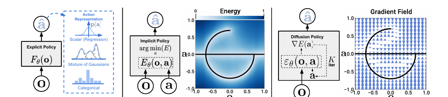

**Original caption:** Fig. 1: Policy Representations. a) Explicit policy with different types of action representations. b) Implicit policy learns an energy function conditioned on both action and observation and optimizes for actions that minimize the energy landscape c) Diffusion policy refines noise into actions via a learned gradient field. This formulation provides stable training, allows the learned policy to accurately model multimodal action distributions, and accommodates high-dimensional action sequences.

**中文图注:** 图 1：策略表示。a）使用不同动作表示的显式策略；b）隐式策略学习一个同时以动作和观测为条件的能量函数，并优化使能量景观最小的动作；c）扩散策略通过学习到的梯度场将噪声逐步细化为动作。该形式具有稳定训练的特点，能准确建模多模态动作分布，并支持高维动作序列。

a)

| 表示形式             | 分布形态   | 输出内容                                     | 与「取平均」的关系                                                        |
| -------------------- | ---------- | -------------------------------------------- | ------------------------------------------------------------------------- |
| Scalar (Regression)  | 单峰高斯   | 一个连续动作                                 | 采用MSE损失时最优解为均值，左右绕行的示范动作会被强制平均为中间的单一动作 |
| Mixture of Gaussians | 多峰分布   | 多个高斯分量的均值、方差、权重               | 可同时表示左、右两个绕行模式，不再强制平均成单个动作                      |
| Categorical          | 离散柱状图 | 将动作量化为若干bin，以分类任务形式训练/推理 | 预测的是「选择哪个bin」，而非连续动作均值，从根本上避免连续平均问题       |

**Reading note:** 图中最重要的对比是：显式策略直接输出动作，隐式策略优化能量，Diffusion Policy 则通过迭代去噪/梯度更新生成动作。

> a 和 b 的主要区别在于推理时，a 的网络直接根据环境吐一个 action，b 候选动作和环境都输入网络，选择能量最低的那个候选。

| 维度       | (a) 显式策略                                                          | (b) 隐式策略                                                            | (c) Diffusion Policy         |
| ---------- | --------------------------------------------------------------------- | ----------------------------------------------------------------------- | ---------------------------- |
| 网络输出   | 动作本身                                                              | 能量$E(o, a)$                    | 噪声预测梯度$\varepsilon_\theta$ |                              |
| 生成方式   | 单次前向传播得到$\hat{a}$              | 求解$\arg\min_a E(o, a)$ | 迭代 K 步去噪                                                           |                              |
| 多模态处理 | 单峰回归强制平均多模态；GMM/分类仅部分缓解                            | 多个能量谷（天然支持多峰）                                              | 多个收敛盆地（天然支持多峰） |
| 主要问题   | 表达能力不足 （多峰表达困难）                                    | 训练不稳定                                                              | 本文主张的解决方案           |

> 隐式策略训练不稳定的原因：
>
> 隐式策略把分布写成能量模型：
> $p_\theta(a|o) = \frac{e^{-E_\theta(o,a)}}{Z(o,\theta)}$，其中归一化常数 $Z(o,\theta) = \int e^{-E_\theta(o,a')} da'$
> $Z$ 是对**整个动作空间**（$\mathcal{A}$ 为动作空间）积分，连续动作空间下无解析解。最大似然训练需要计算 $Z$，IBC 因此用 InfoNCE 损失 + 负采样来近似：
>
> - 正样本：示范动作（能量需压低）
> - 负样本：非示范动作（能量需抬高）
> - 用负样本集合近似归一化常数 $Z$
>
> 负样本质量不足会直接导致训练梯度畸变：
>
> - 负样本过弱（如均匀随机采样的差动作）→ 模型仅学会「示范比随机动作好」，无法区分左绕/中间穿过等不同合理模式
> - 负样本过强（贴近决策边界的 hard negative）→ 训练损失剧烈震荡，收敛困难
> - 负样本覆盖不全（未遍历动作空间的关键区域）→ $Z$ 估计偏差，能量景观坍缩/反转
>
> 这**不是实现 bug**，而是能量模型的固有问题：目标函数中有一项无法解析计算，只能依赖采样近似；采样策略一变，训练得到的最优解就会偏移。

**Source:** p.1 S004

**Original:** In this work, we seek to address this challenge by introducing a new form of robot visuomotor policy that generates behavior via a “conditional denoising diffusion process” on robot action space, Diffusion Policy. In this formulation, instead of directly outputting an action, the policy infers the action-score gradient, conditioned on visual observations, for K denoising iterations (Fig. 1 c). This formulation allows robot policies to inherit several key properties from diffusion models.

**中文:** 本文提出 Diffusion Policy：在机器人动作空间上执行“条件去噪扩散过程”，以生成机器人行为。该策略不直接输出动作，而是在视觉观测条件下，经过 K 次去噪迭代推断动作得分的梯度（图 1c）。因此，机器人策略可以继承扩散模型的若干关键性质。

**Source:** p.1 S005

**Original:** Expressing multimodal action distributions. By learning the gradient of the action score function and performing Stochastic Langevin Dynamics sampling on this gradient field, Diffusion policy can express arbitrary normalizable distributions, which includes multimodal action distributions, a well-known challenge for policy learning.

**中文:** **表达多模态动作分布。** Diffusion Policy 学习动作得分函数的梯度，并在该梯度场上执行随机 Langevin 动力学采样，因此能够表达任意可归一化分布，其中包括策略学习长期难以处理的多模态动作分布。

**Source:** p.1 S006

**Original:** High-dimensional output space. As demonstrated by their impressive image generation results, diffusion models have shown excellent scalability to high-dimension output spaces. This property allows the policy to jointly infer a sequence of future actions instead of single-step actions, which is critical for encouraging temporal action consistency and avoiding myopic planning.

**中文:** **高维输出空间。** 扩散模型在图像生成中的结果表明，它们能够很好地扩展到高维输出空间。因此，策略可以联合推断一段未来动作序列，而不是只预测单步动作；这对于鼓励动作的时间一致性、避免短视规划至关重要。

**Source:** p.1 S007

**Original:** Stable training. Training energy-based policies often requires negative sampling to estimate an intractable normalization constant, which is known to cause training instability. Diffusion Policy bypasses this requirement by learning the gradient of the energy function and thereby achieves stable training while maintaining distributional expressivity.

**中文:** **稳定训练。** 能量策略的训练通常需要通过负采样估计难以处理的归一化常数，而负采样会导致训练不稳定。Diffusion Policy 通过学习能量函数的梯度绕开这一要求，在保持分布表达能力的同时实现稳定训练。

**Source:** p.2 S008

**Original:** Our primary contribution is to bring the above advantages to the field of robotics and demonstrate their effectiveness on complex real-world robot manipulation tasks. To successfully employ diffusion models for visuomotor policy learning, we present the following technical contributions: closed-loop action sequences, visual conditioning, and a time-series diffusion transformer. We systematically evaluate Diffusion Policy across 12 tasks from 4 different benchmarks under the behavior cloning formulation. The evaluation includes simulated and real-world environments, 2DoF to 6DoF actions, single- and multi-task benchmarks, fully- and under-actuated systems, rigid and fluid objects, and demonstrations collected by single and multiple users. Empirically, we find consistent performance boost across all benchmarks with an average improvement of 46.9%.

**中文:** 本文的主要贡献是将上述优势带入机器人领域，并在复杂真实机器人操作任务上验证其有效性。为将扩散模型用于视觉运动策略学习，作者提出三项技术贡献：闭环动作序列、视觉条件和时间序列扩散 Transformer。论文在行为克隆设定下，系统评测来自 4 个基准的 12 项任务，覆盖仿真与真实环境、2DoF 至 6DoF 动作、单任务与多任务、全驱动与欠驱动系统、刚性与流体物体，以及单人和多人采集的示范。实验发现所有基准均有稳定提升，平均提升 46.9%。

### Fig. 2. 真实世界基准任务

**Placed near:** p.2 S008
**Source:** p.2 C002

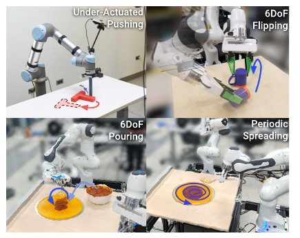

**Original caption:** Fig. 2: Realworld Benchmarks. We deployed Diffusion Policy on two different robot platforms (UR5 and Franka) for 4 challenging tasks: under-actuate precise pushing (Push-T), 6DoF mug flipping, 6DoF sauce pouring, and periodic sauce spreading.

**中文图注:** 图 2：真实世界基准。作者在 UR5 和 Franka 两种机器人平台上部署 Diffusion Policy，完成四项具有挑战性的任务：欠驱动精确推箱（Push-T）、6DoF 杯子翻转、6DoF 酱汁倾倒和周期性酱汁涂抹。

> DoF (Degrees of Freedom)：自由度

## II. Diffusion Policy Formulation

**Source:** p.2 S009

**Original:** We formulate visuomotor robot policies as Denoising Diffusion Probabilistic Models (DDPMs). Crucially, Diffusion policies are able to express complex multimodal action distributions and possess stable training behavior — requiring little task-specific hyperparameter tuning.

**中文:** 作者将视觉运动机器人策略形式化为<mark>去噪扩散概率模型（DDPM）</mark>。关键在于，Diffusion Policy 能表达复杂的多模态动作分布，并具有稳定的训练行为，因此不需要大量针对任务的超参数调节。

### A. Denoising Diffusion Probabilistic Models

**Source:** p.2 S010

**Original:** DDPMs are a class of generative model where the output generation is modeled as a denoising process, often called Stochastic Langevin Dynamics. Starting from x^K sampled from Gaussian noise, the DDPM performs K iterations of denoising to produce intermediate actions with decreasing levels of noise, x^K, x^{K−1}, …, x^0, until a desired noise-free output x^0 is formed.

**中文:** DDPM 是一类将输出生成建模为去噪过程的生成模型，这一过程通常称为随机 Langevin 动力学。从高斯噪声采样得到的 x^K 出发，DDPM 执行 K 次去噪，生成噪声水平逐步降低的中间动作 x^K、x^{K−1}、…、x^0，直到得到目标的无噪声输出 x^0。

**Source:** p.2 S011

**Original:** The process follows x^{k−1}=α(x^k−γε_θ(x^k,k)+N(0,σ²I)). Here ε_θ is the noise prediction network with parameters θ, and N(0,σ²I) is Gaussian noise added at each iteration. Equation (1) may also be interpreted as a single noisy gradient descent step, x′=x−γ∇E(x), where the noise prediction network effectively predicts the gradient field ∇E(x), and γ is the learning rate.

**中文:** 该过程满足 $x^{k−1}=α(x^k−γε_θ(x^k,k)+N(0,σ²I))$。其中，$ε_θ$ 是参数为 θ 的噪声预测网络，$N(0,σ²I)$ 是每次迭代加入的高斯噪声。该式也可以看作一个带噪梯度下降步骤 $x′=x−γ∇E(x)$：噪声预测网络实际上预测梯度场 ∇E(x)，而 γ 是学习率。

> 为什么在去噪的同时加<mark>随机噪声</mark>：
> 因为只去噪、不加随机项，扩散策略也会塌成平均值。
> 先按网络说的方向走一点（去噪），再随机偏一点（加噪声）

**Source:** p.2 S012

**Original:** The choice of α, γ, σ as functions of iteration step k, also called noise schedule, can be interpreted as learning rate scheduling in gradient descent process. An α slightly smaller than 1 has been shown to improve stability.

**中文:** 将 α、γ、σ 设为迭代步 k 的函数，即噪声调度（noise schedule），可以解释为梯度下降过程中的学习率调度。已有研究表明，让 α 略小于 1 有助于提高稳定性。

### B. DDPM Training

**Source:** p.2 S013

**Original:** The training process starts by randomly drawing unmodified examples, x^0, from the dataset. For each sample, we randomly select a denoising iteration k and then sample a random noise ε^k with appropriate variance for iteration k. The noise prediction network is asked to predict the noise from the data sample with noise added.

**中文:** 训练首先从数据集中随机抽取未加噪样本 x^0。对于每个样本，随机选择去噪迭代步 k，再按照该步对应的方差采样随机噪声 ε^k。噪声预测网络需要根据加噪后的数据样本预测这部分噪声。

**Source:** p.2 S014

**Original:** L = MSE(ε^k, ε_θ(x^0+ε^k,k)). As shown in [18], minimizing the loss function in Eq. 3 also minimizes the variational lower bound of the KL-divergence between the data distribution p(x^0) and the distribution of samples drawn from the DDPM.

**中文:** 训练损失为噪声均方误差 $L = MSE(ε^k, ε_θ(x^0+ε^k,k))$。根据文献 [18]，最小化该损失也等价于最小化数据分布 $p(x^0)$ 与由 DDPM 采样得到的分布之间 KL 散度的变分下界。

> 这里拿噪声做 MSE：
> 训练时的损失是先对一个干净数据做**1步高斯加噪**，然后对最后的图片进行噪声预测，与真实噪声做mse损失。
>
> 为什么要将 k 输入：
> k 代表的是噪声强度（推理时的迭代轮数），需要告知网络。

## C. Diffusion for Visuomotor Policy Learning

**Source:** p.3 S015

**Original:** While DDPMs are typically used for image generation (x is an image), we use a DDPM to learn robot visuomotor policies. This requires two major modifications: changing the output x to represent robot actions, and making the denoising process conditioned on input observation O_t.

**中文:** DDPM 通常用于图像生成（此时 x 是图像），而本文将 DDPM 用于学习机器人视觉运动策略，需要两项主要改造：一是让输出 x 表示机器人动作；二是让去噪过程以输入观测 O_t 为条件。

### Fig. 3. Diffusion Policy 总体结构

**Placed near:** p.3 S015
**Source:** p.3 C003

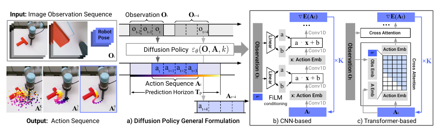

**Original caption:** Fig. 3: Diffusion Policy Overview. At time step t, the policy takes the latest T_o steps of observation data O_t as input and outputs T_a steps of actions A_t. The CNN-based policy applies FiLM conditioning at every convolution layer. The Transformer-based policy passes observation embeddings into cross-attention layers and applies causal attention over action tokens.

**中文图注:** 图 3：Diffusion Policy 概览。在时间步 t，策略输入最近 T_o 步观测 O_t，输出 T_a 步动作 A_t。CNN 版本在每个卷积层施加 FiLM 条件；Transformer 版本将观测嵌入送入交叉注意力层，并对动作 token 使用因果注意力。

**Source:** p.3 S016

**Original:** Closed-loop action-sequence prediction: an effective action formulation should encourage temporal consistency and smoothness in long-horizon planning while allowing prompt reactions to unexpected observations. At time step t the policy takes the latest T_o steps of observation data O_t as input and predicts T_p steps of actions, of which T_a steps are executed on the robot without re-planning. T_o is the observation horizon, T_p the action prediction horizon, and T_a the action execution horizon.

**中文:** **闭环动作序列预测。** 有效的动作表示应在长时域规划中鼓励时间一致性和平滑性，同时允许对意外观测快速反应。在时间步 t，策略输入最近 T_o 步观测 O_t，预测 T_p 步动作，其中 T_a 步在不重新规划的情况下执行。T_o、T_p、T_a 分别称为观测窗口、动作预测窗口和动作执行窗口。

**Source:** p.3 S017

**Original:** Visual observation conditioning: we use a DDPM to approximate the conditional distribution p(A_t|O_t) instead of the joint distribution p(A_t,O_t) used for planning. This formulation allows the model to predict actions conditioned on observations without inferring future states, speeding up diffusion and improving generated-action accuracy.

**中文:** **视觉观测条件。** 作者使用 DDPM 近似条件分布 p(A_t|O_t)，而不是规划工作中使用的联合分布 p(A_t,O_t)。这样，模型无需推断未来状态，就能在观测条件下预测动作，从而加速扩散过程并提高生成动作的准确性。

**Source:** p.3 S018

**Original:** The conditional denoising and training equations are A_t^{k−1}=α(A_t^k−γε_θ(O_t,A_t^k,k)+N(0,σ²I)) and L=MSE(ε^k, ε_θ(O_t,A_t^0+ε^k,k)). The exclusion of observation features O_t from the output of the denoising process significantly improves inference speed and better accommodates real-time control. It also makes end-to-end training of the vision encoder feasible.

**中文:** 条件去噪和训练公式分别为 $A_t^{k−1}=α(A_t^k−γε_θ(O_t,A_t^k,k)+N(0,σ²I))$ 和 $L=MSE(ε^k, ε_θ(O_t,A_t^0+ε^k,k))$。将观测特征 $O_t$ 排除在去噪输出之外，显著提高了推理速度，更适合实时控制，也使视觉编码器能够进行端到端训练。

## III. Key Design Decisions

**Source:** p.3 S019

**Original:** We examine two common network architecture types for ε_θ, convolutional neural networks (CNNs) and Transformers, and compare their performance and training characteristics. The choice of noise prediction network is independent of visual encoders.

**中文:** 作者考察了两种用于 ε_θ 的常见网络结构：卷积神经网络（CNN）和 Transformer，并比较它们的性能与训练特性。噪声预测网络的选择与视觉编码器相互独立。

**Source:** p.3 S020

**Original:** CNN-based Diffusion Policy adopts a 1D temporal CNN with FiLM conditioning on observation features and denoising iteration k. It predicts only the action trajectory rather than a concatenated observation-action trajectory. The CNN backbone works well out of the box on most tasks, but performs poorly when the desired action sequence changes quickly and sharply, likely because temporal convolutions prefer low-frequency signals.

**中文:** 基于 CNN 的 Diffusion Policy 采用一维时间 CNN，并利用 FiLM 以观测特征和去噪迭代步 k 为条件。它只预测动作轨迹，而不是拼接后的观测-动作轨迹。CNN 主干在大多数任务上无需大量调参即可工作良好，但当目标动作序列快速、剧烈变化时性能较差，可能是因为时间卷积具有偏好低频信号的归纳偏置。

**Source:** p.3–4 S021

**Original:** Time-series diffusion transformer introduces a Transformer-based DDPM based on minGPT. Noisy actions are input tokens, the sinusoidal diffusion-step embedding is prepended, and the observation sequence is transformed by a shared MLP and passed to the decoder stack. Each output token predicts ε_θ(O_t,A_t^k,k). In state-based experiments the Transformer often performs best on complex tasks and high action-change rates, but is more sensitive to hyperparameters. The authors recommend starting with CNN and switching to the time-series diffusion Transformer when task complexity or high-rate changes limit performance.

**中文:** 时间序列扩散 Transformer 在 minGPT 结构基础上构造 Transformer-DDPM。带噪动作作为输入 token，正弦形式的扩散步嵌入放在序列开头，观测序列经共享 MLP 变换后输入解码器堆栈；每个输出 token 预测 $ε_θ(O_t,A_t^k,k)$。在基于状态的实验中，Transformer 在复杂任务和高动作变化率任务上通常表现最好，但对超参数更敏感。作者建议新任务先从 CNN 版本开始；若任务复杂度或高频变化限制性能，再切换到时间序列扩散 Transformer，并承担额外调参成本。

### B. Visual Encoder

**Source:** p.4 S022

**Original:** The visual encoder maps the raw image sequence into a latent embedding O_t and is trained end-to-end with the diffusion policy. Different camera views use separate encoders; images at each timestep are encoded independently and concatenated. A standard ResNet-18 without pretraining is used, replacing global average pooling with spatial softmax pooling and BatchNorm with GroupNorm for stable training with Exponential Moving Average.

**中文:** 视觉编码器将原始图像序列映射为潜在嵌入 O_t，并与扩散策略一起端到端训练。不同相机视角使用独立编码器，每个时间步的图像分别编码后拼接。作者使用未经预训练的标准 ResNet-18，并以 spatial softmax pooling 替代全局平均池化，以保留空间信息；以 GroupNorm 替代 BatchNorm，以便与指数移动平均结合时保持训练稳定。

### C. Noise Schedule and D. Real-time Inference

**Source:** p.4 S023

**Original:** The noise schedule, defined by σ, α, γ and the additive Gaussian noise as functions of k, controls the extent to which diffusion policy captures high- and low-frequency action characteristics. Empirically, the Square Cosine Schedule from iDDPM works best. For real-time control, DDIM decouples training and inference denoising iterations. Using 100 training iterations and 10 inference iterations gives 0.1 s inference latency on an Nvidia 3080 GPU.

**中文:** 噪声调度由 σ、α、γ 以及随 k 变化的加性高斯噪声定义，它控制扩散策略捕获动作高频和低频特征的程度。实验上，iDDPM 的 Square Cosine Schedule 最适合这些任务。为实现实时控制，DDIM 将训练和推理的去噪迭代次数解耦；在 Nvidia 3080 GPU 上，训练使用 100 次迭代、推理使用 10 次迭代时，推理延迟可达 0.1 秒。

## IV. Intriguing Properties of Diffusion Policy

**Source:** p.4 S024

**Original:** Diffusion Policy’s ability to express multimodal distributions arises from stochastic sampling and stochastic initialization. In Stochastic Langevin Dynamics, an initial sample A_t^K is drawn from a standard Gaussian, which helps specify different convergence basins. Gaussian perturbations across iterations allow samples to move between multimodal basins.

**中文:** Diffusion Policy 表达多模态分布的能力来自随机采样和随机初始化。在随机 Langevin 动力学中，初始样本 A_t^K 从标准高斯分布采样，这有助于指定不同的收敛盆地；迭代过程中加入的高斯扰动则允许样本在不同多模态盆地之间移动。

### Fig. 4. 多模态行为

**Placed near:** p.4 S024
**Source:** p.4 C004

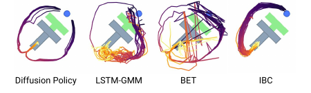

**Original caption:** At the given state, the end-effector can either go left or right to push the block. Diffusion Policy learns both modes and commits to only one mode within each rollout. LSTM-GMM and IBC are biased toward one mode, while BET fails to commit to a single mode due to its lack of temporal action consistency.

**中文图注:** 在给定状态下，末端执行器可以向左或向右绕行来推动方块。Diffusion Policy 学会两种模式，并在每次 rollout 内只选择其中一种。LSTM-GMM 和 IBC 偏向某一个模式，而 BET 由于缺乏时间动作一致性，无法在一次 rollout 中稳定承诺单一模式。

**Source:** p.4–5 S025

**Original:** Diffusion Policy with a position-control action space consistently outperforms velocity control. The authors speculate that multimodality is more pronounced in position control, which Diffusion Policy handles better, and that position control suffers less from compounding errors, making it more suitable for action-sequence prediction.

**中文:** 使用位置控制动作空间的 Diffusion Policy 稳定优于速度控制。作者推测，位置控制中的动作多模态性更加明显，而 Diffusion Policy 更擅长表达这种多模态；同时位置控制受累积误差影响更小，因此更适合动作序列预测。

### Fig. 5. 速度控制与位置控制

**Placed near:** p.5 S025
**Source:** p.5 C005

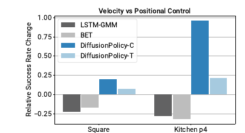

**Original caption:** While both BCRNN and BET performance decrease when switching from velocity to position control, Diffusion Policy is able to leverage the advantage of position and improve its performance.

**中文图注:** 从速度控制切换到位置控制时，BCRNN 和 BET 的性能都会下降；Diffusion Policy 则能利用位置控制的优势并提升性能。

> 速度控制：这一步这么动（速度方向）
> 位置控制：末端到哪里（绝对位姿）
>
> 位置控制的多峰更清晰：
> 在避障场景中，速度控制只有在分叉处差异较大，以后两边都是“继续向前”；位置控制中两条路径差异较大。
>
> 好处：
>
> 1. 因为多峰更清晰，故扩散更能采样（左右是两个分的很开的盆地，随机去噪会掉进其中一个，而不会停在障碍物上（监督学习的痛点））
> 2. 位置+动作序列，累计误差更小：速度控制中，前面一步错，后面所有的速度都错；位置控制中，永远是绝对坐标在控制，更适合序列预测

### Fig. 6. 动作窗口与延迟鲁棒性消融

**Placed near:** p.5 S025–S026
**Source:** p.5 C006

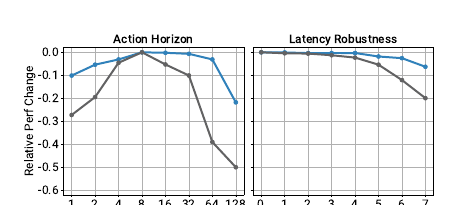

**Original caption:** Change in success rate relative to the maximum for each task. Left: trade-off between temporal consistency and responsiveness when selecting the action horizon. Right: position-controlled Diffusion Policy is robust against latency.

**中文图注:** 相对于每个任务最大成功率的变化。左：动作窗口选择中时间一致性与响应性的权衡；右：<mark>位置控制的 Diffusion Policy 对延迟具有鲁棒性</mark>。

**Source:** p.5 S026

**Original:** Sequence prediction is often avoided because sampling from high-dimensional output spaces is difficult. Diffusion Policy represents action as a high-dimensional action sequence, naturally addressing temporal action consistency and robustness to idle actions. Independent multimodal predictions can switch modes between consecutive steps and produce jitter; a sequence-level prediction keeps one coherent mode. Idle actions occur when demonstrations pause, and filtering them is undesirable for tasks such as pouring. Diffusion Policy models such pauses instead of overfitting to them.

**中文:** 许多策略学习方法回避序列预测，因为从高维输出空间有效采样很困难。Diffusion Policy 将动作表示为高维动作序列，从而自然解决时间动作一致性和对空闲动作的鲁棒性问题。若每一步独立进行多模态预测，相邻动作可能在不同模式之间跳转，产生抖动；序列级预测则能保持同一条连贯轨迹。示范暂停时会出现空闲动作，倒液体等任务并不适合简单过滤这些动作。Diffusion Policy 直接建模暂停，而不是对其过拟合。

**Source:** p.5 S027

**Original:** Implicit Behavioral Cloning (IBC) can in theory possess similar advantages, but reliable high-performance results are difficult because its training is unstable. IBC may show smoothly decreasing training loss while failing to infer training actions accurately, and its evaluation success rate can oscillate, making hyperparameter tuning and checkpoint selection difficult.

**中文:** 从理论上说，隐式行为克隆（IBC）也可能拥有类似优势，但由于训练不稳定，实际难以得到可靠且高性能的结果。IBC 可能在能量函数损失平滑下降的同时，逐渐无法准确推断训练动作；其评测成功率还会振荡，使超参数调节和检查点选择变得困难。

### Fig. 7. 训练稳定性

**Placed near:** p.5 S027
**Source:** p.6 C007

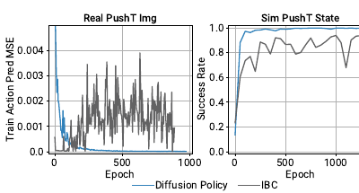

**Original caption:** Left: IBC fails to infer training actions with increasing accuracy despite smoothly decreasing training loss for the energy function. Right: IBC’s evaluation success rate oscillates, making checkpoint selection difficult.

**中文图注:** 左：尽管能量函数训练损失平滑下降，IBC 并未越来越准确地推断训练动作；右：IBC 的评测成功率振荡，使检查点选择困难。

**Source:** p.5 S028

**Original:** An implicit policy represents the action distribution with an Energy-Based Model, p_θ(a|o)=e^{−E_θ(o,a)}/Z(o,θ). Training uses an InfoNCE-style loss and negative samples to estimate the intractable normalization constant. Diffusion Policy instead models the score function ∇_a log p(a|o), where the gradient of the normalization constant is zero with respect to a. Therefore neither training nor inference requires evaluating Z(o,θ), which makes training more stable.

**中文:** 隐式策略用能量模型表示动作分布：p_θ(a|o)=e^{−E_θ(o,a)}/Z(o,θ)。训练使用 InfoNCE 风格损失，并依赖负样本估计难以求解的归一化常数。Diffusion Policy 改为建模得分函数 ∇_a log p(a|o)；由于归一化常数对动作 a 的梯度为零，训练和推理都不需要计算 Z(o,θ)，因此更稳定。

## V. Evaluation

**Source:** p.6 S029

**Original:** We systematically evaluate Diffusion Policy on 12 tasks from 4 benchmarks. The suite includes simulation and real environments, single and multiple tasks, fully actuated and under-actuated systems, rigid and fluid objects, and 2DoF to 6DoF action spaces. Diffusion Policy consistently outperforms prior state of the art, with an average success-rate improvement of 46.9%.

**中文:** 作者在来自 4 个基准的 12 项任务上系统评测 Diffusion Policy。任务集合覆盖仿真和真实环境、单任务和多任务、全驱动和欠驱动系统、刚性和流体物体，以及 2DoF 至 6DoF 动作空间。Diffusion Policy 在所有测试基准上都稳定超过先前最先进方法，平均成功率提升 46.9%。

### Table 1. 行为克隆基准（状态策略）

**Placed near:** p.6 S029
**Source:** p.6 C008

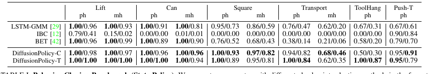

**Original caption:** Success rates are reported as (maximum performance)/(average of last 10 checkpoints), averaged across 3 training seeds and 50 environment initial conditions. Diffusion Policy significantly improves state-of-the-art performance across the board.

**中文表注:** 成功率以**“最大性能 / 最后 10 个检查点的平均性能”**报告，并在 3 个训练随机种子和 50 个环境初始条件上取平均。Diffusion Policy 全面提升了状态策略的最先进性能。

### Table 2. 行为克隆基准（视觉策略）

**Placed near:** p.6 S029
**Source:** p.6 C009

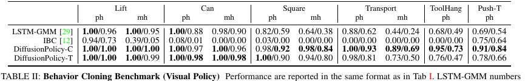

**Original caption:** Performance is reported in the same format as Table 1. LSTM-GMM numbers were reproduced to obtain a complete evaluation. Diffusion Policy shows consistent improvement, especially for complex tasks like Transport and ToolHang.

**中文表注:** 报告格式与表 1 相同。作者复现 LSTM-GMM 以获得完整评测。Diffusion Policy 在视觉输入下仍保持稳定提升，尤其是在 Transport 和 ToolHang 等复杂任务上。

### Table 3. 任务汇总

**Placed near:** p.6 S029
**Source:** p.6 C010

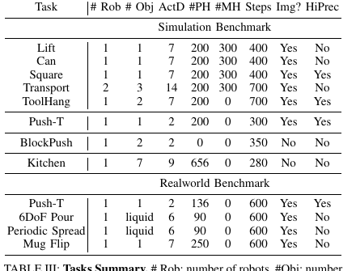

**Original caption:** # Rob: number of robots, # Obj: number of objects, ActD: action dimension, PH: proficient-human demonstration, MH: multi-human demonstration, Steps: maximum rollout steps, Img?: image observation, HiPrec: high-precision requirement. BlockPush uses 1000 episodes of scripted demonstrations.

**中文表注:** 表中汇总机器人数量、物体数量、动作维度、熟练/多人示范数量、最大 rollout 步数、是否使用图像和是否有高精度要求。BlockPush 使用 1000 个脚本示范回合。

### A. Simulation Environments and Datasets

**Source:** p.6–7 S030

**Original:** Robomimic is a large-scale robotic manipulation benchmark for imitation learning and offline RL. It contains five tasks with proficient-human and mixed proficient/non-proficient human demonstrations. Push-T requires precisely pushing a T-shaped block to a fixed target with a circular end-effector. Multimodal Block Pushing tests pushing two blocks into two squares in any order. Franka Kitchen contains seven objects and human demonstrations completing four tasks in arbitrary order.

**中文:** Robomimic 是用于研究模仿学习和离线强化学习的大规模机器人操作基准，包含 5 项任务，并提供熟练人类示范以及熟练/非熟练混合示范。Push-T 要求使用圆形末端执行器，将 T 形方块精确推入固定目标。多模态 Block Pushing 测试以任意顺序把两个方块推入两个方形目标。Franka Kitchen 包含 7 个物体，示范者以任意顺序完成其中 4 项任务。

### Table 4. 多阶段任务（状态观测）

**Placed near:** p.7 S030
**Source:** p.7 C011

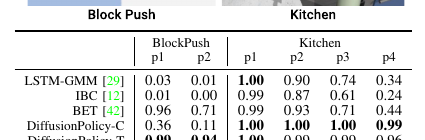

**Original caption:** For PushBlock, p_x is the frequency of pushing x blocks into the targets. For Kitchen, p_x is the frequency of interacting with x or more objects (for example, the bottom burner). Diffusion Policy performs better, especially on difficult metrics such as p2 for Block Pushing and p4 for Kitchen.

**中文表注:** 对 BlockPush，p_x 表示将 x 个方块推入目标的频率；对 Kitchen，p_x 表示与至少 x 个物体交互的频率。Diffusion Policy 在困难指标（如 Block Push 的 p2、Kitchen 的 p4）上提升尤其明显。

**Source:** p.7 S031

**Original:** The evaluation reports the best-performing baseline available from reproduction or the original paper, and averages the last 10 checkpoints across 3 training seeds and 50 environment initializations. All state-based tasks are trained for 4500 epochs and image-based tasks for 3000 epochs. Each method uses its best action space: position control for Diffusion Policy and velocity control for baselines.

**中文:** 评测对每个基准报告可获得的最佳基线结果（来自复现或原论文），并对 3 个训练种子、50 个环境初始条件下最后 10 个检查点取平均。状态任务训练 4500 个 epoch，图像任务训练 3000 个 epoch。每种方法使用其最佳动作空间：Diffusion Policy 使用位置控制，基线方法使用速度控制。

**Source:** p.7 S032

**Original:** Diffusion Policy can express short-horizon multimodality and long-horizon multimodality. It learns to approach the Push-T contact point from either side, and it handles arbitrary orders of sub-goals in Block Push and Kitchen. The paper reports 32% improvement on Block Push p2 and 213% improvement on Kitchen p4.

**中文:** Diffusion Policy 能表达短时域和长时域多模态性。它可以学会从 Push-T 接触点的左侧或右侧接近，也能处理 Block Push 和 Kitchen 中子目标的任意执行顺序。论文报告 Block Push 的 p2 指标提升 32%，Kitchen 的 p4 指标提升 213%。

**Source:** p.7 S033

**Original:** The action horizon creates a trade-off: a horizon greater than 1 helps predict consistent actions and compensate for idle portions of demonstrations, but an overly long horizon slows reaction. Experiments find that 8 action steps are optimal for most tested tasks. Position control is also better exploited by Diffusion Policy than by baselines.

**中文:** 动作窗口存在权衡：窗口大于 1 有助于预测一致动作、补偿示范中的空闲片段，但过长会降低反应速度。实验发现，对大多数任务而言 8 步动作窗口最优。Diffusion Policy 也比基线更能发挥位置控制的优势。

## VI. Real-world Evaluation

**Source:** p.8 S034

**Original:** We evaluated Diffusion Policy on four real-world tasks across two hardware setups. On real-world Push-T we ablated two architecture options and three visual encoder options, and benchmarked two baselines with position and velocity control. Variants with CNN backbones and end-to-end visual encoders yielded the best performance.

**中文:** 作者在两套硬件平台上的四项真实世界任务中评测 Diffusion Policy。在真实 Push-T 上，作者比较了两种网络结构、三种视觉编码器，并让两种基线分别使用位置控制和速度控制。使用 CNN 主干和端到端视觉编码器的 Diffusion Policy 变体取得最佳性能。

<a id=\"S035\">
**Source:** p.8 S035

**Original:** Real-world Push-T is harder than the simulated version because the task is multi-stage, requires fine adjustments before moving to the end-zone, and measures IoU at the last step. Diffusion Policy predicts commands at 10 Hz, linearly interpolated to 125 Hz for robot execution. It reaches 95% success and 0.80 average IoU, close to human performance (1.00 success and 0.84 IoU), while IBC and LSTM-GMM achieve 0% and 20% success.

**中文:** 真实 Push-T 比仿真版本更难，因为它是多阶段任务，需要在前往终止区域前对方块进行精细调整，而且 IoU 在最后一步测量。Diffusion Policy 以 10 Hz 预测机器人命令，再线性插值到 125 Hz 执行。它达到 95% 成功率和 0.80 平均 IoU，接近人类的 100% 成功率和 0.84 IoU；IBC 和 LSTM-GMM 的成功率分别为 0% 和 20%。

### Fig. 8. 真实 Push-T 轨迹比较

**Placed near:** p.8 S035
**Source:** p.9 C012

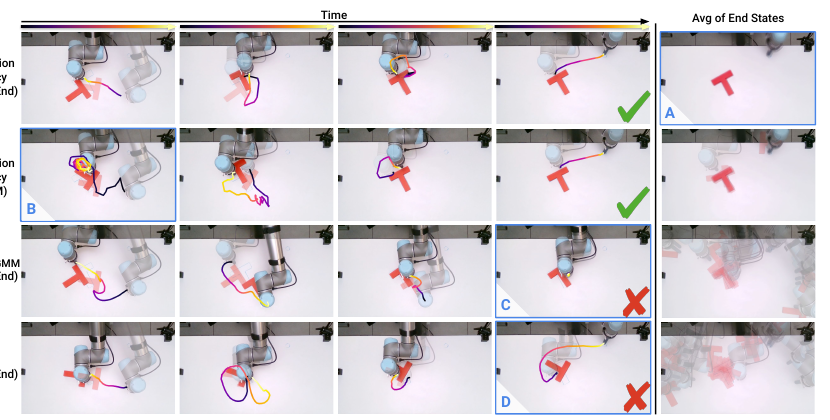

**Original caption:** Columns 1–4 show action trajectories based on key events. The last column shows averaged images of the end state. Diffusion Policy (End2End) achieves more accurate and consistent end states; the R3M variant initially gets stuck but recovers; LSTM-GMM fails to reach the end zone; IBC prematurely ends the pushing stage.

**中文图注:** 前四列展示关键事件对应的动作轨迹，最后一列展示末状态平均图像。端到端 Diffusion Policy 的末状态更准确且一致；R3M 版本会先卡住但随后恢复；LSTM-GMM 未能到达终止区域；IBC 提前结束推送阶段。

### Table 5. 真实世界 Push-T 实验

**Placed near:** p.8 S035
**Source:** p.8 C013

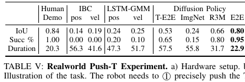

**Original caption:** The robot needs to precisely push the T-shaped block into the target region and move the end-effector to the end-zone. Success is defined by end-state IoU greater than the minimum IoU in the demonstration dataset. Average episode duration is presented in seconds. T-E2E stands for end-to-end trained Transformer-based Diffusion Policy.

**中文表注:** 机器人需要将 T 形方块精确推入目标区域，并把末端执行器移入终止区。Success 定义为末状态 IoU 大于示范数据集中的最小 IoU。平均回合时长以秒计。T-E2E 表示端到端训练的 Transformer 版 Diffusion Policy。

### Fig. 9. 对视觉和物理扰动的鲁棒性

**Placed near:** p.8 S036
**Source:** p.9 C014

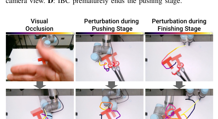

**Original caption:** A waving hand in front of the camera for 3 seconds causes slight jitter, but predicted actions still work. During pushing, the policy immediately corrects a shifted block. During finishing, it returns a shifted block to the goal before entering the end-zone; this behavior was never demonstrated.

**中文图注:** 手遮挡前置相机 3 秒，仅造成轻微抖动；推送阶段移动方块后，策略立即纠正方块；结束阶段移动方块后，策略先把方块纠正回目标，再进入终止区域。这一行为从未在示范中出现。

**Source:** p.8 S036

**Original:** Receding-horizon position control predicts a future action sequence and helps address latency from image processing, policy inference, and network delay. Simulated latency shows peak performance up to 4 steps; velocity control is more affected by latency because of compounding errors. Diffusion Policy also shows stable training, while IBC remains prone to instability.

**中文:** 滚动时域位置控制会预测未来动作序列，有助于抵消图像处理、策略推理和网络传输造成的延迟。模拟延迟实验表明，Diffusion Policy 在最多 4 步延迟下仍保持峰值性能；速度控制由于累积误差更容易受延迟影响。Diffusion Policy 的训练也更稳定，而 IBC 仍容易出现不稳定。

### B. Mug Flipping Task

### Fig. 10. 6DoF 杯子翻转任务

**Placed near:** p.9 S037
**Source:** p.9 C015

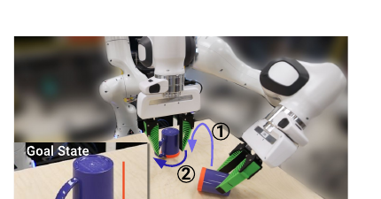

**Original caption:** The robot needs to pick up a randomly placed mug and place it lip down, then rotate the mug so that its handle points left.

**中文图注:** 机器人需要先拾取随机放置的杯子并将杯口朝下，再旋转杯子使把手朝左。

**Source:** p.9 S037

**Original:** The mug flipping task tests complex 3D rotations near the hardware’s kinematic limits. Demonstrations are highly multimodal: depending on the mug pose, the demonstrator may grasp and place directly or use additional pushes, with different grasp types and local adjustments. Diffusion Policy completes the task with 90% success over 20 trials and can sequence multiple pushes or regrasp when necessary; LSTM-GMM never aligns properly in 20 trials.

**中文:** 杯子翻转任务测试机器人在接近运动学极限时处理复杂三维旋转的能力。示范高度多模态：根据杯子初始姿态，示范者可能直接抓取并放置，也可能额外推动把手；抓取方式和局部调整也各不相同。Diffusion Policy 在 20 次试验中达到 90% 成功率，并能在需要时串联多次推动或重新抓取；LSTM-GMM 在 20 次试验中从未正确对齐杯子。

### C. Sauce Pouring and Spreading

### Fig. 11. 真实世界酱汁操作

**Placed near:** p.10 S038
**Source:** p.10 C016

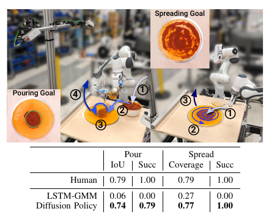

**Original caption:** Left: 6DoF pouring task, in which the robot dips a ladle, approaches the pizza dough center, pours sauce, and lifts the ladle. Right: periodic spreading task, in which the robot approaches the sauce center, follows a spiral pattern, and lifts the spoon.

**中文图注:** 左：6DoF 倾倒任务，机器人依次浸入勺子取酱、接近披萨面团中心、倾倒酱汁并抬起勺子结束。右：周期性涂抹任务，机器人接近酱汁中心，按螺旋轨迹覆盖面团，最后抬起勺子。

**Source:** p.10 S038

**Original:** Sauce pouring and spreading test non-rigid objects, 6DoF action spaces, and periodic actions. Pouring is measured by IoU between the poured sauce mask and a nominal circle; spreading is measured by sauce coverage. Pouring requires idle actions while the ladle fills and fine adjustments for coverage. Spreading requires a long-horizon cyclic pattern and short-horizon feedback because sauce drips unpredictably. Both tasks use the same Push-T hyperparameters and successful policies were obtained on the first attempt.

**中文:** 酱汁倾倒和涂抹任务测试非刚性物体、6DoF 动作空间和周期性动作。倾倒性能由酱汁掩膜与披萨面团中心名义圆之间的 IoU 衡量；涂抹性能由酱汁覆盖率衡量。倾倒过程中，勺子装满酱汁时需要空闲动作，并需要精细调整以获得理想覆盖；涂抹则需要长时域周期模式和短时域反馈，因为酱汁会以不可预测的团块滴落。两项任务使用与 Push-T 相同的超参数，并且第一次训练就得到成功策略。

**Source:** p.10 S039

**Original:** Diffusion Policy achieves near-human performance: coverage/IoU is 0.74 versus 0.79 for pouring and 0.77 versus 0.79 for spreading, with 0.79 human success and 1.00 policy success for spreading. LSTM-GMM fails to lift the ladle after scooping in most pouring trials and fails to self-terminate in spreading.

**中文:** Diffusion Policy 达到接近人类的性能：倾倒 IoU 为 0.74（人类 0.79），涂抹覆盖率为 0.77（人类 0.79），涂抹成功率达到 1.00。LSTM-GMM 在多数倾倒试验中取酱后无法抬起勺子，在涂抹任务中也无法自主终止。

## VII. Related Work

**Source:** p.10–11 S040

**Original:** Behavior cloning methods can be grouped by policy structure. Explicit policies directly map observations to actions and have efficient one-pass inference, but struggle with multimodal and high-precision behavior. Classification, mixture-density networks, and clustering with offset prediction improve multimodal modeling but may require many bins, sensitive tuning, or suffer mode collapse. Implicit policies use energy-based models and naturally represent multiple low-energy actions, but existing methods are unstable because they require negative samples for InfoNCE losses.

**中文:** 行为克隆方法可以按策略结构分组。显式策略直接将观测映射为动作，并能通过一次前向传播高效推理，但难以建模多模态和高精度行为。分类、混合密度网络和带偏移预测的聚类可以改善多模态建模，但可能需要大量离散 bin、敏感的超参数调节，或出现模式坍塌。隐式策略使用能量模型，自然表示多个低能量动作；不过现有方法因为 InfoNCE 损失需要负样本而训练不稳定。

**Source:** p.11 S041

**Original:** Diffusion models iteratively refine random noise into samples from an underlying distribution and can be interpreted as learning the gradient field of an implicit action score. Prior work applied diffusion to planning and reinforcement learning. This work instead applies it to behavioral cloning for visuomotor control, combining high-dimensional action-sequence prediction, closed-loop control, a new transformer architecture, and visual conditioning.

**中文:** 扩散模型通过迭代将随机噪声细化为底层分布的样本，也可以理解为学习隐式动作得分的梯度场。先前工作将扩散模型用于规划和强化学习；本文则将其用于视觉运动控制中的行为克隆，并结合高维动作序列预测、闭环控制、新的 Transformer 结构和视觉条件。

**Source:** p.11 S042

**Original:** Concurrent work studied diffusion-based policies in simulation, focusing on sampling strategies, classifier-free guidance, goal conditioning, and reinforcement learning. The authors’ empirical findings agree in simulation, while their real-world experiments emphasize receding-horizon prediction, the choice between velocity and position control, and real-time inference optimization.

**中文:** 同期工作也在仿真环境中研究扩散策略，重点关注采样策略、classifier-free guidance、目标条件和强化学习。本文在仿真中的经验结果与这些工作基本一致，但进一步通过真实世界实验强调滚动时域预测、速度控制与位置控制的选择，以及实时推理优化。

## VIII. Limitations and Future Work

**Source:** p.11 S043

**Original:** Diffusion Policy inherits behavior-cloning limitations, such as suboptimal performance with inadequate demonstrations. It can be applied to reinforcement learning to exploit suboptimal and negative data. It has higher computational cost and inference latency than simple methods such as LSTM-GMM; action-sequence prediction partly mitigates this, but may not suffice for high-rate control. Future work can use improved diffusion acceleration methods, new noise schedules, inference solvers, and consistency models.

**中文:** Diffusion Policy 继承了行为克隆的局限，例如示范不足时性能不佳。未来可以将其用于强化学习，以利用次优数据和负数据。与 LSTM-GMM 等简单方法相比，Diffusion Policy 的计算成本和推理延迟更高；动作序列预测能部分缓解这一问题，但可能仍不足以支持高频控制。后续工作可以利用更先进的扩散加速方法、新噪声调度、推理求解器和一致性模型。

## IX. Conclusion

**Source:** p.11 S044

**Original:** Through a comprehensive evaluation of 12 tasks in simulation and the real world, we demonstrate that diffusion-based visuomotor policies consistently and definitively outperform existing methods while also being stable and easy to train. Critical design factors include receding-horizon action prediction, end-effector position control, and efficient visual conditioning. Although demonstration quality and quantity, robot capabilities, policy architecture, and pretraining all matter, the results strongly indicate that policy structure is a significant bottleneck in behavior cloning.

**中文:** 通过对仿真和真实世界 12 项任务的全面评测，作者证明基于扩散的视觉运动策略能够稳定且显著地超过现有方法，同时保持稳定、易训练。关键设计因素包括滚动时域动作预测、末端执行器位置控制和高效视觉条件。尽管示范的质量与数量、机器人能力、策略结构和预训练方式都会影响最终行为质量，实验强烈表明，策略结构本身是行为克隆的重要性能瓶颈。

## X. Acknowledgement

**Source:** p.11 S045

**Original:** This work was supported in part by NSF Awards 2037101, 2132519, 2037101, and Toyota Research Institute. We would like to thank Google for the UR5 robot hardware. The views and conclusions contained herein are those of the authors.

**中文:** 本工作部分得到 NSF 项目 2037101、2132519、2037101 以及 Toyota Research Institute 的支持。作者感谢 Google 提供 UR5 机器人硬件。文中的观点和结论仅代表作者本人。

## References

**Source note:** p.11–14. 参考文献条目是书目信息，保留 PDF 中的英文作者、题名、会议/期刊和链接；正文中的引用编号与原文一致。为避免改变引文可追溯性，本阅读稿不对书目条目进行意译。

代表性引用包括：DDPM [18]、Diffusion Planning [20,21]、Implicit Behavioral Cloning [12]、Behavior Transformers [42]、RoboMimic [29]、DDIM [45]、GroupNorm [57]、6D rotation representation [61]。完整书目请以源 PDF 第 11–14 页为准。

**Source:** p.11–14 R001

**Original:** The complete bibliography occupies PDF pages 11–14 and contains references [1]–[61].

**中文:** 完整参考文献表位于 PDF 第 11–14 页，包含 [1]–[61] 条目。为保持作者、题名、会议/期刊、年份和链接的可追溯性，本阅读稿保留书目页的原始格式，不逐条翻译。

## Appendix

### A. Normalization

**Source:** p.14 S046

**Original:** Properly normalizing action data is critical. Scaling the minimum and maximum of each action dimension independently to [−1,1] works well for most tasks. Since DDPMs clip prediction to [−1,1] at each iteration, zero-mean unit-variance normalization can make some action-space regions inaccessible. When data variance is small, shift to zero mean without scaling. Rotation dimensions such as quaternions are left unchanged.

**中文:** 正确归一化动作数据对获得最佳性能至关重要。对每个动作维度独立地将最小值和最大值缩放到 [−1,1]，对大多数任务都有效。由于 DDPM 在每次迭代都会将预测裁剪到 [−1,1]，常见的零均值单位方差归一化可能使动作空间的部分区域无法访问。当数据方差很小时，应只平移到零均值而不缩放，以避免数值问题。旋转表示（如四元数）对应的维度保持不变。

### B. Rotation Representation and C. Image Augmentation

**Source:** p.14 S047

**Original:** Velocity-control environments use 3D axis-angle rotation, while position-control environments use the 6D rotation representation. Random crop augmentation is used during training; inference uses a static center crop of the same size.

**中文:** 速度控制环境使用三维 axis-angle 旋转表示，位置控制环境使用 6D 旋转表示。训练时使用随机裁剪增强；推理时使用相同尺寸的固定中心裁剪。

### D. Hyperparameters

### Table 6. CNN-based Diffusion Policy 超参数

**Placed near:** p.15 S048
**Source:** p.15 C017

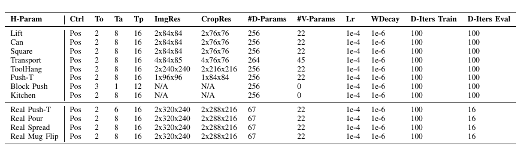

**中文表注:** 表中列出控制方式、观测窗口 T_o、动作窗口 T_a、预测窗口 T_p、图像/裁剪分辨率、扩散网络与视觉编码器参数量、学习率、权重衰减及训练/推理去噪步数。

### Table 7. Transformer-based Diffusion Policy 超参数

**Placed near:** p.15 S048
**Source:** p.15 C018

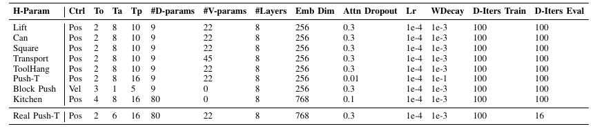

**中文表注:** Transformer 版本额外报告层数、token 嵌入维度和注意力 dropout。真实世界任务使用 DDIM 将推理去噪步数降到 16。

**Source:** p.14–15 S048

**Original:** On simulation benchmarks, iDDPM uses 100 denoising iterations for training and inference. On real-world benchmarks, DDIM reduces inference iterations to 16. Batch size is 256 for state-based experiments and 64 for image-based experiments. Cosine learning-rate scheduling with linear warmup is used; CNN warms up for 500 steps and Transformer for 1000 steps.

**中文:** 在仿真基准中，iDDPM 的训练和推理都使用 100 次去噪迭代；在真实世界基准中，DDIM 将推理迭代降为 16 次。状态实验 batch size 为 256，图像实验为 64。学习率采用带线性 warmup 的 cosine 调度；CNN warmup 500 步，Transformer warmup 1000 步。

### E. Data Efficiency and F. Observation Horizon

### Fig. 12. 观测窗口消融

**Placed near:** p.15 S049
**Source:** p.14 C019

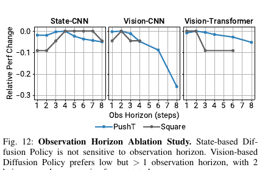

**Original caption:** State-based Diffusion Policy is not sensitive to observation horizon. Vision-based Diffusion Policy prefers low but greater-than-one observation horizon, with 2 being a good compromise for most tasks.

**中文图注:** 基于状态的 Diffusion Policy 对观测窗口不敏感；基于视觉的策略更偏好较小但大于 1 的观测窗口，2 步对多数任务是良好折中。

### Fig. 13. 数据效率消融

**Placed near:** p.15 S049
**Source:** p.14 C020

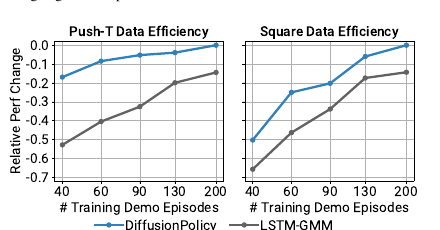

**Original caption:** Diffusion Policy outperforms LSTM-GMM at every training dataset size.

**中文图注:** 在所有训练数据规模下，Diffusion Policy 都超过 LSTM-GMM。

**Source:** p.15 S049

**Original:** Diffusion Policy outperforms LSTM-GMM at every training dataset size. State-based Diffusion Policy is insensitive to observation horizon, while vision-based policies, especially CNN, degrade as the horizon increases. An observation horizon of 2 works well for most state and image tasks.

**中文:** 在每一种训练数据规模下，Diffusion Policy 都优于 LSTM-GMM。基于状态的 Diffusion Policy 对观测窗口不敏感；基于视觉的策略，尤其是 CNN 版本，会随着观测窗口增加而性能下降。对大多数状态和图像任务，2 步观测窗口是合适选择。

### G. Performance Improvement Calculation

**Source:** p.15 S050

**Original:** For each task i, improvement_i=(max_ours_i−max_baseline_i)/max_baseline_i. The average improvement is the mean over tasks: 0.46858≈46.9%.

**中文:** 对每个任务 i，性能提升定义为 (max_ours_i−max_baseline_i)/max_baseline_i。对各任务取平均得到总体提升 0.46858≈46.9%。

### H–J. Real-world Demonstrations and Hardware

**Source:** p.15–16 S051

**Original:** Push-T uses 136 demonstrations, randomized initial poses, 10 Hz policy commands, and 125 Hz interpolated robot execution. Sauce pouring and spreading use 50 demonstrations per task, with 90% for training. Coverage is computed by projecting camera images into table space through homography. The UR5 station uses two policy cameras downsampled to 320×240 at 10 fps. The Franka station uses a quadratic-program differential-kinematics controller with collision avoidance, safety regions, and joint limits; teleoperation and learned policies run at 10 Hz, while the mid-level controller runs around 1 kHz.

**中文:** Push-T 使用 136 条示范，随机化初始姿态；策略以 10 Hz 输出命令，机器人执行端线性插值到 125 Hz。酱汁倾倒和涂抹每项任务使用 50 条示范，其中 90% 用于训练。覆盖率通过单应性将相机图像投影到桌面空间后计算。UR5 平台使用两台策略相机，输入下采样到 320×240、10 fps。Franka 平台使用基于二次规划的微分运动学中层控制器，并施加碰撞避免、安全区域和关节限制；遥操作与学习策略以 10 Hz 运行，中层控制器约以 1 kHz 运行。

## 术语表

| English term             | 中文             | 说明                                 |
| ------------------------ | ---------------- | ------------------------------------ |
| Diffusion Policy         | 扩散策略         | 用条件去噪扩散过程表示机器人策略     |
| DDPM                     | 去噪扩散概率模型 | 通过逐步加噪/去噪学习生成分布        |
| DDIM                     | 去噪扩散隐式模型 | 将训练与推理去噪步数解耦的采样方法   |
| visuomotor policy        | 视觉运动策略     | 从视觉/状态观测生成机器人动作        |
| action horizon           | 动作窗口         | 每次预测或执行的未来动作步数         |
| receding-horizon control | 滚动时域控制     | 执行部分预测序列后重新观测和规划     |
| score function           | 得分函数         | ∇_a log p(a                         |
| FiLM                     | 特征线性调制     | 以条件特征对中间激活做通道级调制     |
| multimodality            | 多模态性         | 同一观测下存在多种合理动作模式       |
| position control         | 位置控制         | 预测目标位姿/位置，而非速度增量      |
| idle action              | 空闲动作         | 示范暂停期间保持位置或近零速度的动作 |

## 阅读提示

1. **核心思想：** 将动作序列而非单步动作作为扩散模型的生成对象，并把视觉观测作为条件。
2. **为何有效：** score-based 迭代采样同时提供多模态表达、高维序列建模和无需负采样的稳定训练。
3. **工程关键：** 滚动时域控制、位置控制、端到端视觉编码器、时间序列 Transformer，以及 DDIM 推理加速。
4. **证据边界：** 论文主要验证行为克隆；作者明确指出示范质量、计算成本和高频控制仍是限制。后续问题请引用本稿的页码与锚点，例如 p.8 S035、Fig. 9、Table 5。
